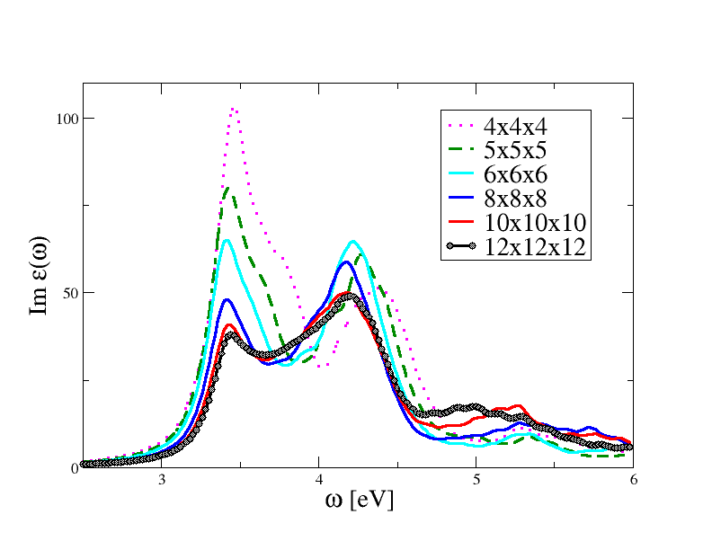

# Writing Documentation

This page is intended as a quick reference to the Markdown syntax and the extensions
available in the Abinit documentation.
Markdown can be used *almost everywhere*: user guides, tutorials, release notes, theory notes, the 
description of the input variables stored in python files inside `abimkdocs`, as well as 
in the `TEST_INFO` section of the automatic tests.

As the [original/official Markdown syntax rules](https://daringfireball.net/projects/markdown/syntax#html) &nbsp;
state:

> Markdown’s syntax is intended for one purpose: to be used as a format for writing for the web.
>
> Markdown is not a replacement for HTML, or even close to it. Its syntax is very small, corresponding only
> to a very small subset of HTML tags. The idea is not to create a syntax that makes it easier to insert HTML tags.
> In my opinion, HTML tags are already easy to insert. The idea for Markdown is to make it easy to read, write, and edit prose.
> HTML is a publishing format; Markdown is a writing format. Thus, Markdown’s formatting syntax only addresses issues
> that can be conveyed in plain text.
>
> For any markup that is not covered by Markdown’s syntax, you simply use HTML itself.

Basic Markdown syntax already covers most of our needs and the *Abinit extensions* 
([wikilinks](#wikilinks) and [Abinit extensions](#abinit-extensions))
facilitate the integration between the documentation on the website and the new developments done in the gitlab branch.
This page, for example, is entirely written in Markdown with the exception of the last 
two sections in which we discuss advanced features requiring some HTML code.

## Markdown quick reference

### Inline styles

| Markdown | Result | Extension required |
| :-- | :-- | :-- |
| `*italics*` | *italics* | --
| `**bold**` | **bold** |  --
| `***bold and italic***` | ***bold and italic*** |  --
| `` `monospace` `` | `monospace` |  --
| `~~strikethrough~~` | ~~strikethrough~~ | [Tilde](http://facelessuser.github.io/pymdown-extensions/extensions/tilde/)
| `CH~3~CH~2~OH` | CH~3~CH~2~OH |  [Tilde](https://facelessuser.github.io/pymdown-extensions/extensions/tilde/)
| `==highlight==` | ==highlight== | [Mark](http://facelessuser.github.io/pymdown-extensions/extensions/mark/)
| `^^underline me^^` | ^^underline me^^ | [Caret](https://facelessuser.github.io/pymdown-extensions/extensions/caret/)

As Markdown is not a "publishing format", providing a way to color text is out-of-scope for Markdown,
but it is possible to use raw HTML code.
For example, the following Markdown text:

```md
Some Markdown text with <span style="color:red">some *red* text</span>.
```

produces: Some Markdown text with <span style="color:red">some *red* text</span>.

For a more complete introduction to Markdown, please consult the
[Markdown Cheatsheet](https://github.com/adam-p/markdown-here/wiki/Markdown-Cheatsheet).

### Lists

Unnumbered lists are created by a **blank line** followed by a star (or a dash) for each line in the list.
For example, after a blank line, the following Markdown text:
```md
* List item A
* List item B
```

This produces

* List item A
* List item B

For numbered list, start with the numbers instead of stars:

```md
1. List item 1
2. List item 2
```

This produces

1. List item 1
2. List item 2

### Code and syntax highlighting

Blocks of code are either fenced by lines with three back-ticks ``` or are indented with **four spaces**.
For example, the Markdown text
~~~text
```
Fenced code has three back-ticks around it.
```
~~~

produces  
```
Fenced code has three back-ticks around it.
```

while indenting the code with four space, such as in

```md
    abinit < tbase1_x.files 2> log &
```

produces

    abinit < tbase1_x.files 2> log &

Fenced blocks is an alternative form that allows the specification of the language 
used for syntax highlighting.
Fortran code, for example, can be included with:

~~~text
```fortran
do ii=1, 10
  write(*,*)"Hello world"
end do
```
~~~

that is displayed as:

```fortran
do ii=1, 10
  write(*,*)"Hello world"
end do
```

To obtain inline highlighting, simply use back-ticks. As an example:
~~~text
Inline `code` has `back-ticks` around it.
~~~

produces:

Inline `code` has `back-ticks` around it.


### Tables

To create a table in Markdown use the syntax:

```md
First Header  | Second Header
------------- | -------------
Content Cell  | Content Cell
Content Cell  | Content Cell
```

that produces:

First Header  | Second Header
------------- | -------------
Content Cell  | Content Cell
Content Cell  | Content Cell


!!! warning
    If the text inside the colum contains pipes (|), enclose it with back-ticks,
    or use a `\` before the pipe.


### Figures

To include figures, use the standard Markdown syntax:

```md

```


For figures with a caption use the [markdown-figures extension](https://github.com/helderco/markdown-figures):

```md

:   Convergence of BSE optical spectrum wrt $\kk$-point sampling.
    See also [[ngkpt]] and [[shiftk]].
```


:   Convergence of BSE optical spectrum wrt $\kk$-point sampling.
    See also [[ngkpt]] and [[shiftk]].

The caption can contain Latex equations as well as [Abinit wikilinks](#wikilinks).
`#!html ` and `#!html <figure>` elements are automatically centered via CSS directives declared in `extra.css`.

<!--
!!! note
    In the two examples, the location of the png files is given by relative URLs (relative to this page). 
    In the first example we have used a root-relative URL (`/tutorial/bse_assets/tbs2_1.png`) where
    the "root" `/` corresponds to the `~abinit/doc` directory if you are running the webserver locally 
    or to the Abinit website domain if the documentation is served on the internet. 
    In the second example, we have used a relative URL (relative to this page). 
    Mkdocs will convert all Markdown URLs into relative URLs so that the website can be easily deployed.
    A concise explanation of absolute, relative and root-relative links is given 
    [here](https://mor10.com/html-basics-hyperlink-syntax-absolute-relative-and-root-relative/).
-->

If you need to customize the height and width of the image, use

```md
{: style="height:500px;width:400px"}
```

{: style="height:500px;width:400px"}

Note that this is not standard markdown but an extension provided by 
[Attribute Lists extension](https://python-markdown.github.io/extensions/attr_list/)
that adds a syntax to define attributes on the various HTML elements in markdown’s output.

### Pdf Files

Links to internal pdf files shipped with the Abinit documentation are inserted using the
base name of the pdf file and the [wikilink syntax](#wikilinks):

```
    Please consult the [[pdf:howto_chebfi]] document.
```

that gives: Please consult the [[pdf:howto_chebfi]] document.

!!! note

    The `.pdf` extension at the end of the file is optional.

This is the recommended approach to link pdf documents in the description of the input variables.
In the tutorials and in the theory notes, on the other hand, you may want to
display the pdf file directly in the HTML page.
In this case, use the HTML embed element:

```html
<embed src="../howto_chebfi.pdf" type="application/pdf" width="100%" height="480px">`
```

See the automatically generated [pdf gallery](/theory/documents) for examples.


### Videos

Links to videos can be included with the standard Markdown syntax:

```md
The video below gives an overwiew of the command line options of `runtests.py`

[](https://asciinema.org/a/40324)
```

that produces:

The video below gives an overwiew of the command line options of `runtests.py`

[](https://asciinema.org/a/40324)

More advanced features such as video galleries require a bit of HTML/CSS/JS code in the Markdown page.
See for example the [Abinit video gallery](../topics/external_resources#abinit-videos)
built with [lightGallery](http://sachinchoolur.github.io/lightGallery/).


## Links

### Markdown links 

The Markdown syntax for links is:

| Markdown | Result | Extension required |
| :-- | :-- | :--
| `[Links for videos](#videos)` | [Links for videos](#videos)  | --
| `[About topics](abimkdocs#topics)` | [About topics](abimkdocs#topics)  | --
| `[MBPT document](../theory/mbt)` | [MBPT document](../theory/mbt) | --
| `[The Abinit website](https://www.abinit.org)` | [The Abinit website](https://www.abinit.org)  | --
| `<https://www.abinit.org>` | <https://www.abinit.org> | --

This is the **recommended** approach to create links to external resources, or internal links to other pages 
of the website, especially when there is no shortcut available based on the [wikilink syntax](#wikilinks).
Links to external websites are signaled with the [fontawesome](http://fontawesome.io/) &nbsp; icon:
<i class="fa fa-external-link" aria-hidden="true"></i> (see CSS rules in *extra.css*).

Note that linking to a page that is located in the same directory is trivial in Markdown.
All the tutorials, for example, are placed in the same directory (~doc/tutorial).
To refer to the first PAW tutorial from the second tutorial, use:

    [The first PAW tutorial](paw1)

There are however cases in which we would like to have an even simpler syntax to generate automatically
links within our documentation, in particular links to:

* The input variables declared in the `abimkdocs` directory.
* The bibliographic citations declared in `abiref.bib`.
* Input files or pseudopotentials used in the Abinit test suite.
* Website pages commonly mentioned such as e.g. the [[topic:index|topics page]].

For this reason, we use the [extensions API](https://python-markdown.github.io/extensions/api) &nbsp;
provided by python Markdown to extend the syntax of the parser, using the "Wikilink" syntax.
Typical cases are discussed in the next sections.

### Wikilinks

The [wikilink syntax](https://python-markdown.github.io/extensions/wikilinks) &nbsp; is used with two pairs of square brackets and possible separators (:, # and |).
In the simple case, this gives <span style="background-color: #E0E0E0;font-size:90%;"> &#91; [name] &#93;</span> although the more general form is

<span style="background-color: #E0E0E0;font-size:90%;"> &#91; [namespace:name#section|text] &#93;</span>

where `namespace`, `section` and `text` are optional (in such case, the adequate separator should not be mentioned).
The namespace is not echoed in the Web page, while if a `text` is given, it will supercede the echo of the
`name` in the Web page (see examples below).

!!! warning

    Do not use parentheses within the pair of double brackets, the whole expression will not be recognized.

When an internal link is recognized, the wikilink string is replaced by the adequate HTML link
There are a couple of names immediately recognized:

* the name of an Abinit input variable e.g. "ecut"  (provided it is mentioned in `variables_abinit.py`)
* the name of a bibliographical reference (provided it is mentioned in `abiref.bib`)
* the path to a file in one of the `~abinit/tests/*/Input` directory
* the path to a reference output file in one of the ~abinit/tests/tuto*/Refs directories
* the label of a section inside the own file

Examples:

| Markdown | Result
| :-- | :--
| `[[ecut]]` | [[ecut]]
| `[[abinit:ecut]]` | [[abinit:ecut]]
| `[[anaddb:dipdip]]` | [[anaddb:dipdip]]
| `[[dipdip@anaddb]]` | [[dipdip@anaddb]]
| `[[cite:Amadon2008]]` | [[cite:Amadon2008]]
| `[[~abinit/tests/tutorial/Input/tbase1_1.in]]` | [[~abinit/tests/tutorial/Input/tbase1_1.in]]
| `[[tests/tutorial/Input/tbase1_1.in]]` | [[tests/tutorial/Input/tbase1_1.in]]
| `[[test:libxc_41]]` | [[test:libxc_41]]
| `[[tests/tutorial/Refs/tbase1_1.out]]` |  [[tests/tutorial/Refs/tbase1_1.out]]
| `[[~abinit/tests/tutorial/Refs/tbase1_1.out]]` |  [[~abinit/tests/tutorial/Refs/tbase1_1.out]]
| `[[~abinit/tests/Psps_for_tests/6c_lda.paw]]` | [[~abinit/tests/Psps_for_tests/6c_lda.paw]]
| `[[tests/Psps_for_tests/6c_lda.paw]]` | [[tests/Psps_for_tests/6c_lda.paw]]

The input variables for anaddb, optic and aim will be recognized if they are used with
the namespaces `anaddb`, `optic` and `aim`.
One has thus also the choice between the syntax `[[anaddb:dipdip]]` and `[[dipdip@anaddb]]`.
In the first case, only `dipdip` is echoed,  while in the second case, `dipdip@anaddb` is echoed.
This syntax is needed because there's also a `dipdip` variable in Abinit.

A wikilink that starts with `#` is interpreted as an internal link within the page hence

```md
See [[#markdown-quick-reference|this section]] for more info
```

becomes: See [[#markdown-quick-reference|this section]] for more info

although the same result can be obtained with the more readable Markdown syntax:

```md
See [this section](#markdown-quick-reference) for more info
```

To specify the name of the anchor in a bibliographic citation use the syntax with the `|` separator:

    Please consult [[cite:Gonze2016 | the last generic ABINIT article]].

that is rendered in HTML as: Please consult [[cite:Gonze2016 | the last generic ABINIT article]].

The script does a bit of formatting in these examples: it keeps one pair of square brackets
in the case of a bibliographic reference, and addd *~abinit/* in the case of a path.
The syntax `[[test:libxc_41]]` is preferable when documenting new tests in the release notes.
The python code issues a warning in the terminal if the link cannot be established.

!!! note
    Links to input files have a popover with the description of the test.
    Hovering on a citation opens a popover with the title reported in the Bibtex entry.
    Links to variables and internal files use a different font declared in *extra.css*.


### Internal links with namespace

Other internal links can be recognized thanks to the namespace.

<!--
`tutorial`, `topic`, `help`, `theorydoc, and `varset` create a link
to the corresponding Markdown files inside the `tutorials`, `topic`, `user-guide`, `vari
A first set of allowed internal namespaces are:
In such cases, provided there is a corresponding generated HTML file
that has a name that start with the namespace and end with the name, the link will be established.
-->

Examples:

Namespace      | Markdown                         | Result
-------------  | -------------------------------- |
 `tutorial`    | `[[tutorial:gw1]]`               | [[tutorial:gw1]]
 `tutorial`    | `[[tutorial:index]]`             | [[tutorial:index]]
 `topic`       | `[[topic:BSE]]`                  | [[topic:BSE]]
 `topic`       | `[[topic:index]]`                | [[topic:index]]
 `help`        | `[[help:abinit]]`                | [[help:abinit]]
 `help`        | `[[help:abinit#files-file]]`     | [[help:abinit#files-file]]
 `theory`      | `[[theory:mbt]]`                 | [[theory:mbt]]
 `varset`      | `[[varset:bse]]`                 | [[varset:bse]]
 `cite`        | `[[cite:Amadon2008]]`            | [[cite:Amadon2008]]
 `ac`          | `[[ac:abiref_nag_7.0_openmpi.ac]]` | [[ac:abiref_nag_7.0_openmpi.ac]]
 `pdf`         | `[[pdf:howto_chebfi.pdf]]`       | [[pdf:howto_chebfi.pdf]]
 `pdf`         | `[[pdf:howto_chebfi]]`           | [[pdf:howto_chebfi]]
 `src`         | `[[src:94_scfcv/m_scfcv.F90]]`   | [[src:94_scfcv/m_scfcv.F90]]


`#files-file` is an HTML id defined in *~abinit/doc/guide/abinit.md with*:

```html
<a id="files-file"></a>
## 4 More detailed presentation of the files file
```

Also in this case, it's possible to specify the name of the link 
with the `|` separator so `[[topic:PIMD#1|Introduction]]` becomes [[topic:PIMD#1|Introduction]].


!!! important
    Internal links are automatically generated by the Markdown parser
    as discussed in the [Permalinks section](#Permalinks).


Be careful when including a wikilink inside other square brackets e.g. <span style="background-color: #E0E0E0;font-size:90%;">[2+ &#91; [ecut] &#93; ]**2</span>
as the occurrence of `]]]` confuses the parser.
The problem is easily solved by inserting whitespaces in the expression:

    [ 2 + [[ecut]] ] ** 2

This version if much more readable and it also avoids possible problems with the `**` that
has a special meaning in Markdown.

To refer to a particular git commit inside a Markdown document use:

    Solved in [[gitsha:f74dba1ed8346ca586dc95fd10fe4b8ced108d5e]]

that produces: [[gitsha:f74dba1ed8346ca586dc95fd10fe4b8ced108d5e]].
This extension is useful to generate nice changelogs and [release notes](/about/release-notes).

<!--
It's also possible to mention a particular github issue with the syntax:

    Fix https://github.com/abinit/abinit/issues/1

that produces: Fix https://github.com/abinit/abinit/issues/1
-->

### External links

As for the internal wikilinks, some external links are also recognized. The following case are treated:

* a link that starts with `www.`
* the namespaces `http`, `https`, `ftp`, `file`

| Markdown | Result |
| :-- | :-- |
| `[[https://www.abinit.org]]` | [[https://www.abinit.org]]
| `https://www.abinit.org` | https://www.abinit.org

It is also possible to specify the name of the link with the `|` separator:
For example, `[[https://wiki.abinit.org|The ABINIT Wiki]]` produces [[https://wiki.abinit.org|The ABINIT Wiki]]

The markdown parser supports aliases for commonly used links.
The aliases are defined in the `mkdocs.yml` configuration file (`abimkdocs_aliases`):

| Markdown | Result |
| :-- | :-- |
| `|AbiPy|` | |AbiPy| |
| `|AbipyStructureNb|` | |AbipyStructureNb| |
| `|xmgrace|` | |xmgrace| |
| `|gnuplot|` | |gnuplot| |
| `|today|` | |today| |


### Permalinks

Permalinks are a feature of the [Table of Contents extension](https://python-markdown.github.io/extensions/toc) &nbsp;,
which is part of the standard Markdown library.
The extension inserts an anchor at the end of each headline, which makes it possible to directly link to a subpart of the document.

By default, all headers will automatically have unique id attributes generated based upon the text of the header.
The name of the anchor is constructed from the header by converting the string to lower-case ASCII, 
removing dots and other symbols such as `&` and replacing white spaces with a dash `-`.
For instance, `#pdf-files` is the anchor associated to the "Pdf Files" section
in this page and we can thus refer to it with the Markdown syntax:

```md
As we have seen in the [previous section](#pdf-files)
```

that produces: As we have seen in the [previous section](#pdf-files)

!!! tip
    Hover with the mouse on the header in the HTML page to show the permalink in the browser.
    You can also copy the link and use the last part to generate the reference.

<!--
Links to internal pages are easy to include when the website is built with Mkdocs
There are two possible approaches: *relative links* and *root-relative links*.
Let's assume, for example, that we can to insert a link to a section of `abimkdocs.md`
that is located in the `~abinit/doc/developers/` directory (the same directory as this page)
We can thus use the relative URL syntax:

```md
An example of [relative link](abimkdocs.md#getting-started)
```

that produces: An example of [relative link](abimkdocs.md#getting-started)

or, alternatively, the root-relative syntax:

```md
An example of [root-relative link](/developers/abimkdocs.md#getting-started)
```

where the path is now relative to `~abinit/doc` and must start with `/`.
Also in this case, we get the correct result:

An example of [root-relative link](/developers/abimkdocs.md#getting-started)

Note that Mkdocs converts all URLs to relative URLs so the two approaches are completely equivalent 
still the use of relative URLs is strongly suggested because developers will be able to open the link 
in their editor (provided the editor is Markdown-aware). 
-->

!!! note
    It is also possible to generate automatically the Table of Contents by just
    placing the `[TOC]` marker in the document where you would like the Table of Contents to appear.
    Then, a nested list of all the headers in the document will replace the marker.
    Note, however, that the use of `[TOC]` in our pages is not recomended as
    the Table of Contents is automatically generated by the Mkdocs theme and displayed
    in the navigation bar on the right.


## Markdown extensions

### SmartSymbols

[SmartSymbols](https://facelessuser.github.io/pymdown-extensions/extensions/smartsymbols/) &nbsp;
adds syntax for creating special characters such as trademarks, arrows, fractions, etc.
The list of symbols supported by the extension is:

Markdown       | Result
-------------- |--------
`(tm)`         | (tm)
`(c)`          | (c)
`(r)`          | (r)
`c/o`          | c/o
`+/-`          | +/-
`-->`          | -->
`<--`          | <--
`<-->`         | <-->
`=/=`          | =/=
`1/4, etc.`    | 1/4, etc.
`1st 2nd etc.` | 1st 2nd etc.


### Definition Lists

The [Definition Lists](https://python-markdown.github.io/extensions/definition_lists) &nbsp; extension 
adds the ability to create definition lists in Markdown documents.
This extension is included in the standard Markdown library.
The following text:

```md
Apple
:   Pomaceous fruit of plants of the genus Malus in
    the family Rosaceae.

Orange
:   The fruit of an evergreen tree of the genus Citrus.
```

will be rendered as:

Apple
:   Pomaceous fruit of plants of the genus Malus in
    the family Rosaceae.

Orange
:   The fruit of an evergreen tree of the genus Citrus.


### Admonitions

[Admonitions](
https://python-markdown.github.io/extensions/admonition) &nbsp; are useful
to stress important sections (useful e.g. in the Abinit tutorials).
Admonition are created using the Markdown syntax:

```md
!!! note
    Here is a note for you.
```

and

```md
!!! danger "Don't try this at home!"
    Stand back. I'm about to try science!
```

for an admonition with a custom title (make sure to quote the title).

The types of admonitions available for use in MkDocs depend on the theme being used.
The Material theme [supports](http://squidfunk.github.io/mkdocs-material/extensions/admonition/#types) &nbsp; the following types:

!!! note
    I am a "note" admonition and look the same as "seealso".

!!! tip
    I am a "tip" admonition and look the same as "hint" and "important".

!!! warning
    I am a "warning" admonition and look the same as "attention" and "caution".

!!! danger
    I am a "danger" admonition and look the same as "error".

!!! summary
    I am a "summary" admonition and look the same as "tldr".

!!! success
    I am a "success" admonition and look the same as "check" and "done".

!!! failure
    I am a "failure" admonition and look the same as "fail" and "missing".

!!! bug
    I am a "bug" admonition.


For the complete list, please consult the mkdocs-material
[documentation](http://squidfunk.github.io/mkdocs-material/extensions/admonition/).

### Details

[Detail](https://facelessuser.github.io/pymdown-extensions/extensions/details/) &nbsp;
is an extension that creates collapsible elements that hide their content.
It uses the HTML5 `#!html <details><summary>` tags to accomplish this.
It supports nesting and you can also force the default state to be open.
This extension is used in the documentation of the input variable to generate
a container with the list of tests associated to the variable but it can also be used for 
long FAQs of Q&A sections in the tutorials.

Examples:

```md
???+ note "List of variables"
     [[ecut]] [[asr@anaddb]]
```

produces the *open* element:

???+ note "List of variables"
     [[ecut]] [[asr@anaddb]]


while

```md
??? note "Click to open!"
     [[ecut]] [[asr@anaddb]]
```

creates a *closed* element:

??? note "Click to open!"
     [[ecut]] [[asr@anaddb]]


## Abinit extensions

To create a button that opens a ==dialog== containing an **input file**, use:

```
    
```

that produces:



If multiple files are used such as in:

    

a modal window with tabs is produced:




To create a ==button== that opens a modal window containing an **input file**, use:

```
    
```

that produces:



This is useful for tutorials to give direct access to the input files.
If multiple files are used such as in:

```
    
```

a modal window with tabs is produced



## MathJax

Formulas written in LaTeX are interpreted automatically (at visualization time) thanks to the
[MathJax](http://docs.mathjax.org/en/latest/mathjax.html) &nbsp; on-the-flight processor
while the math extension for Python-Markdown is provided by
[python-markdown-math](https://github.com/mitya57/python-markdown-math).

Latex equations can be used **everywhere** including the description of the variables
reported in `abinit_vars.yml` and the description of the tests gives in the `TEST_INFO` section.
For the Abinit documentation, the conventions are:

* `$...$`  yields an *onlinecite* translation of the LaTeX formula.
* `$$...$$` yields *display* mode, the LaTeX formula being rendered on one dedicated line (moreover, centered).
* To have the equations numbered, use the display mode above, and (inside the markers) declare your equation
  within the standard `\begin{equation}...\end{equation}` markers.
* When a `$` sign is inside a `#!html <pre>...</pre>` HTML section, MathJax does not interpret it.
* Use `\$` to prevent a real \$ to be interpreted.

For instance `#!latex $|\Phi\rangle$` produces $|\Phi\rangle$ while `#!latex $$\Phi_\kq(\rr)$$` produces

$$\Phi_\kq(\rr)$$

Equations enclosed by `$$...$$` or `\begin{equation}...\end{equation}` markers are automatically numbered
and can be referenced inside the Markdown text using the standard Latex syntax:

```latex
\begin{equation}
G(12) = -i \langle \Theta^N_0|T\bigl[\Psi(1)\Psi^\dagger(2)\bigr]|\Theta^N_0 \rangle \label{eq:GreenDef}
\end{equation}
```

that produces:

\begin{equation}
G(12) = -i \langle \Theta^N_0|T\bigl[\Psi(1)\Psi^\dagger(2)\bigr]|\Theta^N_0 \rangle \label{eq:GreenDef}
\end{equation}

Equations can be referenced with:

    The propagator in Eq.(\ref{eq:GreenDef})

that produces: The propagator in Eq.(\ref{eq:GreenDef})

Note that MathJax is configured with Latex macros to facilitate the insertion of symbols
commonly used in our domain:

| Markdown | Result
| :--      | :--
| `$\rr$`  | $\rr$
| `$\GG$`  | $\GG$
| `$\kk$`  | $\kk$
| `$\qq$`  | $\qq$
| `$\kq$`  | $\kq$

Please consult the preamble in `abinit_theme/main.html` for the complete list of macros.

!!! bug
    It seems that the plotly javascript library does not play well with MathJax
    as equations sometimes are not displayed when plotly is activated.
    This problem can be fixed by reloading the page.
    It should not represent a serious issue since plotly is used only in selected pages (like this one).


## Unicode

Unicode characters in particular Greek symbols and accented characters can be used in the documentation.
The websites uses the [Google's Roboto font](https://fonts.google.com/specimen/Roboto) &nbsp; so Greek symbols
can be included without using MathJax either by specifying the HTML entity or by copying the unicode character
given in the two tables below.
This could be useful if the page does not contain Latex equations and there are just a few Greek symbols to be inserted.
Please do not use unicode characters in Latex equations.

| Character Name                  | Character   | Entity       | Hex Entity     | HTML  Entity
|-------------------------------- |------------ | -------------|----------------|-------------
| GREEK CAPITAL  LETTER ALPHA	  | Α		| &‌#913; | &‌#x0391	| &‌Alpha;
| GREEK CAPITAL  LETTER BETA	  | Β		| &‌#914; | &‌#x0392	| &‌Beta;
| GREEK CAPITAL  LETTER GAMMA	  | Γ		| &‌#915; | &‌#x0393	| &‌Gamma;
| GREEK CAPITAL  LETTER DELTA	  | Δ		| &‌#916; | &‌#x0394	| &‌Delta;
| GREEK CAPITAL  LETTER EPSILON	  | Ε		| &‌#917; | &‌#x0395	| &‌Epsilon;
| GREEK CAPITAL  LETTER ZETA	  | Ζ		| &‌#918; | &‌#x0396	| &‌Zeta;
| GREEK CAPITAL  LETTER ETA	  | Η		| &‌#919; | &‌#x0397	| &‌Eta;
| GREEK CAPITAL  LETTER THETA	  | Θ		| &‌#920; | &‌#x0398	| &‌Theta;
| GREEK CAPITAL  LETTER IOTA	  | Ι		| &‌#921; | &‌#x0399	| &‌Iota;
| GREEK CAPITAL  LETTER KAPPA	  | Κ		| &‌#922; | &‌#x039A	| &‌Kappa;
| GREEK CAPITAL  LETTER LAM(B)DA  | Λ		| &‌#923; | &‌#x039B	| &‌Lambda;
| GREEK CAPITAL  LETTER MU	  | Μ		| &‌#924; | &‌#x039C	| &‌Mu;
| GREEK CAPITAL  LETTER NU	  | Ν		| &‌#925; | &‌#x039D	| &‌Nu;
| GREEK CAPITAL  LETTER XI	  | Ξ		| &‌#926; | &‌#x039E	| &‌Xi;
| GREEK CAPITAL  LETTER OMICRON	  | Ο		| &‌#927; | &‌#x039F	| &‌Omicron;
| GREEK CAPITAL  LETTER PI	  | Π		| &‌#928; | &‌#x03A0	| &‌Pi;
| GREEK CAPITAL  LETTER RHO	  | Ρ		| &‌#929; | &‌#x03A1	| &‌Rho;
| GREEK CAPITAL  LETTER SIGMA	  | Σ		| &‌#931; | &‌#x03A3	| &‌Sigma;
| GREEK CAPITAL  LETTER TAU	  | Τ		| &‌#932; | &‌#x03A4	| &‌Tau;
| GREEK CAPITAL  LETTER UPSILON	  | Υ		| &‌#933; | &‌#x03A5	| &‌Upsilon;
| GREEK CAPITAL  LETTER PHI	  | Φ		| &‌#934; | &‌#x03A6	| &‌Phi;
| GREEK CAPITAL  LETTER CHI	  | Χ		| &‌#935; | &‌#x03A7	| &‌Chi;
| GREEK CAPITAL  LETTER PSI	  | Ψ		| &‌#936; | &‌#x03A8	| &‌Psi;
| GREEK CAPITAL  LETTER OMEGA	  | Ω		| &‌#937; | &‌#x03A9	| &‌Omega;

| Character Name                  | Character   | Entity       | Hex Entity     | HTML  Entity
|-------------------------------- |------------ | -------------|----------------|-------------
| GREEK SMALL LETTER ALPHA	  | α		| &‌#945; | &‌#x03B1	| &‌alpha;
| GREEK SMALL LETTER BETA	  | β		| &‌#946; | &‌#x03B2	| &‌beta;
| GREEK SMALL LETTER GAMMA	  | γ		| &‌#947; | &‌#x03B3	| &‌gamma;
| GREEK SMALL LETTER DELTA	  | δ		| &‌#948; | &‌#x03B4	| &‌delta;
| GREEK SMALL LETTER EPSILON	  | ε		| &‌#949; | &‌#x03B5	| &‌epsilon;
| GREEK SMALL LETTER ZETA	  | ζ		| &‌#950; | &‌#x03B6	| &‌zeta;
| GREEK SMALL LETTER ETA	  | η		| &‌#951; | &‌#x03B7	| &‌eta;
| GREEK SMALL LETTER THETA	  | θ		| &‌#952; | &‌#x03B8	| &‌theta;
| GREEK SMALL LETTER IOTA	  | ι		| &‌#953; | &‌#x03B9	| &‌iota;
| GREEK SMALL LETTER KAPPA	  | κ		| &‌#954; | &‌#x03BA	| &‌kappa;
| GREEK SMALL LETTER LAM(B)DA	  | λ		| &‌#955; | &‌#x03BB	| &‌lambda;
| GREEK SMALL LETTER MU		  | μ		| &‌#956; | &‌#x03BC	| &‌mu;
| GREEK SMALL LETTER NU		  | ν		| &‌#957; | &‌#x03BD	| &‌nu;
| GREEK SMALL LETTER XI		  | ξ		| &‌#958; | &‌#x03BE	| &‌xi;
| GREEK SMALL LETTER OMICRON	  | ο		| &‌#959; | &‌#x03BF	| &‌omicron;
| GREEK SMALL LETTER PI		  | π		| &‌#960; | &‌#x03C0	| &‌pi;
| GREEK SMALL LETTER RHO	  | ρ		| &‌#961; | &‌#x03C1	| &‌rho;
| GREEK SMALL LETTER FINAL SIGMA  | ς		| &‌#962; | &‌#x03C2	|  
| GREEK SMALL LETTER SIGMA	  | σ		| &‌#963; | &‌#x03C3	| &‌sigma;
| GREEK SMALL LETTER TAU	  | τ		| &‌#964; | &‌#x03C4	| &‌tau;
| GREEK SMALL LETTER UPSILON	  | υ		| &‌#965; | &‌#x03C5	| &‌upsilon;
| GREEK SMALL LETTER PHI	  | φ		| &‌#966; | &‌#x03C6	| &‌phi;
| GREEK SMALL LETTER CHI	  | χ		| &‌#967; | &‌#x03C7	| &‌chi;
| GREEK SMALL LETTER PSI	  | ψ		| &‌#968; | &‌#x03C8	| &‌psi;
| GREEK SMALL LETTER OMEGA	  | ω		| &‌#969; | &‌#x03C9	| &‌omega;

Taken from <https://sites.psu.edu/symbolcodes/languages/ancient/greek/greekchart/>


## Plotly

[plotly](https://plot.ly/api/) &nbsp; is a high-level, declarative charting library built on top of d3.js and stack.gl.
plotly.js ships with over 20 chart types, including scientific charts, 3D graphs, statistical charts, SVG maps,
financial charts, and more.
Note that plotly is deactivated by default so you have to activate it inside the Markdown page by adding

```yaml
---
plotly: true
---
```

to the front matter.
This option will tell the browser to load the javascript library in the HTML page
so that it's possible to include HTML+javascript code to generate nice interactive plots inside the Markdown documentation.
For example the HTML + javascript code:

```html
<!-- Plots go in blank <div> elements.
     You can size them in the plot layout, or give the div a size as shown here.-->
<p>Here's a simple Plotly plot - <a href="https://bit.ly/1Or9igj">plotly.js documentation</a></p>

<div id="plotly_plot" style="width:90%;height:250px;"></div>
<script>
$(function() {
    Plotly.plot(document.getElementById('plotly_plot'), [{
        x: [1, 2, 3, 4, 5],
        y: [1, 2, 4, 8, 16] }],
        {margin: {t: 0}}
    );
});
</script>
```

produces the following plot:

<p>Here's a simple Plotly plot - <a href="https://bit.ly/1Or9igj">plotly.js documentation</a></p>

<div id="plotly_plot" style="width:90%;height:250px;"></div>
<script>
$(function() {
    Plotly.plot(document.getElementById('plotly_plot'), [{
        x: [1, 2, 3, 4, 5],
        y: [1, 2, 4, 8, 16] }],
        {margin: {t: 0}}
    );
});
</script>

plotly is used to plot the [code statistics](codestats.md) but it's not required for the proper functioning of the website.


## Using HTML directly 

HTML code can be used in Markdown but keep in mind that
standard Markdown parsers will ignore text inside block-level HTML tags so

```html
<div>
*Emphasized* text.
</div>
```

won't work (but this situation only occurs if you are trying to write some advanced HTML code).

Another thing worth noticing is that Mkdocs (by default)
generates a directory with an `index.html` file for every markdown page declared in `mkdocs.yml`
(see also [the official documentation](http://www.mkdocs.org/user-guide/configuration/#preview-controls)).
This means that a local webserver will serve this page at `http://127.0.0.1:8000/developers/markdown/index.html`
that can be equivalently reached from the more user friendly URL `http://127.0.0.1:8000/developers/markdown/`.

This implementation detail does not affect links specified either with wikilink or markdown syntax because 
the python code will perform the automatic translation of the URLs.
It does affect, however, the way you should specify `src` or `href` in HTML code because 
one should take into account the *extra directory* created by Mkdocs.
In a nutshell, **prepend** a `../` to the relative path you would use inside the shell to specify the location
of that resource with respect to the present page.

For instance, to build a Bootstrap carousel in this page using the images located in 
the `~abinit/doc/tutorial/bse_assets/` directory, one should use:

```html
<div id="myCarousel" class="carousel slide" data-ride="carousel">
  <!-- Indicators -->
  <ol class="carousel-indicators">
    <li data-target="#myCarousel" data-slide-to="0" class="active"></li>
    <li data-target="#myCarousel" data-slide-to="1"></li>
  </ol>
  <!-- Wrapper for slides -->
  <div class="carousel-inner" role="listbox">
    <div class="item active">
      
      <div class="carousel-caption">Unconverged BSE optical spectrum</div>
    </div>
    <div class="item">
      
      <div class="carousel-caption">Convergenge of BSE optical spectrum wrt k-point sampling</div>
    </div>
  </div>
  ...
  ...
</div>
```

that produces:

<div id="myCarousel" class="carousel slide" data-ride="carousel">
  <!-- Indicators -->
  <ol class="carousel-indicators">
    <li data-target="#myCarousel" data-slide-to="0" class="active"></li>
    <li data-target="#myCarousel" data-slide-to="1"></li>
  </ol>

  <!-- Wrapper for slides -->
  <div class="carousel-inner" role="listbox">
    <div class="item active">
      
      <div class="carousel-caption">Unconverged BSE optical spectrum</div>
    </div>
    <div class="item">
      
      <div class="carousel-caption">Convergenge of BSE optical spectrum wrt k-point sampling</div>
    </div>
  </div>

  <!-- Left and right controls -->
  <a class="left carousel-control" href="#myCarousel" role="button" data-slide="prev">
    <span class="glyphicon glyphicon-chevron-left" aria-hidden="true"></span>
    <span class="sr-only">Previous</span>
  </a>
  <a class="right carousel-control" href="#myCarousel" role="button" data-slide="next">
    <span class="glyphicon glyphicon-chevron-right" aria-hidden="true"></span>
    <span class="sr-only">Next</span>
  </a>
</div>

!!! warning
    Do not use root-relative URLs (e.g. `/tutorial/bse_assets/tbs5.png`) in HTML code 
    because this will create problems when the site is deployed.
    Besides relative URLs allow us to serve multiple versions of the Abinit documentation 
    associated to the different versions of the code.
