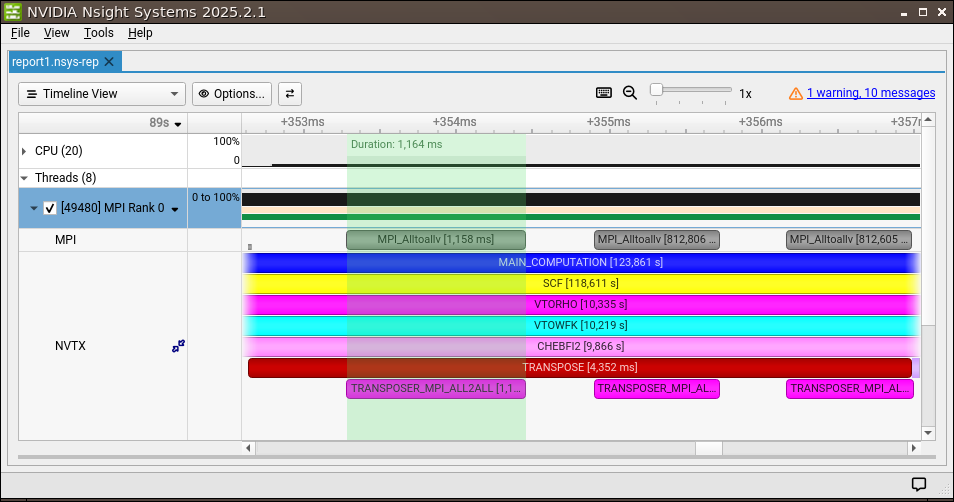

## How to profile MPI jobs using NVTX/Nsight

Among tools that analyze MPI usage and performance, it is possible to annotate source code using [NVTX](https://nvidia.github.io/NVTX/) (NVIDIA Tools Extension Library) and trace an MPI job execution as a timeline of API events per process using the profiler [NVIDIA Nsight Systems](https://developer.nvidia.com/nsight-systems). Code annotation libraries are activated by default in ABINIT when compiled on GPU, because NVIDIA CUDA Toolkit includes NVTX (and AMD includes ROCTX). As of ABINIT version 10.3.6, NVTX annotation is also supported on CPU (see *with_gpu_markers* input variable). A guide for minimal installation of selected NVIDIA developer tools required to use NVTX on CPUs is provided here. Note that we don't need to install the entire NVIDIA CUDA Toolkit to profile code on CPU.

The NVIDIA Tools Extensions (NVTX) API can be installed on Linux with:

    sudo dnf install cuda-nvtx-12

You can check the location of the installed library using the command `locate nvToolsExt`.
Environment variables must be set by adding the following lines to your .bashrc (assuming here version 12.8 has been 
installed): 

    export PATH=/usr/local/cuda-12.8/bin:$PATH
    export LD_LIBRARY_PATH=/usr/local/cuda-12.8/lib64:$LD_LIBRARY_PATH

Nsight Systems installer can be directly downloaded from NVIDIA
[website](https://developer.nvidia.com/nsight-systems/get-started). We recommend to download the Full Version for 
profiling from the GUI. A minimal installation for profiling from the CLI only is also available but not used here. 
To use NVTX API you need to link ABINIT with `nvToolsExt` .so library and activate the NVTX markers macros. This can be
achieved by adding the following lines to your `autoconf` configuration file when compiling ABINIT on CPU with autotools:

    with_gpu_markers="yes"
    abi_gpu_nvtx_v3="yes"
    GPU_LIBS="-L/usr/local/cuda-12.8/lib64 -lnvToolsExt"

Note that these lines are not needed when GPU is enabled because marker libraries are configured automatically 
from the CUDA library root. The serial profiler can be attached to individual MPI processes for 
generating a timeline of selected API events using the following command, for example here tracing MPI and NVTX events of a parallel ABINIT calculation: 
 
    mpirun -n 4 nsys profile --trace=mpi,nvtx path_to_abinit_exe path_to_input_abi

Once a report has been generated on your machine for each process, it can be opened (in single or multi-report view) 
in Nsight GUI with: 

    nsys-ui report1.nsys-rep

An output example of tracing NVTX/MPI API events on a single MPI process using NVIDIA Nsight Systems:

