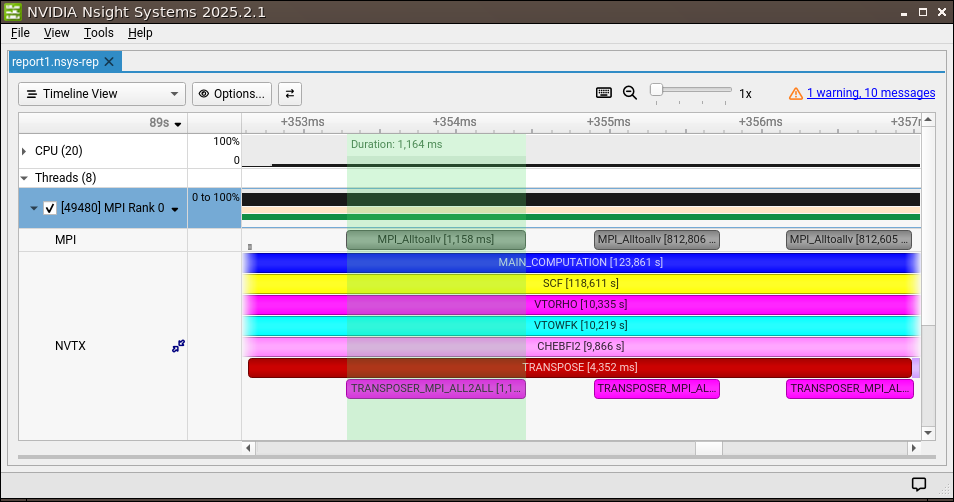
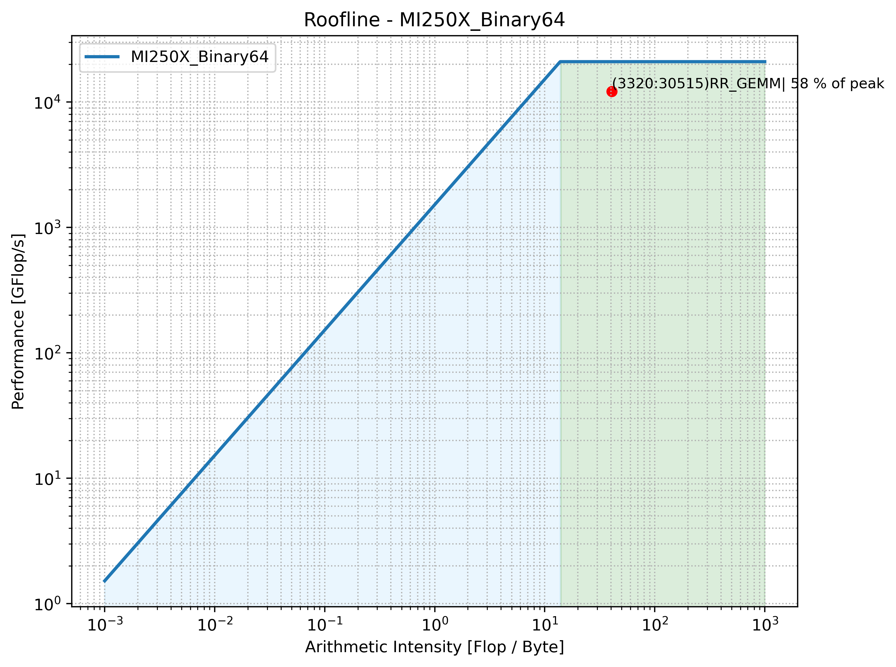

## How to profile code

Profiling is useful for identifying potential code optimizations in general and becomes an important diagnostic tool 
when porting ABINIT to GPUs in particular. To this end, several options are available to the ABINIT developer. 
An internal timer is implemented in ABINIT and its report is enabled using 
the keyword [*timopt*](https://docs.abinit.org/variables/gstate/#timopt). Memory profiling on CPU is 
activated internally using the *enable_memory_profiling* build option. In order to profile memory on GPU or to 
perform a more advanced analysis, we sometimes need to use a dedicated tool. Here, we focus on those provided by GPU 
manufacturers NVIDIA and AMD and present how developers can use them through the dedicated macros in ABINIT.

### How to profile MPI jobs using NVTX/Nsight

The first tool is not limited to GPU and presents an interest for timeline traces of parallel processes on CPU as well.
We make a general presentation for CPU while an analogous procedure applies to GPU.

Among tools that analyze MPI usage and performance, it is possible to annotate source code using 
[NVTX](https://nvidia.github.io/NVTX/) (NVIDIA Tools Extension Library) and use these annotations to trace an MPI job 
execution as a timeline of API events per process using the 
profiler [NVIDIA Nsight Systems](https://developer.nvidia.com/nsight-systems). ABINIT
implements functions for code annotation named *ABI_NVTX_START/END_RANGE(id)* enabled via the *HAVE_GPU_MARKERS* 
macro. Code annotation libraries are linked by default when ABINIT is compiled on GPU, as NVIDIA CUDA Toolkit 
includes NVTX (and AMD includes ROCTX). As of ABINIT version 10.3.6, NVTX annotation is also supported on CPU. The 
macros are enabled via the *with_gpu_markers* build option. 
A guide for minimal installation of selected NVIDIA developer tools required to use NVTX on CPUs is 
provided here. Note that we don't need to install the entire NVIDIA CUDA Toolkit to profile code on CPU.

The NVIDIA Tools Extensions (NVTX) API can be installed on Linux with:

    sudo dnf install cuda-nvtx-12

You can check the location of the installed library using the command `locate nvToolsExt`.
Environment variables must be set by adding the following lines to your .bashrc (assuming here version 12.8 has been 
installed): 

    export PATH=/usr/local/cuda-12.8/bin:$PATH
    export LD_LIBRARY_PATH=/usr/local/cuda-12.8/lib64:$LD_LIBRARY_PATH

Nsight Systems installer can be directly downloaded from NVIDIA
[website](https://developer.nvidia.com/nsight-systems/get-started). We recommend to download the Full Version for 
profiling from the GUI. A minimal installation for profiling from the CLI only is also available but not used here. 
To use NVTX API you need to link ABINIT with `nvToolsExt` .so library and activate the NVTX markers macros. This can be
achieved by adding the following lines to your `autoconf` configuration file when compiling ABINIT on CPU with 
autotools:

    with_gpu_markers="yes"
    abi_gpu_nvtx_v3="yes"
    GPU_LIBS="-L/usr/local/cuda-12.8/lib64 -lnvToolsExt"

Note that these lines are not needed when GPU is enabled because marker libraries are configured automatically 
from the CUDA library root. The serial profiler can be attached to individual MPI processes for 
generating a timeline of selected API events using the following command, for example here tracing MPI and NVTX events 
of a parallel ABINIT calculation: 

    mpirun -n 4 nsys profile --trace=mpi,nvtx path_to_abinit_exe path_to_input_abi

Once a report has been generated on your machine for each process, it can be opened (in single or multi-report view) 
in Nsight GUI with: 

    nsys-ui report1.nsys-rep

An output example of tracing NVTX/MPI API events on a single MPI process using NVIDIA Nsight Systems:

### How to profile GPU kernels using the roofline model

The roofline model can be used to visualize the achieved performance and arithmetic intensity of a GPU kernel. This 
information allows to assess whether a GPU kernel execution makes efficient use of the available compute capabilities 
of a GPU architecture, or whether it underutilizes the resources and may benefit from optimization. For instance, for
CUDA kernels, the roofline can reveal if Tensor cores are used or not. 

The roofline is generated in two steps. First, a set of required metrics is produced using 
[Nsight Compute](https://docs.nvidia.com/nsight-compute/) for CUDA kernels and 
[rocPROFv3](https://rocm.docs.amd.com/projects/rocprofiler-sdk/en/latest/how-to/using-rocprofv3.html) for 
ROCm kernels. Then, the metrics are post-processed using user-defined scripts in order to produce the roofline chart 
depending on the GPU specifications namely the peak performance and memory bandwidth. We use the Python scripts 
provided by the Adastra supercomputing center of [GENCI](https://www.genci.fr/en), equipped with AMD GPUs, to 
demonstrate how to produce rooflines for GPU kernels in ABINIT. For more information, we refer to the extensive Adastra 
user documentation on [GPU roofline](https://dci.dci-gitlab.cines.fr/webextranet/software_stack/tools/index.html#id1).

Compiling ABINIT to use with the profiler is straightforward. A production build can be used to generate roofline 
metrics, there is no need for debug build. We refer to *abinit/doc/build/GPU_InstinctMI250X+EPYC7453.ac9* for a 
recommended build configuration. ABINIT implements ROCm annotations and markers that are included in the 
profiler reports for the ease of analysis per code regions. It also implements useful macros for profiler start/stop 
calls, for both NVTX and ROCm (since version 10.8). These allow to limit the profiler execution to specific parts of 
the code and to reduce overhead. We use them for readability of the roofline in order to avoid overlapping points. 
Do not forget to set the build option *with_gpu_markers="yes"* in order to activate the macros for code annotations 
and profiler switches.

In this example, we sandwich the three GEMM operations that update the wavefunction subspace (as well as the 
Hamiltonian application and the PAW overlap application) with the computed Ritz vectors during the Rayleigh-Ritz
procedure for the Hamiltonian diagonalization. First, we add a line at the beginning 
of *src/98_main/abinit.F90* to switch off the profiler as early as possible: 

    #if defined(HAVE_GPU_MARKERS)
        NVTX_INIT()
        NVTX_PROFILER_STOP()
    #endif
    ! .. rest of the code ..

Note that *NVTX_INIT* simply fills the internal NVTX names and id arrays used to label regions, therefore putting the
stop call before or after essentially makes no difference. Next, we switch on the profiler in the region of interest in 
*src/45_xgTools/m_xg_ortho_RR.F90*: 

    #ifdef HAVE_GPU_MARKERS
    NVTX_PROFILER_START()                     ! start profiler
    #endif 

    ABI_NVTX_START_RANGE(NVTX_RR_GEMM_2)      ! start region RR_GEMM
    ! .. gemm calls ..
    ABI_NVTX_END_RANGE()                      ! end region

    #ifdef HAVE_GPU_MARKERS
    NVTX_PROFILER_STOP()                      ! stop profiler
    #endif

We recommend to allocate an entire compute node (8 GPUs for Adastra MI250X) and run a fast test case, such as a 
ground-state calculation (single SCF step) for 320 atoms of Ga2O3 with 1536 bands, a cutoff of 18 Hartree and 1 
k-point. We use a wrapper to call rocPROFv3 for the rank 0 process only and reduce profiling overhead: 

    $ cat rocprofv3_wrapper.sh
    #!/bin/bash

    if [ "${SLURM_PROCID}" == "0" ]; then
	    exec -- rocprofv3 --stats --marker-trace --kernel-trace --kernel-rename \
		    --input=counters.txt --output-format=csv -o "${OUTPUT_FILE}" \
		    -- "${@}"
    else
	    exec -- "${@}"
    fi

The *-kernel-rename* option uses the region annotation names instead of the original kernel names for readability. Note
that from ROCm version 7.14 and later, the available option *-selected-regions* allows to apply counter collection for
selected ROCTx regions, as described in the release notes 
[here](https://rocm.docs.amd.com/en/docs-7.14.0/about/release-notes.html#selective-roctx-region-profiling-with-counter-collection).
Using that option the profiler is switched off by default. In older versions, the profiler is switched on by 
default and we use the workaround described in the documentation 
[here](https://rocm.docs.amd.com/projects/rocprofiler-sdk/en/develop/how-to/using-rocprofiler-sdk-roctx.html#profiler-control-with-selected-regions). 

We create the *counters.txt* file containing the counters for binary64 profiling recommended in the Adastra
documentation (see [Performance
counters](https://dci.dci-gitlab.cines.fr/webextranet/software_stack/tools/index.html#performance-counters) section),
that we copy here for self-consistency:

    $ cat counters.txt
    pmc: TCC_EA_RDREQ_32B_sum TCC_EA_RDREQ_sum TCC_EA_WRREQ_sum TCC_EA_WRREQ_64B_sum SQ_INSTS_VALU_ADD_F64 SQ_INSTS_VALU_MUL_F64 SQ_INSTS_VALU_FMA_F64 SQ_INSTS_VALU_TRANS_F64 SQ_INSTS_VALU_MFMA_MOPS_F64

We then make the profiler call in our SLURM job as

    srun rocprofv3_wrapper.sh ${ABINIT} ga2o3.abi

The output is a counter collection stored in CSV. We post-process it in order to plot the roofline using the 
Python scripts provided in the Adastra documentation 
(see [Roofline](https://dci.dci-gitlab.cines.fr/webextranet/software_stack/tools/index.html#roofline) section).

The kernels of interest are then detected by the profiler: 3 DGEMMs with nonzero FP64 FLOPs,
3 copy kernels with zero counted FLOPs and 1 zero-initialization kernel with zero counted FLOPs. 
The three DGEMMs share the same *Kernel_Id=3320* that produces a single point in the roofline. 
The roofline shows that the GEMM call is compute-bound.

