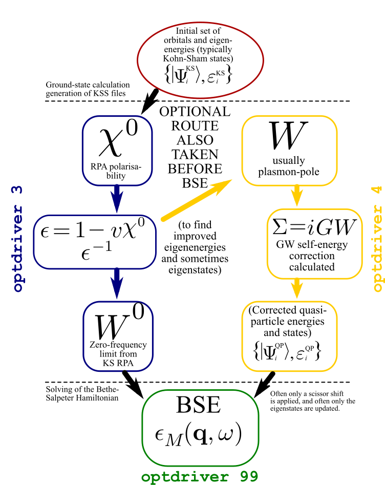

# Bethe-Salpeter equation in ABINIT  

##   

These notes provide a brief introduction to the Bethe-Salpeter (BS) formalism
outlining the most important equations involved in the theory. 
The approach used to compute the BS kernel and the macroscopic dielectric in an
implementation based on planewaves and norm-conserving pseudopotentials is also discussed.

The conventions used in the equations are explained in the [[theory:mbt|Many-body theory notes]].
A much more consistent discussion of the theoretical aspects of the Bethe-Salpeter equation can be found in
[[cite:Onida2002]] and references therein.

## 1 Optical properties and local field effects
  
Before discussing the Bethe-Salpeter problem, it is worth reminding some basic
results concerning the *ab initio* description of optical properties.

In frequency and reciprocal space, the microscopic dielectric function is
related to the irreducible polarizability by the following relation

\begin{equation} 
\ee_{\GG_1\GG_2}(\qq;\ww) = \delta_{\GG_1,\GG_2} - v(\qq, \GG_1) \tchi_{\GG_1\GG_2}(\qq;\ww) 
\end{equation} 

from which the inverse dielectric function is obtained via matrix inversion.

The *macroscopic* dielectric function, $\ee_M^{\text{LF}}(\ww)$, can be directly related
to the inverse of a single element, the first ($\GG_1 = 0, \GG_2 =0$) element
of the inverse of the *microscopic* dielectric matrix by means of:

\begin{equation}\label{eq:abs_LFE} 
\ee_M^{\text{LF}}(\ww) = \lim_{\qq \rightarrow 0} \dfrac{1}{\ee^{-1}_{0 0}(\qq,\ww)} 
\end{equation} 

The microscopic dielectric matrix is the one usually calculated within the RPA in
a GW calculation. The optical absorption spectrum is simply given by the
imaginary part of $\ee_M^{\text{LF}}(\ww)$. 
Sometimes, especially when comparing with
experimental spectra, the real part is simply called $\ee_1$ and the imaginary part $\ee_2$.

Note that above equation differs from

\begin{equation} \label{eq:abs_NLFE} 
\ee_M^{\text{NLF}}(\ww) = \lim_{\qq \rightarrow 0} {\ee_{0 0}(\qq,\ww)} 
\end{equation} 

due to the so called local-field effects introduced by the presence of the crystalline environment. 
The former quantity *with* local fields (LF) is more accurate than the latter one *without* local field (NLF). 

!!! important

    The reason the two equations are different is
    because in the first, the expression in the denominator is the first element
    of the inverse of the *whole* microscopic dielectric matrix. This element
    depends on the *entire* matrix and cannot simply be calculated by taking the
    inverse of the first element of the non-inverted matrix.

In the [[theory:mbt#RPA_Fourier_space|GW_notes]], we have discussed how
to calculate the irreducible polarizability and thus the absorption spectrum
within the random phase approximation (RPA). It turns out, however, that the
RPA dielectric function evaluated with Kohn-Sham orbitals and eigenvalues
yields absorption spectra that are in quantitative, and sometimes even in
qualitative, disagreement with experiments. This is not surprising since the
polarizability of the Kohn-Sham system is not expected to reproduce the
response of the fully interacting system.

Important discrepancies with experiment are found even when the DFT gap is
corrected by replacing the KS eigenvalues by quasiparticle energies calculated
in the GW approximation. This indicates that, as far as optical properties
are concerned, there is some important physics that is not correctly captured
by the GW approximation.

The fundamental reason for the failure of the RPA can be traced back to the
neglect of the electron-hole interaction that, in the many-body language,
should be included through the vertex function. Replacing the vertex function
with a local and instantaneous function is a too crude and unrealistic
approximation for the many-body polarizability. 

In the next section we will discuss how to obtain an improved approximation for the vertex and therefore
an improved approximation for the polarizability that takes into account many-
body effects due to the electron-hole interaction

## 2 The Bethe-Salpeter equation in a nutshell
  
A schematic picture of the different levels of the description of optical
spectra available in ABINIT is given below.

The Bethe-Salpeter theory is formulated in terms of two-particle propagators.
These are four-point functions describing the motion through the system of two
particles at once. We will label them $L^0$ and $L$, where the subscript zero
indicates that the particles are non-interacting. By restricting the starting
and ending point of the particles, the two-point contraction of $L^0$ gives
the reducible independent-particle polarizability according to

$$ \chi^0(12) = L^0(11, 22) $$ while the two-point contraction of $L$ gives
the reducible many-body polarizability $$ \hat\chi(12) = L(11, 22) $$ that
should not be confused with the *irreducible* polarizability of the many-body
system (denoted with a tilde in the formulas in the [[theory:mbt#RPA_Fourier_space|GW_notes]]).

The utility of working in terms of the reducible quantities is that the macroscopic dielectric function
*with* local field effects is obtained directly from the reducible polarizability using  

\begin{equation} 
\ee_M^{\text{LF}}(\ww) = 1 - \lim_{\qq \rightarrow 0} v(\qq)\,\tchi_{00}(\qq;\ww) 
\end{equation}

Computing the reducible $L$ directly, if possible, thus allows one to avoid
the costly matrix inversion of the dielectric function that should otherwise
be performed for each frequency.

One can show that $L$ satisfies the Dyson-like equation:

\begin{equation} 
L = L^0 + L^0 K L \Longrightarrow L = \bigl [ 1 - L^0 K]^{-1} L^0 
\end{equation} 

that involves the Bethe-Salpeter kernel $K$:

\begin{equation}\label{eq:BSE_kernel_LF} 
K(1234) = \underbrace{\delta(12)\delta(34)\bar v(13)}_{Exchange} -
\underbrace{\delta(13)\delta(24)W(12)}_{Coulomb} 
\end{equation} 

where the bar symbol signifies that the Coulomb interaction has to be taken without its
long-range Fourier component at $\GG =0$: 

\begin{equation} \begin{cases} {\bar
v(\qq)} = v(\qq) \quad {\text{if}}\; \qq \neq 0 \\\ \\\ {\bar v(\qq=0)} = 0
\end{cases} \end{equation}

As discussed in [[cite:Onida2002]], local field effects (LF) are included in the
formalism through the exchange term while the Coulomb term describes the
screened electron-hole interaction that is responsible for the creation of the
excitons. All interaction is in principle already contained in $W$, and the
rewriting of the kernel in this way is mostly an algebraic trick which allows
one to easily separate the contributions and calculate the optical spectrum
both with and without the LF.

The Dyson-like equation for $L$ becomes a matrix problem once a particular
basis set is chosen to expand the four-point functions involved in the
problem. In the standard approach, the polarisabilities and the BS kernel are
expressed in the so-called *transition* space (i.e. as products of single-particle orbitals) using:

\begin{equation} F(1234) = 
\sum_{ \substack{(n_1 n_2) \\\ (n_3 n_4)} }
\psi_{n_1}^\*(1) \psi_{n_2}(2)\, F_{ (n_1 n_2) (n_3 n_4) }\, \psi_{n_3}(3)
\psi_{n_4}^\*(4) 
\end{equation} 

and 

\begin{equation} F_{ (n_1 n_2) (n_3 n_4)
} = \int F(1234) \psi_{n_1}(1) \psi_{n_2}^\*(2) \psi_{n_3}^\*(3)
\psi_{n_4}(4) \dd (1234) \end{equation} 

where $n_i$ is a shorthand notation to denote band, **k**-point and spin index. 
The expansion is exact provided that
the set of single-particle orbitals from a complete basis set in the Hilbert space.

The main advantage of using the transition space for solving the problem is
that the RPA polarizability is diagonal in this representation

\begin{equation} 
\chi^0_{ (n_1 n_2) (n_3 n_4) } (\ww) = \dfrac{ (f_{n_2} -
f_{n_1}) } { (\ee_{n_2} - \ee_{n_1} - \ww)} \delta_{n_1 n_3} \delta_{n_2 n_4}
\end{equation} 

thus leading to a considerable simplification in the mathematical formalism.

After some algebra (see [[cite:Onida2002]] for a more complete derivation) one
finds that, in a system with an energy gap, the Dyson-like equation for $L$
can be expressed in terms of an effective two-particle Hamiltonian, $H$ , according to

\begin{equation} 
L = \bigl [ H-\ww \bigr]^{-1}\,F 
\end{equation} 

The explicit form for $H$ and $F$ in the transition space is given by 

\begin{equation}
H =
\left( 
\begin{array}{c|cc} 
  &   |v'c'\kk'\rangle & |c'v'\kk'\rangle \\ \hline 
\langle vc\kk|  & R  &  C  \\ %\hline 
\langle cv\kk|  &  -C^* & -R^*   \\
\end{array}
\right) 
\end{equation}

\begin{equation}
F =
\left( 
\begin{array}{c|cc} 
  &   |v'c'\kk'\rangle & |c'v'\kk'\rangle     \\ \hline 
\langle vc\kk|  & 1  &  0   \\ %\hline 
\langle cv\kk|  & 0  & -1   \\
\end{array}
\right) 
\end{equation}

where valence states are indicated by the indices $v$ , $v'$ while $c$ , $c'$
are used for conduction bands. The $R$ sub-matrix is Hermitian and is usually
referred to as the resonant block while $C$ (the so-called coupling block) is
a complex symmetric sub-matrix. Note that, due to the presence of the coupling
term, the BS Hamiltonian is non-Hermitian although the operator possesses a real spectrum.

The inclusion of spin in the formalism would require an extensive discussion
on its own. Here, for simplicity, we limit the analysis to the case of spin
unpolarized semiconductors ([[nsppol]]=1). In this particular case, the matrix
elements of the resonant block are given by

\begin{equation} 
R_{vc\kk,v'c'\kk'} = ( \ee_{c\kk} - \ee_{v\kk})\delta_{vv'}\delta_{cc'}\delta_{\kk\kk'} + 2 \bar v_{(vc\kk)(v'c'\kk')} -
W_{(vc\kk)(v'c'\kk')} 
\end{equation} 

with single particle transition energies on the diagonal.

The matrix elements of $v$ and $W$ are defined as:

\begin{equation} 
{\bar v}_{(n_1 n_2) (n_3 n_4)} = \delta_{\sigma_1 \sigma_2}\,
\delta_{\sigma_3 \sigma_4} \iint \psi_{n_1}(\rr) \psi^*_{n_2}(\rr) {\bar
v(\rr-\rr')} \psi_{n_3}^*(\rr') \psi_{n_4}(\rr') \dd \rr \dd \rr'
\end{equation} 

\begin{equation} 
W_{(n_1 n_2) (n_3 n_4)} = \delta_{\sigma_1
\sigma_3}\, \delta_{\sigma_2 \sigma_4} \iint \psi_{n_1}(\rr) \psi^*_{n_3}(\rr)
{W(\rr,\rr',\ww=0)} \psi^*_{n_2}(\rr') \psi_{n_4}(\rr') \dd \rr \dd \rr'
\end{equation} 

Note, in particular, that only the static limit ($\omega = 0$) of $W$ is involved in the last expression.

The coupling matrix elements are usually smaller than the resonant ones. This
is especially true in bulk systems due to the different spatial behavior of
conduction and valence states. In solid state calculations, it is therefore
common practice to ignore the $C$ block (the so-called Tamm-Dancoff approximation). 
Under this assumption the excitonic Hamiltonian is given by a Hermitian operator.

The variable [[bs_coupling]] defines whether the coupling block should be included in the calculation.

The macroscopic dielectric function is obtained by contracting the many-body
$L$ and then taking the optical limit of the $\GG = \GG' = 0$ component along
a particular direction in $\qq$-space. 
The final result reads:

\begin{equation} 
\ee_M(\ww) = 1 - \lim_{\qq \rightarrow 0} v(\qq)\,\langle
P(\qq)|\bigl[ H - \ww \bigr]^{-1}\,F |P(\qq)\rangle 
\end{equation} 

where

\begin{equation} P(\qq)_{n_1 n_2} = \langle n_2|e^{i\qq\cdot\rr}|n_1 \rangle
\underset{\qq \rightarrow 0}{ \approx} \delta_{n_1 n_2} + i \qq \cdot \langle
n_2|\rr|n_1 \rangle + O(q^2) 
\end{equation} 

is the matrix element of the dipole operator in transition space.

By default the code calculates the macroscopic dielectric function taking the
limit along six different directions in **q** -space (the three basis vectors
of the reciprocal lattice and the three Cartesian axis). It is possible to
change the default directions using the variables [[gw_nqlwl]] and [[gw_qlwl]].

## 3 Solving the Bethe-Salpeter problem
  
At this point it is clear that the evaluation of the macroscopic dielectric
function within the BS formalism is a two-step process:

  1. Construction of the $H$ matrix in the transition space.   

  2. Computation of the macroscopic dielectric function using the two equations reported at the end of the previous section. 

The flowchart of a typical Bethe-Salpeter run is schematically depicted in the diagram below:

The WFK file is represented with an ellipsis. The path on the left indicated
with blue arrows represents the RPA calculation ([[optdriver]]=3) that
produces the SCR file (see also the [[tutorial:gw1|GW1 tutorial]]).
Once the WFK and the SCR file are available, we can finally construct the
Hamiltonian and solve the Bethe-Salpeter problem (the rectangle at the bottom of the flowchart).

For BS computations, it is common practice to simulate the self-energy
corrections by employing the scissors operator whose value can be obtained
either from experiments or from ab-initio calculations. 
The scissors operator allows one to avoid a costly GW calculation that should performed for all
the $\kk$-points and bands included in the transition space (the optional
path on the right indicated with yellow arrows that corresponds to [[optdriver]]=4).

The construction of the Hamiltonian matrix represents a significant portion of
the overall CPU time due to the large number of transitions needed for an
accurate description of the frequency-dependence of the polarizability. On the
other hand, also the calculation of the macroscopic dielectric function poses
numerical difficulties since an expensive matrix inversion should be performed for each frequency.

The code implements different methods proposed in the literature to avoid the
matrix inversion for each frequency. The variable [[bs_algorithm]] is used to
select among the different possibilities.

[[bs_algorithm]]=1 employs standard (Sca)LAPACK routines to obtain the
spectral representation of $H$ in terms of eigenvalues and right eigenvectors of $H$:

\begin{equation} 
\begin{cases} H |\lambda\rangle = \ee_\lambda |\lambda\rangle
\\\ \\\ O_{\lambda\lambda'} = \langle\lambda|\lambda'\rangle \\\ \\\ H =
\sum_{\lambda \lambda'} \ee_\lambda |\lambda\rangle O_{\lambda \lambda'}
\langle\lambda'| \end{cases} 
\end{equation} 

Then, as discussed in [[cite:Albrecht1998]], the inverse of $H - \ww$ is obtained according to 

\begin{equation} \bigl[ H -\ww
\bigr]^{-1} = \sum_{\lambda \lambda'} |\lambda\rangle \dfrac{O_{\lambda
\lambda'}^{-1}}{(\ee_\lambda - \ww)} \langle\lambda'| 
\end{equation} 

We do not elaborate this point further since the direct diagonalization is advantageous
only in particular circumstances, as explained in the documentation.

[[bs_algorithm]] = 2 avoids the diagonalization using an iterative algorithm
that constructs a basis set in which $H$ is represented by a real symmetric
tridiagonal matrix [[cite:Haydock1980]].
Without entering into detail, one can schematically
represent the Haydock technique as an algorithmic procedure that transforms a
dense (hermitian) matrix into a sparse (tridiagonal) one:

\begin{equation}
 R = R^\* =
\begin{pmatrix}
*  & *  & * & *  & * \\
*  & *  & * & *  & * \\
*  & *  & * & *  & * \\
*  & *  & * & *  & * \\
*  & *  & * & *  & *
\end{pmatrix}
\Longrightarrow
\begin{pmatrix}
a_1 & b_2 &     &   &  \\
b_2 & a_2 & b_3 &   &  \\
    & b_3 & *   & * &  \\
    &     & *   & * & * \\
    &     &     & * & * 
\end{pmatrix}
\end{equation}

Once the coefficient of the tridiagonal form are know, the
macroscopic dielectric function is evaluated in terms of the continued fraction: 

\begin{equation} 
\ee(\ww) \propto \cfrac{1} {\ww - a_1 - \cfrac{b_2^2}{\ww - a_2 - \cfrac{b_3^2}{\cdots}}} 
\end{equation} 

where a small complex shift, defined by [[zcut]], is used to avoid the singularities along the real axis. 
The number of iteration required to converge is almost
independent on the size of the problem, usually of the order of 100-200
iterations. The algorithm involves simple matrix-vector multiplications that
are efficiently performed with BLAS calls and, most importantly, are easy to parallelize. 
Another distinct advantage is that the Haydock method is less
memory demanding than the direct diagonalization since only three temporary
vectors are required instead of the full set of eigenvectors.

Note that the original formulation of the method presented in [[cite:Haydock1980]]
assumes an Hermitian operator thus it can be used only for TDA calculations.
We refer the reader to [[cite:Gruning2009]] for a generalization of the method to
the case in which the coupling term cannot be neglected. The main drawback of
the method is that it does not give direct access to the excitonic spectrum
hence it cannot be used to calculate binding energies or to plot the excitonic
wavefunctions. Moreover, for the time being, [[bs_algorithm]] = 2 cannot be used
for calculations in which the coupling term is included.

[[bs_algorithm]] = 3 employs a standard conjugate-gradient method to calculate the
lowest eigenstates of the Hamiltonian. 
At present, this method is still under testing and does not support calculations with the coupling term.

## 4 Kernel matrix elements in reciprocal space
  
Our implementation employs planewaves to expand the periodic part of the Bloch
states, $u$ , and the two-point function $W(\rr,\rr')$ that becomes a $\qq$-dependent matrix in reciprocal-space.
The conventions used for the transforms are documented in [this section](mbt.md#notations) of the $GW$ notes.

The matrix elements of the exchange term are evaluated in reciprocal space using:

\begin{equation} 
{\bar v}_{(vc\kk) (v'c'\kk')} = \dfrac{1}{V} \sum_{\GG \neq
0} {\bar v}(\GG) \; \langle c\kk |e^{i\GG\cdot\rr} |v\kk \rangle \langle
v'\kk'|e^{-i\GG\cdot\rr}|c'\kk' \rangle 
\end{equation} 

while the Coulomb term is calculated according to 

\begin{equation} 
W_{(vc\kk) (v'c'\kk')} =
\dfrac{1}{V} \sum_{\GG_1\GG_2} W_{\GG_1\GG_2}(\kk'-\kk,\ww=0) \langle
v'\kk'|e^{i(\qq +\GG_1)\cdot \rr}|v\kk \rangle \langle c \kk
|e^{-i(\qq+\GG_2)\cdot\rr} |c'\kk' \rangle 
\end{equation} 

The number of $\GG$-vectors in $W$ and in the modified Coulomb interaction is specified through
[[ecuteps]] while the wavefuctions entering the oscillator matrix elements are
expanded on a $\GG$-sphere of energy [[ecutwfn]]. 
The computation of the oscillator matrix elements is discussed in 
[[theory:mbt#oscillator_notes|this section]] of the GW Notes.

The input variable [[bs_exchange_term]] can be used to disable the computation
of the exchange term, this option is mainly used for performing optical
calculations without local field effects. The variable [[bs_coulomb_term]]
governs the computation of the Coulomb term, the most CPU-demanding part due
to the presence of the double sum over $\GG$ -vectors.

It is also important to stress that, in the two equations above, the **k**-point 
index runs over the full Brillouin zone hence the size of the
Hamiltonian is defined by the number of point in the full Brillouin zone and
not by the number of points in the irreducible wedge.

## 5 Matrix elements of the dipole operator
  
The accurate calculation of optical properties require the correct treatment
of the optical limit ($\GG = 0, |\qq| \rightarrow 0$) of the oscillator matrix
elements. The computation of these terms deserves some clarification, due to
the presence of the fully nonlocal pseudopotential term in the Kohn-Sham
Hamiltonian.

A linear expansion up to the first order in **q** of the oscillator matrix element results in:

\begin{equation} 
\langle b_1,\kmq|e^{-i\qq\cdot\rr}|b_2,\kk \rangle
\underset{\qq \rightarrow 0}{\approx} -i\,\qq\cdot \langle b_1,\kk|\rr|b_2,\kk
\rangle + \mcO(q^2) 
\end{equation} 

where we have assumed $b_1 \neq b_2$ and the difference between the two wave functions 
at $\kk - \qq$ and $\kk$ has been
neglected because it only introduces terms that are quadratic in $\qq$.

Unfortunately, the above expression cannot be directly used because the matrix
elements of the position operator are ill-defined when wavefunctions obey
Born-von Karman periodic boundary conditions. For this reason, the first order
contribution has to be evaluated using the equivalent expression [[cite:Baroni1986]]

\begin{equation} 
\langle b_1,\kmq|e^{-i\qq\cdot\rr}|b_2,\kk\rangle
\underset{\qq \rightarrow 0}{\approx} \dfrac{ \langle b_1,\kk|-i\qq\cdot\nabla
+ i\qq\cdot \bigl[V_{\text{nl}},\rr\bigr]|b_2,\kk \rangle } {
\varepsilon_{b_2\kk} - \varepsilon_{b_1\kk} } 
\end{equation} 

The term involving the momentum operator is efficiently evaluated in reciprocal space
with linear scaling in [[npwwfn]] while the treatment of the nonlocal part of
the pseudopotential is more involved and much more CPU-demanding.

The role played by this additional term is usually marginal in the case of GW
calculations: the QP corrections are obtained by performing an integration in
$\qq$-space and only the $\qq \rightarrow 0$ component of the inverse dielectric
matrix is affected by the commutator of the non-local part of the pseudopotential.

For this reason it is common practice, especially during the GW convergence
tests, to neglect this contribution by setting [[inclvkb]] = 0. 
Strictly speaking, however, this approximation is justified only in the case of
calculations in bulk crystals provided that the BZ sampling is well converged.
Particular care has to be taken when performing GW calculations in non-periodic systems 
due to the reduced dimensionality of the BZ.

!!! important

    The commutator of the nonlocal part should ALWAYS be included
    when studying optical properties, both at the RPA and at the BS level.
