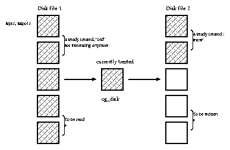

Representation and conversion of one wavefunction
ABINIT data structures and their theoretical justifications

## Notations and theoretical considerations

A Bloch wavefunction characterized by a wavevector ${\kk}$ is such that

$$ \psi_{\bf k}({\bf r}) = u_{\bf k}({\bf r}) e^{i2\pi {\bf k}\cdot{\bf r}} $$

where $u_{\bf k}({\bf r})$ is periodic, that is

$$ u_{\bf k}({\bf r}+{\bf R}_{latt})=u_{\bf k}({\bf r}) $$

where ${\bf R}_{latt}$ is a vector of the real space lattice.

Representation by plane waves

\begin{eqnarray*}
u_{\bf k}({\bf r})&=&\sum_{\bf G}c_{\bf k}({\bf G})e^{i2\pi {\bf G}\cdot{\bf r}} \\
\psi_{\bf k}({\bf r})&=&\sum_{\bf G}c_{\bf k}({\bf G})
e^{i2\pi ({\bf k}+{\bf G})\cdot{\bf r}}
\end{eqnarray*}

Normalisation

$$ \sum_{\bf G}|c_{\bf k}({\bf G})|^2 = 1 $$

For a **spinor** wavefunction, there is an additional variable, 
the spin $\sigma$ that can take two values, that is $\sigma=\uparrow$ (spin up) 
or $\sigma=\downarrow$ (spin down).
The following relations hold:

\begin{eqnarray*}
u_{\bf k}({\bf r},\sigma)&=&\sum_{\bf G}c_{\bf k}({\bf G},\sigma)
e^{i2\pi {\bf G} \cdot {\bf r}} \\
\psi_{\bf k}({\bf r},\sigma)&=&\sum_{\bf G}c_{\bf k}({\bf G},\sigma)
e^{i2\pi({\bf k}+{\bf G})\cdot{\bf r}} \\
\sum_{\sigma}\sum_{\bf G}|c_{\bf k}({\bf G},\sigma)|^2&=&1
\end{eqnarray*}

## Properties of the wavefunctions (scalar case)

For ground-state wavefunctions, there is the Schr\"{o}dinger equation

$$ H |\psi_{n{\bf k}}\ra = \varepsilon_{n{\bf k}}|\psi_{n{\bf k}}\ra $$

where $H$ is the Hamiltonian operator, $n$ labels the state (or the band), $\varepsilon_{n{\bf k}}$ is the eigenvalue.

As the wavevector labelling of an eigenstate comes from the property

$$ \psi_{\bf k}({\bf r}+{\bf R}_{latt})=e^{i2\pi{\bf k}{\bf R}_{latt}} \psi_{\bf k}({\bf r}) $$

in which ${\bf k}$ can be replaced by ${\bf k}+{\bf G}_{latt}$ where
${\bf G}_{latt}$ is any reciprocal space lattice vector, we can
*choose* the wavefunctions at ${\bf k}$ and ${\bf k}+{\bf G}_{latt}$
to be equal, or to make a linear combination of wavefunctions with the same energy. 

We introduce the notation **L.C.** when linear combinations
are allowed when equating two wavefunction.

$$
\psi_{n({\bf k} + {\bf G}_{latt})}({\bf r}) & \stackrel{\rm L.C.}{=} & \psi_{n{\bf k}}({\bf r})
$$

When there is no specific reason to prefer a linear combination, the
equality relation will be used. This is a choice of **gauge**.
Note that a phase factor might be allowed in taking the linear combination.

The ${\bf k} \leftrightarrow {\bf k}+{\bf G}_{latt}$ correspondence translates to

$$
u_{n({\bf k}+{\bf G}_{latt})}({\bf r})\cdot
e^{i2\pi {\bf G}_{latt}\cdot{\bf r}}&\stackrel{\rm L.C.}{=}&
u_{n{\bf k}}({\bf r}) \\
c_{n({\bf k}+{\bf G}_{latt})}({\bf G}-{\bf G}_{latt})
&\stackrel{\rm L.C.}{=}&c_{n{\bf k}}({\bf G}) \\
$$

The time-reversal symmetry (non-magnetic case) of the Hamiltonian gives the following relation

$$
\psi_{n{\bf k}}({\bf r})&\stackrel{\rm L.C.}{=}&\psi^{*}_{n(-{\bf k})}({\bf r}) \\
u_{n{\bf k}}({\bf r})&\stackrel{\rm L.C.}{=}&u^{*}_{n(-{\bf k})}({\bf r}) \\
c_{n{\bf k}}({\bf G})&\stackrel{\rm L.C.}{=}&c^{*}_{n(-{\bf k})}(-{\bf G})
$$

For the ${\bf k}$ wavevectors that are half a reciprocal lattice vector
$(2{\bf k}={\bf G}_{latt})$, there is a special relationship between coefficients of the wavefunction:

$$
c_{n{\bf k}}({\bf G}) \stackrel{\rm L.C.}{=} c_{n({\bf k}-{\bf G}_{latt})}
({\bf G}+{\bf G}_{latt})
\stackrel{\rm L.C.}{=} c_{n(-{\bf k})}({\bf G}+{\bf G}_{latt})
\stackrel{\rm L.C.}{=} c^{*}_{n{\bf k}}(-{\bf G}-{\bf G}_{latt})
$$

That is, coefficients at ${\bf G}$ and $-{\bf G}-{\bf G}_{latt}$ are related.
This will allow to decrease by a factor of 2 the storage space for these
specific ${\bf k}$ points.

## Properties of the wavefunctions (spinor case)

One must distinguish two classes of Hamiltonians:

1. the Hamiltonian is spin-diagonal
2. the Hamiltonian mixes the spin components

In the first class, one finds usual non-spin-polarized, non-spin-orbit
Hamiltonians, in which case the spin up-spin up and spin down-spin down parts of the Hamiltonian 
are equal, as well as spin-polarized
Hamiltonian when the magnetic field varies in strength but *not* in direction.
In the second class, one finds Hamiltonians that include the
spin-orbit splitting as well as non-collinear spin systems.

In the first class, the wavefunctions can be made entirely of *either* spin-up components *or* spin-down
components, and treated independently of those made of opposite spin.
This corresponds to [[nsppol]] = 2.
In the second class, one must stay with spinor wavefunctions.
This corresponds to [[nspinor ]] = 2.

These two classes are mutually exclusive. The possibilities are thus:

 nsppol      | nspinor     | wavefunction type
------------ | ----------- | -----------------
   1         |     1       |   scalar wavefunctions
   2         |     1       |   spin-polarized wavefunctions
   1         |     2       |   spinor wavefunctions


The inclusion of spin-orbit coupling in the Hamiltonian requires [[nspinor]] = 2


## Plane wave basis set sphere

In order to avoid dealing with an infinite number of plane waves
$e^{i2\pi({\bf k}+{\bf G})r}$ to represent Bloch wavefunctions,
one selects those with a kinetic energy lower than some cutoff $E_{\rm kin-cut}$.
The set of allowed ${\bf G}$ vectors will be noted by ${\bf G}_{{\bf k},E_{\rm kin-cut}}$

$$
{\bf G}_{latt}\in \{{\bf G}\}_{{\bf k},E_{\rm kin-cut}}
\;\mbox{if}\; \dfrac{(2\pi)^{2}({\bf G}_{latt}+{\bf k})^{2}}{2} < E_{\rm kin-cut}
$$

Expressed in reduced coordinates:

$$
\frac{(2\pi)^{2}}{2} \sum_{ij}({\bf G}^{red}_{latt,i}+{\bf k}^{red}_{i})
{\bf G}^{met}_{ij}({\bf G}^{red}_{latt,j}+k^{red}_{j}) < E_{\rm kin-cut}
$$

The kinetic energy cut-off is computed from the input variables [[ecut]] and [[dilatmx]]
to give the effective value:

$$ {\text{ecut_eff}} = {\text ecut} * ({\text dilatmx}) ** 2 $$

For ``time-reversal ${\bf k}$-points'' ($2{\bf k}={\bf G}_{latt}$), not all coefficients must be stored. 
A specific storage mode, governed by the input variable [[istwfk]] has been
introduced for the following ${\bf k}$ points:

$$
\Bigl(0, 0, 0\Bigr), 
\left(0, 0, \frac{1}{2}\right),
\left(0, \frac{1}{2}, 0\right),
\left(0, \frac{1}{2}, \frac{1}{2}\right),
\left(\frac{1}{2}, 0, 0,\right),
\left(\frac{1}{2}, 0, \frac{1}{2}\right),
\left(\frac{1}{2}, \frac{1}{2}, 0\right),
\left(\frac{1}{2}, \frac{1}{2}, \frac{1}{2}\right)
$$

For these points, the number of ${\bf G}$ vectors to be taken into account,
is decreased by about a factor of 2.
For the ${\bf G}$'s that are not treated, the coefficients
$c_{n{\bf k}}({\bf G})$ can be recovered from those that are treated, thanks to 

$$ c_{n{\bf k}}({\bf G}) = c^{*}_{n{\bf k}}(-{\bf G}-{\bf G}_{latt}) $$

The value of [[istwfk]] is automatically computed by the code 
on the basis of the k-point coordinates and the treatment of time-reversal symmetry
as specified by [[kptopt]].
One can disable the time-reversal tricks in the input file by setting explicitly the value of [[istwfk]]
with the syntax:

```
istwfk *1
```

The number of plane waves is {\text npw}
For ${\text ipw}=1\cdots {\text npw}$, the reduced coordinates of ${\bf G}$
are contained in the array {\text kg}:

$$
\mbox{these are integer numbers}
\cases{
  {\bf G}^{red}_{1}=& {\text kg}(1,{\text ipw}) \cr
  {\bf G}^{red}_{2}=& {\text kg}(2,{\text ipw}) \cr
  {\bf G}^{red}_{3}=& {\text kg}(3,{\text ipw}) \cr
}
$$

This list of ${\bf G}$ vectors is computed in the routine {\text kpgsph.f}.
The maximum number of $\GG$-vectors over all k-points is called [[mpw]] inside the code. 

[To be continued: explain the time reversed $k$-point structure]

## FFT grid and FFT box

For the generation of the density from wavefunctions, as well as for
the application of the local part of the potential, one needs to be
able to compute $\psi_{n{\bf k}}({\bf r})$ or $u_{n{\bf k}}({\bf r})$
for a 3D-mesh of ${\bf r}$-points, extremely fast, from the values $c_{n{\bf k}}({\bf G})$.

!!! note

    spin up and spin down parts can be treated separately in this
    operation, so they do not need to be specified otherwise in this section.

The FFT algorithm starts from values of a function

$$
z (j_{1},j_{2},j_{3}) \, \mbox{for} \,
j_{1}=0\cdots(N_{1}-1),j_{2}=0\cdots(N_{2}-1),j_{3}=0\cdots(N_{3}-1)
$$

and compute fast the transformed

$$
\tilde{z}(l_{1},l_{2},l_{3}) \, \mbox{for} \,
l_{1}=0\cdots(N_{1}-1),l_{2}=0\cdots(N_{2}-1),l_{3}=0\cdots(N_{3}-1)
$$

with

$$
\tilde{z}(l_{1},l_{2},l_{3})=\sum_{j_{1},j_{2},j_{3}} z(j_{1},j_{2},j_{3})
e^{i2\pi\left(\frac{j_{1}l_{1}}{N_{1}}+\frac{j_{2}l_{2}}{N_{2}}+\frac{j_{3}l_{3}}{N_{3}}\right)}
$$

We want, on a FFT grid, the values of $u_{\bf k}({\bf r})$ for

\begin{eqnarray*}
r^{red}_{1}&=&\frac{0}{N_{1}},\frac{1}{N_{1}},\cdots
\frac{N_{1}-1}{N_{1}}\left(=\frac{l_{1}}{N_{1}}\right) \\
r^{red}_{2}&=&\frac{0}{N_{2}},\frac{1}{N_{1}},\cdots
\frac{N_{2}-1}{N_{2}}\left(=\frac{l_{2}}{N_{2}}\right) \\
r^{red}_{3}&=&\frac{0}{N_{3}},\frac{1}{N_{3}},\cdots
\frac{N_{3}-1}{N_{3}}\left(=\frac{l_{3}}{N_{3}}\right)
\end{eqnarray*}

(the choice of $N_{1},N_{2},N_{3}$ is not discussed here.)

Note that we do not want $u_{k}(r)$ **everywhere**: 
these specific values allow to use the FFT algorithm. 
The effect of $G^{red}_{1}$ or $G^{red}_{1}+N_{1}$ (or any value of $G^{red}_{1}$ modulo $N$) will be similar.

\begin{eqnarray*}
u_{{\bf k}}({\bf r})&=&\sum_{\bf G} c_{\bf k}({\bf G})
e^{i2\pi {\bf G} \cdot {\bf r}} \\
 &=&\sum_{\bf G} c_{\bf k}({\bf G}) e^{i2\pi(G^{red}_{1}r^{red}_{1} +
G^{red}_{2}r^{red}_{2} + G^{red}_{3}r^{red}_{3})}
\end{eqnarray*}

Let us represent $u_{\bf k}({\bf r})$ by the segment
{\tt wf\_real} $(1:2,1:N_{1},1:N_{2},1:N_{3})$
where the first index refer to the real or imaginary part and the
three others to the integer values $l_{1}+1,l_{2}+1,l_{3}+1$

Let us map the $c_{\bf k}({\bf G})$ coefficients on a similar segment\\
 {\tt wf\_reciprocal}$(1:2,1:N_{1},1:N_{2},1:N_{3})$ \\
with a similar meaning of {\tt wf\_reciprocal}$(1:2,j_{1}+1,j_{2}+1,j_{3}+1)$:

\begin{eqnarray*}
j_{1}&=&{\tt mod}({\bf G}^{red}_{1},N_{1}) [\Rightarrow j_{1}\in[0,N_{1}-1]]\\
j_{2}&=&{\tt mod}({\bf G}^{red}_{2},N_{2}) \\
j_{3}&=&{\tt mod}({\bf G}^{red}_{3},N_{3})
\end{eqnarray*}

Then:

\begin{eqnarray*}
\lefteqn{
{\tt wf\_real}(\cdot ,l_{1}+1,l_{2}+1,l_{3}+1)}  \\
&=& \sum^{N_{1}-1}_{j_{1}=0}
\sum^{N_{2}-1}_{j_{2}=0} \sum^{N_{3}-1}_{j_{3}=0} {\tt wf\_reciprocal}
(\cdot ,j_{1}+1,j_{2}+1,j_{3}+1) \times
e^{i2\pi(\frac{j_{1}l_{1}}{N_{1}}+\frac{j_{2}l_{2}}{N_{2}}+\frac{j_{3}l_{3}}{N_{3}})}
\end{eqnarray*}

This is, up to the array indexing convention, precisely the operation done by the FFT algorithm.

For FFT efficiency (minimisation of cache conflicts), the arrays
{\tt wf\_real} and {\tt wf\_reciprocal} are not dimensioned
{\tt wf}$(2,N_{1},N_{2},N_{3})$, but {\tt wf}$(2,N_{4},N_{5},N_{6})$ where\\
\hspace{15ex}if $N_{1}$ even, $N_{4}=N_{1}+1$; if $N_{1}$ odd, $N_{4}=N_{1}$ \\
\hspace{15ex}if $N_{2}$ even, $N_{5}=N_{2}+1$; if $N_{2}$ odd, $N_{5}=N_{2}$ \\
\hspace{15ex}if $N_{3}$ even, $N_{6}=N_{3}+1$; if $N_{3}$ odd, $N_{6}=N_{3}$ \\

The FFT mesh is given by [[ngfft]]. 
PAW requires an additional **dense** FFT mesh for densities and potentials called [[ngfftdg]].


## Wavefunctions and spatial symmetries

If some spatial symmetry operation commutes with the Hamiltonian:

$$ [H,S_{\bf t}]=0 $$

then

\begin{eqnarray*}
H|\psi\ra = \varepsilon|\psi>&\Rightarrow&
S_{\bf t}H|\psi\ra = \varepsilon S_{t}|\psi\ra \\
 &\Rightarrow& H[S_{\bf t}|\psi\ra] = \varepsilon[S_{\bf t}|\psi]
\end{eqnarray*}

$S_{\bf t}|\psi\ra$ is also an eigenvector, with the same eigenvalue as $|\psi\ra$.

However its wavevector is different:

\begin{eqnarray*}
\psi_{n{\bf k}}({\bf r}+{\bf R}) &=&
 e^{i2\pi {\bf k} {\bf R}} \psi_{n{\bf k}}({\bf r}) \\
\Rightarrow (S_{\bf t} \psi_{n{\bf k}})({\bf r}+{\bf R})&=&
\psi_{n{\bf k}}((S_{\bf t})^{-1}({\bf r}+{\bf R})) \\
 &=&\psi_{n{\bf k}}(\sum_{\beta}S^{-1}_{\alpha\beta}(r_{\beta}+R_{\beta}-t_{\beta})) \\
 &=&\psi_{n{\bf k}}(\sum_{\beta}S^{-1}_{\alpha\beta}(r_{\beta}-t_{\beta})+\sum_{\beta}S^{-1}_{\alpha\beta}R_{\beta}) \\
 &=&\psi_{n{\bf k}}((S_{t})^{-1}({\bf r})+\sum_{\beta}S^{-1}_{\alpha\beta}R_{\beta}) \\
\noalign{\hbox{($S^{-1}_{\alpha\beta} R_{\beta}$ must be a vector of the real space lattice if $S_{t}$ leaves the lattice invariant)}}
 &=&e^{i2\pi \sum_{\alpha\beta} k_{\alpha}
S^{-1}_{\alpha\beta} R_{\beta}} \psi_{n{\bf k}}((S_{t})^{-1}({\bf r})) \\
 &=&e^{i2\pi {\bf k}'\cdot{\bf R}}(S_{\bf t}\psi_{n{\bf k}})({\bf r})
\end{eqnarray*}

where $({\bf k}')_{\alpha} = \sum_{\beta} S^{-1}_{\beta\alpha} k_{\beta}$

For a vector in the reciprocal space

$$ ({\bf k}')_{\beta} = (S_{\bf t}({\bf k}))_{\beta} = \sum_{\beta} S^{-1}_{\beta\alpha} k_{\beta} $$

i.e. the inverse transpose of $S_{\alpha\beta}$ is used.

The preceeding result means

\begin{eqnarray*}
\psi_{n(S^{-1,t}{\bf k})}
 &\stackrel{\rm L.C.}{=}& (S_{t}\psi_{n{\bf k}})({\bf r}) \\
 &\stackrel{\rm L.C.}{=}& \psi_{n{\bf k}} (\sum_{\beta}
 S^{-1}_{\alpha\beta}(r_{\beta}-t_{\beta}))
\end{eqnarray*}

\begin{eqnarray*}
&\Longrightarrow& u_{n(S^{-1,t} k)}({\bf r}) e^{i2\pi \sum_{\alpha\beta}
S^{-1,t}_{\alpha\beta} k_{\beta} r_{\alpha}} \stackrel{\rm L.C.}{=}
e^{i2\pi \sum_{\alpha\beta} k_{\alpha}
S^{-1}_{\alpha\beta}(r_{\beta}-t_{\beta})} \times u_{n{\bf k}}(\sum_{\beta}
S^{-1}_{\alpha\beta}(r_{\beta}-t_{\beta})) \\
&\Longrightarrow& u_{n(S^{-1,t} k)}({\bf r}) \stackrel{\rm L.C.}{=}
e^{-i2\pi \sum_{\alpha\beta} k_{\alpha} S^{-1}_{\alpha\beta}
t_{\beta}} u_{nk}(\sum_{\beta}
S^{-1}_{\alpha\beta}(r_{\beta}-t_{\beta})) \\
&\Longrightarrow& \sum_{{\bf G}} c_{n(S^{-1,t}k )}({\bf G})
 e^{i2\pi{\bf G}\cdot{\bf r}}
\stackrel{\rm L.C.}{=} e^{-i2\pi \sum_{\alpha\beta} k_{\alpha}
S^{-1}_{\alpha\beta} t_{\beta}} \sum_{{\bf G}'} c_{n{\bf k}}({\bf G}')
 e^{i2\pi \sum_{\alpha\beta} G'_{\alpha}S^{-1}_{\alpha\beta}
 (r_{\beta}-t_{\beta})} \\
&\Longrightarrow& c_{n(S^{-1,t} k)}(\sum_{\alpha} G'_{\alpha}
S^{-1}_{\alpha\beta}) \stackrel{\rm L.C.}{=} e^{-i2\pi
\sum_{\alpha\beta}(k_{\alpha}+G'_{\alpha}) S^{-1}_{\alpha\beta}
t_{\beta}} c_{n{\bf k}}({\bf G}') \\
\end{eqnarray*}

This formula allows to derive coefficients $c_{n}$ at one ${\bf k}$ point
from these at a symmetric ${\bf k}$ point.

## Conversion of wavefunctions

The aim is to derive the wavefunction corresponding to a set of
parameters, from the wavefunction corresponding to another set of parameters.
This set of parameters is made of:

\begin{itemize}
\item {\tt nspinor} (1 if scalar wavefunction, 2 if spinor wavefunction)
\item {\tt kpt}     (the ${\bf k}$-point)
\item {\tt kg}      (the set of plane waves, determined by
$E_{\rm kin-cut}$,${\bf G}^{\rm met}$ and ${\bf k}$)
\item {\tt istwfk}  (the storage mode)
\end{itemize}

Changing nspinor:

from nspinor=1 to nspinor=2: the scalar wavefunctions are used to generate **two** spinor wavefunctions

\begin{eqnarray*}
c({\bf G}) &\rightarrow& c_{1}({\bf G}, \sigma)
= \cases{
c({\bf G}) & \mbox{(if $\sigma = \uparrow $ )}   \cr
0          & \mbox{(if $\sigma = \downarrow $ )} \cr
} \\
           &\rightarrow& c_{2}({\bf G}, \sigma)
= \cases{
0          & \mbox{(if $\sigma = \uparrow $ )}   \cr
c({\bf G}) & \mbox{(if $\sigma = \downarrow $ )} \cr
}
\end{eqnarray*}

from nspinor=2 to nspinor=1: this is conceptually not well defined, as
the natural ''inverse'' of the previous recipe

$$ c_{1}({\bf G},\sigma) \rightarrow c({\bf G}) = c_{1}({\bf G},\uparrow) $$

will not lead to a normalized wavefunction.

One state out of two must be ignored also.
Despite this criticism, this natural procedure is followed in {\text wfconv.f}.

Changing {\text kpt}, from ${\tt kpt}_{1}({\bf k}_{1})$ to ${\tt kpt}_{2}({\bf k}_{2})$
Suppose (no time-reversal use)

\begin{eqnarray*}
(k^{red}_{2})_{\alpha} & = & (\Delta G^{red})_{\alpha} + \sum_{\beta}
S^{red}_{\beta\alpha} k^{red}_{1,\beta}  \mbox{\ [see \ {\tt listkk.f}]} \\
(G^{red}_{2})_{\alpha} & = & -(\Delta G^{red})_{\alpha} + \sum_{\beta}
S^{red}_{\beta\alpha} G^{red}_{1,\beta}
\end{eqnarray*}

According to the results in sections \ref{sec:B2} and \ref{sec:F2},

$$ c_{n{\bf k}_{1}}({\bf G}_{1}) = e^{-i2\pi
\sum_{\alpha}({\bf k}_{1}+{\bf G}_{1})^{red}_{\alpha} t^{red}_{\alpha}}
c_{n{\bf k}_{2}}({\bf G}_{2}) $$

or equivalently

$$ 
c_{n{\bf k}_{2}}({\bf G}_{2}) = e^{i2\pi
\sum_{\alpha}({\bf k}_{1}+{\bf G}_{1})^{red}_{\alpha} t^{red}_{\alpha}}
c_{n{\bf k}_{1}}({\bf G}_{1})
$$

If the time-reversal symmetry is used, we have instead

\begin{eqnarray*}
(k^{red}_{2})_{\alpha} & = & (\Delta G^{red})_{\alpha} - \sum_{\beta}
S^{red}_{\beta\alpha} k^{red}_{1,\beta}  \mbox{\ [see \ {\tt listkk.f}]} \\
(G^{red}_{2})_{\alpha} & = & -(\Delta G^{red})_{\alpha} - \sum_{\beta}
S^{red}_{\beta\alpha} G^{red}_{1,\beta}
\end{eqnarray*}

which leads to

$$ c_{n{\bf k}_{2}}({\bf G}_{2}) = ( e^{i2\pi
\sum_{\alpha}({\bf k}_{1}+{\bf G}_{1})^{red}_{\alpha} t^{red}_{\alpha}}
c_{n{\bf k}_{1}}({\bf G}_{1}))^* 
$$

The phase factor is computed in {\text ph1d3d.f}
The resulting function, at ${\bf G}_{1}$ is placed in a FFT box in
{\text sphere.f} ({\text iflag}=1) \\

The conversion from ${\bf G}_{1}$ to ${\bf G}_{2}$ is made when reading
the coefficients in the FFT box, to place them in
$c_{n}{\bf k}_{2}({\bf G}_{2})$, in {\text sphere.f} also ({\text iflag}= -1).

The change of [[istwfk]] is accomplished when using {\text sphere.f},
as the representation in the FFT box is a *full* representation,
where all the non-zero coefficients are assigned to their ${\bf G}$ vector,
even if they are the symmetric of another coefficient.

## ABINIT data structures and their theoretical justifications.

### The block of wavefunctions for one ${\bf k}$-point and one spin-polarization}

We will now consider a wavefunction as an object made of
${2*npw\_k*nspinor}$ double precision numbers, whose signification
and use will **not** be described here.

${npw\_k}$ is an integer number, that may vary from ${\bf k}$-point
to ${\bf k}$-point, while [[nspinor]] will be 1 or 2, and will **not** vary in the set of wavefunction.

A block of wavefunction is made of ${nband\_k}$ wavefunctions,
considered for one specific ${\bf k}$-point and spin-polarization.
The number of double precision coefficients in a block of WFs is
${ 2*npw\_k*nspinor*nband\_k}$.

The set of wavefunctions is made of all the blocks for different
${\bf k}$-points and spin-polarizations. The number of spin-polarization, [[nsppol]], can be 1 or 2. 

!!! note

    [[nsppol]] = 2 and [[nspinor]] = 2 are mutually exclusive.

The number of ${\bf k}$-points, [[nkpt]] can be as small as 1, but
can also be a large number, bigger than 1000. There must be the same number
of ${\bf k}$-points for both spin-polarizations.

As ${npw\_k}$ and ${nband\_k}$ can vary with the ${\bf k}$-point
(and polarization for ${nband\_k}$), we have arrays

\begin{eqnarray*}
{npwarr(1:nkpt,1)}&\longrightarrow & {npw\_k = npwarr(ikpt,1)} \\
{nband(1:nkpt*nsppol)}&\longrightarrow & {nband\_k = nband(ikpt+(isppol-1)*nkpt)}
\end{eqnarray*}

### Eigenvalues and occupation numbers

At each ${\bf k}$-point and spin-polarization, there is also a set of
eigenvalues and a set of occupation numbers, in the Ground-State case we have

```fortran
formeig = 0 
eig_k(1:nband_k) 
occ_k(1:nband_k)
```

and, in the Response-Function case: 

```fortran
formeig = 1
! a complex matrix of eigenvalues
eig_k(1:2*nband_k**2)
```

### Storage of wavefunctions: disk file

The disk files are made of a header, followed by the blocks of
wavefunctions, eigenvalues (and occupation numbers, in the ground-state
case) for each ${\bf k}$-point and spin-polarization, then some information
on the history of atomic positions and forces.
The part related to the wavefunctions block is written as follows:

```fortran
do isppol= 1, nsppol
    do ikpt = 1, nkpt
        write(unit) npw_k*nspinor, nband_k
        if(formeig = = 0) then
            write(unit) eig_k(1:nband_k), occ_k(1:nband_k)
        end if
        do iband = 1, nband_k
            if(formeig = = 1) then
                write(unit) eig\_k(1:2*nband_k)
            end if
            write(unit) wavef_k(1:2, 1:npw_k*nspinor, iband)
        enddo ! iband
    enddo ! ikpt
enddo ! isppol
```

where: 

${formeig} = 0$ for ground-state wavefunctions, and = 1 for response function 
${npw\_k, nband\_k, eig\_k, occ\_k, wavef\_k}$ are related to one
${\bf k}$-point and spin-polarization, and vary with them 
(this is not shown explicitly in the above description).

### Storage of wavefunctions: core memory (sequential case)}

In order to describe the storage of wavefunctions, we adopt the same convention on the meaning of
{\tt npw\_k, nband\_k, eig\_k, occ\_k} and {\tt wavef\_k}.

We have to distinguish two cases: either the full set of wave
function is kept in memory ({\tt mkmem = nkpt}), or only one block
of wavefunction is kept in memory ({\tt mkmem = 0}). The intermediate case,
were a subset of the wavefunctions would be kept in core memory, has
no advantage with respect to one or the other, and has not been allowed.
{\bf IMPORTANT NOTICE, X. Gonze 2014 October 2014: 
the case mkmem different from nkpt has been disabled 
in ABINITv8 and following versions of ABINIT. This is because the maintenance of this case
was complicated, and this case was obsolete because of k-point parallelisation.
 This document should be updated ...}  

\label{sec:D2}
* If {\tt mkmem = nkpt}, the wavefunctions are kept in the array
{\tt cg}, declared as \\
{\tt
double precision:: cg(2,mpw*nspinor*mband*mkmem*nsppol)
}\\
where {\tt mpw} is the maximum number of plane waves for all ${\bf k}$
points \\
{\tt mband} is the maximum number of bands for all ${\bf k}$ points.

The detailed storage is: \\
\noindent
{\tt
icg = 0 \\
do isppol = 1, nsppol \\
\, do ikpt = 1, nkpt \\
\, \, do iband = 1, nband\_k \\
\, \, \, do ipwsp = 1, npw\_k*nspinor \\
\, \, \, \, index = ipwsp + (iband - 1) * npw\_k * nspinor \\
\, \, \, \, cg(1:2, index + icg) = wavef\_k(1:2, ipwsp, iband) \\
\, \, \, enddo \\
\, \, enddo \\
\, \, icg = icg + npw\_k * nspinor * nband\_k \\
\, enddo \\
enddo
}

If {\tt mkmem} = 0, the wavefunctions are kept on disk, and the block
of wavefunctions related to one ${\bf k}$-point and spin-polarization is
read in the array {\tt cg\_disk}, declared as \\
{\tt double precision:: cg\_disk (2, npw\_k * nspinor * nband\_k)}\\
reallocated for each block, with the correct dimensions.

The self-consistent update of wavefunctions will actually involve
\underline{two} disk files. During one ``step'' of the SCF procedure,
the ``old'' wavefunctions are contained in a first disk file, that is
read block of wavefunctions by block of wavefunctions, while the
``new'' wavefunctions are written on another disk file:



Independently of the value of {\tt mkmem}, the eigenvalue and
occupation numbers are kept in core memory. 
For the occupation numbers, one has the array occ with detailed storage:

```fortran
double precision:: occ (mband * nkpt * nsppol)
bantot = 0
do isppol = 1, nsppol
    do ikpt = 1, nkpt
        occ (1 + bantot: nband_k + bantot) = occ_k (1:nband_k)
        bantot = bantot + nband_k
    enddo
enddo
```

The storage of eigenvalues, in the ground-state case ({\tt formeig} = 0)
is perfectly identical to the one of occupation numbers, in the array eigen:\\
{\tt double precision:: eigen (mband * nkpt * nsppol)}\\
For the response-function case, we have matrices of eigenvalues:\\

```fortran
double precision :: eigen (2 * mband **2 * nkpt * nsppol)
ban2tot = 0
do isppol = 1, nsppol
    do ikpt = 1, nkpt
        eigen(1+ban2tot: 2*nband_k**2 + ban2tot) = eig_k(1:2*nband_k**2)
        ban2tot = ban2tot + 2*nband_k**2
    enddo
enddo
```

### Storage of wavefunctions: core memory (parallel case)
\label{sec:E1}

In the parallel case, the storage of wavefunctions is spread on the
different processors, while all processors have a copy of the arrays
{\tt eigen} and {\tt occ}, whose storage is \underline{not} modified
compared to the sequential case. We will thus focus on the wavefunctions.

The fundamental question is: does the present processor treat this
${\bf k}$-point and spin-polarization ? If yes, the corresponding block
will be in core memory. If no, it will not. In the parallel case, it
might be interesting to have {\tt mkmem} lower than {\tt nkpt},
as soon as the number of ${\bf k}$ points to be treated by a processor
is lower or equal to {\tt mkmem}. We still have the array {\tt cg}
declared as:

```fortran
double precision:: cg(2, mpw * nspinor * mband * mkmem * nsppol)
icg = 0
do isppol = 1, nsppol
    do ikpt = 1, nkpt
        if (``(ikpt, isppol) not treated by the present processor'') cycle
        do iband = 1, nband_k
            do ipwsp = 1, npw_k * nspinor
                index = ipwsp + (iband-1) * npw_k * nspinor
                cg (1:2,index + icg) = wavef_k (1:2, ipwsp, iband)
            enddo
        enddo
        icg = icg + npw\_k * nspinor * nband\_k
    enddo
enddo}
```

\label{sec:E2}
Let us specify the meaning of ``({\tt ikpt,isppol}) not treated by the present processor'' \\
There are two parallel modes. Either the parallelism is done with
respect to ${\bf k}$-points only, or it is allowed with respect to
${\bf k}$-points \underline{and} bands. In the present status of ABINIT (v3.2),
in the ground-state case, the parallelism is done only with respect to
${\bf k}$-points, while in the response-function case, it is done with
respect to ${\bf k}$-points and bands. The user has no control yet on this choice.

* The case {\tt paralbd} = 0 (no parallelism over the bands) \\
(Warning: Should be updated ! similar to the case {\tt paralbd} = 1 in v3.2).
The attribution of a ${\bf k}$-point for some spin-polarization is
computed in the routine {\tt distrb.f}, and generates an array
{\tt kpt\_distrib(1:nkpt)} giving for each ${\bf k}$-point, the number
of the processor that treats it.
This number, for each processor, is obtained through a call to the MPI
routine MPI\_COMM\_RANK, and stored in the variable {\tt me}.
The condition for this ${\bf k}$-point {\tt ikpt} to be treated by the
processor $me$ is thus:\\
{\tt if (kpt\_distrb(ikpt) == me)} then ...

\label{sec:E3}
The case {\tt paralbd = 1} (parallelism over bands is allowed)\\
In this case, some bands of a same ${\bf k}$-point can be treated by
different processors. However, for different reasons, the processors
that treat bands belonging to a ${\bf k}$-point need to know
\underline{all} the wavefunctions of this ${\bf k}$-point.
Thus one block of wavefunction for one ${\bf k}$-point will be copied on
different processors.

The attribution of a band of some ${\bf k}$-point, for some
spin-polarization, is computed in the routine {\tt distrb2.f},
and generates an array {\tt proc\_distrb (1:nkpt, 1:mband)} for each
spin-polarization, giving for each ${\bf k}$-point and band, the number
of the processor that treats it.

The condition, for the processor {\tt me}, to contain the block of
wavefunctions associated to the ${\bf k}$-point {\tt ikpt}, is to have
at least one band attributed to it: \\
{\tt if (minval(abs(proc\_distrb(ikpt, 1:nband\_k)-me))=0) then ...}\\
(this is a very condensed F90 formulation !)

### Reading and Conversion of wavefunctions: principles
[routine {\tt inwffil.f}] }
\label{sec:F1}

We have seen in the document Data structures 1WF, page \pageref{sec:G1},
how to derive the wavefunction characterized by {\tt nspinor}, {\tt kpt},
{\tt kg}, and {\tt istwfk}, from some other wavefunction with different
parameters. Here, we consider the conversion of blocks of wavefunctions,
for which the additional parameters {\tt nband\_k}, {\tt nkpt} and
{\tt nsppol} are present, and can be varied.

Typically, the starting wavefunctions are on a disk file, and they
must generate other wavefunctions, either in core memory or on another
disk file. The treatment will differ in those two cases, especially
because of the core memory management. In this operation, the goal is
not to use \underline{more} memory than in the rest of the code!
Efficiency is a secondary concern, in the sequential version. It is
more important in the parallel version, however, as we will see later.

Thus, it is \underline{not} possible to create two arrays with dimensions \\
{\tt cg1 (2, mpw1 * nspinor1 * mband1 * mkmem1 * nsppol1)}\\
{\tt cg2 (2, mpw2 * nspinor2 * mband2 * mkmem2 * nsppol2)}\\
and make the conversion in core memory:

% TEMPORARY ...
\begin{eqnarray}
{\tt disk} \stackrel{\rm rendering}{\longrightarrow}
{\tt cg1} \stackrel{\rm converting}{\longrightarrow}
&{\tt cg2}& \longleftarrow
\mbox{This is not possible !}  \nonumber \\
& \downarrow & \mbox{possibly write} \nonumber \\
& \mbox{disk} &  \nonumber
\end{eqnarray}

\label{sec:F2}
The precise mechanism, with temporary arrays, will depend on the
parameters {\tt mkmem}, the sequential/parallel mode as well as the
relative sizes of the ``input'' and ``output'' blocks of wavefunctions
for each ${\bf k}$-point and spin-polarization. See section
\ref{sec:G1} and \ref{sec:H1}. % and I ??

Independently of this mechanism, we describe the change of
parameters {\tt kpt}, {\tt nband\_k} and {\tt nsppol} now.
Be given an input set of {\tt nkpt1} ${\bf k}$-point wavefunctions,
with ${\bf k}$-points {\tt kpt1(1:3, 1:nkpt1)},
from which the wavefunctions at {\tt nkpt2} ${\bf k}$-points
{\tt kpt2(1:3, 1:nkpt2)} must be deduced.
For each ${\bf k}$-point {\tt ikpt2}, we will find the ${\bf k}$-point
{\tt ikpt1} that allows to generate the closest ${\bf k}$-point, by use
of symmetry operations and translations in reciprocal space, as
explained in Data structures 1WF page \pageref{sec:G2}.
This operation is done in the routine {\tt listkk.f}.

Having assigned one {\tt ikpt1} to each {\tt ikpt2}, we will also have
to select the proper spin-polarization {\tt isppol}.
When {\tt nsppol1} = {\tt nsppol2}, there is no problem, as
{\tt isppol} = 1 goes to {\tt isppol2} = 1, and,
if {\tt nsppol1} = 2, we also have {\tt isppol1} = 2 goes to
{\tt isppol2} = 2.

If {\tt nsppol1} = 1 and {\tt nsppol2} = 2, we will simply use
{\tt isppol1} = 1 for both {\tt isppol2 = 1} and {\tt isppol2 = 2}.
[the conversion from spinor {\tt wf} to spin-polarization {\tt wfs}
is not coded yet]

\label{sec:F3}
If {\tt nsppol1} = 2 and {\tt nsppol2} = 1 (reduction from
spin-polarized to spin-unpolarized), we use {\tt isppol1} = 1 for
{\tt isppol2} = 1. [the conversion from spin-polarized {\tt wfs}
to spinor {\tt wfs} is not coded yet]

The number of bands needs to treated as well. From {\tt nband1\_k}
starting bands, one can generate at most
{\tt nband12 = (nband1\_k/nspinor1) * nspinor2}
output bands, using the mechanism explained in Data structure 1WF, page
\pageref{sec:G1}, if conversion of {\tt nspinor} is needed.

We can have three cases: either \\

\begin{itemize}
\item {\tt nband12 = nband2\_k} In this case, we use all the input
wavefunctions, and generate all the wavefunctions that are needed.
\item {\tt nband12 > nband2\_k} We have too many input bands, for the
restricted number that we need. We actually will read only
{\tt nband12\_min = (nband2\_k/nspinor2) * nspinor} bands.
\item {\tt nband12 < nband2\_k} We do not have enough starting bands.
We will complete the available data either by random numbers (if GS case)
or zeros (if RF case)
\end{itemize}

The conversion of a block of wavefunctions to another block of
wavefunctions is done in the routine {\tt wfconv.f}.

### The reading and conversion of wavefunction sets. Sequential case.

We have to distinguish two cases: either the final wavefunctions
must be stored on disk, or they will be in core memory.

Final storage on disk (from disk to disk) [routine {\tt newkpt.f}]
A temporary array, dimensioned so as to be able to contain the biggest
block of wavefunctions of both the input and output files is created:\\
{\tt cg\_disk (2, mpw * mspinor * mband)}

Note that {\tt mband} does not take into account {\tt nband1\_k}, when
it is sufficient to use {\tt nband12\_min}, see page \pageref{sec:F3}.

The blocks {\tt (ikpt2, isppol2)} will be treated in order, while the
blocks {\tt (ikpt1,isppol1)} will be accessed ``randomly'', as needed to
obtain all the {\tt (ikpt2, isppol2)} in turn:

```fortran
do isppol2 = 1, nsppol2 \\
    do ikpt2 = 1, nkpt2 \\
        $\cdot$ select (ikpt1, isppol1) needed for (ikpt2, isppol2) \\
        $\cdot$ read the wavefunction (ikpt1, isppol1) from disks and store them in cg\_disk \\
        $\cdot$ convert the wavefunctions inside cg\_disk to (ikpt2, isppol2) \\
        $\cdot$ write the wavefunctions to disk2 \\
    enddo \\
enddo
```

\label{sec:G2}
Final storage in core memory (from disk to core, routines {\tt wfsinp.f} and {\tt newkpt.f})\\
In this case, we have an array {\tt cg2(2, mpw2 * nsoinor2 * mband2 * mkmem2 * nsppol2)}

We will be able to avoid declaring a temporary array {\tt cg\_disk}
only if each of the block of input wavefunctions needs less storage than
each corresponding block in {\tt cg2}, that is
{\tt 2 * npw2\_k * nspinor2 * band2\_k} double precision numbers.
In this case {\tt squeeze} = 0, otherwise {\tt squeeze} = 1.
Unlike the disk to disk case, the order in which the input
wavefunctions are read is not dictated by the need to write the output
wavefunctions in order. On the contrary, we will be able to read each
input wavefunction block only once. The algorithm is as follows:

Step1 (routine {\tt wfsinp.f})

{\tt
do isppol1 = 1, nsppol1 \\
\, do ikpt1 = 1, nkpt1 \\
\, \, if ``(ikpt1, isppol1) is needed to initialize some (ikpt2,isppol2)'' \\
\, \, then \\
\, \, $\cdot$ read (ikpt1, isppol1), store it in \\
\, \, \, cg\_disk if squeeze =1 \\
\, \, \, cg2(ikp2\_stor, isspol2\_stor) if squeeze =0 \\
\, \, do isspol2=1, nsspol2 \\
\, \, \, do ikpt2=1, nkpt2  \\
\, \, \, \, if squeeze = 0, copy from (ikpt2\_stor, isppol2\_stor) to (ikpt2,isspol2) \\
\, \, \, \, if squeeze = 1, copy from cg\_disk to (ikpt2, isppol2) \\
\, \, \, enddo \\
\, \, enddo \\
\, \, else skip (ikpt1, isspol1) \\
\, \, endif \\
\, enddo \\
enddo \\
}

\label{sec:G3}
Step2 (routine {\tt newkpt.f})
{\tt
do isppol2 = 1, nsppol2 \\
\, do ikpt2 = 1, nkpt2 \\
\, \, if squeeze = 0, convert the wavefunctions in block (ikpt2,
isppol2) to their final parameters \\
\, \, if squeeze = 1, do nothing (the conversion already took place in
wfsinp.f) \\
\, enddo \\
enddo}

### The reading and conversion of wavefunction sets. Parallel case}
\label{sec:H1}

In addition to the disk vs core memory choice, we have to distinguish
the case of ``local input wavefunction files'' vs ``unique input
wavefunction files''. The input variable {\tt localrdwf} can be used
to select one mode or the other.

In the first mode, {\tt localrdwf} = 1 (local input wavefunction files),
it is supposed that each processor will access directly the input
wavefunction file, either because all processors have access to the
same disk system on which one copy of the file exist, or because a
copy of the file has been placed on the disk system of each processor.
For  a SMP machine, the access to the file by different processors
could compete and cause a degradation of performance.
For a cluster, there is no such problem, but a copy of the input file
must be placed on the local disk of each processor beforehand.

The organization of the reading and conversion is very similar to the
sequential case. The major difference lies in the question: ``does
the present processor treat this $k$-point and spin-polarization?'' as
explained in pages \pageref{sec:E1} to \pageref{sec:E3}.
The appropriate selection rules, based on {\tt kpt\_distrb} or
{\tt proc\_distrb}, will be used.

\label{sec:H2}
In the second mode, {\tt localrdwf} = 0 (``unique input wavefunction
file''), it is supposed that only one processor will read the input
wavefunction file, and will transmit the information to the other
processors. This mode can be more efficient on an SMP machine, and
needs less file manipulation for a cluster. However it has only been
coded for the \underline{``disk to core memory''} case.

Coming back to the 2 steps explained in page \pageref{sec:G2},
the first one will be strongly modified, while the
second step will be adapted to whether the ${\bf k}$-point and
spin-polarization belongs to the processor.

The temporary array {\tt cg\_disk} will always be defined, and used for
the transfers of wavefunction blocks.

\label{sec:H3}
\underline{Step 1} (routine {\tt wfsinp.f})

For processor {\tt me} = 0\\
{\tt
do isppol1 = 1, nsppol1 \\
\, do ikpt1 = 1, nkpt1 \\
\, \, if ``(ikpt1, isppol1) is needed to initialize some (ikpt2, isppol2)'' then \\
\, \, \, $\cdot$ read (ikpt1, isppol1), store it in cg\_disk \\
\, \, \, $\cdot$ send it to all processors that need (ikpt1, isppol1) to \\
\, \, \, \, initialize one of their (ikpt2, isppol2) \\
\, \, \, do isppol2 = 1, nsppol2 \\
\, \, \, \, do ikpt2 = 1, nkpt2 \\
\, \, \, \, \, if ``(ikpt2, isppol2) belongs to me and come from (ikpt1,isppol1)'' then \\
\, \, \, \, \, \, if (squeeze = 0), copy from cg\_disk to (ikpt2, isppol2) \\
\, \, \, \, \, \, if (squeeze = 1), convert from cg\_disk to (ikpt2, isppol2) \\
\, \, \, \, \, end if \\
\, \, \, \, enddo \\
\, \, \, enddo \\
\, \, end if \\
\, enddo \\
enddo}

\label{sec:H4}
(step 1) \\
For processor {\tt me} $\neq$ 0 \\
{\tt
do isppol = 1, nsppol1 \\
\, do ikpt1 = 1, nkpt1 \\
\, \, if ``(ikpt2, isppol1) is needed to initialize some of \underline{my} (ikpt2, isppol2)'' then \\
\, \, \, $\cdot$ receive (ikpt1, isppol1) from processor me = 0 \\
\, \, \, do isppol2 = 1, nsppol2 \\
\, \, \, \, do ikpt2 = 1, nkpt2 \\
\, \, \, \, \, if ``(ikpt2, isppol2) belongs to me and come from (ikpt1, isppol1)'' then \\
\, \, \, \, \, \, if (squeeze = 0), copy from cg\_disk to (ikpt2, isppol2) \\
\, \, \, \, \, \, if (squeeze = 1), convert from cg\_disk to (ikpt2, isppol2) \\
\, \, \, \, \, end if \\
\, \, \, \, enddo \\
\, \, \, enddo \\
\, \, end if \\
\, enddo \\
enddo}

\label{sec:H5}
Step 2 (routine {\tt newkpt.f}) \underline{for all processors}\\
{\tt
do isppol2 = 1, nsppol2 \\
\, do ikpt2 = 1, nkpt2 \\
\, \, if ``(ikpt2, nsppol2) is treated by me'' then \\
\, \, \, if squeeze = 0, convert the wavefunction in block (ikpt2, isppol2) \\
\, \, \, \, to their final parameters \\
\, \, \, if squeeze = 1, do nothing (the conversion already took place in wfsinp.f) \\
\, \, end if \\
\, enddo \\
enddo}
