# First tutorial on aTDEP

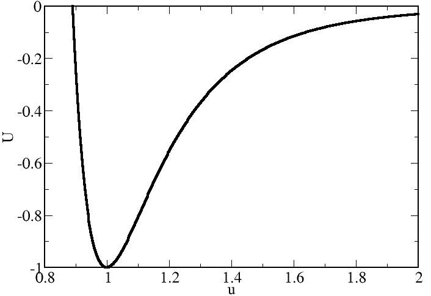

## The 2$^{nd}$ order **effective** Interatomic Force Constants (IFC)

This tutorial shows how to capture anharmonicities by means of an harmonic **Temperature Dependent Effective Potential** (TDEP) by using the ABINIT package. In practice, this requires to obtain the $2^{nd}$ order **effective** IFC. Once obtained, almost all the dynamic (phonons...), elastic (constants, moduli...) and thermodynamic (entropy, free energy...) desired quantities can be derived therefrom.

You will learn:

1. how to launch aTDEP just after an ABINIT simulation, 
2. the meaning and effects of the main input variables, and 
3. how to exploit the data provided in the output files.

You are not supposed to know how to use ABINIT, but you are strongly encouraged to read the following documents:

* User guide: [[pdf:aTDEP_Guide| aTDEP guide]]  
* Theory: [[pdf:aTDEP_Paper|aTDEP paper]] corresponding to the article [[cite:Bottin2020]]

This tutorial should take about 1.5 hour.

[TUTORIAL_README]

## 1. Summary of the aTDEP method

The **Temperature Dependent Effective Potential** approach has been introduced by O. Hellman *et al.* [[cite:Hellman2011]] in 2011. The purpose of this method is to capture the anharmonic effects in an **effective** way. 

Let us consider that the potential energy $U$ of a crystal can be rewritten as a Taylor expansion around the equilibrium:

$$
U=   U_0 + \sum_{p\ge 1} \frac{1}{p\ !} \sum_{\substack{\alpha_1...\alpha_p \\ i_1...i_p}}\overset{(p)}{\Phi}\vphantom{\Phi}_{i_1...i_p}^{\alpha_1...\alpha_p}\prod_{k=1}^p u_{i_k}^{\alpha_k}
$$

> In this equation, and in the following, the Latin letters in subscripts $i, j, k...$ and the Greek letters in superscripts $\alpha, \beta, \gamma$... will define the atoms and the cartesian directions, respectively.

with U$_0$ the minimum of the potential energy, $u$ the displacement with respect to equilibrium, and $\overset{(p)}{\Phi}=\left(\frac{\partial^p U}{\partial u_1 ... \partial u_p}\right)_0$ the $p^{th}$ order IFC, respectively. As a **first** approach (we will see in the second tutorial how to go beyond), let us assume that :

1. the previous equation is truncated at the $2^{nd}$ order such as : 
$$
U=   U_0 + \frac{1}{2!}\sum_{ij,\alpha\beta} \overset{(2)}{\Theta}\vphantom{\Theta}_{ij}^{\alpha\beta} u_i^\alpha u_j^\beta + 0(u^3)
$$

2. a set of $N_t$ forces $\mathbf{F}_{AIMD}(t)$ and displacements $\mathbf{u}_{AIMD}(t)$ is obtained using *ab initio* molecular dynamic (AIMD) simulations, leading to the following system of equations ($F=-\nabla U$): 

$$
F_{i,AIMD}^\alpha(t)=  - \sum_{j,\beta} \overset{(2)}{\Theta}\vphantom{\Theta}_{ij}^{\alpha\beta} u_{j,AIMD}^\beta(t)
$$

It is then possible to obtain the 2nd order **effective** IFC $\overset{(2)}{\Theta}$ by using a least squares method : $\mathbf{\overset{(2)}{\Theta}} = \mathbf{F} . \mathbf{u}^{-1}$. This fitting procedure modifies the 2nd order IFC by including (in an effective way) the anharmonic contributions coming from the terms above the truncation. Therefore, the IFC are no longer constant and become temperature dependent. That is the reason why we change the notation: in the following, the $\Phi$ will be referred to as the ‘‘true IFC’’ and the $\Theta$ as the ‘‘effective IFC’’.


## 2. A simple case : Al-fcc

Let us begin with the face centered cubic (fcc) phase of aluminum. This one is very simple for many reasons : 

- There is only one atom in the unitcell so we will have only three phonon branches in the spectrum.
- At 0 GPa, the fcc phase is stable from 0 K up to the melting so we do not expect any trouble coming from phonon instabilities.

*Before beginning, you might consider to work in a different subdirectory as for the other tutorials. Why not create Work_atdep1_1 in \$ABI_TESTS/tutoatdep/Input? You can copy all the input files within.*

```sh
cd $ABI_TESTS/tutoatdep/Input
mkdir Work_atdep1_1
cd Work_atdep1_1
cp ../tatdep1_1.* . 
```

### 	2.1 The input files

Let us discuss the meaning of these five files :

#### 		^^2.1.1 The data files *tatdep1_1xred.dat*, *tatdep1_1fcart.dat* and *tatdep1_1etotal.dat*^^

These ones store some data coming from the AIMD simulations : the reduced coordinates, the cartesian forces and the total energy of all the atoms in the supercell, respectively. In the present example, only 20 snapshots are extracted from a very long trajectory with thousands molecular dynamic time steps.

#### 		^^2.1.2 The input file *tatdep1_1.abi*^^ 



This one lists (in a formated way) all the input variables needed. In the following we will comment each variable and the value used for the present calculation. Many of them have the same meaning as in the ABINIT main code.

- For the unitcell :

Input variable | Meaning
---------------|--------
[[atdep:brav]] | Defines the BRAVais lattice (as defined in the ABINIT code). For the present calculation (fcc) : 7 (cubic) and -3 (face centered).
[[atdep:natom_unitcell]] | Defines the Number of ATOMs in the UNITCELL. For the present calculation : 1 
[[atdep:xred_unitcell]] | Defines the Xyz REDuced coordinates in the UNITCELL. For the present calculation : 0.0 0.0 0.0
[[atdep:typat_unitcell]] | Defines the TYPes of AToms in the UNITCELL. For the present calculation : 1
[[atdep:ntypat]] | Defines the Number of TYPes of AToms. For the present calculation : 1
[[atdep:amu]] | Defines the Atomic masses in Mass Units. For the present calculation (Al) : 26.981539

- For the supercell :

Input variable | Meaning
---------------|--------
[[atdep:rprimd]] | Defines the Dimensional Real space PRMitive vectors of the SUPERCELL. For the present calculation : $\begin{pmatrix} 22.9089998 & 0.0 & 0.0 \\ 0.0 & 22.9089998 & 0.0 \\ 0.0 & 0.0 & 22.9089998 \end{pmatrix}$ 
[[atdep:multiplicity]] | Defines the MULTIPLICITY of the SUPERCELL with respect to the primitive UNICELL. For the present calculation : $\begin{pmatrix} -3 & 3 & 3 \\ 3 & -3 & 3 \\ 3 & 3 & -3 \end{pmatrix}$
[[atdep:natom]] | Defines the Number of ATOMs in the SUPERCELL. For the present calculation : 108
[[atdep:typat]] | Defines the TYPe of AToms in the SUPERCELL. For the present calculation : 108 * 1
[[atdep:temperature]] | Defines the TEMPERATURE of the system. For the present calculation : 900 K

- For the calculation :

Input variable | Meaning
---------------|--------
[[atdep:nstep_max]] | Defines the upper limit in the range of configurations that one wants to use. For the present calculation : 20
[[atdep:nstep_min]] | Defines the lower limit in the range of configurations that one wants to use. For the present calculation : 1
[[atdep:rcut]] | Defines the CUToff Radius used to compute the second order IFCs. For the present calculation : 11.45 ($\approx \frac{22.9089998}{2}$) 

- Optional :

Input variable | Meaning
---------------|--------
[[atdep:enunit]] | Defines the ENergy UNIT used for the phonon spectrum. For the present calculation : 3 (in THz)

#### 		^^2.1.3 The files file *tatdep1_1.files*^^

This one lists the input file name and the root of input and output files :



You can now execute `atdep`:

```sh
atdep < tatdep1_1.files > log 2> err &
```

The code should run very quickly.

### 	2.2 The output files

The `atdep` code writes **many** output files (some of them are available in *$ABI_TESTS/tutoatdep/Refs/). The reason is twofold : to remove all the "details" of the calculations from the main output file and to give all the thermodynamic data in an handable format. Let us detail these output files in the following :

#### 		^^2.2.1 The main output file *tatdep1_1.abo*^^



This file reproduces all the steps encountered during the execution of `atdep`. You are strongly adviced to detect all the sequences listed below. The main output file :

1. begins with the common header of the ABINIT output files

```
  .Version    3.0 of PHONONS
  .Copyright (C) 1998-2024 ABINIT group (FB,JB).
   ABINIT comes with ABSOLUTELY NO WARRANTY.
   It is free software, and you are welcome to redistribute it
   under certain conditions (GNU General Public License,
   see ~abinit/COPYING or http://www.gnu.org/copyleft/gpl.txt).
...
```

2. echoes all the input variables included in the input file

```
   #############################################################################
   ######################### ECHO OF INPUT FILE ################################
   #############################################################################
   ======================= Define the unitcell =================================
   brav                    7   -3
   natom_unitcell          1
...
```

3. computes useful quantities using the available data (the acell of the unitcell,...)

```
   #############################################################################
   ########################## Computed quantities ##############################
   #############################################################################
   acell_unitcell=     7.6363332667     7.6363332667     7.6363332667
...
```

4. generates the **q**-point meshes

```
   #############################################################################
   ########################## Q points generation  #############################
   #############################################################################
   Generate the BZ path using the Q points defined by default
   See the qpt.dat file
```

5. establishes a correspondence between the atoms in the unitcell, the multiplicity, the symmetries and the atoms in the supercell

```
   #############################################################################
   ###### Find the matching between ideal and average positions  ###############
   #############################################################################
    Determine ideal positions and distances...
    Compute average positions...
    Search the unitcell basis of atoms in the MD trajectory...
    Compare ideal and average positions using PBC...
    Write the xred_average.xyz file with ideal and average positions...
    Compute cartesian coordinates and forces...
```

6. finds the symmetry operations between atoms and pairs of atoms.

```
   #############################################################################
   ###################### Find the symetry operations ##########################
   #################### (connecting the atoms together) ########################
   #############################################################################
   Search the matrix transformation going from (k) to (i)...
   Search the matrix transformation going from (k,l) to (i,j)...
   See the Indsym*.dat files (if debug)
```

7. computes the number of non-zero independent IFC coefficients at the 1st and 2nd order, for each shell of coordination.

```
   #############################################################################
   ####### FIRST ORDER : find the number of coefficients #######################
   #############################################################################
    Build the ref1at and Isym1at tables...
    Build the Shell1at datatype...
    Number of shells=           1
...
   #############################################################################
   ###### SECOND ORDER : find the number of coefficients #######################
   #############################################################################
    Build the ref2at and Isym2at tables...
    Build the Shell2at datatype...
    Number of shells=           5
...
```

8. computes the constraints (for the IFC), builds the pseudo-inverse and solves the problem

```
   #############################################################################
   ###################### Compute the constraints ##############################
   ########################## At the 1st order #################################
   ########################## At the 2nd order #################################
...
```

9. lists all the IFC coefficients for each shell, at the 1st and 2nd order

```
   #############################################################################
   #### For each shell, list of coefficients (IFC), number of neighbours... ####
   #############################################################################
   ############# List of (first order) IFC for the reference atom=   1
     0.000000  0.000000  0.000000
  
  
   #############################################################################
   #### For each shell, list of coefficients (IFC), number of neighbours... ####
   #############################################################################
   ############# List of (second order) IFC for the reference atom=   1
   ======== NEW SHELL (ishell=   1): There are   1 atoms on this shell at distance= 0.000000
    For jatom=   1 ,with type=   1
     0.044568  0.000000  0.000000
     0.000000  0.044568  0.000000
     0.000000  0.000000  0.044568
...
```

10. writes the dynamical matrix, the phonon spectrum and the vibrational density of states (vDOS) in specific files

```
   #############################################################################
   ############## Compute the phonon spectrum, the DOS, ########################
   ##############  the dynamical matrix and write them  ########################
   #############################################################################
  
   #############################################################################
   ################### vibrational Density OF States (vDOS) ####################
...
```

11. echoes the elastic constants and some elastic moduli

```
   #############################################################################
   ######################### Elastic constants #################################
   ################ Bulk and Shear modulus--Sound velocities ###################
   #############################################################################
  
   ========== Using the formulation proposed by Wallace (using the IFC) =========
   Cijkl [in GPa]=
   | C11 C12 C13 C14 C15 C16 |    113.760   61.649   61.649    0.000    0.000    0.000
   | C21 C22 C23 C24 C25 C26 |     61.649  113.760   61.649    0.000    0.000    0.000
   | C31 C32 C33 C34 C35 C36 |     61.649   61.649  113.760    0.000    0.000    0.000
...
```

12. computes the energy of the model (TDEP) and some convergence parameters

```
   #############################################################################
   ######################### Energies, errors,...  #############################
   #############################################################################
   Thermodynamic quantities and convergence parameters of THE MODEL,
        as a function of the step number (energies in eV/atom and forces in Ha/bohr) :
   <U_TDEP> = U_0 + U_1 + U_2
         with U_0 = < U_MD - sum_i Phi1 ui - 1/2 sum_ij Phi2 ui uj >
          and U_1 = <      sum_i    Phi1 ui >
          and U_2 = < 1/2  sum_ij   Phi2 ui uj >
...
```

13. writes thermodynamic data of the system in a file (see below)

```
   #############################################################################
   ################# Thermodynamic quantities: Free energy,...##################
   #############################################################################
   See the thermo.dat file

```

14. finishes with the standard aknowlegment section of ABINIT output files 

```
   #############################################################################
   ######################### CALCULATION COMPLETED #############################
   #############################################################################
   Suggested references for the acknowledgment of ABINIT usage.
  
   The users of ABINIT have little formal obligations with respect to the ABINIT group
   (those specified in the GNU General Public License, http://www.gnu.org/copyleft/gpl.txt).
   However, it is common practice in the scientific literature,
   to acknowledge the efforts of people that have made the research possible.
...
```


#### 		^^2.2.2 The phonon frequencies file *tatdep1_1omega.dat*^^



You can plot the phonon spectrum. If you use the |xmgrace| tool, launch:

      xmgrace -nxy tatdep1_1omega.dat

You should get this picture :

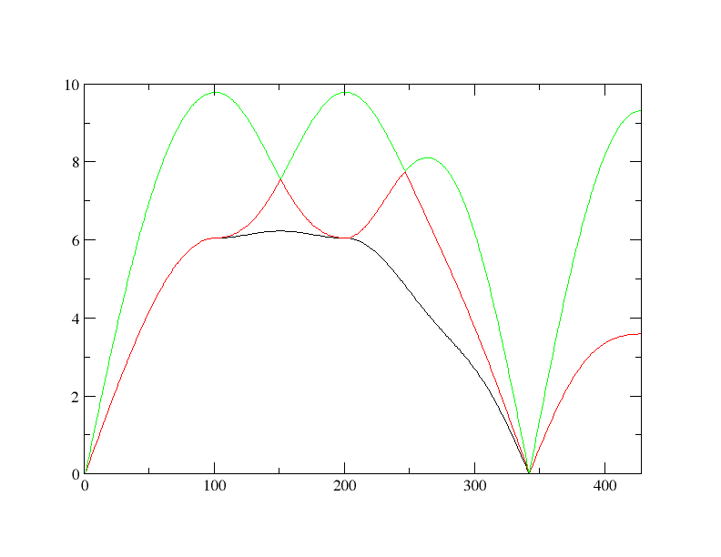

On the Y-axis, you have the frequencies (in THz, see the input file). On the X-axis, you have the **q**-points along a path in the Brillouin Zone (BZ). This one is defined by default and depends on the Bravais lattice.

!!! note
    The path along the BZ can be changed using the [[atdep:bzpath]] input variable. 

The BZ boundaries and all the **q**-points included in the path are available in the *tatdep1_1qpt.dat* file :



As you can see, in the present calculation the path is as follows : $\Gamma$ - X - W - X' - K - $\Gamma$ - L. Concerning the results, you can compare the phonon spectrum obtained in this tutorial with the first figure of [this paper](https://journals.aps.org/prl/abstract/10.1103/PhysRevLett.91.135501). As you can see, the overall agreement is very good but not perfect due the too small number of atomic configurations (20) and the difference between the experimental (80 K) and theoretical (900 K) temperatures. If you perform AIMD simulations at various temperatures and store more than 20 atomic configurations, you will obtain the following picture : 

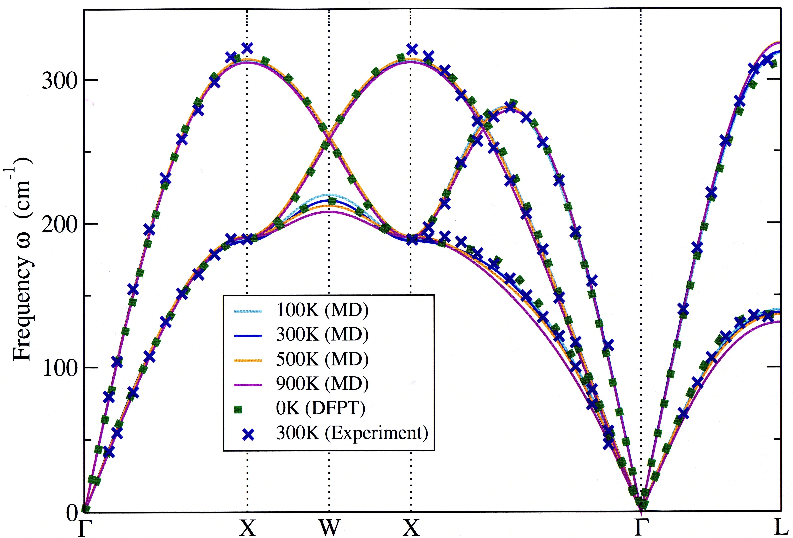

!!! warning 
    The *tatdep1_1qpt.dat* file do not be confused with the *tatdep1_1qbz.dat* file which defines the Monkhorst-Pack (MP) **q**-point mesh used to compute the vDOS : $g(\omega)=\frac{1}{3N_a}\sum_{s=1}^{3N_a}\sum_{\mathbf{q}\in BZ} \delta(\omega-\omega_s(\mathbf{q}))$ such as $\int_0^{\omega_{max}} g(\omega)d\omega =1$, with $\omega_{max}$ the highest phonon frequency of the system. The vDOS is written in the *tatdep1_1vdos.dat* file. You may plot it to verify that the vDOS is consistent with the phonon spectrum.


#### 		^^2.2.3 The thermodynamic file *tatdep1_1thermo.dat*^^



In this file, we print all the thermodynamic data that we can compute by using the phonon spectrum and/or the vDOS. The main quantity is the free energy $\mathcal{F}$. This one can be splitted in two parts:

$$
\mathcal{F}(V,T)=U_0(V)+\mathcal{F}_{\rm vib}(V,T) 
$$

The first part is the cold contribution (at T = 0 K) whereas the second one is the vibrational contribution (with T $\neq$ 0). The cold contribution can be computed using a ground state specific calculation or using the following formulation :

$$
U_0(V)=< U_{\rm MD}(t)-\frac{1}{2!}\sum_{ij,\alpha\beta} \overset{(2)}{\Theta}\vphantom{\Theta}_{ij}^{\alpha\beta} u_i^\alpha u_j^\beta >
$$

The vibrational contributions (free energy $F_{\rm vib}$, internal energy $U_{\rm vib}$, entropy $S_{\rm vib}$ and heat capacity $C_{\rm vib,V}$) can be computed using the vDOS $g(\omega)$ in the harmonic approximation (see the paper of Lee & Gonze [[cite:Lee1995]]) :

$$
  F_{\rm vib} = \frac{3N_a}{\beta} \int_0^{\omega_{max}} \ln \left(2\sinh(\frac{\beta\hbar\omega}{2})\right) g(\omega)d\omega \label{eq:Fvib}
$$

$$
  U_{\rm vib} = 3N_a \int_0^{\omega_{max}} \frac{\hbar\omega}{2}\coth(\frac{\beta\hbar\omega}{2}) g(\omega)d\omega 
$$

$$
C_{\rm vib,V} = 3N_a k_B \int_0^{\omega_{max}} \left(\frac{\beta\hbar\omega}{2\sinh(\frac{\beta\hbar\omega}{2})}\right)^2 g(\omega)d\omega \label{eq:Cv}
$$

$$
  S_{\rm vib} = 3N_a k_B \int_0^{\omega_{max}} \left[\frac{\beta\hbar\omega}{2}\coth(\frac{\beta\hbar\omega}{2}) - \ln \left(2\sinh(\frac{\beta\hbar\omega}{2})\right)\right] g(\omega)d\omega
$$

All these thermodynamic data are computed and written in the *tatdep1_1thermo.dat*. Note that this file is divided in two parts :
 
- the first one is dedicated to the thermodynamic data obtained at the temperature defined by the input variable [[atdep:temperature]].

```
============= Direct results (without any inter/extrapolation) ==================
 For present temperature (in Kelvin): T=    900.000
   The cold contribution (in eV/atom): U_0 =     -56.407
   The specific heat (in k_b/atom): C_v=     2.972
   The vibrational entropy (in k_b/atom): S_vib =     6.638
   The internal energy (in eV/atom): U_vib =     0.235
   The vibrational contribution (in eV/atom): F_vib = U_vib -T.S_vib =    -0.280
   The harmonic free energy (in eV/atom) -->  F_tot^HA = U_0 + F_vib =     -56.687
...
```

- whereas in the second one, the thermodynamic data are **extrapolated** at all the temperatures using a fixed vDOS.

```
============= Harmonic Approximation (HA) ==================
   Note that the following results come from an EXTRAPOLATION:
     1/ F_vib^HA(T) is computed for each T using vDOS(T=  900)
     2/ F_tot^HA(T) = F_vib^HA(T) + U_0
   T      F_vib^HA(T)   F_tot^HA(T)           C_v(T)         S_vib(T)        U_vib(T)        MSD(T)
   100          0.034        -56.373           1.618           0.909           0.042           0.230
   200          0.020        -56.387           2.511           2.374           0.061           0.291
   300         -0.005        -56.413           2.765           3.449           0.084           0.348
...
```

!!! note
    In the harmonic approximation (HA), the phonon frequencies do not depend on the temperature but only on the volume $V$, so we have $\omega_{\rm HA} = \omega(V)$. Using a constant vDOS, it's then possible to compute all the thermodynamic data, whatever the temperature "$\beta$" (see the equations above). In this case, the temperature variation of the thermodynamic quantities comes from the filling of phononic states using the Bose-Einstein statistics. To go beyond, and capture the thermal expansion for example, we can assume that the temperature effects are **implicit** through the variation of the volume $V(T)$. This is the quasi-harmonic approximation (QHA) : $\omega_{\rm QHA}=\omega(V(T))$. If in many cases the QHA gives excellent results, it fails to reproduce an **explicit** variation of the thermodynamic data with respect to the temperature (by definition, using QHA, the phonon frequencies cannot vary at constant volume ; i.e. along an isochore). This **explicit** variation comes from anharmonic effects and only be captured by going beyond the second order in the energy expansion. That is the work done by aTDEP, by recasting all the 3rd, 4th... terms of the energy expansion within the 2nd order, in an **effective** way. Since the 2nd order effective IFC now takes into account all these terms, it captures the temperature effects and we have $\omega_{\rm Anh}=\omega(T,V(T)$.

In the *tatdep1_1thermo.dat* file corresponding to the present calculation, several remarks can be done. You can see that the specific heat $C_{\rm vib,V}$ is equal to 2.972 (in $k_B$ units) at $T$ = 900 K. In the second part of this file, you see that this quantity converges towards 3 at high temperature, as expected by the Dulong-Petit law (in this part we are in HA, so this law is fulfilled). This result is consistent with the experimental Debye temperature $\Theta_D \approx$ 400 K ; at $T$ = 900 K the behaviour of aluminum is classical and no longer quantum, since all the phononic states are filled. This can be seen also for another quantity. Plot the vibrational internal energy $U_{\rm vib}^{ \rm HA}$ as the function of temperature (see the second part of the file). And plot also $U_{\rm vib}^{\rm Classic}=3k_B T$ corresponding to the classic formulation (in eV, so use the conversion factor 1 eV = 11 604 K). You will see that the classic limit is achieved between 400 and 600 K, as expected.

### 	2.3 Numerical convergence (accuracy and precision)

Several input variables have strong impact on the convergence of the effective IFC, phonon frequencies and thermodynamic data. Two of them are in the *tatdep1_1.abi* input file (in the "DEFINE_COMPUTATIONAL_DETAILS" section) and others comes from the AIMD simulations. 

####		^^2.3.1 The cutoff radius [[atdep:rcut]]^^

The first one is the cutoff radius used to compute the 2nd order effective IFC. In practice, it defines the number of coordination shells included in the calculation. 

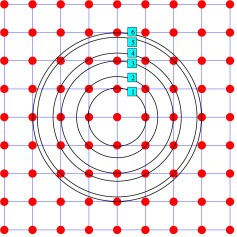

Let us see again the *tatdep1_1.abo* output file and go to the "SECOND ORDER" section. You will see the list of the five shells included in the present calculation and sorted as a function of the shell radius : 0.0000000000 (the onsite interaction), 5.3997030363 (the 2nd shell), 7.6363332667 (the 3rd), 9.3525600046 (the 4th) and 10.7994060725 a.u. (the 5th).  

```
 Shell number:           1
  Between atom    1 and     1 the distance is=    0.0000000000
...
 Shell number:           2
  Between atom    1 and     2 the distance is=    5.3997030363
...
 Shell number:           3
  Between atom    1 and     4 the distance is=    7.6363332667
...
 Shell number:           4
  Between atom    1 and    10 the distance is=    9.3525600046
...
 Shell number:           5
  Between atom    1 and    16 the distance is=   10.7994060725
...
```

In the *tatdep1_1.abi* input file the cutoff radius [[atdep:rcut]] equals to 11.45 (a.u.). Now, we will change this value to 6.0, 8.0 and 10.0 in order to have 2, 3 and 4 shells in the calculation, respectively. To do that, you can change the root of the output filename and replace the third line of the *tatdep1_1.files* file by "Rcut6", 

```
tatdep1_1.abi
tatdep1_1
Rcut6
```

then set "rcut 6.0" in the input file *tatdep1_1.abi" and finally launch `atdep`. Repeat this process for "Rcut8" and "Rcut10" and plot all the phonon spectra together :  

      xmgrace -nxy Rcut6omega.dat -nxy Rcut8omega.dat -nxy Rcut10omega.dat -nxy tatdep1_1omega.dat

You should get the following picture :

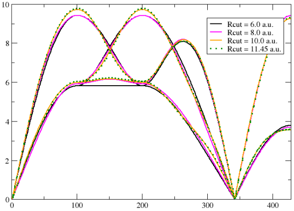

Concerning this very simple case, the frequencies are almost converged with only two shells (the onsite interaction and the 1st shell of coordination). In most situations, this is not the case. Here, we can see that some differences remain for rcut = 6.0 and 8.0 a.u. with respect to higher shell radii. With 4 shells and rcut = 10.0, the phonon spectrum seems to be converged and almost equal to 5 shells and rcut = 11.45. This is confirmed by AIMD simulations with 216 atoms in the supercell and a higher shell radius (see below).

!!! warning
    The cutoff radius [[atdep:rcut]] cannot be greater than half the shortest dimension of the supercell. Otherwise, the shell will include spurious atomic vibrations. The only way to have a larger cutoff radius is to perform AIMD simulations with a larger supercell/number of atoms.    

####		^^2.3.2 The number of atomic configurations^^

Another key quantity is the number of atomic configurations used in the calculation. This one is defined by the difference between two input variables : [[atdep:nstep_max]] - [[atdep:nstep_min]]. For simplicity, we generally use as input data files (*etot.dat*, *xred.dat* and *fcart.dat*) the whole trajectory coming from the AIMD simulations, with thousands of atomic configurations. So, for an AIMD trajectory with 5 000 time steps including a thermalization over 2 000 time steps, we can set [[atdep:nstep_max]] to 5 000 and [[atdep:nstep_min]] to 2 000. However, the 3 000 AIMD time steps really used are not uncorrelated and 99% of the information coming from them is in general useless.

The number of uncorrelated configurations needed for the calculation is direcly related to the number of non-zero and independent IFC coefficients which has to be computed. At the 2nd order, the whole effective IFC $\mathbf{\Theta}$ is a $(3N_a\times 3N_a)$ matrix. For instance, in the present calculation with $N_a$ = 108 atoms, the whole IFC has 104 976 coefficients. So, if one wants to obtain them (using a least square method $\mathbf{\Theta} = \mathbf{F} . \mathbf{u}^{-1}$), it would require tens of thousands time steps, which is out of reach (see the seminal article of Hellman and coworkers [[cite:Hellman2011]]), 

Thanks to crystal symmetries, tensor symmetries (of the IFC, of the dynamical matrix, of the elastic tensor...) and invariances (translational and rotational) this huge number can be drastically reduced. For example, in the present calculation, we only need to compute 12 IFC coefficients (see "Total number of coefficients at the second order" in the *tatdep1_1.abo* output file) : 0 for the 1st shell then 3, 2, 4 and 3 coefficients for the higher shells. You can see their value in the output file (have a look at "List of (second order) IFC"). In fact, many of them are zero, symmetric or anti-symmetric, which gives the following picture of the whole IFC :

$$ 
\begin{pmatrix}
\begin{pmatrix} \theta_{21} & 0      & 0       \\  0      & \theta_{21} &  0     \\  0      & 0      & \theta_{21} \end{pmatrix} \quad
\begin{pmatrix} \theta_{22} & \theta_{23} & \theta_{24}  \\ -\theta_{23} & \theta_{22} & \theta_{26} \\  \theta_{25} & \theta_{26} & \theta_{22} \end{pmatrix} \quad  
\begin{matrix}  ... \\ ... \\ ... \end{matrix} \\
\begin{pmatrix} \theta_{22} &-\theta_{23} & \theta_{25}  \\ \theta_{23}  & \theta_{22} & \theta_{26} \\  \theta_{24} & \theta_{26} & \theta_{22} \end{pmatrix} \quad
\begin{pmatrix} \theta_{27} & 0      & 0       \\  0      & \theta_{27} & 0      \\  0      & 0      & \theta_{27} \end{pmatrix} \quad  
\begin{matrix}  ... \\ ... \\ ... \end{matrix} \\
\quad
\begin{matrix}  ... & ... & ... \end{matrix} \quad \quad \quad  
\begin{matrix}  ... & ... & ... \end{matrix} \quad \quad
\begin{matrix}  \ddots \end{matrix}
\end{pmatrix}
$$     

Thanks to this drastic reduction of the IFC coefficients, only 50 to 100 atomic uncorrelated configurations are generally needed to obtain converged properties at the 2nd order (in this example, and in the whole ABINIT package, we only propose examples with a maximum of 20 uncorrelated configurations in order to avoid a too huge amount of data). As previously discussed for the cutoff radius, we can study the convergence of the calculation with respect to the number of uncorrelated atomic configurations. Set [[atdep:nstep_max]] equal to 5 in *tatdep1_1.abi*, replace the root of the ouput file name by "Ntep5" in the *tatdep1_1.files* and launch `atdep`. Do it again for 8 time steps then plot :

      xmgrace -nxy Nstep5omega.dat -nxy Nstep8omega.dat -nxy tatdep1_1omega.dat

You should get the following picture :

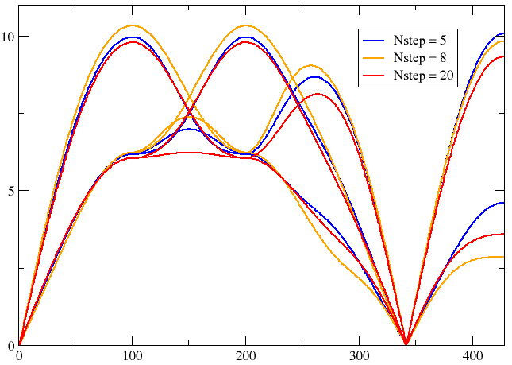

In conclusion, a too small number of uncorrelated atomic configurations leads to a large error in the phonon spectrum. Therefore, do not hesitate to pursue the AIMD simulation (in order to accumulate a larger number of configurations) until achieving the convergence of the phonon spectrum.   

!!! note
    Another input variable impacts the number of atomic configurations : [[atdep:slice]]. This optional variable selects one configuration over [[atdep:slice]], so the calculation will have ([[atdep:nstep_max]]-[[atdep:nstep_min]])/[[atdep:slice]] configurations at all. To test its utility, you can add a line "slice 4" in the section "optional input variable", change the root of the output file name by "slice" and launch `atdep`. The value of this optional variable is now echoed at the begining of the output file and you can find that the "real number of time steps" is now 5 (and no longer 20). Finally, you can plot the phonon spectrum and see the differences with respect to have the 20 configurations (*tatdep1_1omega.dat*) or only the 5 first (*Nstep5omega.dat*). 

####		^^2.3.3 Other important parameters^^

The aTDEP results depend on the aTDEP input variables, but also on the features of the AIMD simulation. Three of them have a real impact on the computational cost of the AIMD simulation but also on the aTDEP results :
 
- the number of AIMD time steps (this will allow to increase [[atdep:nstep_max]] in aTDEP). See above for the consequences.
- the size of the supercell (this will allow to increase [[atdep:rcut]] in aTDEP). See the Figure below.
- the **k**-point MP mesh (used to compute the electronic density). See the Figure below.

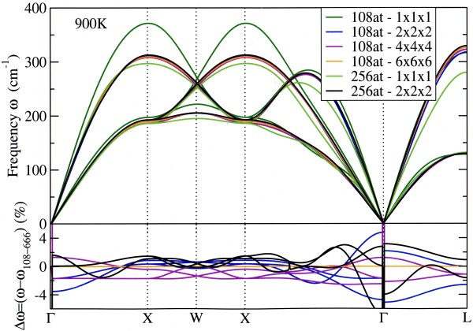

You can see that the **$\Gamma$**-point is never sufficient, as well with 108 atoms as with 216 atoms. The $(2\times2\times2)$ **k**-point MP mesh gives an almost converged phonon spectrum (lower than 2% with respect to the $(6\times6\times6)$ one), except at the $\Gamma$ point (around 5%). This last point will have consequences on elastic constants (they are related to the slope of the acoustic branches at the $\Gamma$ point).

!!! note
    You can see the impact of the **k**-point mesh on the phonon spectrum of $\beta$-Zr in this recent paper [[cite:Anzellini2020]]. All the calculations of this study are performed using ABINIT and aTDEP.

## 3. Temperature dependency of a soft mode : U-$\alpha$

This calculation is similar to the one performed in the following article [[cite:Bouchet2015]].

*Before proceeding, you can copy the next three series of input files in the current directory.*

```sh
cp ../tatdep1_2.* . 
cp ../tatdep1_3.* . 
cp ../tatdep1_4.* . 
```

You can open the first input file :



As can be seen in the first lines, U-$\alpha$ is an orthorombic ([[atdep:brav]](1)=3) C-face centered ([[atdep:brav]](2)=3) phase with two atoms in the unitcell : one at (0;0;0) and another at (-$y$;$y$;0.5) with $y$ an internal parameter. Two optional input parameters are set : [[atdep:enunit]]=3 (the frequency unit is THz) and [[atdep:use_ideal_positions]]=1 (the atomic displacements are computed wrt the U-$\alpha$ ideal positions). 

!!! note
    The T$\neq$ 0 K equilibrium positions are not necessary equal to the T=0 K ideal positions. For instance, the $y$ internal parameter of the U-$\alpha$ phase evolves as a function of the temperature. Therefore, it could be needed to compute the phonon spectrum using the T$\neq$ 0 K equilibrium positions ([[atdep:use_ideal_positions]]=0) rather than using a fixed $y$=0.2022 internal parameter. However, the the T$\neq$ 0 K equilibrium positions are computed by `atdep` as an average over all the AIMD steps. And to achieve a good accuracy, a long AIMD trajectory (with a good statistic) is needed. In the present case (U-$\alpha$), with only 20 configurations, its impossible to evaluate the "T$\neq$ 0 K equilibrium positions" accurately. So, to avoid spurious effects coming from a too bad description of the new "T$\neq$ 0 K equilibrium positions", we imposed the 0 K ideal positions whatever the temperature [[atdep:use_ideal_positions]]=1.    

###	3.1 Failure of the QHA

The $\alpha$ phase of uranium (C-face centered orthorombic) is stable from room temperature up to 900 K. However, at low temperature (below 50 K), U-$\alpha$ undergoes a phase transition towards the $\alpha_1$ structure (the $\alpha$ structure is twofold along the [100] direction). This feature can be seen on the following Figure :

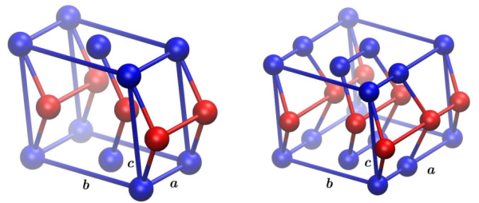

This phase transition goes with a phonon mode softening in the middle of the [100] direction :

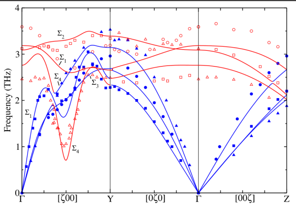

For a long time, this phenomenon was puzzling, especially from a computational of view. In particular, if the DFPT is able to reproduce the phonon spectrum of U-$\alpha$ at 300 K, the QHA fails to reproduce the correct behaviour of the soft mode at low temperature : in experiments the soft mode decreases as a function of the temperature, whereas using DFPT this mode increases when the volume decreases. At odds, this behaviour is correctly reproduced when performing simulations with an explicit treatment of the temperature (AIMD) and using a post-process able to capture the anharmonicity (`atdep`) :

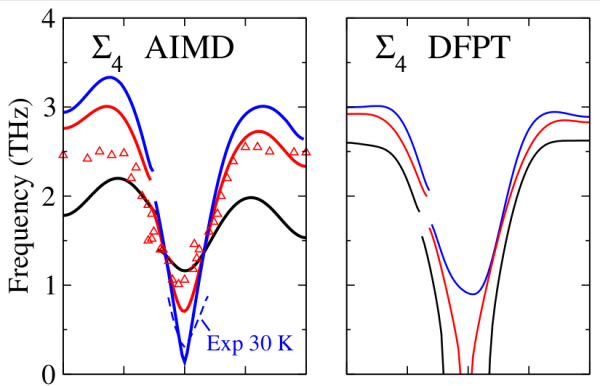

###	3.2 Effect of the temperature

Here, we will reproduce this temperature effect between 300 K and 50 K. The *tatdep1_2.abi* is the input file corresponding to T = 300 K, whereas *tatdep1_3.abi* is the one for T = 50 K. You can compare them :

```
vimdiff tatdep1_2.abi tatdep1_3.abi
```

Three lines are different : the ones corresponding to [[atdep:temperature]], [[atdep:rprimd]] and [[atdep:rcut]]. The equilibrium volume reduces between 300 K and 50 K so [[atdep:rprimd]] has been changed. In conjunction, [[atdep:rcut]] has to be reduced in order to be lower than half the smallest supercell lattice parameter (which is the first dimension of the supercell). Now you can execute `atdep` for these two temperatures :

```sh
atdep < tatdep1_2.files > log 2> err &
atdep < tatdep1_3.files > log 2> err &
```

For the moment, we are interested in the phonon spectra. You can plot them together :

```
xmgrace -nxy tatdep1_2omega.dat -nxy tatdep1_3omega.dat
```

You shoud obtain this picture :

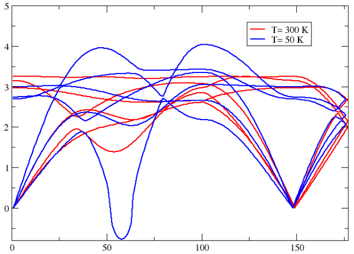

By using only 20 configurations we are able to reproduce the softening of the $\Sigma_4$ branch of U-$\alpha$ as a function of the temperature. However, this agreement is more qualitative than quantitative. A strict comparison with the converged phonon spectrum displayed at the begining shows that the differences at 300 K are significative. Moreover, the elastic moduli obtained at T = 300 K (in the *tatdep1_2.abo* output file)_ are :

```
 ============================== Hill average =================================
 ISOTHERMAL modulus [in GPa]: Bulk Kt=   51.471 and Shear G=   72.431
 Average of Young modulus E [in GPa]=  147.911 Lame modulus Lambda [in GPa]=    3.184 and Poisson ratio Nu=    0.021
 Velocities [in m.s-1]: compressional Vp= 2788.977  shear Vs= 1950.784  and bulk Vphi= 1644.481
 Debye velocity [in m.s-1]= 2118.561  and temperature [in K]=  229.468
```  

If we compare the bulk modulus to the one obtained by DFPT (see the PRB **88**, 134202 (2013)) and experiments (see the PR **29**, 1473 (1958)), we obtain :

Work              | K
------------------|-----
Present   (300 K) |   51
DFPT      (0 K)   |   129 
Expt      (300 K) |   115

This quantity is very far from the ones obtained by DFPT and experiments.

###	3.3 Elastic moduli and size effect

In this part we will focus on the bulk modulus and the discrepancies obtained previously.  The *tatdep1_4.abi* is the same input file as *tatdep1_2.abi* except that the first dimension of the supercell is increased. You can compare them :

```
vimdiff tatdep1_2.abi tatdep1_4.abi
```

Along the [100] direction, the [[atdep:multiplicity]] is no longer 4 but 6. Consequently, the number of atoms [[atdep:natom]] is no longer 96 but 144 and [[atdep:rcut]] can be increased to 11.09 a.u. (half of the second dimension). This leads to have a supplementary shell of coordination in the calculation :

```
 Shell number:          13
  Between atom    1 and    49 the distance is=   10.7900000000
   Number of independant coefficients in this shell=           4
   Number of interactions in this shell=           2
```

This one is at a distance equal to 10.79 a.u., which is exactly twice the unitcell lattice parameter along the [100] direction (5.395 a.u.). There are only 2 atoms in this shell : at the [-200] and [200] positions. If you search the coefficients of this IFC using the keyword "ishell=  13", you will find :

```
 ======== NEW SHELL (ishell=  13): There are   2 atoms on this shell at distance=10.790000
  For jatom=  49 ,with type=   1
  -0.008388 -0.000138  0.000000
   0.000138 -0.000245  0.000000
   0.000000  0.000000 -0.002201
  The components of the vector are:   10.790000    0.000000    0.000000
  Trace= -0.010834

  For jatom=  97 ,with type=   1
  -0.008388  0.000138  0.000000
  -0.000138 -0.000245  0.000000
   0.000000  0.000000 -0.002201
  The components of the vector are:  -10.790000    0.000000    0.000000
  Trace= -0.010834

```
 
The contribution of this shell is very large compared to the others. This can be seen on the "Trace" of the IFC matrix, its absolute value (-0.010834) is lower than the one obtained for the 1st shell (the onsite contribution) and the 2nd shell, almost equal to the one obtained for the 4th shell but higher than all the others. This 13th shell contributes to the phase transition between U-$\alpha$ and U-$\alpha_1$. This one is reponsible for the twofold of the unitcell along the [100] direction at low temperature, so it was absolutely necessary to include it in the calculation. 

Using only 20 atomic configurations, we cannot see any quantitative improvement of the phonon spectrum (more steps are needed). However we can note a significant effect on the elastic moduli :

```
 ============================== Hill average =================================
 ISOTHERMAL modulus [in GPa]: Bulk Kt=  106.876 and Shear G=   85.533
 Average of Young modulus E [in GPa]=  202.562 Lame modulus Lambda [in GPa]=   49.854 and Poisson ratio Nu=    0.184
 Velocities [in m.s-1]: compressional Vp= 3406.949  shear Vs= 2119.896  and bulk Vphi= 2369.674
 Debye velocity [in m.s-1]= 2336.400  and temperature [in K]=  253.063
```

Work              | K
------------------|------
Present (300 K)   |   107
DFPT$^1$ (0 K)    |   129 
Expt$^2$ (300 K)  |   115

In conclusion, we can have in mind that the elastic constants/moduli (fixed by the slope of the acoustic branches at the $\Gamma$ point ; i.e. at long range) need to have very large supercell. See the following paper for more details : Schnell *et al.*, PRB **74**, 054104 (2006). 

## 4. Dynamic stabilization due to anharmonic effects : U-$\gamma$

###	4.1 Strong anharmonicity

This calculation is similar to the one performed in the following article [[cite:Bouchet2017]]. The U-$\alpha$ orthorombic phase is stable up to 940 K, then the U-$\beta$ body-centered tetragonal phase is stable up to 1050 K, and finally the U-$\gamma$ body-centered cubic phase is stable up to the melting point. In this section, we will focus on this later. Using DFPT, the phonon spectrum of the U-$\gamma$ phase shows many soft modes (see the Figure 4 of [[cite:Bouchet2017]]). This phase is dynamically instable at T = 0 K. Consequently, it is impossible to deduce anything about its dynamic, elastic and thermodynamic properties. For a long time, the stability of this phase is expected to come from anharmonic effects. That's we will show in the following.  

*Before proceeding, you can copy the next series of input files in the current directory.*

```sh
cp ../tatdep1_5.* . 
```

You can now open the input file :



As can be seen in the first lines, U-$\gamma$ is a cubic ([[atdep:brav]](1)=7) body-centered ([[atdep:brav]](2)=-1) phase with one atom in the unitcell. Three optional input parameters are set : [[atdep:enunit]]=1 (the frequency unit is cm$^{-1}$), [[atdep:bzpath]]=5 G H P G N (the BZ path is $\Gamma-H-P-\Gamma-N$) and [[atdep:use_ideal_positions]]=1 (the atomic displacements are computed wrt the bcc ideal positions). Now you can execute `atdep` :

```sh
atdep < tatdep1_5.files > log 2> err &
```

You can plot the phonon spectrum of U-$\gamma$ : *tatdep1_5omega.dat*. This one is almost equal to the one published in [[cite:Bouchet2017]]. All the soft modes (around $\Gamma$, N and H) obtained using DFPT are now positive. This shows that the phase is now dynamically stable at T = 900 K (even if this phase is not yet thermodynamically stable). However, we can see that the system is on the verge of instability. The transverse branches at the $N$ point are very low and the Born criterion for cubic systems (C$_{11}$-C$_{12}$>0) highlighting the mechanical stability is hardly fulfilled.   

###	4.2 Thermodynamics

Since we have the phonon spectrum (and the vDOS) of the U-$\gamma$ phase, we can now compute its thermodynamic properties (see the *tatdep1_5thermo.dat* file) and compare them to the ones obtained for the U-$\alpha$ phase (see the *tatdep1_4thermo.dat* file). Let us evaluate the thermodynamic stability of U-$\gamma$ phase wrt to the U-$\alpha$ one. For this purpose, we will focus on the data extrapolated at the harmonic level (the second part of these two \*thermo.dat files). If we plot the total free energy of these two phases, we obtain : 

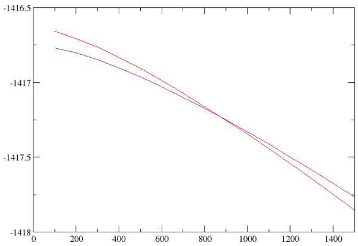

We otbain that the phase transition between the U-$\alpha$ and the U-$\gamma$ phases is around T = 900 K, which is in very good agreement with experiments. You can see that he stabilization of the U-$\gamma$ phase wrt the U-$\alpha$ one comes from the entropy :

```sh
vimdiff tatdep1_5thermo.dat tatdep1_4thermo.dat
```

!!! note
    The previous approach is very rough. Indeed, we used the results obtained at T = 300 K for U-$\alpha$ and at T = 900 K for U-$\gamma$, and extrapolated their free energies using the harmonic approximation. Moreover, we neglected the thermal pressure coming from each calculation. To be more accurate, we should compute the Gibbs free energy of each phase at several temperatures, make an interpolation, then compare them together. That's done in the Figure 7 of [[cite:Bouchet2017]]. 

###	4.3 U-$\gamma$ with 2 atoms in the unitcell.

At last, we would ask the user to consider the U-$\gamma$ phase as a simple cubic phase with 2 atoms in the unitcell. 

To do that, we suggest the  user to copy the previous input file in *tatdep1_6.abi* and to modify the following input variables : [[atdep:brav]](2)=0 since the system is now simple cubic, [[atdep:natom_unitcell]]=2 since there is two atoms in the unitcell, [[atdep:xred_unitcell]]=0 0 0 0.5 0.5 0.5, [[atdep:typat_unitcell]]=1 1, [[atdep:multiplicity]]=4 0 0 0 4 0 0 0 4 since the supercell is now just four times the conventional cell, and remove the line with [[atdep:bzpath]] since this path is no longer suited for a simple cubic. 

You can now modify the files file *tatdep1_5.files* (in order to take into account the new input file and to prevent the previous output files from being overwritten) as follows :

```
tatdep1_6.abi
tatdep1_5
tatdep1_6
```

and execute `atdep` :

```sh
atdep < tatdep1_5.files > log 2> err &
```

It's now possible to compare the thermodynamics of the "bcc" and "sc" phases by doing :

```sh
vimdiff tatdep1_6thermo.dat tatdep1_5thermo.dat
```

You can see that the free energy, the entropy, the specific heat... are equal. The thermodynamics of the system is the same, whatever the "cell description" we can assume. This invariance is satisfactory from a scientific point of view.

The user can try to do the same job for Aluminum (note : the conventional cell has 4 atoms).
