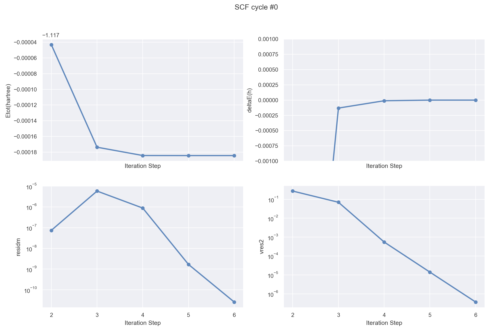
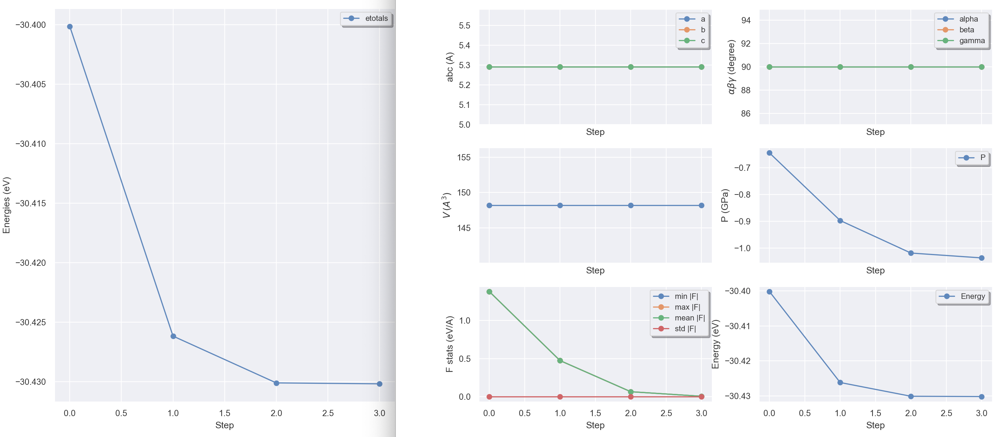

# First tutorial

## The H<sub>2</sub> molecule without convergence studies

This tutorial aims at showing how to get the following physical properties:

* the (pseudo) total energy 
* the bond length 
* the charge density 
* the atomisation energy 

You will learn about the two input files, the basic input variables, the
existence of defaults, the actions of the parser, and the use of the multi-dataset feature. 
You will also learn about the two output files as well as the density file.

This first tutorial covers the first sections of the [[help:abinit]].
The very first step is a detailed tour of the input and output files: you are
like a tourist, and you discover a town in a coach. 
You will have a bit more freedom after that first step.
It is supposed that you have some good knowledge of UNIX/Linux.

Visualisation tools are NOT covered in the basic ABINIT tutorials. 
Powerful visualisation procedures have been developed in the Abipy context, 
relying on matplotlib. See the README of [Abipy](https://github.com/abinit/abipy)
and the [Abipy tutorials](https://github.com/abinit/abitutorials).

This tutorial should take about 2 hours.

[TUTORIAL_README]

## Computing the (pseudo) total energy and some associated quantities

<!--
Note that the present tutorial will use four different windows: one to
visualize the text of the tutorial (the present window), a second to run the
code, a third to visualize sections of the [[help:abinit]] (that will open
automatically), and a fourth one for the description of input variables (that
will also open automatically). Try to manage adequately these four windows.
In addition to the present window, open the second window. 
Go to the Tutorial directory (that we refer as `~abinit/tests/tutorial/Input`). 

```sh
cd ~abinit/tests/tutorial/Input
cd $ABI_TESTS/tutorial/Input
```

In that directory, you will find the necessary input files to run the examples related to this tutorial. 
Take a few seconds to read the names of the files already present in `~abinit/tests/tutorial/Input`. 
Compare with the tutorials mentioned in the index of the [Tutorial home page](index.md).
You will find other input files, specific for the Density Functional
Perturbation Theory ("Response functions") capabilities in the directory `~abinit/tests/tutorespfn/Input`. 
-->

For this tutorial, we need a working directory. 
So, you should create a *Work* subdirectory inside $ABI_TESTS/tutorial with the commands:

```sh
cd $ABI_TESTS/tutorial/Input
mkdir Work   # ~abinit/tests/tutorial/Input/Work
cd Work
```

We will do most of the actions of this tutorial in this working directory.
Now copy the *tbase1_x.files* files file inside *Work* with:

    cp ../tbase1_x.files .

Edit the *tbase1_x.files*. It is not very long (only 6 lines). 
It gives the information needed for the code to build other file names.
The original version of the files file is:



Modify the first and second lines of *tbase1_x.files* file, so that it reads:

    tbase1_1.in  
    tbase1_1.out  

!!! tip

    You will discover more about this file in [[help:abinit#intro|section 1.1]]
    of the help file. Please, read it now.

Later, you will **modify again** these lines, to treat more cases.
Make sure that the last line, gives the correct location of the pseudopotential file.
Close *tbase1_x.files* then copy *$ABI_TESTS/tutorial/Input/tbase1_1.in* in *Work*:

    cp ../tbase1_1.in .

Also later, we will look at this file, and learn about its content. 
For now, you will try to run the code.
So, in the *Work* directory, type:  

    abinit < tbase1_x.files > log 2> err &
  
Wait a few seconds ... it's done! 
You can look at the content of the *Work* directory with the **ls** command.
You should get something like:

```sh
ls
log                  tbase1_1o_DDB        tbase1_1o_EIG        tbase1_1o_OUT.nc
tbase1_1.in          tbase1_1o_DEN        tbase1_1o_EIG.nc     tbase1_1o_WFK
tbase1_1.out         tbase1_1o_EBANDS.agr tbase1_1o_GSR.nc     tbase1_x.files
```

Different output files have been created, including a *log* file, the standard error file *err* 
and the output file *tbase1_1.out*. 
To check that everything is correct, you can make a diff of
*tbase1_1.out* with the reference file *$ABI_TESTS/tutorial/Refs/tbase1_1.out*

```sh
diff tbase1_1.out ../../Refs/tbase1_1.out | less
```

Perhaps you will need to ignore the blanks, with the command *diff -b* instead of *diff*.

That reference file uses slightly different file names. 
You should get some difference, but rather inoffensive ones, like differences in the name of input
files or timing differences, e.g.:

```diff
2,3c2,3
< .Version 8.8.3 of ABINIT
< .(MPI version, prepared for a x86_64_linux_gnu5.4 computer)
---
> .Version 8.8.0  of ABINIT
> .(MPI version, prepared for a x86_64_linux_gnu5.3 computer)
17c17
< .Starting date : Fri 27 May 2018.
---
> .Starting date : Thu 26 May 2018.
27c27
< - input  file    -> tbase1_1.in
---
> - input  file    -> ../tbase1_1.in
29,30c29,30
< - root for input  files -> tbase1_xi
< - root for output files -> tbase1_xo
---
> - root for input  files -> tbase1_1i
> - root for output files -> tbase1_1o
92,93c92,93
< - pspini: atom type   1  psp file is ../../../Psps_for_tests/01h.pspgth
< - pspatm: opening atomic psp file    ../../../Psps_for_tests/01h.pspgth
---
> - pspini: atom type   1  psp file is /home/gonze/ABINIT/ABINITv8.0.7/trunk/8.0.7-private/tests/Psps_for_tests/01h.pspgth
> - pspatm: opening atomic psp file    /home/gonze/ABINIT/ABINITv8.0.7/trunk/8.0.7-private/tests/Psps_for_tests/01h.pspgth
166c166
<  prteigrs : about to open file tbase1_xo_EIG
---
>  prteigrs : about to open file tbase1_1o_EIG
214c214
< - Total cpu        time (s,m,h):          4.7        0.08      0.001
---
> - Total cpu        time (s,m,h):          4.6        0.08      0.001
221,229c221,228
```

(... and what comes after that is related only to timing ...).

If you do not run on a PC under Linux with GNU Fortran compiler, e.g. the
Intel compiler, you might also have small numerical differences, on the order of 1.0d-10 at most. 
You might also have other differences in the paths of files. 
Finally, it might also be that the default FFT algorithm differs from
the one of the reference machine, in which case the line mentioning [[fftalg]]
will differ (*fftalg* will not be 312). If you get something else, you should ask for help!

In this part of the output file, note the dash `-` that is inserted in the first column. 
This is not important for the user: it is used to post-process the output file using some automatic tool. 
As a rule, you should ignore symbols placed in the first column of the abinit output file.

Supposing everything went well, we will now detail the different steps that
took place: how to run the code, what is in the *tbase1_1.in* input file, and,
later, what is in the *tbase1_1.out* and *log* output files.

!!! tip

    Running the code is described in [[help:abinit#exec|section 1.2]] of the abinit help file. 
    Please, read it now.

It is now time to edit the *tbase1_1.in* input file. 



You can have a first glance at it. It is not very long: about 50 lines, mostly comments. 
Do not try to understand everything immediately. 
After having gone through it, you should read general explanation about its content, and the format of such 
input files in the [[help:abinit#input|section 3.1]] of the abinit help file. 

You might now examine in more details some input variables. 
An alphabetically ordered [[varset:allvars|index of all variables]] is provided, and their description is 
found in different files (non-exhaustive list): 

  * [[varset:basic|Basic variables]]
  * [[varset:files|Files handling variables]]
  * [[varset:gstate|Ground-state calculation variables]]
  * [[varset:gw|GW variables]]
  * [[varset:paral|Parallelisation variables]]
  * [[varset:dfpt|Density Functional Perturbation Theory (DFPT) variables]]

However, the number of such variables is rather large! 
Note that a dozen of input variables were needed to run the first test case. 
This is possible because there are defaults values for the other input variables. 
When it exists, the default value is mentioned at the fourth line of the section
related to each input variable, in the corresponding input variables file.
Some input variables are also preprocessed, in order to derive convenient
values for other input variables. 
Defaults are not existing or were avoided for the few input variables that you find in *tbase1_1.in*. 
These are particularly important input variables. 
So, take a few minutes to have a look at the input variables of *tbase1_1.in*:

  * [[acell]]
  * [[ntypat]]
  * [[znucl]]
  * [[natom]]
  * [[typat]]
  * [[xcart]]
  * [[ecut]]
  * [[nkpt]]
  * [[nstep]]
  * [[toldfe]]
  * [[diemac]]

Have also a look at [[kpt]] and [[iscf]].

It is now time to have a look at the two output files of the run.

First, open the *log* file. You can begin to read it. It is nasty. Jump to its end. 
You will find there the number of WARNINGS and COMMENTS that were issued by the code during execution. 
You might try to find them in the file (localize the keywords WARNING or COMMENT in this file). 
Some of them are for the experienced user. For the present time, we will ignore them. 
You can find more information about messages in the log file in
[[help:abinit#logfile|this section]] of the abinit help file.

!!! tip

    If |AbiPy| is installed on your machine, you can use the |abiopen| script
    to extract the messages from the Abinit log file with the syntax:

        abiopen.py log -p

    to get:

        Events found in /Users/gmatteo/git_repos/abinit_quick_prs/tests/tutorial/Input/Work/log

        [1] <AbinitWarning at m_nctk.F90:570>
            netcdf lib does not support MPI-IO and: NetCDF: Parallel operation on file opened for non-parallel access

        [2] <AbinitWarning at m_nctk.F90:590>
            The netcdf library does not support parallel IO, see message above
            Abinit won't be able to produce files in parallel e.g. when paral_kgb==1 is used.
            Action: install a netcdf4+HDF5 library with MPI-IO support.

        [3] <AbinitComment at m_symfind.F90:816>
            The Bravais lattice determined only from the primitive
            vectors, bravais(1)=  7, is more symmetric
            than the real one, iholohedry=  4, obtained by taking into
            account the atomic positions. Start deforming the primitive vector set.

        [4] <AbinitComment at m_memeval.F90:2451>
            Despite there is only a local part to pseudopotential(s),
            lmnmax and lnmax are set to 1.

        [5] <AbinitComment at m_xgScalapack.F90:244>
            xgScalapack in auto mode

        [6] <AbinitComment at m_memeval.F90:2451>
            Despite there is only a local part to pseudopotential(s),
            lmnmax and lnmax are set to 1.

        [7] <AbinitWarning at m_drivexc.F90:1077>
            Density went too small (lower than xc_denpos) at 38 points
            and was set to xc_denpos =   1.00E-14. Lowest was  -0.13E-13.
            Likely due to too low boxcut or too low ecut for pseudopotential core charge.

        num_errors: 0, num_warnings: 3, num_comments: 4, completed: True

Now open the *tbase1_1.out* file. 



You find some general information about the output file [[help:abinit#outputfile|here]] .
You should also: 

* examine the header of *tbase1_1.out* 
* examine the report on memory needs (do not read each value of parameters) 
* examine the echo of preprocessed input data, 

until you reach the message:

    chkinp: Checking input parameters for consistency.

If the code does not stop there, the input parameters are consistent. 
At this stage, many default values have been provided, and the preprocessing is finished.

It is worth to come back to the echo of preprocessed input data. 
You should first examine the *tbase1_1.in* file in more details, and read the meaning of
each of its variables in the corresponding input variables file, if it has not yet been done. 
Then, you should examine some variables that were **not** defined
in the input file, but that appear in the echo written in *tbase1_1.out*:  
  
[[nband]] 
:   its value is 2.  
    It is the number of electronic states that will be treated by the code. It has
    been computed by counting the number of valence electrons in the unit cell
    (summing the valence electrons brought by each pseudopotential) then occupying
    the lowest states (look at the [[occ]] variable), and adding some states (at
    least one, maybe more, depending on the size of the system).  
  
[[ngfft]]
:   its value is 30 30 30.  
    It is the number of points of the three-dimensional FFT grid. It has been
    derived from [[ecut]] and the dimension of the cell ([[acell]]).  

[[mpw]]
:  
    The maximal number of plane waves ([[mpw]]) is mentioned in the memory evaluation section: it is **752**.
    Well, this is not completely right, as the code took advantage of the time-reversal symmetry, 
    valid for the k-point (0, 0, 0), to decrease the number of planewave by about a factor of two.
    The full set of plane waves is **1503** (see later in the *tbase1_1.out* file).
    The code indicates the time-reversal symmetry by a value of [[istwfk]] = 2,
    instead of the default istwfk = 1.
  
[[nsym]] 
:   It is the number of symmetries of the system. Its value is 16.  
    The 3x3 matrices [[symrel]]
    define the symmetries operation. In this case, none of the symmetries is
    accompanied by a translation, that would appear in the variable [[tnons]]. The
    code did an automatic analysis of symmetries.  
    They could alternatively be set by hand, or using the symmetry builder (to be described later).  
  
[[xangst]] and [[xred]] 
:   Are alternative ways to [[xcart]] to specify the positions of atoms within the primitive cell.

Now, you can start reading the description of the remaining of the
*tbase1_1.out* file in [[help:abinit#6.3|section 6.3]] of the abinit help file.
Look at the *tbase1_1.out* file at the same time.

You have read completely an output file! Could you answer the following questions?
(There might be numerical differences, from platform to platform, in the quoted results!)

??? note "Q1. How many SCF cycles were needed to have the [[toldfe]] criterion satisfied?"

    6 SCF cycles were needed: 
    
             iter   Etot(hartree)      deltaE(h)  residm     vres2
         ETOT  1  -1.1013391225242    -1.101E+00 4.220E-04 8.396E+00
         ETOT  2  -1.1036939626391    -2.355E-03 7.374E-09 2.840E-01
         ETOT  3  -1.1037170965209    -2.313E-05 7.389E-08 1.549E-02
         ETOT  4  -1.1037223548790    -5.258E-06 4.146E-07 2.715E-04
         ETOT  5  -1.1037224212232    -6.634E-08 4.091E-09 5.700E-06
         ETOT  6  -1.1037224213136    -9.037E-11 5.808E-12 3.076E-07
    
         At SCF step    6, etot is converged :
          for the second time, diff in etot=  9.038E-11 < toldfe=  1.000E-06

    Note that the number of steps that were allowed, [[nstep]] = 10, is larger than
    the number of steps effectively needed to reach the stopping criterion. As a
    rule, you should always check that the number of steps that you allowed was
    sufficient to reach the target tolerance. You might now play a bit with nstep,
    as e.g. set it to 5, to see how abinit reacts.

    Side note: in most of the tutorial examples, [[nstep]] will be enough to reach
    the target tolerance, defined by one of the **tolXXX** input variables. However,
    this is not always the case (e.g. the test case 1 of the [tutorial DFPT1](rf1) 
    because of some portability problems, that could only be
    solved by stopping the SCF cycles before the required tolerance.

??? note "Q2. Is the energy likely more converged than [[toldfe]]?"

    The information is contained in the same piece of the output file. 
    Yes, the energy is more converged than [[toldfe]], since the stopping criterion asked for the difference 
    between successive evaluations of the energy to be smaller than [[toldfe]] twice in a row, 
    while the evolution of the energy is nice, and always decreasing by smaller and smaller amounts. 

??? note "Q3. What is the value of the force on each atom, in Ha/Bohr?"

    These values are: 
        
         cartesian forces (hartree/bohr) at end:
            1     -0.03740558871217     0.00000000000000     0.00000000000000
            2      0.03740558871217     0.00000000000000     0.00000000000000
         frms,max,avg= 2.1596127E-02 3.7405589E-02   0.000E+00  0.000E+00  0.000E+00 h/b
      
    On the first atom (located at -0.7 0 0 in cartesian coordinates, in Bohr), the
    force vector is pointing in the minus x direction, and in the plus x direction
    for the second atom located at +0.7 0 0 .  
    The H$_2$ molecule would like to expand...

??? note "Q4. What is the difference of eigenenergies between the two electronic states?"

    The eigenvalues (in Hartree) are mentioned at the lines 
    
        Eigenvalues (hartree) for nkpt=   1  k points:
        kpt#   1, nband=  2, wtk=  1.00000, kpt=  0.0000  0.0000  0.0000 (reduced coord)
        -0.36525  -0.01379
  
    As mentioned in the [[help:abinit#averagepot|abinit help file]]
    the absolute value of eigenenergies is not meaningful. Only differences of eigenenergies, as well 
    as differences with the potential. The difference is 0.35147 Hartree, that is 9.564 eV .  
    Moreover, remember that Kohn-Sham eigenenergies are formally **not connected** to
    experimental excitation energies! (Well, more is to be said later about this in the GW tutorials).


??? note "Q5. Can you set [[prtvol]] to 2 in the input file, run again abinit, and find where is located the maximum of the electronic density, and how much is it, in electrons/Bohr^3 ?"

    The maximum electronic density in electron per Bohr cube is reached at the mid-point between the two H atoms: 
    
        Total charge density [el/Bohr^3]
        ,     Maximum=    2.6907E-01  at reduced coord.    0.0000    0.0000    0.0000


!!! tip

    If |AbiPy| is installed on your machine, you can use the |abiopen| script
    with the `--expose` option to visualize the SCF cycle from the main output file:

        abiopen.py tbase1_1.out --expose --seaborn

    

    For further info, please consult this 
    [jupyter notebook](https://nbviewer.jupyter.org/github/abinit/abitutorials/blob/master/abitutorials/base1/lesson_base1.ipynb)
    that reformulates the present tutorial using AbiPy.


## Computation of the interatomic distance (method 1)
  
Starting from now, every time a new input variable is mentioned, 
you should read the corresponding descriptive section in the abinit help file.

We will now complete the description of the meaning of each term: there are
still a few indications that you should be aware of, even if you will not use them in the tutorial. 
These might appear in the description of some input variables.
For this, you should read the [[help:abinit#parameters|section 3.2]] of the abinit help file.

There are three methodologies to compute the optimal distance between the two Hydrogen atoms.
One could:

  * compute the **total energy** for different values of the interatomic distance, make a fit through the different points, 
    and determine the minimum of the fitting function; 
  * compute the **forces** for different values of the interatomic distance, make a fit through the different values, 
    and determine the zero of the fitting function; 
  * use an automatic algorithm for minimizing the energy (or finding the zero of forces). 

We will begin with the computation of energy and forces for different values of the interatomic distance. 
This exercise will allow you to learn how to use multiple datasets.

The interatomic distance in the *tbase1_1.in* file was 1.4 Bohr. 
Suppose you decide to examine the interatomic distances from 1.0 Bohr to 2.0 Bohr, by steps of 0.05 Bohr. 
That is, 21 calculations.  
If you are a UNIX guru, it will be easy for you to write a script that will
drive these 21 calculations, changing automatically the variable [[xcart]] in
the input file, and then gather all the data, in a convenient form to be plotted.

Well, are you a UNIX guru? If not, there is an easier path, all within abinit!
This is the multi-dataset mode. Detailed explanations about it can be found in sections 
[[help:abinit#multidataset|3.3]],
[[help:abinit#series|3.4]],
[[help:abinit#loop|3.5]] and
[[help:abinit#filenames-multidataset|3.6]] of the abinit help file.

Now, can you write an input file that will do the computation described above
(interatomic distances from 1.0 Bohr to 2.0 Bohr, by steps of 0.05 Bohr)? You might start from *tbase1_1.in*.
Try to define a series, and to use the [[getwfk]] input variable (the latter will make the computation much faster). 

You should likely have a look at the section that describes the [[irdwfk]] and
[[getwfk]] input variables: in particular, look at the meaning of *getwfk -1*
Also, define explicitly the number of states (or supercell "bands") to be one, using the input variable [[nband]]. 

The input file *\$ABI_TESTS/tutorial/Input/tbase1_2.in* is an example of file that will do the job,



while *\$ABI_TESTS/tutorial/Refs/tbase1_2.out* is the reference output file.



Run the code with *tbase1_2.in* (this might take fifteen seconds or so on a PC at 3 GHz),

```sh
cp ../tbase1_2.in .
abinit < tbase1_x.file > log 2> err 
```

!!! important

    Do not forget to change the file names in the *tbase1_x.files* file.

Now examine the output file quickly (there are many
repetition of sections, for the different datasets), and get the output
energies gathered in the final echo of variables:
    
        etotal1  -1.0368223891E+00
        etotal2  -1.0538645433E+00
        etotal3  -1.0674504851E+00
        etotal4  -1.0781904896E+00
        etotal5  -1.0865814785E+00
        etotal6  -1.0930286804E+00
        etotal7  -1.0978628207E+00
        etotal8  -1.1013539124E+00
        etotal9  -1.1037224213E+00
        etotal10 -1.1051483730E+00
        etotal11 -1.1057788247E+00
        etotal12 -1.1057340254E+00
        etotal13 -1.1051125108E+00
        etotal14 -1.1039953253E+00
        etotal15 -1.1024495225E+00
        etotal16 -1.1005310615E+00
        etotal17 -1.0982871941E+00
        etotal18 -1.0957584182E+00
        etotal19 -1.0929800578E+00
        etotal20 -1.0899835224E+00
        etotal21 -1.0867972868E+00
    
You might try plot to these data:

 

The minimum of energy in the above list is clearly between dataset 11 and 12, that is:
    
         xcart11 -7.5000000000E-01  0.0000000000E+00  0.0000000000E+00
                  7.5000000000E-01  0.0000000000E+00  0.0000000000E+00
         xcart12 -7.7500000000E-01  0.0000000000E+00  0.0000000000E+00
                  7.7500000000E-01  0.0000000000E+00  0.0000000000E+00
    
corresponding to a distance of H atoms between 1.5 Bohr and 1.55 Bohr. 
The forces vanish also between 1.5 Bohr and 1.55 Bohr:
    
         fcart11 -5.4945071285E-03  0.0000000000E+00  0.0000000000E+00
                  5.4945071285E-03  0.0000000000E+00  0.0000000000E+00
         fcart12  6.9603067838E-03  0.0000000000E+00  0.0000000000E+00
                 -6.9603067838E-03  0.0000000000E+00  0.0000000000E+00

From these two values, using a linear interpolation, one get the optimal value of 1.522 Bohr.
Note that *the number of SCF cycles drops from 6 to 5 when the wavefunctions are read from the previous dataset*.

## Computation of the interatomic distance (method 2)
  
The other methodology is based on an automatic computation of the minimum.   
There are different algorithms to do that. See the input variable [[ionmov]], with values 2, 7, 15, and 22. 
In the present case, with only one degree of freedom to be optimized, the best choice is *ionmov* 22.

You have also to define the maximal number of time steps for this optimization.
Set the input variable [[ntime]] to 10, it will be largely enough.
For the stopping criterion [[tolmxf]], use the reasonable value of 5.0d-4 Ha/Bohr.
This defines the force threshold to consider that the geometry is converged.
The code will stop if the residual forces are below that value before reaching *ntime*.

It is also worth to change the stopping criterion for the SCF cycle, in order
to be sure that the forces generated for each trial interatomic distance are
sufficiently converged. Indeed, the value used for [[toldfe]], namely 1.0d-6,
might be sufficient for total energy calculations, but definitely not for the
accurate computation of other properties. So, change [[toldfe]] in [[toldff]],
and set the latter input variable to ten times smaller than [[tolmxf]]. 
The input file *tbase1_3.in* is an example of file that will do the job



while *tbase1_3.out* is an example of output file:



If you decide to use these files, do not forget to change the file names in the *tbase1_x.files* file.
So, you run the code with your input file (a few seconds), examine quietly this file (which is much smaller
than the *tbase1_2.out* file), and get some significant output data gathered in the final echo of variables:
    
        etotal   -1.1058360644E+00
         fcart    1.8270533893E-04  0.0000000000E+00  0.0000000000E+00
                 -1.8270533893E-04  0.0000000000E+00  0.0000000000E+00
          ...
         xcart   -7.6091015760E-01  0.0000000000E+00  0.0000000000E+00
                  7.6091015760E-01  0.0000000000E+00  0.0000000000E+00

According to these data (see [[xcart]]), the optimal interatomic distance is
about 1.522 Bohr, in good agreement with the estimation of *tbase1_2.out*. 
If you have time (this is to be done at home), you might try to change the
stopping criteria, and redo the calculation, to see the level of convergence
of the interatomic distance.

Note that the final value of *fcart* in your run might differ slightly from the
one shown above (less than one percent change). Such a fluctuation is quite
often observed for a value converging to zero (remember, we ask the code to
determine the equilibrium geometry, that is, forces should be zero) when the
same computation is done on different platforms.

!!! tip

    With |AbiPy|, we can analyze easily the results of the structural relaxation 
    with the |abiopen| script:

        abiopen.py tbase1_3o_HIST.nc --expose --seaborn

    

## Computation of the charge density

The charge density has already been computed, for all geometries, in the
above-mentioned runs. Here, we will print this quantity.

We start from the optimized interatomic distance 1.522 Bohr, and make a run at fixed geometry. 
The input variable [[prtden]] must be set to 1. 
To understand correctly the content of the [[prtden]] description, it is worth to read a much 
more detailed description of the *files* file, in [[help:abinit#files-file|section 4]] of the abinit_help file. 

The input file *tbase1_4.in* is an example of input file for a run that will print a density. 



If you decide to use this file, do not forget to change the file names in *tbase1_x.files*. 
The run will take a few seconds. 

The density will be output in the *tbase1_xo_DEN* file. Try to edit it...
No luck! This file is unformatted, not written using the ASCII code. 
Even if you cannot read it, its description is provided in the abinit_help. It
contains first a header, then the density numbers. The description of the
header is presented in [[help:abinit#header|section 6.4]] of the abinit_help
file, while the body of the _DEN file is presented in [[help:abinit#denfile|section 6.5]].
It is the appropriate time to read also the description of the potential files and
wavefunctions files, as these files contain the same header as the density
file, see sections [[help:abinit#localpotfile|6.6]] and [[help:abinit#wfkfile|6.7]].

Such a density file can be read by abinit, to restart a calculation
(see the input variable [[iscf]], when its value is -2), but more usually, by an utility called *cut3d*.
This utility is available in the ABINIT package.
You might try to use it now, to generate two-dimensional cuts in the density, and visualize the charge density contours.
Read the corresponding [[help:cut3d|Cut3D help file]]

Then, try to run cut3d to analyse *tbase1_xo_DEN*.
You should first try to translate the unformatted
density data to indexed formatted data, by using option 6 in the adequate menu.
Save the indexed formatted data to file *tbase1_xo_DEN_indexed*.
Then, edit this file, to have an idea of the content of the *_DEN* files.
For further treatment, you might choose to select another option than 6.
In particular, if you have access to MATLAB, choose option 5. With minor
modifications (set ngx=ngy=ngz to 30) you will be able to use the file [dim.m](base1_assets/dim.m)
to visualize the 3-Dimensional isosurfaces.
Another option might be to use the |xcrysden| software, for which you need to use option 9.

If you have a density file in netcdf format, it is possible to use |AbiPy| to
export the data in different formats and invoke an external graphical tool.
This is, for example, the density isosurfaces produced with |vesta|
as discussed in this [jupyter notebook](https://nbviewer.jupyter.org/github/abinit/abitutorials/blob/master/abitutorials/base1/lesson_base1.ipynb#Analysis-of-the-charge-density)


## Computation of the atomisation energy
  
The atomisation energy is the energy needed to separate a molecule in its constituent atoms, each being neutral.
In the present case, one must compute first the total energy of an isolated hydrogen atom.
The atomisation energy will be the difference between the total
energy of H$_2 and twice the total energy of H.
There are some subtleties in the calculation of an isolated atom.

* In many cases, the ground state of an isolated atom is spin-polarized, see the variables [[nsppol]] and [[spinat]];

* The highest occupied level might be degenerate with the lowest unoccupied level of the same spin,
  in which case the techniques usually appropriate for metals are to be used (see [tutorial 4](base4))

* also often, the symmetry of the ground-state charge density **will not be spherical**, so that the automatic
  determination of symmetries by the code, based on the atomic coordinates, should be disabled,
  see the input variable [[nsym]], to be set to 1 in this case.
  
For Hydrogen, we are lucky that the ground state is spherical (1s orbital),
and that the highest occupied level and lowest unoccupied level, although
degenerate, have a different spin. We will define by hand the occupation of
each spin, see the input variables [[occopt]] (to be set to 2), and [[occ]].  
Finally, in order to make numerical errors cancel, it is important to compute
the above-mentioned difference in the same box, for the same energy cut-off, and even
for a location in the box that is similar to the molecule case (although the
latter might not be so important).

The input file *tbase1_5.in* is an example of file that will do the job,



while *tbase1_5.out* is an example of output file.



If you decide to use the *tbase1_5.in file*, do not forget to
change the file names in the *tbase1_x.files* file.
The run lasts a few seconds.

You should read the output file, and note the tiny differences related with
the spin-polarisation:

The electronic eigenvalues are now given for both spin up and spin down cases:
    
```
Eigenvalues (hartree) for nkpt=   1  k points, SPIN UP:
kpt#   1, nband=  1, wtk=  1.00000, kpt=  0.0000  0.0000  0.0000 (reduced coord)
 -0.26414
Eigenvalues (hartree) for nkpt=   1  k points, SPIN DOWN:
kpt#   1, nband=  1, wtk=  1.00000, kpt=  0.0000  0.0000  0.0000 (reduced coord)
 -0.11112
```

If you run again, while having set [[prtvol]] to 2 in the input file, because [[occopt]],
the charge density and spin polarisation at each point of the FFT grid is also analyzed:
    
```
    Total charge density [el/Bohr^3]
     Maximum=    1.4053E-01  at reduced coord.    0.0000    0.0000    0.0000
Next maximum=    1.2019E-01  at reduced coord.    0.0000    0.0000    0.9667
     Minimum=    3.4544E-06  at reduced coord.    0.4667    0.4333    0.4333
Next minimum=    3.4544E-06  at reduced coord.    0.5333    0.4333    0.4333
Spin up density      [el/Bohr^3]
     Maximum=    1.4053E-01  at reduced coord.    0.0000    0.0000    0.0000
Next maximum=    1.2019E-01  at reduced coord.    0.0000    0.0000    0.9667
     Minimum=    3.4544E-06  at reduced coord.    0.4667    0.4333    0.4333
Next minimum=    3.4544E-06  at reduced coord.    0.5333    0.4333    0.4333
Spin down density    [el/Bohr^3]
     Maximum=    0.0000E+00  at reduced coord.    0.9667    0.9667    0.9667
Next maximum=    0.0000E+00  at reduced coord.    0.9333    0.9667    0.9667
     Minimum=    0.0000E+00  at reduced coord.    0.0000    0.0000    0.0000
Next minimum=    0.0000E+00  at reduced coord.    0.0333    0.0000    0.0000
Magnetization (spin up - spin down) [el/Bohr^3]
     Maximum=    1.4053E-01  at reduced coord.    0.0000    0.0000    0.0000
Next maximum=    1.2019E-01  at reduced coord.    0.0000    0.0000    0.9667
     Minimum=    3.4544E-06  at reduced coord.    0.4667    0.4333    0.4333
Next minimum=    3.4544E-06  at reduced coord.    0.5333    0.4333    0.4333
Relative magnetization (=zeta, between -1 and 1)
     Maximum=    1.0000E+00  at reduced coord.    0.9667    0.9667    0.9667
Next maximum=    1.0000E+00  at reduced coord.    0.9333    0.9667    0.9667
     Minimum=    1.0000E+00  at reduced coord.    0.0000    0.0000    0.0000
Next minimum=    1.0000E+00  at reduced coord.    0.0333    0.0000    0.0000
```
    
The **zeta** variable is the ratio between the spin-density difference and the
charge density. It varies between +1 and -1. In the present case of Hydrogen,
there is no spin down density, so the zeta variable is +1.
(Comment: in this part of the output file, note the comma "," that is inserted
in the first column. This is not important for the user: it is used to post-process
the output file using some automatic tool.
As a rule, you should ignore symbols placed in the first column of the ABINIT output file.)

The total energy is
    
    etotal   -4.7010531489E-01

while the total energy of the H$_2$ molecule is (see test 13):
    
    etotal   -1.1058360644E+00

The atomisation energy is thus 0.1656 Ha (The difference between the total
energy of the H$_2$ molecule and twice the energy of an isolated Hydrogen atom).

At this stage, we can compare our results:

  * bond length: 1.522 Bohr 
  * atomisation energy at that bond length: 0.1656 Ha = 4.506 eV 

with the experimental data as well as theoretical data using a much more
accurate technique (see [[cite:Kolos1960]], especially p.225)

  * bond length: 1.401 Bohr 
  * atomisation energy: 4.747 eV 

|                       | Our results | Experiment
| :--                   | :--         | :-- 
bond length [Bohr]      | 1.522       | 1.401 
atomisation energy [eV] | 4.506       | 4.747 

The bond length is awful (nearly 10% off), and the atomisation energy is a bit too low, 5% off.
What is wrong??

Well, are you sure that the input parameters that we did not discuss are correct?
These are:

* [[ecut]] (the plane-wave kinetic energy cut-off)
* [[acell]] (the supercell size)
* [[ixc]] (not even mentioned until now, this input variable specifies what kind of
  exchange-correlation functional is to be used)
* the pseudopotential
  
We used 10 Ha as cut-off energy, a 10x10x10 Bohr^3 supercell, the local-density approximation
(as well as the local-spin-density approximation) in the
Teter parametrization, and a pseudopotential from the Goedecker-Hutter-Teter table [[cite:Goedecker1996]].

We will see in the [next tutorial](base2) how to address the choice
of these parameters (except the pseudopotential).
