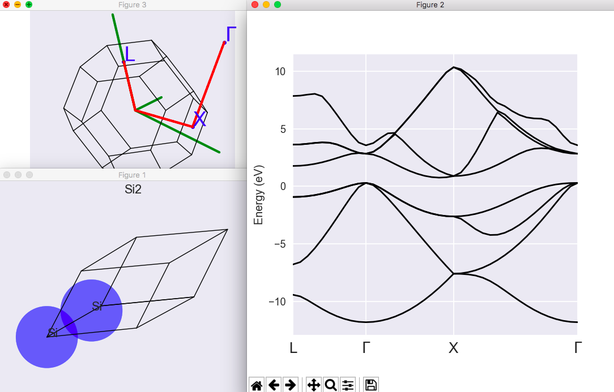
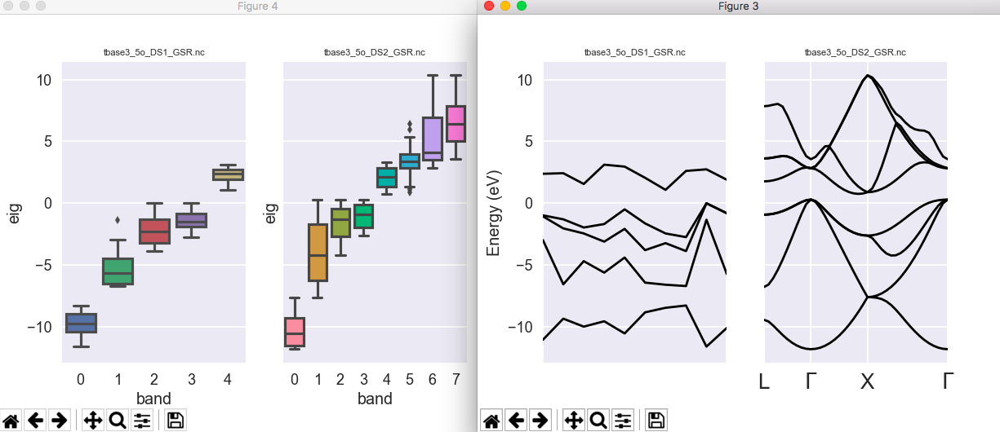

# Third tutorial

## Crystalline silicon.

This tutorial aims at showing you how to get the following physical properties, for an insulator:

* the total energy
* the lattice parameter
* the band structure (actually, the Kohn-Sham band structure)

You will learn about the use of k-points, as well as the smearing of the plane-wave kinetic energy cut-off.

Visualisation tools are NOT covered in this tutorial.
Powerful visualisation procedures have been developed in the Abipy context,
relying on matplotlib. See the README of [Abipy](https://github.com/abinit/abipy)
and the [Abipy tutorials](https://github.com/abinit/abitutorials).

This tutorial should take about 1 hour.

[TUTORIAL_README]

## Computing the total energy of silicon at a fixed number of k-points

*Before beginning, you might consider working in a different subdirectory, as
for tutorial 1 or 2. Why not Work3?*

The file *tbase3_x.files* lists the file names and root names.
You can copy it in the *Work3* directory and change it as you did in the
[[lesson:base1|first]] and [[lesson:base2|second]] tutorials.
You can also copy the file *tbase3_1.in* inside the *Work3* directory with:

```sh
cd $ABI_TESTS/tutorial/Input
mkdir Work3
cd Work3
cp ../tbase3_x.files .   # You will need to edit this file.
cp ../tbase3_1.in .
```

This is your input file:



You should edit it, read it carefully, have a look at the following **new input variables** and their explanation:

* [[rprim]]
* [[xred]] (used instead of [[xcart]])
* [[kptopt]], [[ngkpt]], [[nshiftk]], [[shiftk]], [[kptrlatt]] (not easy, take your time!)
* [[diemac]] (a different value is used for this variable compare to previous calculations where isolated molecules were considered).

Note also the following: you will work at fixed [[ecut]] (8Ha).
It is implicit that in *real life*, you should do a convergence test with respect to *ecut*.
Here, a suitable *ecut* is given to you.
It will result in a lattice parameter that is 0.2% off of the experimental value.

When you have read the input file, you can run the code, as usual:

    abinit < tbase3_x.files > log 2> err &

Then, read the output file, and note the total energy:

    etotal   -8.8662238960E+00

## Starting the convergence study with respect to k-points

There is, of course, a convergence study associated with the sampling of the Brillouin zone.
You should examine different grids, of increasing resolution. You might try the following series of grids:

    ngkpt1  2 2 2
    ngkpt2  4 4 4
    ngkpt3  6 6 6
    ngkpt4  8 8 8

However, the associated number of k-points in the irreducible Brillouin zone grows very fast.
It is

    nkpt1  2
    nkpt2 10
    nkpt3 28
    nkpt4 60

Abinit computes automatically this number of k-points, from the definition of the grid and the symmetries.
You might nevertheless define an input [[nkpt]] value in the input file, in which case the code will compare
its computed value (from the grid) with this input value.

We take this opportunity to examine the behaviour of abinit when a problem is detected.
Let us suppose that with *ngkpt1 4 4 4*, one mentions *nkpt1 2*.
The input file *tbase3_2.in* is an example:



Do not forget to change *tbase3_x.files*, if you are using that file name.
The message that you get a few dozen of lines before the end of the log file is:

```yaml
--- !BUG
message: |
    The argument nkpt=     2, does not match
      the number of k-points generated by kptopt, kptrlatt, shiftk,
      and the eventual symmetries, that is, nkpt=    10.
      However, note that it might be due to the user,
      if nkpt is explicitely defined in the input file.
      In this case, please check your input file.
src_file: getkgrid.F90
src_line: 415
...

Action : contact ABINIT group.
```

This is a typical abinit error message.
It states what is the problem that causes the stop of the code, then suggests that it might be due to an error
in the input file, namely, an erroneous value of [[nkpt]].
The expected value, [[nkpt]] 10 is mentioned before the notice that the input file might be erroneous.
Then, the file at which the problem occurred is mentioned, as well as the number of the line in that file.

As the computation of [[nkpt]] for specific grids of k-points is not an easy task,
while the even more important selection of specific economical grids
(the best ratio between the accuracy of the integration in the Brillouin zone and the number of k-points)
is more difficult, some help to the user is provided by ABINIT.

The code is able to examine automatically different k-point grids, and to propose the best grids for integration.
This is described in the [[help:abinit]], see the input variable [[prtkpt]], and the associated characterisation
of the integral accuracy, described in [[kptrlen]].

!!! tip

    The generation of lists of k-point sets is done in different test cases, in `$ABI_TESTS/v2`.
    You can directly have a look at the output files in `$ABI_TESTS/v2/Refs`,
    the output files for the tests 61 to 73.

When one begins the study of a new material, it is strongly advised to examine first the list of k-points grids,
and select (at least) three efficient ones, for the k-point convergence study.

Do not forget that the CPU time will be linearly proportional to the number of k-points to be treated:
using 10 k-points will take five more times than using 2 k-points. Even for a similar accuracy of the
Brillouin zone integration (about the same value of [[kptrlen]]), it might be easy to generate a grid
that will fold to 10 k-points in the irreducible Brillouin zone, as well as one that will fold to 2 k-points
in the irreducible Brillouin zone.
The latter is clearly to be preferred!

## Convergence study with respect to k-points

In order to understand k-point grids, you should read [[cite:Monkhorst1976]].
Well, maybe not immediately. In the meantime, you can try the above-mentioned convergence study.

The input file *tbase3_3.in* is an example,
while *$ABI_TESTS/tutorial/Refs/tbase3_3.out* is a reference output file.

```sh
cd $ABI_TESTS/tutorial/Work3
cp ../tbase3_3.in .
```



In this output file, you should have a look at the echo of input variables.
As you know, these are preprocessed, and, in particular, [[ngkpt]] and [[shiftk]]
are used to generate the list of k-points ([[kpt]]) and their weights ([[wtk]]).
You should read the information about [[kpt]] and [[wtk]].

From the output file, here is the evolution of total energy per unit cell:

    etotal1  -8.8662238960E+00
    etotal2  -8.8724909739E+00
    etotal3  -8.8726017432E+00
    etotal4  -8.8726056405E+00

The difference between dataset 3 and dataset 4 is rather small.
Even the dataset 2 gives an accuracy of about 0.0001 Ha. So, our converged value for the total energy,
at fixed [[acell]], fixed [[ecut]], is -8.8726 Ha.

## Determination of the lattice parameters

The input variable [[optcell]] governs the automatic optimisation of cell shape and volume.
For the automatic optimisation of cell volume, use:

    optcell 1
    ionmov 2
    ntime 10
    dilatmx 1.05
    ecutsm 0.5

You should read the indications about [[dilatmx]] and [[ecutsm]].
Do not test all the k-point grids, only those with **nkpt** 2 and 10.

The input file *$ABI_TESTS/tutorial/Input/tbase3_4.in* is an example,



while *$ABI_TESTS/tutorial/Refs/tbase3_4.out* is a reference output file.



You should obtain the following evolution of the lattice parameters:

    acell1   1.0233363682E+01  1.0233363682E+01  1.0233363682E+01 Bohr
    acell2   1.0216447241E+01  1.0216447241E+01  1.0216447241E+01 Bohr

with the following very small residual stresses:

    strten1   1.8591719160E-07  1.8591719160E-07  1.8591719160E-07
              0.0000000000E+00  0.0000000000E+00  0.0000000000E+00
    strten2  -2.8279720007E-08 -2.8279720007E-08 -2.8279720007E-08
              0.0000000000E+00  0.0000000000E+00  0.0000000000E+00

The stress tensor is given in Hartree/Bohr<sup>3</sup>, and the order of the components is:

                            11  22  33
                            23  13  12

There is only a 0.13% relative difference between *acell1* and *acell2*.
So, our converged LDA value for Silicon, with the *14si.pspnc* pseudopotential (see the *tbase3_x.files* file)
is 10.216 Bohr (actually 10.21644), that is 5.406 Angstrom.
The experimental value is *5.431* Angstrom at 25 degree Celsius,
see R.W.G. Wyckoff, Crystal structures Ed. Wiley and sons, New-York (1963)
or the [NIST database](https://physics.nist.gov/cgi-bin/cuu/Value?asil|search_for=silicon).

## Computing the band structure

We fix the parameters [[acell]] to the theoretical value of 3 * 10.216,
and we fix also the grid of k-points (the 4x4x4 FCC grid, equivalent to a 8x8x8 Monkhorst-pack grid).
We will ask for 8 bands (4 valence and 4 conduction).

A band structure can be computed by solving the Kohn-Sham equation for many different k-points,
along different segments of the Brillouin zone. The potential that enters the Kohn-Sham must be
derived from a previous self-consistent calculation, and will not vary during the scan of different k-point lines.

Suppose that you want to make a L-Gamma-X-(U-)Gamma circuit, with at least 10 divisions for each segment.
The circuit will be obtained easily by the following choice of segment end points:

    L     (1/2 0 0)
    Gamma (0 0 0)
    X     (0 1/2 1/2)
    Gamma (1 1 1)

In order to enforce at least 10 divisions for each segment, one uses the input variable [[ndivsm]].
ABINIT will generate roughly the same distance between points along each segment,
despite each segment having a different length in reciprocal space.

Note:

1. the last Gamma point is in another cell of the reciprocal space than the first one,
   this choice allows to construct the X-U-Gamma segment easily;

2. the k-points are specified using reduced coordinates - in agreement with the input setting of the primitive 2-atom unit cell -
   in standard textbooks, you will often find the L, Gamma or X point given in coordinates of the conventional 8-atom cell:
   the above-mentioned circuit is then (1/2 1/2 1/2)-(0 0 0)-(1 0 0)-(1 1 1), but such (conventional) coordinates
   cannot be used with the 2-atom (non-conventional) cell.

So, you should set up in your input file, for the first dataset, a usual SCF calculation
in which you output the density ([[prtden]] 1), and, for the second dataset:

* fix [[iscf]] to -2, to make a non-self-consistent calculation;
* define [[getden]] -1, to take the output density of dataset 1;
* set [[nband]] to 8;
* set [[kptopt]] to -3, to define three segments in the brillouin Zone;
* set [[ndivsm]] to 10 
* set [[kptbounds]] to

        0.5  0.0  0.0 # L point
        0.0  0.0  0.0 # Gamma point
        0.0  0.5  0.5 # X point
        1.0  1.0  1.0 # Gamma point in another cell.

* set [[enunit]] to 1, in order to have eigenenergies in eV
* the only tolerance criterion admitted for non-self-consistent calculations is [[tolwfr]].
  You should set it to 1.0d-10 (or so), and suppress [[toldfe]].

The input file *$ABI_TESTS/tutorial/Input/tbase3_5.in* is an example,



while *$ABI_TESTS/tutorial/Refs/tbase3_5.out* is a reference output file.



You should find the band structure starting at (second dataset):

     Eigenvalues (   eV  ) for nkpt=  40  k points:
     kpt#   1, nband=  8, wtk=  1.00000, kpt=  0.5000  0.0000  0.0000 (reduced coord)
      -3.78815  -1.15872   4.69668   4.69668   7.38795   9.23867   9.23867  13.45707
     kpt#   2, nband=  8, wtk=  1.00000, kpt=  0.4500  0.0000  0.0000 (reduced coord)
      -3.92759  -0.95774   4.71292   4.71292   7.40692   9.25561   9.25561  13.48927
     kpt#   3, nband=  8, wtk=  1.00000, kpt=  0.4000  0.0000  0.0000 (reduced coord)
      -4.25432  -0.44393   4.76726   4.76726   7.46846   9.31193   9.31193  13.57737
     kpt#   4, nband=  8, wtk=  1.00000, kpt=  0.3500  0.0000  0.0000 (reduced coord)
      -4.64019   0.24941   4.85732   4.85732   7.56855   9.38323   9.38323  13.64601
     ....

One needs a graphical tool to represent all these data.
In a separate file (*_EIG*), you will find the list of k-points and the eigenenergies
(the input variable [[prteig]] is set by default to 1).

Even without a graphical tool we will have a quick look at the values at L, $\Gamma$, X and $\Gamma$ again:

     kpt#   1, nband=  8, wtk=  1.00000, kpt=  0.5000  0.0000  0.0000 (reduced coord)
      -3.78815  -1.15872   4.69668   4.69668   7.38795   9.23867   9.23867  13.45707

     kpt#  11, nband=  8, wtk=  1.00000, kpt=  0.0000  0.0000  0.0000 (reduced coord)
      -6.17005   5.91814   5.91814   5.91814   8.44836   8.44836   8.44836   9.17755

     kpt#  23, nband=  8, wtk=  1.00000, kpt=  0.0000  0.5000  0.5000 (reduced coord)
      -1.96393  -1.96393   3.00569   3.00569   6.51173   6.51173  15.95524  15.95524

     kpt#  40, nband=  8, wtk=  1.00000, kpt=  1.0000  1.0000  1.0000 (reduced coord)
      -6.17005   5.91814   5.91814   5.91814   8.44836   8.44836   8.44836   9.17755

The last $\Gamma$ is exactly equivalent to the first $\Gamma$.
It can be checked that the top of the valence band
is obtained at $\Gamma$ (=5.91814 eV). The width of the valence band is 12.09 eV, the lowest unoccupied state at X
is 0.594 eV higher than the top of the valence band, at $\Gamma$.

The Si is described as an indirect band gap material (this is correct),
with a band-gap of about 0.594 eV (this is quantitatively quite wrong: the experimental value 1.17 eV is at 25 degree Celsius).
The minimum of the conduction band is even slightly displaced with respect to X, see kpt # 21.
This underestimation of the band gap is well-known (the famous DFT band-gap problem).
In order to obtain correct band gaps, you need to go beyond the Kohn-Sham Density Functional
Theory: use the GW approximation. This is described in [the first tutorial on GW](gw1).

For experimental data and band structure representation, see the book by M.L. Cohen and J.R. Chelikowski [[cite:Cohen1988]].

!!! important

    There is a subtlety that is worth to comment about.
    In non-self-consistent calculations, like those performed in the present band structure calculation,
    with [[iscf]] = -2, not all bands are converged within the tolerance [[tolwfr]].
    Indeed, the two upper bands (by default) have not been taken into account to
    apply this convergence criterion: they constitute a **buffer**.
    The number of such buffer bands is governed by the input variable [[nbdbuf]].

    It can happen that the highest (or two highest) band(s), if not separated by a
    gap from non-treated bands, can exhibit a very slow convergence rate.
    This buffer allows achieving convergence of *important*, non-buffer bands.
    In the present case, 6 bands have been converged with a residual better than
    [[tolwfr]], while the two upper bands are less converged (still sufficiently
    for graphical representation of the band structure).
    In order to achieve the same convergence for all 8 bands, it is advised to use [[nband]]=10  (that is, 8 + 2).

## Using AbiPy to automate the most boring steps

The |AbiPy| package provides several tools to facilitate the preparation of band structure calculations
and the analysis of the output results. First of all, one can use the |abistruct| script with
the `kpath` command to determine a high-symmetry k-path from **any file** containing structural
information (abinit input file, netcdf output files etc.).
The high-symmetry k-path follows the conventions described in [[cite:Setyawan2010]].
Let's try with:

```sh
abistruct.py kpath tbase3_5.in

# Abinit Structure
 natom 2
 ntypat 1
 typat 1 1
 znucl 14
 xred
    0.0000000000    0.0000000000    0.0000000000
    0.2500000000    0.2500000000    0.2500000000
 acell    1.0    1.0    1.0
 rprim
    0.0000000000    5.1080000000    5.1080000000
    5.1080000000    0.0000000000    5.1080000000
    5.1080000000    5.1080000000    0.0000000000

# K-path in reduced coordinates:
# tolwfr 1e-20 iscf -2 getden ??
 ndivsm 10
 kptopt -11
 kptbounds
    +0.00000  +0.00000  +0.00000 # $\Gamma$
    +0.50000  +0.00000  +0.50000 # X
    +0.50000  +0.25000  +0.75000 # W
    +0.37500  +0.37500  +0.75000 # K
    +0.00000  +0.00000  +0.00000 # $\Gamma$
    +0.50000  +0.50000  +0.50000 # L
    +0.62500  +0.25000  +0.62500 # U
    +0.50000  +0.25000  +0.75000 # W
    +0.50000  +0.50000  +0.50000 # L
    +0.37500  +0.37500  +0.75000 # K
    +0.62500  +0.25000  +0.62500 # U
    +0.50000  +0.00000  +0.50000 # X
```

To visualize the band structure stored in the *GSR.nc* file, use the |abiopen| script and the command line:

    abiopen.py tbase3_5o_DS2_GSR.nc --expose -sns=talk



It is also possible to compare multiple GSR files with the |abicomp| script and the syntax

    abicomp.py gsr tbase3_5o_DS1_GSR.nc tbase3_5o_DS2_GSR.nc -e -sns=talk

to produce the following figures:



For further details about the AbiPy API and the GSR file, please consult the |GsrFileNb|.
