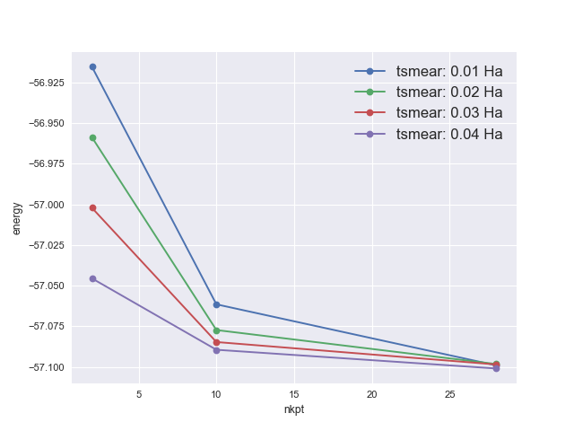

# Fourth tutorial

## Aluminum, the bulk and the surface.  

This tutorial aims at showing how to get the following physical properties for a metal and for a surface:

* the total energy
* the lattice parameter
* the relaxation of surface atoms
* the surface energy

You will learn about the smearing of the Brillouin zone integration, and also a bit about preconditioning the SCF cycle.

This tutorial should take about 1 hour and 30 minutes.

[TUTORIAL_README]

## Total energy and lattice parameters at fixed smearing and k-point grid

*Before beginning, you might consider to work in a different subdirectory, as for tutorials 1, 2 or 3. 
Why not Work4?*

The file *tbase4_x.files* lists the file names and root names. 
You can copy it in the *Work4* directory (and change it, as usual). 
You can also copy the file *tbase4_1.in* in *Work4*. 

```sh
cd $ABI_TESTS/tutorial/Input
mkdir Work4
cd Work4
cp ../tbase4_x.files .  # You will need to edit this file.
cp ../tbase4_1.in .
```

*tbase4_1.in* is our input file. You should edit it and read it carefully,



and then a look at the following new input variables:

* [[occopt]]
* [[tsmear]]

Note also the following:  

1. We will work at fixed [[ecut]] (6Ha). It is implicit that in *real research application*, 
   you should do a convergence test with respect to *ecut*. 
   Here, a suitable *ecut* is given to you in order to save time. 
   It will give a lattice parameter that is 0.2% off of the experimental value. 
   Note that this is the *softer* pseudopotential of those that we have used until now: the *01h.pspgth* for H needed 30 Ha 
   (it was rather hard), the *14si.pspnc* for Si needed 8 Ha. Se the end of this page for a 
   discussion of *soft* and *hard* pseudopotentials.

2. The input variable [[diemac]] has been suppressed. 
   Aluminum is a metal, and the default is tailored for that case.

When you have read the input file, you can run the code, as usual (it will take a few seconds). 

```sh
abinit < tbase4_x.files > log 2> err &
```

Then, read the output file quietly. 
You should note that the Fermi energy and occupation numbers have been computed automatically:

     Fermi (or HOMO) energy (hartree) =   0.26847   Average Vxc (hartree)=  -0.34746
     Eigenvalues (hartree) for nkpt=   2  k points:
     kpt#   1, nband=  3, wtk=  0.75000, kpt= -0.2500  0.5000  0.0000 (reduced coord)
       0.09425   0.25438   0.41909
          occupation numbers for kpt#   1
       2.00003   1.33307   0.00014
     prteigrs : prtvol=0 or 1, do not print more k-points.

You should also note that the components of the total energy include an entropy term:

     Components of total free energy (in Hartree):

        Kinetic energy  =  8.70954971782498E-01
        Hartree energy  =  3.84986358590396E-03
        XC energy       = -8.08434339502224E-01
        Ewald energy    = -2.72948286712169E+00
        PspCore energy  =  3.78721653637092E-02
        Loc. psp. energy=  8.26684645838168E-02
        NL   psp  energy=  4.52588269933839E-01
        >>>>> Internal E= -2.08998347137414E+00

        -kT*entropy     = -7.99729047978171E-03
        >>>>>>>>> Etotal= -2.09798076185393E+00

     Other information on the energy :
        Total energy(eV)= -5.70889598417024E+01 ; Band energy (Ha)=   3.6059822203E-01

## The convergence study with respect to k-points

There is of course a convergence study associated to the sampling of the Brillouin zone. 
You should examine different grids, of increasing resolution. 
You might try the following series of grids:

    ngkpt1  2 2 2
    ngkpt2  4 4 4
    ngkpt3  6 6 6
    ngkpt4  8 8 8

with the associated [[nkpt]]:

    nkpt1  2
    nkpt2 10
    nkpt3 28
    nkpt4 60

The input file *tbase4_2.in* is an example:



while *tbase4_2.out* is a reference output file:



The run might take about thirty seconds on a PC 3 GHz.

You will see that, **for the particular value** [[tsmear]] = 0.05 Ha, the lattice parameter 
is already converged with [[nkpt]] = 10:

    acell1     7.5588968086E+00  7.5588968086E+00  7.5588968086E+00 Bohr
    acell2     7.5070431499E+00  7.5070431499E+00  7.5070431499E+00 Bohr
    acell3     7.5016877756E+00  7.5016877756E+00  7.5016877756E+00 Bohr
    acell4     7.4992662653E+00  7.4992662653E+00  7.4992662653E+00 Bohr

Note that there is usually a **strong** cross-convergence effect between the number of 
k-points and the value of the broadening, [[tsmear]]. 
The right procedure is: for each value of *tsmear*, convergence with respect to the number of k-points, 
then compare the k-point converged values for different values of *tsmear*.

In what follows, we will restrict ourselves to the grids with [[nkpt]] = 2, 10 and 28.

<a id="3"></a>
## The convergence study with respect to both number of k-points and broadening factor

The theoretical convergence rate for [[tsmear]] heading to 0, in the case of [[occopt]] = 4, is quartic. 
This is obtained in the hypothesis of infinitely dense k-point grid. 
We will check the evolution of [[acell]] as a function of [[tsmear]], for the following values 
of *tsmear*: 0.01, 0.02, 0.03 and 0.04. 

Use the double-loop capability of the multi-dataset mode, 
with the *tsmear* changes in the **inner** loop. This will saves CPU time, as the wavefunctions 
of the previous dataset will be excellent (no transfer to different k-points).

The input file *tbase4_3.in* is an example:



while *tbase4_3.out* is thre reference output file.



From the output file, here is the evolution of [[acell]]:

    acell11    7.5587661702E+00  7.5587661702E+00  7.5587661702E+00 Bohr
    acell12    7.5587696944E+00  7.5587696944E+00  7.5587696944E+00 Bohr
    acell13    7.5587696871E+00  7.5587696871E+00  7.5587696871E+00 Bohr
    acell14    7.5587710578E+00  7.5587710578E+00  7.5587710578E+00 Bohr
    acell21    7.5055168997E+00  7.5055168997E+00  7.5055168997E+00 Bohr
    acell22    7.5056781966E+00  7.5056781966E+00  7.5056781966E+00 Bohr
    acell23    7.5018335937E+00  7.5018335937E+00  7.5018335937E+00 Bohr
    acell24    7.5041510220E+00  7.5041510220E+00  7.5041510220E+00 Bohr
    acell31    7.4963466654E+00  7.4963466654E+00  7.4963466654E+00 Bohr
    acell32    7.4957099831E+00  7.4957099831E+00  7.4957099831E+00 Bohr
    acell33    7.4969520318E+00  7.4969520318E+00  7.4969520318E+00 Bohr
    acell34    7.4993529673E+00  7.4993529673E+00  7.4993529673E+00 Bohr

These data should be analyzed properly. For [[tsmear]] = 0.01, the converged value, 
contained in *acell31*, must be compared to *acell11* and *acell21*: 
between *acell21* and *acell31*, the difference is below 0.2%. 
*acell31* can be considered to be converged with respect to the number of k-points, at fixed **tsmear**.
This **tsmear** being the lowest one, it is usually the most difficult to converge, 
and the values acell31,32,33 and 34 are indeed well-converged with respect to the k-point number. 
The use of the largest **tsmear** = 0.04, giving **acell34**, induces only a small error in the lattice parameter. 
For that particular value of *tsmear*, one can use the second k-point grid, giving *acell24*.

!!! summary

    So to summarize: we can choose to work with a 10 k-point grid in the irreducible Brillouin
    zone, and the associated [[tsmear]] = 0.04, with less than 0.1% error on the lattice parameter.
    Note that this error due to the Brillouin zone sampling could add to the error
    due to the choice of [[ecut]] (that was mentioned previously to be on the order of 0.2%).

In what follows, we will stick to these values of [[ecut]] and [[tsmear]] and try to use k-point grids with a similar resolution.

Our final value for the aluminum lattice parameter, in the LDA, using the *13al.981214.fhi* pseudopotential, 
is thus 7.5041 Bohr. 

!!! note

    For historical reasons (consistency with older versions of the tutorial), we will work on the following, 
    with a slightly different value, of 7.5056 Bohr, that is 3.9718 Angstrom. 
    The experimental value at 25 degree Celsius is 4.04958 Angstrom.

The associated total energy and accuracy can be deduced from:

    etotal11   -2.0916027819E+00
    etotal12   -2.0931968906E+00
    etotal13   -2.0947909992E+00
    etotal14   -2.0963851177E+00
    etotal21   -2.0969713557E+00
    etotal22   -2.0975525285E+00
    etotal23   -2.0978233733E+00
    etotal24   -2.0979980153E+00
    etotal31   -2.0983520905E+00
    etotal32   -2.0983215368E+00
    etotal33   -2.0983305960E+00
    etotal34   -2.0984218116E+00

**etotal** 24 is -2.0979980153E+00 Ha, with an accuracy of 0.0005 Ha.


!!! tip

    To analyze the convergence of the total energy, one can use the |abicomp| script
    provide by |AbiPy| and the `gsr` command that will start an interactive |ipython| session
    so that we can interact directly with the AbiPy object.
    To load all the GSR files produced by calculation, use the command

        abicomp.py gsr tbase4_3o*GSR.nc

    then, inside the ipython terminal, execute the `plot_convergence` method of the `GsrRobot`:

    ```ipython
    In [1]: robot.plot_convergence("energy", sortby="nkpt", hue="tsmear")
    ```

    to produce this plot with the total energy in eV for different values of nkpt grouped by tsmear:

    

## Surface energy of aluminum (100): changing the orientation of the unit cell

In order to study the Aluminum (100) surface, we will have to set up a supercell representing a slab. 
This supercell should be chosen as to be compatible with the primitive surface unit cell. 
The corresponding directions are `[-1 1 0]` and `[1 1 0]`. The direction perpendicular to the surface is `[0 0 1]`. 
There is no primitive cell of bulk aluminum based on these vectors, but a doubled cell. 
We will first compute the total energy associated with this doubled cell. 
This is not strictly needed, but it is a valuable intermediate step towards the study of the surface.

You might start from *tbase4_3.in*. You have to change [[rprim]]. Still, try to keep [[acell]] 
at the values of bulk aluminum that were determined previously. 
But it is not all: the most difficult part in the passage to this doubled cell is the definition of the k-point grid. 
Of course, one could just take a homogeneous simple cubic grid of k-points, but this will not 
correspond exactly to the k-point grid used in the primitive cell in *tbase4_3.in*.
This would not be a big problem, but you would miss some error cancellation.

The answer to this problem is given in the input file *$ABI_TESTS/tutorial/Input/tbase4_4.in*.



The procedure to do the exact translation of the k-point grid will not be explained here (sorry for this). 
If you do not see how to do it, just use homogeneous simple cubic grids, with about the same resolution 
as for the primitive cell case. There is a simple rule to estimate **roughly** whether two
grids for different cells have the same resolution: simply multiply the linear dimensions of the k-point grids, 
by the number of sublattices, by the number of atoms in the cell. 
For example, the corresponding product for the usual 10 k-point grid is `4x4x4 x 4 x 1 = 256`. 
In the file *tbase4_4.in*, one has `4x4x4 x 2 x 2 = 256`. 
The grids of k-points should not be too anisotropic for this rough estimation to be valid.

Note also the input variables [[rprim]] and [[chkprim]] in this input file.

Now run *tbase4_4.in* (the reference file is *$ABI_TESTS/tutorial/Refs/tbase4_4.out*).
You should find the following total energy:

    etotal     -4.1962972610E+00

It is not exactly twice the total energy for the primitive cell, mentioned above, but the difference is less than 0.0005 Ha. 
It is due to the different FFT grids used in the two runs, and affect the exchange-correlation energy. 
These grids are always homogeneous primitive 3D grids, so that changing the orientation of the lattice 
will give mutually incompatible lattices. Increasing the size of the FFT grid would improve the agreement.

## Surface energy: a (3 aluminum layer + 1 vacuum layer) slab calculation

We will first compute the total energy associated with only three layers of aluminum, 
separated by only one layer of vacuum. 
This is kind of a minimal slab:

* one surface layer
* one "bulk" layer
* one surface layer
* one vacuum layer
* ...

It is convenient to take the vacuum region as having a multiple of the width of the aluminum layers, but this is not mandatory. 
The supercell to use is the double of the previous cell (that had two layers of Aluminum atoms along the `[0 0 1]` direction). 
Of course, the relaxation of the surface might give an important contribution to the total energy.

You should start from *tbase4_4.in*.
You have to modify [[rprim]] (double the cell along `[0 0 1]`), the atomic positions, as well as the k-point mesh. 
For the latter, it is supposed that the electrons cannot propagate from one slab to its image in the `[0 0 1]` direction, 
so that the $k_z$ component of the special k-points can be taken 0: only one layer of k-points is needed along the z-direction. 
You should also allow the relaxation of atomic positions, but not the relaxation of lattice parameters 
(the lattice parameters along x or y must be considered fixed to the bulk value, while, for the z direction, 
there is no interest to allow the vacuum region to collapse!

The input file *tbase4_5.in* is an example, 



while *tbase4_5.out* is the reference output file.



The run might last one minute.

The total energy after the first SCF cycle, when the atomic positions are equal to their starting values, is:

    ETOT  6  -6.2619738807344

Note that the total energy of three aluminum atoms in the bulk, 
(from section 4.3, etotal24 multiplied by three) is -6.293994 Ha
so that the non-relaxed surface energy, per surface unit cell (there are two surfaces in our simulation cell!) 
is 0.016010 Ha = 0.436 eV.

The total energy after the Broyden relaxation is:

    etotal     -6.2622251508E+00

so that the relaxed surface energy, per surface unit cell is 0.015885 Ha = 0.432eV.
It seems that the relaxation energy is very small, compared to the surface energy, but we need to do the convergence studies.

## Surface energy: increasing the number of vacuum layers

One should now increase the number of vacuum layers: 2 and 3 layers instead of only 1.
It is preferable to define atomic positions in Cartesian coordinates. 
The same coordinates will work for both 2 and 3 vacuum layers, while this is not the case for reduced coordinates, 
as the cell size increases.

The input file *tbase4_6.in* is an example input file, 



while *tbase4_6.out* is the reference output file. 



The run is on the order of thirty seconds on a PC 3 GHz.

In the Broyden step 0 of the first dataset, you will notice the WARNING:

     scprqt:  WARNING -
      nstep=    6 was not enough SCF cycles to converge;
      maximum force difference=  5.493E-05 exceeds toldff=  5.000E-05

The input variable [[nstep]] was intentionally set to the rather low value of 6, to warn you about 
possible convergence difficulties. 
The SCF convergence might indeed get more and more difficult with cell size. 
This is because the default preconditioner (see the notice of the input variable [[dielng]]) is not very good 
for the metal+vacuum case. 
For the interpretation of the present run, this is not critical, as the convergence criterion 
was close of being fulfilled, but one should keep this in mind, as you will see.

For the 2 vacuum layer case, one has the non-relaxed total energy:

    ETOT  6  -6.2539524271719

giving the unrelaxed surface energy 0.0200 Ha = 0.544 eV;
and for the relaxed case:

    etotal1    -6.2547006435E+00

(this one is converged to the required level) giving the relaxed surface energy 0.0196 Ha = 0.533 eV

Note that the difference between unrelaxed and relaxed case is a bit larger than in the case of one vacuum layer. 
This is because there was some interaction between slabs of different supercells.

For the 3 vacuum layer case, the self-consistency is slightly more difficult than with 2 vacuum layers: 
the Broyden step 0 is not sufficiently converged (one might set [[nstep]] to a larger value, but the best 
is to change the preconditioner, as described below)... 
However, for the Broyden steps number 2 and beyond, because one takes advantage of the previous wavefunctions, 
a sufficient convergence is reached. 
The total energy, in the relaxed case, is:

    etotal2    -6.2559103620E+00

giving the relaxed surface energy `0.0190 Ha = 0.515 eV`. 
There is a rather small 0.018 eV difference with the 2 vacuum layer case.

For the next run, we will keep the 2 vacuum layer case, and we know that the accuracy 
of the coming calculation cannot be better than 0.016 eV. One might investigate the 4 vacuum layer case, 
but this is not worth, in the present tutorial.

## Surface energy: increasing the number of aluminum layers

One should now increase the number of aluminum layers, while keeping 2 vacuum layers. 
We will consider 4 and 5 aluminum layers. This is rather straightforward to set up, but will also change the preconditioner. 
One could use an effective dielectric constant of about 3 or 5, with a rather small mixing coefficient, on the order of 0.2. 
However, there is also another possibility, using an estimation of the dielectric matrix governed by [[iprcel]]=45. 
For comparison with the previous treatment of SCF, one can recompute the result with 3 aluminum layers.

The input file *tbase4_7.in* is an example, while 



*tbase4_7.out* is a reference output file. 



This run might take about one minute, and is the longest of the four basic tutorials. You should start it now.

You will notice that the SCF convergence is rather satisfactory, for all the cases (3, 4 or 5 metal layers).

For the 3 aluminum layer case, one has the non-relaxed total energy:

    ETOT  6  -6.2539524363433

(this quantity is converged, unlike in test 4.6) giving the unrelaxed surface energy 0.0200 Ha = 0.544 eV; 
and for the relaxed case:

etotal1    -6.2547008127E+00

(by contrast the difference with test 4.6 is less than 1 microHa) giving 
the relaxed surface energy 0.0196 Ha = 0.533 eV.

For the 4 aluminum layer case, one has the non-relaxed total energy:

    ETOT  6  -8.3546873357119

giving the unrelaxed surface energy 0.0186Ha = 0.506 eV; and for the relaxed case:

    etotal2    -8.3565593186E+00

giving the relaxed surface energy 0.0183 Ha = 0.498 eV.

For the 5 aluminum layer case, one has the non-relaxed total energy:

    ETOT  6  -10.453642176439

giving the unrelaxed surface energy 0.0183Ha = 0.498 eV; and for the relaxed case:

    etotal3    -1.0454163186E+01

giving the relaxed surface energy 0.0180 Ha = 0.490 eV.

The relative difference in the surface energy of the 4 and 5 layer cases is on the order of 1.5%.

In the framework of this tutorial, we will not pursue this investigation, which is a simple application 
of the concepts already explored.

Just for your information, and as an additional warning, when the work accomplished 
until now is completed with 6 and 7 layers without relaxation
(see *\$ABI_TESTS/tutorial/Input/tbase4_8.in* and *\$ABI_TESTS/tutorial/Refs/tbase4_8.out* where 5, 6 and 7 layers are treated),
this non-relaxed energy surface energy behaves as follows:  

number of aluminum layers | surface energy  
--- | ---  
3   | 0.544 eV  
4   | 0.506 eV  
5   | 0.498 eV  
6   | 0.449 eV  
7   | 0.463 eV  

So, the surface energy convergence is rather difficult to reach. Our values, with a `4x4x1` grid, 
a smearing of 0.04 Ha, a kinetic energy cut-off of 6 Ha, the *13al.981214.fhi* pseudopotential, 
still oscillate between 0.45 eV and 0.51 eV. 
Increasing the k-point sampling might decrease slightly the oscillations, but note that this effect 
is intrinsic to the computation of properties of a metallic surface: the electrons are confined inside the slab potential, 
with sub-bands in the direction normal to the surface, and the Fermi energy oscillates with the width of the slab. 
This effect might be understood based on a comparison with the behaviour of a jellium slab. 
An error on the order of 0.016 eV is due to the thin vacuum layer. 
Other sources of errors might have to be rechecked, seeing the kind of accuracy that is needed.

Experimental data give a surface energy around 0.55 eV (sorry, the reference is to be provided).

## Soft and hard pseudopotentials

In the context of a plane-wave basis, a *soft* pseudopotential means that a low [[ecut]] 
will be required to obtain convergence whereas a *hard* pseudopotential implies that a high [[ecut]] will be needed. 
It can be understood by considering the pseudo-wave-functions of that atom. 
A *hard* pseudopotential has pseudo-wave-functions that have sharp features in real space which require many plane-waves to describe. 

On the other hand, a *soft* pseudopotential has rather smooth pseudo-wave-functions that need 
fewer plane-waves to describe accurately than the pseudo-wave-functions of *hard* pseudopotentials. 
This designation is somewhat qualitative, and it is relative to other pseudopotentials. 
In other words, a pseudopotential can be *soft* when compared to a certain pseudopotential but *hard* with respect to another. 

In general, pseudopotentials describing light elements, those of the 2nd line of the periodic table, 
and pseudopotentials that include semi-core states are considered *hard* as they have strongly peaked pseudo-wave-functions 
that require a large [[ecut]]. 
This discussion is valid for norm-conserving pseudopotentials. With PAW pseudopotentials, 
we are able to keep pseudo-wave-function smooth which means that they will require lower [[ecut]] 
than their norm-conserving counterpart which is one of their main benefits.      
