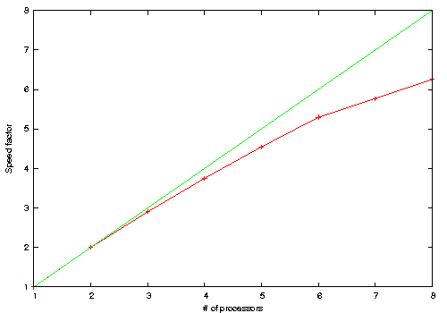

# Tutorial on basic parallelism

## Parallelism in ABINIT, generalities and environments.

There are many situations where a sequential code is not enough, often because
it would take too much time to get a result. There are also cases where you
just want things to go as fast as your computational resources allow it.
By using more than one processor, you might also have access to more memory than
with only one processor.
To this end, it is possible to use ABINIT in
parallel, with dozens, hundreds or even thousands processors.

This tutorial offers you a little reconnaissance tour inside the complex world
that emerges as soon as you want to use more than one processor.
From now on, we will suppose that you are already familiar with ABINIT and that you have
gone through all four basic tutorials. If this is not the case, we strongly
advise you to do so, in order to truly benefit from this tutorial.

We strongly recommend you to acquaint yourself with some basic concepts of
[parallel computing](https://en.wikipedia.org/wiki/Parallel_computing) too.
In particular [Almdalh's law](https://en.wikipedia.org/wiki/Amdahl%27s_law),
that rationalizes the fact that, beyond some number of processors, the
inherently sequential parts will dominate parallel parts, and give a
limitation to the maximal speed-up that can be achieved.

## Generalities

With the broad availability of multi-core processors, everybody now has a
parallel machine at hand. ABINIT will be able to take advantage of the
availability of several cores for most of its capabilities, be it ground-state
calculations, molecular dynamics, linear-response, many-body perturbation theory, ...

Such tightly integrated multi-core processors (or so-called SMP machines,
meaning Symmetric Multi-Processing) can be interlinked within networks, based
on Ethernet or other types of connections (Quadrics, Myrinet, etc ...).
The number of cores in such composite machines can easily exceed one hundred, and
go up to a fraction of a million these days.
Most ABINIT capabilities can use efficiently several hundred computing cores.
In some cases, even more than ten thousand computing cores can be used efficiently.

Before actually starting this tutorial and the associated ones, we strongly
advise you to get familiar with your own parallel environment. It might be
relatively simple for a SMP machine, but more difficult for very powerful
machines. You will need at least to have MPI (see next section) installed on
your machine. Take some time to determine how you can launch a job in parallel
with MPI (typically the `qsub` or `sbatch` command and an associated shell script),
what are the resources available and the limitations as well, and do not hesitate to
discuss with your system administrator if you feel that something is not clear to you.

We will suppose in the following that you know how to run a parallel program
and that you are familiar with the peculiarities of your system.
Please remember that, as there is no standard way of setting up a parallel
environment, we are not able to provide you with support beyond ABINIT itself.

## Characteristics of parallel environments

Different software solutions can be used to benefit from parallelism.
Most of ABINIT parallelism is based on MPI, but significant additional speed-up (or a better
distribution of data, allowing to run bigger calculations) is based on OpenMP and multi-threaded libraries.
As of writing, efforts also focus on Graphical Processing Units (GPUs), with
CUDA and MAGMA. The latter will not be described in the present tutorial.

### MPI

MPI stands for Message Passing Interface. The goal of MPI, simply stated, is
to develop a widely used standard for writing message- passing programs.
As such the interface attempts to establish a practical, portable, efficient, and
flexible standard for message passing.

The main advantages of establishing a message-passing standard are portability
and ease-of-use. In a distributed memory communication environment in which
the higher level routines and/or abstractions are build upon lower-level
message-passing routines, the benefits of standardization are particularly
obvious. Furthermore, the definition of a message-passing standard provides
vendors with a clearly defined base set of routines that they can implement
efficiently, or in some cases provide hardware support for, thereby enhancing
scalability (see <http://mpi-forum.org>).

At some point in its history MPI has reach a critical popularity level, and a
bunch of projects have popped-up like daisies in the grass. Now the tendency
is back to gathering and merging. For instance, Open MPI is a project
combining technologies and resources from several other projects
(FT-MPI, LA-MPI, LAM/MPI, and PACX-MPI) in order to build the best MPI library available.
Open MPI is a completely new MPI3.1-compliant implementation, offering
advantages for system and software vendors, application developers and
computer science researchers (see <https://www.open-mpi.org>)

### OpenMP

The OpenMP Application Program Interface (API) supports multi-platform
**shared-memory** parallel programming in C/C++ and Fortran on all
architectures, including Unix platforms and Windows NT platforms.
Jointly defined by a group of major computer hardware and software vendors, OpenMP is
a portable, scalable model that gives shared-memory parallel programmers a
simple and flexible interface for developing parallel applications for
platforms ranging from the desktop to the supercomputer (<http://www.openmp.org>).

OpenMP was rarely used within ABINIT versions < 8.8.x, and only for specific purposes.
Last versions > 8.8 now benefits from multi-threaded libraries speedup like MKL and fftw3.
Still not mandatory, on new architecture like Intel Xeon Phi KNL or last Intel Xeon Skylake,
multithreading shows better performances than MPI (*if and only if* an multithread version of linear
algebra library is provided)

### Scalapack

Scalapack is the parallel version of the popular LAPACK library (for linear
algebra). It can play some role in the parallelism of several parts of ABINIT,
especially the LOBPCG algorithm in ground state calculations, and the parallelism for the Bethe-
Salpether equation. ScaLAPACK being itself based on MPI, we will not discuss
its use in ABINIT in this tutorial.

!!! warning

    Scalapack is not thread-safe in many versions.
    Combining OpenMP and Scalapack can result is unpredictable behaviours.

### Fast/slow communications

Characterizing the data-transfer efficiency between two computing cores (or
the whole set of cores) is a complex task. At a quite basic level, one has to
recognize that not only the quantity of data that can be transferred per unit
of time is important, but also the time that is needed to initialize such a
transfer (so called *latency*).

Broadly speaking, one can categorize computers following the speed of
communications. In the fast communication machines, the latency is very low
and the transfer time, once initialized, is very low too. For the parallelised
part of ABINIT, SMP machines and machines with fast interconnect (Quadrics,
Myrinet ...) will usually not be limited by their network characteristics, but
by the existence of residual sequential parts. The tutorials that have been
developed for ABINIT have been based on fast communication machines.

If the set of computing cores that you plan to use is not entirely linked
using a fast network, but includes some connections based e.g. on Ethernet,
then, you might not be able to benefit from the speed-up announced in the
tutorials. You have to perform some tests on your actual machine to gain
knowledge of it, and perhaps consider using multithreading.

## What parts of ABINIT are parallel?

Parallelizing a code is a very delicate and complicated task, thus do not
expect that things will systematically go faster just because you are using a
parallel version of ABINIT. Please keep also in mind that in some situations,
parallelization is simply impossible. At the present time, the parts of ABINIT
that have been parallelized, and for which a tutorial is available, include:

* [ground state with plane waves](paral_gspw),
* [ground state with wavelets](paral_gswvl),
* [molecular dynamics](paral_moldyn),
* [parallelism on "images"](paral_images),
* [density-functional perturbation theory (DFPT)](paral_dfpt),
* [Many-Body Perturbation Theory](paral_mbt).

Note that the tutorial on [ground state with plane waves](paral_gspw) presents a complete overview of this
parallelism, including up to four levels of parallelisation and, as such, is rather complex.
Of course, it is also quite powerful, and allows to use several hundreds of processors.

Actually, the two levels based on

  * the treatment of k-points in reciprocal space;
  * the treatment of spins, for spin-polarized collinear situations [[nsppol]] = 2);

are, on the contrary, quite easy to use. An example of such parallelism will
be given in the next section.

## A simple example of parallelism in ABINIT

[TUTORIAL_README]

### Running a job

*Before starting, you might consider working in a different subdirectory as
for the other tutorials. Why not Work_paral?*

Copy the `files` file and the input file from the *\$ABI_TESTS/tutorial*
directory to your work directory. They are named *tbasepar_1.files* and *tbasepar_1.in*.

```sh
cd $ABI_TESTS/tutorial/Input
mkdir Work_paral
cd Work_paral
cp ../tbasepar_1.files .   # You will need to edit this file.
cp ../tbasepar_1.in .
```

You can start immediately a sequential run with

    abinit < tbasepar_1.files > log 2> err

to have a reference CPU time.
On a 2.8GHz PC, it runs in about one minute.

Contrary to the sequential case, it is worth to have a look at the `files`
file, and to modify it for the parallel execution, as one should avoid
unnecessary network communications. If every node has its own temporary or
scratch directory, you can achieve this by providing a path to a local disk
for the temporary files in `abinit.files`. Supposing each processor has access
to a local temporary disk space named `/scratch/user`, then you might modify
the 5th line of the `files` file so that it becomes:

    tbasepar_1.in
    tbasepar_1.out
    tbasepar_1i
    tbasepar_1o
    /scratch/user/tbasepar_1
    ../../Psps_for_tests/HGH/82pb.4.hgh

Note that determining ahead of time the precise resources you will need for
your run will save you a lot of time if you are using a batch queue system.
Also, for parallel runs, note that the _log_ files **will not** be written exept the main log file.

You can change this behaviour by creating a file named `_LOG` to enforce the creation of all log files

```bash
touch _LOG
```

On the contrary, you can create a *_NOLOG* file if you want to avoid all log files.

### Parallelism over the k-points

The most favorable case for a parallel run is to treat the k-points
concurrently, since the calculations can be done independently for each one of them.

Actually, *tbasepar_1.in* corresponds to the investigation of a *fcc* crystal of
lead, which requires a large number of k-points if one wants to get an
accurate description of the ground state. Examine this file. Note that the
cut-off is realistic, as well as the grid of k-points (giving 60 k points in
the irreducible Brillouin zone). However, the number of SCF steps, [[nstep]],
has been set to 3 only. This is to keep the CPU time reasonable for this
tutorial, without affecting the way parallelism on the k points will be able
to increase the speed. Once done, your output files have likely been produced.
Examine the timing in the output file (the last line gives the CPU `overall time` and
`Wall time`), and keep note of it.

We assume you have compiled ABINIT with MPI enable `--enable-mpi` option at configuration step.
On a multi-core PC, you might succeed to use two compute cores by issuing the run command for your MPI
implementation, and mention the number of processors you want to use, as well
as the abinit command:

```bash
mpirun -n 2 abinit < tbasepar_1.files >& tbasepar_1.log &
```

Depending on your particular machine, *mpirun* might have to be replaced by
*mpiexec*, and `-n` by some other option.

On a cluster, with the MPICH implementation of MPI, you have to set up a file
with the addresses of the different CPUs. Let's suppose you call it _cluster_.
For a PC bi-processor machine, this file could have only one line, like the following:

    sleepy.pcpm.ucl.ac.be:2

For a cluster of four machines, you might have something like:

    tux0
    tux1
    tux2
    tux3

Then, you have to issue the run command for your MPI implementation, and
mention the number of processors you want to use, as well as the abinit
command and the file containing the CPU addresses.

On a PC bi-processor machine, this gives the following:

```bash
mpirun -np 2 -machinefile cluster ../../src/main/abinit < tbasepar_1.files >& tbasepar_1.log &
```

Now, examine the corresponding output file. If you have kept the output from
the sequential job, you can make a diff between the two files. You will notice
that the numerical results are quite identical. You will also see that 60
k-points have been kept in the memory in the sequential case, while 30
k-points have been kept in the memory (per processor !) in the parallel case.

The timing can be found at the end of the file. Here is an example:

    - Proc.   0 individual time (sec): cpu=         28.3  wall=         28.3

    ================================================================================

     Calculation completed.
     Delivered    1 WARNINGs and   1 COMMENTs to log file.
    +Overall time at end (sec) : cpu=         56.6  wall=         56.6


This corresponds effectively to a speed-up of the job by a factor of two.
Let's examine it. The line beginning with `Proc. 0` corresponds to the CPU and
Wall clock timing seen by the processor number 0 (processor indexing always
starts at 0: here the other is number 1): 28.3 sec of CPU time, and the same
amount of Wall clock time. The line that starts with `+Overall time`
corresponds to the sum of CPU times and Wall clock timing for all processors.
The summation is quite meaningful for the CPU time, but not so for the wall
clock time: the job was finished after 28.3 sec, and not 56.6 sec.

Now, you might try to increase the number of processors, and see whether the
CPU time is shared equally amongst the different processors, so that the Wall
clock time seen by each processor decreases. At some point (depending on your
machine, and the sequential part of ABINIT), you will not be able to decrease
further the Wall clock time seen by one processor. It is not worth to try to
use more processors. You should get a curve similar to this one:


_Speedup with k point parallelization_

The red curve materializes the speed-up achieved, while the green one is the
$y = x$ line. The shape of the red curve will vary depending on your hardware
configuration. The definition of the speed-up is the time taken in a
sequential calculation divided by the time for your parallel calculation (hopefully > 1) .

One last remark: the number of k-points need not be a multiple of the number
of processors. As an example, you might try to run the above case with 16
processors: all will treat $\lfloor 60/16 \rfloor$ k points, but $60-16\times3=12$ processors
will have to treat one more k point so that $12*4+16*3=60$.
The maximal speed-up will only be 15 (=60/4), instead of 16.

Try to avoid leaving an empty processor as this can make abinit fail with
certain compilers. An empty processor happens, for example, if you use more processors
than the number of k point.
The extra processors do no useful work, but have to run anyway, just to confirm to abinit
once in a while that all processors are alive.

### Parallelism over the spins

The parallelization over the spins (up, down) is done along with the one over
the k-points, so it works exactly the same way. The files
*tbasepar_2.in* and *tbasepar_2.files* in *\$ABI_TESTS/tutorial* treat a spin-polarized system
(distorted FCC Iron) with only one k-point in the Irreducible Brillouin Zone.
This is quite unphysical, and has the sole purpose to show the spin
parallelism with as few as two processors: the k-point parallelism has
precedence over the spin parallelism, so that with 2 processors, one needs
only one k-point to see the spin parallelism.
If needed, modify the _files_ file, to provide a local temporary disk space.
Run this test case, in sequential, then in parallel.

While the jobs are running, read the input and files file. Then look closely
at the output and log files. They are quite similar. With a diff, you will see
the only obvious manifestation of the parallelism in the following:

    < P newkpt: treating     40 bands with npw=    2698 for ikpt=   1
    < P newkpt: treating     40 bands with npw=    2698 for ikpt=   1
    ---
    > P newkpt: treating     40 bands with npw=    2698 for ikpt=   1 by node    0
    > P newkpt: treating     40 bands with npw=    2698 for ikpt=   1 by node    1


In the second case (parallelism), node 0 is taking care of the up state for
k-point 1, while node 1 is taking care of the down state for k-point 1. The
timing analysis is very similar to the k-point parallelism case.

If you have more than 2 processors at hand, you might increase the value of
[[ngkpt]], so that more than one k-point is available, and see that the
k-point and spin parallelism indeed work concurrently.

### Number of computing cores to accomplish a task

Balancing efficiently the load on the processors is not always
straightforward. When using k-point- and spin-parallelism, the ideal numbers
of processors to use are those that divide the product of [[nsppol]] by
[[nkpt]] (e.g. for [[nsppol]] * [[nkpt]], it is quite efficient to use 2, 3, 4,
6 or 12 processors). ABINIT will nevertheless handle correctly other numbers
of processors, albeit slightly less efficiently, as the final time will be
determined by the processor that will have the biggest share of the work to do.

### Evidencing overhead

Beyond a certain number of processors, the efficiency of parallelism
saturates, and may even decrease. This is due to the inevitable overhead
resulting from the increasing amount of communication between the processors.
The loss of efficiency is highly dependent on the implementation and linked to
the decreasing charge on each processor too.

<!--
## Details of the implementation

### The MPI toolbox in ABINIT

The ABINIT-specific MPI routines are located in different subdirectories of
`~abinit/src` : `12_hide_mpi/`, `51_manage_mpi/`, `56_io_mpi/`, `79_seqpar_mpi/`. They include:

  * low-level communication handlers
  * header I/O helpers (hdr_io, hdr_io_netcdf);
  * wavefunction I/O helpers (Wff*);
  * a multiprocess-aware output routine (wrtout);
  * a clean exit routine (leave_new).

They are used by a wide range of routines.

You might want to have a look at the routine headers for more detailed descriptions.

### How to parallelize a routine: some hints

Here we will give you some advice on how to parallelize a subroutine of
ABINIT. Do not expect too much, and remember that you remain mostly on your
own for most decisions. Furthermore, we will suppose that you are familiar
with ABINIT internals and source code. Anyway, you can skip this section
without hesitation, as it is primarily intended for advanced developers.

First, every call to a MPI routine and every purely parallel section of your
subroutine **must** be surrounded by the following preprocessing directives
if you don't use functions provided by the `m_xmpi` module.

```fortran
#if defined HAVE_MPI
...
#endif
```

Usually, the function you will write will have as an argument a communicator.
You can then retrieve the number of processors in this communicator with `xmpi_comm_size(comm)`,
the rank of a processor with `xmpi_comm_rank(comm)`.
Example of a function

```fortran
subroutine dosomethin(arg,comm)
  !define arguments
  integer, intent(in) :: arg
  integer, intent(in) :: com,
  !define local arguments
  integer :: rank
  integer :: size
  integer, parameter :: master = 0 ! proc 0 will be our master

  !retrieve size and rank
  size = xmpi_comm_size(comm)
  rank = xmpi_comm_rank(comm)

  !do things
  call xmpi_sum(...)

  !Use not wrapped-functions
#if defined HAVE_MPI
  call mpi_comm_split(com,....)
#endif

  !Master do something
  if ( rank == master ) then
    !do things
  endif

  call wrtout(std_out,"Only master will write",'COLL')
  call wrtout(std_out,"Each proc will write in its own std_out",'PERS')
```
-->
