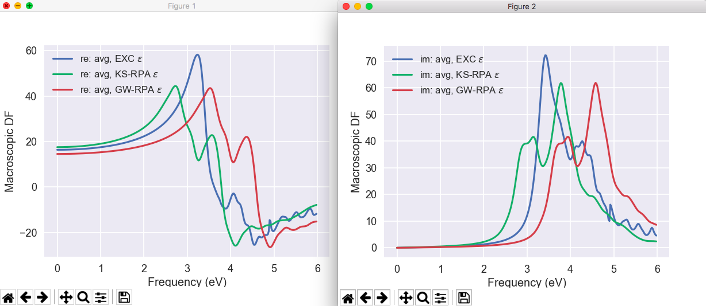
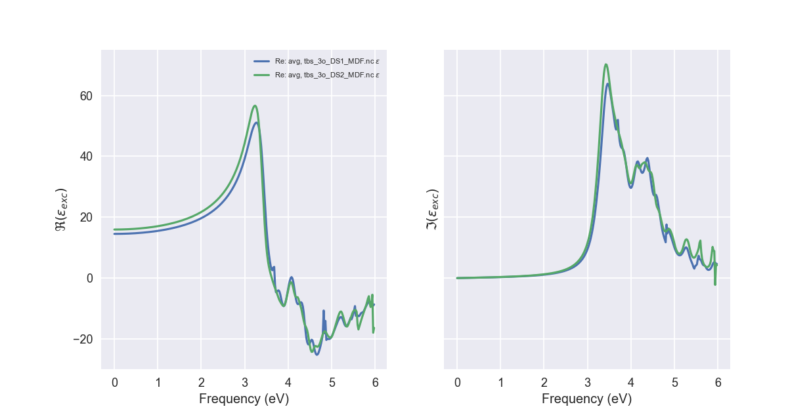
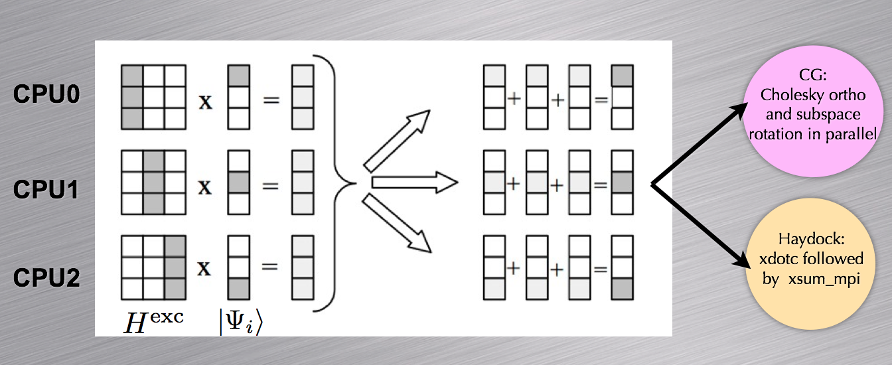

# Tutorial on Bethe-Salpeter calculations  

## Absorption spectra including excitonic effects.  

This tutorial discusses how to calculate the macroscopic dielectric function
including excitonic effects within the Bethe-Salpeter (BS) approach.
Crystalline silicon is used as test case. A brief description of the formalism
can be found in the [[theory:bse|Bether-Salpeter notes]].

The user should be familiarized with the four basic tutorials of ABINIT and the [first GW tutorial](gw1).

Visualisation tools are NOT covered in this tutorial.
Powerful visualisation procedures have been developed in the Abipy context,
relying on matplotlib. See the README of [Abipy](https://github.com/abinit/abipy)
and the [Abipy tutorials](https://github.com/abinit/abitutorials).

This tutorial should take about one hour to be completed.

[TUTORIAL_README]

## Preparatory steps (WFK and the SCR file)
  
*Before starting, you might consider to work in a different subdirectory as
for the other tutorials. Why not Work_bs?*

Copy the files file *\$ABI_TESTS/tutorial/Input/tbs_1.files* 
in the working directory *Work_bs*.
Now run immediately the calculation with the command:
    
    abinit < tbs_1.files > tbs_1.log 2> err &

so that we can analyze the input file while the code is running.

The input file is located in *\$ABI_TESTS/tutorial/Input/tbs_1.in*. 
The header reports a brief description of the calculation so read it carefully. 
Don't worry if some parts are not clear to you as we are going to discuss the
calculation in step by step fashion.



This input file generates the two WFK files and the SCR file needed for
the subsequent Bethe-Salpeter computations. The first dataset performs a
rather standard ground-state calculation on an $\Gamma$-centered 4x4x4 grid (64 k
points in the full Brillouin Zone, folding to 8 k points in the irreducible wedge). 
Then the ground-state density is used in dataset 2 and 3 to generate
two WFK files with a standard NSCF run and the conjugate-gradient method.

Note that the WFK file computed in dataset 2 contains **100 bands** on the 4x4x4
**gamma-centered** k-mesh whereas the WFK file produced in dataset 3 has only 
**10 bands** on a 4x4x4 k-mesh **shifted** along the direction
    
    shiftk3    0.11 0.21 0.31  # This shift breaks the symmetry of the k-mesh.

The $\Gamma$-centered k-mesh contains 8 points in the IBZ while the
shifted k-mesh breaks the symmetry of the crystal leading to 64 points in the
IBZ (actually the IBZ now coincides with the full Brillouin zone). The second
mesh is clearly inefficient, so you might wonder why we are using such a
bizarre sampling and, besides, why we need to generate two different WFK files!

Indeed this approach strongly differs from the one we followed in the GW
tutorials, but there is a good reason for doing so. 
It is anticipated that optical spectra **converge slowly** with the BZ sampling, and that
**symmetry-breaking k-meshes** lead to faster convergence in [[nkpt]] than the
standard symmetric k-meshes commonly used for ground-state or GW calculations.

This explains the bizarre shift but still why two WFK files? Why don't we
simply use the WFK file on the shifted k-mesh to compute the screening?

The reason is that a screening calculation done with many empty bands on the
shifted k-mesh would be very memory demanding as the code should allocate a
huge portion of memory whose size scales with ([[nband]] * [[nkpt]]), and no
symmetry can be used to reduce the number of k-points.

To summarize: the WFK with the symmetric k-point sampling and 100 bands will
be used to compute the screening, while the WFK file with the shifted k-mesh
and 10 bands will be used to construct the transition space employed for
solving the Bethe-Salpeter equation. The two k-meshes differ just for the
shift thus they produce the same set of q-points (the list of q-points in the
screening is defined as all the possible differences between the k-points of
the WFK file). This means that, in the Bethe-Salpeter run, we can use the SCR file
generated with the symmetric mesh even though the transition space is
constructed with the shifted k-mesh.

After this lengthy discussion needed to clarify this rather technical point,
we can finally proceed to analyze the screening computation performed in the
last dataset of *tbs_1.in*.

The SCR file is calculated in dataset 4 using [[nband]] = 100 and [[ecuteps]] = 6.0 Ha. 
In the [first GW tutorial](gw1), these
values were found to give QP energies converged within 0.01 eV, so we are
confident that our SCR file is well converged and it can be safely used for
performing convergence tests in the Bethe-Salpeter part.

Note that, for efficiency reasons, only the static limit of W is computed:
    
    nfreqre4  1   # Only the static limit of W is needed for standard BSE calculations.
    nfreqim4  0

Indeed, in the standard formulation of the Bethe-Salpeter equation, only the
static limit of the screened interaction is needed to construct the Coulomb
term of the BS Hamiltonian. Using a single frequency allows us to save some
CPU time in the screening part, but keep in mind that this SCR file can only
be used either for Bethe-Salpeter computations or for GW calculations
employing the plasmon-pole models corresponding to [[ppmodel]] = 3, 4.

At this point the calculation should have completed, but there's still one
thing that we have to do before moving to the next paragraph.

As we said, we will need the WFK file on the shifted k-mesh and the SCR file
for our BS calculations so do not delete them! It is also a good idea to
rename these precious files using more meaningful names *e.g.*:
    
    mv tbs_1o_DS2_WFK 444_gamma_WFK
    mv tbs_1o_DS3_WFK 444_shifted_WFK
    mv tbs_1o_DS4_SCR 444_SCR

!!! important
    
    The list of k-points specified in the BS input files **must equal** the one used
    to generate the WFK file. Two new WFK files and a new SCR file must be
    generated from scratch if we want to change the k-point sampling used to
    construct the transition space.

## Computing the absorption spectrum within the Tamm-Dancoff approximation
  
This section is intended to show how to perform a standard excitonic
calculation within the Tamm-Dancoff approximation (TDA) using the Haydock iterative technique. 
The input file is *\$ABI_TESTS/tutorial/tutorial/Input/tbs_2.in*.

Before running the job, we have to connect this calculation with the output
results produced in *tbs_1.in*.

Use the Unix commands:
    
    ln -s 444_shifted_WFK tbs_2i_WFK
    ln -s 444_SCR tbs_2i_SCR

to create two symbolic links for the shifted WFK and the SCR file. The reason
for doing so will be clear afterwards once we discuss the input file.

This job lasts 1-2 minutes on a modern machine so it is worth running it
before inspecting the input file.

Copy the files file *\$ABI_TESTS/tutorial/Input/tbs_2.files* in the working
directory and issue:
    
    abinit < tbs_2.files > tbs_2.log 2> err &

to put the job in background so that we can examine *tbs_2.in*.

Now open *\$ABI_TESTS/tutorial/Input/tbs_2.in* in your preferred editor and go
to the next section where we discuss the most important variables governing a
typical BS computation.



### The structure of the input file

First we need to set [[optdriver]] = 99 to call the BSE routines
    
    optdriver  99   # BS calculation
    
The variables [[irdwfk]] and [[irdscr]] are similar to other "ird" variables
of ABINIT and are used to read the files produced in the previous paragraph
    
    irdwfk  1  # Read the WFK file produced in tbs_1 
    irdscr  1  # Read the SCR file produced in tbs_1 

The code expects to find an input WFK file and an input SCR file whose name is
constructed according to prefix specified in the files file *tbs_2.files* 
(see [[help:abinit#files-file|this section]] of the abinit_help file). 
This is the reason why we had to create the two symbolic links before running the code.

Then we have a list of five variables specifying how to construct the excitonic Hamiltonian.
    
    bs_calctype       1    # L0 constructed with KS orbitals and energies.
    mbpt_sciss   0.8 eV    # Scissors operator used to correct the KS band structure.
    bs_exchange_term  1    # Exchange term included.
    bs_coulomb_term  11    # Coulomb term included using the full matrix W_GG'
    bs_coupling       0    # Tamm-Dancoff approximation.

The value [[bs_calctype]] = 1 specifies that the independent-particle
polarizability should be constructed with the Kohn-Sham orbitals and energies
read from the WFK file. To simulate the self-energy correction, the KS
energies are corrected with a scissors operator of energy [[mbpt_sciss]] = 0.8 eV. 
This permits us to avoid a cumbersome GW calculation for each state
included in our transition space. The use of the scissors operator is a
reasonable approximation for silicon but it might fail in more complicated
systems in which the GW corrections cannot be simulated in terms of a simple
rigid shift of the initial KS bands structure.

The remaining three variables specify how to construct the excitonic Hamiltonian. 
[[bs_exchange_term]] = 1 tells the code to calculate the exchange
part of the kernel, hence this calculation includes local-field effects. 
The variable [[bs_coulomb_term]] is used to select among different options that
are available for the Coulomb term (please take some time to read the
description of the variable and the relevant equations in the [[theory:bse|Bethe-Salpeter notes]]. 
Finally [[bs_coupling]] = 0 specifies that the off-diagonal coupling blocks 
should be neglected (Tamm-Dancoff approximation).
This particular combination of parameters thus corresponds to a Bethe-Salpeter
calculation within the Tamm-Dancoff approximation with local field effects included.

Then we have the specification of the bands used to construct the transition space:
    
    bs_loband   2 
    nband       8

In this case all the bands around the gap whose index is between 2 and 8 are
included in the basis set.

The frequency mesh for the macroscopic dielectric function is specified by [[bs_freq_mesh]]
    
    bs_freq_mesh 0 6 0.02 eV  # Frequency mesh.

This triplet of real values defines a linear mesh that covers the range [0, 6] eV with a step of 0.02 eV. 
The number of frequency points in the mesh does not
have any significant effect on the CPU time, but it is important to stress
that the number of bands included in the transition space defines, in
conjunction with the number of k-points, the frequency range that can be
described. As a consequence [[bs_loband]] and [[nband]] should be subject to
an accurate converge study.

Then we have the parameters that define and control the algorithm employed to
calculate the macroscopic dielectric function
    
    bs_algorithm        2      # Haydock method (this is the default value).
    bs_haydock_niter   100     # Max number of iterations for the Haydock method.
    bs_haydock_tol     0.05    # Tolerance for the iterative method.
    zcut               0.15 eV # Complex shift to avoid divergences in the continued fraction.

[[bs_algorithm]] specifies the algorithm used to calculate the macroscopic dielectric function. 
In this case we use the iterative Haydock technique whose
maximum number of iterations is given by [[bs_haydock_niter]]. 
The iterative algorithm stops when the difference between two consecutive evaluations of the
optical spectra is less than [[bs_haydock_tol]]. 
The input variable [[zcut]] gives the complex shift to avoid divergences in the continued fraction. 
From a physical point of view, this parameters mimics the experimental broadening of
the absorption peaks. In this test, due to the coarseness of the k-mesh, we
have to use a value slightly larger than the default one (0.1 eV) in order to
facilitate the convergence of the Haydock algorithm. 
Ideally, one should perform a convergence study by decreasing the value of [[zcut]] for increasing number of k-points.

The k-point sampling is specified by the set of variables.
    
    kptopt 1                # Option for the automatic generation of k points,
    ngkpt  4 4 4            # This mesh is too coarse for optical properties.
    nshiftk 1
    shiftk  0.11 0.21 0.31  # This shift breaks the symmetry of the k-mesh.
    chksymbreak 0           # Mandatory for using symmetry-breaking k-meshes in the BS code.


!!! important
    
    The values of [[kptopt]], [[ngkpt]], [[nshiftk]], and [[shiftk]] **must equal**
    the ones used to specify the grid for the WFK file. 
    [[chksymbreak]] = 0 is used to bypass the check on symmetry breaking that, otherwise, would make the code stop.


The last section of the input file
    
    ecutwfn 8.0   # Cutoff for the wavefunction.
    ecuteps 2.0   # Cutoff for W and /bare v used to calculate the BS matrix elements.
    inclvkb 2     # The Commutator for the optical limit is correctly evaluated.

specifies the parameters used to calculate the kernel matrix elements and the
matrix elements of the dipole operator. 
We have already encountered these variables in the [first GW tutorial](gw1) of the GW tutorial 
so their meaning is (hopefully) familiar to you. 
A more detailed discussion of the role played by these variables in the BS code 
can be found in the [[theory:bse|Bether-Salpeter notes]].

### Output files

The output file, *tbs_2.out*, reports the basic parameters of the calculation
and eventual WARNINGs that are issued if the iterative method does not converge. 
Please take some time to understand its structure.

Could you answer the following questions?

  1. How many transitions are included in the basis set? 
  2. How many directions are used to evaluate the optical limit? 
  3. What is the value of the Lorentzian broadening used in the continued fraction? 

After this digression on the main output file, we can finally proceed to
analyse the output data of the computation.

The most important results are stored in five different files:

  * *tbs_2o_BSR*
  * *tbs_2o_HAYDR_SAVE*
  * *tbs_2o_RPA_NLF_MDF* 
  * *tbs_2o_GW_NLF_MDF*
  * *tbs_2o_EXC_MDF*

In what follows, we provide a brief description of the format and of the
content of each output file.

tbs_2o_BSR: 

:   This binary file stores the upper triangle of the resonant block (the matrix
    is Hermitian hence only the non-redundant part is computed and saved on file).
    The BSR file can be used to restart the run from a previous computation using
    the variables [[getbsreso]] or [[irdbsreso]]. This restart capability is
    useful for restarting the Haydock method if convergence was not achieved or to
    execute Haydock computations with different values of [[zcut]]. [[getbsreso]]
    and [[irdbsreso]] are also handy if one wants to include the coupling on top
    of a pre-existing TDA calculation since the code uses two different files to
    store the resonant and the coupling block (BSC is the prefix used for the
    files storing the coupling term).

tbs_2o_HAYDR_SAVE: 

:   It is a binary file containing the results of the Haydock method: the
    coefficient of the tridiagonal matrix and the three vectors employed in the
    iterative algorithm. It is usually used to restart the algorithm if
    convergence has not been achieved (see the related input variables [[gethaydock]] and [[irdhaydock]]).

tbs_2o_RPA_NLF_MDF and tbs_2o_GW_NLF_MDF 

:   The RPA spectrum without local field effects obtained with KS energies and the
    GW energies, respectively (mnemonics: NLF stands for No Local Field, while MDF
    stands for Macroscopic Dielectric Function).

tbs_2o_EXC_MDF

:   Formatted file reporting the macroscopic dielectric function with excitonic effects. 
    
The *EXC_MDF* file contains the most important results of our
calculation so it is worth spending some time to discuss its format.

First we have a header reporting the basic parameters of the calculation:
    
```sh
# Macroscopic dielectric function obtained with the BS equation.
#  RPA L0 with KS energies and KS wavefunctions     LOCAL FIELD EFFECTS INCLUDED
# RESONANT-ONLY calculation
# Coulomb term constructed with full W(G1,G2)
# Scissor operator energy =  0.8000 [eV]
# Tolerance =  0.0500
# npweps  = 27
# npwwfn  = 283
# nbands  = 8
# loband  = 2
# nkibz   = 64
# nkbz    = 64
# Lorentzian broadening =  0.1500 [eV]
```
    
then the list of q-points giving the direction of the incident photon:
    
```sh
#  List of q-points for the optical limit:
# q =  0.938821, 0.000000, 0.000000, [Reduced coords] 
# q =  0.000000, 0.938821, 0.000000, [Reduced coords] 
# q =  0.000000, 0.000000, 0.938821, [Reduced coords] 
# q =  0.000000, 0.813043, 0.813043, [Reduced coords] 
# q =  0.813043, 0.000000, 0.813043, [Reduced coords] 
# q =  0.813043, 0.813043, 0.000000, [Reduced coords] 
```

By default the code calculates the macroscopic dielectric function considering
six different directions in q-space (the three basis vectors of the reciprocal
lattice and the three Cartesian axis). It is possible to specify custom
directions using the input variables [[gw_nqlwl]] and [[gw_qlwl]].

Then comes the section with the real and the imaginary part of the macroscopic
dielectric as a function of frequency for the different directions:

```sh
# omega [eV]    RE(eps(q=1)) IM(eps(q=1) RE(eps(q=2) ) ... 
0.000  1.8026E+01  0.0000E+00  1.7992E+01  0.0000E+00  1.4292E+01  0.0000E+00  1.3993E+01 0.0000E+00  1.7117E+01  0.0000E+00  1.7080E+01  0.0000E+00
.... .... ...
```

You can visualize the data using your preferred software. For instance, with |gnuplot|
    
```gnuplot
p "tbs_2o_EXC_MDF" u 1:3 w l
```

will plot the imaginary part of the macroscopic dielectric function (the
absorption spectrum) for the first q-point. You should obtain a graphic
similar to the one reported below


!!! note

    These results are not converged, we postpone the discussion
    about convergence tests to the next paragraphs of this tutorial.

The most important feature of the spectrum is the presence of two peaks
located at around 3.4 and 4.3 eV. To understand the nature of these peaks and
the role played by the BS kernel, it is useful to compare the excitonic
spectra with the RPA results obtained without local field effects.

Use the sequence of gnuplot command

```gnuplot
p   "tbs_2o_EXC_MDF"     u 1:3 w l
rep "tbs_2o_RPA_NLF_MDF" u 1:3 w l
rep "tbs_2o_GW_NLF_MDF"  u 1:3 w l
```
    
to plot the absorption spectrum obtained with the three different approaches.
The final result is reported in the figure below.


The RPA-KS spectrum underestimates the experimental optical threshold due to
the well know band gap problem of DFT. Most importantly, the amplitude of the
first peak is underestimated, a problem than is not solved when local-field
effects are correctly included in the calculation.

The RPA-GW results with QP corrections simulated with [[mbpt_sciss]] does not
show any significant improvement over RPA-KS: the RPA-GW spectrum is just
shifted towards higher frequencies due to opening of the gap, but the shape of
the two spectra is very similar, in particular the amplitude of the first peak
is still underestimated.

On the contrary, the inclusion of the BS kernel leads to important changes
both in the optical threshold as well as in the amplitude of the first peak.
This simple analysis tells us that the first peak in the absorption spectrum
of silicon has a strong excitonic character that is not correctly described
within the RPA. Our first BS spectrum is not converged at all and it barely
resembles the experimental result, nevertheless this unconverged calculation
is already able to capture the most important physics.

!!! tip

    If |AbiPy| is installed on your machine, you can use the |abiopen| script
    with the `--expose` option to visualize the dielectric functions stored in the MDF.nc file:

        abiopen.py tbs_2o_MDF.nc --expose --seaborn

    

    For further information about the MDF file and the post-processing tools provided by AbiPy,
    please consult the |MdfFileNb|.


### Optional Exercises

* Change the value of the Lorentzian broadening [[zcut]] used to avoid divergences in the continued fraction. 
  Then restart the Haydock algorithm from the *_BSR* and *_HAYDR_SAVE* files using the appropriate variables. 
  What is the main effect of the broadening on the final spectrum. 
  Does the number of iterations needed to converge depend on the broadening? 

* Use the appropriate values for [[bs_exchange_term]] and [[bs_coulomb_term]] to calculate the BS spectrum 
  without local field effects. Compare the results obtained with and without local field effects. 

* Modify the input file tbs_2.in so that the code reads in the resonant block produced in the previous run 
  and calculates the spectrum employing the method based on the direct diagonalization (use [[irdbsreso]] 
  to restart the run but remember to rename the file with the resonant block). 
  Compare the CPU time needed by the two algorithms as a function of the number of transitions in the transition space. 
  Which one has the best scaling? 

### Preliminary discussion about convergence studies

Converging the excitonic spectrum requires a careful analysis of many different parameters:

  * [[bs_loband]] 
  * [[nband]] 
  * [[ecutwfn]] 
  * [[ecuteps]] 
  * [[ngkpt]] 
  * [[nshiftk]] 
  * [[shiftk]] 

Since the memory requirements scale quadratically with the number of k-points
in the **full** Brillouin zone **times** the number of valence bands
**times** the number of conduction bands included in the transition space,
it is very important to find a good compromise between accuracy and computational efficiency.

First of all one should select the frequency range of interest since this
choice has an important effect on the number of valence and conduction states
that have to be included in the transition space. The optical spectrum is
expected to converge faster in the number of bands than the GW corrections
since only those transitions whose energy is "close" to the frequency range
under investigation are expected to contribute.

[[ecutwfn]] usually plays a secondary role since it only affects the accuracy
of the oscillator matrix elements. We suggest avoiding any truncation of the
initial basis set by setting [[ecutwfn]] to a value slightly larger than the
value of [[ecut]] used to generate the WFK file. One should truncate the
initial planewave basis set only when experiencing memory problems although
this kind of problems can be usually solved by just increasing the number of
processors or, alternatively, with an appropriate choice of [[gwmem]].

The value of [[ecuteps]] affects the accuracy of the matrix elements of the
Coulomb term, the fundamental term that drives the creation of the excitons.
As a consequence [[ecuteps]] should be subject to an accurate convergence
test. As a rule of thumb, [[ecuteps]] can be chosen equal or, sometimes, even
smaller than the value needed to converge the GW corrections.

As already stated: optical spectra converge slowly with the Brillouin zone
sampling. The convergence in the number of k-points thus represents the most
important and tedious part of our convergence study. For this reason, this
study should be done once converged values for the other parameters have been already found.

## Convergence with respect to the number of bands in the transition space
  
In this section we take advantage of the multi-dataset capabilities of ABINIT
to perform calculations with different values for [[bs_loband]] and [[nband]]

Before running the test take some time to read the input file *\$ABI_TESTS/tutorial/Input/tbs_3.in*.



The convergence in the number of transitions is performed by defining two
datasets with different values for [[nband]] and [[bs_loband]]
    
    ndtset     2
    bs_loband1  3 nband1  6
    bs_loband2  2 nband2  7

    
The parameters defining how to build the excitonic Hamiltonian are similar to
the ones used in *tbs_2.in*. The only difference is in the value used for [[bs_coulomb_term]], *i.e.*
    
    bs_coulomb_term  10  # Coulomb term evaluated within the diagonal approximation.

that allows us to save some CPU time during the computation of the Coulomb term.

Also in this case, before running the test, we have to connect *tbs_3.in* to the
WFK and the SCR file produced in the first step. Note that *tbs_3.in* uses
[[irdwfk]] and [[irdscr]] to read the external files, hence we have to create
symbolic links for each dataset:
    
```sh
ln -s 444_SCR tbs_3i_DS1_SCR
ln -s 444_SCR tbs_3i_DS2_SCR
ln -s 444_shifted_WFK tbs_3i_DS1_WFK
ln -s 444_shifted_WFK tbs_3i_DS2_WFK
```
    
Now we can finally run the test with
    
    abinit < tbs_3.files > tbs3.log 2> err &

This job should last 3-4 minutes so be patient!

Let us hope that your calculation has been completed, and that we can examine
the output results.

Use the following sequence of |gnuplot| commands:
    
```gnuplot
p   "tbs_3o_DS1_EXC_MDF" u 1:3 w l
rep "tbs_3o_DS2_EXC_MDF" u 1:3 w l
```

to plot on the same graphic the absorption spectrum obtained with different
transition spaces. You should obtain a graphic similar (but not equal) to this one 


Note indeed that the above figure has been produced with more datasets in order 
to highlight the convergence behaviour.

The results obtained with ([[bs_loband]] = 4, [[nband]] = 5) are clearly
unconverged as the basis set contains too few transitions that are not able to
describe the frequency-dependence of the polarizability in the energy range
under investigation. For a converged spectrum, we have to include the
three higher occupied states and the first four conduction bands (the blue
curve corresponding to [[bs_loband]] = 2, and [[nband]] = 7).

Note that adding the first occupied band, curve (1-8), gives results that are
almost on top of (2,8). This is due to the fact that, in silicon, the bottom
of the first band is located at around 12 eV from the top of the conduction
band therefore its inclusion does not lead to any significant improvement of
the transition space in the frequency range [0, 8] eV. For completeness, we
also report the results obtained in a separate calculation done with
[[bs_loband]] = 2 [[nband]] = 9 to show that four empty states are enough to converge the spectrum.

We therefore fix the number of bands for the transition space using 
[[bs_loband]] = 2, [[nband]] = 7 and we proceed to analyse the
convergence of the spectrum with respect to the number of planewaves in the screening.

!!! tip

    If |AbiPy| is installed on your machine, you can use the |abicomp| script
    with the `mdf` command and the `--expose` option to compare 
    multiple dielectric functions:

        abicomp.py mdf tbs_3o_DS*_MDF.nc --expose --seaborn

    


### Tips for expert users

The use of [[irdwfk]] and [[irdscr]] is not handy when we have several
datasets that are reading the **same** external file as we are forced to use
different names for the input of each dataset. To work around this annoyance,
one can introduce a fictitious dataset (say dataset 99), and let the code use
the output of this nonexistent dataset as the input of the real datasets. An
example will help clarify: Instead of using the lengthy list of links as done
before, we might use the much simpler sequence of commands
    
    ln -s 444_shifted_WFK tbs_3o_DS99_WFK
    ln -s 444_SCR         tbs_3o_DS99_SCR

provided that, in the input file, we replace [[irdwfk]] and [[irdscr]] with
    
    getwfk  99   # Trick to read the same file tbs_o3_DS99_WFK in each dataset
    getscr  99   # Same trick for the SCR file

## Convergence with respect to the number of planewaves in the screening
  
First of all, before running the calculation, take some time to understand
what is done in *\$ABI_TESTS/tutorial/Input/tbs_4.in*.

The structure of the input file is very similar to the one of *tbs_3.in*, the
main difference is in the first section:
    
    ndtset    2
    ecuteps: 2 ecuteps+ 1
    bs_coulomb_term 11
    
that instructs the code to execute two calculations where the direct term is
constructed using different value of [[ecuteps]]. We also relax the diagonal-only 
approximation for the screening by setting [[bs_coulomb_term]] = 11 so that
the non-locality of $W(\rr, \rr')$ is correctly taken into account.

It is important to stress that it is not necessary to recalculate the SCR file
from scratch just to modify the value of [[ecuteps]] used in the BS run. The
SCR file calculated in the preparatory step contains G-vectors whose energy
extends up to ecuteps = 6.0 Ha. This is the **maximum** cutoff energy that can be
used in our convergence tests. If the value of [[ecuteps]] specified in the
input file is smaller than the one stored on disk, the code will read a sub-
block of the initial matrix. A WARNING message is issued if the value
specified in the input file is larger than the one available in the SCR file.

Now we can finally run the calculation. As usual, we have to copy
*\$ABI_TESTS/tutorial/Input/tbs_4.files* in the working directory *Work_bs*,
then we have to create a bunch of symbolic links for the input WFK and SCR files:
    
    ln -s 444_SCR tbs_4i_DS1_SCR
    ln -s 444_SCR tbs_4i_DS2_SCR
    ln -s 444_shifted_WFK tbs_4i_DS1_WFK
    ln -s 444_shifted_WFK tbs_4i_DS2_WFK
    
Now issue
    
    abinit < tbs_4.files > tbs4.log 2> err &

to execute the test (it should take around 2 minutes).



Once the calculation is completed, plot the spectra obtained with different [[ecuteps]] using |gnuplot|:
    
```gnuplot
p "tbs_4o_DS1_EXC_MDF" u 1:3 w l
rep "tbs_4o_DS2_EXC_MDF" u 1:3 w l
```

Here we show the results of a convergence study done with *four* different values or `ecuteps`
to highlight the convergence behavior:


The spectrum is found to converge quickly in [[ecuteps]]. The curves obtained
with [[ecuteps]] = 3 and 4 Ha are almost indistinguishable from each other. Our
final estimate for [[ecuteps]] is therefore 3 Ha.

Note that this value is smaller than the one required to converge the QP
corrections within 0.01 eV (in the [first GW tutorial](gw1) of the GW
tutorial we obtained 6.0 Ha). This is a general behavior, in the sense that
Bethe-Salpeter spectra, unlike GW corrections, are not very sensitive
to truncations in the planewave expansion of W. Reasonable BS spectra are
obtained even when W is treated within the diagonal approximation or,
alternatively, with model dielectric functions.

Note also how the two peaks are affected in a different way by the change of
[[ecuteps]], with the first peak affected the most. This behavior is
consistent with our affirmation that the first peak of silicon has a strong excitonic character.

## Convergence with respect to the number of k-points
  
The last parameter that should be checked for convergence is the number of
k-points. This convergence study represents the most tedious and difficult
part since it requires the generation of new WFK files and of the new SCR file
for each k-mesh (the list of k-points for the wavefunctions and the set of
q-points in the screening must be consistent with each other).

The file *\$ABI_TESTS/tutorial/Input/tbs_5.in* gathers the different steps of
a standard BS calculation (generation of two WFK file, screening calculation,
BS run) into a single input. The calculation is done with the converged
parameters found in the previous studies, only [[ngkpt]] has been intentionally left undefined.



Use *tbs_5.in* as a template for performing BS calculations with different
k-meshes. For example, you might try to compare the three meshes 4x4x4, 5x5x5,
and 6x6x6. To facilitate the analysis of the results, we suggest to run the
calculations in different directories so that we can keep the output results separated.

Be aware that both the CPU time as well as the memory requirements increase
quickly with the number of divisions in the mesh. These are, for example, the
CPU times required by different k-meshes on Intel Xeon X5570:
    
    4x4x4:    +Overall time at end (sec) : cpu=        112.4  wall=        112.4
    5x5x5:    +Overall time at end (sec) : cpu=        362.8  wall=        362.8
    6x6x6:    +Overall time at end (sec) : cpu=        914.8  wall=        914.8
    8x8x8:    +Overall time at end (sec) : cpu=       5813.3  wall=       5813.3
    10x10x10: +Overall time at end (sec) : cpu=      20907.1  wall=      20907.1
    12x12x12: +Overall time at end (sec) : cpu=      62738.2  wall=      62738.2

6x6x6 is likely the most dense sampling you can afford on a single-CPU
machine. For you convenience, we have collected the results of the convergence
test in the figure below.


As anticipated, the spectrum converges slowly with the number of k-points and
our first calculation done with the 4x4x4 grid is severely unconverged. The
most accurate results are obtained with the 12x12x12 k-mesh, but even this
sampling leads to converged results only for frequencies below 4.5 eV. This is
a problem common to all BS computations, in the sense that it is extremely
difficult to achieve global converge in the spectra. This analysis shows that
we can trust the 12x12x12 results in the [0:4,5] eV range while the correct
description of the spectrum at higher energies would require the inclusion of
more k-point and, possibly, more bands so that the band dispersion is
correctly taken into account (even the RPA spectrum does not converge at high
frequencies when 12x12x12 is used).

It should be stressed that [[zcut]] plays a very important role in these
converge tests. For example, the results obtained with the 8x8x8 or the
10x10x10 k-mesh can be brought closer to the 12x12x12 by just increasing the
Lorentzian broadening. When comparing theory with experiments, it is common to
treat [[zcut]] as an _a posteriori_ parameter chosen to produce the best
agreement with the experiment.

## Additional exercises
  
* Use [[bs_coupling]] = 1 to perform an excitonic calculation for silicon including the coupling term. 
  Compare the imaginary part of the macroscopic dielectric function obtained with and without coupling. 
  Do you find significant differences? (Caveat: calculations with coupling cannot use the Haydock method 
  and are much more CPU demanding. You might have to decrease some input parameters to have results in reasonable time.) 

* Calculate the one-shot GW corrections for silicon following the [first GW tutorial](gw1).
  Then use the `_GW` file produced by the code to calculate the absorption spectrum. 

* Learn how to use AbiPy to automate BS calculations as described in this
  [jupyter notebook](https://nbviewer.jupyter.org/github/abinit/abitutorials/blob/master/abitutorials/bse/lesson_bse.ipynb).

## Notes on the MPI implementation
  
In this section, we discuss the approach used to parallelize the two steps of
the BS run, *i.e.* the construction of the H matrix and the evaluation of the
macroscopic dielectric function.

First of all, it is important to stress that, unlike the GW code, the BS
routines do not employ any kind of memory distribution for the wavefunctions.
The entire set of orbitals used to construct the transition space is stored on
each node This choice has been dictated by the fact that the size of H is
usually much larger than the array used to store the wavefunction, hence it is
much more important to distribute the matrix than the wavefunctions. Besides,
having all the states on each node simplifies the calculation of several
intermediate quantities needed at run-time.

The memory allocated for the wavefunctions and the screening thus will not
scale with the number of processors. However, for very memory demanding
calculations, the real space orbitals can be calculated on the fly with an
increase in computational time instead. This option is controlled by the
second digit of the input variable [[gwmem]].

When discussing the MPI parallelization of the Bethe-Salpeter routines, we
have to consider the two steps separately.

In the first step, the upper triangle of the resonant (coupling) block is
distributed among the nodes. Each CPU computes its own portion and stores the
results in a temporary array. At the end of the computation, the portions of
the upper triangle are communicated to the master node which writes the binary file BSR (BSC).

In the second step, each node reads the data stored in the external files in
order to build the excitonic Hamiltonian. The matrix is distributed using a
column-block partitioning, so that the matrix-vector multiplications required
in the Haydock iterative scheme can be easily performed in parallel (see the
schematic representation reported below). A similar distribution scheme is
also employed for the conjugate-gradient minimization. For a balanced
distribution of computational work, the number of processors should divide the
total number of resonant transitions.


