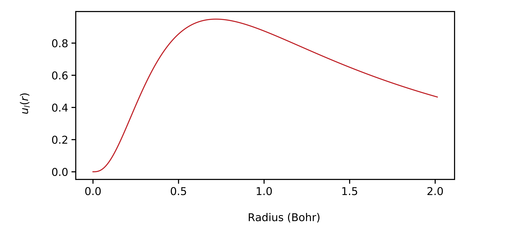
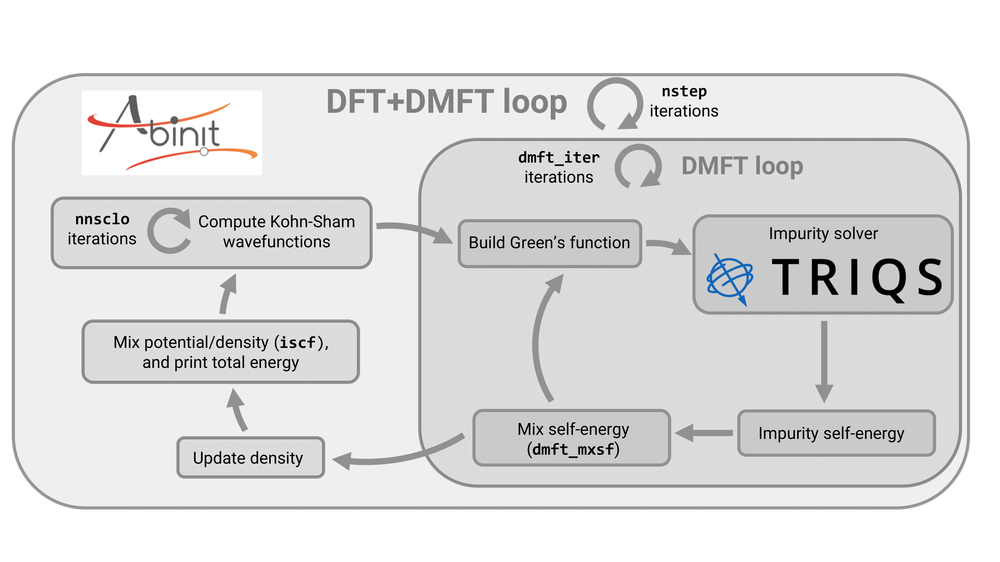

# Tutorial on DFT+DMFT with TRIQS/CT-HYB

## Introduction

In this tutorial, you will learn how to run a DFT+DMFT calculation on iron using the interface
between ABINIT and TRIQS/CT-HYB.
TRIQS/CT-HYB is used as the impurity solver,
while ABINIT drives the calculation and connects to TRIQS/CT-HYB
as an external library.

Before starting, you should already know how to do a basic DFT calculation with ABINIT
(see [basic1](/tutorial/base1), [basic2](/tutorial/base2), [basic3](/tutorial/base3),
and [basic4](/tutorial/base4)). It also helps if you are familiar with PAW
(see [PAW1](/tutorial/paw1) and [PAW2](/tutorial/paw2)) and [DFT+U](/tutorial/dftu).
There is also a tutorial on the ABINIT's internal DMFT solvers (see [DMFT](/tutorial/dmft)), but
it is independent.

We also recommend that you are comfortable with TRIQS/CT-HYB, and we will assume you already
have at least a basic idea of how the DFT+DMFT method works.

The whole tutorial should take a few hours to complete.

[TUTORIAL_README]

## Presentation

ABINIT comes with its own internal DMFT code and solvers, but they are not numerically exact
and rely on the density-density approximation. TRIQS/CT-HYB, on the other hand, can handle the
full interaction Hamiltonian.

Our interface makes it easy to run charge self-consistent DFT+DMFT calculations on real materials
with just a single input file. It is designed to give the accuracy and rigor
needed for computing structural properties, including a stationary DFT+DMFT implementation,
with the computation of the Baym-Kadanoff functional, the use of the exact double counting formula,
and an analytical evaluation of the high-frequency moments of the Green's function in a
self-consistent fashion.
That said, our interface does not handle toy models - TRIQS's Python API and built-in tools
already handle those efficiently.

Even though our interface with TRIQS/CT-HYB roughly follows the internal DMFT implementation
of ABINIT, there are a few important differences in input variables or available features, and
it is more than just swapping out the impurity solver.

You can find all the input variables related to DMFT listed [[varset:dmft|here]].

The input variables that are specific to the TRIQS/CT-HYB solver start with `dmft_triqs_`, and
many of them are direct copies of TRIQS/CT-HYB's own API inputs - so if you have used TRIQS
before, you should not get lost.

On the other hand, variables related to ABINIT's internal segment solver start with
`dmftctqmc_` or `dmftqmc_`. These don't apply here, so you can safely ignore them for this
tutorial.

Finally, variables that control the self-consistent cycle itself start with `dmft_`. Most of
these are shared between the internal DMFT and the TRIQS/CT-HYB interface, but some features
are available only in one or the other. The glossary clearly points out when that is the case.

If you want a good overview of the input variables relevant for the TRIQS/CT-HYB interface, we
recommend checking out the dedicated [[topic:DmftTriqsCthyb|topic]].

## Installation

First, you need to install [[https://triqs.github.io/triqs/latest/|TRIQS]], and then TRIQS/CT-HYB.
Our interface is compatible with the official version of TRIQS/CT-HYB, which you can find
[[https://triqs.github.io/cthyb/latest/|here]]. However, their implementation is not suited for
large systems or calculations that require high accuracy, hence we provide our internal version, found
[[https://github.com/ec147/cthyb/tree/develop/|here]] (download the `develop` branch).

The installation instructions are identical for the two versions, and you can find them on their official
[[https://triqs.github.io/cthyb/latest/install.html|website]].

Our internal version contains additional features which we implemented, meant to reduce the computation time for structural properties
calculations:

  * an improved proposal distribution ([[dmft_triqs_pauli_prob]])
  * an improved estimator for the density matrix ([[dmft_triqs_time_invariance]])
  * the possibility to automatically restart the CT-HYB from the previous configuration, in order to reduce the warmup time ([[dmft_triqs_read_ctqmcdata]])

We highly recommend to use our internal version, as these features are paramount for an accurate calculation of
structural properties.

CT-HYB calculations can be very computationally demanding, so take your time when
compiling and pick an efficient BLAS implementation, as it can make a big difference
in performance.

After that, you need to reconfigure ABINIT to link it with TRIQS. Add the following line to your
configuration file:

    with_triqs="yes"

The library should be found automatically if the paths to the TRIQS and
TRIQS∕CT-HYB libraries are included in your environment variables. If you are using
the complex version of TRIQS/CT-HYB, also add:

    enable_triqs_complex="yes"

Next, make sure your options are recognized correctly and that ABINIT can
successfully link to TRIQS and compile a test code. When configuring, pay attention
to these lines:

    checking whether to enable the complex version of TRIQS... [yes|no]

and:

```sh
 checking whether you are linked against the internal TRIQS library... [yes|no]
 checking whether the TRIQS library works... [yes|no]
```

The first line indicates whether our internal version has been found, and the second line
whether the official version has been found, depending on which you choose to install.
This tutorial has been written with our internal version.

If something goes wrong, carefully check the `config.log` file. Ask yourself: Why did the
test code fail to compile ? Was the library found and linked properly ?

Remember, you can override any automatically added compilation or linker flags using the
configuration files variables: `TRIQS_CPPFLAGS`, `TRIQS_CFLAGS`, `TRIQS_CXXFLAGS`,
`TRIQS_LDFLAGS`, and `TRIQS_LIBS`.

As a last resort, if you still can't solve the issue, post a question on the
[[https://discourse.abinit.org/|ABINIT user forum]].

Once everything is set, simply recompile ABINIT.

## Fatbands of Fe within DFT

Before jumping into the DFT+DMFT calculation for Fe, it is useful to first get some physical insight into
its electronic structure at the DFT level. This will help later when choosing some of the key DMFT
parameters.

We will start by computing the density of states (DOS), the band structure, and the fatbands. A fatband
plot shows how much of a given angular character (like $s$, $p$, or $d$) each Kohn-Sham wavefunction
has for every band and $k$-point - the thicker the line, the stronger that orbital's contribution.

Go to the tutorial input directory, make a new working folder, and copy the first input file:

```sh
cd $ABI_TESTS/tutoparal/Input
mkdir Work_dmft_triqs
cd Work_dmft_triqs
cp ../tdmft_triqs_1.abi .
```



Launch the input file with ABINIT. For the rest of this tutorial, we will run everything on 4 CPUs,
but feel free to use more if you can:

    mpirun -n 4 abinit tdmft_triqs_1.abi > log 2>&1

While it runs, take a look at the input file. It has two datasets:

  1. A DFT dataset to compute the DOS and the density.
  2. A non self-consistent dataset to compute the band structure along a specific $k$-path in the
     Brillouin zone (defined by [[kptbounds]]).

The fatbands are computed using the variable [[pawfatbnd]]. Here, it is set to $1$, meaning fatbands are
computed for each angular momentum $l$. If you want orbitally resolved fatbands, set it to $2$ instead.

Once the calculation finishes, you will find:

  * The DOS in the file: `tdmft_triqs_1o_DS1_DOS_AT0001`
  * The fatbands in files named like: `tdmft_triqs_1o_DS2_FATBANDS_at0001_Fe_is1_l000x` - one for
    each angular momentum.

For Fe, we are mainly interested in the $3d$ electrons, since they are the most strongly correlated.

You can plot the results using any plotting software you like - or simply use the provided Python
scripts:

```sh
python3 ../dmft_triqs_scripts/plot_dos.py
python3 ../dmft_triqs_scripts/plot_fatbands.py
```

You should get something like this for the DOS:


and this for the $d$ fatbands:


From the DOS, you can see that most of the $d$-electron spectral weight lies close to the Fermi level,
within an energy window of about $5$ eV.

From the fatbands, you can tell that while the strongest $d$ character is indeed around the Fermi level,
it is not confined to the $3d$ bands (bands $6-10$). There is significant hybridization with the $4s$
(band $5$) and $4p$ (bands $11-13$) states, and even some weaker but noticeable hybridization with higher
bands.

So when you move to the DMFT calculation, you will need to be careful in selecting which bands to
include, to make sure you capture as much of the $d$ spectral weight as possible.

## Charge self-consistent DFT+DMFT calculation on Fe

We will now walk you through the basics of running a charge self-consistent DFT+DMFT calculation,
using iron as an example. Along the way, we will introduce the main input variables you need to know,
show you how our implementation works, and go over the output files. We will also look at the main
convergence parameters and share some tips on how to choose their values wisely.

Before we start, an important note: do not use the values from our example input file as reference for
your own convergence parameters. We intentionally picked small values here to keep the runtime
reasonable. Our implementation is purposely strict about this - we do not provide default values for
many parameters, because we want users to choose them consciously.

Indeed, we feel that most of the inconsistencies found in DFT+DMFT results across the literature come
from poorly chosen convergence parameters. So, always perform proper convergence tests, and redo them
for each system you study.

Alright, let's dive in. Start by copying the second input file and running it with ABINIT. Feel free
to use more CPUs if you have them available:

```sh
cp ../tdmft_triqs_2.abi .
mpirun -n 4 abinit tdmft_triqs_2.abi > log2 2>&1
```



This calculation might take a few minutes, so while it runs, let's take a look at the input file and
see what's going on.

A charge self-consistent DFT+DMFT calculation usually consists of two datasets:

  1. The first one is a DFT calculation (that should be in principle well converged).
  2. The second one is a DFT+DMFT calculation, which starts from the DFT output density of
     the first dataset.

We won't revisit the DFT parameters or how to converge them here - that is already covered in the
DFT tutorials. However, remember that once you include DMFT, you'll likely need to readjust your
parameters and redo your convergence studies. For instance, you will often need to converge your
Kohn-Sham wavefunctions more tightly by increasing [[nline]] and [[nnsclo]].

Also, the electronic temperature (set via [[tsmear]]$=1/\beta$) becomes much more important when
DMFT is active, since temperature effects are explicitly included in the impurity solver -
unlike in the DFT exchange-correlation functional, where they are usually neglected.

Here, we use a CT-HYB solver, which represents the Green's function $G(\tau)$ on the imaginary
time axis, with $\tau$ ranging from $0$ to $\beta$. Because the impurity problem becomes more
complex as $\beta$ increases, we are choosing a high temperature ([[tsmear]]$=3000 \, \mathrm{K}$) to keep
things simpler and faster for this example.

For the second dataset, we start by activating DMFT, setting [[usedmft]]$=1$.

### Correlated Electrons

Next, we need to choose which angular momentum channel ($s$,$p$,$d$,...) we want to treat as
correlated within DMFT. Each channel corresponds
to a value of $l=0,1,2$..., and we select it using the variable [[lpawu]], just like in
DFT+U.

For each atom type, you specify the value of $l$ you want to apply DMFT to, each value being
separated by a whitespace. If you do not
want to apply DMFT on a given atom type, simply set [[lpawu]]$=-1$ for this type.

Each correlated channel will then correspond to $2 \times (2l+1)$ orbitals per correlated
atom - the factor of $2$ accounts for spin degeneracy, and the $2l+1$ comes from the different
magnetic quantum numbers $m = -l,...l$.
Keep in mind that the complexity of the impurity problem increases exponentially with this
number of orbitals, so choosing your correlated channel wisely is important.

!!! note

    At the moment, only values of [[lpawu]] $\le 3$ are supported - anything higher would be computationally impractical anyway.

In our iron example, the localized orbitals that show strong correlation effects are the $3d$
orbitals. Since there is only one atom type (Fe), we simply set [[lpawu]]$=2$.

!!! note

    In the case [[lpawu]]$=2$, you can select specific values of $m$ with [[dmft_t2g]] ($m=-2,-1,1$) and [[dmft_x2my2d]] ($m=2$), which is useful for cubic symmetry.

### Correlated Orbital

Now that we have defined which angular momentum channel we are treating as correlated, we need
to specify the radial part of the correlated orbital - the reduced radial wavefunction $u_l(r)$.

Our convention for the local orbitals follows ABINIT's internal PAW convention:
$\frac{u_l(r)}{r} Y_{lm}(\hat{r})$ where $Y_{lm}(\hat{r})$ are real spherical harmonics.

The choice of the radial wavefunction is made through the variable [[dmft_orbital]]. For iron, the
$3d$ orbitals remain quite localized and keep their atomic character, so we just take the
lowest-energy atomic orbital from the PAW dataset (truncated at the PAW radius). That is the default
choice, [[dmft_orbital]]$=1$, but you can pick any orbital from your PAW dataset or even provide a
custom one from a file if needed (the latter is explained in the section for the exact double counting formula).

!!! tip

    More generally, you should pick a radial orbital that captures as much spectral weight as possible in DMFT, especially near the Fermi level, since that's where electron correlations have the biggest impact.

When the calculation starts, you can see how the radial orbital is defined in the `log2` file, right
at the beginning of the self-consistent cycle:

```sh
   =====  Build DMFT radial orbital for atom type 1 ========

   Using atomic orbital number 1 from PAW dataset
   Squared norm of the DMFT orbital: 0.8514
```

This lets you check the normalization of the orbital. The radial function $u_l(r)$ is also written
to the file `tdmft_triqs_2o_DS2_DMFTORBITAL_itypat0001.dat`. You can plot it with your favorite tool
 - for instance, all DMFT-related outputs are compatible with `xmgrace`. If you plot this file, you
should clearly see the truncated $3d$ atomic orbital from your PAW dataset:



### Energy window

Unfortunately, we cannot directly compute the lattice Green's function over the full Hilbert space - it
would be far too computationally demanding. Instead, we restrict ourselves to a smaller subspace
$\mathcal{H}$, made up of low-energy basis elements. We then downfold this Green's function, which is
projected onto $\mathcal{H}$, onto the local orbitals defined by [[dmft_orbital]] in order to retrieve
the local Green's function.

But notice: this is actually the same as downfolding the full lattice Green's function onto the
projection of [[dmft_orbital]] onto $\mathcal{H}$.

Therefore, the DMFT local orbitals that are effectively handled in the code are not exactly the ones
defined by [[dmft_orbital]], but rather their projection on $\mathcal{H}$.

In our implementation, the lattice Green's function is represented in the Kohn-Sham basis, and
our low-energy Hilbert space is built from all Kohn-Sham wavefunctions whose band indices fall between
[[dmftbandi]] and [[dmftbandf]] - the range that defines the correlated energy window.

!!! note

    We would like to emphasize, however, that when we compute the trace of the Green's function - for instance, to locate the Fermi level - we include all bands (from $1$ to [[nband]]). This differs from many implementations that limit themselves strictly to the correlated energy window.

Since Kohn-Sham wavefunctions form a complete basis, you could in theory recover the original orbital
defined by [[dmft_orbital]] by setting [[dmftbandi]] to $1$ and converging [[dmftbandf]] to infinity.

The choice of your energy window is therefore critical. It directly governs both the spatial spread of
your orbital and your computation time.

  * A wider energy window yields a more localized orbital, but also increases hybridization with the
    bath. Since we use a hybridization-expansion impurity solver, a larger hybridization significantly
    slows down the solver and the evaluation of the Green's function.
  * A narrower energy window may leave out part of the spectral weight of your target orbital
    [[dmft_orbital]]. In this case, the projected orbital may become too extended, potentially
    overlapping with neighboring atoms. That would violate a key approximation of the method - that
    interatomic elements of the Green's function can be neglected.

This is extremely important since if this approximation breaks, the very important identity
Downfold(Upfold) = Identity might break down, which can lead to inaccuracies and unstability.
You can check the deviation in the `log2` file:

```sh
  == Check downfold(upfold)=identity ==

--- !WARNING
src_file: m_matlu.F90
src_line: 1373
message: |

    Differences between Downfold(Upfold) and
       Identity is too large:
         0.1284E-03 is larger than  0.1000E-03
...
```

As an exercise, you can check that this deviation becomes lower whenever you increase the energy window.

!!! tip

    Because Kohn-Sham wavefunctions vary between systems, the projection of [[dmft_orbital]] onto your subspace $\mathcal{H}$ will also vary, especially if the energy window is too narrow. To reliably compare energies between systems, you have to use the same orbital for all calculations, and converge your results with respect to [[dmftbandi]] and [[dmftbandf]]. See the section on the exact double counting formula for more guidance.

As shown earlier from the fatband analysis, the main spectral weight for the $d$ orbitals lie between
bands $5$ and $13$, so we use this as our energy window, though a larger energy window would be ideal to decrease the deviation of
Downfold(Upfold) from the identity.

Once the orbitals have been projected onto this finite Hilbert space, they might no longer be orthogonal.
You can inspect this in the `log2` file:

```sh
 == The DMFT orbitals are now projected on the correlated bands

 == Check: Downfolded Occupations and Norm of unnormalized projected orbitals

  ------ Symmetrized Occupations

   -------> For Correlated Atom 1

          -- polarization spin component 1
        0.50385   0.00000   0.00000   0.00000  -0.00000
        0.00000   0.50385  -0.00000   0.00000   0.00000
        0.00000   0.00000   0.45679   0.00000   0.00000
        0.00000   0.00000   0.00000   0.50385   0.00000
       -0.00000   0.00000   0.00000   0.00000   0.45679

  ------ Symmetrized Norm

   -------> For Correlated Atom 1

          -- polarization spin component 1
        0.80454   0.00000   0.00000   0.00000   0.00000
        0.00000   0.80454   0.00000   0.00000  -0.00000
        0.00000   0.00000   0.80154   0.00000   0.00000
       -0.00000   0.00000   0.00000   0.80454  -0.00000
        0.00000  -0.00000   0.00000   0.00000   0.80154
```

Here, the occupation and norm matrices are
shown. All local operators are printed in matrix form in the `log` file,
sorted by spin and increasing magnetic quantum number $m$.

By default, all quantities are output in the real spherical harmonics (cubic) basis. The only exception
occurs when data is passed to the CT-HYB solver, which requires a rotation to the CT-QMC basis (see the
corresponding subsection for details). Wherever a basis change occurs, it is clearly indicated in the
`log`.

As shown above, the norms of the projected orbitals are slightly below the original atomic value
(which wasn't normalized to begin with). Try increasing [[dmftbandf]], and you will see the norms
approach the true atomic value of $0.8514$.

Finally, we promote the projected orbitals to proper Wannier functions by orthonormalizing them via the scheme specified by [[dmft_wanorthnorm]].

### Interaction tensor

In a solid, the correlated electrons do not interact via the bare Coulomb potential - their interaction is screened by all the other electrons in the system. Because of this,
you need to provide the screened interaction tensor $U_{ijkl}$, as DFT+DMFT is not a formalism that allows its computation in an ab-initio way.

In our implementation, we use the Slater parametrization, which expresses the full interaction tensor in terms of just a few Slater integrals $F^k$ ($k = 2i$, with $i = 0, l$) by assuming the screened potential to have spherical symmetry.

By default, the ratios $F^k / F^2$ (for $k \ge 4$) are kept at their atomic values, which is usually a good approximation for $3d$ transition metals and rare-earth elements.
If you want to adjust them manually, you can do so via the variables [[f4of2_sla]] and [[f6of2_sla]].

Once these ratios are fixed, the two remaining Slater integrals $F^0$ and $F^2$ can be determined uniquely from the average screened interaction $U$ and the screened Hund’s exchange $J$.
These parameters have clear physical meanings — $U$ sets the overall interaction strength, while $J$ controls the tendency of electrons to align their spins.
You can set them for each atom type using [[upawu]] and [[jpawu]].

There are several ways to compute these parameters directly within ABINIT — for example, using [cRPA](/tutorial/ucalc_crpa) or [linear response](/tutorial/lruj) - but those
are beyond the scope of this tutorial. Here, we will simply treat $U$ and $J$ as input parameters.

Keep in mind that these are matrix elements of the screened potential, meaning their values depend on the shape of the local orbitals.
So, if you change your energy window, you may need to readjust $U$ and $J$.

For this example, we will use the same parameters as in [[cite:Han2018]] —
$U = 5.5$ eV and $J = 0.84$ eV — since their chosen energy window is similar to ours.

### Self-consistent cycle

A charge self-consistent DFT+DMFT calculation involves two nested loops:

  * The outer DFT+DMFT loop, whose number of iterations is controlled by [[nstep]]
  * The inner DMFT loop, whose number of iterations is controlled by [[dmft_iter]]

This means the impurity solver is called a total of [[nstep]] $\times$ [[dmft_iter]] times. Each inner DMFT loop is performed at fixed electronic density, and that density gets updated
[[nstep]] times in total - once every [[dmft_iter]] DMFT iterations.

Here’s a schematic showing how the DFT+DMFT self-consistent cycle works:



When doing a charge self-consistent calculation, it is usually best to set [[dmft_iter]]$=1$ and only adjust [[nstep]] to control convergence speed.
That is because trying to reach self-consistency in the DMFT loop before the charge density converges just wastes time.

### Magnetism

The next step is to decide what type of magnetism you want to include. Here, we choose [[nsppol]]$=$[[nspden]]$=1$, which enforces a collinear paramagnetic solution by
symmetrizing the two spin channels of the Green’s function. Even so, the impurity solver is solved with all spin channels, meaning local magnetic moments can still form.

Collinear magnetism can be enabled with [[nsppol]]$=$[[nspden]]$=2$. In this case, it can sometimes be better to keep the DFT exchange-correlation potential non-magnetic and let magnetism emerge purely from DMFT. You can do that by setting [[usepawu]]$=10$. Otherwise, set [[usepawu]]$=14$ for a magnetic XC potential.

Finally, non-collinear calculations are also supported by our interface ([[nspinor]]$=2$ and [[nspden]]$=4$).

### Double counting

When combining DFT and DMFT, you run into the double counting problem - some of the local interactions are already partly included at the DFT level, so they need to be subtracted and
replaced by their exact DMFT values.

ABINIT provides the exact double counting formula, which removes these contributions exactly. It is a bit more involved to use, so we will cover it later in its own section.

There are also several simpler, commonly used approximate formulas, which you can select using the variable [[dmft_dc]]. Here, we choose [[dmft_dc]]$=6$, corresponding to the AMF correction, better suited for metals.

### Impurity solver

We haven’t yet told ABINIT to use the TRIQS/CT-HYB interface instead of its internal DMFT solvers. This is done with [[dmft_solv]], which sets the impurity solver to be used.

For TRIQS/CT-HYB, there are two relevant options:

  * [[dmft_solv]]$=6$: Uses TRIQS/CT-HYB but keeps only the density-density terms in the interaction tensor. This is much faster, though if that’s what you need, a segment solver would be
      more efficient.
  * [[dmft_solv]]$=7$: Uses the full rotationally invariant Slater Hamiltonian, giving the most accurate treatment of interactions.

If instead you want to use ABINIT’s internal DMFT implementation with its built-in solvers, check out the dedicated [DMFT tutorial](/tutorial/dmft).

### Matsubara Mesh

In our implementation, the Green’s function is represented in imaginary frequencies as $G(i\omega_n)$, and is computed exactly on the first [[dmft_triqs_n_iw]] = $n_{i\omega}$ Matsubara frequencies, defined as
\begin{equation*}
    \omega_n = (2n + 1)\frac{\pi}{\beta}
\end{equation*}

During the calculation, several steps require integrating over all Matsubara frequencies.
However, directly summing:
\begin{equation*}
    \sum_{n=-n_{i \omega}}^{n_{i \omega}-1} G(i\omega_n) e^{i 0^{+}}
\end{equation*}
(with $e^{i0^+}$ a small damping factor) would be impractical — it would take far too long to converge.

To make this efficient, we use a moment expansion of the Green’s function up to fifth order:

\begin{equation*}
    \sum_{n=-\infty}^{\infty} G(i\omega_n) e^{i 0^{+}} \approx \sum_{n=-n_{i\omega}}^{n_{i\omega}-1} \left[ G(i\omega_n) - \sum_{j=1}^{5} \frac{G_j}{(i\omega_n)^j} \right] + \sum_{n=-\infty}^{\infty} \frac{G_j}{(i\omega_n)^j} e^{i 0^{+}}
\end{equation*}
where $G_j$ are the moments of the Green’s function.

The first term is computed numerically, while the second term is handled analytically.
Since the moments $G_j$ are obtained analytically in our implementation,
this approach is both efficient and guaranteed to converge to the exact result.

To ensure consistency, the code automatically compares this summation to the corresponding value for the DFT Green’s function, where the sum reduces to a Fermi–Dirac occupation factor.
If the difference is too large, the code stops and raises an error — this is a helpful way to check whether your [[dmft_triqs_n_iw]] value is properly chosen.

You can find this check in your `log2` file. If everything is working correctly, you’ll see lines similar to:

```sh
** Differences between occupations from DFT Green's function and
   Fermi-Dirac occupations are small enough:
   0.1460E-11 is lower than  0.1000E-03
```

and:

```sh
== Compute DFT Band Energy terms
     Differences between band energy with Fermi-Dirac occupations
     and occupations from DFT Green's function is:   -0.000000
     which is smaller than          0.00001
```

As you can see, this integration method is highly efficient — in this example, only about $500$ frequencies were needed to reach excellent accuracy.

!!! tip

    When you change the temperature, remember to increase the number of Matsubara frequencies linearly with $\beta$ to maintain the same effective energy range.

### CT-QMC basis

In the SCF cycle, we work in the cubic basis.
However, even though [[dmft_solv]]$=7$ is fully rotationally invariant and
basis independent, the choice of solver basis can in practice have a
huge impact on computation time.

Strong off-diagonal components in the hybridization function can make the sign problem worse. On the other hand, TRIQS/CT-HYB relies on conserved quantities (like angular momentum
or spin) to partition the local Hilbert space of size $2^{2 \times (2l+1)}$, which reduces the size of the matrices that need to be handled during the simulation. These conserved
quantities are detected automatically, and their number depends strongly on the choice of basis.

TRIQS/CT-HYB prints the number of subspaces it finds:

```sh
  Using autopartition algorithm to partition the local Hilbert space
  Found 1024 subspaces.
```

A higher number of subspaces (thus with smaller dimensions) means smaller matrices, which reduces computation time. In this example, the local Hilbert space size is $2^{10}=1024$
($l=2$), and we see $1024$ subspaces, each of dimension $1$. Thus, we only handle scalars, and do not even need a matrix solver, as we make the density-density approximation in this
example. You can check as an exercise that the matrix sizes will increase by setting [[dmft_solv]]$=7$, depending again on your basis choice.

So, there is a trade-off: you want to reduce off-diagonal components and maximize the number of subspaces, which isn't always easy. Fortunately, our interface provides many basis
options that can be set via [[dmft_triqs_basis]] - check the glossary for all available choices.

!!! note

    Even though our interface handles the full off-diagonal hybridization and Green's function, some features are not available in this case. For instance, density matrix sampling ([[dmft_triqs_measure_density_matrix]]) cannot be performed, making the sampling of static observables (like energy or electron number) much noisier. We wish to emphasize that this limitation comes from TRIQS/CT-HYB itself, not our interface.

To simplify things, you can set the off-diagonal components to zero in the CT-QMC basis via [[dmft_triqs_off_diag]]$=0$. Be careful, as the calculation is no longer numerically exact in this case.

In this example, we choose to stay in the cubic basis ([[dmft_triqs_basis]]$=0$) and neglect the off-diagonal components, since they vanish by symmetry anyway. The code then
automatically detects and prints the most compact block structure of the hybridization function and electronic levels:

```sh
   == Searching for the most optimal block structure of the electronic levels and the hybridization

   == Solving impurity model for atom 1, where there are 10 blocks

  --> Block 0 contains flavor 0
  --> Block 1 contains flavor 1
  --> Block 2 contains flavor 2
  --> Block 3 contains flavor 3
  --> Block 4 contains flavor 4
  --> Block 5 contains flavor 5
  --> Block 6 contains flavor 6
  --> Block 7 contains flavor 7
  --> Block 8 contains flavor 8
  --> Block 9 contains flavor 9

   == Schematic of the block structure

      0  .  .  .  .  .  .  .  .  .
      .  1  .  .  .  .  .  .  .  .
      .  .  2  .  .  .  .  .  .  .
      .  .  .  3  .  .  .  .  .  .
      .  .  .  .  4  .  .  .  .  .
      .  .  .  .  .  5  .  .  .  .
      .  .  .  .  .  .  6  .  .  .
      .  .  .  .  .  .  .  7  .  .
      .  .  .  .  .  .  .  .  8  .
      .  .  .  .  .  .  .  .  .  9
```

This allows TRIQS/CT-HYB to discard some irrelevant moves, and to optimize the computation of the determinant of the hybridization matrix. In our case, there are
$10$ blocks of size $1$, as there are no off-diagonal components.

### CT-HYB parameters

The key controls for the TRIQS/CT-HYB solver are [[dmft_triqs_n_cycles]], [[dmft_triqs_length_cycle]],
[[dmft_triqs_n_warmup_cycles_init]] and [[dmft_triqs_n_warmup_cycles_restart]]. These parameters are
crucial for both performance and accuracy and should be carefully converged.

Every CT-QMC simulation begins with a warmup phase, where the Markov chain hasn't reached equilibrium
yet, so no measurements are taken. Each warmup phase consists of a number of cycles, and each cycle
contains [[dmft_triqs_length_cycle]] sweeps.

There are two kinds of warmup:

  1. The initial warmup, triggered at the first DMFT iteration, when we start from scratch (i.e. an empty
     configuration) and no initial configuration is provided by the user via [[getctqmcdata]]. It is
     controlled by [[dmft_triqs_n_warmup_cycles_init]], can be quite long, and must be carefully
     converged.
  2. The restart warmup, used from the second DMFT iteration onward, and at the first iteration if
     a configuration file is provided via [[getctqmcdata]]. We automatically restart from the last saved
     CT-QMC configuration (`tdmft_triqs_2o_DS2_CTQMC_DATA_iatom0001.h5`), and thus the warmup can be
     much shorter, driven by [[dmft_triqs_n_warmup_cycles_restart]] - which can often be set to $0$.

The restart behavior can be disabled by [[dmft_triqs_read_ctqmcdata]] as it can cause some issues in
some rare occasions - at very low temperature for instance, when the configuration weights become
extremely low.

After warmup, the solver moves into the measurement phase, which lasts [[dmft_triqs_n_cycles]] cycles.
During this phase, observables are measured at the end of each cycle.

One key aspect to keep in mind is that only decorrelated/independent measurements matter for statistics.
That is why [[dmft_triqs_length_cycle]] should in theory be set to match the autocorrelation time.

If it is too small, you are measuring correlated samples - wasting time on measurement - and if it is
too big, you are discarding valid statistics - getting fewer meaningful samples.

In practice, to set this value, we advise you to keep increasing it until the time spent in measurement printed here:

```sh
  Total measure time                         | 0.0910871
```

is negligible compared to the simulation time. Then, check that you haven't lost statistics on your quantity of interest.

!!! tip

    We do not advise to check the autocorrelation time printed by TRIQS/CT-HYB (unlike what is said in their tutorial), as an automatic measurement of this quantity is highly unreliable.

At the end of a CT-HYB simulation, you will see a summary of the different Monte-Carlo moves and their
acceptance rates:

```sh
  Move set Insert two operators: 0.401734
  Move set Remove two operators: 0.404321
  Move  Shift one operator: 0.518682
```

These numbers give important clues about the sampling efficiency. If a move has a very low acceptance
rate and is not essential for ergodicity, you can disable it, but be sure of what you are doing.

You will find detailed explanations of the moves on the TRIQS/CT-HYB
[[https://triqs.github.io/cthyb/latest/basicnotions/moves.html|website]].

The key parameters to control the proposal distribution are [[dmft_triqs_move_double]], [[dmft_triqs_move_shift]] and [[dmft_triqs_pauli_prob]].

### Local Hilbert space

In principle, the local impurity problem lives in a Hilbert space of size $2^{2(2l+1)}$,
which can get massive - especially for systems with $f$ orbitals. In practice, you
sometimes do not need to explore the entire space, because many Fock states appear so
rarely in the Monte Carlo that their contribution does not matter.

To help you judge this, the code prints the probability of each Fock state into the file:
`tdmft_triqs_2o_DS2_CTQMC_HISTOGRAM_iatom0001.dat`. This file is produced only when the
reduced density matrix is being sampled.

Each line in the file corresponds to one Fock state and has three columns, for example:

            2       1001000000      4.40261615217009198e-06

Here's what the columns mean:

  1. Total number of electrons in the configuration
  2. Binary representation of the Fock state, with one bit per orbital: $0$ = empty, and $1$ = occupied. Orbitals are listed in increasing $m$, first all spin-up, then all spin-down.
  3. Weight of the Fock state.

If you find that many configurations have essentially zero probability, you can truncate the Hilbert space by restricting the allowed number of electrons to the interval
[ [[dmft_triqs_loc_n_min]],[[dmft_triqs_loc_n_max]] ]. This can noticeably speed up the
simulation.

However, be very careful: once you start cutting away configurations, ergodicity is no
longer guaranteed, and these parameters must be checked and converged carefully.

By default, the code keeps the full Hilbert space.

### Imaginary time

In the CT-HYB solver, both the hybridization function $\Delta(\tau)$ and the Green's
function $G(\tau)$ live in imaginary time, with $\tau \in [0,\beta]$.

Even though the solver itself works in continuous time, the computer still needs a discrete
grid to store and manipulate these objects. So in practice, both $\Delta(\tau)$ and
$G(\tau)$ are represented on a uniform mesh:
\begin{equation*}
\tau_i = i \Delta \tau, i = 0,\text{n}_{\tau}-1
\end{equation*}
with $\Delta \tau = \beta / (\text{n}_{\tau}-1)$.

Inside the solver, the hybridization function is interpolated whenever a value is needed
at an arbitrary time. For the Green's function, the values are averaged over their
time bin in order to produce more samples, and the value stored at each $\tau_i$ is therefore
a bin average, namely:
\begin{equation*}
G(\tau_i) = \frac{1}{\Delta \tau} \int_{\tau_i-\Delta \tau / 2}^{\tau_i+\Delta \tau / 2}  G(\tau) d \tau
\end{equation*}

This means that [[dmft_triqs_n_tau]]$=\text{n}_{\tau}$ is a key convergence parameter: it governs both the
interpolation error of $\Delta(\tau)$ and the binning error in $G(\tau)$.
However, pushing the grid too fine is not automatically better - if the bins become too
small, each bin receives fewer Monte Carlo samples, which increases statistical noise.

A practical rule of thumb is to keep the ratio [[dmft_triqs_n_cycles]] / [[dmft_triqs_n_tau]] large enough so each time bin is sufficiently populated.

!!! tip

    When you change the temperature, remember that you should increase [[dmft_triqs_n_tau]] proportionally to $\beta$ in order to keep the bin width $\Delta \tau$ roughly constant.

### Compact representation

Working directly with $G(\tau)$ on an imaginary-time grid has some drawbacks. Since $\tau$
is discretized, the representation is not continuous, and the Fourier transform to
Matsubara frequency can suffer from aliasing errors. To avoid this, we can store the
Green's function in a compact basis, using only a small number of basis functions $f_l(\tau)$ whose Fourier
transform is known analytically:
\begin{equation*}
G(\tau) = \sum_l G_l f_l(\tau)
\end{equation*}
with $G_l$ the expansion coefficients.

We provide two compact bases. First, we have the Legendre representation
[[cite:Boehnke2011]], where:
\begin{equation*}
f_l(\tau) = P_l(2 \tau / \beta - 1)
\end{equation*}
with $P_l$ the Legendre polynomial of order $l$.

If you enable this representation by setting [[dmft_triqs_measure_g_l]]$=1$, the
Legendre coefficients are directly sampled in the Monte Carlo. In this case, the only
parameter you need to converge is the number of coefficients [[dmft_triqs_n_l]].

However, we recommend the more modern and much more efficient Discrete Lehmann representation (DLR) [[cite:Kaye2022]], with basis functions:
\begin{equation*}
f_l(\tau) = - \frac{e^{- \omega_l \tau}}{1 + e^{- \omega_l \beta}}
\end{equation*}
where $\omega_l$ are specially chosen DLR frequencies.

A key advantage of DLR is that any physical Green's function can be approximated within
a target accuracy $\varepsilon$:
\begin{equation*}
\int_0^{\beta} \lVert G(\tau) - G_{\text{DLR}}(\tau) \rVert d \tau \le \varepsilon
\end{equation*}

This representation is based on the Lehmann representation:
\begin{equation*}
G(\tau) = \int_{- \omega_{\text{max}}}^{\omega_{\text{max}}} K(\tau,\omega) A(\omega) d \omega
\end{equation*}
with
\begin{equation*}
K(\tau,\omega) = - \frac{e^{- \omega \tau}}{1 + e^{- \omega \beta}}
\end{equation*}
and $A(\omega)$ the spectral function having support in $[-\omega_{\text{max}}, \omega_{\text{max}}]$.

The two parameters that are needed for the DLR are [[dmft_triqs_dlr_wmax]] and
[[dmft_triqs_dlr_epsilon]], which correspond to $\omega_{\text{max}}$ and $\varepsilon$ respectively.
Once these are specified, the DLR frequencies $\omega_l$ are generated, since they only depend on these two parameters. They are printed in the `log2` file:

```sh
   == There are 9 DLR frequencies
   -0.110E+01  -0.220E+00  -0.881E-01  -0.362E-01   0.184E-04   0.528E-01   0.122E+00   0.299E+00   0.110E+01
```

The DLR coefficients $G_l$ are finally obtained from a constrained fit of the noisy imaginary time data.

The parameter [[dmft_triqs_dlr_wmax]] should be converged. A sensible first estimate often
comes from the width of the DFT DOS or the correlated energy window. For example, since
bands $5-13$ span $\sim 20-30$ eV, setting [[dmft_triqs_dlr_wmax]]$=30$ eV is a
reasonable start.

The parameter [[dmft_triqs_dlr_epsilon]] should be set to the Monte-Carlo noise level,
since we do not want the fit to reproduce the statistical noise. Thus, the DLR effectively
acts as a noise filter, and we set the high-frequency contributions by constraining the
moments to be equal to their more accurate values computed from the sampled density matrix
during the fit.

The $G(\tau)$ obtained from the DLR representation is printed in the file `tdmft_triqs_2o_DS2_Gtau_diag_DLR_iatom0001.dat`, while the noisy binned data sampled directly from CT-HYB
is printed in the file `tdmft_triqs_2o_DS2_Gtau_diag_iatom0001.dat`.
You should always check that the DLR curve overlaps well with the binned data, and that
the result looks physical (smooth, correct symmetry, etc.).

You should obtain this for the first diagonal component:


As you can see, the DLR smooths out the noise extremely well while accurately following the
more accurate low-frequency data, meaning that our DLR parameters have been well chosen.

### Self-energy

At the end of each DMFT iteration, the compact Green's function is first Fourier
transformed to Matsubara frequencies. From there, the self-energy is computed using the
Dyson equation.
Once this new self-energy is obtained, it is linearly mixed with the previous value using
the mixing parameter [[dmft_mxsf]].

The result is then written to `tdmft_triqs_2o_DS2_Self-omega_iatom0001_isppol1`. You should always take a quick look at the self-energy plot and verify that it looks physical. In
particular, the imaginary part should be negative:


After mixing, the new self-energy is fed back into the loop to build a new lattice Green's
function, and thus a new impurity problem for the next iteration.

At the very first iteration, the self-energy is assumed to be equal to its double counting
value, but you can also restart from a previous output using [[getself]]. For a full
restart, make sure you also load the density with [[getden]] since it is needed to
reconstruct the DFT Hamiltonian and the electronic levels.

!!! tip

    If you are doing a magnetic run but using a non-magnetic XC potential, both spin channels of the self-energy will initially be identical. To encourage the solver to enter a magnetic configuration and speed up convergence, you can manually apply a small splitting between the spin components of the self-energy using [[dmft_shiftself]].

### Energy and Number of Electrons

It is always a good idea to keep an eye on both the total energy and the number of
correlated electrons throughout the DFT+DMFT cycle. These are excellent indicators of
whether the SCF loop has actually converged, and how much noise is present in your
Monte-Carlo sampling.

The detailed energy decomposition is printed every iteration under:

    --- !EnergyTerms

and the double counting decomposition appears under:

    --- !EnergyTermsDC

We strongly recommend looking at the second one, as it is noticeably less noisy than
the direct energy breakdown. Just below, you will also find the total energy for the
current iteration (printed [[nstep]] times), like:

     ETOT 20  -124.65691761204     1.121E-03 7.030E-17 1.633E-03

If you were doing a magnetic calculation, the lattice magnetization would also be displayed after the three residuals.

Compared to the standard DFT energy decomposition, you will now see two additional terms:

```sh
interaction         :  2.84951976985619E+00
'-double_counting'  : -3.03841697979330E+00
```

These correspond to:

  * $E_U$: the Hubbard interaction energy
  * $E_{\text{DC}}$: the double-counting correction

giving the full DFT+DMFT energy:
\begin{equation*}
E_{\text{DFT+DMFT}} = E_{\text{DFT}} + E_U - E_{\text{DC}}
\end{equation*}

The last two contributions are directly computed from the density matrix when the latter is sampled. Otherwise, the interaction
energy is computed from the less accurate Migdal formula.

As far as occupancies are concerned, the most reliable values are usually those directly
computed from the density matrix sampled in the solver, since they are less noisy. They are printed right
after the simulation for each correlated atom, first in the CT-QMC basis:

```sh
   == Print Occupation matrix in CTQMC basis

   -------> For Correlated Atom 1

          -- polarization spin component 1
        0.64315   0.00000   0.00000   0.00000   0.00000
        0.00000   0.61392   0.00000   0.00000   0.00000
        0.00000   0.00000   0.57103   0.00000   0.00000
        0.00000   0.00000   0.00000   0.61683   0.00000
        0.00000   0.00000   0.00000   0.00000   0.54834
```

and then in the cubic basis:

```sh
   Symmetrized CTQMC occupations

   -------> For Correlated Atom 1

          -- polarization spin component 1
        0.62463   0.00000     0.00000   0.00000     0.00000   0.00000     0.00000   0.00000     0.00000   0.00000
        0.00000   0.00000     0.62463   0.00000     0.00000   0.00000     0.00000   0.00000     0.00000   0.00000
        0.00000   0.00000     0.00000   0.00000     0.55968   0.00000     0.00000   0.00000     0.00000   0.00000
        0.00000   0.00000     0.00000   0.00000     0.00000   0.00000     0.62463   0.00000     0.00000   0.00000
        0.00000   0.00000     0.00000   0.00000     0.00000   0.00000     0.00000   0.00000     0.55968   0.00000
```

Since we used [[dmft_triqs_basis]]$=0$ in this example, both representations are identical.
For a magnetic calculation, this is also where you would inspect the correlated
magnetization $n_{\uparrow} - n_{\downarrow}$.

Because both the energy and occupations contain statistical noise, it is often helpful to
run many SCF iterations just to understand the size of your error bars. Plotting these
quantities over iterations usually makes the trend easier to interpret:


Rather than keeping only the last iteration $N$, a better idea is to average over the last
$k$ iterations in order to reduce the noise, choosing $k$ to minimize the variance:
\begin{equation*}
\text{Var}[\frac{1}{k} \sum_{i=N-k+1}^N X_i] = \frac{1}{k} \text{Var}[X_i], i=N-k+1,N
\end{equation*}

In this example, we did not run enough iterations to reliably perform such an average.

## Analytical Continuation, Spectral Functions, and Restarting a Calculation

In this section, we will walk you through how to obtain both the local and $k$-resolved
spectral functions by performing an analytical continuation of your imaginary-axis
Green's function. We will also explain how to restart a DFT+DMFT calculation.

The spectral function $A(\omega)$ is linked to the Green's function through the Lehmann
representation and, for the retarded Green's function, also satisfies:
\begin{equation*}
A(\omega) = - \frac{1}{\pi} \text{Im}[G(\omega)]
\end{equation*}

However, since our CT-HYB solver gives access only to the imaginary-frequency or
imaginary-time Green's function, we cannot apply this formula directly. An analytical
continuation is therefore required.

### Local spectral function

Let's start with the local spectral function, which comes from the local Green's function
and reflects only the spectral weight of the correlated orbitals.

To compute it, you simply need to analytically continue the local Green's function. You
should use the DLR-fitted Green's function rather than the raw binned data. We do not
provide an internal continuation routine, so you are free to use whatever method or library
you prefer.

Below is a template script using TRIQS/SOM, freely available
[[https://github.com/krivenko/som|here]].

You can run our example continuation script with:

    mpirun -n 4 python3 ../dmft_triqs_scripts/som_script_gtau.py

For the purpose of this tutorial, we intentionally relaxed the convergence parameters to
keep the runtime reasonable - the resulting spectral function is therefore not physically
meaningful. In a production calculation, you should increase the number of updates and
the number of accumulated solutions, following their tutorial.

We also did not exploit symmetries in the script, but for a paramagnetic system, you only
need to continue one spin channel, and with cubic symmetry, only two continuations are
required: one for the $\text{t}_{2\text{g}}$ orbitals and one for the $\text{e}_{\text{g}}$
orbitals.

Since the stochastic optimization method used by TRIQS/SOM is trivially parallelizable,
feel free to throw as many CPUs as you can.

At the end of the continuation, you should always check that the Green's function
reconstructed from the resulting spectral function (using the Lehmann representation)
matches the original imaginary-time Green's function:


In our example, better convergence parameters would be necessary to obtain a closer match.

Once the continuation is complete, the computed spectral function is written to
`spectral.dat`, and should look like this::


### $k$-resolved Spectral Function and Restarting a Calculation

To compute the lattice spectral function in the Kohn-Sham basis - i.e., including the
contributions from all electrons - the workflow becomes more involved and requires an
additional ABINIT calculation. Crucially, this time you must perform the analytical
continuation on the self-energy rather than on the Green's function.

To enable this, additional output files are needed. These are produced by setting the
variable [[dmft_prt_maxent]] to $1$. Fortunately, we support restarting DFT+DMFT
calculations so that you do not need to reconverge the full cycle. For a full restart, you
should provide:

  * the DFT+DMFT charge density
  * the DMFT self-energy
  * the CT-HYB Monte Carlo configuration (optional), to speed up the initial warmup phase

These are read using the variables [[getden]], [[getself]], and [[getctqmcdata]]. You can
chain datasets in this way.

After copying the output files from the previous run, set up the next input file to perform
a single iteration - its purpose is only to produce the analytical continuation files,
since the calculation is already converged.

```sh
cp tdmft_triqs_2o_DS2_DEN tdmft_triqs_3o_DS2_DEN
cp tdmft_triqs_2o_DS2_Self-omega_iatom0001_isppol1 tdmft_triqs_3o_DS2_Self-omega_iatom0001_isppol1
cp tdmft_triqs_2o_DS2_CTQMC_DATA_iatom0001.h5 tdmft_triqs_3o_DS2_CTQMC_DATA_iatom0001.h5
mpirun -n 4 abinit tdmft_triqs_3.abi > log3
```



Running this produces several additional files:

  * `tdmft_triqs_3o_DS2_Selfmxent0001_is1_iflavxxxx`: these contain the flavor-resolved self-energy on the imaginary axis, expressed in the basis that diagonalizes the impurity electronic levels. This is necessary because ABINIT's $k$-resolved spectral function workflow does not support off-diagonal self-energy components (nor do most continuation tools anyway). Using this basis is important to minimize off-diagonal terms. In our example, they vanished in the cubic basis, but we write this tutorial for general use.
  * `tdmft_triqs_3o_DS2_UnitaryMatrix_iatom0001`: the rotation matrix connecting the cubic basis to the diagonal basis.
  * `tdmft_triqs_3o_DS2_DMFTOVERLAP_iatom0001_isppol1`: the Brillouin-zone overlap matrix needed later to reconstruct the spectral function.

Next, you must perform the analytical continuation of the self-energy. We again provide a
Python template using TRIQS/SOM.

There are two possible strategies. First, you can continue an auxiliary Green's function,
by building an articifial Green's function
$G(i\omega_n) = \frac{1}{i\omega_n + \mu - \Sigma(i\omega_n)}$, continue it, and then
recover the self-energy on the real axis.

Or you can directly continue the self-energy, which is the approach used in this example.
In this case, to satisfy the Lehmann
representation, you must subtract the zeroth moment $\Sigma_{\infty}$. The spectral
function then integrates to the first moment $\Sigma_1$ instead of $1$ as for the Green's
function. Depending on the continuation tool, you may need to normalize
$\Sigma(i\omega_n)-\Sigma_{\infty}$ by $\Sigma_1$ if unnormalized spectral functions are
not handled, or you can directly pass the required normalization (TRIQS/SOM supports this).

Our implementation computes all high-frequency moments analytically in a self-consistent
fashion, and the first four moments are provided at the end of each `Selfmxent` file.
The relevant values of $\Sigma_{\infty}$ and $\Sigma_1$ (real and imaginary parts) appear
under `#moments_1` and `#moments_2`.

Run the continuation with:

    mpirun -n 4 python3 ../dmft_triqs_scripts/som_script_self.py

As always, compare the reconstructed self-energy to the input one:


With sufficiently tight convergence parameters, they should overlap closely.

Now, you can compute the $k$-resolved spectral function in ABINIT. In the input file
`tdmft_triqs_3.abi`, switch to the next dataset:

    jdtset 3

This step resembles a band-structure calculation: it is non-self consistent, so [[iscf]]
is set to $-2$. You also need to write the `KSS` file using [[kssform]] and [[nbandkss]].
Keeping all DMFT parameters unchanged, activate the spectral function computation with
[[dmft_kspectralfunc]]$=1$.

!!! note

    Even though the impurity solver does not play a direct role here, you must still keep [[dmft_solv]] equal to $6$ or $7$, because ABINIT uses solver-dependent conventions, for example when treating the high-frequency moments, which are not computed analytically in ABINIT's internal implementation.

Since we compute the spectral function only along a few $k$-points, we set [[kptopt]] to a
negative value and define the path in the Brillouin zone using [[kptbounds]] (here between
$\Gamma$ and $N$). To obtain a spectral function integrated over the whole Brillouin zone,
use a positive [[kptopt]] instead.

This calculation requires several input files:

  * the converged DFT+DMFT density `tdmft_triqs_3o_DS2_DEN`
  * the DMFT self-energy on the imaginary axis `tdmft_triqs_3o_DS2_Self-omega_iatom0001_isppol1`, needed to recover the chemical potential, the double-counting potential and high-frequency moments

These are read using [[getden]] and [[getself]] set to $2$.

You must also supply:

  * the real-frequency grid in `tdmft_triqs_3o_DS3_spectralfunction_realgrid` (first line: number of points; following lines: frequencies)
  * the real-axis self-energy in `tdmft_triqs_3i_DS3_Self_ra-omega_iatom0001_isppol1` (two columns: $\omega$ and $-2 \text{Im}[\Sigma(\omega)]$ (be careful of the convention). All flavors are listed sequentially, using the same frequency grid as provided above.

These files were produced by the script.

Finally, provide the rotation matrix:

    cp tdmft_triqs_3o_DS2_UnitaryMatrix_iatom0001 tdmft_triqs_3i_DS3_UnitaryMatrix_iatom0001

and the overlap matrix:

    cp tdmft_triqs_3o_DS2_DMFTOVERLAP_iatom0001_isppol1 tdmft_triqs_3i_DS3_DMFTOVERLAP_iatom0001_isppol1

Then run:

    mpirun -n 4 abinit tdmft_triqs_3.abi > log3

ABINIT first reconstructs the self-imaginary on the imaginary axis from your analytical
continuation, writing it to `tdmft_triqs_3o_DS3_DFTDMFT_Self_backtransform.dat`. You should
verify that it agrees with the original input, though we already did that with the script.

Next, the real part of the self-energy on the real axis is obtained from the imaginary part via the Kramers-Kronig relation in `tdmft_triqs_3o_DS3_DFTDMFT_Self_realaxis.dat`.
ABINIT then builds the lattice Green's function on the real axis and computes the local
spectral function in `tdmft_triqs_3o_DS3_DFTDMFT_SpFunloc_iatom0001`.

In principle, this should match the local spectral function obtained in the previous
section. Here, however, the comparison is not meaningful because only a small number of
$k$-points were sampled - [[kptopt]]$>0$ would be required.

Finally, the $k$-resolved spectral function is written to
`tdmft_triqs_3o_DS3_DFTDMFT_SpectralFunction_kres` for each $k$-point and frequency.
You can visualize it using the provided script:

    python3 ../dmft_triqs_scripts/plot_kres.py

which should produce a plot similar to:


## Exact double counting formula, enforcing stationarity, and providing a custom orbital

In this section, we will explain how to activate the exact double counting formula and how
to enforce stationarity in your DFT+DMFT calculations - an essential requirement when
computing free energies. We also show how to supply a custom correlated orbital.

As discussed in the section on the energy window, the correlated orbital defining the DMFT
projector is obtained by projecting the orbital specified by [[dmft_orbital]]
onto a low-energy subspace $\mathcal{H}$, composed of Kohn-Sham states with band indices
between [[dmftbandi]] and [[dmftbandf]].

However, because Kohn-Sham wavefunctions depend on the electronic density, they evolve
during the SCF cycle. Consequently, the DMFT projector is not strictly constant across
iterations. For strongly correlated systems, where the density may vary significantly
when adding DMFT, this can potentially lead to substantial shifts of the orbital and even
to spectral weight leaking outside the correlated energy window. To ensure that the
self-consistent solution corresponds to a stationary point of a well-defined DFT+DMFT
Baym-Kadanoff functional, the DMFT correlated orbital must remain fixed throughout the
cycle.

This is even more critical when comparing free energies across different volumes,
temperatures, or phases: all calculations must rely on the same Baym-Kadanoff functional,
which means using the same fixed orbital, and also the same values of $U$ and $J$ - a point
often overlooked in the literature.

### Fixing the DMFT orbital

The only way to strictly fix the orbital is to converge with respect to [[dmftbandi]]
and [[dmftbandf]] until the projected orbital matches the target orbital [[dmft_orbital]]
by virtue of the completeness of the Kohn-Sham basis.

This is especially important when using the exact double counting formula, which requires
access to the local orbital in real space. The implementation assumes that the projection
of [[dmft_orbital]] onto the correlated window is equal to the orbital itself.

However, if [[dmft_orbital]] is chosen as a truncated atomic orbital, achieving
convergence in the correlated window may be impractical, often requiring an excessively
large number of bands. A more robust approach consists in projecting the atomic orbital
onto a finite energy window for a chosen reference system (at a given temperature and
volume). This projection defines a Wannier function, less localized and easier to converge,
as high-energy components have been filtered out.

You can compute this real-space projected orbital using [[dmft_prtwan]], which writes the
projection of [[dmft_orbital]] onto the correlated energy window. The maximum radius is
controlled via [[dmft_wanrad]]. For DMFT to remain meaningful, the orbital must not
overlap with the one from neighboring atoms; therefore the energy window must be
sufficiently large, and [[dmft_wanrad]] chosen so that the Wannier function essentially
vanishes outside this radius.

Start the calculation of the Wannier function:

```sh
cp ../tdmft_triqs_4.abi .
mpirun -n 4 abinit tdmft_triqs_4.abi > log4
```



Here, we selected a larger energy window and set [[dmftbandf]] to $20$ to better validate
the DMFT approximation and to obtain a more localized Wannier function. The radial part
of the Wannier orbital is written to `tdmft_triqs_4o_DS2_Wannier_functions_iatom0001_001`
for each angular momentum channel $m$, using the PAW radial grid extended to
[[dmft_wanrad]].

### Providing a custom orbital

To use this projected orbital as your correlated orbital, set [[dmft_orbital]] to $-1$.

The base name of the file is determined by [[dmft_orbital_filepath]], and the file for
each atom type must be named `dmft_orbital_filepath_xxxx` where `xxxx` is the four-digit
atom type index (left-padded with $0$s).

Each file must contain a single column:

  * first line: number of radial grid points
  * subsequent lines: values of the reduced radial wavefunction $u_l(r)$ on the PAW radial grid

You must use the PAW radial grid (but may extend it beyond the PAW radius using the same
grid construction). Again, this is automatically done in the `Wannier` files if you do not
know how to do it. If you have the orbital on a different mesh, simply perform a cubic
spline interpolation onto the PAW grid.

For the orbital values, you may, for instance, average the Wannier functions over the $m$
channels. The script below generates the `Fe_Wannier_0001` file:

    python3 ../dmft_triqs_scripts/wannier_script.py

Then, instruct ABINIT to read the orbital from file and restart:

```sh
dmft_orbital -1
mpirun -n 4 abinit tdmft_triqs_4.abi > log4
```

You can verify in the `log4` that the weight of the Wannier function is nearly $1$, as it should be:


```sh
 =====  Build DMFT radial orbital for atom type 1 ========

 Using wavefunction from file Fe_Wannier_0001
 Squared norm of the DMFT orbital: 0.9972
```

With this setup, the file printed by [[dmft_prtwan]] now corresponds to the projection
of the Wannier function itself. Since we use the exact same system as for constructing the
original Wannier function, and provided [[dmft_wanrad]] is large enough, the projected
Wannier function should closely match the original already at [[dmftbandf]]$=20$ (at least
in the first iteration). You can confirm this by comparing them:


As seen above, the projected Wannier function almost perfectly overlaps the original one,
in contrast with the case where [[dmft_orbital]] was a raw atomic orbital. If you vary the
density (through additional iterations, or by changing the temperature or volume), you may
need to increase [[dmftbandf]] in order to achieve this overlap. A sufficiently large
starting energy window simplifies the process.

### Activating the exact double-counting formula

Once the DMFT downfolding operator has been fixed, you can safely use the exact double
counting formula by setting [[dmft_dc]] to $8$.

!!! note

    This formula is available only for non-magnetic XC potentials and for the LDA and PBE XC functionals.

Unlike approximate formulas, the exact double counting formula requires the screened
interaction potential V$_{\text{scr}}(r)$ in real space. The implementation assumes a
Yukawa potential:
\begin{equation*}
\text{V}_{\text{scr}}(r) = \frac{e^{-\lambda r}}{\varepsilon r}
\end{equation*}
where $\lambda$ and $\varepsilon$ respectively denote the inverse screening length and the
dielectric constant, and are parameters of the calculation.

These parameters can be set in several ways depending on [[dmft_yukawa_param]]. If
[[dmft_yukawa_param]]$=1$, the values of $\lambda$ and $\varepsilon$ are automatically
chosen so that the resulting Slater integrals match as closely as possible those defined
by [[upawu]], [[jpawu]], [[f4of2_sla]], and [[f6of2_sla]]. For [[lpawu]] $\ge 2$, there
are Slater integrals than Yukawa parameters, so the Yukawa form cannot reproduce all Slater
integrals perfectly, but it provides the best possible fit.

If you prefer to set $\lambda$ and $\varepsilon$ manually, use [[dmft_yukawa_param]]$=4$
together with [[dmft_yukawa_lambda]] and [[dmft_yukawa_epsilon]]. See the glossary for the
full list of options. Note that the assumption of a Yukawa potential is strictly satisfied
only for [[dmft_solv]]$=7$.

A summary of the chosen Yukawa parameters, along with the resulting $U$, $J$, and Slater
integrals, appears in `log4`:

```sh
 Yukawa parameters for atom type: 1
 Lambda:    1.3326
 Epsilon:   1.5796
 U:         0.2021
 J:         0.0305

   Slater parameters F^0, F^2, F^4 are   0.2021   0.2509   0.1757
```
## Entropy calculation

You now have all the ingredients required to compute the DFT+DMFT free energy. This is
significantly more demanding than evaluating just the internal energy - both in terms
of accuracy and computational cost. Formally, what we want is the full Baym-Kadanoff
functional, which in DFT+DMFT reads:
\begin{equation*}
F_{\text{DFT+DMFT}} = E_{\text{DFT}} + \text{Tr}[\log[G]] + \mu N - \text{Tr}[\Sigma G] + \text{Tr}[V_{\text{DC}} \rho] - E_{\text{band}} - \text{Tr}[\log[G_{\text{imp}}]] + \text{Tr}[\Sigma_{\text{imp}} G_{\text{imp}}]
+ F_{\text{imp}} - E_{\text{DC}}
\end{equation*}

Here, the impurity free energy is:
\begin{equation*}
F_{\text{imp}} = E_{\text{imp}}^{\text{kin}} + E_U - T S_{\text{imp}}
\end{equation*}
with $S_{\text{imp}}$ the impurity entropy.

You can activate the calculation of this functional using [[dmft_triqs_entropy]]. Most
contributions to the functional are cheap to compute - except for the impurity entropy
$S_{\text{imp}}$, which typically dominates the overall entropy and the computational cost. If you only want to test convergence, you may omit $S_{\text{imp}}$ and compute the
remainder $S_{\text{DFT+DMFT}}-S_{\text{imp}}$.

The computation of the impurity entropy is done using thermodynamic integration, and this
is controlled separately by [[dmft_triqs_compute_integral]]. We introduce a coupling
constant $\lambda \in [0,1]$, and define a $\lambda$ dependent impurity Hamiltonian:

\begin{equation*}
\hat{H}(\lambda) = \sum_{ij} (\varepsilon_{ij} - ( \mu + (1 - \lambda)  \times \delta \mu ) \delta_{ij}) \hat{c}_i^{\dagger} \hat{c}_j
+ \frac{1}{2} \lambda \sum_{ijkl} U_{ijkl} \hat{c}_i^{\dagger}
\hat{c}_j^{\dagger} \hat{c}_l \hat{c}_k +  \sum_{i \alpha} [ V_{i \alpha} \hat{c}_i^{\dagger} \hat{d}_{\alpha}
+ V_{i \alpha}^{*}  \hat{d}_{\alpha}^{\dagger} \hat{c}_i  ]
\end{equation*}

The operators $\hat{c}_i$ and $\hat{d}_{\alpha}$ act on the impurity and bath,
respectively; $\varepsilon_{ij}$ are the impurity levels,
$V_{i \alpha}$ the hybridization amplitudes, $U_{ijkl}$ the screened interaction tensor
and $\delta \mu$ the shift applied to the chemical potential at $\lambda=0$.

At $\lambda=1$, we recover the full physical impurity problem. At $\lambda=0$, the
interaction term vanishes, so we end up with a non-interacting impurity model, whose free
energy is known analytically. Thermodynamic integration then yields the difference between
these two limits, by solving the impurity problem for several values of $\lambda$.

To make the integration easier for CT-HYB, we also let the chemical potential vary linearly
with $\lambda$ - from its physical value $\mu$ at $\lambda=1$ to $\mu + \delta \mu$ at
$\lambda=0$. The parameter $\delta \mu$ is set with [[dmft_triqs_shift_mu]]. Since CT-HYB
works best when the impurity is nearly empty or fully occupied (and struggles near half
filling), you should shift $\mu$ to push the system towards whichever limit is closest to
your $\lambda=1$ configuration. However, remember that if you shift the chemical potential
too much, the number of required integration points will increase.

With this setup, the impurity free energy becomes:
\begin{equation*}
F_{\text{imp}} = \text{Tr}[\log[\mathcal{G}_0]] + \int_0^1 [E_U + \delta \mu N]  d \lambda
\end{equation*}
where $\mathcal{G}_0$ is the Weiss field evaluated with the shifted chemical potential.

In order to perform the numerical integration over $\lambda$, the interval $[0,1]$ is
divided into [[dmft_triqs_nsubdivisions]] regular subdivisions. Each subinterval is then
integrated using a Gauss-Legendre quadrature of order [[dmft_triqs_gaussorder]], for a
total number of integrations points of [[dmft_triqs_nsubdivisions]] $\times$
[[dmft_triqs_gaussorder]].

These two parameters must be converged carefully. A good strategy is to start with
[[dmft_triqs_nsubdivisions]]$=1$ and then increase the Gauss-Legendre order. If the
integral becomes unstable, reduce the order and instead increase the number of
subdivisions.

Now, launch the next input file:

```sh
cp ../tdmft_triqs_5.abi .
mpirun -n 4 abinit tdmft_triqs_5.abi > log5
```



The free energy contributions are collected in `log5`:

```sh
     -----------------------------------------------
     --- Free Energy in DMFT (in Ha)
     --- E_hu                      (1) (Ha.) =        2.75967110404
     --- E_dc                      (2) (Ha.) =        2.95732754743
     --- E_dmft                (1)-(2) (Ha.) =       -0.19765644339
     --- Tr(log(G))+mu*N           (3) (Ha.) =      -13.89083286268
     --- Tr(Sigma*G)               (4) (Ha.) =        5.67139741915
     --- Tr(V_dc*rho)              (5) (Ha.) =        5.91465509486
     --- E_band_dmft               (6) (Ha.) =      -13.43211956698
     --- Tr(log(Gimp))             (7) (Ha.) =       -1.00797988424
     --- Tr(Sigma_imp*G_imp)       (8) (Ha.) =        5.55811370252
     --- E_kinetic_imp             (9) (Ha.) =       -6.45635618493
     --- Tr(log(G0))              (10) (Ha.) =      -10.29291902071
     --- Integral                 (11) (Ha.) =        6.57805158146
     --- F_imp               (10)+(11) (Ha.) =       -3.71486743925
     --- (-kT)*S_imp (10)+(11)-(9)-(1) (Ha.) =       -0.01818235837
     --- S_imp                    (12)       =        1.91384255763
     --- F_dmft                   (13) (Ha.) =       -0.32155701991
     --- (-kT)*S_dmft     (13)-(1)+(2) (Ha.) =       -0.12390057652
     --- S_dmft                              =       13.04155332714
     -----------------------------------------------
```

A more compact summary is also printed:

```sh
--- !EntropyTerms
iteration_state     : {dtset: 2, }
comment             : Components of total entropy
noninteracting      :  1.11277107695086E+01
impurity            :  1.91384255762933E+00
total_entropy       :  1.30415533271379E+01
...
```

Here, `noninteracting` corresponds to $S_{\text{DFT+DMFT}}-S_{\text{imp}}$, and
`impurity` is $S_{\text{imp}}$ itself. This summary is only printed when the impurity
entropy is computed ([[dmft_triqs_compute_integral]]$=1$; otherwise `ETOT` only contains
the internal energy, as neglecting $S_{\text{imp}}$ is not physically meaningful).

This example is not a physical calculation: we performed only one iteration and used
extremely loose parameters. A real free-energy calculation requires a fully converged
charge self-consistent DMFT cycle, and the free-energy calculation is then restarted from
that, with many more Monte Carlo sweeps, and carefully converged thermodynamic integration
parameters.

Since CT-HYB must be run at each integration point, correctly choosing the chemical
potential shift and the number of points is crucial; both strongly affect the total run
time. The summary is displayed here:

```sh
   =======================================
   == Summary of thermodynamic integration
   =======================================
```

To assist with this tuning, you can enable [[dmft_triqs_prt_entropy]], which prints
diagnostic information (occupancies, Green's functions, histograms) for each value of
$\lambda$. Be aware that this might increase CT-HYB measurement time.

