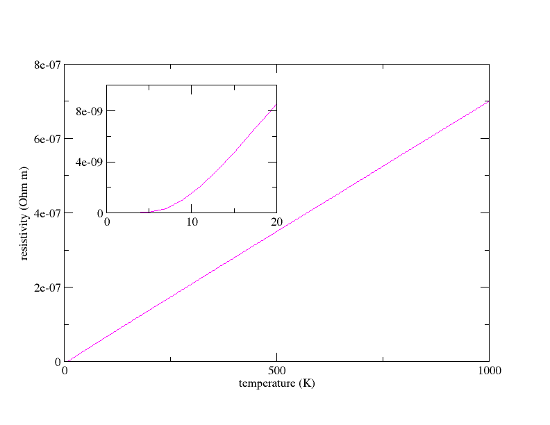

# Electron-phonon tutorial

## Electron-Phonon interaction and superconducting properties of Al.

This tutorial demonstrates how to obtain the following physical properties, for a metal:

  * the phonon linewidths (inverse lifetimes) due to the electron-phonon interaction
  * the Eliashberg spectral function
  * the electron-phonon coupling strength
  * the McMillan critical temperature
  * the resistivity and electronic part of the thermal conductivity

Here you will learn to use the electron-phonon coupling part of the anaddb
utility. This implies a preliminary calculation of the electron-phonon matrix
elements and phonon frequencies and eigenvectors, from a standard ABINIT
phonon calculation, which will be reviewed succinctly.

Visualisation tools are NOT covered in this tutorial.
Powerful visualisation procedures have been developed in the Abipy context,
relying on matplotlib. See the README of [Abipy](https://github.com/abinit/abipy)
and the [Abipy tutorials](https://github.com/abinit/abitutorials).

This tutorial should take about 1 hour.

[TUTORIAL_README]

## 1 Calculation of the ground state and phonon structure of fcc Al

*Before beginning, you might consider making a different subdirectory to work
in. Why not create Work_eph in \$ABI_TESTS/tutorespfn/Input?*

It is presumed that the user has already followed the Tutorials [RF1](rf1) and [RF2](rf2),
and understands the calculation of ground state and response (phonon using density-functional
perturbation theory (DFPT)) properties with ABINIT.

The file *teph_1.files* lists the file names and root names for the first run (GS+perturbations).
You can copy it to the working directory. You can also copy the file *teph_1.in* to your working directory.

```sh
cd $ABI_TESTS/tutorespfn/Input
mkdir Work_eph
cd Work_eph
cp ../teph_1.file .
cp ../teph_1.in .
```



You can immediately start this run - the input files will be examined later...

    abinit < teph_1.files > log 2> err &

### Dataset Structure and Flow

The *teph_1.in* file contains a number of datasets (DS). These will perform the
ground state (DS 1), then the phonon perturbations (DS 2-4), for a cell of FCC
aluminium. The DDK perturbation (DS 5) is also calculated, and will be used to
obtain the Fermi velocities for the transport calculations in Section 6.

Once these are done, abinit calculates the wave functions on the full grid of
k-points (using [[kptopt]]=3) in DS 6: these will be used to calculate the
electron-phonon matrix elements. In a full calculation the density of k-points
should be increased significantly here and for the following datasets. For DS
1-5 only the normal convergence of the phonon frequencies should be ensured.
In DS 7-10 only the matrix elements are calculated, for the electron-phonon
coupling and for the DDK (position/momentum matrix elements), on the dense and
complete grid of k-points from DS 6. Note that the separation of the matrix
element calculation is new from version 7.6.

The important variable for electron-phonon coupling calculations is [[prtgkk]]
This prints out files suffixed GKK, which contain the electron-phonon matrix
elements. The matrix elements only depend on the self-consistent perturbed
density (files suffixed 1DENx), which we get from DS 2-4 (linked by variable
[[get1den]]). These can therefore be calculated on arbitrarily dense k-point
meshes. Even better, only a single step is needed, since no self-consistency
is required. To enforce the calculation of all the matrix elements on all
k-points, symmetries are disabled when [[prtgkk]] is set to 1, so be sure not
to use it during the normal self-consistent phonon runs DS 2-4. Again this is
very different from versions before 7.6.

### Convergence

The calculation is done using minimal values of a number of parameters, in
order to make it tractable in a time appropriate for a tutorial. The results
will be completely unconverged, but by the end of the tutorial you should know
how to run a full electron phonon calculation, and be able to improve the
convergence on your own.

Edit the file *teph_1.in*. We now examine several variables. The kinetic energy
cutoff [[ecut]] is a bit low, and the number of k-points (determined by
[[ngkpt]]) is much too low. Electron-phonon calculations require a very
precise determination of the Fermi surface of the metal. This implies a very
dense k-point mesh, and the convergence of the grid must be checked. In our
case, for Al, we will use a (non-shifted) 4x4x4 k-point grid, but a converged
calculation needs more than 16x16x16 points. This will be re-considered in
section 5. The q-point grid will be 2x2x2. It must be a sub-grid of the full
k-point grid, and must contain the Γ point.

The value of [[acell]] is fixed to a rounded value from experiment.
It, too, should be converged to get physical results (see [Tutorial 3](base3)).

Note that the value of 1.0E-14 for [[tolwfr]] is tight, and should be even
lower (down to 1.0E-20 or even 1.0E-22). This is because the wavefunctions
will be used later explicitly in the matrix elements for ANADDB, as opposed to
only energy values or densities, which are averages of the wavefunctions and
eigenenergies over k-points and bands. Electron-phonon quantities are delicate
sums of a few of these small matrix elements (those near the Fermi surface),
so each matrix element must be accurate. You can however set [[prtwf]] to 0 in
the phonon calculations, and avoid saving huge perturbed wavefunction files to
disk (you only need to keep the ground state wave functions, with prtwf1 1).

### Execution

Run the first input (a few seconds on a recent PC), and you should obtain a value of

     etotal -2.0828579336121 Ha

for the energy at the end of DATASET 1. The following datasets calculate the
second order energy variations under atomic displacement in the three reduced
directions of the fcc unit cell. This is done for three different phonons,
Gamma, (1/2,0,0), and X=(1/2,1/2,0), which generate the 2x2x2 q-point grid
(take care with the reduced coordinates of the reciprocal space points! They
are not along cartesian directions, but along the reciprocal space lattice
vectors.). The whole calculation follows the same lines as [Tutorial RF1](rf1).
As an example, DATASET 3 calculates the perturbed
wavefunctions at k+q, for k in the ground state k-point mesh, and q=(1/2,0,0).
Then, DATASET 3 calculates

     2DTE 0.80951882353353

for the second-order energy variation for movement of the (unique) atom along
the first reduced direction for q=(1/2,0,0). The main differences with [Tutorial RF1](rf1)
are that Given we are dealing with a metal, no
perturbation wrt electric fields is considered ; However, if you want to do
transport calculations, you need the ddk calculation anyway, to get the
electron band velocities. This is added in dataset 5. In the standard case,
ABINIT uses symmetry operations and non-stationary expressions to calculate a
minimal number of 2DTE for different mixed second derivatives of the total
energy. In our case we use the first derivatives, and they must all be calculated explicitly.

You are now the proud owner of 9 first-order matrix element files (suffixed
_GKKx), corresponding to the three directional perturbations of the atom at
each of the three q-points. The _GKK files contain the matrix elements of the
electron-phonon interaction, which we will extract and use in the following.
Besides the _GKK files there are the _DDB files for each perturbation which
contain the 2DTE for the different phonons wavevectors q.

## 2 Merging of the 2DTE DDB files using MRGDDB

You can copy the following content to a file *teph_2.in* within your working directory:

    teph_2.ddb.out
    Total ddb for Al FCC system
    3
    teph_1o_DS2_DDB
    teph_1o_DS3_DDB
    teph_1o_DS4_DDB

or use



This is your input file for the [[help:mrgddb|MRGDDB]] utility, which will
take the different _DDB files and merge them into a single one which ANADDB
will use to determine the phonon frequencies and eigenvectors. *teph_2.in*
contains the name of the final file, a comment line, then the number of *_DDB*
files to be merged and their names.
*mrgddb* is run with the command

     mrgddb < teph_2.in

It runs in a few seconds.

## 3 Extraction and merging of the electron-phonon matrix elements using MRGGKK

A merge similar to that in the last section must be carried out for the
electron-phonon matrix elements. This is done using the MRGGKK utility, and
its input file is *\$ABI_TESTS/tutorespfn/Input/teph_3.in*, shown below

    teph_3o_GKK.bin   # Name of output file
    0                    # binary (0) or ascii (1) output
    teph_1o_DS1_WFK   # GS wavefunction file
    0  9 9               # number of 1WF files, of GKK files, and of perturbations in the GKK files
    teph_1o_DS2_GKK1  # names of the 1WF then the (eventual) GKK files
    teph_1o_DS2_GKK2
    ...

or use



The matrix element sections of all the _GKK files will be extracted and
concatenated into one (binary) file, here named *teph_3o_GKK.bin*. The following
lines in *teph_3.in* give the output format (0 for binary or 1 for ascii), then
the name of the ground state wavefunction file. The fourth line contains 3
integers, which give the number of _1WF files (which can also be used to
salvage the GKK), the number of _GKK files, and the number of perturbations in
the _GKK files. Thus, MRGGKK functions very much like [help:mrgddb|MRGDDB], and can merge _GKK
files which already contain several perturbations (q-points or atomic
displacements). Finally, the names of the different _1WF and _GKK files are listed.

MRGGKK will run on this example in a few seconds. In more general cases, the
runtime will depend on the size of the system, and for a large number of bands
or k-points can extend up to 20 minutes or more.

## 4 Basic ANADDB calculation of electron-phonon quantities

The general theory of electron-phonon coupling and Eliashberg
superconductivity is reviewed in [[cite:Allen1983a|Theory of Superconducting Tc]],
by P.B. Allen and B. Mitrovic.
The first implementations similar to that in ABINIT are those in [[cite:Savrasov1996]] and [[cite:Liu1996]].

File *\$ABI_TESTS/tutorespfn/Input/teph_4.in* contains the input needed by
ANADDB to carry out the calculation of the electron-phonon quantities.



ANADDB takes a files file, just like ABINIT, which tells it where to find the input,
ddb, and gkk files, and what to name the output, thermodynamical output, and
electron phonon output files. *\$ABI_TESTS/tutorespfn/Input/teph_4.files* is
your files file for ANADDB. You can edit it now.

The new variables are at the head of the file:

    # turn on calculation of the electron-phonon quantities
    elphflag 1

    # Path in reciprocal space along which the phonon linewidths
    #  and band structure will be calculated
    nqpath 7
    qpath
     0.0 0.0 0.0
     1/2 1/2 0.0
     1   1   1
     1/2 1/2 1/2
     1/2 1/2 0.0
     1/2 3/4 1/4
     1/2 1/2 1/2

    # Coulomb pseudopotential parameter
    mustar 0.136

[[anaddb:elphflag]] is a flag to turn on the calculation of the electron-
phonon quantities. The first quantities which will be calculated are the
phonon linewidths along a path in reciprocal space (exactly like the band
structure in [the tutorial 3](base3). The path is specified by the
variable [[anaddb:qpath]] giving the apexes of the path in reciprocal space,
which are usually special points of high symmetry. The number of points is
given by [[anaddb:nqpath]]. Note that qpath can be used in normal phonon band
structure calculations as well, provided that [[anaddb:qph1l]] is omitted from
the input file (the latter overrides qpath). The phonon linewidths are printed
to a file suffixed _LWD.

The phonon linewidths are proportional to the electron phonon coupling, and
still depend on the phonon wavevector q. The other electron-phonon
calculations which are presently implemented in ANADDB, in particular for
superconductivity, determine isotropic quantities, which are averaged over the
Fermi surface and summed over q-points. Integrating the coupling over
reciprocal space, but keeping the resolution in the phonon mode's energy, one
calculates the Eliashberg spectral function $\alpha^2F$. The $\alpha^2F$ function is similar
to the density of states of the phonons, but is weighted according to the
coupling of the phonons to the electrons. It is output to a file with suffix
_A2F, which is ready to be represented using any graphical software (Xmgr,
matlab, OpenDX...). The first inverse moment of $\alpha^2F$ gives the global coupling
strength, or mass renormalization factor, $\lambda$. From $\lambda$, using the [[cite:McMillan1968|McMillan formula]]
as modified by [[cite:Allen1975|Allen and Dynes]]
ANADDB calculates the critical temperature for superconductivity.
The formula contains an adjustable
parameter $\mu^{\star}$ which approximates the effect of Coulomb interactions, and is
given by the input variable [[anaddb:mustar]]. For Al with the k-point grid
given and a value of $\mu^{\star}$=0.136 the ANADDB output file shows the following values

     mka2f: lambda <omega^2> =     8.891284E-07
     mka2f: lambda <omega^3> =     7.757272E-10
     mka2f: lambda <omega^4> =     8.715049E-13
     mka2f: lambda <omega^5> =     1.108658E-15
     mka2f: isotropic lambda =     8.337444E+00
     mka2f: omegalog  =     1.769558E-04 (Ha)     5.587816E+01 (Kelvin)
     mka2f: input mustar =     1.360000E-01
    -mka2f: MacMillan Tc =     4.038730E-05 (Ha)     1.275329E+01 (Kelvin)

As expected, this is a fairly bad estimation of the experimental value of 1.2
K. The coupling strength is severely overestimated (experiment gives 0.44),
and the logarithmic average frequency is too low, but not nearly enough to
compensate $\lambda$. Aluminum is a good case in which things can be improved, easily
because its Fermi surface is isotropic and the coupling is weak.

## 5 Convergence tests of the integration techniques

In section 4, we used the default method for integration on the Fermi surface,
which employs a smearing of the DOS and attributes Gaussian weights to each
k-point as a function of its distance from the Fermi surface. Another
efficient method of integration in k-space is the tetrahedron method, which is
also implemented in ANADDB, and can be used by setting [[anaddb:telphint]] =
0. In this case the k-point grid must be specified explicitly in the input,
repeating the variable [[anaddb:kptrlatt]] from the ABINIT output, so that
ANADDB can re-construct the different tetrahedra which fill the reciprocal
unit cell. In the Gaussian case, the width of the smearing can be controlled
using the input variable [[anaddb:elphsmear]].

To test our calculations, they should be re-done with a denser k-point grid
and a denser q-point grid, until the results ($\alpha^2F$ or $\lambda$) are converged. The
value of [[anaddb:elphsmear]] should also be checked, to make sure that it
does not affect results. Normally, the limit for a very small
[[anaddb:elphsmear]] and a very dense k-point grid is the same as the value
obtained with the tetrahedron method (which usually converges with a sparser k-point grid).

Edit input file *\$ABI_TESTS/tutorespfn/Input/teph_5.in* and you will see the
main difference with teph_4.in is the choice of the tetrahedron integration method.



If you are patient, save the output _LWD and _A2F files and run the
full tutorial again with a denser k-point grid (say, 6x6x6) and you will be able
to observe the differences in convergence.

## 6 Transport quantities within Boltzmann theory

The electron-phonon interaction is also responsible for the resistivity of
normal metals and related phenomena. Even in a perfect crystal, interaction
with phonons will limit electron life times (and vice versa). This can be
calculated fairly simply using the Boltzmann theory of transport with first
order scattering by phonons (see, e.g., [[cite:Ziman1960|"Electrons and Phonons" by Ziman]]).

The additional ingredient needed to calculate transport quantities (electrical
resistivity, heat conductivity limited by electron-phonon coupling) is the
Fermi velocity, i.e. the group velocity of a wavepacket of electrons placed at
the Fermi surface. This is the "true" velocity the charge will move at, once
you have displaced the Fermi sphere a little bit in k space (see, e.g.
[[cite:Ashcroft1976|Ashcroft and Mermin]] as well). The velocity can be related simply to a
commutator of the position, which is also used for dielectric response, using
a DDK calculation (see [the first DFPT tutorial (DFPT1)](rf1).
The phonon calculation at Gamma need not include the electric field (this is a metal after all, so the effect on the
phonons should be negligible), but we need an additional dataset to calculate
the 3 DDK files along the 3 primitive directions of the unit cell. To be more
precise, just as for the el-ph matrix elements, we do not need the perturbed
wavefunctions, only the perturbed eigenvalues. Calculating the DDK derivatives
with [[prtgkk]] set to 1 will output files named _GKKxx (xx=3*natom+1 to
3*natom+3) containing the matrix elements of the ddk perturbation (these are
basically the first part of the normal DDK files for E field perturbation,
without the wave function coefficients).

The anaddb "files" file must specify where the ddk files are, so anaddb can
calculate the Fermi velocities. It actually reads:

    teph_6.in
    teph_6.out
    teph_2.ddb.out
    moldyn
    teph_3o_GKK.bin
    teph.ep
    teph_6.ddk


where the last line is the name of a small file listing the 3 DDK files to be used:

    teph_1_DS5_GKK4
    teph_1_DS5_GKK5
    teph_1_DS5_GKK6

The abinit input file teph_1.in already obtained the DDK files from the
additional dataset, DS5, with the following lines of teph_1.in:

    tolwfr5 1.0d-14
    qpt5 0 0 0
    rfphon5 0
    rfelfd5 2


Copy the additional .ddk file from the tests/tutorespfn/Inputs directory, and
run anaddb with the new "files" file. The input for teph_6 has added to *teph_5.in* the following 2 lines:

    ifltransport 1
    ep_keepbands 1

see



and has produced a number of additional files:

  * *_A2F_TR* contain the equivalent Eliashberg spectral functions with Fermi speed factors (how many phonons do we have at a given energy, how much do they couple with the electrons, and how fast are these electrons going). Integrating with appropriate functions of the phonon energy, one gets:
  * the resistivity as a function of temperature (teph_6.out_ep_RHO and figure) and
  * the thermal conductivity as a function of temperature (teph_6.out_ep_WTH) but ONLY the electronic contribution. You are still missing the phonon-phonon interactions, which are the limiting factor in the thermal conductivity beyond a few 100 K. For metals at even higher temperature the electrons will often dominate again as they contain more degrees of freedom.



The high T behavior is necessarily linear if you include only first order e-p
coupling and neglect the variation of the GKK off of the Fermi surface. The
inset shows the low T behavior, which is not a simple polynomial (with simple
models it should be T^3 or T^5 - see [[cite:Ashcroft1976|Ashcroft and Mermin]]). See the [[cite:Savrasov1996|Savrasov paper]]
above for reference values in simple metals using well converged k- and q- point grids.

Finally, note that the _RHO and _WTH files contain a series of tensor
components, for the resistivity tensor (2 1 = y x or the current response
along y when you apply an electric field along x). In most systems the tensor
should be diagonal by symmetry, and the value of off-diagonal terms gives an
estimate of the numerical error.
