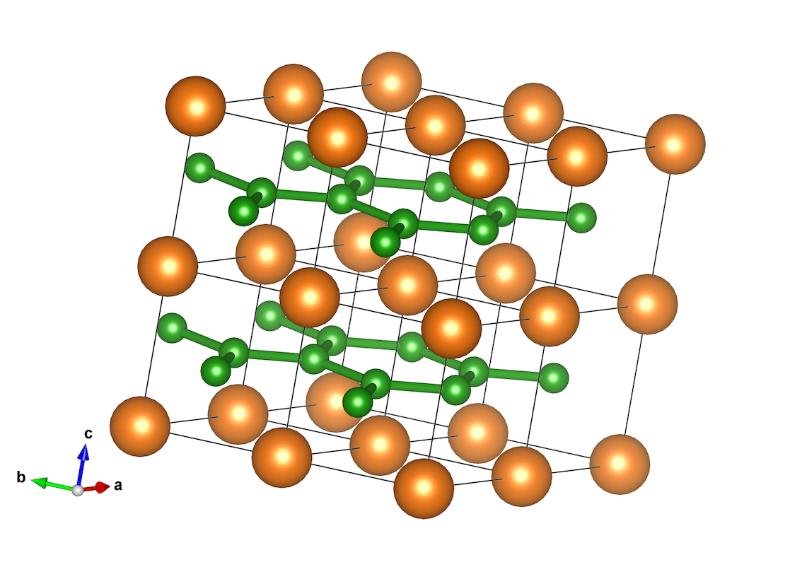
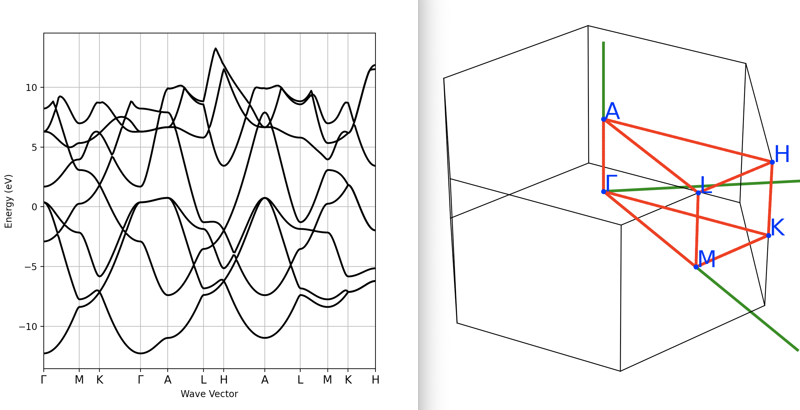
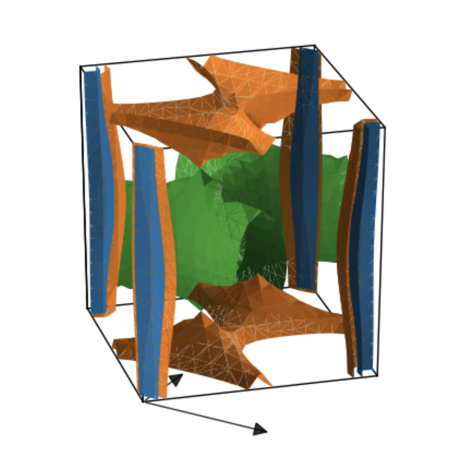
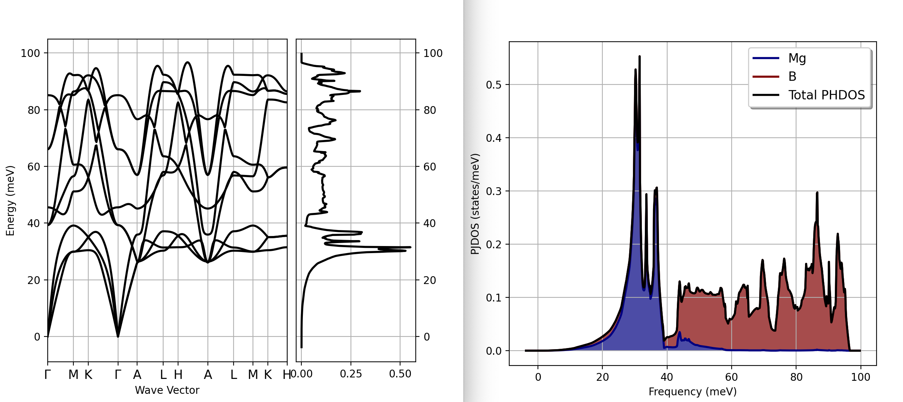
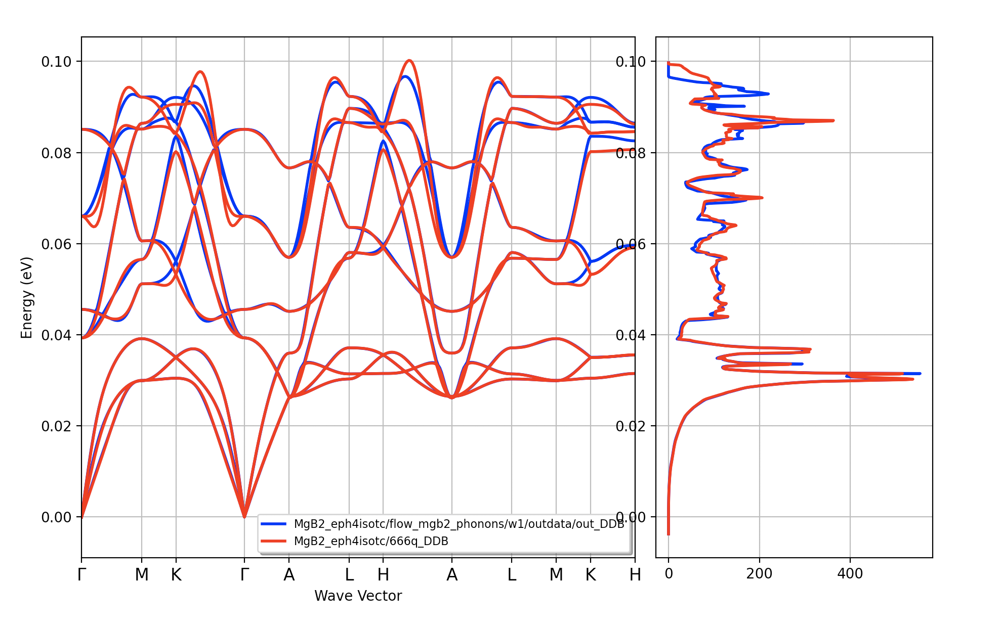
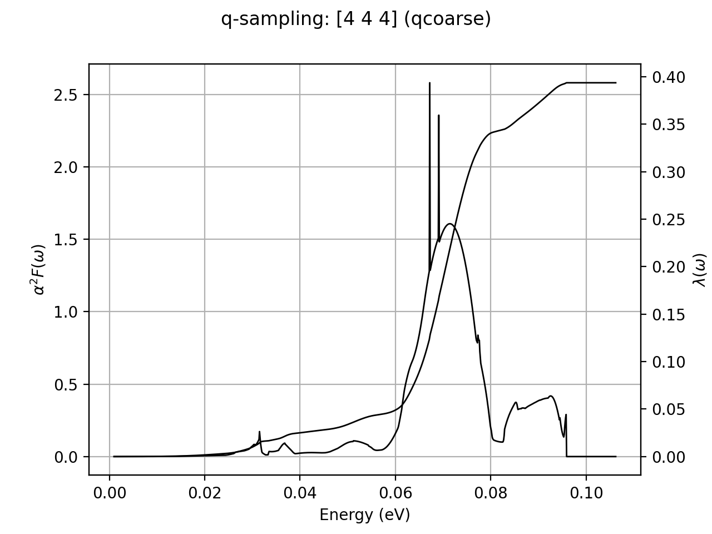
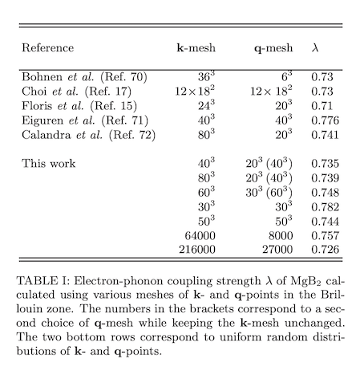
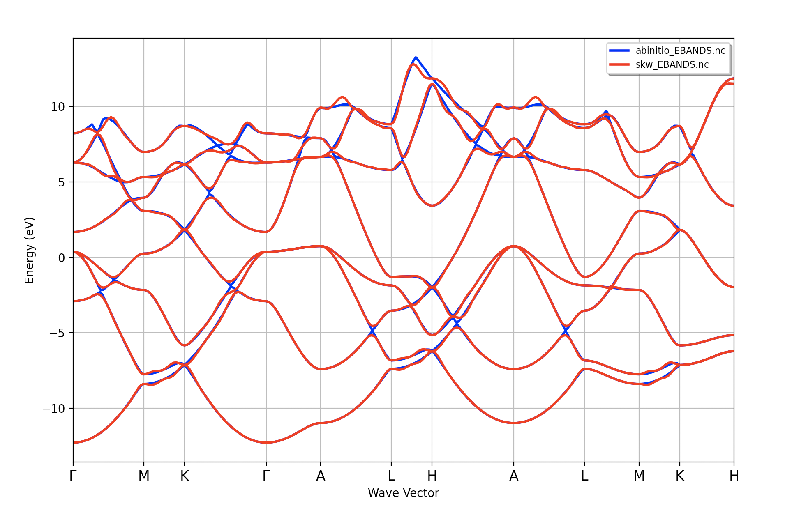

# Superconducting properties within the isotropic Eliashberg formalism

This tutorial explains how to compute the phonon linewidths induced by the electron-phonon (e-ph) interaction
in metallic systems and how to use the Eliashberg spectral function $\alpha^2F$ and the McMillan equation
to estimate the superconducting critical temperature $T_c$ within the **isotropic Eliashberg formalism**.

We start by presenting the basic equations implemented in the code and their connection with the ABINIT variables.
Then we discuss how to run isotropic $T_c$-calculations and how to perform typical convergence studies
for MgB$_2$, a well-known phonon-mediated superconductor with $T_c$ = 39 K.
For a more complete theoretical introduction, see [[cite:Giustino2017]] and references therein.

It is assumed the user has already completed the two tutorials [RF1](/tutorial/rf1) and [RF2](/tutorial/rf2),
and that he/she is familiar with the calculation of ground state and vibrational properties **in metals**.
The user should have read the [fourth lesson on Al](/tutorial/base4) as well
as the [introduction page for the EPH code](/tutorial/eph_intro) before running these examples.

This lesson should take about 1.5 hour.

## Formalism and connection with the implementation

Due to the interaction with electrons, vibrational energies get renormalized and phonons
acquire a **finite lifetime**.
These many-body effects are described by the phonon-electron self-energy:

$$
\Pi_{\qq\nu}(\ww, T) = \dfrac{2}{N_\kk} \sum_{mn\kk} |g_{mn\nu}(\kk, \qq)|^2
\dfrac{f_\nk - f_{m\kq}}{\ee_{\nk} - \ee_{m\kq} -\ww - i\eta^+}
$$

where only contributions up to the second order in the e-ph vertex $g$ have been included.
The sum over the electron wavevector $\kk$ is performed over the first BZ, $\eta$ is a positive real infinitesimal
and $\gkkp$ are the e-ph matrix element discussed in the [EPH introduction](eph_intro).
The self-energy depends on the temperature via the Fermi-Dirac distribution function $f(\ee, T)$
and the factor two accounts for spin degeneracy (henceforth we assume a non-magnetic system
with scalar wavefunctions i.e. [[nsppol]] == 1 and [[nspinor]] == 1
thus the electron energies $\ee$ and the e-ph matrix elements $g$ do not depend on the spin).

The real part of $\Pi_\qnu$ gives the correction to the vibrational energies due to e-ph interaction
while the **phonon linewidth** $\gamma_{\qq\nu}$ (full width at half maximum) is twice
the imaginary part $\Pi^{''}_\qnu$ evaluated at the "bare" phonon frequency $\ww_\qnu$ as computed with DFPT:

$$
\gamma_{\qq\nu}(T) = 2\, \Pi^{''}_\qnu(\ww=\ww_\qnu, T).
$$

Using the [Sokhotski–Plemelj theorem](https://en.wikipedia.org/wiki/Sokhotski%E2%80%93Plemelj_theorem):

$$
\lim_{\eta \rightarrow 0^+} \dfrac{1}{x \pm i\eta} = \mp i\pi\delta(x) + \mathcal{P}(\dfrac{1}{x})
$$

the imaginary part of $\Pi$ can we rewritten as:

$$
\Pi^{''}_{\qq\nu}(\ww_\qnu, T) = \dfrac{2\pi}{N_\kk} \sum_{mn\kk} |g_{mn\nu}(\kk, \qq)|^2
(f_\nk - f_{m\kq})\,\delta(\ee_{\kk n} - \ee_{m\kpq} -\ww_\qnu)
$$

where the delta function enforces energy conservation in the scattering process.
Because phonon energies are typically small compared to electronic energies,
the energy difference $\ee_{\kk n} - \ee_{m\kpq}$ is also small hence it is possible to
approximate the difference in the occupation factors with:

$$
f_\nk - f_{m\kq} \approx f'(\ee_\nk) (\ee_{\kk n} - \ee_{m\kpq}) = -f'(\ee_\nk) \ww_\qnu
$$

At low T, the derivative of the Fermi-Dirac occupation function is strongly peaked around
the Fermi level thus we can approximate it with:

$$ f'(\ee_\nk) \approx -\delta(\ee_\nk - \ee_F) $$

By neglecting $\ww_\qnu$ in the argument of the delta, we obtain the
so-called **double-delta approximation** (DDA) for the phonon linewidth [[cite:Allen1972]]:

\begin{equation}\label{eq:DDA_gamma}
\gamma_{\qq\nu} = \dfrac{4\pi \ww_{\qq\nu}}{N_\kk} \sum_{mn\kk}
|g_{mn\nu}(\kk, \qq)|^2 \delta(\ee_{\kpq m} -\ee_F) \delta(\ee_{\kk n} -\ee_F)
\end{equation}

For a given phonon wavevector $\qq$, the DDA restricts the BZ integration to
electronic transitions between $\kk$ and $\kq$ states on the Fermi surface (FS)
hence very dense $\kk$-meshes are needed to converge $\gamma_{\qq\nu}$.
The convergence rate is expected to be slower than that required by the electron DOS per spin at $\ee_F$:

$$
g(\ee_F) = \dfrac{1}{N_\kk} \sum_{n\kk} \delta(\ee_{n\kk} - \ee_F)
$$

in which a single Dirac delta is involved.

!!! note

    The DDA breaks down at small $\qq$ where the phonon frequency cannot be neglected.
    Note also that the DDA predicts the linewidths to not depend on T.

    It is also worth stressing that there is another important contribution to the phonon lifetimes induced by
    **non-harmonic** terms in the Taylor expansion of the Born-Oppenheimer energy surface around the equilibrium point.
    Within the framework of many-body perturbation theory, these non-harmonic terms lead
    to **phonon-phonon scattering processes** that can give a substantial contribution to the lifetimes,
    especially at "high" T.
    In the rest of the tutorial, however, non-harmonic terms will be ignored and we will be mainly focusing
    on the computation of the imaginary part of the phonon self-energy $\Pi$ in the harmonic approximation.


At the level of the implementation, the [[eph_intmeth]] input variable
selects the technique for integrating the double delta over the FS:
[[eph_intmeth]] == 2 (default) activates the **optimized tetrahedron** scheme [[cite:Kawamura2014]]
as implemented in the [libtetrabz library](http://libtetrabz.osdn.jp/en/_build/html/index.html)
while [[eph_intmeth]] == 1 replaces the Dirac distribution with a **Gaussian** function of finite width.
In the later case, one can choose between a constant broadening $\sigma$
specified in Hartree by [[eph_fsmear]] or an adaptive Gaussian scheme (activated if [[eph_fsmear]] < 0)
in which a state-dependent $\sigma_\nk$ is automatically computed from
the electron group velocities $v_\nk$ [[cite:Li2015]].
Note that the adaptive Gaussian scheme is internally used by the code also when the optimized tetrahedron method
is employed since the DDA is ill-defined for $\qq = \Gamma$.

<!--

!!! important

    The tetrahedron method is more accurate and does not require any broadening parameter.
    Note, however, that in the present implementation the computational cost of the double
    delta with the tetrahedron method quickly increases with the size of the $\kk$-mesh
    so the adaptive Gaussian scheme may represent a valid alternative, especially
    when dense $\kk$-meshes are needed.
-->

The value of the Fermi level $\ee_F$ is automatically computed from the KS eigenvalues stored
in the input WFK file according to the two input variables [[occopt]] and [[tsmear]].
These variables are **usually equal** to the ones used for the GS/DFPT calculations
although it is possible to change the value of $\ee_F$ during an EPH calculation using
three (mutually exclusive) input variables: [[eph_fermie]], [[eph_extrael]] and [[eph_doping]].
This may be useful if one wants to study the effect of doping within the **rigid band approximation**.

<!--
As concerns the computation of the electron DOS, we have [[prtdos]] [[dosdeltae]] [[tsmear]]
-->

The sum over bands in Eq.\ref{eq:DDA_gamma} is restricted to the Bloch states within a
symmetric energy window of thickness [[eph_fsewin]] around $\ee_F$.
This value should be chosen according to the FS integration scheme [[eph_intmeth]] and the value of
[[eph_fsmear]] (if standard Gaussian).
Additional details are given in the tutorial.
The $\kk$-mesh for electrons is defined by the input variables [[ngkpt]], [[nshiftk]] and [[shiftk]].
These parameters **must be equal** to the ones used to generate the input WFK file passed to the EPH code.

The code computes $\gamma_{\qq\nu}$ for all the $\qq$-point in the IBZ associated
to the [[eph_ngqpt_fine]] $\qq$-mesh and the DFPT potentials are interpolated starting
from the *ab-initio* [[ddb_ngqpt]] $\qq$-mesh associated to the input DVDB/DDB files.
If [[eph_ngqpt_fine]] is not specified, [[eph_ngqpt_fine]] == [[ddb_ngqpt]] is assumed
and no interpolation of the scattering potentials in $\qq$-space is performed.

Once the phonon linewidths $\gamma_{\qq\nu}$ are known in the IBZ, ABINIT computes
the isotropic Eliashberg function defined by:

$$
\alpha^2F(\ww) =
\dfrac{1}{N_\qq\, N_F} \sum_{\qq\nu} \dfrac{\gamma_{\qq\nu}}{\ww_{\qq\nu}} \delta(\ww - \ww_{\qq \nu})
$$

where $N_F$ is the density of states (DOS) per spin at the Fermi level.
The Eliashberg function can be equivalently expressed as:

$$
\alpha^2F(\ww) =
\dfrac{1}{N_\qq N_\kk\, N_F} \sum_{\kk\qq mn \nu}
|g_{mn\nu}(\kk, \qq)|^2 \delta(\ee_{\kpq m} -\ee_F) \delta(\ee_{\kk n} -\ee_F) \delta(\ww - \ww_{\qq \nu}).
$$

From a physical perspective, $\alpha^2F(\ww)$ gives the strength by which a phonon
of energy $\hbar\ww$ scatters electronic states on the FS (remember that ABINIT uses atomic units hence $\hbar = 1$).
This quantity is accessible in experiments and experience has shown that
$\alpha^2F(\ww)$ is qualitatively similar to the phonon DOS $F(\ww)$:

$$
F(\ww) = \dfrac{1}{N_\qq} \sum_{\qq\nu} \delta(\ww - \ww_{\qq \nu}).
$$

This is not surprising as the equation for $\alpha^2F(\ww)$ resembles the one for $F(\ww)$,
except for the weighting factor $\frac{\gamma_{\qq\nu}}{\ww_{\qq\nu}}$.
This also explains the $\alpha^2F$ notation: the Eliashberg function can be seen
as the phonon DOS times the positive frequency-dependent prefactor $\alpha^2(\ww)$.

!!! warning

    Converging $\alpha^2F(\ww)$ usually requires very fine $\kk$- and $\qq$-meshes.
    This is especially true if the FS significantly deviates from the free electron picture (spherical FS)
    and/or the e-ph coupling is strongly anisotropic as in MgB$_2$.
    The $\kk$-mesh affects the quality of the individual $\gamma_\qnu$ linewidths
    whereas dense $\qq$-meshes may be needed to resolve the fine detauls and/or
    sample regions in $\qq$-space where the coupling is strong.

The technique used to compute $\alpha^2F(\ww)$ is defined by [[ph_intmeth]] (note the **ph_** prefix instead of **eph_**).
Both the Gaussian ([[ph_intmeth]] = 1 with [[ph_smear]] smearing) and
the linear tetrahedron method by [[cite:Bloechl1994]] ([[ph_intmeth]] = 2, default) are implemented.
The $\alpha^2F(\ww)$ function is evaluated on a linear mesh of step [[ph_wstep]] covering the entire
range of phonon frequencies.
The total e-ph coupling strength $\lambda$ (a dimensionless measure of the average strength of the e-ph coupling)
is defined as the first inverse moment of $\alpha^2F(\ww)$:

$$
\lambda = \int \dfrac{\alpha^2F(\ww)}{\ww}\dd\ww = \sum_{\qq\nu} \lambda_{\qq\nu}
$$

where we have introduced the mode-dependent contributions:

$$
\lambda_{\qq\nu} = \dfrac{\gamma_{\qq\nu}}{\pi N_F \ww_{\qq\nu}^2}
$$

!!! warning

    Due to the $1/\omega$ factor, "low-energy" modes are expected to contribute more to $\lambda$
    than "high-energy modes".
    On the other hand, $\alpha^2F(\ww)$ should go to zero as $\ww^2$ for $\ww \rightarrow 0$
    so that the integrand function is finite at the acoustic limit.
    Obviously, if the system is not dynamically stable ("negative" frequencies in the BZ)
    $\lambda$ will explode but this does not mean you have found a room-temperature superconductor!

In principle, $T_c$ can be obtained by solving the isotropic Eliashberg equations for the superconducting
gap (see e.g. [[cite:Margine2013]]) but many applications prefer to bypass the explicit solution
and **estimate** $T_c$ using the semi-empirical McMillan equation [[cite:McMillan1968]]
in the improved version proposed by [[cite:Allen1975]]:

$$
T_c = \dfrac{\ww_{log}}{1.2} \exp \Biggl [ \dfrac{-1.04 (1 + \lambda)}{\lambda ( 1 - 0.62 \mu^*) - \mu^*} \Biggr ]
$$

where $\mu^*$ describes the screened electron-electron interaction and
$\ww_{\text{log}}$ is the *logarithmic* average of the phonon frequencies defined by:

$$
\ww_{\text{log}} = \exp \Biggl [ \dfrac{2}{\lambda} \int \dfrac{\alpha^2F(\ww)}{\ww}\log(\ww)\dd\ww \Biggr ]
$$

In pratical applications, $\mu^*$ is treated as an **external parameter**,
typically between 0.1 and 0.2, that is adjusted to reproduce experimental results.
The default value of [[eph_mustar]] is 0.1.

Before concluding this brief theoretical introduction, we would like to
stress that the present formalism assumes a **single superconducting gap**
with a **weak dependence** on $\kk$ so that it is possible to average the anisotropic equations over the FS.
This approximation becomes valid in the so-called dirty-limit (metals with impurities)
as impurities tend to smear out the anisotropy of the superconducting gap.
A more detailed discussion about isotropic/anisotropic formulations can be found in [[cite:Margine2013]].

<!--
TODO
Transport properties in the normal metallic state
Allen obtained an approximation relating the conductivity of metals
to the transport spectral function α2Ftr, which is a variant of the Eliashberg spectral function α2F.
lowest-order variational approximation (LOVA)
[[cite:Allen1976b]], [[cite:Allen1978]]
[[eph_transport]]
-->


## Getting started

[TUTORIAL_README]

Before beginning, you might consider to work in a different subdirectory as for the other tutorials.
Why not create *Work_eph4isotc* in $ABI_TESTS/tutorespfn/Input?

```sh
cd $ABI_TESTS/tutorespfn/Input
mkdir Work_eph4isotc
cd Work_eph4isotc
```

In this lesson we prefer to focus on e-ph calculations and the associated convergence studies.
For this reason, we rely on **pre-computed** DEN.nc, DDB and DFPT potentials
to bypass both the GS and the DFPT part.
The DEN.nc file will be used to perform NSCF computations on **arbitrarily dense** $\kk$-meshes while the
DFPT POT.nc files will be merged with the *mrgdv* utility to produce the DVDB database required by the EPH code.

Note that these files **are not shipped** with the official ABINIT tarball as they are relatively large.
In order to run the examples of this tutorial, you need to download the files from
[this github repository](https://github.com/abinit/MgB2_eph4isotc).
If git is installed on your machine, you can easily fetch the entire repository with:

```sh
git clone https://github.com/abinit/MgB2_eph4isotc.git
```

Alternatively, use *wget*:

```sh
wget https://github.com/abinit/MgB2_eph4isotc/archive/master.zip
```

or *curl*:

```sh
curl -L https://github.com/abinit/MgB2_eph4isotc/archive/master.zip -o master.zip
```

or simply copy the tarball by clicking the "download button" in the github web page,
then unzip the archive and rename the directory with:

```sh
unzip master.zip
mv MgB2_eph4isotc-master MgB2_eph4isotc
```

!!! warning

    The directory with the precomputed files **must be located inside _Work_eph4isotc_**
    and must be named `MgB2_eph4isotc`.
    The reason is that all the input files and examples of this tutorial read data from external files
    specified in terms of **relative paths**.


The |AbiPy| script used to perform the GS + DFPT steps is available
[here](https://github.com/abinit/MgB2_eph4isotc/blob/main/run_mgb2_phonons.py).
In order to facilitate comparison with previous studies,
we use norm-conserving pseudopotentials with a cutoff energy [[ecut]] of 38 Ha
and the experimental parameters for hexagonal MgB$_2$ (a = 5.8317 and c/a= 1.1416).
All the calculations are performed with a 12x12x12 [[ngkpt]] Gamma-centered $\kk$-grid for electrons (**too coarse**),
and the Marzari smearing ([[occopt]] = 4) with [[tsmear]] = 0.02 Ha.
The DFPT computations is done for 12 irreducible $\qq$-points corresponding
to a $\Gamma$-centered 4x4x4 $\qq$-mesh (again, **too coarse** as we will see in the next sections).

Please keep in mind that several parameters have been tuned in order to reach a reasonable **compromise between accuracy
and computational cost** so do not expect the results obtained at the end of the lesson to be fully converged.
It is clear that, in real life, one should start from convergence studies for
lattice parameters and vibrational properties as a function of the $\kk$-mesh and [[tsmear]]
before embarking on EPH calculations.

## Merging the DFPT potentials

To merge the DFPT potential files, copy the first input file in *Work_eph4isotc* with:

```sh
cp $ABI_TESTS/tutorespfn/Input/teph4isotc_1.abi .
```

and execute the *mrgdv* tool using:

```sh
mrgdv < teph4isotc_1.abi
```

The first line in *teph4isotc_1.abi* specifies the name of the output DVDB file, followed by the
number of partial DFPT POT files and the full list of files we want to merge:



This step produces the **teph4isotc_1_DVDB** file that will be used in the next examples.
Executing:

```sh
mrgdv info teph4isotc_1_DVDB
```

shows that all the independent atomic perturbations are available:

```md
 The list of irreducible perturbations for this q vector is:
    1)  idir= 1, ipert=   1, type=independent, found=Yes
    2)  idir= 2, ipert=   1, type=symmetric, found=No
    3)  idir= 3, ipert=   1, type=independent, found=Yes
    4)  idir= 1, ipert=   2, type=independent, found=Yes
    5)  idir= 2, ipert=   2, type=symmetric, found=No
    6)  idir= 3, ipert=   2, type=independent, found=Yes
    7)  idir= 1, ipert=   3, type=symmetric, found=No
    8)  idir= 2, ipert=   3, type=symmetric, found=No
    9)  idir= 3, ipert=   3, type=symmetric, found=No

 All the independent perturbations are available
 Done
```

## Analyzing electronic and vibrational properties

Before proceeding with e-ph calculations, it is worth spending some time to analyze
the structural, electronic and vibrational properties of MgB$_2$ in more detail.
We will be using the |AbiPy| scripts to post-process the data stored in the precomputed netcdf files.

To visualize the crystalline structure with e.g. |vesta|,
use the |abiview| script and the `structure` command.

```md
abiview.py structure MgB2_eph4isotc/flow_mgb2_phonons/w0/t0/run.abi -a vesta

Full Formula (Mg1 B2)
Reduced Formula: MgB2
abc   :   3.086000   3.086000   3.523000
angles:  90.000000  90.000000 120.000000
Sites (3)
  #  SP           a         b    c
---  ----  --------  --------  ---
  0  Mg    0         0         0
  1  B     0.333333  0.666667  0.5
  2  B     0.666667  0.333333  0.5

Visualizing structure with: vesta
Writing data to: .xsf with fmt: xsf
Executing MacOSx open command: open -a vesta --args   /Users/gmatteo/git_repos/abinit_rmms/_build/tests/.xsf
```

!!! tip

    Other graphical applications are supported, see `abiview.py structure --help`.
    Note that AbiPy assumes that these tools are **already installed and the binaries
    can be found in $PATH**.
    The same AbiPy command can be used with ABINIT input files as well as output files
    in netcdf format e.g. GSR.nc.

MgB$_2$ crystallizes in the so-called
[AlB$_2$ prototype structure](http://aflow.org/prototype-encyclopedia/AB2_hP3_191_a_d)
with Boron atoms forming graphite-like (honeycomb) layers separated by layers of Mg atoms.
This structure may be regarded as that of completely intercalated graphite with C replaced by B.
Since MgB$_2$ is formally **isoelectronic to graphite**,
its band dispersion is expected to show some similarity to that
of graphite and graphite intercalation compounds.



Now use the |abiopen| script to plot the electronic bands stored in the GSR file produced
by the NSCF calculation (the second task of the first Work i.e. *w0/t1*):

```sh
abiopen.py MgB2_eph4isotc/flow_mgb2_phonons/w0/t1/outdata/out_GSR.nc -e
```

This command produces the following figures:



The electronic properties of MgB$_2$ are intensively discussed in literature, see e.g. [[cite:Mazin2003]].
The dispersion is quite similar to that of graphite with three bonding $\sigma$
bands corresponding to in-plane $sp^2$ hybridization in the boron layer and two $\pi$ bands
(bonding $\pi$ and anti-bonding $\pi^*$) formed by B $p_z$ orbitals.
The lowest band in the band plot is a fully occupied $\sigma$ band.
The other two $\sigma$ bands are incompletely filled and correspond to
the relatively flat states located slightly above $\ee_F$ along the $\Gamma-A$ segment.
Ab-initio calculations showed that these states contribute the most to the e-ph coupling.
<!-- due to a strong coupling with the $E_{2g}$ vibrational modes. -->
The other two bands crossing at the K point at around 1eV are $\pi-\pi^*$ bands.

To compute the so-called fatbands, one can use perforn a NSCF calculation with a $\kk$-path and [[prtdos]] 3.
This is left as optional exercise.
Fatbands plots produced with AbiPy starting from the *FATBANDS.nc* file are available
[here](https://abinit.github.io/abipy/gallery/plot_efatbands.html).

!!! tip

    The high-symmetry $\kk$-path has been automatically computed by AbiPy when generating the Flow.
    To get the explicit list of high-symmetry $\kk$-point, use the |abistruct| script
    with the `kpath` command:

    ```sh
    abistruct.py kpath mgb2_DEN.nc

    ...

    # K-path in reduced coordinates:
     ndivsm 10
     kptopt -11
     kptbounds
        +0.00000  +0.00000  +0.00000  # $\Gamma$
        +0.50000  +0.00000  +0.00000  # M
        +0.33333  +0.33333  +0.00000  # K
        +0.00000  +0.00000  +0.00000  # $\Gamma$
        +0.00000  +0.00000  +0.50000  # A
        +0.50000  +0.00000  +0.50000  # L
        +0.33333  +0.33333  +0.50000  # H
        +0.00000  +0.00000  +0.50000  # A
        +0.50000  +0.00000  +0.50000  # L
        +0.50000  +0.00000  +0.00000  # M
        +0.33333  +0.33333  +0.00000  # K
        +0.33333  +0.33333  +0.50000  # H
    ```

The value of the DOS at the Fermi level plays a very important role when discussing superconducting properties.
Actually this is one of the quantities that should be subject to convergence studies with respect to the $\kk$-grid
before embarking on DFPT/EPH calculations.
To compute the DOS with the tetrahedron method, use the `ebands_edos` command of *abitk*

```sh
abitk ebands_edos MgB2_eph4isotc/flow_mgb2_phonons/w0/t0/outdata/out_GSR.nc
```

to read the eigenvalues in the IBZ from a `GSR.n` file (`WFK.nc` files are supported as well).
This command produces a text file named `out_GSR.nc_EDOS` that can be visualized with:

```sh
abiopen.py out_GSR.nc_EDOS -e
```



<!--
Nesting factor
Yet visualizing the FS is rather useful when discussing e-ph properties in metals.

\begin{equation}
    N(\qq) = \sum_{mn\kk} \delta(\ee_{\kpq m}) \delta(\ee_{\kk n})
\end{equation}
-->

Note that the phonon linewidths have a *geometrical contribution* due to Fermi surface since $\gamma_\qnu$
is expected to be large in correspondence of $\qq$ wave vectors connecting two portions of the FS.
Strictly speaking this is true only if the e-ph matrix elements are constant.
In real materials the amplitude of $g_{mn\nu}(\kk, \qq)$ is not constant
and this may enhance/suppress the value $\gamma_\qnu$ for particular modes.
Yet visualizing the FS is rather useful when discussing e-ph properties in metals.
For this reason, it is useful to have a look at the FS with an external

Graphical tools for the visualization of the FS usually require an external file with
electronic energies in the full BZ whereas *ab-initio* codes usually take advantage of symmetries
to compute $\ee_\nk$ in the IBZ only.
To produce a BXSF that can be used to visualize the FS with e.g. |xcrysden|,
use the `ebands_bxsf` command of the *abitk* utility located in *src/98_main*
and provide a *GSR.nc* (*WFK.nc*) file with energies computed on a $\kk$-mesh in the IBZ:

```sh
abitk ebands_bxsf MgB2_eph4isotc/flow_mgb2_phonons/w0/t0/outdata/out_GSR.nc
```

This command reconstructs the KS energy in the full BZ by symmetry and produces
the `out_GSR.nc_BXSF` file that can be opened with |xcrysden| using:

```sh
xcrysden --bxsf out_GSR.nc_BXSF
```


Other tools such as |fermisurfer| or |pyprocar| can read data in the BXSF format as well.
For a minimalistic matplotlib-based approach, use can use the |abiview| script with the **fs** command:

```sh
abiview.py fs MgB2_eph4isotc/flow_mgb2_phonons/w0/t0/outdata/out_GSR.nc
```

to visualize the FS in the **unit cell** of the reciprocal lattice.


!!! tip

    The BXSF file can be produced at the end of the GS calculation
    or inside the EPH code by setting [[prtfsurf]] to 1 but *abitk* is quite handy if you already
    have a file and you don't want to write a full Abinit input file and rerun the calculation
    from scratch.


We now focus on the **vibrational properties** of MgB$_2$.
In principle, one can compute phonon frequencies either with *anaddb* or with the EPH code.
However, for many applications, it is much easier
to automate the entire process by invoking *anaddb* directly from the |abiview| script.
To compute the phonon band structure using the DDB file produced on the 4x4x4 $\qq$-mesh, use:

```sh
abiview.py ddb MgB2_eph4isotc/flow_mgb2_phonons/w1/outdata/out_DDB
```

that produces the following figures:



The Projected Phonon DOS (right panel) shows that the low-energy vibrations (below 40 meV) are mainly of Mg character
whereas the higher energy modes mainly involve motions of B atoms.
Of particular interest for us is the two-fold degenerate band located at ~ 60 meV along the $\Gamma-A$ segment.
These are the so-called $E_{2g}$ vibrational modes that couple strongly with the two $\sigma$ bands crossing $\ee_F$.

!!! tip

    A more detailed analysis reveals that $E_{2g}$ involve in-plane stretching of the B-B bonds.
    To visualize the phonon modes, one can use the |phononwebsite| web app by H. Miranda.

    ```sh
    abiview.py ddb MgB2_eph4isotc/flow_mgb2_phonons/w1/outdata/out_DDB

    Opening URL: http://henriquemiranda.github.io/phononwebsite/phonon.html?json=http://localhost:8000/__abinb_workdir__/Mg1B2136lmnep.json
    Using default browser, if the webpage is not displayed correctly
    try to change browser either via command line options or directly in the shell with e.g:

         export BROWSER=firefox

    Press Ctrl+C to terminate the HTTP server

    If the page does not work, upload the json file directly.
    ```

<!--
In metals, the interatomic force-constants are short-ranged yet this does not guarantee that
a Fourier interpolation done starting from a 4x4x4 $\qq$-mesh can capture all the fine details.
-->
The vibrational spectrum just obtained looks reasonable: no vibrational instability is observed and
the acoustic modes tend to zero linearly for $|\qq| \rightarrow 0$
(note that the acoustic sum-rule is enforced by default via [[asr]] = 1).
Yet this does not mean that our results are fully converged.
This is clearly seen if we compare the phonon bands computed with a 4x4x4 and a 6x6x6 ab-initio $\qq$-mesh.
Also in this case, we can automate the process by using the `ddb` command of the |abicomp| script that takes
in input an arbitrary list of DDB files, calls *anaddb* for all the DDB files and finally compare the results:

```sh
abicomp.py ddb \
   MgB2_eph4isotc/flow_mgb2_phonons/w1/outdata/out_DDB \
   MgB2_eph4isotc/666q_DDB -e
```



The figure reveals that the vibrational spectrum interpolated from the 4x4x4 $\qq$-mesh
underestimates the maximum phonon frequency.
Other differences are visible above 40 meV, especially in the  $E_{2g}$ modes.

<!--
Note also that phonon frequencies in metals are also quite sensitive to the $\kk$-mesh and the smearing [[tsmear]].
In real life one should perform an accurate convergence study...
-->

!!! note

    The *666q_DDB* file was produced with the same AbiPy script by just changing the value
    of the *ngqpt* variable.
    The reason why we do not provide files obtained with a 6x6x6 $\qq$-sampling is that the size of the
    git repository including all the DFPT potentials is around 200 Mb.
    For this reason, we continue using the 4x4x4 DDB file but we should take
    this into account when comparing our results with previous works.

## Our first computation of the isotropic Tc

For our first example, we use a relatively simple input file that allows us to introduce
the most important variables and the organization of the results.
Copy *teph4isotc_2.abi* in the working directory and run the code using:

```sh
abinit teph4isotc_2.abi > log 2> err
```

!!! tip

    If you prefer, you can run it in parallel with e.g two MPI processes using:

    ```sh
    mpirun -n 2 abinit teph4isotc_2.abi > log 2> err
    ```

    without having to introduce any input variable for the MPI parallelization
    as the EPH code can automatically distribute the workload over k-points and spins.
    Further details concerning the MPI version are given in the
    [last section of the tutorial](#notes-on-the-mpi-parallelism)

We now discuss the meaning of the different variables in more detail.



To activate the computation of $\gamma_{\qq\nu}$ in metals, we use [[optdriver]] = 7 and [[eph_task]] = 1.
The location of the external DDB, DVDB and WFK files is specified via
[[getddb_filepath]] [[getdvdb_filepath]] [[getwfk_filepath]], respectively.

```sh
getddb_filepath  "MgB2_eph4isotc/flow_mgb2_phonons/w1/outdata/out_DDB"

getwfk_filepath  "MgB2_eph4isotc/flow_mgb2_phonons/w0/t0/outdata/out_WFK.nc"

getdvdb_filepath "teph4isotc_1_DVDB"
```

The DDB and the WFK files are taken from the git repository while for the DVDB we use
the file produced by *mrgdv* in the previous section (remember what we said about
the use of **relative paths** in the input files).
Note also the use of the new input variable [[structure]] (added in Abinit v9)
with the **abifile** prefix

```sh
structure "abifile:MgB2_eph4isotc/flow_mgb2_phonons/w0/t0/outdata/out_DEN.nc"
```

to read the crystalline structure from an external file
so that we do avoid repeating the unit cell in every input file.

Next, we have the variables defining the coarse and the fine $\qq$-mesh
([[ddb_ngqpt]] and [[eph_ngqpt_fine]], respectively):

```sh
ddb_ngqpt 4 4 4        # The ab-initio q-mesh (DDB, DVDB)
eph_ngqpt_fine 6 6 6   # Activate interpolation of DFPT potentials
                       # gamma_{q,nu} are computed of this fine grid.
dipdip 0               # No treatment of the dipole-dipole part. OK for metals
```

[[dipdip]] is set to zero as we are dealing with a metal and the inter-atomic force
constants are short-ranged provided we ignore possible Kohn-anomalies [[cite:Kohn1959]].

The $\kk$-point integration is performed with the Gaussian smearing
([[eph_intmeth]] == 1 and 0.1 eV for [[eph_fsmear]]).

```sh
eph_intmeth 1       # Gaussian method for double-delta integration.
eph_fsmear 0.1 eV   # Constant broadening in Gaussian function.
eph_fsewin 0.3 eV   # Energy window for wavefunctions.
```

!!! note

    In order to accelerate the calculation, we have decreased [[eph_fsewin]]
    from its default value of 1.0 eV to 0.3 eV.
    This is possible when the Gaussian method is used since
    states whose energy is 3-4 standard deviation from the Fermi level give
    negligible contribution to the double delta integral.
    In other words, for the Gaussian technique, an optimal value of [[eph_fsewin]]
    can be deduced from [[eph_fsmear]]
    Unfortunately, this is not possible when the tetrahedron method is used and, to some extent,
    also when the adaptive broadening is used.
    Hopefully, the next versions of the code will provide ...
    0.04 Ha ~ 1 eV

Then we activate two tricks to make the calculation faster:

```sh
mixprec 1
boxcutmin 1.1
```

As explained in the documentation, using [[mixprec]] = 1 and 2 > [[boxcutmin]] >= 1.1
should not have significant effects on the final results yet these are not the default values
as users are supposed to compare the results with/without these tricks (especially [[boxcutmin]])
before running production calculations.

<!--

TODO: discuss ph_nqpath and ph_qpath
In this particular example, there's no difference between a calculation done with *dipdip* 0 or 1 as our
DDB does not contain $\ee^\infty$ and the Born-effective charges.
Finally, we have the specification of the $\kk$-mesh must in terms of [[ngkpt]], [[nshiftk]] and [[shiftk]]
that must be equal to the one used to generate the input WFK file:

```sh
ngkpt   12 12 12
nshiftk 1
shiftk  0.0 0.0 0.0
```

```sh
eph_task 0

# phonon DOS with q-mesh (default tetrahedron method)
ph_ngqpt
#ph_intmeth

# phonon bands along high-symmetry q-path
ph_nqpath
ph_qpath
ph_ndivsm

# Compute phonon bands along this q-path.
ph_nqpath 8
ph_qpath
    0.0 0.0 0.0   # Gamma
    1/3 1/3 0.0   # K
    0.5 0.0 0.0   # M
    0.0 0.0 0.0   # Gamma
    0.0 0.0 0.5   # A
    1/3 1/3 0.5   # H
    0.5 0.0 0.5   # L
    0.0 0.0 0.5   # A
```

The phonon DOS will be computed using the (dense) [[ph_ngqpt]] $\qq$-mesh with the [[ph_intmeth]] integration scheme.
The high-symmetry $\qq$-path for the phonon band structure is specified with:
[[ph_nqpath]], [[ph_qpath]], and [[ph_ndivsm]].

!!! important

    [[dipdip]] can be set to zero as we are dealing with a metal and therefore the IFCs are short-ranged.
    Note that the default value of [[dipdip]] is designed for polar semiconductors so we recommend
    to override the default behaviour when performing calculations with [[eph_task]] = 1.

Remember to discuss k-mesh and [[tsmear]] at the DFPT level.
-->

### Output files

We now discuss in more detail the main output file produced by the EPH run.



After the standard section with info on the unit cell and the pseudopotentials,
we find info on the electronic DOS:

```sh
 Linear tetrahedron method.
 Mesh step:  10.0 (meV) with npts: 2757
 From emin:  -5.1 to emax:  22.5 (eV)
 Number of k-points in the IBZ: 133
 Fermi level:   7.63392108E+00 (eV)
 Total electron DOS at Fermi level in states/eV:   7.36154553E-01
 Total number of electrons at eF:    8.0

- Writing electron DOS to file: teph4isotc_2o_DS1_EDOS
```

Then the code outputs some basic quantities concerning the Fermi surface
and the method for the BZ integration of the double delta:

```md
 ==== Fermi surface info ====
 FS integration done with adaptive gaussian method
 Total number of k-points in the full mesh: 1728
 For spin: 1
    Number of BZ k-points close to the Fermi surface: 291 [ 16.8 %]
    Maximum number of bands crossing the Fermi level: 3
    min band: 3
    Max band: 5
```

Then, for each $\qq$-point in the IBZ, the code outputs
the values of $\ww_\qnu$, $\gamma_\qnu$ and $\lambda_\qnu$:

```md
 q-point =    0.000000E+00    0.000000E+00    0.000000E+00
 Mode number    Frequency (Ha)  Linewidth (Ha)  Lambda(q,n)
    1        0.000000E+00    0.000000E+00    0.000000E+00
    2        0.000000E+00    0.000000E+00    0.000000E+00
    3        0.000000E+00    0.000000E+00    0.000000E+00
    4        1.444402E-03    4.898804E-07    3.731164E-03
    5        1.444402E-03    4.898804E-07    3.731164E-03
    6        1.674636E-03    2.955247E-15    1.674492E-11
    7        2.426616E-03    1.025439E-03    2.767185E+00
    8        2.426616E-03    1.025439E-03    2.767185E+00
    9        3.127043E-03    3.508418E-08    5.701304E-05
```

The frequencies of the acoustic modes at $\Gamma$ are zero (as they should be)
since [[asr]] is automatically set to 1 so the acoustic rule is **automatically enforced**.
Also, the linewidths of the acoustic modes are zero.
In this case, however, the code uses a rather simple heuristic rule:

```sh
abiview.py ddb_asr MgB2_eph4isotc/flow_mgb2_phonons/w1/outdata/out_DDB
```

Finally, we have the value of the isotropic $\lambda$:

```sh
 lambda=   0.4286
```

The calculation has produced the following output files:

```sh
$ ls teph4isotc_2o_DS1*

teph4isotc_2o_DS1_A2F.nc       teph4isotc_2o_DS1_NOINTP_A2FW    teph4isotc_2o_DS1_PHDOS.nc
teph4isotc_2o_DS1_A2FW         teph4isotc_2o_DS1_NOINTP_PH_A2FW teph4isotc_2o_DS1_PHGAMMA
teph4isotc_2o_DS1_EBANDS.agr   teph4isotc_2o_DS1_PHBANDS.agr    teph4isotc_2o_DS1_PH_A2FW
teph4isotc_2o_DS1_EDOS         teph4isotc_2o_DS1_PHBST.nc
```

The files without the `.nc` extension are text files that can be plotted with e.g. |gnuplot| or |xmgrace|.
More specifically,

Apple
:   Pomaceous fruit of plants of the genus Malus in the family Rosaceae.

The *A2F.nc* netcdf file stores all the results of the calculation in a format that can
can be visualized with |abiopen|:

```sh
abiopen.py teph4isotc_2o_DS1_A2F.nc -e
```

that produces the following plot:



Our first results should be interpreted with a critical eye due to coarse sampling used,
yet our $\alpha^2F(\ww)$ already shows features that are observed in other (more accurate) calculations
reported in the literature: a broad peak at ~70 meV that gives the most important contribution to the total $\lambda$
and a second smaller peak at ~70 meV.
The sharp delta-like peaks are an artifact of the linear interpolation and will hopefully disappear
if denser $\qq$-meshes are used.
Our initial values for $\lambda$ and $\ww_{log}$ are:

```md
a2f(w) on the [4 4 4] q-mesh (ddb_ngqpt|eph_ngqpt)
Isotropic lambda: 0.39, omega_log: 0.067 (eV), 780.042 (K)k
```

If we compare our results for $\lambda$ with those reported in [[cite:Margine2013]],



we see that our first calculation underestimates $\lambda$ by almost a factor two.
Note, however, that all the previous studies used much denser samplings and all of them
use at least a 6x6x6 $\qq$-mesh for phonons.
It is clear that we need to densify the BZ sampling to get more reliable results yet
our results are not that bad considering that the calculation took less than XXX minutes in sequential.

<!--

??? note "Exercise"

     Since our WFK is defined on a 12x12x12 $\kk$-mesh it is very easy to activate the interpolation
     of the DFPT potentials to go from a 4x4x4 to a 12x12x12 $\qq$-mesh while keeping the same WFK file.
     Use [[eph_ngqpt_fine]] in the previous input file to densify the $\qq$-mesh for phonons and compare the
     results with those obtained with a 6x6x6 sampling.
     Use compare the results obtained without [[mixprec]] 1 and [[boxcutmin]] 1.1.
     You may want to run the calculation in parallel with mpirun.

-->

## Using the tetrahedron method

In this section, we repeat the calculation done in **teph4isotc_2.abi**
but now with the **optimized tetrahedron** scheme by [[cite:Kawamura2014]].
This test will show that (i) phonon linewidths are very sensitive to the $\kk$-mesh
and the integration scheme and that (ii) one has to test different values of [[eph_fsewin]]
to find the optimizal one.

The reason is that the optimized tetrahedron scheme constructs a third-order interpolation function
with 20 $\kk$-points so states that are relatively far from the Fermi level contributes to the integrand.
If [[eph_fsewin]] is too small, part of the weigt is lost.
To find an optimal value, we can use:

```md
ndtset 4
eph_intmeth 2   # Tetra
eph_fsewin: 0.4 eV
eph_fsewin+ 0.4 eV
```

We do not provide an input file to perform such test as one can easily change **teph4isotc_2.abi**.
and the run the calculation in parallel.
To compare the results, we use the `a2f` command of the |abicomp| script and pass the list of `A2F.c` files:

```sh
abicomp.py a2f teph4isotc_2o_DS*_A2F.nc -e
```


## Preparing the convergence study wrt the k-mesh

<!--
Our goal is to perform calculations of $\gamma_\qnu$ and $\lambda_\qnu$ with different $\kk/\qq$-meshes
in order to analyze the convergence behaviour of $\alpha^2F(\ww)$ and $\lambda$.
Due to the limited amount of time available for a tutorial, we won't be able to fully reproduce published results
also because we are still using a 4x4x4 **ab-initio** $\qq$-mesh that, as already discussed, is not enough
to describe vibrational properties.
By the same token, we should not expect the Fourier interpolation of the scattering potentials to work perfectly
when such a coarse **ab-initio** sampling is used.
In a nutshell, we have to make the best of what we have at hand while minimizing the computational cost.

Since we already have a WFK file on a 12x12x12 $\kk$-mesh, it makes sense to compute electrons
on a 24x24x24 $\kk$-mesh so that we can compare the following configurations:
-->

<!--
TODO: Discuss energy window, sigma_erange in connection with the FS window and the integration scheme

As already mentioned in the introduction, the integration of the double delta requires very dense $\kk$-meshes
for electrons in order to obtain accurate results for $\gamma_\qnu$.
By the same token, converging the fine details of $\alpha^2F(\ww)$ and $\lambda$ requires
sampling enough phonon $\qq$-wavectors in the IBZ.
For this reason, convergence studies are performed by densifying both the mesh for electrons and for phonons.
Additional convergence studies wrt [[eph_fsmear]] and [[ph_smear]] are required if Gaussian techniques are used.
Remember that in the EPH code the $\qq$-mesh can be changed at will thanks to the Fourier interpolation
of the dynamical matrix/DFPT potentials whereas Bloch states must be computed explicitly.

Before running calculations with difference meshes, it is a good idea
to sketch the convergence study we want to perform.
Let's assume we want to test the following configurations:

A 6x6x6 $\qq$-mesh (without interpolation) and the following $\kk$-meshes:

    12x12x12, 18x18x18, 24x24x24 (36x36x36)

A 12x12x12 $\qq$-mesh (with interpolation) and the following $\kk$-meshes:

    12x12x12, 24x24x24, (36x36x36)

The pattern at this point should clear: we need to perform NSCF computations
for four different Gamma-centered $\kk$-meshes: 12x12x12, 18x18x18, 24x24x24, and (48x48x48).
The computational cost of the NSC run increases quickly with the size of the $\kk$-mesh but as already
stressed we only needed electron states in a appropriate energy window around the Fermi level.
As the $\kk$-mesh must be a multiple of the $\qq$-mesh, we need to generate **different WFK files**
to prepare our convergence studies.
-->

The NSCF computation of the WFK becomes quite CPU-consuming and memory-demanding if dense $\kk$-meshes are needed.
Fortunately, we can optimize this part since the computation of $\gamma_\qnu$
requires the knowledge of Bloch states inside a relatively small energy window around $\ee_F$.
Similarly to what is done in the [eph4mob tutorial](eph4mob), we can therefore take advantage of
the star-function SKW interpolation to find the $\kk$ wavevectors whose energy is inside
the [[sigma_erange]] energy window **around the Fermi level**.
The choice of an optimal window is discussed afterwards.

First of all, we **strongly recommend** to test whether the SKW interpolation can reproduce
the *ab-initio* results with reasonable accuracy
by comparing the *ab-initio* band structure with the interpolated one by
using *abitk* with the `skw_compare` command:

```sh
abitk skw_compare \
    MgB2_eph4isotc/flow_mgb2_phonons/w0/t0/outdata/out_GSR.nc \
    MgB2_eph4isotc/flow_mgb2_phonons/w0/t1/outdata/out_GSR.nc  --is-metal
```

The fist argument is a *GSR.nc* (*WFK.nc*) file with the energies in the IBZ
that will be used to build the star-function interpolant.
The quality of the interpolant obviously depends on the density of this $\kk$-mesh.
The second file contains the *ab-initio* eigenvalues along a $\kk$-path computed with a standard NSCF run.
In this example, we are using precomputed GSR.nc files with a 12x12x12 $\kk$-mesh for the SKW interpolation.

!!! Note

    Note the use of the `--is-metal` option else *abitk* will complain that it cannot compute the gaps
    as the code by default assumes a semiconductor.

The *skw_compare* command has produced two netcdf files (*abinitio_EBANDS.nc* and *skw_EBANDS.nc*)
that we can be compared with the |abicomp| script and the `ebands` command:

```sh
abicomp.py ebands abinitio_EBANDS.nc skw_EBANDS.nc -p combiplot
```

to produce the following plot:



The figure shows that the SKW interpolant nicely reproduces the *ab-initio* dispersion around $\ee_F$.
Discrepancies between the *ab-initio* results and the interpolated values are visible
in correspondence of **band-crossings**.
This is expected since SKW is a Fourier-based approach and band-crossing leads to a non-analytic behaviour
of the signal that cannot be reproduced with a finite number of Fourier components.
Fortunately, these band crossings are relatively far from the Fermi level hence they do not enter into play
in the computation of superconducting properties.

!!! tip

    Should the fit be problematic, use the command line options:

    ```sh
    abitk skw_compare IBZ_WFK KPATH_WFK [--lpratio 5] [--rcut 0.0] [--rsigma 0]
    ```

    to improve the interpolation and take note of the SKW parameters
    as the same values should be used when calling ABINIT with the [[einterp]] input variable.
    The worst case scenario of band crossings and oscillations close to the Fermi level
    can be handled by enlarging the [[sigma_erange]] energy window.

At this point, we are confident that the SKW interpolation is OK and we can use it to locate
the $\kk$-wavevectors of a much denser $\kk$-mesh whose energy is inside the [[sigma_erange]] window
around the Fermi level.
This is done in the *teph4isotc_4.abi* input file:



The most important section of the input file is reproduced below:

```sh
optdriver 8
wfk_task "wfk_kpts_erange"
getwfk_filepath  "MgB2_eph4isotc/flow_mgb2_phonons/w0/t0/outdata/out_WFK.nc"

# Define fine k-mesh for the SKW interpolation
sigma_ngkpt   24 24 24
sigma_nshiftk 1
sigma_shiftk  0 0 0

sigma_erange -0.3 -0.3 eV  # Select kpts in the fine mesh within this energy window.
einterp 1 5 0 0            # Parameters for star-function interpolation (default values)
```

The first part ([[optdriver]] and [[wfk_task]]) activates the computation of the KERANGE.nc file
with *ab-initio* energies in the IBZ taken from [[getwfk_filepath]].
The three variables [[sigma_ngkpt]], [[sigma_nshiftk]] and [[sigma_shiftk]] define the final dense $\kk$-mesh.
Finally, [[sigma_erange]] defines the energy window around the Fermi level
while [[einterp]] lists the parameters passed to the SKW routines
In this example, we are using the default values.
You may need to change [[einterp]] if you had to use different options for the SKW interpolation
when using `abitk skw_compare`.

!!! important

    When dealing with metals, both entries in [[sigma_erange]] must be **negative**
    so that the energy window is refered to $\ee_F$ and not to the CBM/VBM used in semiconductors.
    Remember to use a value for the window that is reasonably large in order to account
    for possible oscillations and/or inaccuracies of the SKW interpolation around $\ee_F$.




Once we have the *KERANGE.nc* file, we can use it to perform a NSCF calculation to generate
a customized WFK file on the dense $\kk$-mesh:
This is done in the *teph4isotc_4.abi* input file:



to perform a NSCF calculation with [[kptopt]] 0 to produce a new WFK file on the dense $\kk$-mesh.

```sh
iscf  -2
tolwfr 1e-18
kptopt 0                        # Important!
```

with the [[getkerange_filepath]]:

!!! note

    Note how we use [[getden_filepath]] and the syntax:

    ```sh
    getkerange_filepath "teph4isotc_3o_DS1_KERANGE.nc"

    # Read DEN file to initialize the NSCF run.
    getden_filepath "MgB2_eph4isotc/flow_mgb2_phonons/w0/t0/outdata/out_DEN.nc"

    # Init GS wavefunctions from this file (optional).
    getwfk_filepath "MgB2_eph4isotc/flow_mgb2_phonons/w0/t0/outdata/out_WFK.nc"
    ```

    to start the NSCF run from the **precomputed** GS DEN file, initialize the trial wafefunctions
    from [[getwfk_filepath]] to accelerate a bit the calculation.

TODO: Discussion about energy range and integration scheme.

## Convergence study wrt to the k/q-mesh

At this point, we can use the WFK file to perform EPH calculations with denser $\kk$-meshes.
We will be using settings similar to the ones used in **teph4isotc_2.abi** except for
the use of [[eph_ngqpt_fine]], [[getwfk_filepath]] and [[ngkpt]]:



<!--
## A more accurate calculation

If you want to reproduce the results, you can find another github repository here
with the DFPT computation performed with a 24x24x24 $\kk$-mesh and a 6x6x6 $\qq$-mesh for phonons.
Download the repository as explained at the beginning of the lesson, then merge the partial POT files
and compute the WFK file with a NSCF run staring from the DEN.nc file.

You should get:

The EPH calculation on 48 CPUs takes ~ minutes and less than XXX Gb of memory.
-->

## Notes on the MPI parallelism

EPH calculations performed with [[eph_task]] = 1 support 4 different levels of MPI parallelism and
the number of MPI processes for each level can be specified via the [[eph_np_pqbks]] input variable.
Note that we wrote 4 MPI levels instead of 5 because, for isotropic $T_c$ calculations,
the **band parallelism is not supported**, only atomic perturbations, $\qq$-points, $\kk$-points and spins (if any).

The [[eph_np_pqbks]] variable is **optional** in the sense that whatever number of MPI processes you use,
the EPH code will be able to parallelize the calculation by distributing over $\kk$-points and spins (if any).
This distribution, however, may not be optimal, especially if you have lot of CPUs available
and/or you need to decrease the memory requirements per CPU.

To decrease memory, we suggest to activate the parallelism over perturbations
(up to 3 x [[natom]]) to make the memory for $W(\rr, \RR, \text{3 x natom})$ scale.
If memory is not of concern, activate the $\qq$-point parallelism for better efficiency.

!!! important

    Note that the code is not able to distribute the memory for the wavefunctions although
    only the states in the [[eph_fsewin]] energy window are read and stored in memory.
