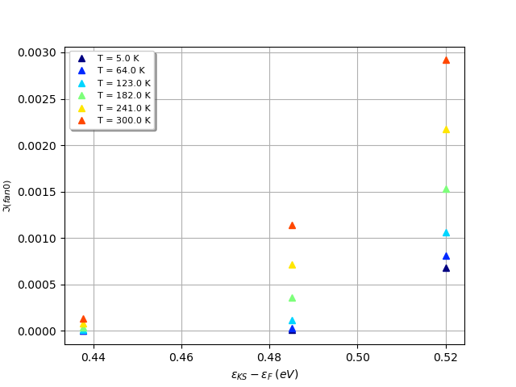
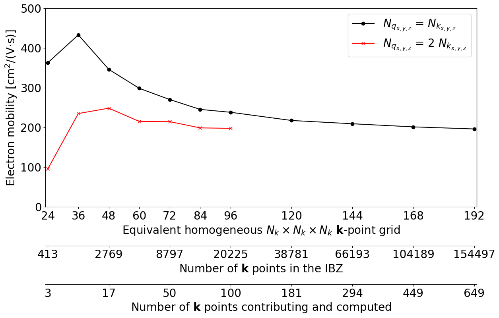

# Phonon-limited mobility in AlAs

This tutorial shows how to compute phonon-limited carrier mobilities in semiconductors within
the relaxation time approximation.
It is assumed the user has already completed the two tutorials [RF1](rf1) and [RF2](rf2),
and that he/she is familiar with the calculation of ground state and response properties, 
in particular phonons, Born effective charges and dielectric tensor.

This lesson should take about 1 hour. 

## Formalism

Before starting, it is worth summarizing the most important equations implemented in the code.
For a more detailed description of the ABINIT implementation, please consult [[cite:Brunin2020]].

Our goal is to find an approximated solution to the linearized 
Boltzmann transport equation (BTE) [[cite:Ashcroft1976]] within the relaxation time approximation.
If what follows, we will be working within the so-called
self-energy relaxation time approximation (SERTA) [[cite:Giustino2017]].
SERTA is more accurate that the constant relaxation time approximation (CRTA) as the 
microsopic e-ph scattering is now included leading to linewidths that depend on the band index and the $\kk$ wavevector.
Keep in mind, however, that also SERTA is an approximation and that a more rigorous approach would require 
the iterative solution of the BTE and/or the inclusion of many-body effects at different levels.
For a review of the different possible approaches see [[cite:Ponce2020]].

In the SERTA, the linewidth is given by 
the imaginary part of the electron-phonon (eph) self-energy evaluated at the KS energy.
In the $\eta \rightarrow 0^+$ limit, one obtains:

\begin{equation}
\begin{split}
    \lim_{\eta \rightarrow 0^+} & \Im\{\Sigma^\FM_{n\kk}(\enk)\} =
                \pi \sum_{m,\nu} \int_\BZ \frac{d\qq}{\Omega_\BZ} |\gkkp|^2\\
                & \times \left[ (n_\qnu + f_{m\kk+\qq})
                                \delta(\enk - \emkq  + \wqnu) \right.\\
                & \left. + (n_\qnu + 1 - f_{m\kk+\qq})
                                \delta(\enk - \emkq  - \wqnu ) \right]
\end{split}
\label{eq:imagfanks_selfen}
\end{equation}

that corresponds to the linewidth of the electron state $n\kk$ due to the scattering with phonons.
The electron lifetime $\tau_{n\mathbf{k}}$ is inversely proportional to the linewidth:

\begin{align}
\frac{1}{\tau_{n\kk}} =
    2 \lim_{\eta \rightarrow 0^+} \Im\{\Sigma^\FM_{n\kk}(\enk)\}.
\label{eq:fanlifetime}
\end{align}

Obviously this description does not take into account possibile contributions to the lifetime given by 
other scattering processe such as defects, ionized impurities in doped semiconductors, grain boundary scattering.
These effects may be relevant depending on the system and the temperature under investigation 
but they are not treated in this tutorial.

The generalized transport coefficients are given by [[cite:Madsen2018]]

\begin{equation}
    \begin{split}
    \mcL^{(m)}_{\alpha\beta} = 
    - \sum_n \int \frac{d\kk}{\Omega_\BZ} \vnka \vnkb\, \tau_{n\kk} & \\
    \times (\enk-\ef)^m 
    \left.\frac{\partial f}{\partial\varepsilon}\right|_{\enk}
    \label{eq:transport_lc}
    \end{split}
\end{equation}

where $\vnka$ is the $\alpha$-th Cartesian component of the matrix element $\vnk$ of the electron velocity operator. 

The generalized transport coefficients can be used to obtain different transport properties such as
the electrical conductivity, Peltier and Seebeck coefficients, and charge carrier contribution to the
thermal conductivity tensors [[cite:Madsen2018]]
The electrical conductivity tensor is given by

\begin{equation}
    \sigma_{\alpha\beta} =
    \frac{1}{\Omega} \mcL_{\alpha\beta}^{(0)} \label{eq:transport_sigma}
\end{equation}

and can be divided into hole and electron contributions

\begin{equation}
\sigma = n_e \mu_{e} + n_h \mu_{h} \label{eq:mobility}
\end{equation}

where $n_e$ and $n_h$ are the electron and hole concentrations in the conduction and valence bands respectively,
and $\mu_e$ and $\mu_h$ are the electron and hole mobilities, 
which can be obtained by selecting the conduction or valences states $n$ in Eq.~\eqref{eq:transport_lc}.

For electrons,

\begin{equation}
\begin{split}
    n_e = \sum_{n\in \text{CB}} \int \dfrac{d\kk}{\Omega_\BZ} f_{n\kk}, \\
    \mu_e = \dfrac{1}{n_e \Omega}\, \mcL_{n\in \text{CB}}^{(0)}
\end{split}
\end{equation}

where $n\in\text{CB}$ denotes states in the conduction bands. Similar expressions hold for holes.
At zero total carrier concentration, the Fermi level $\ef$ is located inside the band gap so that $n_e = n_h$.

A typical computation of mobilities requires different steps:

  * Ground state computation to obtain the DEN and the WFK files
  * DFPT calculation for a set of $\qq$-points in the IBZ associated to a homogeneous mesh
  * Merging of the partial DDB and POT1 files with *mrgddb* and *mrgdv*, respectively
  * Computation of the GS wavefunctions on a dense $\kk$-mesh
  * Interpolation of the e-ph scattering potentials and computation of the electron lifetimes
    for the relevant $\kk$-points contributing to the mobility
  * Computation of transport properties

These steps can be summarized by the following graph:


!!! important

    Note that all these capabilities are integrated directly in ABINIT.
    This implementation (henceforth refered to as the **EPH code**) significantly differs from the one available in ANADDB: 
    the anaddb version acts as a direct post-processing of the e-ph matrix elements computed in the DFPT part 
    whereas the EPH code interfaced with ABINIT computes the e-ph matrix elements on the fly using 
    the GS WFK and the DFPT potentials stored in the DVDB file.
    In a nutshell, the EPH code is more scalable and flexible as the $\qq$-sampling can be easily changed 
    at runtime while the anaddb implementation can easily support advanced features such as PAW as most of the 
    work is already done at the end of the DFPT calculation.
    For further information about the difference between the two approaches, see [[cite:Gonze2019]]

Note that all the results of the calculation are saved in netcdf format,
while the log and output files are used to report selected quantities, mainly for testing purposes.
Post-processing and visualisation tools are **not covered** in this tutorial.
Powerful tools based on python and matplotlib are provided by AbiPy.
See e.g. the README of [AbiPy](https://github.com/abinit/abipy)
and the [AbiPy tutorials](https://github.com/abinit/abitutorials).

[TUTORIAL_README]

## Ground state and phonons of fcc AlAs

*Before beginning, you might consider creating a different subdirectory to work in. 
Why not create Work_eph4mob ?*

The file *teph4mob_1.in* is the input file for the first step (GS + DFPT perturbations).
Copy it to the working directory with:

```sh
cd $ABI_TUTORESPFN/Input
mkdir Work_eph4mob
cd Work_eph4mob
cp ../teph4mob_1.in .
```



!!! important

    Since ABINIT v9, the use of the files file is deprecated. The input file will be used instead,
    with an additional input variable listing the pseudopotentials.
    You should edit *teph4mob_1.in* to include the pseudopotentials, see [[pseudos]].
    This variable gives the different paths to the pseudopotentials. 
    Use, for instance, 

    ```sh
    pseudos "../../../Psps_for_tests/13al.981214.fhi, ../../../Psps_for_tests/33as.pspnc"
    ```

    to specify the relative path to the pseudos if you are following the conventions employed in this tutorials.
    You may need to adapt the paths depending on your *$ABI_PSPDIR*.

This tutorial starts with the DFPT calculation for all the $\qq$-points in the IBZ. 
This step might be quite time-consuming so you can immediately start the job in background with:

```sh
abinit teph4mob_1.in > teph4mob_1.log 2> err &
```

The calculation is done for AlAs, the same crystalline material as in the first two DFPT tutorials.
Many input parameters are also quite similar. 
<!-- as the EPH code can use symmetries can be used to reduce the number of atomic 
perturbations. -->
For more details about this first step, please refer to the first and second tutorials on DFPT.

Note these additional important points.
Since AlAs is a **polar semiconductor**, we need to compute with DFPT the Born effective charges 
as well and the static dielectric tensor
These quantities are then used to treat the long-range (LR) part of the dynamical matrix in 
the Fourier interpolation of the phonon frequencies. 
We will see that these quantities are also needed in the Fourier interpolation of the DFPT potential.

Only the (partial) DDB and POT files produced at the end of the DFPT run
are needed to perform e-ph calculation.
The files containing the first order wavefunctions (*1WF*) due to an atomic perturbation are not needed.

## Merging the derivative databases and potentials

Once the DFPT calculation is completed, use *mrgddb* to merge the eight partial DDB files 
corresponding to datasets 3-10 of *teph4mob_1*.
These partial DDBs contain the dynamical matrices for the
8 $\qq$-points in the IBZ, as well as the dielectric tensor and the Born effective charges. 
Name the new DDB file *teph4mob_2_DDB*.

File *\$ABI_TUTORESPFN/Input/teph4mob_2.in* is an example of input file for *mrgddb*.



Copy the file in the *Work_eph4mob* directory, and run *mrgddb* using:

```sh
mrgddb < teph4mob_2.in
```

!!! tip

    Alternatively, one can specify the name of the output DDB and the list of DDB files 
    to be merged via command line arguments.
    This approach is quite handy especially if used in conjuction with shell globbing and the "star" syntax:

    ```sh
    mrgddb teph4mob_2_DDB teph4mob_1o_DS*_DDB
    ```

    Use **mrgddb --help** to access the documentation.

Now use the *mrgdv* tool to merge the 29 DFPT POT files corresponding to datasets 3-10 of *teph4mob_1*. 
Name the new file *teph4mob_3_DVDB*.

File *\$ABI_TUTORESPFN/Input/teph4mob_3.in* is an example of input file for *mrgdv*.



You can copy it in the *Work_eph4mob* directory, and then merge the files with:

```sh
mrgdv < teph4mob_3.in
```

!!! tip

    Alternatively, one can the command line. 

    ```sh
    mrgdv merge teph4mob_3_DVDB teph4mob_1o_DS*_POT*
    ```

    Use **mrgdv --help** to access the documentation.

We now have all the phonon-related files needed to compute the mobility.
The DDB will be used to Fourier interpolate the phonon frequencies on an **arbitrarily** dense $\qq$-mesh while
the DVDB will be used to Fourier interpolate the DFPT scattering potentials [[cite:Brunin2020]].
The only ingredient left is the WFK file with the GS wavefunctions on the dense $\kk$-mesh.

!!! important

    In real life, you should always compute the electronic band structure along a $\kk$-path 
    to have a qualitative understanding of the band dispersion, the position of the band edges, 
    the value of the band gaps.
    Note also that there are several parts of the EPH code in which it is assumed that no vibrational instability
    is present so you should always look at the phonon spectrum computed by the code.
    Don't expect to get meaningful results if imaginary phonon frequencies are present.

<!--
In principle, the code can deal with small instabilties for the acoustic modes around $\Gamma$ 
but this does not mean you should blindly trust your results.
-->


## Calculation of the dense WFK file

In order to compute transport properties, we need a $\kk$-mesh that is dense enough to 
sample the electron (hole) pockets.
<!--
to solve the Boltzmann
Transport Equation (BTE) in the SERTA on a relatively dense $\kk$-mesh to have enough wavevectors
inside the electron (hole) pockets.
You will compute the electron lifetimes and group velocities on this dense mesh. 
We will therefore need the wavefunctions on this dense mesh. 
-->
Note that in this tutorial, a single dense $\kk$-mesh will be used. 
However, the value for the mobility strongly depends on this
mesh and a convergence study should be performed by increasing the $\kk$-mesh density,
as well as the $\qq$-mesh used for the integration of the self-energy whose imaginary part
defines the electron lifetime.
This study is explained later and left to the user
but it should be clear even at this point that systems with small effective masses (e.g GaAs) will 
require denser $\kk$-meshes and will be more difficult to converge.

The computation of the dense WFK file is similar to a NSCF band structure computation.
The main difference is that we need wavefunctions on a $\kk$-mesh instead of a $\kk$-path
because these wavevectors will be used to evaluate integrals in the BZ.

The file *\$ABI_TUTORESPFN/Input/teph4mob_4.in* is an example of such computation.



It consists of two parts: the first one (dataset 1) computes the GS wavefunctions,
and the second one (datasets 2-3) computes the dense WFK that will be used to evaluate the mobility.
We also compute a denser WFK file that will be used with the double-grid method explained later.

We want to compute the mobility of electrons in the conduction band, therefore
we need to consider conduction bands in the computation of the WFK ([[nband]] = 8).

Copy the file in the *Work_eph4mob* directory, and run ABINIT:

```sh
abinit teph4mob_4.in > teph4mob_4.log 2> err &
```

*Note: do not forget to add the [[pseudos]] variable to this input file !*

## Calculation of the mobility

The computation of the mobility requires different convergence studies. 
We will explain them and their need in the following. 
Let us first explain the different parameters in a standard mobility computation.
The file *\$ABI_TUTORESPFN/Input/teph4mob_5.in* is an example of such computation.



We will need the WFK, the DDB and the DVDB files obtained previously.
One can specify the paths to these files using strings instead of integers:

```sh
getwfk_filepath "teph4mob_4o_DS2_WFK"
getddb_filepath "teph4mob_2_DDB"
getdvdb_filepath "teph4mob_3_DVDB"
```

Now copy the input file in the *Work_eph4mob* directory, and run the code with:

```sh
abinit teph4mob_5.in > teph4mob_5.log 2> err &
```

The job should take $\sim$15 seconds on a recent CPU. 

Let's discuss the meaning of the e-ph variables in more details.

[[optdriver]] 7 is required to activate the e-ph driver while
[[eph_task]] -4 tells ABINIT that we only need the imaginary part 
of the e-ph self-energy, which directly gives the electron lifetimes, see [[cite:Brunin2020]].

The dense $\kk$-mesh is specified by [[ngkpt]] = 24 24 24. 
It should be the same mesh as the one used for the dense WFK computation. 
[[occopt]] 3 is required to correctly compute the
location of the Fermi level, using the Fermi-Dirac occupation function.
The initial grid used for the phonons (used in the DFPT computation) was a 4x4x4. 
These are the values that we need to specify for [[ddb_ngqpt]].
The dense $\qq$-mesh onto which the scattering potentials are interpolated and the 
e-ph matrix elements are computed is given by [[eph_ngqpt_fine]]. 
Note that [[eph_ngqpt_fine]] and [[ngkpt]] should be commensurated.

In this tutorial, we will use the same dense $\kk$- and $\qq$-meshes.
As a rule of thumb, a $\qq$-mesh twice as dense in each direction as the $\kk$-mesh, 
is needed to achieve fast convergence of the integrals.
Possible exceptions are systems with very small effective masses (e.g. GaAs) in which 
a very dense $\kk$-sampling is needed to to sample the electron (hole) pocket.
In this case, using the same sampling for electrons and phonons may be enough.

We will use the tetrahedron integration method to obtain the lifetimes (integration
over the $\qq$-mesh). This allows to efficiently filter out the $\qq$-points that do not contribute
to the lifetimes. Indeed, only a small fraction of the $\qq$-points belonging to the $\qq$-mesh
ensure energy and momentum conservation for a given $\kk$-point. 
All the other $\qq$-points do not need to be considered and can be filtered out.
The use of the tetrahedron method is automatically activated when only 
the imaginary part is wanted. 
It is possible to change this behaviour by using [[eph_intmeth]] albeit not recommended.

The list of temperatures for which the mobility is computed is specified by [[tmesh]].
The carrier concentration is deduced from the number of extra electrons in the unit cell,
specified by [[eph_extrael]]. 
To obtain results that are representative of the intrinsic mobility, 
we suggest to use a very small number, for instance $10^{15}$ to $10^{18}$ electrons per cm$^3$. 

The [[sigma_erange]] variable describes the energy window, below the VBM and above the
CBM where the lifetimes will be computed.
Since the BTE contains a derivative of the Fermi-Dirac occupation function centered on the Fermi level,
it is possible to filter the $\kk$-points that will contribute to the mobility and compute
the lifetimes for these $\kk$-points only. Indeed, the value of the derivative decreases rapidly
as we go further from the Fermi level. Only the states close to the band edges contribute.
This additional filtering technique allows one to compute only a few percents of all the lifetimes.
This variable should be subject to a convergence study, as explained in the next section.

Different tricks have been implemented to accelerate the computation.
The use of single precision in the FFT routines allows one to decrease the computational cost
without losing precision. This trick is activated by setting [[mixprec]] = 1.
Another trick to decrease the memory requirement is to decrease [[boxcutmin]] 
to a value smaller than 2 e.g. 1.5 or the more aggressive 1.1.
An exact representation of densities/potentials in $\GG$-space is obtained with [[boxcutmin]] = 2, 
but we found that using a value of 1.1 does not change the result 
but allows one to decrease the cost of the calculation and the memory by a factor ~8.
These tricks **are not activated by default** because users are supposed to perform preliminary tests
to make sure the quality of the results is not affected by these options.

If performance is really of concern, you can also try to set [[eph_mrta]] to 0.
By default, the code computes transport lifetimes both with the SERTA and the MRTA.
The MRTA requires the computation of the group velocities at $\kk$ and $\kk+\qq$. 
This part is relatively fast yet it does not come for free.
If you know in advance that you don't need MRTA results, it is possible to gain some speedup 
by avoiding the computation of $v_{m\kq}$

We can now examine the log file in detail.
After the standard output of the input variables,
the code reports the different parameters for the long-range potentials: the Born effective charges,
the dielectric constant, and the quadrupolar tensor. 
Make sure to have all of them in order to have an
accurate interpolation of the scattering potentials, see discussion in [[cite:Brunin2020]].

*Note: for the moment, the computation of the quadrupole is not available in the public version, 
and you should have the following in the log file:*

```sh
Have dielectric tensor: yes
Have Born effective charges: yes
Have quadrupoles: no
```

The code then outputs different information. The first of them is the location of the Fermi level
that will be used to compute the lifetimes. You can check that it is far enough from the band
edges so that the computed mobility will be intrinsic.

```sh
Valence Maximum:   2.3564 (eV) at: [ 0.0000E+00,  0.0000E+00,  0.0000E+00]
Conduction minimum:   3.5254 (eV) at: [ 5.0000E-01,  5.0000E-01,  0.0000E+00]
Fermi level:  3.0878 (eV)
```

ABINIT also finds the list of $\kk$-point belonging to the dense mesh that 
are located within the energy window:

```sh
Found 3 k-points within erange:  0.000  0.150  (eV)
min(nbcalc_ks): 1 MAX(nbcalc_ks): 1
```

Over the initial 413 $\kk$-points in the IBZ, only 3 will be computed!
ABINIT then reads the WFK file and interpolates the potentials to compute the e-ph matrix elements.
The use of the tetrahedron method allows for the filtering of the $\qq-points:

```sh
qpoints_oracle: calculation of tau_nk will need: 39 q-points in the IBZ. (nqibz_eff / nqibz):   9.4 [%]
```

Again, this leads to a significant speed-up of the computation.
Once this is done, the code starts looping over the 3 $\kk$-points for which the lifetimes are needed.

```sh
Computing self-energy matrix elements for k-point: [ 4.5833E-01,  4.5833E-01,  0.0000E+00] [ 1 / 3 ]
```

You can find various information for each $\kk$-point, such as the number of $\qq$-points 
belonging to the little group of $\kk$ (called IBZ(k) in the code), 
the number of $\qq$-point contributing to the imaginary part, the wall-time each step takes etc.
Finally, we have the results for the lifetimes (TAU) in the *teph4mob_5.out* file:

```sh
K-point: [ 4.5833E-01,  4.5833E-01,  0.0000E+00], T=    5.0 [K]
    B    eKS    SE2(eKS)  TAU(eKS)  DeKS
	5   3.573    0.000  31553.2    0.000
```

Only the first temperature is printed in the output file, but all the information can be found in the SIGEPH.nc file.

!!! tip

    With |AbiPy|, one can easily have access to all the data of the computation. For instance, one can plot the
    electron linewidths:

    ```sh
    abiopen.py teph4mob_5o_SIGEPH.nc --expose
    ```



At the end of the *.out* and *.log* files, the mobility is printed:

```sh
Temperature [K]             e/h density [cm^-3]          e/h mobility [cm^2/Vs]
           5.00        0.23E+17        0.00E+00            0.00            0.00
          64.00        0.23E+17        0.00E+00           38.37            0.00
         123.00        0.23E+17        0.00E+00          345.31            0.00
         182.00        0.23E+17        0.00E+00          423.32            0.00
         241.00        0.23E+17        0.00E+00          418.67            0.00
         300.00        0.23E+17        0.00E+00          363.11            0.00
```

The temperature is first given then the electron and hole densities followed by electron and hole mobilities. 
In this computation, we consider only electrons, so the values for holes are zero. 
Note that the transport driver is automatically executed after the e-ph calculation.
You can also run only the transport driver, provided you already have the lifetimes in a SIGEPH.nc file, 
by setting [[eph_task]] = 7. 
This task can be performed only in serial and is very fast.

Now that you know how to obtain the mobility in a semiconductor for given k- and q-meshes, 
we can give more details about convergence and additional tricks that can be used 
to decrease the computational cost.

### Convergence w.r.t. the energy range

The first convergence study to be performed is to determine the energy range around the band edges 
to be used for the computation of $\tau_{n\kk}$.
We can do that by performing the same mobility computation (same k- and q-mesh)
for an increasing energy window specified by [[sigma_erange]].
<!--
once you have decided whether you are interested in electron or hole mobility.  
The code can compute both in a single run but this is not the recommended procedure as the $\qq$-point 
filtering is expected to be less efficient.
-->

The file *$\$ABI_TUTORESPFN/Input/teph4mob_6.in* is an example of such computation.



Copy the input file in the *Work_eph4mob* directory, and run ABINIT:

```sh
abinit teph4mob_6.in > teph4mob_6.log 2> err &
```

This run should take a few minutes.

We can now analyze the variation of the mobility with respect to [[sigma_erange]]. 
Once enough $\kk$-points are included, the mobility should not vary, and computing more $\kk$-points will
only increase the computation time.
Note that you should perform this convergence study with a $\kk$-mesh that is already dense enough to 
capture the band dispersion correctly. 
In this case, we are using a 24x24x24 mesh, which is not very dense for such computations. 
This means that, when increasing [[sigma_erange]], sometimes
no additional $\kk$-point is considered. 
It is the case here for the first 3 datasets (3 k-points), and the last two datasets (6 k-points). 
If a finer mesh was used, the number of $\kk$-points would have increased in a more monotonic way.

### Convergence w.r.t. the k- and q-meshes

Once the energy window has been set, we can start to converge the mobility with respect to the 
dense $\kk$- and $\qq$-meshes. 
The previous computations used 24x24x24 meshes. This is far from convergence.
In silicon, for instance, a 45x45x45 $\kk$-mesh and 90x90x90 $\qq$-mesh are needed 
to reach convergence within 5%. 

In order to compute the mobility with a $\qq$-mesh twice as dense as the $\kk$-mesh, there are two possibilities. 
Let us take the previous example of silicon.

  * Run a computation with [[ngkpt]] = 90 90 90, [[eph_ngqpt_fine]] = 90 90 90, and [[sigma_ngkpt]] = 45 45 45.
    Using [[sigma_ngkpt]] will select the $\kk$-points belonging to the 45x45x45 mesh, but each lifetime will be computed
    with a 90x90x90 q-mesh.

  * Run a computation with [[ngkpt]] = 90 90 90, [[eph_ngqpt_fine]] = 90 90 90 and [[sigma_ngkpt]] = 90 90 90.
    In this way, you have the mobility with 90x90x90 $\kk$- and $\qq$-meshes. You can then run again the transport driver only,
    by setting [[eph_task]] = 7, and setting [[transport_ngkpt]] = 45 45 45. This will downsample the $\kk$-mesh used
    in the computation of the mobility. This second option has the advantage that it delivers two mobilities 
    (useful for convergence studies), but it requires more computational time.

You can run again the previous input files by densifying the different meshes.
For the densest grids, you might need to run with multiple MPI processes.
You should obtain something like this, for T = 300 K:



Note that in order to get sensible results, one should use a denser DFPT $\qq$-mesh (around 9x9x9), 
and a larger energy cutoff for the planewave basis set ([[ecut]]). 
The inputs of this tutorial have been tuned so that the computations are quite fast,
but they are quite far from convergence. 
In real life, you should perform convergence studies to find suitable parameters.

### Double-grid technique

Another possibility to improve the results without increasing the computation time significantly 
is the double-grid technique.
In this case, a coarse sampling is used for the $\kk$-mesh and the $\qq$-mesh for the e-ph matrix elements,
but a finer mesh is used for the phonon absorption-emission terms. 
This technique allows one to better capture these processes, while computing the matrix elements on a coarser mesh. 
The efficiency of this method depends
on the polar divergence of the matrix elements: if this divergence is very difficult to capture numerically,
the coarse $\qq$-mesh for the e-ph matrix elements will have to be dense.

The double-grid technique requires a second WFK file, containing the KS eigenvalues on the dense mesh. 
You can specify the path to the dense WFK file using [[getwfkfine_filepath]]:

```sh
getwfkfine_filepath "teph4mob_4o_DS3_WFK"
```

The file *$\$ABI_TUTORESPFN/Input/teph4mob_7.in* is an example of such computation.



Copy the input file in the *Work_eph4mob* directory, and run ABINIT:

```sh
abinit teph4mob_7.in > teph4mob_7.log 2> err &
```

In the log file, you will now find information about the double-grid method:

```sh
coarse:                24          24          24
dense:                 48          48          48
```

The mobility obtained, at 300 K, is 158.01 cm$^2$/V/s. 
Using a 48x48x48 $\qq$-mesh for the matrix elements as well would give 96.09. 
The result is indeed improved, since using a 24x24x24 mesh for everything gives 363.11. 
You can also use a denser fine mesh, but always a multiple of the initial coarse mesh 
(in this case, 72x72x72, 96x96x96, etc). 
However, we found that there is very little use to go beyond a mesh three times as dense as the coarse one.
Using a 72x72x72 fine mesh for the energies gives a mobility of 149.87 cm$^2$/V/s,
and a 96x96x96 mesh leads to 146.24 cm$^2$/V/s: the improvement is indeed rather limited.

### On the importance of the initial DFPT mesh

At this point it is worth commenting about the importance of the initial DFPT $\qq$-mesh.
The Fourier interpolation implicitly assumes that the signal in $\RR$-space decays quickly hence
the quality of the *interpolated* phonon frequencies and of the *interpolated* DFPT potentials, 
between the ab-initio points depends on the spacing of the initial $\qq$-mesh that 
in turns defines the size of the Born-von-Karman supercell.
In semiconductors the atomic displacement induces dynamical dipoles and quadrupoles at the level of the density 
that will generate long-range scattering potentials.
These potentials affect the behaviour of the e-ph matrix elements for $\qq \rightarrow 0$ and the 
$\qq$-mesh must be dense enough to capture the full strenght of the coupling.
A more detailed discussion can be found in [[cite:Brunin2020]], [[cite:Verdi2015]] and [[cite:Sjakste2015]].

From a more practical point of view, this implies that one should always monitor the convergence of the
physical properties with respect to the initial DFPT $\qq$-mesh.
The LR model implemented in ABINIT facilitates the convergence as the non-analytic behaviour for
$\qq \rightarrow 0$ is properly described yet the Fourier interpolation can introduce oscillations
between the *ab-initio* $\qq$-points and these oscillations may affect the quality of the physical results.

## Phonon band structure

TODO: Discuss [[dipdip]], [[asr]], [[chneut]]

## Additional tricks

As these files are quite larger and the overall space on disk scales as nq * 3 * natom, we suggest
to avoid the output of the DFPT wavefunctions by using [[prtwf]] = -1
In this case, the DFPT code writens the 1WF only if the DFPT SCF cycle is not converged so that one can restart
from it if needed.

### MPI parallelism and memory requirements

There are five different MPI levels that can be used to distribute the workload 
and the most memory-demanding data structures.
By default, the code tries to reach some compromise between memory requirements and time to solution. 
by activating the parallelism over $\qq$-points if no other input is provided from the user.
You can however specify manually the MPI distribution across the five different levels
by using [[eph_np_pqbks]], a list of 5 integers. 
The product of these five numbers **must be equal** to the total number of MPI processes.
The first number gives the number of processes for the parallelization over perturbations. 
The allowed value range between 1 and 3 x [[natom]], and should be a divisor 
of 3 x [[natom]] to distribute the work equally.
The higher this number, the lower the memory requirements at the price of increased MPI communication.
The second number determines the parallelization over the $\qq$-points in the IBZ.
This parallelization level allows one to decrease both the computational time as well as memory although
it's not always possible to distribute the load equally among the processes.
The parallelization over bands is usually not relevant for mobility computations 
as only a few states close to the VBM or CBM are considered. 
It is however useful when the real part of the self-energy is needed.
The MPI parallelism over $\kk$-points and spins is very efficient
but it requires HDF5 with MPI-IO support and memory does not scale. 
Use these additional levels if the memory requirements are under control 
and you want to boost the calculation. 

### How to reduce memory requirements

As mentioned above, the memory should scale with the number of MPI processors used for the q-point and
the perturbation level.
However, there might be tricky systems in which you start to experience memory shortage that 
prevents you from running with several MPI processes.
This problems should show up for very dense k/q meshes.
As a rule of thumb, calculations with meshes denser than e.g 200x200x200 are memory demanding
and become much slower because several algorithms and tables related to the BZ sampling will start to dominate.
<!--
We stress again that decreasing [[boxcutmin]] is very beneficial and this the first thing one should try.
Remember however that using values smaller than 1.1 is risky.
If decreasing [[boxcutmin]] does not solve the problem, one can activate additional tricks.
-->

The code uses an internal cache to store the DFPT potentials in the dense IBZ.
The size of the cache is defined by [[dvdb_qcache_mb]] whose default value is 1024 Mb.
The size of this buffer decreases with the number of MPI processese used for the qpt-level.
You can save some space by decreasing this value at the price of a global slow down of the calculation.

OpemMP may be beneficial for large calculations.

The code allocates a relatively small buffer to store the Bloch states involved in transport but unfortunately
the $\kk$-points are not easy to distribute with MPI.
To reduce the size of this part, one may opt for an internal buffer in single precision. 
This option is enabled by using `enable_gw_dpc="no"` at configure time (default value).

If these tricks do not solve your problem, consider using OpenMP threads.
The code is not optimized for OpenMP but a few threads can be useful to avoid replicating memory at the MPI level.
As a rule of thumb 2-4 OpenMP threads should be OK provided you link with threaded FFT and BLAS libraries.

Last but not least, datasets are bad, large arrays allocated for k-points and the size depends on ndtset.


### In-place restart

All the results of the calculation are stored in a single SIGEPH.nc file
for all the $\kk$-points (and spins) considered.
The list of $\kk$-points is initialized at the beginning of the calculation and an internal table 
in the netcdf file stores the status of each k-point (whether it has been computed or not).
This means that calculations that get killed by the resource manager due to time limit can use 
the SIGEPH file to perform an automatic in-place restart.
Just set [[eph_restart]] to 1 in the input file and rerun the job.

### How to compute only the k-points close to the band edges

As we have already seen in the previous sections, a relatively small number of $\kk$-points 
close to the band edges is usually sufficient to converge mobilities.
Yet, in the NSCF run, we computed a WFK file for all the $\kk$-points of the dense IBZ 
hence we are spending a lot of resources and disk space to compute and store states that are not 
needed to compute phonon-induced mobilities.

In principle, it is possible to restrict the NSCF calculation to the relevant $\kk$-points 
provided we have a cheap and good-enough method to predict whether the wavevector 
is inside the energy window without solving the KS eigevalue problem exactly.
For example, we can use the star-function interpolation by Shankland-Koelling-Wood (SKW) 
[[cite:Shankland1971]], [[cite:Euwema1969]], [[cite:Koelling1986]], [[cite:Madsen2006]], [[cite:Madsen2018]]
which requires as input a set of eigenvalues in the IBZ and a single parameter defining the basis set for the interpolation.
There are several technical problems that should be addressed at the level of the internal implementation but 
the idea is relatively simple and goes as follows:

1. Compute the KS eigenvalues on a relatively coarse $\kk$-mesh in the IBZ
2. Use this *coarse* WFK file to interpolate the eigenvalues on a much denser $\kk$-mesh specified by the user.
3. Find the wavevectors of the dense mesh inside an energy window specified by the user.
   Store the list of $\kk$-points in a external file.
4. Use this file to run a NSCF calculation only for these $\kk$-points.
   At the end of the NSCF run, ABINIT will produce a **customized** WFK file on the dense mesh that 
   can be used by the EPH code to compute mobilite with an energy window 
   that shall not be greater than the one specifed in step 3.

An example will help clarify. 
Suppose we have computed a WKF file with a NSCF run using a 16x16x16 $\kk$-mesh (let's call it *161616_WFK*)
and we want to compute mobilites with the much denser 64x64x64 $\kk$-mesh.
In this case, one ca use [[optdriver]] = 8 with [[wfk_task]] = "wfk_kpts_erange" to read
the WFK file specified by [[getwfk_filepath]], find the wavevectors belonging to the [[sigma_ngkpt]] $\kk$-mesh
inside the energy window defined by [[sigma_erange]] and produce a *KERANGE* file.
The parameters defining the SKW interpolation are specified by [[einterp]].
A typical input file for this step will look like:

```sh
optdriver 8
wfk_task "wfk_kpts_erange"
getwfk_filepath "161616_WFK"

# Define fine k-mesh for interpolation
sigma_ngkpt   64 64 64 
sigma_nshiftk 1
sigma_shiftk  0 0 0

sigma_erange 0.0 0.2 eV   # Select kpts in fine mesh within this energy window.
einterp 1 5 0 0           # Parameters for star-function interpolation
```

This step produces a *KERANGE.nc* file (let's call it *out_KERANGE*) that can be used 
via the [[getkerange_filepath]] variable as a starting point to perfom a NSCF run with the following variables:

```sh
getkerange_filepath "out_KERANGE.nc"
getden_filepath "161616_DEN"    
getwfk_filepath "161616_WFK"    # Init GS wavefunctions from this file (optional)
iscf  -2
kptopt 0                        # Important

ngkpt    64 64 64
nshiftk  1
shiftk   0.0 0.0 0.0
```

This calculation will produce a *customized* Fortran WFK file with [[ngkpt]] = 64 64 64 in which 
only the states listed in the KERANGE file have been computed.
This WKF file can then be used in the EPH code to compute mobilites.

For further examples see [[test:v9_57]], and [[test:v9_61]].
Also note that the two tests cannot be executed in multidataset mode with a single input file.

Note, however, that the quality of the interpolation depends on the initial coarse $\kk$-mesh.
So we recommended, to look at the interpolant.
It is also a good idea to use an energy window that is larger than the one employed for the mobility.
as well as the position of the band edges 

<!--
#############################################
# Dataset 7: 
# Use GS WFK file on (4,4,4) k-mesh to interpolate band energies on a 8x8x8 k-mesh (sigma_ngkpt)
# with star-functions. Find pockets specified by sigma_erange and
# produce KERANGE netcdf file with info on the k-points in the pockets
#############################################

In the SKW method, the single-particle energies are expressed in terms of the (symmetrized) Fourier sum

\begin{equation}
\label{eq:skw_expansion}
  \enk = \sum_\RR c_{n\RR} S_\RR(\kk).
\end{equation}

where the star function, $S_\RR(\kk)$, is defined by 

\begin{equation}
\label{eq:star_function}
S_\RR(\kk) = \dfrac{1}{N}\sum_\mcO e^{i\kk\cdot \mcO \RR},
\end{equation}

$\RR$ is a lattice vector and the sum is over the $N$ rotations of the crystallographic point group.
By construction, the expansion in Eq.~\eqref{eq:skw_expansion} fulfills the basic symmetry properties 
of the single-particle energies:

\begin{align}
\label{eq:eigen_properties}
  \enk = \epsilon_{n\kG}, \\
  \enk = \epsilon_{n\mcO\kk}.
\end{align}

In principle, the expansion coefficients in Eq.~\eqref{eq:skw_expansion} can be uniquely determined 
by using a number of star functions equal to the number of {\it ab initio} $\kk$-points
but this usually leads to sharp oscillations between the input eigenvalues.
To avoid this problem, one uses more star functions than {\it ab initio} $\kk$-points and constrains the
fit so that the interpolant function passes through the input energies and a roughness function is minimized.

This {\bf einterp} variable activates the interpolation of the electronic eigenvalues. 
The user can specify the number of star functions per 
{\it ab initio} $\kk$-point and an optional Fourier
filtering as proposed in~\cite{Uehara2000}. 
%In this case, rcut is given by einterp(2) * Rmax where Rmax is the maximum length of the lattice vectors included in the star expansion
 {\bf einterp} can be used to interpolate KS eigenvalues at 
 the end of the ground state calculation (\href{https://docs.abinit.org/tests/v8/Input/t04.in}{{\texttt{v8\#42}}}) 
 or to interpolate GW energies (\href{https://docs.abinit.org/tests/libxc/Input/t42.in}{{\texttt{libxc\#42}}}) when {\bf optdriver} = 4. 
For GW band structures, however, we found that interpolating the GW corrections instead of the quasi-particle energies helps improve the fit~\cite{VietAhn2019}.
In this case, one can employ the Python interface provided by \ABIPY to 
automate the procedure.
An example can be found in this 
\href{https://nbviewer.jupyter.org/github/abinit/abitutorials/blob/master/abitutorials/g0w0/lesson_g0w0.ipynb}{jupyter notebook}.
%The $\kk$-path can be specified through the {\bf kptbounds} and {\bf nkpath} input variables. 
%einterp consists of 4 entries. The first element specificies the interpolation method.
%
%1 → Star-function interpolation (Shankland-Koelling-Wood Fourier interpolation scheme, see [Pickett1988]
%2 → B-spline interpolation.
%The meaning of the other entries depend on the interpolation technique selected. In the case of star-function interpolation:
%
%einterp(2): Number of star-functions per {\it ab initio} k-point
%einterp(3): If non-zero, activate Fourier filtering according to Eq 9 of [Uehara2000]. In this case, rcut is given by einterp(2) * Rmax where Rmax is the maximum length of the lattice vectors included in the star expansion
%einterp(4): Used if einterp(2) /= 0. It defines rsigma in Eq 9

%It is worth noting that the QP energies must fulfill the symmetry properties of the point group of the crystal:
%and
%where G is a reciprocal lattice vector and is an operation of the point group.
%Therefore it is possible to employ the star-function interpolation by Shankland, Koelling and Wood in the improved version proposed by Pickett to fit the {\it ab initio} results. This interpolation technique, by construction, passes through the initial points and satisfies the basic symmetry property of the band energies.
%It should be stressed, however, that this Fourier-based method can have problems in the presence of band crossings that may cause unphysical oscillations between the {\it ab initio} points. To reduce this spurious effect, we prefer to interpolate the QP corrections instead of the QP energies. The corrections, indeed, are usually smoother in k-space and the resulting fit is more stable.
-->

### Transport calculation from SIGEPH.nc 

The routine that computes carrier mobilites is automatically invoked when [[eph_task]] = -4 is used 
and a *TRANSPORT.nc* file with the final results is produced.
There are however cases in which one would like to compute mobilities from an already existing 
SIGEPH.nc file without performing a full self-energy calculation.
In this case, one can use [[eph_task]] = 7 and specify the name of the SIGEPH.nc file with [[getsigeph_filepath]].
The advanced input variable [[transport_ngkpt]] can be use to downsample the $\kk$-mesh used to evalute the mobility integral.
