# Self-trapped polarons & Variational Polaron Equations

This tutorial provides a guide on using the Variational Polaron Equations framework to compute
self-trapped polarons in semiconductors and insulators.

We start with a brief overview of the self-trapped polaron formation problem, followed by an
introducion to the theoretical formalism of the Variational Polaron Equations.
Then we demonstrate the practical aspects of computation of various polaronc properties using
small hole and large electron polarons in LiF as examples.
We also showcase the capabilities of |AbiPy| to post-process the results and perform typical
convergence studies.

It is assumed the user has already completed the two tutorials [RF1](/tutorial/rf1) and [RF2](/tutorial/rf2),
and that they are familiar with the calculation of ground state (GS) and response properties
in particular phonons, Born effective charges and the high-frequency dielectric tensor.
The user should have read the [introduction tutorial for the EPH code](/tutorial/eph_intro)
before running these examples.

This lesson should take about 2 hours.

## Formalism

### **Self-trapped polarons**

In many condensed matter systems, interaction with phonons leads to the formation of **polarons**,
when a particle couples to the lattice vibrations of a system.
Instead of a free particle, it becomes a **quasiparitcle** with altered physical properties -- a polaron.
In general, this notion applies to any particle irrespective of its type and statistics: electrons, holes,
excitions, magnons and so on.
In the present formalism, we treat only **electron** and **hole polarons**, which formation is mediated by the **electron-phonon coupling**.

Depending on the strength of the electron-phonon coupling, one can distinguish different regimes.
In the weak-coupling limit, a charge carrier is coherent with phonon oscillations, dragging the associated phonon cloud.
This primarily leads to the band renormalization, and the physics can be captured by the [ZPR calculations](/tutorial/eph4zpr).
In the limit of strong-coupling, the picture is different: a carrier is trapped in the potential well, created by lattice deformation
-- a phenomena called self-trapping or autolocalization.
This leads to the occurrence of a localized polaronic state inside the bandgap, and may switch the transport regime from a band-like to hopping transport.
The intermediate regime between the strong-coupling and the weak-coupling limit is the most challenging to address and requires advanced techniques.
In the present formalism, we treat only the **strong-coupling** regime of polaron formation, i.e. **self-trapped polarons**.

The probability of a self-trapped electron or hole polaron formation can be described by its **binding energy**:

\begin{equation}
\label{eq:epol}
    E_\mathrm{pol} = E\left( N \pm 1, \Delta \mathbf{\tau} \right) - E\left( N \pm 1, \Delta \mathbf{\tau} \equiv 0 \right),
\end{equation}

which is the difference of total energy of a charged system with $N \pm 1$ electrons in the **distorted** polaronic geometry and the pristine one.
Here, the lattice distortion is denoted by $\Delta \tau$ -- collective atomic displacements from their equilibrium positions.
A stable polaronic configuration corresponds to $E_\mathrm{pol} < 0$.

Schematically, it can be illustrated by the following configurational diagram for total energy of a system
with $N\pm1$ electrons as a function of lattice distortion.

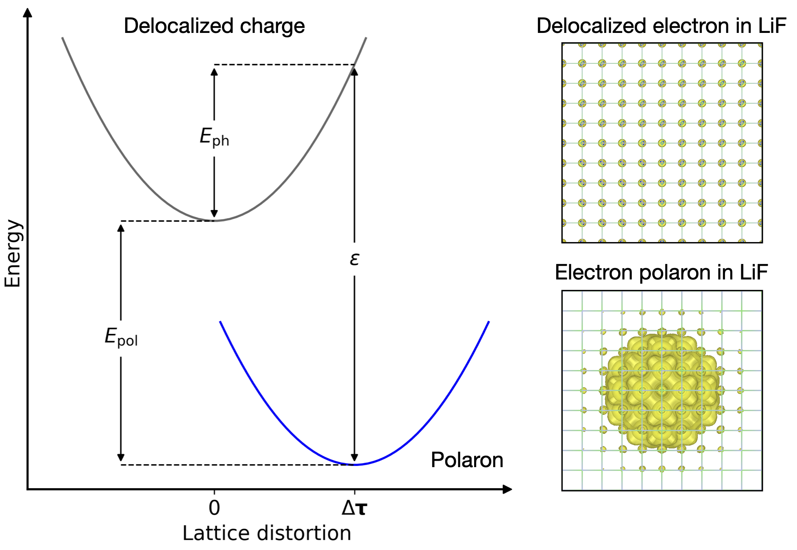

This figure also contains some foreshadowing as it uses LiF to illustrate both configurations
of an extra electron in the system: delocalized and polaronic one.
By the end of the tutorial, the user will learn how to generate such figures themselves.

From the configurational diagram, it is seen that $E_\mathrm{pol}$ can be decomposed into two contributions:
the **phonon energy** $E_\mathrm{ph}$ arising purely from the lattice distortion, and the **charge localization energy** $\varepsilon_\mathrm{loc}$,
which accounts for both electronic contribution and electron-phonon coupling.
Physically, the latter term corresponds to the energy of the localized polaronic state inside the bandgap, computed from the VBM/CBM in case of hole/electron polaron.

During the tutorial, the aforementioned quantities and other properties, characterizing the polaron formation, are computed within a Variational Polaron Equations, implemented in ABINIT.

### **Variational Polaron Equations**

In DFT, the common approach to the polaronic problem is a direct geometry relaxation of a charged system with a compensating jellium background.
This approach is powerful and straightforward, but requires supercell calculations,
making it prohibitive for polarons with large spatial extension.
Also, standard DFT favors delocalization due the self-interaction, and self-interaction corrections
and special approaches have to be used to localize polarons [[cite:Falletta2022]].

However, it possible to avoid the need of charged supercell relaxation by reformulating the problem of polaron formation in reciprocal space.
This formalism was presented by Sio and coworkers in 2019 [[cite:Sio2019]], and required the solution of
an effective polaronic Hamiltionian, parametrized from first-principles calculations.
For the underlying theory behind this formalism and derivations, the user may be interested to consult the original paper.

We take on the approach presented by Sio and coworkers, albeit we reformulate it into a **variational** form.
We refer to this formalism as **Variational Polaron Equations** or, simply, **VarPEq**.
The derivations of our formalism and relevant discussions can be found in [[cite:Vasilchenko2022]].
In this approach, we utilize a variational expression for the polaron binding energy, enabling the application of efficient gradient-based optimization techniques.
Moreover, as we demonstrate in the tutorial, explicit treatment of the gradient allows us to probe systems for multiple degenerate polaronic states.

!!! important

    In what follows, we assume uniform, equal and $\Gamma$-centred $\kk$- and $\qq$-meshes
    for electron and phonon subspace.
    However, in principle, it is enough for these meshes to be commensurate.

The polaron formation is modeled in reciprocal space, where the BvK supercell is represented by the corresponding
$\kk$-sampling of the Brillouin Zone, i.e. a $2\times2\times2$ $\kk$-mesh corresponds to a $2\times2\times2$ supercell.
The polaron binding energy in a supercell of size $N_p$ is given by the variational expression

\begin{equation}
\label{eq:varpeq}
    E_\mathrm{pol} \left( \boldsymbol{A}, \boldsymbol{B}  \right)
    = E_\mathrm{el} \left( \boldsymbol{A} \right)
    + E_\mathrm{ph} \left( \boldsymbol{B}  \right)
    + E_\mathrm{el\text{-}ph} \left( \boldsymbol{A}, \boldsymbol{B}  \right),
\end{equation}

where

\begin{equation}
\label{eq:varpeq_el}
    E_\mathrm{el} \left( \boldsymbol{A} \right)
    = \frac{1}{N_p} \sum_{n\mathbf{k}}
    | A_{n\mathbf{k}} |^2
    \left( \varepsilon_{n\mathbf{k}} -
    \varepsilon_\mathrm{loc} \right)
    + \varepsilon_\mathrm{loc},
\end{equation}

\begin{equation}
\label{eq:varpeq_ph}
    E_\mathrm{ph} \left( \boldsymbol{B} \right)
    = \frac{1}{N_p} \sum_{\mathbf{q}\nu}
    | B_{\mathbf{q}\nu} |^2
    \omega_{\mathbf{q}\nu},
\end{equation}

\begin{equation}
\label{eq:varpeq_elph}
    E_\mathrm{el-ph} \left( \boldsymbol{A}, \boldsymbol{B} \right)
    = -\frac{1}{N_p^2} \sum_{\substack{mn\nu \\ \mathbf{kq}}}
    A^\ast_{m\mathbf{k+q}}
    B^\ast_{\mathbf{q}\nu} g_{mn\nu}(\mathbf{k, q})
    A_{n\mathbf{k}} + \mathrm{(c.c)}
\end{equation}

are the electronic, phonon and electron-phonon contribution to the binding energy, respectively.

In Eqs. (\ref{eq:varpeq}-\ref{eq:varpeq_elph}), $\boldsymbol{A} \equiv \left\{ A_{n\mathbf{k}} \right\}$ and $\boldsymbol{B} \equiv \left\{ B_{\mathbf{q}\nu} \right\}$
are the variational coefficients, defining the polaron wavefunction $\phi(\mathbf{r})$ (charge localization) and lattice distortion $\Delta \tau_{\kappa \alpha p}$ as

\begin{equation}
\label{eq:polaron_phi}
    \phi (\mathbf{r})
    =
    \frac{1}{\sqrt{N_p}}
    \sum_{n\mathbf{k}} A_{n\mathbf{k}} \psi_{n\mathbf{k}} (\mathbf{r}),
\end{equation}

and

\begin{equation}
\label{eq:polaron_tau}
    \Delta \tau_{\kappa \alpha p} = - \frac{2}{N_p} \sum_{\mathbf{q}\nu}
    B^\ast_{\mathbf{q}\nu} \sqrt{ \dfrac{1}{2M_{\kappa}\omega_{\mathbf{q}\nu}} } e_{\kappa \alpha, \nu}(\mathbf{q}) e^{i\mathbf{q}\cdot\mathbf{R}_p}.
\end{equation}

Charge localization $\varepsilon_\mathrm{loc}$ is represented by the Lagrange multiplier that takes into account the normalization of the polaron wavefunction

\begin{equation}
    \sum_{n\mathbf{k}} |A_{n\mathbf{k}}|^2 = N_p
\end{equation}

Eqs. (\ref{eq:varpeq}-\ref{eq:polaron_tau}) depend on the input parameters, that can be computed within a unit cell of a system:

* electronic bands $\varepsilon_{n\mathbf{k}}$ and Kohn-Sham wavefunctions $\psi_{n\mathbf{k}}$;
* phonon dispersion $\omega_{\mathbf{q}\nu}$ and eigenmodes $e_{\kappa \alpha, \nu}(\mathbf{q})$;
* electron-phonon matrix elements $g_{mn\nu}(\mathbf{k, q})$.

The variational expression can be optimized self-consistently.
At any charge distribution $\boldsymbol{A}$, one can calculate the optimal deformation potential as

\begin{equation} \label{eq:phgrad}
    B_{\mathbf{q}\nu} \left( \boldsymbol{A} \right)
    = \frac{1}{N_p}\sum_{mn\mathbf{k}}
    A^\ast_{m\mathbf{k+q}}
    \frac{g_{mn\nu}(\mathbf{k, q})}{\omega_{\mathbf{q}\nu}}
    A_{n\mathbf{k}}.
\end{equation}

Then, the optimal charge localization is given by the Lagrange multiplier

\begin{equation}
    \varepsilon_{\rm loc}
    \left( \boldsymbol{A}, \boldsymbol{B} \right)
    = \frac{1}{N_p}
    \sum_{n\mathbf{k}} | A_{n\mathbf{k}} |^2 \varepsilon_{n\mathbf{k}}
    - \frac{1}{N_p^2} \sum_{\substack{mn\nu \\ \mathbf{kq}}}
    \left(
    A^*_{m\mathbf{k+q}}
    B^*_{\mathbf{q}\nu} g_{mn\nu}(\mathbf{k}, \mathbf{q})
    A_{n\mathbf{k}} + \text{c.c.}
    \right).
\end{equation}

The gradient of $E_\mathrm{pol}$ with respect to the electronic degrees of freedom is then obtained as

\begin{equation}
\begin{split}
    D_{n\mathbf{k}} \bigl( \boldsymbol{A}, \boldsymbol{B}, \varepsilon_{\rm loc} \bigr)
    = & \frac{2}{N_p} A_{n\mathbf{k}}
    \left( \varepsilon_{n\mathbf{k}} - \varepsilon_{\rm loc} \right) \\
    & - \frac{2}{N_p^2}
    \sum_{m\nu\mathbf{q}}
    A_{m\mathbf{k-q}}
    B^\ast_{\mathbf{q}\nu} g_{nm\nu}(\mathbf{k-q}, \mathbf{q})
    +
    A_{m\mathbf{k+q}}
    B_{\mathbf{q}\nu} g^\ast_{mn\nu}(\mathbf{k}, \mathbf{q}).
\end{split}
\label{eq:elgrad}
\end{equation}

From this gradient, a new charge distribution $\boldsymbol{A}$ can be determined.
Eqs. (\ref{eq:phgrad}-\ref{eq:elgrad}) constitute the building blocks of any gradient-based algorithm for the binding energy optimization.
In ABINIT, we employ the preconditioned conjugate gradient algorithm [[cite:Payne1992]].
After the variational expression is minimized, the optimal $\boldsymbol{A}$ and $\boldsymbol{B}$ coefficients are determined and
the polaron in real space can be reconstructed via Eqs. (\ref{eq:polaron_phi}),(\ref{eq:polaron_tau}).
Schematically, the optimization process is described in the following chart:

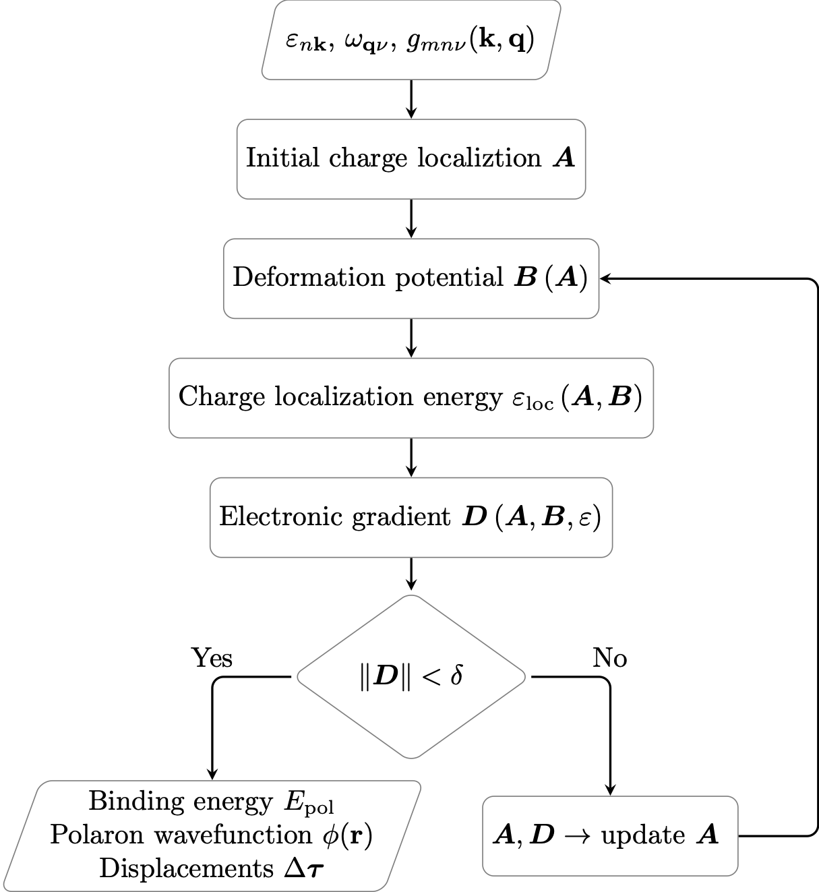{: style="width:600px"}


## Typical workflow for self-trapped polaron calculations


As the description of the VarPEq formalism suggests, prior to the actual polaron calculations,
one needs to obtain the required input parameters,
describing the electronic and phonon subspaces, and the electron-phonon coupling.

A typical workflow for self-trapped polaron calculations involves the following steps
(see the [introductory e-ph tutorial](/tutorial/eph_intro)):

1. **GS calculation** to obtain the WFK and the DEN file.
   The $\kk$-mesh should be dense enough to converge both electronic and vibrational properties.

2. **DFPT calculations** for all the IBZ $\qq$-points corresponding to the *ab-initio* [[ddb_ngqpt]] mesh
   that will be used to perform the Fourier interpolation of the dynamical matrix and of the DFPT potentials.
   In the simplest case, one uses a $\qq$-mesh that is equal to the GS $\kk$-mesh (sub-meshes are also fine)
   and the DFPT calculations can directly start from the WFK produced in step #1.
   Remember to compute $\bm{\epsilon}^{\infty}$, $\bm{Z}^*$ (polar materials) and the dynamical quadrupoles
   $\bm{Q}^*$ as these quantities are needed for an accurate interpolation of phonon frequencies and DFPT potentials.

3. **NSCF computation** of a WFK file on a much denser $\kk$-mesh representing a BvK supercell hosting a polaron.
   The NSCF run uses the DEN file produced in step #1.
   Compute **at least one** unnocupied electronic state, so later on the code can check if a system has a gap.

4. **Merge the partial DDB and POT files** with *mrgddb* and *mrgdv*, respectively.

5. **Compute a GSTORE file** with [[eph_task]] 11.
   This step performs the interpolation of phonon frequencies and DFPT potentials and computes the electron-phonon
   matrix elements $g_{mn\nu}(\mathbf{k,q})$ on an arbitrary [[eph_ngqpt_fine]] $\mathbf{q}$-mesh for a set
   of bands [[gstore_brange]] or within an energy window [[gstore_erange]] near the band edge.
   The resulting GSTORE.nc **is mandatory** for VarPEq calculations.

!!! warning

    GSTORE computation requires ABINIT to be configured with support for parallel I/O for HDF5 and NetCDF libraries.
    See, for example, the corresponding section in the installation [tutorial](/tutorial/abinit_build)

    To verify, whether the installed libraries and ABINIT support the parallel I/O, try issuing

    ```sh
        h5pcc -showconfig | grep "Parallel HDF5"
        nc-config --has-parallel
        abinit -b | grep "Parallel I/O"
    ```

    If any of these commands gives you a negative prompt, your installation may not work properly.


6. Start from the WFK, DDB and GSTORE.nc files produced in steps #3-5
   to perform **VarPEq calculations** with [[eph_task]] 13.

7. **Visualize polaron wavefuction and displacements** using the VPQ.nc file produced in step #6
   and [[eph_task]] -13.


## Getting started

[TUTORIAL_README]

Before beginning, you might consider to work in a different subdirectory as for the other tutorials.
Why not create Work_eph4vpq in $ABI_TESTS/tutorespfn/Input?

```sh
cd $ABI_TESTS/tutorespfn/Input
mkdir Work_eph4vpq
cd Work_eph4vpq
```

In this tutorial, we prefer to focus on the use of the EPH code hence
we will be using **precomputed** DDB and POT files to bypass the DFPT part.
We also provide a DEN.nc file to initialize the NSCF calculations and a GSR.nc file
with electronic bands on a $\kk$-path for |AbiPy| post-processing.


If *git* is installed on your machine, one can easily fetch the entire repository (29 MB) with:

```sh
git clone https://github.com/abinit/LiF_eph_varpeq.git
```

Alternatively, use *wget*:

```sh
wget https://github.com/abinit/LiF_eph_varpeq/archive/master.zip
```

or *curl*:

```sh
curl -L https://github.com/abinit/LiF_eph_varpeq/archive/master.zip -o master.zip
```

or simply copy the tarball by clicking the "download button" available in the github web page,
unzip the file and rename the directory with:

```sh
unzip master.zip
mv LiF_eph_varpeq-master LiF_eph_varpeq
```

!!! warning

    The directory with the precomputed files must be located in the same working directory
    in which you will be executing the tutorial and must be named `LiF_eph_varpeq`.

The script used to precompute the files is available [here](https://github.com/abinit/LiF_eph_varpeq/blob/main/run.sh),
with the necessary `*abi` files provided in the same repository.

Note that several parameters have been tuned to reach a reasonable **compromise between accuracy
and computational cost** so do not expect the results obtained at the end of the lesson to be fully converged.
More specifically, we use norm-conserving pseudopotentials with a cutoff energy [[ecut]]
of 30 Ha (too low, it should be ~45 Ha).
The DFPT computations is done for the set of irreducible $\qq$-points corresponding
to a $\Gamma$-centered 3x3x3 $\qq$ mesh (again, too coarse, it should be 6x6x6 for *ab initio* $\mathbf{k/q}$-meshes).
$\bm{Z}^*$ and $\bm{\ee}^\infty$ are also computed with the same underconverged settings.

!!! important

    Note that there is no computation of quadrupoles $\boldsymbol{Q}$, as we use LiF
    as a prototypical insulator for polaron calculations.
    In systems with Fm$\overline{3}$m space group, $\boldsymbol{Q} \equiv 0$ by symmetry.

    To check if a system has non-zero quadrupole, one can use the following command:

        abistruct.py has_quad FILE

    where FILE is any file providing a structure in ABINIT format (e.g. netcdf output files or .abi files)

## How to extract useful info from the output files

For post-processing, this tutorial will rely heavily on the AbiPy toolkit.
The installation notes and some examples can be found in the |AbiPy| repository.

As an example, to plot the band structure using the GS eigenvalues stored in the GSR.nc file of the tutorial's repo,
use the |abiopen| script provided by AbiPy with the `-e` option:

```sh
abiopen.py LiF_eph_varpeq/ebandso_GSR.nc -e
```

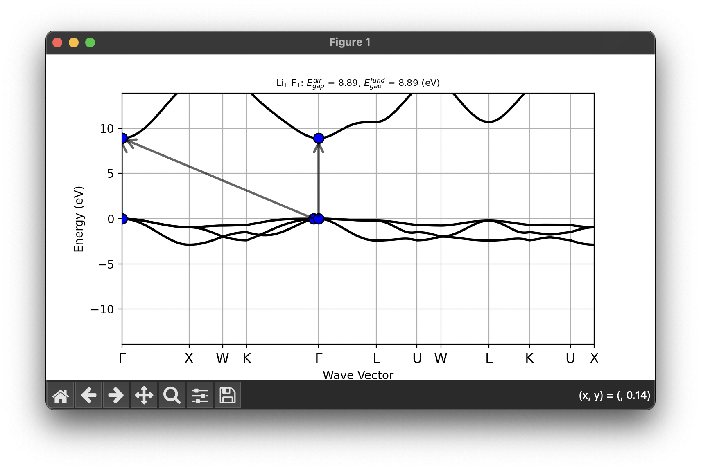

Note the VBM is triply degenerate if SOC is not used.
This suggests that we will have to use last three occupied bands for hole polaron calculations.
As the CBM has no degeneracy, only the first unoccupied band will be considered in electron polaron calculations.


## How to merge partial DDB files with mrgddb

Normally, after DFPT calculations, we need to merge partial DDB files.
This has already been done in the repository at the end of the
run [script](https://github.com/abinit/LiF_eph_varpeq/blob/main/run.sh)
via the

```sh
mrgddb out_DDB dfpt*DDB.nc
```

This command takes advantage of globbing and merges all the **partial DDB files** into
a single out_DDB file, containing information on all the calculated perturbations.

Since we are dealing with a polar material, it is worth checking whether our final DDB contains
Born effective charges and the electronic dielectric tensor.
Instead of running *anaddb* or *abinit* and then checking the output file,
we can simply use |abiopen| with the `-p` option:

```sh
abiopen.py LiF_eph_varpeq/out_DDB -p

================================== DDB Info ==================================

Number of q-points in DDB: 4
guessed_ngqpt: [3 3 3] (guess for the q-mesh divisions made by AbiPy)
ecut = 30.000000, ecutsm = 0.000000, nkpt = 14, nsym = 48, usepaw = 0
nsppol 1, nspinor 1, nspden 1, ixc = 11, occopt = 1, tsmear = 0.010000

Has total energy: False
Has forces: False
Has stress tensor: False

Has (at least one) atomic perturbation: True
Has (at least one diagonal) electric-field perturbation: True
Has (at least one) Born effective charge: True
Has (all) strain terms: False
Has (all) internal strain terms: False
Has (all) piezoelectric terms: False
Has (all) dynamical quadrupole terms: False
```

We can also invoke *anaddb* directly from python to have a quick look at the phonon dispersion:

```text
abiview.py ddb LiF_eph_varpeq/out_DDB

Computing phonon bands and DOS from DDB file with:
nqsmall: 10, ndivsm: 20,
asr: 2, chneut: 1, dipdip: 1, lo_to_splitting: automatic, dos_method: tetra
```

that produces the following figures:

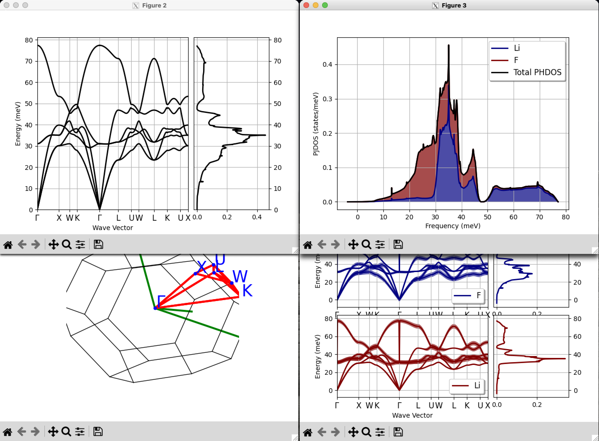

The results seem reasonable: the acoustic modes go to zero linearly for $\qq \rightarrow 0$
as we are dealing with a 3D system, no instability is present
and the phonon dispersion shows the LO-TO splitting typical of polar materials.

Note, however, that the acoustic sum-rule is automatically enforced by the code so
it is always a good idea to compare the results with/without [[asr]] as this
is an indirect indicator of the convergence/reliability of our calculations.
We can automate the process with the *ddb_asr* command of |abiview|:

```text
abiview.py ddb_asr LiF_eph_varpeq/out_DDB
```

that produces the following figure:

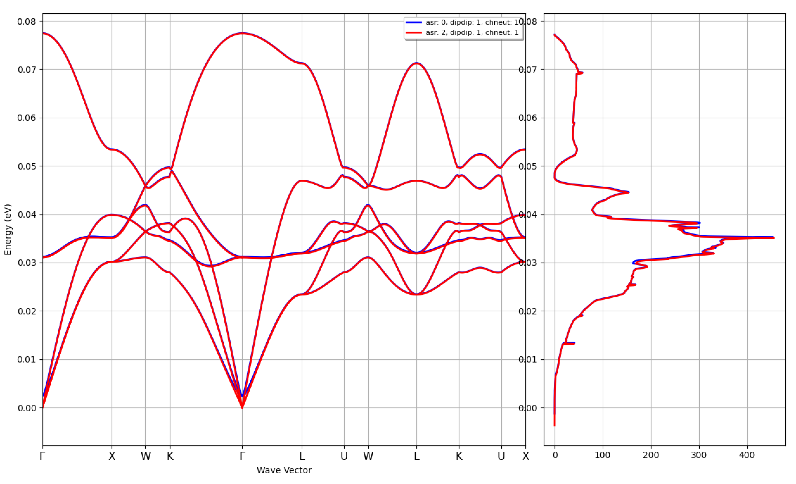

!!! important

    In this case, the small breaking of the acoustic sum rule is mainly due the too low cutoff energy employed in our calculations.
    In production, one should perform convergence tests wrt [[ecut]] and $\qq$-mesh but since the goal of this lesson is to teach you how
    to run polaron calculations, **we ignore this problem and continue with the other examples**.

    PS: If you want to compute the phonons bands with/without [[dipdip]], use:

    ```text
    abiview.py ddb_dipdip LiF_eph_varpeq/out_DDB
    ```

## How to merge partial POT files with mrgdv

Now we can merge the DFPT potential with the *mrgdv* tool using the command.

```sh
mrgdv < teph4vpq_1.abi > teph4vpq_1.stdout
```

and the following input file:



This can also be achieved by calling *mrgdv* with the *merge* argument, output filename and wildcard for the POT files

```sh
mrgdv merge teph4vpq_1_DVDB LiF_eph_varpeq/dfpt*POT*nc
```

!!! tip

    The number at the end of the POT file corresponds to the (*idir*, *ipert*) perturbation for that
    particular $\qq$-point. The *pertcase* index is computed as:

    ```fortran
    pertcase = idir + 3 * (ipert-1)
    ```

    where *idir* gives the direction ([1, 2, 3]) and *ipert* specifies the perturbation type:

    - *ipert* in [1, ..., *natom*] corresponds to atomic perturbations (reduced directions)
    - *ipert* = *natom* + 1 corresponds d/dk  (reduced directions)
    - *ipert* = *natom* + 2 corresponds the electric field
    - *ipert* = *natom* + 3 corresponds the uniaxial stress (Cartesian directions)
    - *ipert* = *natom* + 4 corresponds the shear stress.   (Cartesian directions)

    All DFPT POT files with 1 <= pertcase <= 3 x [[natom]] therefore correspond to atomic perturbations
    for a given $\qq$-point.

    The value of *pertcase* and *qpt* are reported in the ABINIT header.
    To print the header to terminal, use *abitk* with the *hdr_print* command

    ```sh
     abitk hdr_print LiF_eph_varpeq/dfpto_DS2_POT4.nc

     ===============================================================================
     ECHO of part of the ABINIT file header

     First record :
    .codvsn,headform,fform = 10.3.4.6   80  111

     Second record :
     bantot,intxc,ixc,natom  =    40     0    11     2
     ngfft(1:3),nkpt         =    30    30    30     8
     nspden,nspinor          =     1     1
     nsppol,nsym,npsp,ntypat =     1    48     2     2
     occopt,pertcase,usepaw  =     1     4     0
     ecut,ecutdg,ecutsm      =  3.0000000000E+01  3.0000000000E+01  0.0000000000E+00
     ecut_eff                =  3.0000000000E+01
     qptn(1:3)               =  0.0000000000E+00  0.0000000000E+00  0.0000000000E+00
     rprimd(1:3,1)           =  0.0000000000E+00  3.8375000000E+00  3.8375000000E+00
     rprimd(1:3,2)           =  3.8375000000E+00  0.0000000000E+00  3.8375000000E+00
     rprimd(1:3,3)           =  3.8375000000E+00  3.8375000000E+00  0.0000000000E+00
     stmbias,tphysel,tsmear  =  0.0000000000E+00  0.0000000000E+00  1.0000000000E-02

     The header contain   4 additional records.
    ```

    Use `--prtvol 1` to output more records.

Now we discuss in more detail the output file produced by *mrgdv*



For each $\qq$-point found in the partial POT files,
the code prints a lists with the atomic perturbations that have been merged in the database.

```md
 qpoint: [ 0.0000E+00,  0.0000E+00,  0.0000E+00] is present in the DVDB file
 The list of irreducible perturbations for this q vector is:
    1)  idir= 1, ipert=   1, type=independent, found=Yes
    2)  idir= 2, ipert=   1, type=symmetric, found=No
    3)  idir= 3, ipert=   1, type=symmetric, found=No
    4)  idir= 1, ipert=   2, type=independent, found=Yes
    5)  idir= 2, ipert=   2, type=symmetric, found=No
    6)  idir= 3, ipert=   2, type=symmetric, found=No
```

The term **symmetric** means that this particular *(idir, ipert)* perturbation
can be reconstructed by symmetry from the other **independent** entries with the same $\qq$-point.
If all the independent entries are available, the code prints the following message at the end of the output file:

```md
 All the independent perturbations are available
 Done
```

!!! warning

    If you don't get this message, the DVDB **cannot be used** by the EPH code.
    In this case, check carefully your DFPT input files and the list of POT files that have been merged.

    Also, note that it is not possible to change the value of [[nsym]] at the level of the EPH calculation
    as symmetries are automatically inherited from the previous GS/DFPT calculations.
    To perform calculations without symmetries, one should set [[nsym]] to 1 (no spatial symmetries)
    and use [[kptopt]] 4 to disable time-reversal symmetry in all the input files.

## Computing the WFK files

At this point we have all the ingredients (**DDB** and **DVDB**) required to compute/interpolate
the e-ph scattering potentials, and we can finally start to generate the WFK files.

For our first NSCF calculation, we compute wavefunctions on $\Gamma$-centered $\kk$-meshes (3x3x3, 4x4x4, 5x5x5, and 13x13x13)
with 6 bands (5 occupied + 1 unnocupied).
The first three wavefunctions will be used in calculations of small hole polaron in LiF.
The latter will be used for the large electron polaron in LiF.
Note the use of [[getden_filepath]] to read the precomputed DEN.nc file instead of [[getden]] or [[irdden]].

You may now run the NSCF calculation by issuing:

```sh
abinit teph4vpq_2.abi > teph4vpq_2.log 2> err &
```

with the input file given by:



## Small hole polaron: computing the GSTORE files

For **our first GSTORE calculation**, we compute the electron-phonon matrix elements
required for the small hole polaron optimization.
With this example, we discuss the most important `gstore_` input variables and the concept of the GSTORE file.
First of all, you may want to start immediately the computation by issuing:

```sh
abinit teph4vpq_3.abi > teph4vpq_3.log 2> err &
```

with the following input file:



!!! tip

    To run the examples in parallel with e.g 2 MPI processes use:

    ```sh
    mpirun -n 2 abinit teph4vpq_3.abi > teph4vpq_3.log 2> err &
    ```

    The EPH code will automatically distribute the workload using a predefined distribution scheme
    (not necessarily the most efficient in terms of memory and wall-time).
    The input variable [[eph_np_pqbks]] can be used to specify manually the distribution scheme.

!!! warning

    GSTORE calculations imply various level of the MPI parallelism and parallel IO.
    At the time of writing this tutorial, the bottleneck
    for number of MPI processes is the number of $\mathbf{k}/\mathbf{q}$-points in the IBZ.
    Specifying more may lead to idle processes that are handled differently by different compileres.

    As we use [[ndtset]] mode to compute three GSTORE files in a single run, the first dataset (3x3x3 $\kk/\qq$-mesh)
    will be the limiting factor, and **here the maximum number of allowed MPI processes** is 4.
    In production, it is **highly recommended** to compute separate GSTORE files in individual runs.


Let's now discuss the meaning of the different variables in more detail.
We use [[optdriver]] 7 to enter the EPH code while [[eph_task]] 11 activates
the computation of the electron-phonon matrix elements via interpolation of the DFPT scattering potentials.

The paths to the external files (**DDB**, **WFK**, **DVDB**) are specified with the three variables:

- [[getddb_filepath]]
- [[getwfk_filepath]]
- [[getdvdb_filepath]].

This is an excerpt of the input file:

```sh
# Electron-phonon matrix elements parameters
 gstore_cplex  2     # Complex e-ph matrix elements   (mandatory for VarPEq)
 gstore_kzone  "bz"  # Use full BZ for k and q meshes (mandatory for VarPEq)
 gstore_qzone  "bz"
 gstore_brange 3 5   # Bands participating in the hole polaron formation:
                     # from 3 to 5 (triply degenerate valence band maximum)
# Wavefunction
# Read the WFK file from the preparatory run
 getwfk_filepath1 "teph4vpq_2o_DS1_WFK"  # 3x3x3 k-mesh
 getwfk_filepath2 "teph4vpq_2o_DS2_WFK"  # 4x4x4 k-mesh
 getwfk_filepath3 "teph4vpq_2o_DS3_WFK"  # 5x5x5 k-mesh

 ngkpt1   3 3 3  # These parameters have to be consistent with the WFK file
 ngkpt2   4 4 4
 ngkpt3   5 5 5
 ...

# Phonons
 getddb_filepath
 "LiF_eph_varpeq/out_DDB"  # Read the precomputed DDB stored in git submodule
                           # NOTE: for the input parameters used to produce
                           # the DDB file, consult the LiF_eph_varpeq/dfpt.abi

# Scattering potentials
 getdvdb_filepath
 "teph4vpq_1_DVDB"  # Read the DVDB file from the preparatory run

# Phonons and scattering potentials interpolation
 ddb_ngqpt  3 3 3       # This has to be consistent with the DDB/DVDB files
 ...

 eph_ngqpt_fine1  3 3 3  # Interpolate to 3x3x3 q-grid
 eph_ngqpt_fine2  4 4 4  #                4x4x4 q-grid
 eph_ngqpt_fine3  5 5 5  #                5x5x5 q-grid
```

The mesh for electrons ([[ngkpt]], [[nshiftk]] and [[shiftk]]) must
correspond to the one used for the input WFK file.
[[ddb_ngqpt]] is set to 3x3x3 as this is the $\qq$-mesh used in the DFPT part to generate the DDB and DVDB files,
but the integration in $\qq$-space is performed with the [[eph_ngqpt_fine]] mesh.
As [[eph_ngqpt_fine]] differs from [[ddb_ngqpt]], the code will automatically activate
the interpolation of the DFPT potentials as discussed in the [introduction to the EPH code](/tutorial/eph_intro).

Polaron calculations require complex electron-phonon matrix elements, hence [[gstore_cplex]] 2 is used.
As we will deal with small hole polaron, and the VBM in LiF is triply-degenerate, we select the last three occupied bands
via [[gstore_brange]] variable.

!!! important

    At present, at the level of polaron computations, no symmetry is assumed for the electron-phonon matrix elements.
    Hence these terms have to be computed in the full BZ for $\kk$ and $\qq$ vectors.
    This behaviour is specified by the [[gstore_kzone]] and [[gstore_qzone]] variables.
    As a result, for some systems GSTORE files may require a relatively large amount of phyical memory.

    In principle, it is possible to utilize symmetries for matrix elements, albeit this requires the correct treatment of
    the scattering between degenerate states via degenerate phonons [[cite:Li2024]].
    This feature, however, is not yet implemented.


We can now have a look at the main output file:



For each DATASET we find a section that summarizes the gstore parameters:

```md
 === Gstore parameters ===
 kzone: bz
 kfilter: none
 nkibz: 4
 nkbz: 27
 glob_nk_spin: [27]
 qzone: bz
 nqibz: 4
 nqbz: 27
 glob_nq_spin: [27]
 kptopt: 1
 qptopt: 1
 with_vk: 1

 gqk_cplex: 2
 gqk_bstart: 3
 gqk_bstop: 5
 gqk_nb: 3
 gqk_my_npert: 6
 gqk_my_nk: -1
 gqk_my_nq: -1
```

Then we find another section related to the MPI parallelism.
In this case we are running in sequential but the output will change if we run in parallel (see also [[eph_np_pqbks]]).
The final message informs the user that the EPH code will either read the qpts from file
(if the DVDB contains all of them, in case [[eph_ngqpt_fine]] is not defined in the input)
or interpolate the scattering potentials from [[ddb_ngqpt]] to [[eph_ngqpt_fine]].

```md
  === MPI distribution ===
P Number of CPUs for parallelism over perturbations: 1
P Number of perturbations treated by this CPU: 6
P Number of CPUs for parallelism over q-points: 1
P Number of CPUs for parallelism over k-points: 1
```

```md
 DVDB file contains all q-points in the IBZ --> Reading DFPT potentials from file.
```

or

```md
 Cannot find eph_ngqpt_fine q-points in DVDB --> Activating Fourier interpolation.
```

Finally, we have the section with the squared absolute values of specific matrix elements are printed.
This is mostly done for regression tests of ABINIT. Note, however, the `gstore_completed: 1` tag.
This indicates that all the matrix elements have been computed for the corresponding GSTORE file.

```md
 gstore_completed: 1
 gstore_done_qbz_spin: 125
 gqk%nb: 3
 gqk%glob_nq: 125
 gqk%glob_nk: 125
 E-PH matrix elements:
    iq    ik  mode im_kq  in_k    |g|^2 in Ha^2
 |g(k,q)|^2 in Ha^2 for iq: 1 ik: 1 mode: 4
    iq    ik  mode im_kq  in_k    |g|^2 in Ha^2
     1     1     4     1     1     3.315387E-18
     1     1     4     1     2     5.564496E-19
     1     1     4     1     3     6.911046E-19
     1     1     4     2     1     5.564496E-19
     1     1     4     2     2     3.620046E-18
     1     1     4     2     3     1.066932E-19
     1     1     4     3     1     6.911046E-19
     1     1     4     3     2     1.066932E-19
     1     1     4     3     3     3.147723E-18
...
```

The calculation has produced the following output files (e.g. for the first DATASET):

```sh
$ ls teph4vpq_3o_DS1*

teph4vpq_3o_DS1_EBANDS.agr teph4vpq_3o_DS1_GSTORE.nc  teph4vpq_3o_DS1_PHDOS.nc
```

where:

- EBANDS.agr --> Electron bands in |xmgrace| format. See also [[prtebands]]
- PHDOS.nc   --> Phonon DOS in netcdf format (see [[prtphdos]] is given by [[ph_ngqpt]]).
- GSTORE.nc  --> Netcdf file with electron-phonon matrix elements $g_{mn\nu}(\mathbf{k,q})$ and other related datastructures.

All the matrix elements are stored in the **GSTORE.nc** NetCDF file for all $\kk/\qq$-points, electronic states and phonon modes.
As usual, one can use |abiopen| with the `-p` option (`--print`) to print a summary to terminal:

```text
$ abiopen.py teph4vpq_3o_DS1_GSTORE.nc -p
...
nsppol: 1
gstore_completed: True
gstore_cplex: 2
gstore_kzone: bz
gstore_kfilter: none
gstore_gmode: phonon
gstore_qzone: bz
gstore_with_vk: 1
gstore_kptopt: 1
gstore_qptopt: 1
gstore_brange_spin[0]: [2 5]
gstore_erange_spin[0]: [0. 0.]
gstore_glob_spin_nq[0]: 27
```

!!! important

    Pay attention to the gstore_completed tag. If set to False, some matrix elements may not have been computed.
    This typically occurs if the job was interrupted, for example due to a timeout.

	To restart a gstore computation, simply instruct the code to read the incomplete GSTORE.nc file
    using [[getgstore_filepath]], and rerun the same input file with [[optdriver]] = 11.
    If needed, you can disable this automatic restart capability by setting [[eph_restart]] to 0.


## Small hole polaron: variational optimization of binding energy

At this point we have all the ingredients to start **our first VarPEq calculation**.
This will be done for three $\kk/\qq$-meshes of incrementally increasing sampling:
3x3x3, 4x4x4, and 5x5x5, which represent a supercell hosting the polaron.
For each mesh, we have already computed the mandatory inputs: **WFK** and **GSTORE** files.
We will also need the same **DDB** file used in the GSTORE calculations.

With this example, we can discuss the most important `vpq_` input variables and the concept of VarPEq calculations.
First of all, you may want to start the computation immediately by issuing:

```sh
abinit teph4vpq_4.abi > teph4vpq_4.log 2> err &
```

with the following input file:



!!! tip

    In this example, the GSTORE files have already been computed and will be reloaded from disk.
    The EPH code will automatically distribute the workload and memory using a predefined distribution scheme.

    The manual parallelism is possible over $\kk$-, $\qq$-points, perturbations and spin indices.
    See the related [[eph_np_pqbks]] input variable.


!!! important

    We use [[ndtset]] mode to perform three polaron calculations in a single run.
    Hence, the first dataset (3x3x3 $\kk/\qq$-mesh) will be limiting factor for parallelism:
    max 6 procs over perturbations (2*[[natom]]), and max 9 procs for $\kk/\qq$-vectors each.
    In production, it is **highly recommended** to compute separate GSTORE files in individual runs.

Let's now discuss the meaning of the different variables in more detail.
As usual, we use [[optdriver]] 7 to enter the EPH code while [[eph_task]] 13 activates
the solver for the variational polaron equations.

The paths to the mandatory external files (**DDB**, **WFK**, **GSTORE**) are specified
by the three variables:

- [[getddb_filepath]]
- [[getwfk_filepath]]
- [[getgstore_filepath]].

This is an excerpt of the input file:

```sh
# Variational Polaron Equations parameters
 vpq_pkind  "hole"  # Hole polaron
 vpq_tolgrs  1e-5   # Tolerance on the gradient norm

 # these parameters are default but given here explicitly for clarity
 vpq_aseed      "gau_energy"  # Initial charge localization is Guassian-like
 vpq_gpr_energy  0. 1.        # Gaussian parameters for initial charge
 vpq_nstates     1            # Number of polaronic states
 vpq_nstep       50           # Maximum number of optimization steps

# Frohlich correction
 eph_frohl_ntheta  32   # Number of divisions for the spherical integration of
                        # the long-range part of electron-phonon energy.
                        # Non-zero value activates the computation of Frohlich
                        # corrections.
                        # ntheta=32 gives the optimal number of divisions for the
                        # spherical integration.

 vpq_avg_g  1  # Apply Frohlich correction to e-ph coupling


# Electron-phonon matrix elements
 getgstore_filepath1 "teph4vpq_3o_DS1_GSTORE.nc" # 3x3x3 k/q-mesh
 getgstore_filepath2 "teph4vpq_3o_DS2_GSTORE.nc" # 4x4x4 k/q-mesh
 getgstore_filepath3 "teph4vpq_3o_DS3_GSTORE.nc" # 5x5x5 k/q-mesh

# Wavefunction
# Read the WFK file from the preparatory run
 getwfk_filepath1 "teph4vpq_2o_DS1_WFK"  # 3x3x3 k-mesh
 getwfk_filepath2 "teph4vpq_2o_DS2_WFK"  # 4x4x4 k-mesh
 getwfk_filepath3 "teph4vpq_2o_DS3_WFK"  # 5x5x5 k-mesh

 ngkpt1   3 3 3  # These parameters have to consistent with the WFK file
 ngkpt2   4 4 4
 ngkpt3   5 5 5
 ...

# Phonons
 ddb_ngqpt  3 3 3          # This has to be consistent with the DDB file
 getddb_filepath
 "LiF_eph_varpeq/out_DDB"  # Read the precomputed DDB stored in git submodule
                           # NOTE: for the input parameters used to produce
                           # the DDB file, consult the LiF_eph_varpeq/dfpt.abi
```

The mesh for electrons ([[ngkpt]], [[nshiftk]] and [[shiftk]]) must
correspond to the one used for the input WFK file.
[[ddb_ngqpt]] is set to 3x3x3 as this is the $\qq$-mesh used in the DFPT part to generate the DDB and DVDB files used previously in GSTORE.

Polaron calculations require an explicit [[vpq_pkind]] variable specification which tells the code which polaron we are dealing with (here, `"hole"`).
In principle, this is **the only mandatory** `vpq_` variable, and other inputs take default values if not specified.

In our example, the initial guess for the electronic coefficients $\boldsymbol{A}$ is given by the combination of [[vpq_aseed]] and [[vpq_gpr_energy]] variables.
The [[vpq_nstates]] variable gives the number of polaronic states.
For each state, the solver will iterate until it converges on the gradient norm specified by the [[vpq_tolgrs]] variable OR reaches the maximum number of iterations [[vpq_nstep]].

Here, we also use a Fr\"ohlich correction for the electron-phonon matrix divergence at $\Gamma$.
For a fixed $\kk/\qq$-mesh, this trick brings the solution closer to the infinite-mesh limit, and also facilitates the convergence of our algorithm.
One activates this correction via [[vpq_avg_g]] tag and the specification of the [[eph_frohl_ntheta]] variable.

We can now have a look at the main output file:



Since first we load the GSTORE files, we find a section that summarizes the gstore parameters and MPI parallelism:

```md
 Computing variational polaron equations from pre-existent GSTORE file: teph4vpq\_3o\_DS1_GSTORE.nc
 Initializing gstore object from: teph4vpq_3o_DS1_GSTORE.nc

 === Gstore parameters ===
  ...

  === MPI distribution ===
  ...
```

The following section prompts the parameters of the VarPEq optimization and other related quantities:

```md
  === Variational Polaron Equations ===

 Polaron:
   * Polaron kind: hole
   * BvK supercell: 3x3x3
   * Number of independent spin polarizations: 1
   * Number of polaronic states: 1
   * Filtering of electronic states: no

 Long-range corrections:
   * Frohlich correction: yes
   * Frohlich correction value: 9.265067E-01 eV
   * Frohlich correction included in matrix elements: yes

 Optimization parameters:
   * Initial seed: charge localization A_nk
   * Initial seed type: Gaussian, based on the electroic energies
   * Tolerance on the gradient norm: 1.00E-05
   * Maximum number of iterations per state: 50
```

And, finally, the code enters the solver and prints the optimization log at the end of computation.

```md
 Solving the variational polaron equations for each state...
   * spin 1/1, pstate 1/1...
   Done

 Printing the optimization logs
   --------------------------------------------------------------------------------------
   * spin 1/1, pstate 1/1
   * values in the optimization log are in (a.u.)
   --------------------------------------------------------------------------------------
   Step        E_pol         E_el         E_ph       E_elph      epsilon     ||grad||
      1  -3.0118E-03   4.1093E-02   4.4105E-02  -8.8210E-02   4.7117E-02   1.0900E-02
      2  -2.4528E-02   1.9417E-02   4.3945E-02  -8.7891E-02   6.8473E-02   2.2198E-03
      3  -3.9895E-02   3.0152E-03   4.2910E-02  -8.5819E-02   8.2804E-02   4.9899E-03
      4  -4.1219E-02   1.7941E-03   4.3013E-02  -8.6026E-02   8.4232E-02   3.2342E-03
      5  -4.3429E-02   5.7133E-04   4.4000E-02  -8.8000E-02   8.7429E-02   1.8175E-03
      6  -4.7595E-02   2.6635E-03   5.0259E-02  -1.0052E-01   9.7854E-02   4.6156E-03
      7  -5.2013E-02   5.3655E-03   5.7378E-02  -1.1476E-01   1.0939E-01   6.3385E-03
      8  -5.6356E-02   8.0023E-03   6.4359E-02  -1.2872E-01   1.2072E-01   6.1036E-03
      9  -6.1355E-02   1.0870E-02   7.2225E-02  -1.4445E-01   1.3358E-01   2.7021E-03
     10  -6.3184E-02   1.1570E-02   7.4754E-02  -1.4951E-01   1.3794E-01   4.1324E-03
     11  -6.9063E-02   1.5656E-02   8.4719E-02  -1.6944E-01   1.5378E-01   6.5822E-03
     12  -7.5399E-02   2.2493E-02   9.7892E-02  -1.9578E-01   1.7329E-01   3.7146E-03
     13  -7.6048E-02   2.4094E-02   1.0014E-01  -2.0028E-01   1.7619E-01   2.3119E-03
     14  -7.6484E-02   2.6017E-02   1.0250E-01  -2.0500E-01   1.7899E-01   3.8701E-04
     15  -7.6489E-02   2.6203E-02   1.0269E-01  -2.0538E-01   1.7918E-01   2.9740E-04
     16  -7.6495E-02   2.6384E-02   1.0288E-01  -2.0576E-01   1.7937E-01   5.8608E-05
     17  -7.6495E-02   2.6413E-02   1.0291E-01  -2.0582E-01   1.7940E-01   4.1064E-05
     18  -7.6496E-02   2.6449E-02   1.0294E-01  -2.0589E-01   1.7944E-01   4.5160E-05
     19  -7.6499E-02   2.6426E-02   1.0293E-01  -2.0585E-01   1.7942E-01   6.9919E-05
     20  -7.6504E-02   2.6408E-02   1.0291E-01  -2.0582E-01   1.7942E-01   1.6567E-04
     21  -7.6524E-02   2.6393E-02   1.0292E-01  -2.0583E-01   1.7944E-01   2.8985E-04
     22  -7.6587E-02   2.6434E-02   1.0302E-01  -2.0604E-01   1.7961E-01   3.2632E-04
     23  -7.6771E-02   2.6522E-02   1.0329E-01  -2.0658E-01   1.8006E-01   5.2643E-04
     24  -7.7070E-02   2.6540E-02   1.0361E-01  -2.0722E-01   1.8068E-01   6.7279E-04
     25  -7.7399E-02   2.6568E-02   1.0397E-01  -2.0793E-01   1.8137E-01   5.2144E-04
     26  -7.7402E-02   2.6586E-02   1.0399E-01  -2.0798E-01   1.8139E-01   3.8771E-04
     27  -7.7485E-02   2.6715E-02   1.0420E-01  -2.0840E-01   1.8168E-01   7.3990E-04
     28  -7.7588E-02   2.6682E-02   1.0427E-01  -2.0854E-01   1.8186E-01   2.9923E-04
     29  -7.7616E-02   2.6588E-02   1.0420E-01  -2.0841E-01   1.8182E-01   2.7317E-04
     30  -7.7633E-02   2.6620E-02   1.0425E-01  -2.0850E-01   1.8189E-01   1.2044E-04
     31  -7.7633E-02   2.6648E-02   1.0428E-01  -2.0856E-01   1.8191E-01   5.7835E-05
     32  -7.7636E-02   2.6711E-02   1.0435E-01  -2.0869E-01   1.8198E-01   9.0984E-05
     33  -7.7637E-02   2.6646E-02   1.0428E-01  -2.0857E-01   1.8192E-01   5.3464E-05
     34  -7.7637E-02   2.6617E-02   1.0425E-01  -2.0851E-01   1.8189E-01   4.7310E-05
     35  -7.7638E-02   2.6658E-02   1.0430E-01  -2.0859E-01   1.8193E-01   1.9031E-05
     36  -7.7638E-02   2.6661E-02   1.0430E-01  -2.0860E-01   1.8194E-01   1.8077E-05
     37  -7.7638E-02   2.6652E-02   1.0429E-01  -2.0858E-01   1.8193E-01   1.9269E-05
     38  -7.7638E-02   2.6654E-02   1.0429E-01  -2.0858E-01   1.8193E-01   7.3431E-06
   --------------------------------------------------------------------------------------
   Converged: ||grad||=7.3431E-06 < vpq_tolgrs=1.0000E-05
   E_pol (eV):  -2.11263475E+00
     eps (eV):   4.95056023E+00
   --------------------------------------------------------------------------------------

 Saving results to: teph4vpq_4o_DS1_VPQ.nc
```

In the log above, one can see the convergence of the polaron binding energy `E_pol`, its individual electronic,
phonon and electron-phonon terms `E_el`, `E_ph`, and `E_elph`, as well as charge localization energy `epsilon`.
The `||grad||` column shows the evolution of the gradient norm over the iterations.

!!! tip

    Note, however, that this log is given to get a first glimpse on the behaviour of the solver.
    Complete results, including optimized $\boldsymbol{A}$ and $\boldsymbol{B}$ coefficients are saved
    in the VPQ NetCDF at the end of computation.
    We will heavily rely on these netcdf files for post-processing.

The calculation has produced the following output files (e.g. for the first DATASET):

```sh
$ ls teph4vpq_4o_DS1*

teph4vpq_4o_DS1_EBANDS.agr teph4vpq_4o_DS1_PHDOS.nc   teph4vpq_4o_DS1_VPQ.nc
```

where the most important is VPQ.nc -- a NetCDF file with the optimization log,
optimized $\boldsymbol{A}$ and $\boldsymbol{B}$ coefficients and other relevant data.
We will heavily rely on these files and the |AbiPy| toolkit for post-processing our results.
As usual, one can use |abiopen| with the `-e` option (`--expose`) to print a summary to terminal and visualize the optimization log:

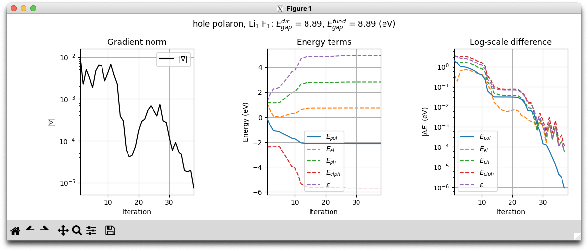

The subplot on the left shows the evolution of the gradient norm.
Two subplots on the right show the convergence of energy terms and their log-scale difference wrt final values.
As the binding energy $E_\mathrm{pol}$ is the only variational quantity, on these two subplots it is shown by solid lines.


## Small hole polaron: extrapolation to the infinite-size supercell

As seen from our calculations, the small hole polaron is already being localized at 3x3x3 $\kk/\qq$-mesh (3x3x3 supercell).
However, to evaluate its binding energy in the infinite-size limit $N_p \to \infty$,
we need to perform the extrapolation wrt inverse supercell size (that's why we have optimized polaron for multiple meshes!):

\begin{equation}
\label{eq:makovpayne}
    E_\mathrm{pol}(N_p) =
    E^\infty_\mathrm{pol} + a N_p^{-1/3} + \mathcal{O}(N_p^{-1}),
\end{equation}

To fit the parameters of Eq. (\ref{eq:makovpayne}) to the optimized data, one can use any suitable software or library of choice.
In this tutorial, however -- just as in other examples -- we will rely on the capabilities of AbiPy as a Python module.

AbiPy provides a `Robot` class that can be used to analyze multiple NetCDF files produced in ABINIT calculations.
In particular, we will be interested in the `VpqRobot`.
The following Python script gives an example on how to use this class with the relevant methods:

```python
from abipy.eph.vpq import VpqRobot

vpq_files = [
    "teph4vpq_4o_DS1_VPQ.nc",
    "teph4vpq_4o_DS2_VPQ.nc",
    "teph4vpq_4o_DS3_VPQ.nc",
]
robot = VpqRobot.from_files(vpq_files)

df = robot.get_final_results_df()
print(df)

robot.plot_kconv(nfit=3)
```

It imports the `VpqRobot` class from the module and initializes it with the list of VPQ files.
Then, a pandas dataframe with optimized data for each VPQ file is returned via the `get_final_results_df` method.
One can use this dataframe to perform further data analysis and create custom publication-ready figures.
We then use a `plot_kconv` method that performs the fitting of Eq. (\ref{eq:makovpayne})
parameters to the data in the robot, and plots the following figure:

!!! tip

    For formal arguments of the methods and their meaning, user can invoke the Python `help()` function.
    E.g. calling `help(VpqRobot.plot_kconv)` gives the method's docstring:

    ```sh
    ...
    Plot the convergence of the results with respect to k-point sampling.

    Args:
        nfit (int, optional): Number of points used in linear extrapolation. Defaults to 3.
    ...
    ```

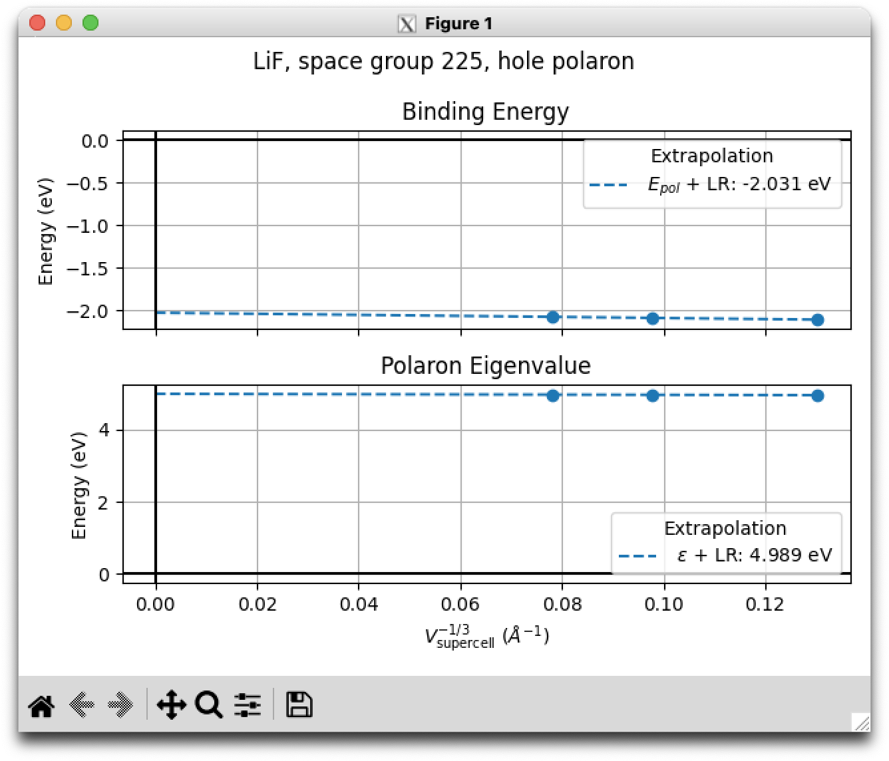

The extrapolated values $E_\mathrm{pol}$ = -2.03 eV and $\varepsilon_\mathrm{loc}$ = 4.99 eV differ from a fully converged values of $E_\mathrm{pol}$ = -1.94 eV and $\varepsilon_\mathrm{loc}$ = 4.68 eV.
This is mainly due to the low [[ecut]] and sampling of $\kk/\qq$-meshes used to produce the input parameters for the solver.
Also, one has to impose lower [[vpq_tolgrs]] convergence threshold and use denser meshes for extrapolation.

Now, let's try to perform the same calculations as in `teph4vpq_4.abi` but without the long-range corrections for the matrix elements at $\Gamma$.
The input is the same, but with the [[vpq_avg_g]] tag set to 0:



As usual, run this example with:

```sh
abinit teph4vpq_5.abi > teph4vpq_5.log 2> err &
```

Upon completion, we can modify our Python script to include the new VPQ files in our robot.

```python
from abipy.eph.vpq import VpqRobot

vpq_files = [
    # calculations with LR correction
    "teph4vpq_4o_DS1_VPQ.nc",
    "teph4vpq_4o_DS2_VPQ.nc",
    "teph4vpq_4o_DS3_VPQ.nc",
    # calculations without LR correction
    "teph4vpq_5o_DS1_VPQ.nc",
    "teph4vpq_5o_DS2_VPQ.nc",
    "teph4vpq_5o_DS3_VPQ.nc",
]
robot = VpqRobot.from_files(vpq_files)

robot.plot_kconv(nfit=3)
```

The robot is smart enough (but stupid nonetheless, so **trust your own judgemenet**) to detect 2 different kind
of calculations and perform separate extrapolation for each case.
It produces the following figure:

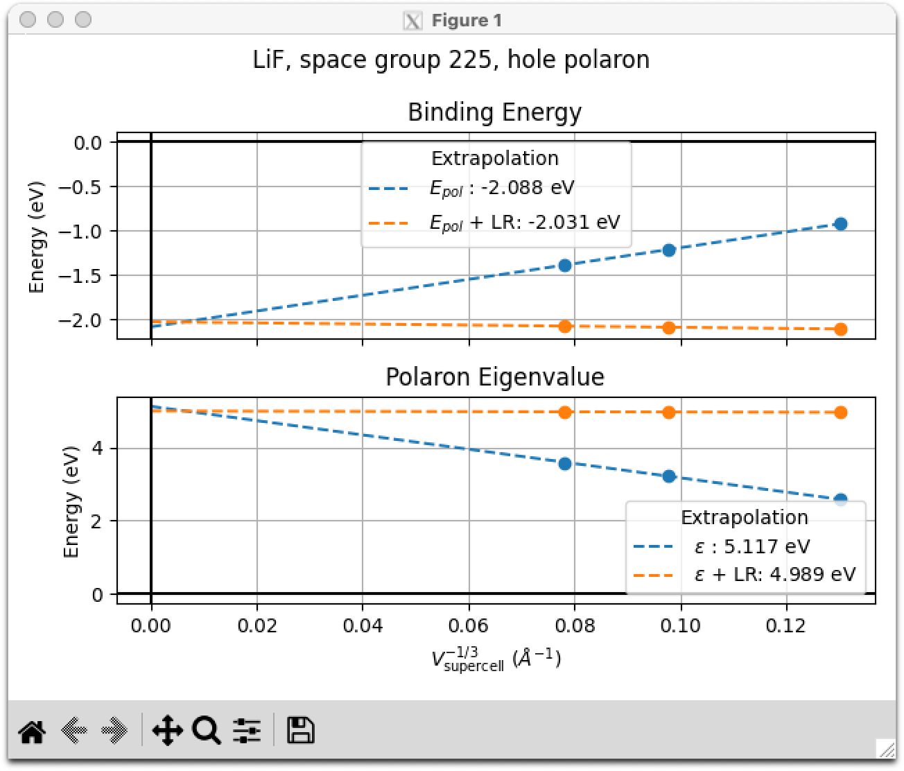

In principle, extrapolated values for $E_\mathrm{pol}$ and $\varepsilon_\mathrm{loc}$ have to agree whether or not the LR correction is employed.
The discrepancy here is mainly due to the relatively high value of [[vpq_tolgrs]]
and the coarse $\kk/\qq$-meshes used for extrapolation.

??? note "Exercise"

    Try changing the nfit argument in `plot_kconv` to 2 (i.e. throw away the 3x3x3 point)
    from the extrapolation data and see if the extrapolated values agree better.

Note, however, how adding the LR correction brings the values of $E_\mathrm{pol}$ at fixed $\kk/\qq$-meshes closer to the infinite-size value.

!!! warning

    For delocalized polarons, i.e. there is no binding, adding LR correction will anyway give the negative value of $E_\mathrm{pol}$,
    solely due to the long-range correction that vanishes in the limit of $N_p \to \infty$.
    Without the LR correction, $E_\mathrm{pol}$ is zero for a delocalized particle.
    As a result, one always needs to check the extrapolation to the infinite-size limit and reach $\kk/\qq$-meshes (supercells) large
    enough to host a polaron.


## Small hole polaron: multiple states and visualization

For now, we have probed our system for a single polaronic state.
However, our method supports the search for multiple polaronic states:
once solutions with charge localization $\boldsymbol{A}^i, i < n$ are found, we find the next one $\boldsymbol{A}^{n}$ by imposing
an orthogonality constraint wrt $\boldsymbol{A}^i, i < n$.

This is similar to the approach used to compute multiple electornic bands [[cite:Payne1992]].
In polaron problem, however, this procedure does not give an optimized solution for $\boldsymbol{A}^n$,
as polaronic states are not necessarily orthogonal to each other.
Rather, it brings the next solution far away from all the previous ones.
After this is achieved, i.e. the solver is stuck at a constrained-induced stationary point,
the constraint can be removed, and a new solution is found.

Here we will utilize this approach to demonstrate that there exist multiple variational solutions for hole polaron in LiF.

Our input file is



As usual, run this example with:

```sh
abinit teph4vpq_6.abi > teph4vpq_6.log 2> err &
```

Note that [[vpq_nstates]] variable is now 3.
Also, two new `vpq_` variables are introduced, [[vpq_nstep_ort]] and [[vpq_translate]].
The former defines how many orthogonalization steps are to be performed.
After [[vpq_nstep_ort]] steps, the orthogonality constraint is lifted, and the algorithm relaxes to a solution
from a starting point for $\boldsymbol{A}$ that is far away from the previous ones.
The [[vpq_translate]] tag turns on the translation of polaronic solutions, i.e. we perform $n$-th orthogonalization
wrt computed $\boldsymbol{A}^i, i < n$ and their translated images within the supercell.
This is rather important point, as polarons can localize at any equivalent atomic site within a supercell,
and we have to eliminate these trivial solutions.


!!! important

    At large $\kk/\qq$ meshes the translation of polaronic solutions can be **computationally prohibitive**
    due to the large supercell size.


Now let's examine the main output file



Note the difference in the initial prompt

```md
...
 Solving the variational polaron equations for each state...
   * spin 1/1, pstate 1/3...
   Done
   * spin 1/1, pstate 2/3...
   Done
   * spin 1/1, pstate 3/3...
```

Also, there are now three optimization logs for each state, which are a bit different when the orthogonalization is performed.
For example, for state 2:

```md
   --------------------------------------------------------------------------------------
   * spin 1/1, pstate 2/3
   * values in the optimization log are in (a.u.)
   (o) - orthogonal all pstates < 2
   --------------------------------------------------------------------------------------
   Step        E_pol         E_el         E_ph       E_elph      epsilon     ||grad||
      1  -9.2204E-04   4.4614E-02   4.5536E-02  -9.1071E-02   4.6458E-02   1.0902E-02  (o)
      2  -2.8019E-02   1.8675E-02   4.6694E-02  -9.3388E-02   7.4713E-02   5.0189E-03  (o)
      3  -4.0570E-02   7.1368E-03   4.7707E-02  -9.5414E-02   8.8277E-02   3.2275E-03  (o)
      4  -4.4896E-02   4.8512E-03   4.9747E-02  -9.9494E-02   9.4642E-02   4.2843E-03  (o)
      5  -5.1065E-02   5.2935E-03   5.6358E-02  -1.1272E-01   1.0742E-01   6.1297E-03  (o)
      6  -5.7578E-02   7.8267E-03   6.5405E-02  -1.3081E-01   1.2298E-01   5.4966E-03  (o)
      7  -6.1360E-02   1.0590E-02   7.1950E-02  -1.4390E-01   1.3331E-01   2.7006E-03  (o)
      8  -6.1924E-02   1.1454E-02   7.3377E-02  -1.4675E-01   1.3530E-01   3.4064E-03  (o)
      9  -6.3122E-02   1.3396E-02   7.6519E-02  -1.5304E-01   1.3964E-01   5.3188E-03  (o)
     10  -6.5647E-02   1.7329E-02   8.2976E-02  -1.6595E-01   1.4862E-01   7.5766E-03  (o)
     11  -6.8053E-02   2.2522E-02   9.0575E-02  -1.8115E-01   1.5863E-01   9.0101E-03  (o)
     12  -6.8691E-02   2.5699E-02   9.4390E-02  -1.8878E-01   1.6308E-01   9.6510E-03  (o)
     13  -6.8721E-02   2.6332E-02   9.5054E-02  -1.9011E-01   1.6378E-01   9.8228E-03  (o)
     14  -6.8721E-02   2.6327E-02   9.5049E-02  -1.9010E-01   1.6377E-01   9.8214E-03  (o)
     15  -6.8721E-02   2.6359E-02   9.5080E-02  -1.9016E-01   1.6380E-01   9.8300E-03  (o)
     16  -6.8721E-02   2.6349E-02   9.5070E-02  -1.9014E-01   1.6379E-01   9.8272E-03  (o)
     17  -6.8721E-02   2.6352E-02   9.5074E-02  -1.9015E-01   1.6380E-01   9.8282E-03  (o)
     18  -6.8721E-02   2.6351E-02   9.5072E-02  -1.9014E-01   1.6379E-01   9.8279E-03  (o)
     19  -6.8721E-02   2.6351E-02   9.5073E-02  -1.9015E-01   1.6379E-01   9.8280E-03  (o)
     20  -6.8721E-02   2.6351E-02   9.5073E-02  -1.9015E-01   1.6379E-01   9.8280E-03  (o)
     21  -6.8721E-02   2.6351E-02   9.5073E-02  -1.9015E-01   1.6379E-01   9.8280E-03  (o)
     22  -6.8721E-02   2.6351E-02   9.5073E-02  -1.9015E-01   1.6379E-01   9.8280E-03  (o)
     23  -6.8721E-02   2.6351E-02   9.5073E-02  -1.9015E-01   1.6379E-01   9.8280E-03  (o)
     24  -6.8721E-02   2.6351E-02   9.5073E-02  -1.9015E-01   1.6379E-01   9.8280E-03  (o)
     25  -6.8721E-02   2.6351E-02   9.5073E-02  -1.9015E-01   1.6379E-01   9.8280E-03  (o)
     26  -6.8721E-02   2.6351E-02   9.5073E-02  -1.9015E-01   1.6379E-01   9.8280E-03  (o)
     27  -6.8721E-02   2.6351E-02   9.5073E-02  -1.9015E-01   1.6379E-01   9.8280E-03  (o)
     28  -6.8721E-02   2.6351E-02   9.5073E-02  -1.9015E-01   1.6379E-01   9.8280E-03  (o)
     29  -6.8721E-02   2.6351E-02   9.5073E-02  -1.9015E-01   1.6379E-01   9.8280E-03  (o)
     30  -6.8721E-02   2.6351E-02   9.5073E-02  -1.9015E-01   1.6379E-01   9.8280E-03  (o)
     31  -6.8721E-02   2.6351E-02   9.5073E-02  -1.9015E-01   1.6379E-01   9.8280E-03
     32  -6.8842E-02   2.7693E-02   9.6535E-02  -1.9307E-01   1.6538E-01   1.0118E-02
     33  -7.6401E-02   2.7006E-02   1.0341E-01  -2.0681E-01   1.7981E-01   1.1018E-03
     34  -7.6461E-02   2.6598E-02   1.0306E-01  -2.0612E-01   1.7952E-01   2.8937E-04
     35  -7.6466E-02   2.6433E-02   1.0290E-01  -2.0580E-01   1.7937E-01   4.2615E-05
     36  -7.6466E-02   2.6420E-02   1.0289E-01  -2.0577E-01   1.7935E-01   1.1954E-05
     37  -7.6466E-02   2.6411E-02   1.0288E-01  -2.0575E-01   1.7934E-01   6.4220E-06
   --------------------------------------------------------------------------------------
   Converged: ||grad||=6.4220E-06 < vpq_tolgrs=1.0000E-05
   E_pol (eV):  -2.08075740E+00
     eps (eV):   4.88019624E+00
```

Note the `(o)` tag for optimization step with the orthogonality constraint.
Also, check the gradient norm, which is indeed stuck at a constrained-induced stationary point
before the constraint is lifted.

All results are gathered in a single *VPQ* NetCDF file.
As before, we can visualize the convergence of our method using |abiopen| with the `-e` option (`--expose`):

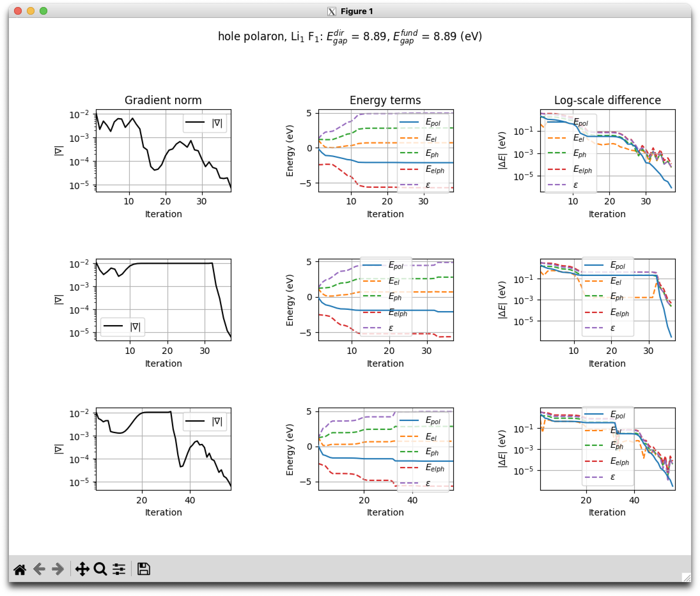

The $E_\mathrm{pol}$ values for each state differ slightly:

```sh
$ grep "E_pol (eV)" teph4vpq_6.abo

   E_pol (eV):  -2.11263475E+00
   E_pol (eV):  -2.08075740E+00
   E_pol (eV):  -2.11071583E+00`
```

To visualize these states, one can compute the real-space charge distribution and displacements
via Eqs. (\ref{eq:polaron_phi}),(\ref{eq:polaron_tau}).

In this tutorial, this is done with the following input



As usual, run this example with:

```sh
abinit teph4vpq_7.abi > teph4vpq_7.log 2> err &
```

This calculations requires the **VPQ** NetCDF file produced in the previous calculations,
as well as the corresponding **WFK**, **DDB**, **DVDB** and **GSTORE** files.
Note the new [[getvpq_filepath]] variable.

The code responsible for producing `.xsf` files with visualization data is activated via the [[eph_task]] -13 variable.
The variable [[vpq_mesh_fact]] specifies the resolution downsampling of the charge distribution isosurface.
Increasing its value will reduce memory requirements by losing some fine features of the isosurface.
For small polarons [[vpq_mesh_fact]] 1 (no downsampling) is perfectly fine, but for the sake of tutorial we will use the downsampling anyaway.

This calculation has produced the following `.xsf` files:

```sh
$ ls *xsf

teph4vpq_7o_pstate_1_POLARON.xsf               teph4vpq_7o_pstate_2_POLARON.xsf               teph4vpq_7o_pstate_3_POLARON.xsf
teph4vpq_7o_pstate_1_POLARON_DISPL.xsf         teph4vpq_7o_pstate_2_POLARON_DISPL.xsf         teph4vpq_7o_pstate_3_POLARON_DISPL.xsf
teph4vpq_7o_pstate_1_POLARON_DISPL_VECTORS.xsf teph4vpq_7o_pstate_2_POLARON_DISPL_VECTORS.xsf teph4vpq_7o_pstate_3_POLARON_DISPL_VECTORS.xsf
```

For each state, we have

- POLARON.xsf --> polaron charge distribution in pristine geometry;
- POLARON_DISPL.xsf --> polaron charge distribution with distorted geometry;
- POLARON_DISPL_VECTORS.xsf --> pristine geometry with displacement vectors shown as forces.


One can use software that can read `.xsf` file format (e.g. VESTA) to visualize these outputs.
The following figure shows the charge distribution of each polaronic state:

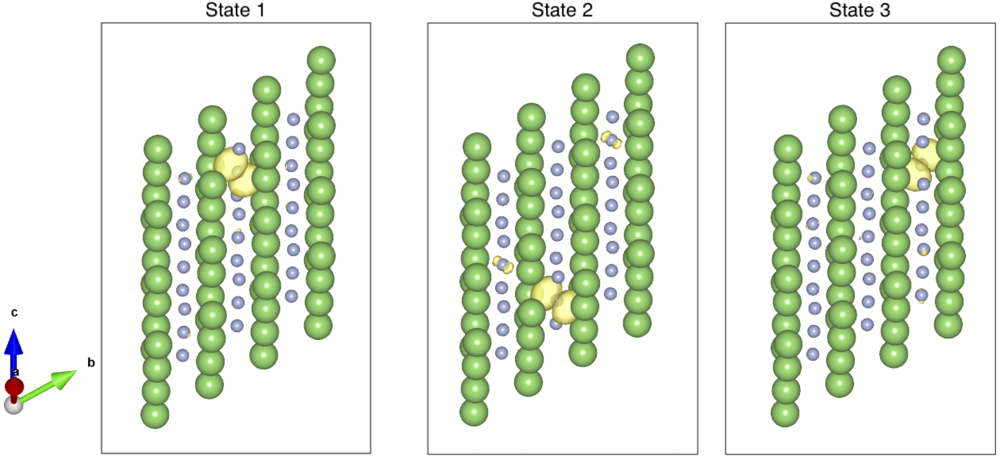

Note that state 1 and 3 are instances of a **triply-degenerate hole polaron**,
and oriented along two different directions of the <100> cubic family.
That's why they are close in binding energy (\~ 0.1 % difference), and the difference may decrease
if we ask for stricter convergence with [[vpq_tolgrs]].
These polarons have $D_{4h}$ point group symmetry.

However, state 2 possesses **different symmetry** ($D_{2h}$ point group) and is oriented along one of 6 direction of the <110> cubic family.

Having **multiple** and **degenerate** polaronic solutions for a single system is not surprising.
This happens due to the degeneracy of electronic states and can be seen already at the level of generalized Frohlich model [[cite:Vasilchenko2024]].
In *ab initio* calculations, this behaviour may be even more complex.

Also, note that these polarons localize on fluorine atoms and can occupy **any fluorine site** --
that's why we had to addittionaly treat the translational invariance.

!!! tip

    If you want to manually translate the polarons at visualization step, use the [[vpq_trvec]] variable.

!!! tip

    Obtained solutions can be used as a starting point for calculations with other $\kk/\qq$-meshes.
    For this, one has to provide the **VPQ** file via [[getvpq_filepath]], select a pstate via
    [[vpq_select]] and activate the interpolation using the [[vpq_interp]] tag.

    This way, one can try to propagate a solution through a series of calculations on progressively increasing
    meshes and achieve consistent localization of polaron.
    However, as the potential energy surfaces of polarons possess multiple minima, it is still recommended
    to check the consistency of the solutions between meshes.


Finally, let's look at the AbiPy capabilities to analyze individual contributions of the electronic bands
and phonon modes to the polaron formation.
This can be done with the `VpqFile` class which loads the **VPQ** NetCDF files and provides post-process tools.
With the following Python scripts

```python
from abipy.eph.vpq import VpqFile

ebands_file = "LiF_eph_varpeq/ebandso_GSR.nc"

vpq = VpqFile("teph4vpq_6o_VPQ.nc")

for polaron in vpq.polaron_spin:
    polaron.plot_ank_with_ebands(ebands_file, normalize=True)
```

```python
from abipy.eph.vpq import VpqFile

ddb_file = "LiF_eph_varpeq/out_DDB"

vpq = VpqFile("teph4vpq_6o_VPQ.nc")

for polaron in vpq.polaron_spin:
    polaron.plot_bqnu_with_ddb(ddb_file)
```

we can generate the following figures (it may take some time):

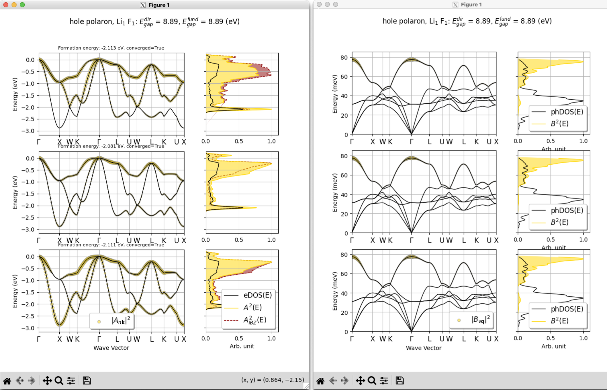

For each state, left and right figure show the contribution of the electronic bands and phonon modes to the polaron formation, respectively.
$\boldsymbol{A}$ and $\boldsymbol{B}$ coefficients are interpolated on $\kk/\qq$ paths -- that's why
we see such dense sampling although our coefficients have been obtained on 3x3x3 $\kk/\qq$ meshes.
These results are unconverged mainly due to the coarse mesh of the calculation, but still provide qualitative insights.

Note the difference between the $\boldsymbol{A}$ contribution for each state.
Even for the degenerate states 1 and 3 it is different, which is mainly due to the fact that
we used high-symmetry paths of the **pristine crystal** to plot them.
With polarons, we have a **symmetry-breaking** effect, and one have to use **special high-symmetry paths** for each polaron.
For states 1 and 3, for example, one of the three $\Gamma-X$ direction becomes inequivalent with the two others.
For state 2, the same will hold for the set of $\Gamma-K$ directions.

This inequivalency can also be seen in the A-DOS, which have been computed with (red) and without symmetries (golden).
If $\boldsymbol{A}$ coefficients have possesed the same symmetry as the crystal, these DOS would have been identical.
However, the detailed symmetry analysis of polarons is beyond the scope of this tutorial.


## Large electron polaron

Conceptually, calculations of large polarons follow the same flow as for small polarons.
The main difference is in the size of $\kk/\qq$-meshes we have to employ
as large polarons require large hosting supercells.
Here, we will obtain large electron polaron in LiF on 13x13x13 $\kk/\qq$-mesh.

Again, we will need **DDB**, **WFK** and **GSTORE** files to launch the VarPEq optimization.
The first two files are already available:
**DDB** has been precomputed, and we also have obtained **WFK** on 13x13x13 $\kk$-mesh at the NSCF step.

First, let's launch the gstore calculation with the input file



As usual, run this example with:

```sh
abinit teph4vpq_8.abi > teph4vpq_8.log 2> err &
```

While the calculation is running, let's examine the input file.
The main difference with our previous gstore runs, is the [[gstore_erange]] variable.
We use it to select the energy window near the CBM, so matrix elements $g_{mn\nu}(\kk,\qq)$
will be computed **ONLY** for wavevectors $\kk$ and scattering $\kk+\qq$ inside this window.
Energy filtering may **significantly** reduce memory requirements and computational time.

Of course, we could have used [[gstore_brange]] to select the entire conduction band.
However, as large polarons are **localized in reciprocal space**, states contributing to the polaron formation,
are confined within an energy window near the band edge.

!!! important

    Of course, in production calculations, one has to perform convergence studies wrt [[gstore_erange]].
    This can be done at a fixed $\kk/\qq$-mesh by increasing the energy window and monitoring the convergence
    of the polaron energy terms.

    In this example, 1 eV window is a bit too small for convergence.

!!! tip

    One can also use energy filtering at the step of computing the WFK files
    to achieve extra-dense meshes.
    See the corresponding section of the [mobility tutorial](/tutorial/eph4mob).


Once the **GSTORE** file has been computed, we can launch the variational optimization
(note that the [[vpq_pkind]] is now "electron", **mandatory**):



```sh
abinit teph4vpq_9.abi > teph4vpq_9.log 2> err &
```

??? note "Exercise"

    Try using AbiPy to analyze to results stored in the teph4vpq_9o_VPQ.nc file
    the same we have demonstrated for small polarons.
    Do these results match your expectations?
    Keep in mind that our calculations are underconverged.

    Of course, skip the extrapolation part, as we have not computed large polarons on
    progressively increasing meshes.
    Or do these calculations yourself if you are interested!


Finally, we can visualize the large polaron via the following input



```sh
abinit teph4vpq_10.abi > teph4vpq_10.log 2> err &
```

This produces usual `*xsf` files that can be used for viauslization.
If we open `teph4vpq_10o_pstate_1_POLARON.xsf` in VESTA, the following charge distribution can bee seen:

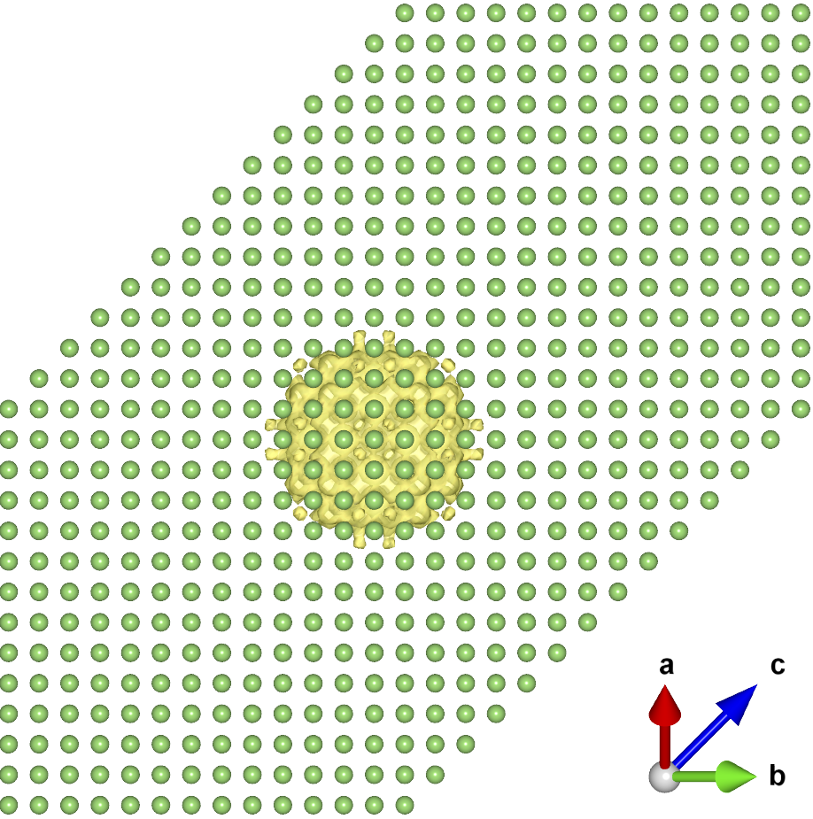


<!--
-->
