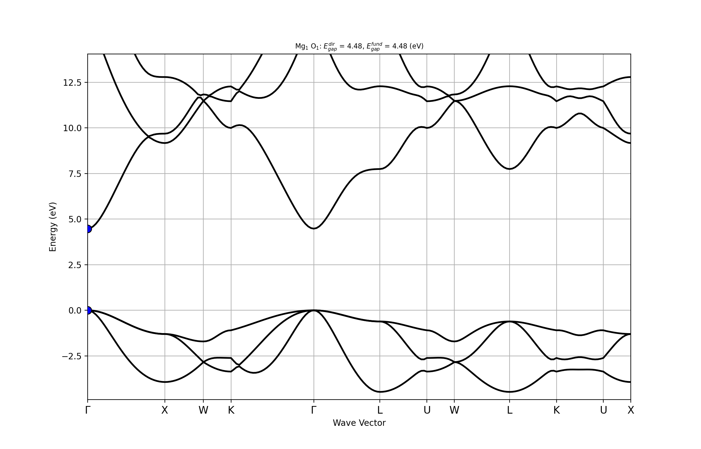
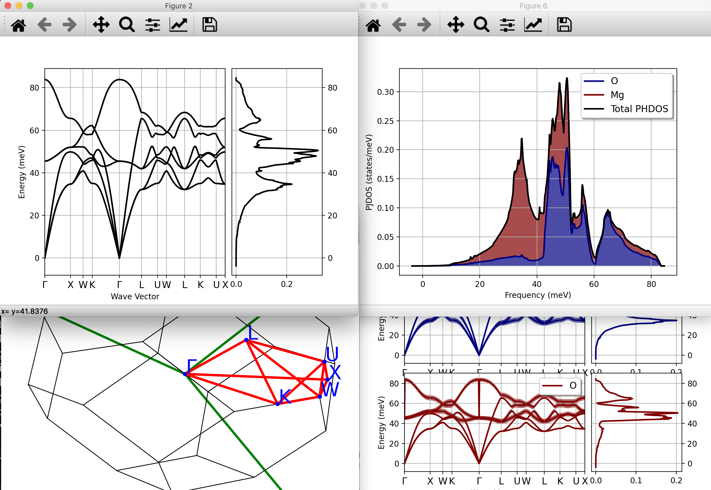
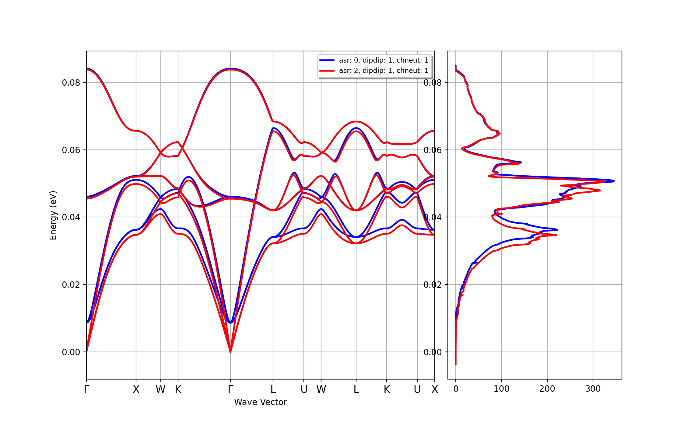
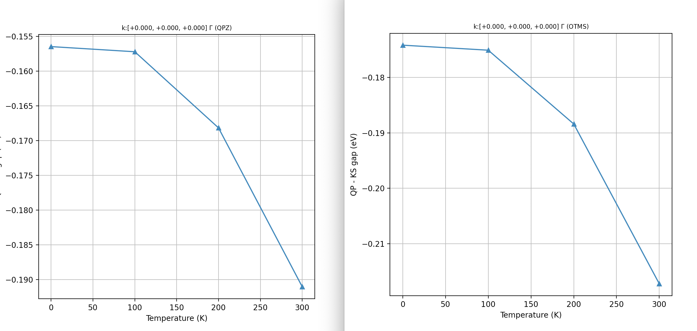
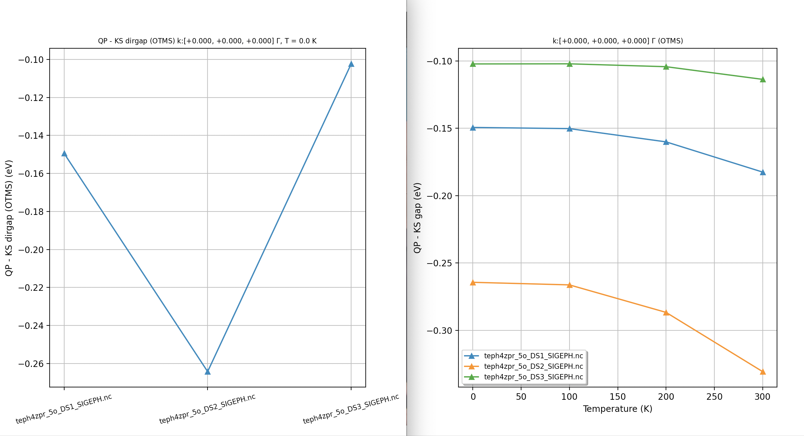
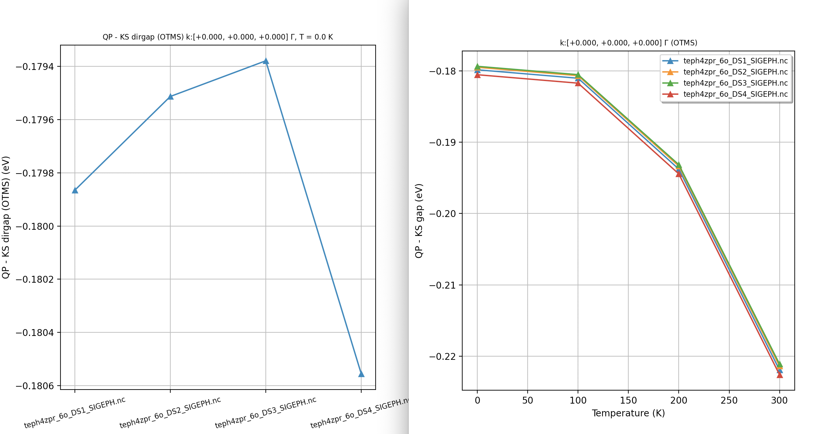
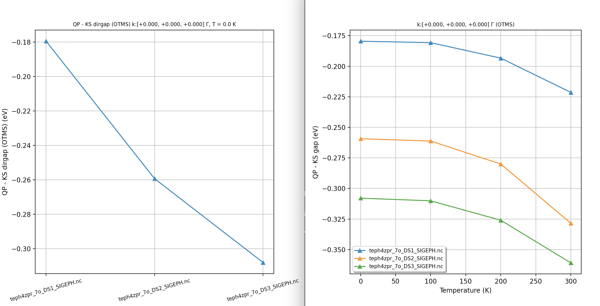

# Zero-point renormalization of the band gap and temperature-dependent band gaps

This tutorial explains how to compute the electron self-energy due to phonons, obtain the zero-point
renormalization (ZPR) of the band gap and temperature-dependent band energies within the harmonic approximation.
We start with a very brief overview of the many-body formalism in the context of the electron-phonon (e-ph) interaction.
Then we discuss how to evaluate the e-ph self-energy and perform typical convergence studies using MgO as example.
Further details concerning the implementation are given in [[cite:Gonze2019]] and [[cite:Romero2020]].

It is assumed the user has already completed the two tutorials [RF1](rf1) and [RF2](rf2),
and that he/she is familiar with the calculation of ground state and response properties
in particular phonons, Born effective charges and dielectric tensor.
It goes without saying that one should have read the [introduction page for the EPH code](eph_intro)
before running these examples.

This lesson should take about 1.5 hour.

## Formalism

The electron-phonon self-energy, $\Sigma^{\text{e-ph}}$, describes the renormalization of
charged electronic excitations due to the interaction with phonons.
This term should be added to the electron-electron (e-e) self-energy $\Sigma^{\text{e-e}}$
that encodes many-body effects induced by the Coulomb interaction beyond the classical electrostatic Hartree potential.
The e-e contribution can be estimated using, for instance, the $GW$ approximation but
in this tutorial we are mainly interested in $\Sigma^{\text{e-ph}}$ and its temperature dependence.

In semiconductors and insulators, indeed, most of temperature dependence of the electronic properties
at "low" T originates from the **e-ph interaction**
and the **thermal expansion** of the unit cell (topic that is not treated in this lesson).
Corrections due to $\Sigma^{\text{e-e}}$ are obviously important as it is well known that KS gaps computed
with LDA/GGA are systematically underestimated with respect to experiment
but the temperature dependence of $\Sigma^{\text{e-e}}$
is rather small as long as $kT$ is smaller than the fundamental gap (let's say $3 kT < E_{\text{g}}$).

In state-of-the-art *ab-initio* perturbative methods, the e-ph coupling is described
within DFT by expanding the KS effective potential up to the **second order in the atomic displacement**,
and the vibrational properties are obtained with DFPT [[cite:Gonze1997]], [[cite:Baroni2001]].
Note that anharmonic effects that become relevant at "high" temperature are not included in the present formalism.

The e-ph self-energy consists of two terms: the **frequency-dependent Fan-Migdal** (FM) self-energy
and the **static and Hermitian Debye-Waller** (DW) part (see e.g. [[cite:Giustino2017]] and references therein)

$$ \Sigma^\eph(\ww, T) = \Sigma^\FM(\ww, T) + \Sigma^{\DW}(T). $$

The diagonal matrix elements of the FM self-energy in the KS basis set are given by

\begin{equation}
\begin{split}
    \Sigma^\FM_{n\kk}(\omega, T) =
                & \sum_{m,\nu} \int_\BZ \frac{d\qq}{\Omega_\BZ} |\gkq|^2 \\
                & \times \left[
                    \frac{n_\qnu(T) + f_{m\kk+\qq}(\ef,T)}
                         {\omega - \emkq  + \wqnu + i \eta} \right.\\
                & \left. +
                    \frac{n_\qnu(T) + 1 - f_{m\kk+\qq}(\ef,T)}
                         {\omega - \emkq  - \wqnu + i \eta} \right] ,
\end{split}
\label{eq:fan_selfen}
\end{equation}

where $f_{m\kk+\qq}(\ef,T)$ and $n_\qnu(T)$ are the Fermi-Dirac and Bose-Einstein occupation functions
with $T$ the temperature and $\ef$ the Fermi level that in turns depends on T and the number of electron per unit cell.
The integration is performed over the $\qq$-points in the BZ of volume $\Omega_\BZ$ and $\eta$
is a positive real infinitesimal.

!!! important

    From a mathematical point of view, one should take the limit $\eta \rightarrow 0^+$.
    At the level of the implementation, the infinitesimal $\eta$ is replaced by a (small)
    finite value given by the [[zcut]] variable that should be subject to convergence studies.
    More specifically, one should monitor the convergence of the physical properties of interest
    as a function of [[zcut]] --> 0 and $\qq$-point sampling --> $\infty$.
    Convergence studies should start from values of [[zcut]] that are comparable to the typical phonon frequency
    of the system (usually 0.01 eV or smaller).
    Note that the default value for [[zcut]] is 0.1 eV.
    This value is reasonable for $GW$ calculations

The **static DW term** involves the second order derivative of the KS potential with respect to the nuclear displacements.
State-of-the-art implementations approximate the DW contribution with

\begin{equation}
\label{eq:dw_selfen}
\Sigma_{n\kk}^{\DW}(T) = \sum_{\qq\nu m} (2 n_{\qq\nu}(T) + 1) \dfrac{g_{mn\nu}^{2,DW}(\kk, \qq)}{\ee_{n\kk} - \ee_{m\kk}},
\end{equation}

where $g_{mn\nu}^{2,\DW}(\kk,\qq)$ is an effective matrix element that, within the **rigid-ion approximation**,
can be expressed in terms of the $\gkq$ matrix elements using the invariance of the QP energies
under infinitesimal translation [[cite:Giustino2017]].

At the level of the implementation, the number of bands in the two sums is defined by [[nband]]
while the $\qq$-mesh is specified by [[eph_ngqpt_fine]] (or [[ddb_ngqpt]] if the DFPT potentials are not interpolated).
The list of temperatures in Kelvin is defined by the [[tmesh]] input variable.
For the sake of simplicity, the dependence on $T$ will be omitted in the following of this tutorial.
Keep in mind, however, that all the equations in which $\Sigma$ is involved have an additional dependence on
the physical temperature T.

!!! important

    The EPH code takes advantage of spatial and time-reversal symmetries to reduce the BZ integration
    to an appropriate irreducible wedge, $\text{IBZ}_k$, defined by the little group of the $\kk$-point i.e.
    the set of point group operations of the crystal that leave the $\kk$-point invariant
    within a reciprocal lattice vector $\GG$.
    Calculations at high-symmetry $\kk$-points such as $\Gamma$ are therefore much faster as there
    are more symmetries that can be exploited.

    This symmetrization procedure is activated by default and can be disabled by setting [[symsigma]]
    to 0 for testing purposes.
    Note that when [[symsigma]] is set to 1, the code performs a final average of the QP results
    within each degenerate subspace.
    As a consequence, **accidental degeneracies won't be removed when the sum is performed in the $\text{IBZ}_k$**.

Both the FM and the DW term converge slowly with the number of empty states and the $\qq$-sampling.
<!--
The slow convergence with the number of bands is typical of many-body approaches based on explicit sums over empty states.
The $\qq$-mesh
-->
In order to accelerate the convergence with the bands, the EPH code can replace the contributions
given by the high-energy states above a certain band index $M$ with the solution
of a **non-self-consistent Sternheimer equation** in which only the first $M$ states are required.
The methodology, proposed in [[cite:Gonze2011]], is based on a **quasi-static approximation**
in which the phonon frequencies in the denominator of Eq.(\ref{eq:fan_selfen}) are neglected and
the frequency dependence of $\Sigma$ is approximated with the value computed at $\omega = \enk$.
This approximation is justified when the bands above $M$ are sufficiently high in energy with respect
to the $n\kk$ states that must be corrected.
The Sternheimer approach requires the specification of [[eph_stern]] and [[getpot_filepath]].
The parameter M corresponds to [[nband]] that, obviously, cannot be larger
than the number of states stored in the WFK file.

### Quasi-particle corrections due to e-ph coupling

Strictly speaking, the quasi-particle (QP) excitations are defined by the solution(s)
in the complex plane of the equation $$ z = \ee_\nk + \Sigma_\nk^{\text{e-ph}}(z) $$
provided the non-diagonal components of the self-energy can be neglected.
In practice, the problem is usually simplified by seeking approximated solutions along the real axis
following two different approaches: **on-the-mass-shell** and **linearized QP equation**.

In the on-the-mass-shell approximation, the QP energy is given by the real part
of the self-energy evaluated at the bare KS eigenvalue:

$$ \ee^\QP_\nk = \ee_\nk + \Re\, \Sigma_\nk^{\text{e-ph}}(\ee_\nk). $$

<!--
This approach is equivalent to a (thermal average of) standard time-dependent Rayleigh-Schrodinger perturbation theory.
-->
In the linearized QP equation, on the contrary, the self-energy is Taylor-expanded around
the KS eigenvalue and the QP correction is obtained using

$$ \ee^\QP_\nk = \ee_\nk + Z_\nk\,\Re  \Sigma^\text{e-ph}_\nk(\ee_\nk) $$

with the renormalization factor $Z_\nk$ given by

$$
  Z_\nk= \left(1 - \Re\left[ \frac{\partial\Sigma^\text{e-ph}_{\nk}}{\partial\ee}\right]\Bigg|_{\ee=\ee_\nk} \right)^{-1}.
$$

$Z_\nk$ corresponds to the area under the QP peak in the spectral function $A_\nk(\ww)$,
and values in the [0.7, 1] range usually indicate the presence of a well-defined QP excitations.
<!--
Finally, the ZPR is defined as the correction to the band gap for $T \rightarrow 0$.
-->

!!! important

    Both approaches are implemented in ABINIT although it should be noted that, according to recent works,
    the on-the-mass-shell approach provides results that are closer to those obtained
    with more advanced techniques based on the cumulant expansion [[cite:Nery2018]].


The EPH code can compute QP corrections only for $\nk$ states that are present in the input WFK file
(a similar requirement is present in the $GW$ code as well).
As a consequence, the $\kk$-mesh ([[ngkpt]], [[nshiftk]], [[shiftk]]) for the WFK file
should be chosen carefully especially if the band edges are not located at high-symmetry $\kk$-points.

There are different approaches one can use to specify the set of $\nk$ states in $\Sigma_{\nk}$.
Each approach has pros and cons.
The most direct way consists in specifying explicitly the $\kk$-points and the band range
using the three variables: [[nkptgw]], [[kptgw]], [[bdgw]]
For instance, in order to compute the correction for the VBM/CBM at $\Gamma$ in silicon
(non-magnetic semiconductor with 8 valence electrons per unit cell), one would use:

```sh
nkptgw 1
kptgw  0 0 0  # [3, nkptgw] array
bdgw   4 5    # [2, nkptgw] arary giving the initial and the last band index
              # for each nkptgw k-point
```

as the index of the valence band is given by 8 / 2 = 4.
Obviously, this input file will only provide the ZPR of the direct gap as Si has an indirect fundamental bandgap.
This the most flexible approach but it requires the specification of three variables and, obviously, one should
know where the CBM/VBM are located.
Alternatively, one can use [[gw_qprange]] or [[sigma_erange]].
<!--
Note that [[gw_qprange]] is mainly used to compute all the corrections for the occupied states plus
some conduction states
-->
Note that [[sigma_erange]] is usually employed for transport calculations with [[eph_task]] = -4.

!!! important

    When [[symsigma]] is set to 1 (default), the code may decide to enlarge the initial value of [[bdgw]]
    so that all **degenerate states** for that particular $\kk$-point are included in the calculation.

<!--

### Spectral function and Eliashberg functions

The spectral function is defined by:

$$
A_\nk(\ww) = -\dfrac{1}{\pi} \dfrac{\Im \Sigma_\nk(\ww)} {(\ww - \ee_\nk - \Re \Sigma_\nk(\ww)) ^ 2 + \Im \Sigma_\nk(\ww) ^ 2}
$$

The computation of the spectral function requires the specification of [[nfreqsp]] and [[freqspmax]].
The results are stored in the SIGMAPH.nc file for each $\nk$ state specified by the user.
-->

## Typical workflow for ZPR

A typical workflow for ZPR calculations requires the following steps:

1. **GS calculation** to obtain the WFK and the DEN file.
   The $\kk$-mesh should be dense enough to converge electronic and vibrational properties.
   Remember to set [[prtpot]] to 1 to produce the file with the KS potential required for the Sternheimer method.

2. **DFPT calculations** for all the IBZ $\qq$-points corresponding to the *ab-initio* [[ddb_ngqpt]] mesh
   that will be used to perform the Fourier interpolation of the dynamical matrix and of the DFPT potentials.
   In the simplest case, the DFPT part uses the WFK produced in step #1
   provided the $\qq$-mesh is equal to GS $\kk$-mesh or a sub-mesh.
   Remember to compute $\epsilon^{\infty}$, $Z^*$ (polar materials) and the dynamical quadrupoles
   $Q^*$ as these quantities are needed for an accurate
   interpolation of phonon frequencies and DFPT potentials.

3. **NSCF computation** of a WFK file on a much denser $\kk$-mesh containing the wavevectors
   where phonon-induced QP corrections are wanted. This calculation will use the DEN file produced in step #1.
   Remember to include enough empty states in the NSCF run so that it is possible to perform
   convergence studies wrt [[nband]] afterwards.

4. **Merge the partial DDB and POT files** with *mrgddb* and *mrgdvdb*, respectively

5. Start from the DDB/DVDB files produced in step #4 and the WFK file obtained in step #3
   to perform ZPR calculations with [[eph_task]] 4.

## Getting started

[TUTORIAL_README]

In this tutorial, we prefer to focus on the usage of the EPH code hence
we will be using **pre-computed** DDB and DFPT POT files to bypass the DFPT part.
We also provide a DEN.nc file that can be used to perform the NSCF calculations required
to generate WFK files on denser $\kk$-meshes and the file with the GS KS potential
required to solve the NSCF Sternheimer equation.

If *git* is installed on your machine, one can easily fetch the entire repository with:

```sh
git clone TODO
```

Alternatively, use *wget*:

```sh
wget TODO
```

or *curl*:

```sh
curl TODO
```

or simply copy the tarball by clicking the "download button" available in the github interface.


!!! warning

    The directory with the precomputed files must be located in the same working directory
    in which you will be executing the tutorial.

The |AbiPy| script used to perform the DFPT part is available here:



<!--
In a nutshell:
To produce these files, we used the experimental parameters for hexagonal $MgB_2$ (a = 5.8317 and c/a= 1.1419)
-->
Many parameters have been adjusted to find some compromise between accuracy and computational cost so
do not expect the results reported int this tutorial to be fully converged.
More specifically, we use norm-conserving pseudopotentials with a cutoff energy [[ecut]]
of 30 Ha (too low, it should be ~50 Ha).
The DFPT computations is done for the set of irreducible $\qq$-points corresponding
to a $\Gamma$-centered 4x4x4 $\qq$ mesh (again too coarse).
Since AbiPy does not supports multi datasets, each directory corresponds to a single calculation.
In particular, all the DFPT tasks (atomic perturbations, DDK, Electric field)
can be found inside the `w1` directory while `w1/outdata` contains the final DDB.

## How to extract useful info from the output files

As this is the first Abinit tutorial that uses precomputed output files, we believe
it is worth explaining how to use *ncdump*, *abitk* and AbiPy
to extract useful information concerning the previous calculations before moving to the EPH part.

Most of the netcdf files store the ABINIT input file in the **input_string** netcdf variable.
To print the value of this variable inside the terminal, use the *ncdump* utility and the syntax:

```sh
ncdump -v input_string MgO_eph_zpr/flow_zpr_mgo/w0/t0/outdata/out_DEN.nc

input_string = "jdtset 1 nband 12 ecut 35.0 ngkpt 4 4 4 nshiftk 1 shiftk 0 0 0 tolvrs 1e-12 nstep 150 iomode 3 prtpot 1 diemac 9.0 nbdbuf 4 paral_kgb 0 natom 2 ntypat 2 typat 2 1 znucl 8 12 xred 0.0000000000 0.0000000000 0.0000000000 0.5000000000 0.5000000000 0.5000000000 acell 1.0 1.0 1.0 rprim 0.0000000000 4.0182361526 4.0182361526 4.0182361526 0.0000000000 4.0182361526 4.0182361526 4.0182361526 0.0000000000" ;
```

The majority of the netcdf files contain info about the crystalline structure.
To print the crystalline structure to terminal, use the *abitk* Fortran executable shipped with the ABINIT package:
with the `crystal_print` command:

```md
abitk crystal_print MgO_eph_zpr/flow_zpr_mgo/w0/t0/outdata/out_DEN.nc

 ==== Info on the Cryst% object ====
 Real(R)+Recip(G) space primitive vectors, cartesian coordinates (Bohr,Bohr^-1):
 R(1)=  0.0000000  4.0182362  4.0182362  G(1)= -0.1244327  0.1244327  0.1244327
 R(2)=  4.0182362  0.0000000  4.0182362  G(2)=  0.1244327 -0.1244327  0.1244327
 R(3)=  4.0182362  4.0182362  0.0000000  G(3)=  0.1244327  0.1244327 -0.1244327
 Unit cell volume ucvol=  1.2975866E+02 bohr^3
 Angles (23,13,12)=  6.00000000E+01  6.00000000E+01  6.00000000E+01 degrees
 Time-reversal symmetry is present
 Reduced atomic positions [iatom, xred, symbol]:
    1)    0.0000000  0.0000000  0.0000000  Mg
    2)    0.5000000  0.5000000  0.5000000   O
```

In all the input files of this tutorial, we will be using the new [[structure]]
variable added in version 9 to initialize the unit cell from an external input file so that
we don't need to repeat this part over and over again in the input files.
The syntax of the new variable is:

```sh
structure "abifile:MgO_eph_zpr/flow_zpr_mgo/w0/t0/outdata/out_DEN.nc"
```

where the `abifile:` prefix tells the code that the lattice parameters and atomic positions
should be extracted from an Abinit binary file. Other formats are supported. See documentation.

<!--
To print the same info in a format that we can directly reuse in the ABINIT input file, use:
$ abitk crystal_abivars flow_zpr_mgo/w0/t0/outdata/out_DEN.nc
-->

Since we want to compute the renormalization of the band gap due to phonons, it is also useful
to have a look at the gaps computed from the $\kk$-mesh used to generate the DEN file:

```md
abitk ebands_gaps MgO_eph_zpr/flow_zpr_mgo/w0/t0/outdata/out_DEN.nc

 Direct band gap semiconductor
 Fundamental gap:     4.479 (eV)
   VBM:     4.490 (eV) at k: [ 0.0000E+00,  0.0000E+00,  0.0000E+00]
   CBM:     8.969 (eV) at k: [ 0.0000E+00,  0.0000E+00,  0.0000E+00]
 Direct gap:         4.479 (eV) at k: [ 0.0000E+00,  0.0000E+00,  0.0000E+00]
```

The same command can be used with many other netcdf files including e.g *GSR.nc*, *WFK.nc*.


!!! warning

    Our values for the gaps are consistent with the results for MgO given on the
    [materialsproject](https://materialsproject.org/materials/mp-1265/).
    Remember, however, that the values and the positions of the gaps may vary
    (in somes cases even significantly) depending on the $\kk$-sampling employed.

    In this case, *abitk* reports the gaps computed from a $\kk$-mesh as the DEN file can only be produced
    by a SCF calculation that requires an BZ-mesh.
    The results for MgO are OK simply because the CBM/VBM are at the $\Gamma$ point and **this point
    belongs to our GS $\kk$-mesh**.
    Other systems (e.g. Si) may have the CBM/VBM at wavevectors that are not easily captured with a homogeneous mesh.
    **The most reliable approach to find the location of the CBM/VBM is to perform a band structure calculation
    on a high-symmetry $\kk$-path.**


*abitk* is handy if you need to call Fortran routines from the terminal to perform basic tasks
but Fortran is not the best language when it comes to post-processing and data analysis.
This kind of operations, indeed, are much easier to implement in a high-level language such as python.
To plot the band structure using the GS eigenvalues stored in the GSR.nc file,
use the |abiopen| script provided by AbiPy with the `-e` option:

```sh
abiopen.py MgO_eph_zpr/flow_zpr_mgo/w0/t0/outdata/out_GSR.nc -e
```

 <!-- {: style="height:400px;width:400px"} -->


### How to merge partial files with mrgddb and mrgdv

First of all, let's merge the partial DDB files with the command

```sh
mrgddb < teph4zpr_1.in
```

and the following input file:



that lists the **relative paths** of the different partial DDB files.

Since we are dealing with a polar material, it is also worth checking whether our final DDB contains
Born effective charges and the electronic dielectric tensor.
Instead of running *anaddb* or *abinit* and check the output file, we can simply use:

```sh
abiopen MgO_eph_zpr/flow_zpr_mgo/w1//outdata/out_DDB -p

================================== DDB Info ==================================

Number of q-points in DDB: 8
guessed_ngqpt: [4 4 4] (guess for the q-mesh divisions made by AbiPy)
ecut = 35.000000, ecutsm = 0.000000, nkpt = 36, nsym = 48, usepaw = 0
nsppol 1, nspinor 1, nspden 1, ixc = 11, occopt = 1, tsmear = 0.010000

Has total energy: False, Has forces: False
Has stress tensor: False

Has (at least one) atomic pertubation: True
Has (at least one diagonal) electric-field perturbation: True
Has (at least one) Born effective charge: True
Has (all) strain terms: False
Has (all) internal strain terms: False
Has (all) piezoelectric terms: False
```

We can also invoke *anaddb* from python to have a quick look at the phonon dispersion with:

```text
abiview.py ddb MgO_eph_zpr/flow_zpr_mgo/w1//outdata/out_DDB

Computing phonon bands and DOS from DDB file with
nqsmall = 10, ndivsm = 20;
asr = 2, chneut = 1, dipdip = 1, lo_to_splitting = automatic, dos_method = tetra
```



The results seem reasonable: the acoustic modes go to zero linearly for $\qq \rightarrow 0$ 
as we are dealing with a 3d system and the band dispersion shows the LO-TO splitting typical of polar materials.

Note, however, that the acoustic sum-rule is automatically enforced by the code so 
it is always a good idea to compare the phonon dispersion with/without [[asr]] as this 
is an indirect indicator of the convergence/reliability of our calculations.
We can automate the process with the *ddb_asr* command of |abiview|:

```text
abiview.py ddb_asr MgO_eph_zpr/flow_zpr_mgo/w1//outdata/out_DDB
```

that produces the following figure:



This clearly indicates that the breaking of the acoustic sum-rule is not negligible.
The breaking is mainly due the too low cutoff energy employed.
In real life, we should repeat the DFTP calculation with a larger [[ecut]] and possible a denser $\qq$-mesh
but 


Now we can merge the DFPT potential with the *mrgdv* tool using the command.

```sh
mrgdvdb < teph4zpr_2.in
```

and the following input file:



!!! tip

    The number at the end of the POT file corresponds to the (*idir*, *ipert*) pertubation for that
    particular $\qq$-point. The sequential *pertcase* index is computed as:

    ```fortran
    pertcase = idir + ipert
    ```

    where *idir* species the reduced direction ([1, 2, 3])
    and *ipert* specifies the perturbation type
    (from 1 up to [[natom]] if the perturbation is an atomic displacement, natom + 1 for DDK)
    All DFPT POT files with 1 <= pertcase <= 3 x [[natom]] therefore correspond to atomic pertubations for a
    given $\qq$-point.


```sh
If you don't remember the FFT mesh used to generate the DEN file, use
abitk hdr_print MgO_eph_zpr/flow_zpr_mgo/w0/t0/outdata/out_DEN.nc

===============================================================================
 ECHO of part of the ABINIT file header

 First record :
.codvsn,headform,fform = 9.1.5      80   52

 Second record :
 bantot,intxc,ixc,natom  =    96     0    11     2
 ngfft(1:3),nkpt         =    30    30    30     8
 nspden,nspinor          =     1     1
 nsppol,nsym,npsp,ntypat =     1    48     2     2
 occopt,pertcase,usepaw  =     1     0     0
 ecut,ecutdg,ecutsm      =  3.0000000000E+01  3.0000000000E+01  0.0000000000E+00
 ecut_eff                =  3.0000000000E+01
 qptn(1:3)               =  0.0000000000E+00  0.0000000000E+00  0.0000000000E+00
 rprimd(1:3,1)           =  0.0000000000E+00  4.0182361526E+00  4.0182361526E+00
 rprimd(1:3,2)           =  4.0182361526E+00  0.0000000000E+00  4.0182361526E+00
 rprimd(1:3,3)           =  4.0182361526E+00  4.0182361526E+00  0.0000000000E+00
 stmbias,tphysel,tsmear  =  0.0000000000E+00  0.0000000000E+00  1.0000000000E-02

 The header contain   4 additional records.
```

to print the header. Use `--prtvol 1` to output more records.

In the output file produced by *mrgdv*



there is a section for each $\qq$-point reporting the atomic perturbations that have been merged in the database.

```md
 qpoint: [ 0.0000E+00,  0.0000E+00,  0.0000E+00] is present in the DVDB file
 The list of irreducible perturbations for this q vector is:
    1)  idir= 1, ipert=   1, type=independent, found=Yes
    2)  idir= 2, ipert=   1, type=symmetric, found=No
    3)  idir= 3, ipert=   1, type=symmetric, found=No
    4)  idir= 1, ipert=   2, type=independent, found=Yes
    5)  idir= 2, ipert=   2, type=symmetric, found=No
    6)  idir= 3, ipert=   2, type=symmetric, found=No
```

**symmetric** means that this particular *(idir, ipert)* can be reconstructed by symmetry
from the other **independent** entries.
All the independent entries should be present and you should get the following message:
at the end of the output file:

```md
 All the independent perturbations are available
 Done
```

This indicates that our final DVDB database is complete in the sense that the EPH code will be able
to reconstruct by symmetry all the 3 [[natom]] perturbations for each $\qq$-point.

!!! warning

    If you don't get this message, the DVDB cannot be used by the EPH code.
    In this case, check carefully your input files and the list of files that have been merged.

## Computing the WFK files

At this point we have all the ingredients required to compute/interpolate
the e-ph scattering potentials (DDB and DVDB) and we can finally start to generate the WFK files.

For our first NSCF calculation, we use a 4x4x4 $\Gamma$-centered $\kk$-mesh and 100 bands.
The number of bands is sufficiently large so that we can perform initial convergence studies.
We also perform a NSCF calculation on a high-symmetry $\kk$-path to locate
the position of the KS band edges as these are the states we want to correct.
We use [[getden_filepath]] to read the DEN.nc file instead of [[getden]] or [[irdden]].

The input file is:



```sh
nband 100
nbdbuf 10
ecut 30.0

ngkpt 4 4 4
nshiftk 1
shiftk 0 0 0

nstep 150
tolwfr 1e-15
iscf -2          # NSCF run from DEN.nc

getden_filepath "MgO_eph_zpr/flow_zpr_mgo/w0/t0/outdata/out_DEN.nc"
```

Note the use of [[nbdbuf]].
As mentioned in the documentation of the variable, **high energy states require more iterations to convergence**.
To avoid wasting precious computing time, we use a buffer that is ~10% of [[nband]].
This tricks significantly reduces the wall-time as the NSCF calculation completes when
only the first [[nband]] - [[nbdbuf]] states are converged within [[tolwfr]].
Obviously, one should not use the last [[nbdbuf]] states in the subsequent EPH calculation.
The same trick is highly recommended when performing $GW$ calculations.

!!! important

    For mobility calculations, it is possible to reduce significantly the cost of the WFK computation
    by restricting the NSCF calculation to the $\kk$-points inside the electron (hole) pockets
    relevant for transport.
    Unfortunately, this optimization is not possible when computing the real part of the self-energy
    as the integration must be performed in the full $\text{IBZ}_\kk$.
    On the other hand, ZPR calculations can take advange of the Sternheimer method to reduce the number
    of empty bands required to converge.

## Our first ZPR calculation

For our first example, we use a minimalistic input file that allows us
to discuss the most important input variables and the organization of the main output file.
First of all, let's run the code using:

```sh
abinit teph4zpr_4.in > teph4zpr_4.log 2> err &
```

with the following input file:



!!! tip

    You may want to run the examples in parallel with MPI using e.g.

        mpirun -n 2 abinit teph4zpr_4.in > teph4zpr_4.log 2> err &

    The EPH code will automatically distribute the workload using a predefined distribution scheme
    (not necessarily the most efficient in terms of memory and wall-time).
    In the last part of the tutorial, we explain how to specify a particular
    MPI distribution scheme with [[eph_np_pqbks]].

Let's now discuss the meaning of the different variables in more detail.
We use [[optdriver]] 7 to enter the EPH code while [[eph_task]] 4 activates
the computation of the full self-energy (real + imaginary part).
The paths to the external files (**DDB**, **WFK**, **DVDB**) are specified
by the three variables [[getddb_filepath]], [[getwfk_filepath]], and [[getdvdb_filepath]]:

```sh
getddb_filepath "teph4zpr_1_DDB"

ddb_ngqpt 4 4 4  # The code expects to find in the DDB
                 # all the IBZ q-points corresponding to a 4x4x4 q-mesh

getdvdb_filepath "teph4zpr_2_DVDB"
getwfk_filepath "teph4zpr_3o_WFK"  # 4x4x4 k-mesh with 70 bands
```

The mesh for electrons ([[ngkpt]], [[nshiftk]] and [[shiftk]]) must
correspond to the one used for the input WFK file.
[[ddb_ngqpt]] is set to 4x4x4 as this is the $\qq$-mesh used in the DFPT part to generate the DDB and DVDB file,
but the integration in $\qq$-space is performed with the [[eph_ngqpt_fine]] mesh.
As [[eph_ngqpt_fine]] differs from [[ddb_ngqpt]], the code will automatically activate
the interpolation of the DFPT potentials as discussed in the [introduction to the EPH code](eph_intro).
The $\qq$-space integration is defined by [[eph_intmeth]] and [[zcut]].
<!--
Default is standard quadrature when the full self-energy is wanted.
The tetrahedron method is also implemented but it is not very efficient.
-->
Since we have computed the phonon band structure with [[ph_ndivsm]], [[ph_nqpath]], [[ph_qpath]]
and the phonon DOS with [[ph_ngqpt]],
the jobs has produced several output files with phonon quantities and QP results.


We can now have a look at the main output file:



First of all, we have a section that summarizes the most important parameters:

```md
 Number of bands in e-ph self-energy sum: 30
 From bsum_start: 1 to bsum_stop: 30
 Symsigma: 1 Timrev: 1
 Imaginary shift in the denominator (zcut): 0.010 [eV]
 Method for q-space integration:  Standard quadrature
 Both Real and Imaginary part of Sigma will be computed.
 Number of frequencies along the real axis: 0 , Step: 0.000 [eV]
 Number of frequency in generalized Eliashberg functions: 0
 Number of temperatures: 1 From: 0.000000E+00 to 0.000000E+00 [K]
 Ab-initio q-mesh from DDB file: [4, 4, 4]
 Q-mesh used for self-energy integration [ngqpt]: [8, 8, 8]
 Number of q-points in the IBZ: 29
 asr: 1 chneut: 1
 dipdip: 1 symdynmat: 1
 No special treatment of Frohlich divergence in gkq for q --> 0
 Number of k-points for self-energy corrections: 1
 List of K-points for self-energy corrections:
   1     1  [ 0.0000E+00,  0.0000E+00,  0.0000E+00]   6    9
```

Note how the acoustic sum-rule ([[asr]]), the charge neutrality of the Born effective charges ([[chneut]]),
the treatment of dipole-dipole interaction in the dynamical matrix ([[dipdip]]),
and the symmetrization of the dynamical matrix ([[symdynmat]]) are activated by default in v9.

Then we find another section related to MPI parallelism.
In this case we are running in sequential but the output will change if we use more than one CPU
(see also [[eph_np_pqbks]])
The final message informs the user that the EPH code will interpolate the scattering potentials.

```md
 === MPI parallelism ===
P Allocating and summing bands from my_bsum_start: 1 up to my_bsum_stop: 30
P Number of CPUs for parallelism over perturbations: 1
P Number of perturbations treated by this CPU: 6
P Number of CPUs for parallelism over q-points: 1
P Number of q-points in the IBZ treated by this proc: 29 of 29
P Number of CPUs for parallelism over bands: 1
P Number of CPUs for parallelism over spins: 1
P Number of CPUs for parallelism over k-points: 1
P Number of k-point in Sigma_nk treated by this proc: 1 of 1

 Cannot find eph_ngqpt_fine q-points in DVDB --> Activating Fourier interpolation.
```

Finally, we have the section with the QP results for each spin, $\kk$-point and temperature,
followed by the value of the direct gap computed with the two approaches (linearized QP equation and OTMS):

```md
================================================================================
 Final results in eV.
 Notations:
     eKS: Kohn-Sham energy. eQP: quasi-particle energy.
     eQP - eKS: Difference between the QP and the KS energy.
     SE1(eKS): Real part of the self-energy computed at the KS energy, SE2 for imaginary part.
     Z(eKS): Renormalization factor.
     FAN: Real part of the Fan term at eKS. DW: Debye-Waller term.
     DeKS: KS energy difference between this band and band-1, DeQP same meaning but for eQP.
     OTMS: On-the-mass-shell approximation with eQP ~= eKS + Sigma(omega=eKS)
     TAU(eKS): Lifetime in femtoseconds computed at the KS energy.
     mu_e: Fermi level for given (T, nelect)


K-point: [ 0.0000E+00,  0.0000E+00,  0.0000E+00], T:    0.0 [K], mu_e:    7.568
   B    eKS     eQP    eQP-eKS   SE1(eKS)  SE2(eKS)  Z(eKS)  FAN(eKS)   DW      DeKS     DeQP
   6   4.474    4.572    0.098    0.152   -0.006    0.644   -0.265    0.417    0.000    0.000
   7   4.474    4.572    0.098    0.152   -0.006    0.644   -0.265    0.417    0.000    0.000
   8   4.474    4.572    0.098    0.152   -0.006    0.644   -0.265    0.417    0.000    0.000
   9   8.959    8.857   -0.102   -0.106   -0.000    0.963    0.107   -0.213    4.485    4.285

 KS gap:    4.485 (assuming bval:8 ==> bcond:9)
 QP gap:    4.285 (OTMS:    4.227)
 QP_gap - KS_gap:   -0.200 (OTMS:   -0.258)
```

The run has produced the following output files:

```sh
$ ls teph4zpr_4o_*

teph4zpr_4o_EBANDS.agr  teph4zpr_4o_PHBANDS.agr
teph4zpr_4o_PHDOS.nc    teph4zpr_4o_PHBST.nc    teph4zpr_4o_SIGEPH.nc
```

where:

- EBANDS.agr --> Electron bands in |xmgrace| format. See also [[prtebands]]
- PHBST.agr --> Phonon bands in |xmgrace| format. See also [[prtphbands]]
- PHDOS.nc  --> Phonon DOS in netcdf format
- PHPBST.nc  --> Phonon band structure in netcdf format
- SIGEPH.nc  --> Netcdf file with $\Sigma^{\text{e-ph}}$ results.


With |AbiPy|, one can print the results to terminal using the `-p` option (`--print`):

```text
$ abiopen.py teph4zpr_4o_SIGEPH.nc -p

============================ SigmaEPh calculation ============================
Calculation type: Real + Imaginary part of SigmaEPh
Number of k-points in Sigma_{nk}: 1
sigma_ngkpt: [0 0 0], sigma_erange: [0. 0.]
Max bstart: 5, min bstop: 9
Initial ab-initio q-mesh:
	ngqpt: [4 4 4], with nqibz: 8
q-mesh for self-energy integration (eph_ngqpt_fine): [4 4 4]
k-mesh for electrons:
	mpdivs: [4 4 4] with shifts [[0. 0. 0.]] and kptopt: 1
Number of bands included in e-ph self-energy sum: 30
zcut: 0.00037 (Ha), 0.010 (eV)
Number of temperatures: 4, from 0.0 to 300.0 (K)
symsigma: 1
Has Eliashberg function: False
Has Spectral function: False

Printing QP results for 2 temperatures. Use --verbose to print all results.

KS, QP (Z factor) and on-the-mass-shell (OTMS) direct gaps in eV for T = 0.0 K:
  Spin  k-point                              KS_gap    QPZ_gap    QPZ - KS    OTMS_gap    OTMS - KS
------  ---------------------------------  --------  ---------  ----------  ----------  -----------
     0  [+0.000, +0.000, +0.000] $\Gamma$     4.479      4.323      -0.156       4.305       -0.174


KS, QP (Z factor) and on-the-mass-shell (OTMS) direct gaps in eV for T = 300.0 K:
  Spin  k-point                              KS_gap    QPZ_gap    QPZ - KS    OTMS_gap    OTMS - KS
------  ---------------------------------  --------  ---------  ----------  ----------  -----------
     0  [+0.000, +0.000, +0.000] $\Gamma$     4.479      4.288      -0.191       4.262       -0.217

```

where `QPZ` stands for the results obtained with the linearized QP equation and the Z factor and
`OTMS` are the results with the on-the-mass-shell approach.

We can also plot the most important results by just replacing `-p` with `-e` (`--expose`):



On the left, we have the direct gap at $\Gamma$ ad a function of T while the OTMS results are shown in the right panel.
In both cases, the direct band gap - that for MgO equals the fundamental gap -
decreases with increasing temperature.
This is the so-called Varshni's effect that is observed in many (but not all) semiconductors.

The ZPR computed with the two approaches differ by ~26 meV but this is expected as
the linearized QP equations reduces to the OTMS only if the $Z$ factor is very close to one or if there is
some sort of fortuitous cancellation between the CBM/VBM corrections.
In our calculation, the Z factor for the VBM is 0.644 while for the CBM we obtain Z = 0.963.
On physical grounds, these values are reasonable as Z corresponds to the area under the QP peak
in the spectral function and values in [~0.7, 1] indicates a well-defined QP excitations.
Still it's not uncommon to obtain unphysical Z factors in e-ph calculations i.e. values > 1,
especially for states far from the band edge as the e-ph self-energy has a lot of structure in frequency-space
and the linearized QP approach is not always justified.
For this reason, in the rest of the tutorial, we will be focusing on the OTMS results.

!!! important

    To compute the imaginary part of $\Sigma^{\text{e-ph}}$ at the KS energy, we **strongly recommend** to use
    [[eph_task]] -4 as this option activates several important optimizations that are not possible
    when the full self-energy is wanted.
    Note, however, that [[eph_task]] -4 is not able to provide the full frequency dependence, only the
    value of the imaginary part at the KS eigenvalue.
    The computation of spectral functions and Eliashberg functions therefore requires [[eph_task]] +4.

## Convergence wrt nband

At this point it should be not so difficult to write an input file to perform ZPR
calculations for different values of [[nband]] at fixed $\qq$-mesh.
It is just a matter of adding the following set of variables to the previous input file:

```sh
ndtset 3
nband: 20
nband+ 20
```

An example is given in



!!! important

    The multidataset syntax is quite handy when running small calculations but you can achieve a much better
    speedup if you split the calculation using different input files as these jobs are independent
    and can be thus executed in parallel.

Run the calculation, as usual, using

```sh
abinit teph4zpr_5.in > teph4zpr_5.log 2> err &
```

Now we can extract the results from the output file



or, alternatively, use the AbiPy |abicomp| script to post-process the results stored in the **SIGPEPH** files:

```sh
abicomp.py sigeph teph4zpr_5o_DS*_SIGEPH.nc -e
```



The two figures show the convergence of the OTMS results.
The figure on the left shows the convergence of the ZPR as a function of [[nband]].
The figure on the right, shows the correction to the KS band gas as a function or
T obtained for different number of bands.
A similar behaviour is observed also for the linearized equation.

The results are quite disappointing in the sense that the QP corrections are far from converge!
A more careful (and expensive) convergence study would reveal that 300 bands are needed.
This computation, although feasible, would be to costly for a tutorial and is left as extra exercise.
In the next section,  we will see that the EPH code provides a much more efficient algorithm
to accelerate the convergence.

??? note "Exercise"

    Change the input file to use [[mixprec]] 1 and [[boxcutmin]] 1.1.
    Rerun the calculation and compare with the previous results.
    Do you see significant differences? What about the wall-time?

## How to reduce the number of bands with the Sternheimer method

This section discusses how to use the Sternheimer method to accelerate the convergence with [[nband]].
To activate the Sternheimer approach, we need to set [[eph_stern]] to 1
and use the [[getpot_filepath]] input variable to specify the external file with the GS KS potential.
This file is produced at the end of the GS calculations provided we set [[prtpot]] to 1 in the input file.
The Sternheimer equation is solved non-self-consistently using max [[nline]] NSCF iterations
and the solver stops when the first-order wavefunction is converged within [[tolwfr]].
Default values for these two variables are provided if they are not specified by the user in the input file.
The code aborts if the solver does not converge.

From the user's point of view, the Sternheimer method requires to add the following section to our initial input:

```sh
eph_stern 1
getpot_filepath "MgO_eph_zpr/flow_zpr_mgo/w0/t0/outdata/out_POT.nc"

# nline 100 tolwfr 1e-16 # Default values
```

An example of input file is provided in:



in which we perform four calculations with different values of [[nband]]:

```sh
ndtset 4
nband: 10
nband+ 10
```

to monitor the convergence of the QP corrections.

Run the calculation with:

```sh
abinit teph4zpr_6.in > teph4zpr_6.log 2> err &
```

that produces the following output file:



To analyze the convergence behavior, pass the SIGEPH files to the |abicomp| script:

```sh
abicomp.py sigeph teph4zpr_6o_DS*_SIGEPH.nc -e
```



Now the convergence is much better (note the different scale on the y-axis)
and the ZPR is converged with 1 meV for nband ??
This is the value one should obtain when summing all the bands up to maximum number of plane-waves [[mpw]].

!!! important

    The big advange of the Sternheimer method is that we don't need to compute WFK files with many
    empty bands in order to converge the real part of the self-energy.
    This means that one can use the computing power to densify the $\kk$-mesh while keeping the number of
    empty states at a reasonable level.
    Producing a WFK file with 1000 bands and a $100^3$ $\kk$-mesh is indeed way more expensive than
    performing the same computation with, let's say, 50 bands.

    Note, however, that the cost of the Sternheimer method quickly increases with [[nband]]
    due to the orthogonalization process. This means that a ZPR calculation with 300 bands (occ + empty)
    **without** the Sternheimer method is much faster than the same computation done with [[eph_stern]] 1.
    As a matter of fact, we use the Sternheimer method so that we don't need 300 bands to convergence the results.

??? note "Exercise"

    Generate a new WFK with [[nband]] ~ [[mpw]] and run a ZPR calculation without the Sternheimer method.
    Compare the sum-over-states results with the Sternheimer ones.
    Why it is not a good idea to use nband >= mpw?

## Convergence of the ZPR wrt the q-mesh

In the previous sections, we found that XXX bands with the Sternheimer method are enough to converge.
In this part of the tutorial, we fix this value for *nband* and perform a convergence study
wrt to the $\qq$-sampling
Unfortunately, we won't be able to fully convergence the results but at least
you will get an idea on how to perform this kind of convergence studies.

In the third input *teph4zpr_7.in*, we have computed WFK files on different $\kk$-meshes
and a relatively small number of empty states (XXX).
We can finally use the other WFK files generated in *teph4zpr_3.in* to perform ZPR calculations.

```sh
 ndtset 3

 ngkpt1 4 4 4;    eph_ngqpt_fine1 4 4 4;    getwfk_filepath1 "teph4zpr_3o_DS1_WFK"
 ngkpt2 8 8 8;    eph_ngqpt_fine2 8 8 8;    getwfk_filepath2 "teph4zpr_3o_DS2_WFK"
 ngkpt3 12 12 12; eph_ngqpt_fine3 12 12 12; getwfk_filepath3 "teph4zpr_3o_DS3_WFK"
```



Run the calculation, as usual, with:

```sh
abinit teph4zpr_7.in > teph4zpr_7.log 2> err &
```

to produce the following output file:



Now we can use


```sh
abicomp.py sigeph teph4zpr_7o_DS*_SIGEPH.nc -e
```

to analyze the convergence with the $\qq$-mesh:



The convergence of the ZPR is shown in the left panel while T-dependent band gaps obtained
with different $\qq$-meshes are reported in the right panel.

Obviously we are still far from convergence but a 12x12x12 $\qq$-mesh is the best we can afford in a tutorial.
It is clear that one should test denser $\qq$-meshes and, last but not least, monitor the behaviour for [[zcut]] --> 0.
These additional convergence tests cannot be covered in this lesson and they are left as exercise.

<!--
### How to compute the spectral function

The maximum [[nfreqsp]] and [[freqspmax]].
-->

### MPI parallelism and memory requirements

There is an important difference with respect to [[eph_task]] -4 (computation of the imaginary part)
that is worth discussing in more detail.
When computing the imaginary part at the KS energy for transport properties,
the EPH code is able to filter both $\kk$- and $\qq$-points so that only the relevant states
around the band edge(s) are stored in memory.
Unfortunately, in the case of full self-energy calculations, this filtering algorithm
is not possible and each MPI process needs to read and store all the KS wavefunctions in the IBZ
in order to compute e-ph matrix elements connecting $\kk$ to $\kq$.
In other words, the wavefunctions in the IBZ are not MPI-distributed and this leads to a significant
increase in the memory requirements, especially for dense meshes and/or large [[nband]].
Fortunately, the code is able to distribute bands among the MPI processes
hence the memory required for the wavefunctions will scale as [[nband]] / **np_band** where **np_band**
is the number of MPI processes in the band communicator.

For ZPR calculations the priorities are as follows:

1. Use enough *np_band* MPI processes to decrease the memory for the wavefunctions.
   Ideally, *np_band* should divide [[nband]] to distribute the work equally.
   Note that the band parallelism is beneficial also when the Sternheimer method is used
   as the Sternheimer solver will operate on MPI-distributed bands.
   Perhaps the parallel efficiency won't be perfect but the memory for the wavefunctions will continue to scale.

2. Once the memory for the wavefunctions reaches a reasonable amount, activate the parallelism
   over perturbations in order to decrease the memory for $W(\rr, \RR, \text{3 natom})$.
   For better efficiency, *eph_nperts* should divide 3 * [[natom]].

3. If the memory for the wavefunctions and $W(\rr, \RR, \text{3 natom})$ is under control,
   you may want to activate the $\qq$-point parallelism to speedup the calculation.

4. Finally, use the $\kk$-point parallelism if there are enough CPUs available to boost the calculation.
   Obviously, this kind of parallelism makes sense if you are computing QP corrections for several $\kk$ points
   and the number of *np_kpt* MPI processes should be adjusted accordingly,
   Keep in mind, however, that each $\kk$-point has a different computational cost so load imbalance is expected.

Finally, remember that setting [[boxcutmin]] to a value smaller than 2 (e.g. 1.1)
leads to a significant memory reduction while [[mixprec]] = 1 decreases the computational cost of the FFT.

### Estimating the ZPR with a generalized Fr\"ohlich model

Last but not least, one can estimate the correction to the ZPR in polar materials
using a generalized Fr\"ohlich model based on *ab initio* effective masses computed with DFPT [[cite:Laflamme2016]]
The formalism is detailed in XXX.
An example of input file is available in [[test:v7_88]].
