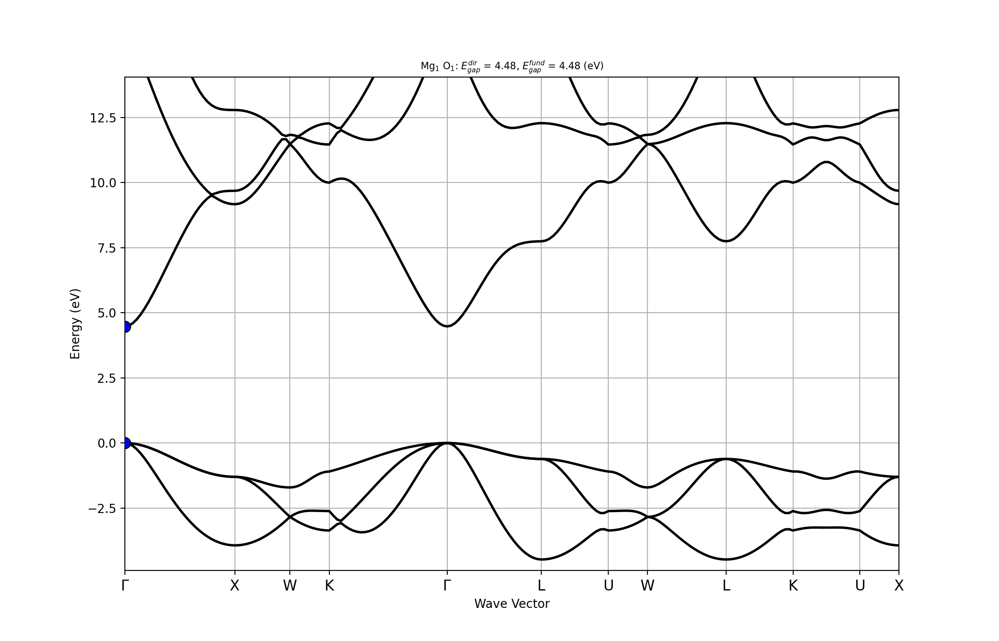
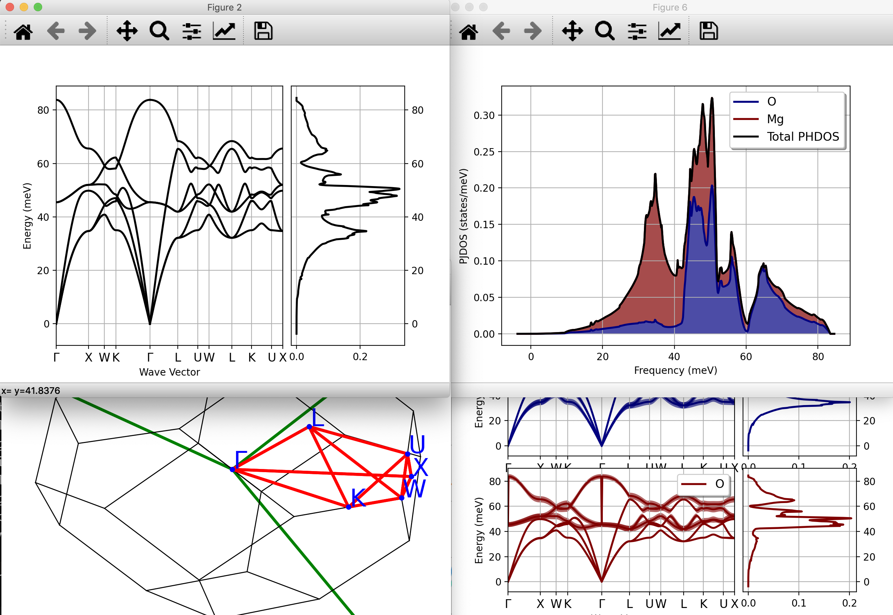
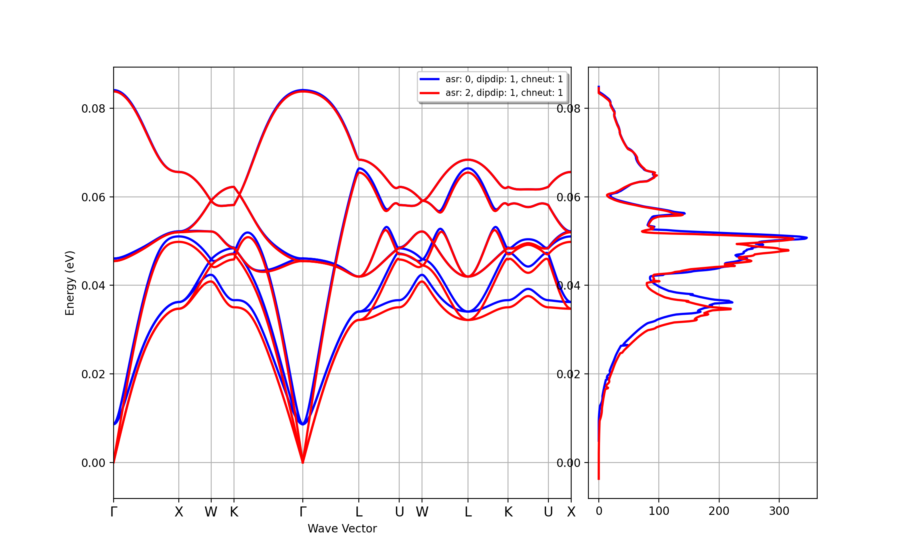
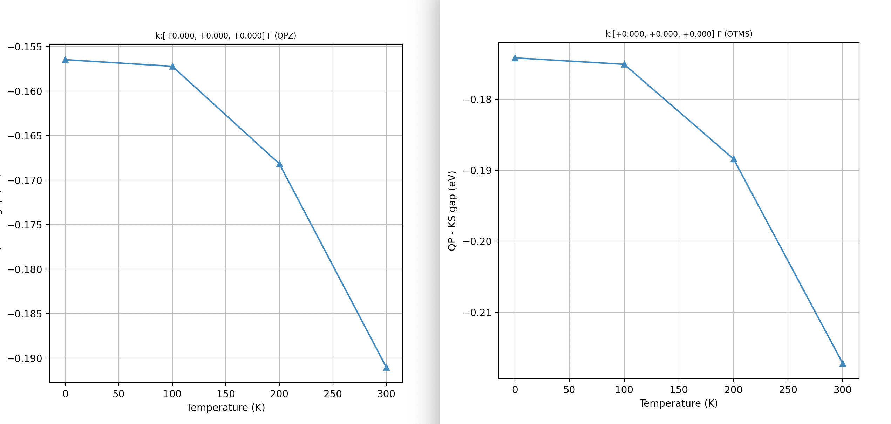
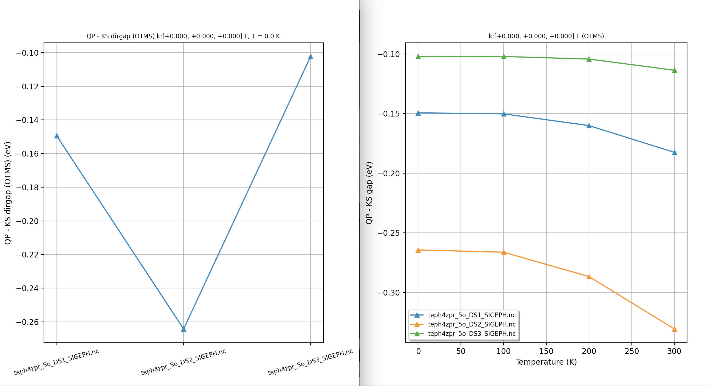
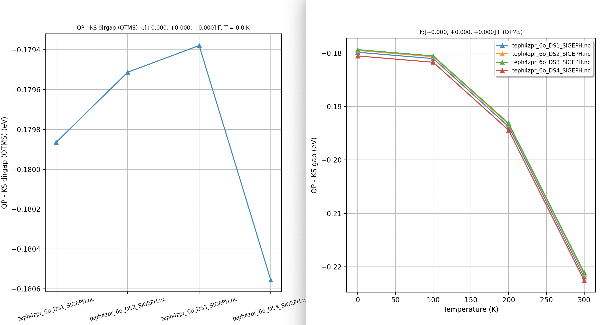
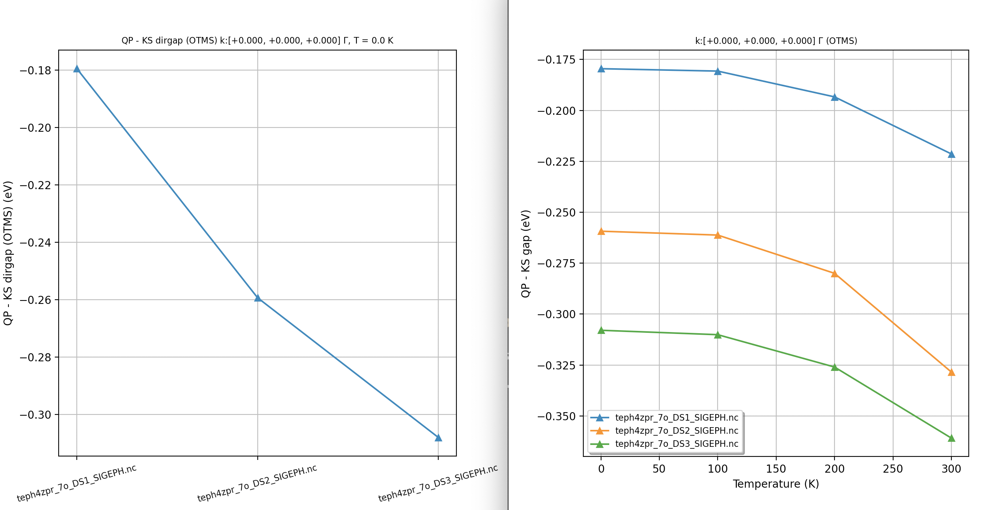
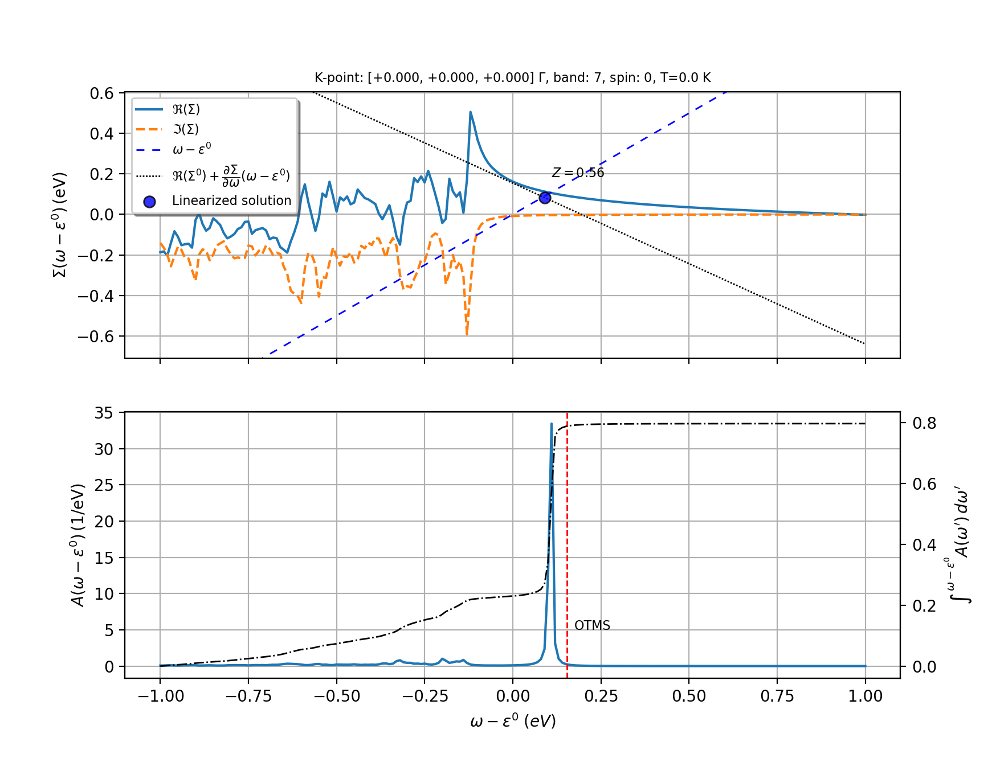
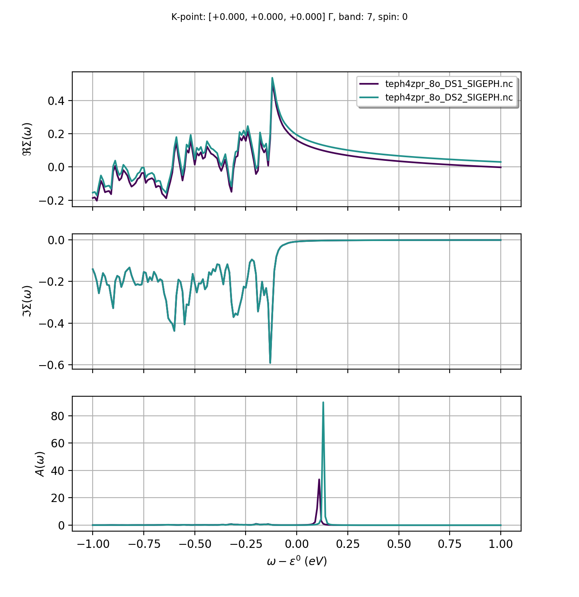

# Zero-point renormalization of the band gap and temperature-dependent band gaps

This tutorial explains how to compute the electron self-energy due to phonons, obtain the zero-point renormalization (ZPR) of the band gap, and determine temperature-dependent band energies within the harmonic approximation. We begin with a brief overview of the many-body formalism in the context of the electron-phonon (e-ph) interaction. We then discuss how to evaluate the e-ph self-energy and perform typical convergence studies using the polar semiconductor MgO as an example. Further details concerning the implementation are provided in [[cite:Gonze2019]] and [[cite:Romero2020]]. Additional examples are available in this [jupyter notebook](https://nbviewer.jupyter.org/github/abinit/abitutorials/blob/master/abitutorials/sigeph/lesson_sigeph.ipynb), which explains how to use Abipy to automate calculations and post-process results for Diamond.

It is assumed the user has already completed the two tutorials [RF1](../tutorial/rf1.md) and [RF2](../tutorial/rf2.md),
and that they are familiar with the calculation of ground state (GS) and response properties
in particular phonons, Born effective charges and the high-frequency dielectric tensor.
The user should have read the [introduction tutorial for the EPH code](../tutorial/eph_intro.md)
before running these examples.

This lesson should take about 1.5 hour.

## Formalism

The electron-phonon self-energy, $\Sigma^{\text{e-ph}}$, describes the renormalization of charged electronic excitations due to their interaction with phonons. This term should be added to the electron-electron (e-e) self-energy $\Sigma^{\text{e-e}}$, which encodes many-body effects induced by the Coulomb interaction beyond the classical electrostatic Hartree potential. The e-e contribution can be estimated using, for instance, the [$GW$ approximation](../tutorial/gw1.md), but this tutorial focuses primarily on $\Sigma^{\text{e-ph}}$ and its temperature dependence.

In semiconductors and insulators, most of the temperature dependence of electronic properties at "low" $T$ originates from the **e-ph interaction** and the **thermal expansion** of the unit cell (a topic that, however, will not be discussed in this lesson). Corrections due to $\Sigma^{\text{e-e}}$ are undeniably important, as it is well known that KS gaps computed with LDA/GGA are systematically underestimated compared to experimental data. Nevertheless, the temperature dependence of $\Sigma^{\text{e-e}}$ is relatively small as long as $kT$ is significantly smaller than the fundamental gap (e.g., $3 kT < E_{\text{g}}$).

In state-of-the-art *ab initio* perturbative methods, the e-ph coupling is described within DFT by expanding the KS effective potential up to the **second order in the atomic displacements**, and vibrational properties are computed using DFPT [[cite:Gonze1997]], [[cite:Baroni2001]]. Note that anharmonic effects, which may become relevant at "high" $T$, are not included in this formalism.

The e-ph self-energy consists of two terms: the **frequency-dependent Fan-Migdal** (FM) self-energy and the **static and Hermitian Debye-Waller** (DW) part (see, e.g., [[cite:Giustino2017]] and references therein):

$$ \Sigma^\eph(\ww, T) = \Sigma^\FM(\ww, T) + \Sigma^{\DW}(T). $$

The diagonal matrix elements of the FM self-energy in the KS basis set are given by

\begin{equation}
\begin{split}
    \Sigma^\FM_{n\kk}(\omega, T) =
                & \sum_{m,\nu} \int_\BZ \frac{d\qq}{\Omega_\BZ} |\gkq|^2 \\
                & \times \left[
                    \frac{n_\qnu(T) + f_{m\kk+\qq}(\ef,T)}
                         {\omega - \emkq  + \wqnu + i \eta} \right.\\
                & \left. +
                    \frac{n_\qnu(T) + 1 - f_{m\kk+\qq}(\ef,T)}
                         {\omega - \emkq  - \wqnu + i \eta} \right],
\end{split}
\label{eq:fan_selfen}
\end{equation}

where $f_{m\kk+\qq}(\ef,T)$ and $n_\qnu(T)$ are the Fermi-Dirac and Bose-Einstein occupation functions at physical temperature $T$; $\ef$ is the Fermi level, which in turn depends on $T$ and the number of electrons per unit cell. The integration is performed over the $\qq$-points in the Brillouin zone (BZ) of volume $\Omega_\BZ$, and $\eta$ is a positive real infinitesimal.

!!! important

    From a mathematical point of view, one should take the limit $\eta \rightarrow 0^+$.
    In the implementation, the infinitesimal $\eta$ is replaced by a small finite value defined by the [[zcut]] variable, which should be subject to convergence studies.
    More specifically, one should monitor the convergence of the physical properties of interest as [[zcut]] $\rightarrow 0^+$ and the number of $\qq$-points $\rightarrow \infty$.
    Convergence studies should start with values of [[zcut]] comparable to the typical phonon frequencies of the system (usually 0.01 eV or smaller).
    Note that the default value for [[zcut]] is 0.1 eV.
    While this value is reasonable for $GW$ calculations, it is likely too large when computing $\Sigma^{\text{e-ph}}$.

The **static DW term** involves the second-order derivative of the KS potential with respect to nuclear displacements. State-of-the-art implementations approximate the DW contribution as:

\begin{equation}
\label{eq:dw_selfen}
\Sigma_{n\kk}^{\DW}(T) = \sum_{\qq\nu m} (2 n_{\qq\nu}(T) + 1) \dfrac{g_{mn\nu}^{2,DW}(\kk, \qq)}{\ee_{n\kk} - \ee_{m\kk}},
\end{equation}

where $g_{mn\nu}^{2,\DW}(\kk,\qq)$ is an effective matrix element that, within the **rigid-ion approximation**, can be expressed in terms of standard first-order $\gkq$ matrix elements by exploiting the invariance of the QP energies under infinitesimal translation [[cite:Giustino2017]].

At the level of the implementation, the number of bands in the two sums is defined by [[nband]]
while the $\qq$-mesh for the integration is specified by [[eph_ngqpt_fine]]
(or [[ddb_ngqpt]] if the DFPT potentials are not interpolated).
The list of temperatures (in Kelvin) is initialized from [[tmesh]].

For the sake of simplicity, we will omit the $T$-dependence in the next equations.
Keep in mind, however, that all the expressions in which $\Sigma$ is involved
have an additional dependence on the physical temperature $T$.

!!! important

    The EPH code takes advantage of time-reversal and spatial symmetries to reduce the BZ integration to a suitable irreducible wedge, $\text{IBZ}_\kk$, defined by the little group of the $\kk$-point (the set of point group operations of the crystal that leave the $\kk$-point invariant within a reciprocal lattice vector $\GG$).
    Calculations at high-symmetry $\kk$-points, such as $\Gamma$, are therefore significantly faster because more symmetries can be exploited (resulting in a smaller $\text{IBZ}_k$).

    This symmetrization procedure is activated by default and can be disabled by setting [[symsigma]]
    to 0 for testing purposes.
    Note that when [[symsigma]] is set to 1, the code performs a final average of the QP results
    within each degenerate subspace.
    As a consequence, **accidental degeneracies won't be removed** when [[symsigma]] is set to 1.

Both the FM and the DW terms converge slowly with $\qq$-sampling. Moreover, precise computation of the real part requires the inclusion of a large number of empty states.

To accelerate convergence with [[nband]], the EPH code can replace contributions from high-energy states above a certain band index $M$ with the solution of a **non-self-consistent Sternheimer equation**, which requires only the first $M$ states. This methodology, proposed in [[cite:Gonze2011]], is based on a **quasi-static approximation** where phonon frequencies in the denominator of Eq. (\ref{eq:fan_selfen}) are neglected, and the frequency dependence of $\Sigma$ is approximated by the value computed at $\omega = \enk$. This approximation is justified when the bands above $M$ are **sufficiently high in energy** compared to the $n\kk$ states being corrected.
The Sternheimer approach requires the specification of [[eph_stern]] and [[getpot_filepath]].
The parameter $M$ corresponds to the [[nband]] input variable that, obviously,
**cannot be larger than the number of bands stored in the WFK file**
(the code will abort if this condition is not fulfilled).

### Quasi-particle corrections due to the e-ph coupling

Strictly speaking, the quasi-particle (QP) excitations are defined by the solution(s)
in the complex plane of the equation $$ z = \ee_\nk + \Sigma_\nk^{\text{e-ph}}(z) $$
provided the non-diagonal components of the e-ph self-energy can be neglected.
In practice, the problem is usually simplified by seeking **approximated solutions along the real axis**
following two different approaches:

1. **on-the-mass-shell**
2. **linearized QP equation**.

In the on-the-mass-shell approximation, the QP energy is simply given by the real part
of the self-energy evaluated at the bare KS eigenvalue:

$$ \ee^\QP_\nk = \ee_\nk + \Re\, \Sigma_\nk^{\text{e-ph}}(\ee_\nk). $$

<!--
This approach is equivalent to a (thermal average of) Rayleigh-Schrodinger perturbation theory.
-->
In the linearized QP equation, on the contrary, the self-energy is Taylor-expanded around
the bare KS eigenvalue and the QP correction is obtained using

$$ \ee^\QP_\nk = \ee_\nk + Z_\nk\,\Re  \Sigma^\text{e-ph}_\nk(\ee_\nk) $$

with the renormalization factor $Z_\nk$ given by

$$
  Z_\nk = \left(1 - \Re\left[ \frac{\partial\Sigma^\text{e-ph}_{\nk}}{\partial\ee}\right]\Bigg|_{\ee=\ee_\nk} \right)^{-1}.
$$

Note that $Z_\nk$ is approximately equal to the area under the QP peak in the spectral function:

$$
A_\nk(\ww) =
-\dfrac{1}{\pi} | \Im G_\nk(\omega) | =
-\dfrac{1}{\pi} \dfrac{\Im \Sigma_\nk(\ww)} {(\ww - \ee_\nk - \Re \Sigma_\nk(\ww)) ^ 2 + \Im \Sigma_\nk(\ww) ^ 2}
$$

Since $A_\nk(\ww)$ integrates to 1, values of $Z_\nk$ in the [0.7, 1] range usually indicate a well-defined QP excitation, which may be accompanied by some **background** and possibly additional **satellites**. Values of $Z_\nk$ greater than one are unphysical and signal the breakdown of the linearized QP equation. Interpreting these results requires careful analysis of $A_\nk(\ww)$ and further convergence tests.

!!! important

    Both approaches are implemented in ABINIT although it should be noted that, according to recent works,
    the on-the-mass-shell approach provides results that are closer to those obtained
    with more advanced techniques based on the cumulant expansion [[cite:Nery2018]].

The ZPR of the excitation energy is defined as the difference between the QP energy evaluated at $T = 0$ and the bare KS energy. Similarly, the ZPR of the gap is defined as the difference between the QP band gap at $T = 0$ and the KS gap.

It is worth stressing that the EPH code can compute QP corrections only for the $n\kk$ states present in the input WFK file (a requirement similar to that of the $GW$ code). Consequently, the $\kk$-mesh ([[ngkpt]], [[nshiftk]], [[shiftk]]) for the WFK file should be chosen carefully, particularly if the band edges are not located at high-symmetry $\kk$-points.

Several approaches can be used to specify the set of $n\kk$ states in $\Sigma_{n\kk}$, each with its own advantages and disadvantages. The most direct method involves specifying $\kk$-points and the band range using three variables: [[nkptgw]], [[kptgw]], and [[bdgw]]. For instance, to compute the correction for the VBM/CBM at $\Gamma$ in silicon (a non-magnetic semiconductor with 8 valence electrons per unit cell), one would use:

```sh
nkptgw 1
kptgw  0 0 0  # [3, nkptgw] array
bdgw   4 5    # [2, nkptgw] array giving the initial and final band indices
              # for each nkptgw k-point
```

as the index of the valence band is $8 / 2 = 4$. Obviously, this input can only provide the ZPR of the direct gap, as silicon has an indirect fundamental gap. This is the most flexible approach, but it requires specifying three variables and knowing the positions of the CBM/VBM in advance.
Alternatively, one can use [[gw_qprange]] or [[sigma_erange]].
<!--
although *sigma_erange* is usually employed for transport calculations with [[eph_task]] = -4.
Note that [[gw_qprange]] is mainly used to compute all the corrections for the occupied states plus
some conduction states
-->

!!! important

    When [[symsigma]] is set to 1 (default), the code may decide to enlarge the initial value of [[bdgw]]
    so that all **degenerate states** for that particular $\kk$-point are included in the calculation.

## Typical workflow for ZPR

A typical workflow for ZPR calculations involves the following steps (see the [introductory e-ph tutorial](../tutorial/eph_intro.md)):

1. **GS calculation** to obtain WFK and DEN files. The $\kk$-mesh should be dense enough to converge both electronic and vibrational properties. Remember to set [[prtpot]] to 1 to produce the KS potential file required by the Sternheimer method.

2. **DFPT calculations** for all IBZ $\qq$-points corresponding to the *ab initio* [[ddb_ngqpt]] mesh used for Fourier interpolation of the dynamical matrix and DFPT potentials. In the simplest case, one uses a $\qq$-mesh equal to the GS $\kk$-mesh (sub-meshes are also acceptable), and the DFPT calculations can start directly from the WFK produced in step 1. Remember to compute $\bm{\epsilon}^{\infty}$, $\bm{Z}^*$ (for polar materials), and the dynamical quadrupoles $\bm{Q}^*$, as these are necessary for precise interpolation of phonon frequencies and DFPT potentials.

3. **NSCF computation** of a WFK file on a much denser $\kk$-mesh containing the wavevectors where phonon-induced QP corrections are desired. The NSCF run uses the DEN file produced in step 1. Remember to compute **enough empty states** to allow for subsequent convergence studies with respect to [[nband]].

4. **Merge the partial DDB and POT files** using *mrgddb* and *mrgdvdb*, respectively.

5. **Perform ZPR calculations** with [[eph_task]] 4, starting from the DDB/DVDB files produced in step 4 and the WFK file obtained in step 3.

## Getting started

[TUTORIAL_README]

Before beginning, you might consider working in a different subdirectory, as in the other tutorials. Why not create `Work_eph4zpr` in `$ABI_TESTS/tutorespfn/Input`?

```sh
cd $ABI_TESTS/tutorespfn/Input
mkdir Work_eph4zpr
cd Work_eph4zpr
```

In this tutorial, we focus on the use of the EPH code; therefore, we will use **pre-computed** DDB and DFPT POT files to bypass the DFPT stage. We also provide a `DEN.nc` file to initialize the NSCF calculations and a POT file with the GS KS potential required to solve the Sternheimer equation.

If *git* is installed on your machine, you can easily fetch the entire repository (23 MB) using:

```sh
git clone https://github.com/abinit/MgO_eph_zpr.git
```

Alternatively, use *wget*:

```sh
wget https://github.com/abinit/MgO_eph_zpr/archive/master.zip
```

Or *curl*:

```sh
curl -L https://github.com/abinit/MgO_eph_zpr/archive/master.zip -o master.zip
```

or simply copy the tarball by clicking the "download button" available in the github web page,
unzip the file and rename the directory with:

```sh
unzip master.zip
mv MgO_eph_zpr-master MgO_eph_zpr
```

The directory containing the precomputed files must be named `MgO_eph_zpr` and located in the same working directory where you will be executing the tutorial.

The |AbiPy| script used to execute the DFPT part is available [here](https://github.com/abinit/MgO_eph_zpr/blob/master/run_zpr_mgo.py). Note that several parameters have been tuned to achieve a reasonable compromise between precision and computational cost; therefore, do not expect the results obtained at the end of the lesson to be fully converged. More specifically, we use norm-conserving pseudopotentials with a cutoff energy [[ecut]] of 30 Ha (which is somewhat low; it should ideally be ~50 Ha). DFPT computations are performed for the set of irreducible $\qq$-points corresponding to a $\Gamma$-centered 4x4x4 $\qq$-mesh (which is also relatively coarse). $\bm{Z}^*$ and $\bm{\epsilon}^\infty$ are also computed with these same settings.

Since AbiPy does not support multiple datasets, each directory corresponds to a single calculation. In particular, all DFPT tasks (atomic perturbations, DDK, and electric field perturbations) can be found in the `w1` directory, while `w0/t0/outdata` contains the GS results, and `w0/t1/outdata` holds the GSR file with energies on a high-symmetry $\kk$-path.

## Extracting useful information from output files

Since this is the first tutorial to use precomputed output files, it is worth explaining how to use terminal utilities such as *ncdump*, *abitk*, and |AbiPy| scripts to extract information before moving to EPH calculations.

Most netcdf files produced by ABINIT store the input variables in string format within the **input_string** variable. This can be useful if you need to know exactly how a particular output file was generated. To print the value of **input_string** in the terminal, use the *ncdump* utility:

```sh
ncdump -v input_string MgO_eph_zpr/flow_zpr_mgo/w0/t0/outdata/out_DEN.nc

input_string = "jdtset 1 nband 12 ecut 35.0 ngkpt 4 4 4 nshiftk 1 shiftk 0 0 0 tolvrs 1e-12 nstep 150 iomode 3 prtpot 1 diemac 9.0 nbdbuf 4 paral_kgb 0 natom 2 ntypat 2 typat 2 1 znucl 8 12 xred 0.0000000000 0.0000000000 0.0000000000 0.5000000000 0.5000000000 0.5000000000 acell 1.0 1.0 1.0 rprim 0.0000000000 4.0182361526 4.0182361526 4.0182361526 0.0000000000 4.0182361526 4.0182361526 4.0182361526 0.0000000000" ;
```
```

In all the examples of this tutorial, we will be using the new [[structure]]
input variable (added in version 9) to initialize the unit cell from an external file so that
we don't need to repeat the unit cell over and over again in all the input files.
The syntax is :

```sh
structure "abifile:MgO_eph_zpr/flow_zpr_mgo/w0/t0/outdata/out_DEN.nc"
```

where the `abifile` prefix tells ABINIT that the lattice parameters and atomic positions
should be extracted from an ABINIT binary file e.g. HIST.nc, DEN.nc, GSR.nc, etc.
(other formats are supported as well, see the documentation).

To print the crystalline structure to terminal, use the *abitk* Fortran executable
shipped with the ABINIT package and the `crystal_print` command:

```md
abitk crystal_print MgO_eph_zpr/flow_zpr_mgo/w0/t0/outdata/out_DEN.nc

 ==== Info on the Cryst% object ====
 Real(R)+Recip(G) space primitive vectors, cartesian coordinates (Bohr,Bohr^-1):
 R(1)=  0.0000000  4.0182362  4.0182362  G(1)= -0.1244327  0.1244327  0.1244327
 R(2)=  4.0182362  0.0000000  4.0182362  G(2)=  0.1244327 -0.1244327  0.1244327
 R(3)=  4.0182362  4.0182362  0.0000000  G(3)=  0.1244327  0.1244327 -0.1244327
 Unit cell volume ucvol=  1.2975866E+02 bohr^3
 Angles (23,13,12)=  6.00000000E+01  6.00000000E+01  6.00000000E+01 degrees
 Time-reversal symmetry is present
 Reduced atomic positions [iatom, xred, symbol]:
    1)    0.0000000  0.0000000  0.0000000  Mg
    2)    0.5000000  0.5000000  0.5000000   O
```

This is the crystalline structure that we will be using in the forthcoming examples.
<!--
To print the same info in a format that we can directly reuse in the ABINIT input file, use:
$ abitk crystal_abivars flow_zpr_mgo/w0/t0/outdata/out_DEN.nc
-->

Since we want to compute the renormalization of the band gap due to phonons, it is also useful
to have a look at the KS gaps obtained from the GS run.
The command is:

```md
abitk ebands_gaps MgO_eph_zpr/flow_zpr_mgo/w0/t0/outdata/out_DEN.nc

 Direct band gap semiconductor
 Fundamental gap:     4.479 (eV)
   VBM:     4.490 (eV) at k: [ 0.0000E+00,  0.0000E+00,  0.0000E+00]
   CBM:     8.969 (eV) at k: [ 0.0000E+00,  0.0000E+00,  0.0000E+00]
 Direct gap:         4.479 (eV) at k: [ 0.0000E+00,  0.0000E+00,  0.0000E+00]
```

The same *abitk* command can be used with all netcdf files containing KS energies e.g *GSR.nc*, *WFK.nc*.

!!! warning

Our gap values are consistent with the results for MgO provided by the [Material Project](https://materialsproject.org/materials/mp-1265/). Remember, however, that the gap values and positions may vary (in some cases significantly) depending on the $\kk$-sampling.

In this case, *abitk* reports gaps computed from the same $\kk$-mesh used to produce the DEN file during the SCF calculation. The results for MgO are correct primarily because the CBM/VBM are located at the $\Gamma$ point, which **is included in the GS $\kk$-mesh**. Other systems (e.g., silicon) may have extrema at wavevectors that are not easily captured by a homogeneous mesh. **The most reliable approach to find the CBM/VBM location is to perform a band structure calculation along a high-symmetry $\kk$-path.**

*abitk* is handy if you need to call Fortran routines from the terminal to perform basic tasks
but Fortran is not the best language when it comes to post-processing and data analysis.
This kind of operation, indeed, is much easier to implement using a high-level language such as python.
To plot the band structure using the GS eigenvalues stored in the GSR.nc file,
use the |abiopen| script provided by AbiPy with the `-e` option:

```sh
abiopen.py MgO_eph_zpr/flow_zpr_mgo/w0/t1/outdata/out_GSR.nc -e
```



The figure confirms that the gap is direct at the $\Gamma$ point.
The VBM is three-fold degenerate when SOC is not included.


## How to merge partial DDB files with mrgddb

First of all, let's merge the partial DDB files with the command

```sh
mrgddb < teph4zpr_1.abi
```

and the following input file:



that lists the **relative paths** of the **partial DDB files** in the
`MgO_eph_zpr` directory.

Since we are dealing with a polar material, it is worth checking whether our final DDB contains
Born effective charges and the electronic dielectric tensor.
Instead of running *anaddb* or *abinit* and then checking the output file,
we can simply use |abiopen| with the `-p` option:

```sh
abiopen.py MgO_eph_zpr/flow_zpr_mgo/w1//outdata/out_DDB -p

================================== DDB Info ==================================

Number of q-points in DDB: 8
guessed_ngqpt: [4 4 4] (guess for the q-mesh divisions made by AbiPy)
ecut = 35.000000, ecutsm = 0.000000, nkpt = 36, nsym = 48, usepaw = 0
nsppol 1, nspinor 1, nspden 1, ixc = 11, occopt = 1, tsmear = 0.010000

Has total energy: False, Has forces: False
Has stress tensor: False

Has (at least one) atomic pertubation: True
Has (at least one diagonal) electric-field perturbation: True
Has (at least one) Born effective charge: True
Has (all) strain terms: False
Has (all) internal strain terms: False
Has (all) piezoelectric terms: False
```

We can also invoke *anaddb* directly from python to have a quick look at the phonon dispersion:

```text
abiview.py ddb MgO_eph_zpr/flow_zpr_mgo/w1//outdata/out_DDB

Computing phonon bands and DOS from DDB file with
nqsmall = 10, ndivsm = 20;
asr = 2, chneut = 1, dipdip = 1, lo_to_splitting = automatic, dos_method = tetra
```

that produces the following figures:



The results seem reasonable: the acoustic modes go to zero linearly as $\qq \rightarrow 0$ (as expected for a 3D system), no instability is present, and the phonon dispersion shows the LO-TO splitting typical of polar materials.

Note, however, that the acoustic sum-rule (ASR) is automatically enforced by the code; it is always a good idea to compare results with and without [[asr]], as this serves as an indirect indicator of the convergence and reliability of the calculations.
We can automate the process with the *ddb_asr* command of |abiview|:

```text
abiview.py ddb_asr MgO_eph_zpr/flow_zpr_mgo/w1//outdata/out_DDB
```

that produces the following figure:



!!! important

    This clearly indicates that the breaking of the acoustic sum-rule is not negligible.
    In this case, the breaking is mainly due the too low cutoff energy employed in our calculations.
    In real life, one should stop here and redo the DFPT calculation with a larger [[ecut]]
    and possibly a denser $\qq$-mesh but since the goal of this lesson is to teach you how
    to run ZPR calculations, **we ignore this serious problem and continue with the other examples**.

    PS: If you want to compute the phonons bands with/without [[dipdip]], use:

    ```text
    abiview.py ddb_dipdip MgO_eph_zpr/flow_zpr_mgo/w1//outdata/out_DDB
    ```

## How to merge partial POT files with mrgdv

Now we can merge the DFPT potential with the *mrgdv* tool using the command.

```sh
mrgdv < teph4zpr_2.abi
```

and the following input file:



!!! tip

    The number at the end of the POT file corresponds to the (*idir*, *ipert*) perturbation for that particular $\qq$-point. The *pertcase* index is computed as:

    ```fortran
    pertcase = idir + 3 * (ipert-1)
    ```

    where *idir* specifies the direction ([1, 2, 3]) and *ipert* defines the perturbation type:

    - *ipert* in [1, ..., *natom*] corresponds to atomic perturbations (reduced directions)
    - *ipert* = *natom* + 1 corresponds to $d/dk$ (reduced directions)
    - *ipert* = *natom* + 2 corresponds to the electric field
    - *ipert* = *natom* + 3 corresponds to uniaxial stress (Cartesian directions)
    - *ipert* = *natom* + 4 corresponds to shear stress (Cartesian directions)

    All DFPT POT files with 1 <= *pertcase* <= 3 x [[natom]] therefore correspond to atomic perturbations for a given $\qq$-point.

    The value of *pertcase* and *qpt* are reported in the ABINIT header.
    To print the header to terminal, use *abitk* with the *hdr_print* command

    ```sh
     abitk hdr_print MgO_eph_zpr/flow_zpr_mgo/w1/t11/outdata/out_POT4.nc

     ===============================================================================
     ECHO of part of the ABINIT file header

     First record :
    .codvsn,headform,fform = 9.2.0      80  111

     Second record :
     bantot,intxc,ixc,natom  =   480     0    11     2
     ngfft(1:3),nkpt         =    32    32    32    40
     nspden,nspinor          =     1     1
     nsppol,nsym,npsp,ntypat =     1    48     2     2
     occopt,pertcase,usepaw  =     1     4     0
     ecut,ecutdg,ecutsm      =  3.5000000000E+01  3.5000000000E+01  0.0000000000E+00
     ecut_eff                =  3.5000000000E+01
     qptn(1:3)               =  5.0000000000E-01  0.0000000000E+00  0.0000000000E+00
     rprimd(1:3,1)           =  0.0000000000E+00  4.0182361526E+00  4.0182361526E+00
     rprimd(1:3,2)           =  4.0182361526E+00  0.0000000000E+00  4.0182361526E+00
     rprimd(1:3,3)           =  4.0182361526E+00  4.0182361526E+00  0.0000000000E+00
     stmbias,tphysel,tsmear  =  0.0000000000E+00  0.0000000000E+00  1.0000000000E-02

     The header contain   4 additional records.
    ```

    Use `--prtvol 1` to output more records.

Now we discuss in more detail the output file produced by *mrgdv*



For each $\qq$-point found in the partial POT files,
the code prints a lists with the atomic perturbations that have been merged in the database.

```md
 qpoint: [ 0.0000E+00,  0.0000E+00,  0.0000E+00] is present in the DVDB file
 The list of irreducible perturbations for this q vector is:
    1)  idir= 1, ipert=   1, type=independent, found=Yes
    2)  idir= 2, ipert=   1, type=symmetric, found=No
    3)  idir= 3, ipert=   1, type=symmetric, found=No
    4)  idir= 1, ipert=   2, type=independent, found=Yes
    5)  idir= 2, ipert=   2, type=symmetric, found=No
    6)  idir= 3, ipert=   2, type=symmetric, found=No
```

The term **symmetric** means that a particular (*idir*, *ipert*) perturbation can be reconstructed by symmetry from the other **independent** entries at the same $\qq$-point.
If all the independent entries are available, the code prints the following message at the end of the output file:

```md
 All the independent perturbations are available
 Done
```

!!! warning

    If you don't get this message, the DVDB **cannot be used** by the EPH code.
    In this case, check carefully your DFPT input files and the list of POT files that have been merged.
    Also, note that it is not possible to change the value of [[nsym]] at the level of the EPH calculation
    as symmetries are automatically inherited from the previous GS/DFPT calculations.


At this point we have all the ingredients (**DDB** and **DVDB**) required to compute/interpolate
the e-ph scattering potentials and we can finally start to generate the WFK files.

## Computing WFK files with empty states

For our first NSCF calculation, we use a 4x4x4 $\Gamma$-centered $\kk$-mesh and 70 bands to perform initial convergence studies for the number of empty states in the self-energy. We then generate WFK files with denser meshes and fewer bands to be used with the Sternheimer method. Note the use of [[getden_filepath]] to read the `DEN.nc` file instead of [[getden]] or [[irdden]].

You may now run the NSCF calculation by issuing:

```sh
abinit teph4zpr_3.abi > teph4zpr_3.log 2> err &
```

with the input file given by:



At this point, it is worth commenting on the use of [[nbdbuf]]. As mentioned in the documentation, **higher energy states require more iterations to converge**. To avoid wasting computational resources, we use a buffer of approximately 10% of [[nband]]. This significantly reduces the wall-time, as the NSCF calculation completes once the first [[nband]] - [[nbdbuf]] states have converged within [[tolwfr]]. Naturally, one should not use the final [[nbdbuf]] states in subsequent EPH calculations. This same technique is highly recommended when generating WFK files for $GW$ calculations.

!!! important

    For mobility calculations, it is possible to significantly reduce the cost of the WFK computation by restricting the NSCF calculation to the $\kk$-points inside the electron (hole) pockets relevant for transport. Unfortunately, this optimization is not possible when computing the real part of the self-energy, as the $\qq$-space integration must be performed over the full $\text{IBZ}_\kk$. On the other hand, ZPR calculations can take advantage of the Sternheimer method to reduce the number of empty bands required for convergence.


[HDIAGO_README]

## Our first ZPR calculation

For our first example, we use a minimalistic input file to discuss the most important input variables and the contents of the main output file. You can start the computation immediately by issuing:

```sh
abinit teph4zpr_4.abi > teph4zpr_4.log 2> err &
```

with the following input file:



!!! tip

    To run the examples in parallel with e.g 2 MPI processes use:

    ```sh
    mpirun -n 2 abinit teph4zpr_4.abi > teph4zpr_4.log 2> err &
    ```

    The EPH code automatically distributes the workload using a predefined scheme (not necessarily the most efficient in terms of memory and wall-time). In the final part of this tutorial, we explain how to specify a particular MPI distribution scheme using the [[eph_np_pqbks]] variable.

Let's now discuss the meaning of the different variables in more detail.
We use [[optdriver]] 7 to enter the EPH code while [[eph_task]] 4 activates
the computation of the full self-energy (real + imaginary parts).
The paths to the external files (**DDB**, **WFK**, **DVDB**) are specified
with the three variables:

- [[getddb_filepath]]
- [[getwfk_filepath]]
- [[getdvdb_filepath]].

This is an excerpt of the input file:

```sh
getddb_filepath "teph4zpr_1_DDB"

ddb_ngqpt 4 4 4  # The code expects to find in the DDB
                 # all the IBZ q-points corresponding to a 4x4x4 q-mesh

getdvdb_filepath "teph4zpr_2_DVDB"
getwfk_filepath "teph4zpr_3o_WFK"  # 4x4x4 k-mesh with 70 bands
```

The mesh for electrons ([[ngkpt]], [[nshiftk]], and [[shiftk]]) must correspond to the one used for the input WFK file. [[ddb_ngqpt]] is set to 4x4x4, as this was the $\qq$-mesh used during the DFPT stage to generate the DDB and DVDB files, but the integration in $\qq$-space is performed on the [[eph_ngqpt_fine]] mesh. Since [[eph_ngqpt_fine]] differs from [[ddb_ngqpt]], the code automatically activates the interpolation of the DFPT potentials as discussed in the [introduction to the EPH code](../tutorial/eph_intro.md). The $\qq$-space integration is defined by [[eph_intmeth]] and [[zcut]].
<!--
Default is standard quadrature (naive sum over $\qq$-points with weights to account for multiplicity).
The linear tetrahedron method is also implemented but it is not very efficient.
-->

We can now have a look at the main output file:



First, there is a section that summarizes the most important parameters:

```md
 Number of bands in e-ph self-energy sum: 30
 From bsum_start: 1 to bsum_stop: 30
 Symsigma: 1 Timrev: 1
 Imaginary shift in the denominator (zcut): 0.010 [eV]
 Method for q-space integration:  Standard quadrature
 Both Real and Imaginary part of Sigma will be computed.
 Number of frequencies along the real axis: 0 , Step: 0.000 [eV]
 Number of frequency in generalized Eliashberg functions: 0
 Number of temperatures: 1 From: 0.000000E+00 to 0.000000E+00 [K]
 Ab-initio q-mesh from DDB file: [4, 4, 4]
 Q-mesh used for self-energy integration [ngqpt]: [8, 8, 8]
 Number of q-points in the IBZ: 29
 asr: 1 chneut: 1
 dipdip: 1 symdynmat: 1
 Number of k-points for self-energy corrections: 1
 Including all final {mk+q} states inside energy window: [4.347 9.112 ] [eV]
 List of K-points for self-energy corrections:
   1     1  [ 0.0000E+00,  0.0000E+00,  0.0000E+00]   6    9
```

!!! note

    Note how the acoustic sum-rule ([[asr]]), the charge neutrality of the Born effective charges ([[chneut]]),
    the treatment of dipole-dipole interaction in the dynamical matrix ([[dipdip]]),
    are activated by default in v9.

Then we find a section related to MPI parallelism. In this example, we are running sequentially, but the output would change if run in parallel (see also [[eph_np_pqbks]]).
The final message informs the user that the EPH code will either read the qpts from file
(if the DVDB contains all of them, in case
[[eph_ngqpt_fine]] is not defined in the input) or interpolate the scattering potentials
from [[ddb_ngqpt]] to [[eph_ngqpt_fine]].

```md
 === MPI parallelism ===
P Allocating and summing bands from my_bsum_start: 1 up to my_bsum_stop: 30
P Number of CPUs for parallelism over perturbations: 1
P Number of perturbations treated by this CPU: 6
P Number of CPUs for parallelism over q-points: 1
P Number of q-points in the IBZ treated by this proc: 29 of 29
P Number of CPUs for parallelism over bands: 1
P Number of CPUs for parallelism over spins: 1
P Number of CPUs for parallelism over k-points: 1
P Number of k-point in Sigma_nk treated by this proc: 1 of 1
```

```md
 DVDB file contains all q-points in the IBZ --> Reading DFPT potentials from file.
```

or

```md
 Cannot find eph_ngqpt_fine q-points in DVDB --> Activating Fourier interpolation.
```

Finally, we have the section with the QP results for each spin, $\kk$-point, and temperature, followed by the **direct gap** values computed using both the linearized QP equation and OTMS approaches:

```md
================================================================================
 Final results in eV.
 Notations:
     eKS: Kohn-Sham energy. eQP: quasi-particle energy.
     eQP - eKS: Difference between the QP and the KS energy.
     SE1(eKS): Real part of the self-energy computed at the KS energy, SE2 for imaginary part.
     Z(eKS): Renormalization factor.
     FAN: Real part of the Fan term at eKS. DW: Debye-Waller term.
     DeKS: KS energy difference between this band and band-1, DeQP same meaning but for eQP.
     OTMS: On-the-mass-shell approximation where eQP $\approx$ eKS + Sigma(omega=eKS)
     TAU(eKS): Lifetime in femtoseconds computed at the KS energy.
     mu_e: Fermi level for a given (T, nelect)


K-point: [ 0.0000E+00,  0.0000E+00,  0.0000E+00], T:    0.0 [K], mu_e:    7.721
   B    eKS     eQP    eQP-eKS   SE1(eKS)  SE2(eKS)  Z(eKS)  FAN(eKS)   DW      DeKS     DeQP
   6   4.490    4.563    0.073    0.089   -0.002    0.820   -0.301    0.390    0.000    0.000
   7   4.490    4.563    0.073    0.089   -0.002    0.820   -0.301    0.390    0.000    0.000
   8   4.490    4.563    0.073    0.089   -0.002    0.820   -0.301    0.390    0.000    0.000
   9   8.969    8.886   -0.083   -0.085   -0.000    0.981    0.117   -0.201    4.479    4.323

 KS gap:    4.479 (assuming bval:8 ==> bcond:9)
 QP gap:    4.323 (OTMS:    4.305)
 QP_gap - KS_gap:   -0.156 (OTMS:   -0.174)
```

The calculation has produced the following output files:

```sh
$ ls teph4zpr_4o_*

teph4zpr_4o_EBANDS.agr  teph4zpr_4o_PHBANDS.agr
teph4zpr_4o_PHDOS.nc    teph4zpr_4o_PHBST.nc    teph4zpr_4o_SIGEPH.nc
```

where:

- EBANDS.agr --> Electron bands in |xmgrace| format. See also [[prtebands]]
- PHBST.agr  --> Phonon bands in |xmgrace| format. See also [[prtphbands]]
                 [[ph_ndivsm]], [[ph_nqpath]], and [[ph_qpath]].
- PHDOS.nc   --> Phonon DOS in netcdf format (see [[prtphdos]] is given by [[ph_ngqpt]]).
- PHBST.nc   --> Phonon band structure in netcdf format
- SIGEPH.nc  --> Netcdf file with $\Sigma^{\text{e-ph}}$ results.

All the QP results are stored in the **SIGPEPH.nc** netcdf file for all $\kk$-points, spins and temperatures.
As usual, one can use |abiopen| with the `-p` option (`--print`) to print a summary to terminal:

```text
$ abiopen.py teph4zpr_4o_SIGEPH.nc -p

============================ SigmaEPh calculation ============================
Calculation type: Real + Imaginary part of SigmaEPh
Number of k-points in Sigma_{nk}: 1
sigma_ngkpt: [0 0 0], sigma_erange: [0. 0.]
Max bstart: 5, min bstop: 9
Initial ab-initio q-mesh:
	ddb_ngqpt: [4 4 4]
q-mesh for self-energy integration (eph_ngqpt_fine): [4 4 4]
k-mesh for electrons:
	mpdivs: [4 4 4] with shifts [0. 0. 0.] and kptopt: 1
Number of bands included in e-ph self-energy sum: 30
zcut: 0.00037 (Ha), 0.010 (eV)
Number of temperatures: 4, from 0.0 to 300.0 (K)
symsigma: 1
Has Eliashberg function: False
Has Spectral function: False

Printing QP results for 2 temperatures. Use --verbose to print all results.

KS, QP (Z factor) and on-the-mass-shell (OTMS) direct gaps in eV for T = 0.0 K:
  Spin  k-point                              KS_gap    QPZ_gap    QPZ - KS    OTMS_gap    OTMS - KS
------  ---------------------------------  --------  ---------  ----------  ----------  -----------
     0  [+0.000, +0.000, +0.000] $\Gamma$     4.479      4.323      -0.156       4.305       -0.174


KS, QP (Z factor) and on-the-mass-shell (OTMS) direct gaps in eV for T = 300.0 K:
  Spin  k-point                              KS_gap    QPZ_gap    QPZ - KS    OTMS_gap    OTMS - KS
------  ---------------------------------  --------  ---------  ----------  ----------  -----------
     0  [+0.000, +0.000, +0.000] $\Gamma$     4.479      4.288      -0.191       4.262       -0.217
```

where `QPZ` stands for the results obtained with the linearized QP equation and `OTMS` represents the results from the on-the-mass-shell approach.
We can also plot the most important results by just replacing `-p` with `-e` (`--expose`):

```sh
$ abiopen.py teph4zpr_4o_SIGEPH.nc -e
```

that produces:



On the left, we have the QP direct gap at $\Gamma$ as a function of $T$, while the OTMS results are shown in the right panel. In both cases, the QP direct band gap **decreases with increasing temperature** (recall that MgO is a direct gap semiconductor). This is the so-called Varshni effect, which is observed in many (though not all) semiconductors.

The ZPR values computed with the two approaches differ by ~26 meV, but this is expected; the linearized QP equation reduces to OTMS only if the $Z$ factor is very close to one or if there is some fortuitous cancellation between CBM and VBM corrections. In our calculation, the $Z$ factor for the VBM is 0.644, while for the CBM we obtain $Z = 0.963$.
<!--
On physical grounds, these values are reasonable as Z corresponds to the area under the QP peak
in the spectral function and values in [~0.7, 1] indicates a well-defined QP excitations.
-->
These values are reasonable; nevertheless, it is not uncommon to obtain **unphysical $Z$ factors** (i.e., values $> 1$) in e-ph calculations, especially for states far from the band edge. This occurs because the e-ph self-energy possesses significant structure in frequency-space, and the linearized QP approach is not always justified. For this reason, in the remainder of this tutorial, **we will focus on analyzing the OTMS results**.

!!! important

    To compute the imaginary part of $\Sigma^{\text{e-ph}}$ at the KS energy, we **strongly recommend** using [[eph_task]] -4, as this option activates several important optimizations not possible when the full self-energy is required. Note, however, that [[eph_task]] -4 cannot provide full frequency dependence—only the value of the imaginary part at the KS eigenvalue. Computing spectral functions and Eliashberg functions requires [[eph_task]] +4.

## Convergence with respect to nband

At this point, it should not be difficult to write an input file to perform ZPR calculations for different values of [[nband]] at a fixed $\qq$-mesh. It is simply a matter of adding the following variables to the previous input file:

```sh
ndtset 3
nband: 20
nband+ 20
```

An example is given in



Run the calculation, as usual, using

```sh
abinit teph4zpr_5.abi > teph4zpr_5.log 2> err &
```

Now we can extract the results from the output file



or, alternatively, use the AbiPy |abicomp| script to post-process the results stored in the **SIGPEPH** files:

```sh
abicomp.py sigeph teph4zpr_5o_DS*_SIGEPH.nc -e
```



The figure on the left shows the convergence of the OTMS ZPR as a function of [[nband]]. The figure on the right gives the correction to the KS band gap as a function of $T$ obtained using different numbers of bands. A similar behavior is observed for the linearized equation.

The results are somewhat disappointing, as the QP gaps are far from converged, and the convergence rate is even slower if we examine the QP energies (a behavior also observed in $GW$). A more thorough (and expensive) convergence study would reveal that approximately 300 bands are needed. This computation, while feasible, would be too costly for a tutorial and is left as an extra exercise. In the next section, we will explore a much more efficient algorithm provided by the EPH code to accelerate convergence.

??? note "Exercise"

    Change the input file to use [[mixprec]] 1 and [[boxcutmin]] 1.1.
    Rerun the calculation and compare with the previous results.
    Do you see significant differences? What about the wall-time and the memory allocated for $W(\rr, \RR)$
    Hint: use

    ```sh
    grep log <<< MEM
    ```

    to extract the lines where the most imporant memory allocation are reported.

## Reducing the number of bands with the Sternheimer method

To activate the Sternheimer approach, set [[eph_stern]] to 1 and use [[getpot_filepath]] to specify the external GS KS potential file. This file is produced at the end of GS calculations if [[prtpot]] is set to 1 in the input file.

!!! important

    The Sternheimer equation is solved non-self-consistently using a maximum of [[nline]] NSCF iterations, and the solver stops once the first-order wavefunction has converged within [[tolwfr]]. Default values are provided for these variables if they are not specified. **The code will abort if the solver fails to converge**. This can happen if the first [[nband]] states are not well separated from the remaining high-energy states; increasing [[nband]] should resolve this issue.

<!--
From the user's point of view, the Sternheimer method requires to add
the following section to our initial input:

```sh
eph_stern 1
getpot_filepath "MgO_eph_zpr/flow_zpr_mgo/w0/t0/outdata/out_POT.nc"

# nline 100 tolwfr 1e-16 # Default values
```
-->

An example of input file is provided in:



and can be run with:

```sh
abinit teph4zpr_6.abi > teph4zpr_6.log 2> err &
```

Four calculations are performed with different values of [[nband]]:

```sh
ndtset 4
nband: 10
nband+ 10
```

in order to monitor the convergence of the QP corrections.

!!! warning

    Please avoid using the Sternheimer method with only occupied bands, as the EPH code needs to compute the chemical potential as a function of temperature. It is recommended to include enough conduction bands (including degenerate states at the VBM) to ensure a decent description of the electronic DOS around the VBM and allow for a precise calculation of $\mu(T)$.


To analyze the convergence behavior, we can extract the results from the main output file




or, alternatively, we can pass the list of SIGEPH files to the |abicomp| script and use the `sigpeh` command:

```sh
abicomp.py sigeph teph4zpr_6o_DS*_SIGEPH.nc -e
```



Now the convergence is much better. **Note the different scale on the y-axis**.
<!--
and the ZPR is converged with 1 meV for nband ??
This is the value one should obtain when summing all the bands up to maximum number of plane-waves [[mpw]].
-->

!!! important

    The significant advantage of the Sternheimer method is that it eliminates the need to compute WFK files with many empty bands to converge the real part of the self-energy. This allows computational resources to be focused on densifying the $\kk$-mesh while keeping the number of empty states at a reasonable level. Generating a WFK file with 1000 bands and a $100^3$ $\kk$-mesh is far more expensive than performing the same computation with, for example, 50 bands.

    Note, however, that the cost of the Sternheimer method increases quickly with [[nband]] due to the orthogonalization process. Consequently, a ZPR calculation with 300 bands (occupied + empty) **without** the Sternheimer method can be faster than the same computation performed with [[eph_stern]] 1. We use the Sternheimer method specifically so that 300 bands are not required for convergence.

??? note "Exercise"

    Generate a new WFK with [[nband]] $\approx$ [[mpw]] and run a ZPR calculation without the Sternheimer method. Compare the sum-over-states results with the Sternheimer ones. Why is it not a good idea to use `nband >= mpw`?

## Convergence of ZPR with respect to the q-mesh

Now we fix the value of [[nband]] to 20 and perform a convergence study for the $\qq$-sampling. While we will not be able to fully converge the results here, this will illustrate how to perform such a study.

In the input *teph4zpr_3.abi*, we have computed WFK files on different $\kk$-meshes
and a relatively small number of empty states (25 - 5 = 20).
We can finally use these WFK files to perform ZPR calculations by just adding:

```sh
ndtset 3
nband 20

ngkpt1 4 4 4    eph_ngqpt_fine1 4 4 4    getwfk_filepath1 "teph4zpr_3o_DS1_WFK"
ngkpt2 8 8 8    eph_ngqpt_fine2 8 8 8    getwfk_filepath2 "teph4zpr_3o_DS2_WFK"
ngkpt3 12 12 12 eph_ngqpt_fine3 12 12 12 getwfk_filepath3 "teph4zpr_3o_DS3_WFK"

eph_stern 1
getpot_filepath "MgO_eph_zpr/flow_zpr_mgo/w0/t0/outdata/out_POT.nc"
```



Run the calculation, as usual, with:

```sh
abinit teph4zpr_7.abi > teph4zpr_7.log 2> err &
```

The output file is reported here for your convenience:



Now use:

```sh
abicomp.py sigeph teph4zpr_7o_DS*_SIGEPH.nc -e
```

to analyze the convergence with the $\qq$-mesh:



The convergence of the ZPR is shown in the left panel while the $T$-dependent band gaps obtained
with different $\qq$-meshes are reported in the right panel.

While we are still far from convergence, a 12x12x12 $\qq$-mesh is the best we can afford for this tutorial. In practice, one should test denser $\qq$-meshes and monitor the behavior as [[zcut]] $\rightarrow 0$. These additional convergence tests are left as an exercise.

## Computing the spectral function

To compute the spectral function, specify the number of frequencies via [[nfreqsp]]. The code will compute $A_{n\kk}(\omega)$ on a linear frequency mesh centered at the KS eigenvalue, spanning the interval $[\ee_{n\kk} - \Delta, \ee_{n\kk} + \Delta]$ with $\Delta$ given by [[freqspmax]]. An odd number of frequency points is enforced by the code.

In a nutshell, one should add e.g.:

```sh
nfreqsp 301
freqspmax 1.0 eV
```

An example of input file is available here:



Execute it with:

```sh
abinit teph4zpr_8.abi > teph4zpr_8.log 2> err &
```

To plot the spectral function $A_\nk(\ww)$ in an easy way, use AbiPy to extract the data from the netcdf file.
We can do it in two different ways:

- using a small python script that calls the AbiPy API
- using |abiopen| to interact with the netcdf file inside |ipython|

<!--
The advantage of the second approach is that you can interact with the python object in an interactive environment.
The first approach is more powerful if you need a programmatic API to automate operations.
-->

The python script is reported here:

??? note "Script to plot $A_\nk(\ww)$"

    ```python
    #!/usr/bin/env python

    import sys
    from abipy.abilab import abiopen

    # Get file name from command line and open the file
    filepath = sys.argv[1]
    abifile = abiopen(filepath)

    # Plot Sigma(omega), A(omega) and QP solution
    # Adjust the parameters according to your system as AbiPy cannot (yet) read your mind
    abifile.plot_qpsolution_skb(spin=0, kpoint=[0, 0, 0], band=7)
    ```

Alternatively, one can use

```sh
abiopen.py teph4zpr_8o_DS1_SIGEPH.nc
```

to open the SIGEPH.nc file inside ipython.
Then, inside the ipython terminal, issue:

```ipython
%matplotlib

abifile.plot_qpsolution_skb(spin=0, kpoint=[0, 0, 0], band=7)
```

to plot $\Sigma_\nk(\ww)$ and $A_\nk(\ww)$ at the $\Gamma$ point for band index 7 (conduction band maximum).
Note that in python indices start from 0 whereas ABINIT uses Fortran conventions with indices starting from 1.
**In a nutshell, one should substract 1 from the Fortran band index when calling AbiPy functions.**



Some comments are in order here.

(i) The **intersection** between the blue solid and dashed lines
gives the graphical solution of the **non-linear QP equation**:

$$ \ee^\QP_\nk = \ee^\KS_\nk + \Sigma_\nk^{\text{e-ph}}(\ee^\QP_\nk) $$

restricted to the real axis whereas the blue circle represents the solution obtained with
the **linearized QP equation** with the renormalization factor $Z$.
For this particular state, the real part of $\Sigma$ is almost linear around $\ee^\KS_\nk$ and
the linearized solution is **very close** to the non-linear one.
There may be cases, however, in which the real part is highly non-linear and the two approaches
will give different answers.

(ii) The QP solution is located inside the KS gap where $\Im\Sigma$ is zero
(well, strictly speaking, it is very small yet finite because
we are using a finite [[zcut]] in the calculation).
As a net result, $A_\nk(\ww)$ presents a **sharp peak in correspondence of the QP energy**.
Note also that our computed $A_\nk(\ww)$ does not integrate to 1 because the number of points [[nfreqsp]]
is too small and part of the weight is lost in the numerical integration.
This can be easily fixed by increasing the resolution of the frequency mesh.

(iii) For this particular $\nk$ state, $\ww - \ee^0$ has a single intersection with $\Re \Sigma_\nk(\ww)$.
However, it is possible to have configurations with multiple intersections that may lead to
some background and/or additional satellites in $A_\nk(\ww)$
provided the imaginary part of $\Sigma_\nk(\ww)$ is sufficiently small in that energy range.

(iiii) The vertical red line in the second figure represents the on-the-mass-shell QP energy. As mentioned, the OTMS energy is derived from a static formalism that reduces to the linearized QP result only if $Z = 1$, so it is not surprising that the QP peak differs from the OTMS energy. This does not imply the OTMS approach is incorrect. It is more puzzling that the background in $A_\nk(\ww)$ is strongly suppressed and no phonon satellite is clearly visible. Although this discussion is based on underconverged results, the more detailed investigation in [[cite:Nery2018]] indicates that an accurate description of dynamical effects requires the (approximate) inclusion of additional Feynman diagrams through the cumulant expansion, and that **the OTMS approximation provides QP energies much closer to the QP peak obtained with the cumulant method**.

This lengthy discussion was necessary to justify our focus on OTMS results throughout most of this tutorial. We will now address technical aspects, specifically how to **compare spectral functions and self-energies obtained with different settings**.

Remember that in *teph4zpr_8.abi* we computed $A_\nk(\ww)$ with/without the Sternheimer method.
So the question is "how can we compare the two calculations and what can we learn from this analysis?"

To compare the results obtained with/wo the Sternheimer, use |abicomp|

```sh
abicomp.py sigeph teph4zpr_8o_DS*_SIGEPH.nc
```

and then, inside *ipython*, type:

```ipython
%matplotlib

robot.plot_selfenergy_conv(spin=0, kpoint=0, band=7)
```

to produce the figure below with the real part, the imaginary part of the self-energy and the
spectral function obtained with the different approaches:



Note the following:

(i) The imaginary part of $\Sigma_\nk(\ww)$ is not affected by the Sternheimer method as long
    as we explicitly include enough [[nband]] bands around the $\nk$ state to account
    for phonon absorption/emission with the full dynamical self-energy.

(ii) The real part of $\Sigma_\nk(\ww)$ obtained with the two methods differ but
     the results should be interpreted with a critical eye.
     The Sternheimer method, indeed, is designed to accelerate the convergence of
     $\Sigma_\nk(\ee^\KS_\nk)$ w.r.t. [[nband]] but cannot exactly reproduce the behaviour of
     $\Sigma_\nk(\ww)$ at large frequencies since it is a static approximation.
     In other words, once the two approaches are properly converged one should see
     that the real part of the two self-energies agree around the bare KS eigenvalue
     and that the two curves stars to deviate at large $\ww$.
     This test is left as an additional excercise for volunteers.

For additional examples for Diamond, see this
[jupyter notebook](https://nbviewer.jupyter.org/github/abinit/abitutorials/blob/master/abitutorials/sigeph/lesson_sigeph.ipynb)

## MPI parallelism and memory requirements

There is an important difference compared to [[eph_task]] -4 (computation of the imaginary part) that is worth discussing. When computing the imaginary part at the KS energy for transport properties, the EPH code filters both $\kk$- and $\qq$-points so that only the relevant states around the band edge(s) are stored. Unfortunately, for full self-energy calculations, this filtering is not possible, and each MPI process must store all $\kk$-wavevectors in the IBZ to compute the e-ph matrix elements connecting $\kk$ to $\kk+\qq$. Consequently, **wavefunctions in the IBZ are not MPI-distributed**, leading to a significant increase in memory requirements, especially for dense meshes and/or large [[nband]]. Fortunately, **the code can distribute bands** among MPI processes within the band communicator; thus, the memory required for wavefunctions scales as [[nband]] / **np_band**, where **np_band** is the number of MPI processes in the band communicator (see [[eph_np_pqbks]]).

For ZPR calculations, the priorities are as follows:

1. Use enough *np_band* MPI processes to **reduce the memory required for wavefunctions**. Ideally, *np_band* should divide [[nband]] to distribute work equally. The maximum number of MPI processes that can be used for this level is [[nband]], but let us not overdo it. Reserve some processes for other MPI levels, which are usually more efficient in terms of wall-time.
<!--
   Note that the band parallelism is beneficial also when the Sternheimer method is used
   as the solver will operate on MPI-distributed bands.
   Perhaps the parallel efficiency won't be perfect but the memory for the wavefunctions will continue to scale.
-->

2. Once the memory for the wavefunctions reaches a reasonable level, activate the parallelism
   over perturbations to decrease the memory for $W(\rr, \RR, 3\times\text{natom})$.
   For better efficiency, *eph_nperts* should divide 3 * [[natom]].
   As explained in the [introduction page for the EPH code](../tutorial/eph_intro.md), this MPI level
   allows one to reduce the memory allocated for $W(\rr, \RR, 3\times\text{natom})$ so the number of procs
   in this communicator should divide 3 * [[natom]].

3. If the memory for the wavefunctions and $W$ is under control,
   you may want to activate the $\qq$-point parallelism to speedup the calculation.
   The memory requirements will not decrease, though.

4. Finally, use $\kk$-point parallelism if sufficient CPUs are available. This parallelism is beneficial when computing QP corrections for multiple $\kk$-points, and the number of *np_kpt* MPI processes should be adjusted accordingly. Keep in mind that each $\kk$-point has a different computational cost, so some load imbalance is expected.

!!! important

    Finally, remember that setting [[boxcutmin]] to a value smaller than 2 (e.g. 1.1)
    leads to a significant decrease in the memory required to store $W$
    while [[mixprec]] = 1 allows one to decrease the computational cost of the FFTs.

<!--
## Estimating the ZPR with a generalized Fr\"ohlich model

Last but not least, one can estimate the correction to the ZPR in polar materials
using a generalized Fr\"ohlich model based on *ab initio* effective masses computed with DFPT [[cite:Laflamme2016]]
The formalism is detailed in XXX.
An example of input file is available in [[test:v7_88]].
-->


## Eliashberg function

The Fan-Migdal self-energy can be rewritten in terms of the spectral representation:

\begin{equation}
\Sigma^\FM_{n\kk}(\ww) =
\int \dd\ee\dd\ww'  \left [
\frac{n(\ww') + f(\ee)}{\ww - \ee  + \ww' + i \eta} +
\frac{n(\ww') + 1 - f(\ee)}{\omega - \ee  - \ww' + i \eta}
\right ]
\alpha^2 F^\FM_\nk(\ee,\ww')
\end{equation}

where we have introduced the real, positive and T-independent Eliashberg function

\begin{equation}
\alpha^2 F^\FM_\nk(\ee,\ww') =
\sum_{m,\nu} \int_\BZ \frac{d\qq}{\Omega_\BZ} |\gkq|^2
\delta(\ee - \ee_{m\kq})\delta(\ww' - \wqnu).
\end{equation}

The computation of $\alpha^2 F^\FM_\nk$ is activated by setting [[prteliash]] to 3.
The frequency mesh for phonons is defined by [[ph_wstep]], [[ph_smear]]
The frequency mesh for electrons is defined by [[dosdeltae]], [[tsmear]]

In the adiabatic approximation the phonon frequencies in the denominator of the Fan-Migdal term
are neglected and the FM term simplifies to:

\begin{equation}
\Sigma^{a-\FM}_{n\kk}(\ee_\nk) =
\sum_{m\nu} \int_\BZ \frac{d\qq}{\Omega_\BZ}
\dfrac{(2 n_\qnu + 1) |\gkq|^2} {\ee_\nk - \emkq + i \eta}
\label{eq:adiabatic_fan_selfen}
\end{equation}


<!--
The adiabatic ZPR can also be expressed as:

$$
\int \dd\ww (2 n(\ww) + 1) F_2(\ww)
$$

where $F_2^\nk(\ww)$ is given by:

$$
F_2^\nk(\ww) =
\sum_{m\nu} \int_\BZ \frac{d\qq}{\Omega_\BZ} (|\gkq|^2 - g_{mn\nu}^{2,\DW}(\kk,\qq))
\dfrac{\delta(\ww - \wqnu)}{\ee_\nk - \ee_{m\kq}}
$$
-->
