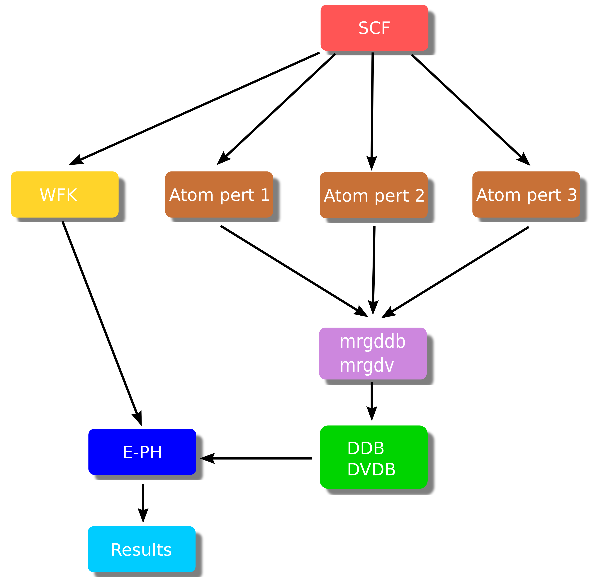

# An overview of the EPH code

This page provides a quick introduction to the new electron-phonon driver integrated with the ABINIT executable.
We discuss important technical details related to the implementation and the associated input variables.
The drawbacks/advantages with respect to the implementation available in ANADDB are also discussed.

## Why a new EPH code?

First of all, let's try to answer the question:
*why did you decide to implement a new code for electron-phonon calculations?*

As you may know, e-ph calculations have been available through the ANADDB executable for a long time.
This ANADDB-based implementation is essentially a post-processing of the e-ph matrix elements
computed by the DFPT code. This approach presents advantages as well as drawbacks.
On the one hand, most of the work required to compute e-ph matrix elements is implemented directly by the DFPT routines.
This means that e-ph calculations with advanced features such as PAW, SOC, non-collinear magnetism *etc*
are readily available in the ANADDB version once support in the DFPT part is implemented.

On the other hand, this post-processing approach implies that the number of $\kk/\qq$-points in the e-ph matrix elements
is **automatically fixed at the level of the DFPT run**.
In other words, if you want to compute phonon-limited mobilities with e.g. a 90×90×90 $\kk$- and $\qq$-mesh,
you need to perform DFPT calculations with the same sampling thus rendering the computation almost impossible.
In principle, it is possible to use tricks such as a linear interpolation of the e-ph matrix elements
to densify the sampling, but in order to get a decent interpolation one usually needs initial BZ meshes
that are significantly denser than the ones needed to converge the DFPT part alone.

As a matter of fact, electrons, phonons and e-ph properties **present completely different convergence rates**.
In silicon, for instance, a 9×9×9 mesh both for phonons and electrons is enough to converge
the electron density and the vibrational spectrum [[cite:Petretto2018]].
On the contrary, the phonon-limited mobility of Si requires a 45×45×45 $\kk$-grid and a 90×90×90 $\qq$-grid
to reach a 5% relative error [[cite:Brunin2020b]].
Roughly speaking, an explicit computation of phonons in Si with a 90×90×90 $\qq$-mesh
requires around 20000 × 3 × [[natom]] DFPT calculations
so you can easily get an idea of the cost of a fully ab-initio evaluation of the e-ph matrix elements
for all these $\qq$-points.

The EPH code bypasses this bottleneck by **interpolating the DFPT potentials** in $\qq$-space
while Bloch states are computed non-self-consistently on arbitrarily dense $\kk$-meshes.
As a net result, the three problems (electrons, phonons and electron-phonon) are now
**partly decoupled** and can be converged separately.
Keep in mind, however, that the fact that one can easily densify the $\qq$-sampling in the EPH code does not
mean that one can use under-converged values for the ground-state (GS) and DFPT parts.
Indeed, the quality of the interpolation depends on the initial $\kk$- and $\qq$-meshes.
The take-home message is that one should always converge carefully both electronic and vibrational properties
before moving to EPH computations.

For further information about the difference between EPH and ANADDB, see also [[cite:Gonze2019]].
Further details about the EPH implementation are available in [[cite:Brunin2020b]].

## EPH workflow

A typical EPH workflow with arrows denoting dependencies between the different steps
is schematically represented in the figure below:

{: style="height:400px;width:400px"}

The brown boxes are standard DFPT calculations done with relatively coarse $\kk$- and $\qq$-meshes (for instance, 9×9×9 in Si).
Each DFPT run produces a (partial) DDB file with a portion of the full dynamical matrix
as well as POT files with the first-order derivative of the KS potential (referred to as the DFPT potential below).
The partial POT files are merged with the **mrgdv** utility to produce a
single **DVDB file** (Derivatives of V($\rr$) DataBase).
As usual, the partial DDB files are merged with **mrgddb** (see [the second tutorial on DFPT](rf2)).

The EPH driver (blue box) receives in input the total DDB and the DVDB as well as a GS WFK file that is usually
produced with a different $\kk$-mesh (in some cases, even with a different number of bands
when high-energy empty states are needed).
These ingredients are then used to compute (interpolate) e-ph matrix elements and the associated physical properties.
<!--
The $\kk$-mesh in the WFK file must be commensurate with the $\qq$-mesh in the DVDB file
-->

The EPH calculation is activated by using [[optdriver]] = 7 while [[eph_task]] defines the physical properties to be computed.
To read the external files, one specifies the filepath with the three variables:
[[getwfk_filepath]], [[getddb_filepath]] and [[getdvdb_filepath]].

Internally, the code starts by reading the DDB file to construct the interatomic
force constants (IFCs) in the real-space supercell ($\RR$-space).
<!-- Other external files (WFK, DVDB) may be read depending on the value of [[eph_task]]. -->
Then, the EPH code computes phonon bands and DOS.
Finally a specialized routine is invoked depending on the value of [[eph_task]].

The following physical properties can be computed:

* Imaginary part of ph-e self-energy in metals (**eph_task 1**) that gives access to:

    * Phonon linewidths induced by e-ph coupling
    * Eliashberg function
    * Superconducting properties within the isotropic Migdal-Eliashberg formalism

<!--
    * transport properties in metals with the LOVA approximation.
-->

* Real and imaginary parts of the e-ph self-energy (**eph_task 4**) that gives access to:

    * Zero-point renormalization of the band gap
    * QP corrections due to e-ph scattering as a function of T
    * Spectral function $A(\ww)$ and Eliashberg functions

* Imaginary part of the e-ph self-energy at the KS energy (**eph_task -4**) that gives access to:

    * Phonon-limited carrier mobility, electrical conductivity and Seebeck coefficient
    * Phonon-limited carrier mean free path and relaxation times (or scattering rates)
    * All the calculations above can be done as a function of temperature and doping, for nonpolar and polar materials.

<!--
Other more advanced options are available...

Crystalline symmetries are used throughout the code in order to reduce the number
of $\kk$- and $\qq$-points that must be explicitly treated.
To achieve good parallel efficiently, the most CPU demanding parts are parallelized with MPI employing
a distribution schemes over $\qq$-points, perturbations
and bands (the band level is available only when computing the full self-energy).
[[istwfk]] [[kptopt]]
Features available in ANADDB that are not yet supported by EPH
-->

At the time of writing ( |today|), the following features are **not yet supported** by EPH:

* PAW calculations
* Spin-orbit coupling
* Non-collinear magnetism ([[nspinor]] = 2 and [[nspden]] = 4)
* Non-local part of the pseudopotential applied with [[useylm]] = 1

In this introduction, we focus on the parts that are common to the different sub-drivers i.e.:

1. Computation of vibrational properties via Fourier interpolation of the dynamical matrix.
2. Fourier interpolation of the DFPT potentials.

The use of the different sub-drivers is discussed in more detail in the specialized lessons:

* [Phonon-limited mobilities](eph4mob)
* [ZPR and T-dependent band structures](eph4zpr)

<!--
* [Isotropic superconductivity in metals](eph4isotc)
-->

## Phonon bands and DOS with EPH

Since phonon frequencies and displacements are needed for e-ph calculations, it is not surprising
that some of the ANADDB features related to the treatment of the dynamical matrix
are integrated in the EPH code as well.
In many cases, the variables names are the same in EPH and ANADDB especially for important variables
such as [[dipdip]], [[asr]], and [[chneut]].
There are however important differences with respect to the ANADDB input file.
More specifically, in EPH the name of the DDB file is specified by
[[getddb_filepath]] whereas the DFPT $\qq$-mesh associated to the DDB file is given by [[ddb_ngqpt]].
**These two variables are mandatory** when performing EPH calculations.

!!! important

    In Abinit9 the default values of [[dipdip]], [[asr]], and [[chneut]] have been changed.
    In particular, the acoustic sum rule and the charge neutrality of the Born effecive charges
    are enforced by default.
    It is responsability of the user to check whether the breaking of these sum rules (always
    present due to numerical inaccuracies) is reasonable.
    By the same token, make sure that no vibrational instabilty is present before
    embarking on big EPH calculations.
    If the spectrum present instabilities around $\Gamma$ due to a Fourier interpolation 
    done with coarse $\qq$-sampling, you may try to use [[rifcsph]].

### Variables for phonon DOS

By default, the EPH code computes the phonon DOS and the atom-projected PHDOS by interpolating
the IFCs on the *dense* $\qq$-mesh specified by [[ph_ngqpt]].
The default $\qq$-grid is 20×20×20. You may want to increase this value for more accurate results.
The step of the (linear) frequency mesh is governed by [[ph_wstep]].
The linear tetrahedron method by [[cite:Bloechl1994]] is used by default.
The Gaussian method can be activated via [[ph_intmeth]] with [[ph_smear]] defining
the Gaussian smearing (in Hartree units by default).
The final results are stored in the **PHDOS.nc** file (same format at the one produced by ANADDB).
The computation of the PHDOS can be disabled by setting [[prtphdos]] = 0 to make the calculation a bit faster.

To summarize: to compute the PHDOS with the tetrahedron method and a 40x40x40 $\Gamma$-centered $\qq$-mesh,
one should use

```sh
prtphdos 1  # 0 to disable this part.
ph_ngqpt 40 40 40
```

To visualize the results with |AbiPy|, execute

```sh
abiopen.py out_PHDOS.nc -e
```

### Variables for phonon band structures

The computation of the phonon band structure is activated automatically provided the input file
defines the high-symmetry $\qq$-path in terms of [[ph_nqpath]] vertices listed in the [[ph_qpath]] array.
The [[ph_ndivsm]] variable defines the number of divisions used to sample the smallest segment of the path
so that the number of points in each segment is proportional to the length of the segment.
The computation of the phonon band structure can be deactivated by setting [[prtphbands]] = 0.
The final results are stored in the **PHBST.nc** file (same format at the one produced by ANADDB).

For instance, the section for the phonon band structure could look like

```sh
prtphbands 1
ph_nqpath 5
ph_qpath 0.0 0.0 0.0 # Gamma
         1/2 0.0 1/2  # X
         1/2 1/4 3/4  # W
         3/8 3/8 3/4  # K
         0.0 0.0 0.0  # Gamma
```

To obtain the list of high-symmetry q-points, one can use the `abistruct.py` script provided by |AbiPy|:

```sh
abistruct.py kpath in_DDB
```

and the phonon bands can be visualized using

```sh
abiopen.py out_PHBST.nc -e
```


## Electron-phonon matrix elements

The e-ph matrix elements $\gkq$ are defined by

\begin{equation}
\gkq = \langle \psi_{m\kk+\qq}|\Delta_\qnu V^\KS|\psi_{n\kk} \rangle,
\label{eq:elphon_mel}
\end{equation}

where $\psi_{n\kk}$ is the KS Bloch state and $\Delta_\qnu V^\KS$ is the first-order variation of the
self-consistent KS potential induced by the phonon mode $\qnu$.
The scattering potential can be expressed as:

\begin{equation}
    \Delta_{\qq\nu} V^\KS(\rr) = e^{i\qq\cdot\rr} \Delta_{\qq\nu} v^\KS(\rr).
\label{eq:delta_vks}
\end{equation}

where $\Delta_{\qq\nu} v^\KS(\rr)$ is a lattice periodic function [[cite:Giustino2017]].
Note that ABINIT computes the response to the **atomic perturbation** defined by
the three variables [[qpt]], [[rfdir]] and [[rfatpol]] when [[rfphon]] is set to 1.
The connection between the phonon representation and the atomic perturbation employed by the DFPT code
is given by:

\begin{equation}
    \Delta_{\qq\nu} v^\KS(\rr) =
    \dfrac{1}{\sqrt{2\wqnu}} \sum_{\kappa\alpha}
    \dfrac{{e}_{\kappa\alpha,\nu}(\qq)}{\sqrt{M_\kappa}}\,\partial_{\kappa\alpha,\qq} v^\KS(\rr),
\end{equation}

where ${e}_{\kappa\alpha,\nu}(\qq)$ is the $\alpha$-th Cartesian component of the phonon eigenvector
for the atom $\kappa$ in the unit cell, $M_\kappa$ its atomic mass and
$\partial_{\kappa\alpha,\qq} v^\KS(\rr)$ is the first-order derivative of the KS potential
that can be obtained with DFPT by solving self-consistently a system of Sternheimer equations for a given
$(\kappa\alpha, \qq)$ perturbation [[cite:Gonze1997]] [[cite:Baroni2001]].

The DVDB file stores $\partial_{\kappa\alpha,\qq} v^\KS(\rr)$
for all the $\qq$-points in the IBZ and all the irreducible atomic perturbations.
More rigorously, we should say that the DVDB file stores the local part of the DFPT potential
(variation of the Hartree + XC + local part of the pseudo)
but this is a rather technical point discussed in more detail in [[cite:Brunin2020b]] that is not relevant
for the present discussion so we do not elaborate more on this.

!!! important

    The number of irreducible atomic perturbations depends on the $\qq$-point and the symmetries of the system.
    Actually only a particular subset of the point group of the unperturbed crystal can be
    exploited at the DFPT level.
    Fortunately, you don't have to worry about these technical details as symmetries are fully supported in EPH.
    Just run the DFPT calculation for the irreducible perturbations in the IBZ as usual.
    Also the computation of the WFK can be limited to the IBZ.
    The EPH code will employ symmetries to reconstruct the different quantities at runtime.

## Fourier interpolation of the DFPT potentials

The EPH code employs the Fourier interpolation proposed in [[cite:Eiguren2008]]
to obtain the scattering potentials at arbitrary $\qq$-points.
In this interpolation technique, one uses the DFPT potential stored in the DVDB file
to compute the $\qq \rightarrow \RR$ Fourier transform

\begin{equation}
	\label{eq:dfpt_pot_realspace}
    W_{\kappa\alpha}(\rr,\RR) = \dfrac{1}{N_\qq} \sum_\qq e^{-i\qq\cdot(\RR - \rr)}\,
    \partial_{\kappa\alpha\qq}{v^{\text{scf}}}(\rr),
\end{equation}

where the sum is over the $N_\qq$ BZ $\qq$-points belonging to the ab-initio [[ddb_ngqpt]] grid.
<!--
and $\partial_{\kappa\alpha\qq}{v^{\text{scf}}}$ represents the (lattice-periodic) first order derivative
of the local part of the KS potential associated to atom $\kappa$ along the Cartesian direction $\alpha$.
-->
Once $W_{\kappa\alpha}(\rr,\RR)$ is known, it is possible to interpolate the potential
at an arbitrary point $\tilde{\qq}$ using the inverse transform

\begin{equation}
	\label{eq:dfpt_pot_interpolation}
    \partial v^{scf}_{\tilde\qq\kappa\alpha}(\rr) \approx \sum_\RR e^{i\tilde{\qq}\cdot(\RR - \rr)} W_{\kappa\alpha}(\rr,\RR).
\end{equation}

where the sum is over the lattice vectors inside the Born-von Karman supercell.
The algorithm used to define the $\RR$ points of the supercell with the
corresponding weights is specified by [[dvdb_rspace_cell]].

The accuracy of the interpolation depends on the localization of $W_{\kappa\alpha}$ in $\RR$-space.
This means that the Born-von Karman supercell corresponding to the [[ddb_ngqpt]] grid should be large
enough to capture the spatial decay of $W_{\kappa\alpha}(\rr,\RR)$ as a function of $\RR$.
As a consequence, [[ddb_ngqpt]] should be subject to convergence studies.

In metals, $W_{\kappa\alpha}$ is expected to be short-ranged provided one ignores possible Kohn anomalies.
On the contrary, a special numerical treatment is needed in semiconductors and insulators due to the presence of
long-ranged (LR) **dipolar** and **quadrupolar** fields in $\RR$-space.
These LR terms determine a non-analytic behaviour of the scattering potentials
in the long-wavelength limit $\qq \rightarrow 0$ [[cite:Vogl1976]].
To handle the LR part, the EPH code uses an approach that is similar in spirit to the one employed
for the Fourier interpolation of the dynamical matrix [[cite:Gonze1997]].

The idea is relatively simple.
One subtracts the LR part from the DFPT potentials before computing Eq. \eqref{eq:dfpt_pot_realspace}
thus making the real-space representation amenable to Fourier interpolation.
The non-analytical part
<!-- (Eq.\eqref{eq:v1_long_range}) -->
is then restored back to Eq. \eqref{eq:dfpt_pot_interpolation} when interpolating the potential at $\tilde{\qq}$.

<!--
the long-range part associated to the displacement of atom $\kappa$ along the cartesian direction $\alpha$ can be modeled with
-->
In polar materials, the leading term is given by the dipolar field [[cite:Verdi2015]], [[cite:Sjakste2015]]:

\begin{equation}
   \label{eq:v1_long_range}
    V^{\mathcal{L}}_{\kappa\alpha\qq}(\rr) = i \dfrac{4\pi}{\Omega} \sum_{\GG \neq -\qq}
    \dfrac{(\qG)_\beta\cdot {\bm Z}^*_{\kappa\alpha,\beta}\,
    e^{i (\qG) \cdot (\rr - {\bm{\tau}}_{\kappa})}} {(\qG) \cdot {\bm{\varepsilon}}^\infty \cdot (\qG)},
\end{equation}

where ${\bm{\tau}}_\kappa$ is the atom position, $\Omega$ is the volume of the unit cell,
$\bm{Z}^*$ and ${\bm{\varepsilon}}^\infty$ are the Born effective charge tensor
and the dielectric tensor, respectively, and summation over the Cartesian directions $\beta$ is implied.
This term is present in polar materials (non-zero $\bm{Z}^*$) and
diverges as $1/q$ for $\qq \rightarrow 0$ hence the singularity is integrable in 3D systems.
$\bm{Z}^*$ and ${\bm{\varepsilon}}^\infty$ are read automatically from the DDB file (if present) so we
**strongly recommend** to compute these quantities with DFPT in order to prepare an EPH calculation
in semiconductors.

In non-polar materials, the Born effective charges are zero but the scattering potentials are still non-analytic
due to presence of jump discontinuities.
As discussed in [[cite:Brunin2020]], the non-analytic behaviour can be fully captured by using the more general expression:
<!--
In this case the leading term is associated to the dynamical quadrupoles [[cite:Royo2019]].
The expression for the LR model including both dipole and quadrupole terms reads:
-->

\begin{equation}
    V^{\mathcal{L}}_{\kappa\alpha,\qq}(\rr) =
    %\partial_{\kappa\alpha,\qq} v^{\Lc}(\rr) =
    \frac{4\pi}{\Omega} \sum_{\GG\neq\mathbf{-q}}
    \frac{ i(\qG)_\beta
    Z^*_{\kappa\alpha,\beta}
    -
    (\qG)_\beta
    ({Z^*_{\kappa\alpha,\beta}\cal{Q}}v^{\text{Hxc},\cal{E}_{\gamma}}(\rr)- \frac{1}{2}Q_{\kappa\alpha}^{\beta\gamma})(\qG)_\gamma
    }
    {(\qG) \cdot {\bm{\varepsilon}}^\infty \cdot (\qG)}
    e^{i (\qG) \cdot (\rr - {\bm{\tau}}_{\kappa})}
\label{eq:LRpot}
\end{equation}

!!! important
	The computation of the dynamical quadrupoles tensor within the DFPT framework will be made available in a future release,
	together with a specific tutorial. Once it is computed and stored in the DDB,
	the EPH code reads it automatically and uses it for the LR model. 

<!--
TODO: Discuss more the integration with the DFPT part.
-->

In the implementation, each Fourier component is multiplied by the
Gaussian filter $e^{-\frac{|\qG|^2}{4\alpha}}$
in order to damp the short range components that are not relevant for the definition of the LR model.
The $\alpha$ parameter can be specified via the [[dvdb_qdamp]] input variable.
The default value worked well in the majority of the systems investigated so far yet
this parameter should be subject to convergence tests.
For testing purposes, it is possible to deactivate the treatment of the LR part by setting [[dvdb_add_lr]] to 0.
<!--
It can also be set to -1 if one is interested only in the short-range part of the e-ph scattering potentials.
-->

### On the importance of the initial DFPT mesh

At this point it is worth commenting about the importance of the initial DFPT $\qq$-mesh.
The Fourier interpolation implicitly assumes that the signal in $\RR$-space decays quickly hence
the quality of the *interpolated* phonon frequencies and of the *interpolated* DFPT potentials
between the ab-initio points depends on the spacing of the initial $\qq$-mesh that
in turns defines the size of the Born-von-Karman supercell.
In other words, the denser the DFPT mesh, the larger the real-space supercell and the better the interpolation,
especially for $\qq$-points close to $\Gamma$.
<!--
In semiconductors the atomic displacement induces dynamical dipoles and quadrupoles at the level of the density
that will generate long-range scattering potentials.
These potentials affect the behaviour of the e-ph matrix elements for $\qq \rightarrow 0$ and the
$\qq$-mesh must be dense enough to capture the full strenght of the coupling.
A more detailed discussion can be found in [[cite:Brunin2020]], [[cite:Verdi2015]] and [[cite:Sjakste2015]].
-->

From a more practical point of view, this implies that one should always **monitor the convergence of the
physical properties with respect to the initial DFPT $\qq$-mesh**.
The LR model implemented in ABINIT facilitates the convergence as the non-analytic behaviour for
$\qq \rightarrow 0$ is properly described yet the Fourier interpolation can introduce oscillations
between the *ab-initio* $\qq$-points and these oscillations may affect the quality of the
physical results [[cite:Brunin2020]].

## Tricks to accelerate the computation and reduce the memory requirements

Each sub-driver implements specialized techniques to accelerate the calculation and reduce the memory requirements.
Here we focus on the techniques that are common to the different EPH sub-drivers.
Additional tricks specific to the particular value of [[eph_task]] are discussed in more detail in the associated lessons.

First of all, note that the memory requirements for the $W_{\kappa\alpha}(\rr,\RR)$ array
scales as [[nfft]] × product([[ddb_ngqpt]]).
This quantity should be multiplied by 3 * [[natom]] if each MPI process stores all the perturbations in memory.
The MPI parallelism over perturbations (see [[eph_np_pqbks]]) allows one to decrease this prefactor from
*3 × natom* to *3 × natom / nprocs_pert*.

Also, the total number of $\rr$-points ([[nfft]]) plays an important role both at the level of memory
as well as the level of the wall-time.
To optimize this part, one can decrease the value of [[boxcutmin]]
to a value smaller than 2 e.g. 1.5 or the more aggressive 1.1.
Note that one is not obliged to run the GS/DFPT part with the same [[boxcutmin]].
The EPH code will automatically interpolate the DFPT potentials if the input FFT mesh computed from
[[ecut]] and [[boxcutmin]] differs from the one found in the DVDB file.
<!--
An exact representation of densities/potentials in $\GG$-space is obtained with [[boxcutmin]] = 2,
but we found that using a value of 1.1 does not significantly affect the result
while allowing one to decrease the cost of the calculation and the memory by a factor ~8.
-->

A significant fraction of the wall-time in EPH is spent for performing the FFTs required
to apply the first-order Hamiltonian $H^1$.
The use of single precision in the FFT routines allows one to decrease the computational cost without losing precision.
This trick is activated by setting [[mixprec]] = 1.
Note however that this feature is available only if the code is linked with FFTW3 or intel-MKL.

!!! important

    The [[boxcutmin]] and [[mixprec]] tricks **are not activated by default**
    because users are supposed to perform preliminary tests
    to make sure the quality of the results is not affected by these options.


By default, the EPH code stores the KS wavefunctions in a single precision array although
the majority of the calculations are done with double precision arithmetic (except for the FFT when [[mixprec]] is used).
The precision used for the internal buffer can be specified at configure time with:

```sh
enable_gw_dpc=“yes”      # Store wavefunctions in double precision buffers.
```

The default value if "no" i.e. single precision and we suggest not to change this option unless you have a good reason to do so.

We terminate the discussion with another trick that is not directly related to the EPH code but
to the DFPT computation.
Since the EPH code does not need the first order change of the wavefunctions (1WF files)
we suggest to avoid the output of these files by using [[prtwf]] = -1 in the DFPT part
as these files are quite large and the overall space on disk scales as **nqpt × 3 × natom**.
When [[prtwf]] is set to -1, the DFPT code writes the 1WF file only if the DFPT SCF cycle is not converged
so that one can still restart from these wavefunctions if needed
(restarting a DFPT run from the first order wavefunctions is more effective than restarting from the first order density).


## Star-function interpolation of the KS eigenvalues

As mentioned in the introduction, in the EPH implementation Bloch states are computed
non-self-consistently on arbitrarily dense $\kk$-meshes without having to resort to interpolation schemes.
The advantage of such approach is that calculations can be easily automated.
The drawback is that the computational cost of the NSCF quickly increases with the density
of the $\kk$-mesh and [[nband]] hence for "big calculations" the cost
of the NSCF part may be even greater than the e-ph computation itself.

There are however physical properties whose computation does not require the knowledge
of the KS states for each $\kk$-point in the IBZ.
For instance, the computation of mobilities in semiconductors require the knowledge of the KS states whose energy
is slight above (below) the CMB (VBM), let's say ~0.2 eV.
In metals, only states close to the Fermi level are needed to compute superconducting properties with the standard formalism.
In other words, several e-ph calculations in which delta functions are involved require extremely dense BZ meshes
to converge but as a matter of fact only a **relatively small fraction of the BZ compatible with energy and crystalline-momentum
conservation is nededed**.

At this point a question naturally arises: can we avoid the NSCF computation of $\kk$-points that
are supposed to give negligible contribution to the final physical results?
The answer is yes provided we are able to predict in some easy way and with reasonable accuracy the
KS eigenvalues $\ee_\nk$ **without actually solving the KS equations**.

The aproach used in the EPH code is based on the star-function interpolation by Shankland-Koelling-Wood (SKW)
with the improvements described in [[cite:Pickett1988]].
In this method, the single-particle energies are expressed in terms of the (symmetrized) Fourier sum

\begin{equation}
\label{eq:skw_expansion}
  \enk = \sum_\RR c_{n\RR} S_\RR(\kk).
\end{equation}

where the star function, $S_\RR(\kk)$, is defined by

\begin{equation}
\label{eq:star_function}
S_\RR(\kk) = \dfrac{1}{N}\sum_\mcO e^{i\kk\cdot \mcO \RR},
\end{equation}

$\RR$ is a lattice vector and the sum is over the $N$ rotations of the crystallographic point group.
By construction, the expansion in Eq.\eqref{eq:skw_expansion} fulfills the basic symmetry properties
of the single-particle energies:

\begin{align}
\label{eq:eigen_properties}
  \enk = \epsilon_{n\kG}, \\
  \enk = \epsilon_{n\mcO\kk}.
\end{align}

In principle, the expansion coefficients in Eq.\eqref{eq:skw_expansion} can be uniquely determined
by using a number of star functions equal to the number of *ab initio* $\kk$-points
but this usually leads to sharp oscillations between the input eigenvalues.
To avoid this problem, one uses more star functions than *ab initio* $\kk$-points and constrains the
fit so that the interpolant function passes through the input energies and a roughness function is minimized [[cite:Pickett1988]].

This [[einterp]] variable activates the interpolation of the electronic eigenvalues.
The user can specify the number of star functions per
*ab initio* $\kk$-point and an optional Fourier filtering as proposed in [[cite:Uehara2000]].

<!--
%In this case, rcut is given by einterp(2) * Rmax where Rmax is the maximum length of the lattice vectors included in the star expansion
 [[einterp]] can be used to interpolate KS eigenvalues at
 the end of the ground state calculation (\href{https://docs.abinit.org/tests/v8/Input/t04.in}{{\texttt{v8\#42}}})
 or to interpolate GW energies (\href{https://docs.abinit.org/tests/libxc/Input/t42.in}{{\texttt{libxc\#42}}}) when {\bf optdriver} = 4.

In this case, one can employ the Python interface provided by \ABIPY to
automate the procedure.
An example can be found in this
\href{https://nbviewer.jupyter.org/github/abinit/abitutorials/blob/master/abitutorials/g0w0/lesson_g0w0.ipynb}{jupyter notebook}.

%einterp consists of 4 entries. The first element specificies the interpolation method.
%
%1 → Star-function interpolation (Shankland-Koelling-Wood Fourier interpolation scheme, see [Pickett1988]
%2 → B-spline interpolation.
%The meaning of the other entries depend on the interpolation technique selected.
%In the case of star-function interpolation:
%
%einterp(2): Number of star-functions per {\it ab initio} k-point
%einterp(3): If non-zero, activate Fourier filtering according to Eq 9 of [Uehara2000]. In this case, rcut is given by einterp(2) * Rmax where Rmax is the maximum length of the lattice vectors included in the star expansion
%einterp(4): Used if einterp(2) /= 0. It defines rsigma in Eq 9

%It is worth noting that the QP energies must fulfill the symmetry properties of the point group of the crystal:
%and
%where G is a reciprocal lattice vector and is an operation of the point group.
%Therefore it is possible to employ the star-function interpolation by Shankland, Koelling and Wood in the improved version proposed by Pickett to fit the {\it ab initio} results. This interpolation technique, by construction, passes through the initial points and satisfies the basic symmetry property of the band energies.
%It should be stressed, however, that this Fourier-based method can have problems in the presence of band crossings that may cause unphysical oscillations between the {\it ab initio} points.
-->
Without entering into details that will be discussed in the other specialized lessons,
one can use the SKW algorithm to find the relevant $\kk$-points, perform an *ab-initio* NSCF run
for these wavevectors only in order to produce a WFK file that can be used by the EPH code.
The entire procedure is performed in an automatic way inside ABINIT but before running big EPH calculations,
we strongly recommend to check whether the SKW interpolation gives reasonable results.
A typical test would be:

1. Compute a WFK file on a reasonably dense IBZ (let's call the file **IBZ_WFK**)

2. Perform a NSCF band structure calculation along a high-symmetry $\kk$-path covering the most important
   regions of the BZ (e.g. band edges in semiconductors).
   This step produces another WFK file that will be used as reference to check the interpolation
   (let's call it **KPATH_WKF**)

3. Use the *abitk* executable in *src/98_main* to interpolate the KS energies using the eigenvalues
   in **IBZ_WFK** and compare the results with the ab-initio band structure stored in **KPATH_WFK**.

The syntax is:

```sh
abitk skw_compare IBZ_WFK KPATH_WFK [--lpratio 5] [--rcut 0.0] [--rsigma 0]
```

where optional arguments are placed between square brackets and the default value is indicated.
If you prefer, it is possible to replace WFK files with GSR.nc file as in

```sh
abitk skw_compare IBZ_GSR.nc KPATH_GSR.nc
```

as only KS energies are needed for the SKW interpolation.

To compare the bands with AbiPy, use the |abicomp| script with the `ebands` command:

```sh
abicomp.py ebands abinitio_EBANDS.nc skw_EBANDS.nc -p combiplot
```

If the fit is not satisfactory, you may want to try one of the following options (in order of importance):

1. Increase the ab-initio mesh in **IBZ_WFK**.
2. Increase the value of *lpratio*
3. Play with *rcut* and *rsigma* to damp the oscillations in the interpolant

Note that it is sometimes difficult to get completely rid of spurious oscillations
or artifacts in the SKW interpolation
especially in the presence of **degeneracies or band crossing/anti-crossing**,
Remember, however, that achieving perfect agreement between the SKW interpolation and the ab-initio results
is not crucial since the SKW bands are only used to find those $\kk$-points that are sufficiently
close to the band edges (Fermi level).
All these wavevectors will be recomputed afterwards with KS-DFT and possible oscillations
or artifacts will disappear in the ab-initio results.

In a nutshell, you need to **make sure that the SKW bands are reasonably close** to the ab-initio results
especially in the region around the band edges for semiconductors or around the Fermi level for metals.
Small deviations between SKW and ab-initio bands can always be accounted for by increasing the value
of [[sigma_erange]] used for generating the KERANGE.nc file.

Examples of input files to compute WFK files with the KERANGE are given in the last section of
the [mobility tutorial](eph4mob#how-to-compute-only-the-k-points-close-to-the-band-edges).

<!--
TODO: Recheck the code, perhaps I can use the ab-initio band edge if its greater/smaller than the SKW one.
The most important thing is that SKW reproduces the position of the band edges as these values are then used
that the position of the SKW band edge is consistent
-->
