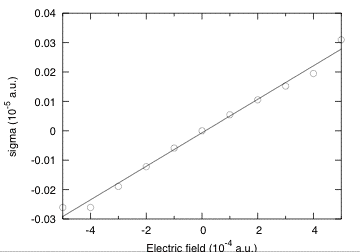

# Tutorial on polarization and finite electric fields

## Polarization, and responses to finite electric fields for AlAs.

This tutorial aims at showing how to get the following physical properties, for an insulator:

  * The polarization.
  * The Born effective charge (by finite differences of polarization)
  * The Born effective charge (by finite differences of forces)
  * The dielectric constant
  * The proper piezoelectric tensor (clamped and relaxed ions)

The case of the linear responses (Born effective charge, dielectric constant,
piezoelectric tensor) is treated independently in other tutorials
([tutorial Response-Function 1](rf1), [tutorial on Elastic properties](elastic)),
using Density-Functional Perturbation Theory.
You will learn here how to get these quantities using the finite
difference techniques within ABINIT. To that end, we will describe how to
compute the polarization, in the Berry phase formulation, and how to perform
finite electric field calculations.

The basic theory for Berry phase computation of the polarization was proposed
by R. D. King-Smith and D. Vanderbilt in [[cite:Kingsmith1993]].
The longer (excellent) paper D. Vanderbilt and R. D. King-Smith ([[cite:Vanderbilt1993]])
clarifies many aspects of this theory (especially in view of application to AlAs, as in this tutorial).
One might benefit also from a reading of the review article [[cite:Resta1994]].

In order to gain the theoretical background needed to perform a calculation
with a finite electric field, you should consider reading the following papers:
[[cite:Souza2002]], [[cite:Nunes2001]] and
M. Veithen [PhD thesis](https://www.abinit.org/sites/default/files/PhD-M.Veithen.pdf)
Finally, the extension to the PAW formalism specifically in ABINIT is
discussed in [[cite:Gonze2009]] and [[cite:Zwanziger2012]].

This tutorial should take about 1 hour and 30 minutes.

[TUTORIAL_README]

## 1 Ground-state properties of AlAs and general parameters

*Before beginning, you might consider working in a different subdirectory, as for the other tutorials.
Why not create Work_ffield in \$ABI_TESTS/tutorespfn/Input?*

In this tutorial we will assume that the ground-state properties of AlAs have
been previously obtained, and that the corresponding convergence studies have been done.
We will adopt the following set of generic parameters:

       acell               10.53
       ixc                 3
       ecut                2.8     (results with ecut = 5 are also reported
                                   in the discussion)
       ecutsm              0.5
       dilatmx             1.05
       nband               4 (=number of occupied bands)
       ngkpt               6 6 6
       nshiftk             4
       shiftk   0.5 0.5 0.5
                0.5 0.0 0.0
                0.0 0.5 0.0
                0.0 0.0 0.5

       pseudopotentials    13al.pspnc
                           33as.pspnc


In principle, the [[acell]] to be used should be the one corresponding to the
optimized structure at the [[ecut]], and [[ngkpt]] combined with [[nshiftk]]
and [[shiftk]], chosen for the calculations.

Unfortunately, for the purpose of this tutorial, in order to limit the duration of the runs,
we have to work at an unusually low cutoff of 2.8 Ha for which the optimized lattice constant is
equal to $7.45\times 2/\sqrt{2}=10.53~\mathrm{Bohr}$ (instead of the converged value of 10.64
Bohr). For comparison, results with [[ecut]]=5 are also reported and, in that
case, were obtained at the optimized lattice constant of 10.64 bohr. For those
who would like to try later, convergence tests and structural optimizations
can be done using the file [[tests/tutorespfn/Input/tnlo_1.in]]. Before going
further, you might refresh your memory concerning the other variables:
[[ixc]], [[ecutsm]], [[dilatmx]].

## 2 Berry phase calculation of polarization in zero field

In this section, you will learn how to perform a Berry phase calculation of
the polarization. As a practical problem we will try to compute the Born
effective charges from finite difference of the polarization (under finite
atomic displacements), for AlAs.

You can now copy the file *tffield_1.in* and *tffield_x.files* in *Work_ffield*,
and modify the latter as usual (for example, edit it so that the various file names it
contains refer to tffield_1 rather than tffield_x).

```sh
cd $ABI_TESTS/tutorespfn/Input
mkdir Work_ffield
cd Work_ffield
cp ../tffield_1.files .
cp ../tffield_x.in .
```



Note that two pseudopotentials are mentioned in this "files" file: one for the
aluminum atom, and one for the arsenic atom. The first to be mentioned, for
Al, will define the first type of atom. The second to be mentioned, for As,
will define the second type of atom. It might the first time that you
encounter this situation (more than one type of atoms) in the tutorials, at
variance with the four "basic" tutorials.

Because of the use of two types of atoms, have also a look at the following
input variables present, in the "input" file:

  * [[ntypat]]
  * [[typat]]

You can start the calculation. It should take 90 seconds on a PC 3GHz.
Examine the *tffield_1.in* file. It is made of three datasets corresponding to
the reference optimized structure ($\tau=0$) and to structure with the Al atom
displaced from 0.01 bohr right and left (referred to as $\tau = +0.01$ and
$\tau =-0.01$). This is typically the amplitude of atomic displacement to be
considered in this kind of computations. Notice also that the displacements
are given using [[xcart]], that is, explicitly in Cartesian directions, rather
than the primitive cell axes (using [[xred]]). This makes the correspondence
with the polarization output in Cartesian directions much simpler to understand.

There are two implementations of the Berry phase within ABINIT. One
corresponds to positive values of [[berryopt]] and was implemented by Na Sai.
The other one corresponds to negative values of [[berryopt]] and was implemented
by Marek Veithen. Both are suitable to compute the polarization. Here we will
focus on the implementation of Marek Veithen for two reasons. First, the
results are directly provided in Cartesian coordinates at the end of the run
(while the implementation of Na Sai reports them in reduced coordinates).
Second, the implementation of Marek Veithen is the one to be used for the
finite electric field calculation as described in the next section. Finally,
note also that Veithen's implementation works with [[kptopt]] = 1 or 2 while
Na Sai implementation is restricted to [[kptopt]] = 2, which is less convenient.

The file is the one of a usual self-consistent calculation. On top of the
usual variables, for the Berry phase calculation we simply need
to define [[berryopt]] and [[rfdir]]:

            berryopt      -1
            rfdir          1 1 1

Make the run, then open the output file and look for the occurrence "Berry".
The output reports values of the Berry phase for individual k-point strings.

     Computing the polarization (Berry phase) for reciprocal vector:
      0.16667  0.00000  0.00000 (in reduced coordinates)
     -0.01583  0.01583  0.01583 (in cartesian coordinates - atomic units)
     Number of strings:   144
     Number of k points in string:    6

     Summary of the results
     Electronic Berry phase     2.025856545E-03
                Ionic phase    -7.500000000E-01
                Total phase    -7.479741435E-01
        Remapping in [-1,1]    -7.479741435E-01

               Polarization    -1.557862799E-02 (a.u. of charge)/bohr^2
               Polarization    -8.913274846E-01 C/m^2

The "Remapping in [-1,1]" is there to avoid the quantum of polarization. As
discussed in [[cite:Djani2012]], the indeterminacy of the quantum phase, directly
related to the quantum of polarization, can lead to spurious effects (see Fig.
2 of the above-mentioned paper). By remapping on the [-1,1] interval, any
indeterminacy is removed. However, removing such a quantum of polarization
between two calculations might give the false impression that one is on the
same polarization branch in the two calculations, while actually the branch is
made different by this remapping. Cross-checking the polarization results by
computing the Born effective charge, further multiplied by the displacements
between the two geometries is an excellent way to estimate the amplitude of the polarization.

Other subtleties of Berry phases, explained in [[cite:Vanderbilt1993]], also apply.
First, note that neither the electronic Berry phase nor the ionic phase vanish in this highly
symmetric case, contrary to intuition. Even though AlAs does not have
inversion symmetry, it does have tetrahedral symmetry, which would be enough
to make an ordinary vector vanish. But a lattice-valued vector does not have
to vanish: the lattice just has to transform into itself under the tetrahedral
point group. The ionic phase corresponds actually to a lattice-valued vector
(-3/4 -3/4 -3/4). Concerning the electronic phase, it does not exactly vanish,
unless the sampling of k points becomes continuous. If you go further in the
file you will find the final results in cartesian coordinates. You can collect
them for the different values of $\tau$.

$\tau = 0$

     Polarization in cartesian coordinates (a.u.):
     (the sum of the electronic and ionic Berry phase has been folded into [-1, 1])
         Electronic berry phase:        0.730822547E-04   0.730822547E-04   0.730822547E-04
         Ionic:                        -0.270560574E-01  -0.270560574E-01  -0.270560574E-01
         Total:                        -0.269829752E-01  -0.269829752E-01  -0.269829752E-01

     Polarization in cartesian coordinates (C/m^2):
     (the sum of the electronic and ionic Berry phase has been folded into [-1, 1])
         Electronic berry phase:        0.418138377E-02   0.418138377E-02   0.418138377E-02
         Ionic:                        -0.154800587E+01  -0.154800587E+01  -0.154800587E+01
         Total:                        -0.154382449E+01  -0.154382449E+01  -0.154382449E+01


$\tau = +0.01$

     Polarization in cartesian coordinates (a.u.):
     (the sum of the electronic and ionic Berry phase has been folded into [-1, 1])
         Electronic berry phase:        0.410030549E-04   0.730924693E-04   0.730924693E-04
         Ionic:                        -0.269532804E-01  -0.270560574E-01  -0.270560574E-01
         Total:                        -0.269122773E-01  -0.269829650E-01  -0.269829650E-01

     Polarization in cartesian coordinates (C/m^2):
     (the sum of the electronic and ionic Berry phase has been folded into [-1, 1])
         Electronic berry phase:        0.234598001E-02   0.418196820E-02   0.418196820E-02
         Ionic:                        -0.154212551E+01  -0.154800587E+01  -0.154800587E+01
         Total:                        -0.153977953E+01  -0.154382391E+01  -0.154382391E+01

$\tau = -0.01$

     Polarization in cartesian coordinates (a.u.):
     (the sum of the electronic and ionic Berry phase has been folded into [-1, 1])
         Electronic berry phase:        0.105181874E-03   0.730924694E-04   0.730924694E-04
         Ionic:                        -0.271588345E-01  -0.270560574E-01  -0.270560574E-01
         Total:                        -0.270536526E-01  -0.269829650E-01  -0.269829650E-01

     Polarization in cartesian coordinates (C/m^2):
     (the sum of the electronic and ionic Berry phase has been folded into [-1, 1])
         Electronic berry phase:        0.601795583E-02   0.418196820E-02   0.418196820E-02
         Ionic:                        -0.155388624E+01  -0.154800587E+01  -0.154800587E+01
         Total:                        -0.154786828E+01  -0.154382391E+01  -0.154382391E+01

From the previous data, we can extract the Born effective charge of Al. Values
to be used are those in a.u., in order to find the charge in electron units. It
corresponds to (the volume of the primitive unit cell must be specified in atomic units too):
$$ Z^* = \Omega_0  \frac{P(\tau = +0.01) - P(\tau = -0.01)}{2\tau} $$
$$=  291.89 \frac{ (-2.6912\times 10^{-2}) - (-2.7054\times 10^{-2})}{0.02} $$
$$ = 2.06$$

For comparison, the calculation using Density-Functional Perturbation Theory
(DFPT) can be done by using the file *\$ABI_TESTS/tutorespfn/Input/tffield_2.in*.



Actually, the file *tffield_2.in*
not only leads to the computation of the Born effective charges, but also the
computation of the piezoelectric constants (see later).

You can review how to use DFPT thanks to the [tutorial Response-function 1](rf1) and [tutorial Response-function 2](rf2)
tutorials. For now, go ahead and run the input file, and have a look at the
output file, to identify the place where the Born effective charge is written
(search for the phrase "Effective charges" in the output file). The value we
get from DFPT is 2.06, in agreement with the above-mentioned value of 2.06.
This level of agreement is fortuitous for unconverged calculations, though
both methods (finite-difference and DFPT) will tend to the same value for
better converged calculations.

The DDB generated by *\$ABI_TESTS/tutorespfn/Input/tffield_2.in* can be used as input to
anaddb, thanks to the *tffield_3.in* input file and the *tffield_3.files* file.



!!! note

    Note that *tffield_3.files* is expecting the DDB
    to be named *tffield_2o_DS3_DDB*, so either adjust *tffield_x.files* before
    running *tffield_2.in* to match this, or else change the name of the DDB file
    after generation.

In any case, the DFPT calculation gives for the
piezoelectric constants (as well as the elastic constants), as found in
*tffield_3.out*, the following:

      Proper piezoelectric constants (clamped ion) (unit:c/m^2)
     ...
         -0.64879283      0.00000000      0.00000000
     ...
      Proper piezoelectric constants (relaxed ion) (unit:c/m^2)
     ...
          0.04575010      0.00000000      0.00000000



Restarting case ffield_2 and ffield_3 with [[ecut]]=5
(three minutes on a PC 3 GHz), one gets the following values

      Proper piezoelectric constants (clamped ion) (unit:c/m^2)
     ...
         -0.68377667      0.00000000      0.00000000
     ...
      Proper piezoelectric constants (relaxed ion) (unit:c/m^2)
     ...
          0.03384772      0.00000000      0.00000000

The latter value, where the ionic relaxation largely suppresses the electronic
piezoelectricity, will be much more difficult to converge than the clamped ion result.

Using the Berry phase approach it is also possible to compute the
piezoelectric constant from finite difference of polarization with respect to strains.
This can be done considering clamped ions or relaxed ions configurations.

For this purpose, have a look at the files
*tffield_4.in* (clamped ions) and *tffield_5.in* (relaxed ions).



Notice how in the relaxed ion case, the input file includes [[ionmov]] = 2 and [[optcell]] = 0, in
order to relax the ion positions at fixed cell geometry. These calculations
should give the following final results (obtained by taking finite difference
expressions of the strains for different electric fields)

    Proper piezoelectric constants(clamped ion)(Unit:c/m^2) = -0.6491
    Proper piezoelectric constants(relaxed ion)(Unit:c/m^2) =  0.0430

For example, the clamped ion piezoelectric constant was obtained from *tffield_4.out*:

     Polarization in cartesian coordinates (C/m^2):
     (the sum of the electronic and ionic Berry phase has been folded into [-1, 1])
         Electronic berry phase:       -0.230210983E-02   0.421672896E-02   0.421672896E-02
         Ionic:                        -0.154692152E+01  -0.155466099E+01  -0.155466099E+01
         Total:                        -0.154922363E+01  -0.155044426E+01  -0.155044426E+01

and

     Polarization in cartesian coordinates (C/m^2):
     (the sum of the electronic and ionic Berry phase has been folded into [-1, 1])
         Electronic berry phase:        0.106813038E-01   0.417466770E-02   0.417466770E-02
         Ionic:                        -0.154692152E+01  -0.153919172E+01  -0.153919172E+01
         Total:                        -0.153624022E+01  -0.153501706E+01  -0.153501706E+01

The difference between -0.154922363E+01 (x-strain is +0.01) and
-0.153624022E+01 (x-strain is -0.01) gives the finite difference -0.012983,
that, divided by 0.02 (the change of strain) gives -0.6491, announced above.
Using to [[ecut]] = 5 gives

    Proper piezoelectric constants(clamped ion)(Unit:c/m^2) = -0.6841215
    Proper piezoelectric constants(relaxed ion)(Unit:c/m^2) =  0.0313915

in excellent agreement with the above-mentioned DFPT values.

## 3 Finite electric field calculations

In this section, you will learn how to perform a calculation with a finite electric field.

You can now copy the file *\$ABI_TESTS/tutorespfn/Input/tffield_6.in* in *Work_ffield*,
and modify the *tffield_x.files* accordingly.



You can start the run immediately, it will take one minute on a PC 3GHz.
It performs a finite field calculation at clamped atomic positions. You can look at this input file to
identify the features specific to the finite field calculation.

As general parameters, one has to specify [[nband]], [[nbdbuf]] and [[kptopt]]:

            nband          4
            nbdbuf         0
            kptopt         1

As a first step (dataset 11), the code must perform a Berry phase calculation
in zero field. For that purpose, it is necessary to set the values of [[berryopt]] and [[rfdir]]:

            berryopt11     -1
            rfdir11        1 1 1

!!! warning

    You cannot use berryopt to +1 to initiate a finite field calculation.
    You must begin with berryopt -1.

After that, there are different steps corresponding to various value of the
electric field, thanks to [[efield]]. For those steps, it is important to take
care of the following parameters, shown here for dataset 21:

            berryopt21     4
            efield21       0.0001  0.0001  0.0001
            getwfk21       11

The electric field is applied here along the [111] direction. It must be
incremented step by step (it is not possible to go to high field directly). At
each step, the wavefunctions of the previous step must be used. When the field
gets larger, it is important to check that it does not significantly exceed
the critical field for Zener breakthrough (the drop of potential over the
Born-von Karmann supercell must be smaller than the gap). In practice, the
number of k-point must be enlarged to reach convergence. However, at the same
time, the critical field becomes smaller. In practice, reasonable fields can
still be reached for k-point grids providing a reasonable degree of
convergence. A compromise must however be found.

As these calculations are quite long, the input file has been limited to very
small fields. Three cases have been selected: $E = 0$, $E = +0.0001$ and $E = -0.0001$.
If you have time later, you can relax this constraint and perform a
more exhaustive calculations for a larger set of fields.

You can now start the run. Various quantities can be extracted from the finite
field calculation at clamped ions using finite difference techniques: the Born
effective charge $Z^*$ can be extracted from the forces, the optical dielectric
constant can be deduced from the polarization, and the clamped ion
piezoelectric tensor can be deduced from the stress tensor. As an illustration
we will focus here on the computation of $Z^*$.

You can look at your output file. For each field, the file contains various
quantities that can be collected. For the present purpose, we can look at the
evolution of the forces with the field and extract the following results from
the output file:

$E=0$

    cartesian forces (hartree/bohr) at end:
        1      0.00000000000000     0.00000000000000     0.00000000000000
        2      0.00000000000000     0.00000000000000     0.00000000000000


$E = +0.0001$

    cartesian forces (hartree/bohr) at end:
        1      0.00020614766286     0.00020614766286     0.00020614766286
        2     -0.00020614766286    -0.00020614766286    -0.00020614766286


$E = -0.0001$

    cartesian forces (hartree/bohr) at end:
        1     -0.00020651242444    -0.00020651242444    -0.00020651242444
        2      0.00020651242444     0.00020651242444     0.00020651242444


In a finite electric field, the force on atom $A$ in direction $i$ can be written as:

$$
F_{A,i} = Z^*_{A,ii}E + \Omega_0 \frac{d\chi}{d\tau} E^2
$$

The value for positive and negative fields above are nearly the same, showing
that the quadratic term is almost negligible. This clearly appears in the
figure below where the field dependence of the force for a larger range of
electric fields is plotted.


We can therefore extract with a good accuracy the Born effective charge as:

$$
Z^*_{\mathrm Al}    = \frac{F_{\mathrm Al}(E=+0.0001) - F_{\mathrm Al}(E=-0.0001)}{2\times 0.0001}
= \frac{(2.0615\times 10^{-4}) - (-2.0651\times 10^{-4})}{0.0002}
= 2.06
$$

This value is similar to the value reported from DFPT. If you do calculations
for more electric fields, fitting them with the general expression of the
force above (including the $E^2$ term), you can find the $d\chi/d\tau$ term. At
[[ecut]] = 5 you should get $d\chi/d\tau$ for Al = -0.06169. This will be useful
later for the [tutorial on static Non-linear properties](nlo).

Going back to the output file, you can also look at the evolution of the
polarization with the field.

$E = 0$

    Polarization in cartesian coordinates (a.u.):
     (the sum of the electronic and ionic Berry phase has been folded into [-1, 1])
         Electronic:  0.730822547E-04   0.730822547E-04   0.730822547E-04
         Ionic:      -0.270560574E-01  -0.270560574E-01  -0.270560574E-01
         Total:      -0.269829752E-01  -0.269829752E-01  -0.269829752E-01


$E = +0.0001$

    Polarization in cartesian coordinates (a.u.):
     (the sum of the electronic and ionic Berry phase has been folded into [-1, 1])
         Electronic:  0.129869845E-03   0.129869845E-03   0.129869844E-03
         Ionic:      -0.270560574E-01  -0.270560574E-01  -0.270560574E-01
         Total:      -0.269261876E-01  -0.269261876E-01  -0.269261876E-01

$E = -0.0001$

    Polarization in cartesian coordinates (a.u.):
     (the sum of the electronic and ionic Berry phase has been folded into [-1, 1])
         Electronic:  0.163575018E-04   0.163575016E-04   0.163575014E-04
         Ionic:      -0.270560574E-01  -0.270560574E-01  -0.270560574E-01
         Total:      -0.270396999E-01  -0.270396999E-01  -0.270396999E-01


In a finite electric field, the polarization in terms of the linear and
quadratic susceptibilities is:

$$
P_i = \chi^{(1)}_{ij} E_j + \chi^{(2)}_{ijk}  E_jE_k
$$

The change of polarization for positive and negative fields above are nearly
the same, showing again that the quadratic term is almost negligible. This
clearly appears in the figure below where the field dependence of the
polarization for a larger range of electric fields is plotted.


We can therefore extract with a good accuracy the linear optical dielectric susceptibility:

$$
\chi_{11}^{(1)} = \frac{P_1(E=+0.0001) - P_1(E=-0.0001)}{2\times 0.0001}
= \frac{(-2.6926\times 10^{-2}) - (-2.70397\times 10^{-2})}{0.0002}
= 0.56756
$$

The optical dielectric constant is:

$$
\epsilon_{11} = 1+ 4 \pi \chi^{(1)}_{11} = 8.13$$
$$

This value underestimates the value of 9.20 obtained by DFPT. The agreement is
not better at [[ecut]] = 5. Typically, finite field calculations converge with
the density of the k point grid more slowly than DFPT calculations.

If you do calculations for more electric fields, fitting them with the general
expression of the force above (including the $E^2$ term) you can find the non-
linear optical susceptibilities $\chi^{(2)}$. At [[ecut]]=5 you should get
$\chi^{(2)} = 29.769~\mathrm{pm/V}$.
This result will be also be useful for the [tutorial on static Non-linear properties](nlo).

Looking at the evolution of the stress (see graphic below), you should also be
able to extract the piezoelectric constants. You can try to do it as an
exercise. As the calculation here was at clamped ions, you will get the
clamped ion proper piezoelectric constants. At [[ecut]] = 5, you should
obtain -0.69088 C/m$^2$.



Redoing the same kind of finite field calculation when allowing the ions to
relax, one can access the relaxed ion proper piezoelectric constant.
At [[ecut]] = 5 the result is -0.03259 C/m$^2$.
