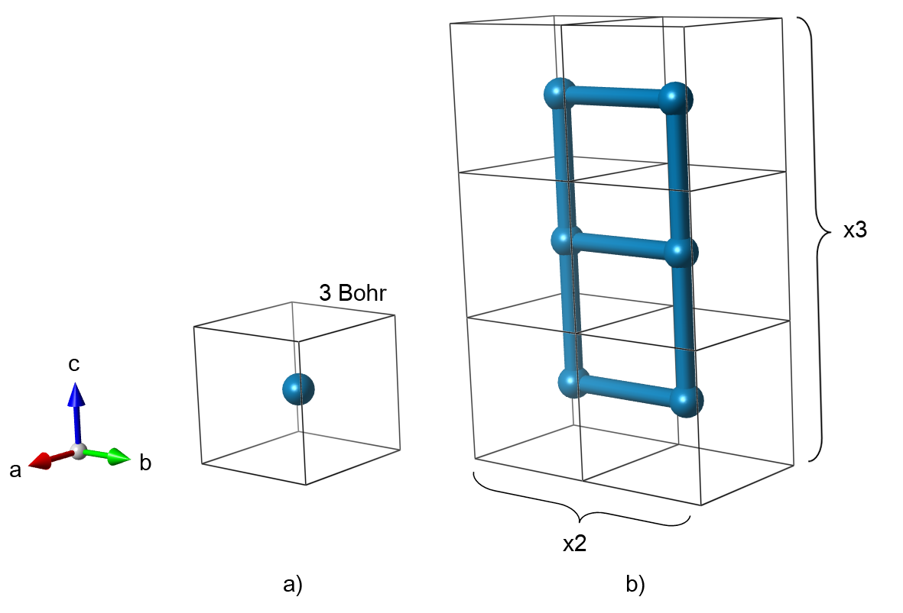
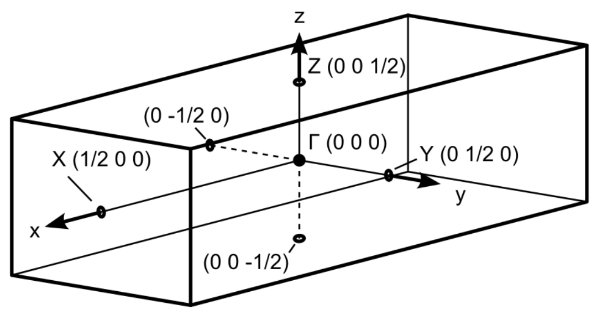
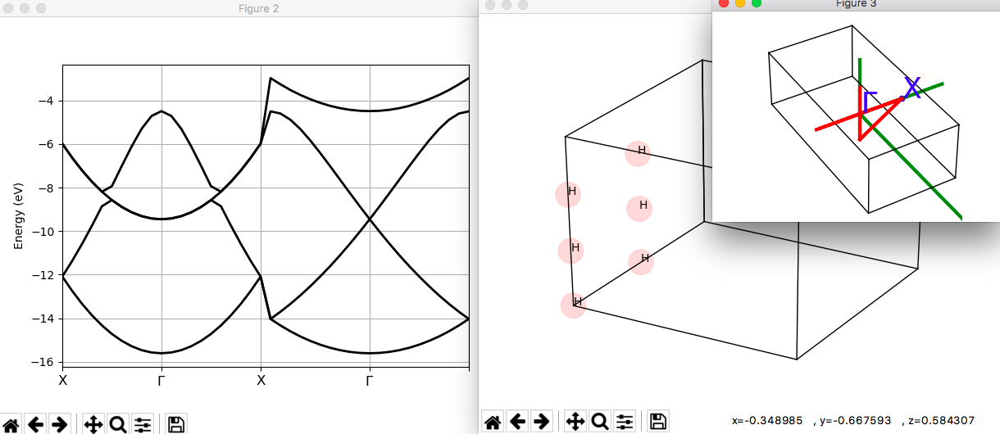
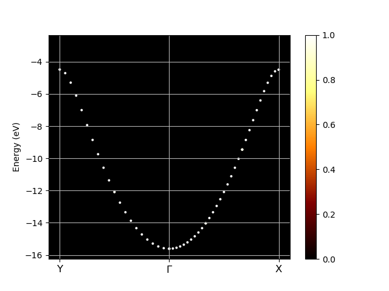

# Tutorial on fold2bloch  

## Unfolding the electronic structure of a lattice of Hydrogen atoms.  

Supercells are often used in electronic structure calculations in order to
model compound alloys, defects, etc. The band structure obtained directly from
these calculations is hard to interpret due to the Brillouin zone folding as a
result of its reduced size for the supercell, compared to that for the
unperturbed host unit cell. 
The unfolding technique used in Abinit is the one presented in [[cite:Rubel2014]]. 

This tutorial aims at demonstrating how to unfold the band structure of a
supercell and present it in the basis of conventional Bloch wave vectors
inherent to the unperturbed unit cell. We will construct a supercell of 6
hydrogen atoms, perform self-consistent cycle and plot the corresponding band
structure. At the end, we will recover the familiar dispersion relation using
the *fold2Bloch* utility. See also the [[help:fold2bloch]].

[TUTORIAL_README]

This tutorial should take about 1 hour.

## Creating a Hydrogen supercell structure
  
Let's begin with the simplest structure: a lattice of hydrogen atoms. It is a
convenient starting point since the hybridization between $s$-orbitals results
in a well known dispersion relation for the energy eigenvalues as a function
of the wave vector $k$:

$$E(k)=E_0 - 2A \cos(kb)$$

Here $b$ is the lattice spacing and $A$ reflects the strength of
hybridization between adjacent $s$-orbitals. For more details please refer to
the Feynman's Lectures on Physics (vol 3, chapter 13).

Our model structure will be a cubic lattice of hydrogen atoms spaced 3 Bohr apart. 
The primitive cell contains only one atom. Here we chose to represent
the same structure with a 6 atom supercell. Such a large cell is redundant in
this case, since there is nothing that disturbs the original symmetry.
However, we made this choice on purpose in order to observe the zone folding.


:   Fig. 1: Primitive unit cell (a) and 1x2x3 supercell (b) that represent a cubic
    lattice of hydrogen atoms.

Since we are interested in the band structure, we need to select a path in the
reciprocal space which will be used for plotting. The supercell was expanded
in Y and Z directions. Accordingly, the reciprocal space shrinks along the
same directions. We select those directions for the band structure plot as
they will be affected by the zone folding.


:   Fig. 2: Brillouin zone of the supercell.

*Before beginning, you might consider to work in a different subdirectory as
for the other tutorials. Why not Work_fold2Bloch?*

In order to use the *fold2Bloch*, you need to first generate a wave function file (*WFK* file).

In the directory ~abinit/tests/tutorial/Input/Work_fold2Bloch, copy the files
tests/tutorial/Input/tfold2bloch_1.files and tests/tutorial/Input/tfold2bloch_1.in. 

```sh
cd $ABI_TUTORIAL/Input
mkdir Work_fold2Bloch
cd Work_fold2Bloch
cp ../tfold2bloch_1.files .   # You will need to edit this file.
cp ../tfold2bloch_1.in .
```



The input file has two datasets,
the first to generate the *WFK* file, and the second to draw the band structure.
Now you are ready to run Abinit. Issue the following:

    abinit < tfold2bloch_1.files > & tfold1bloch_1.log &

This will generate a self consistent charge density for the 6 Hydrogen atom
supercell structure, and the wave function file, *tfold2bloch_1o_WFK*, which is
needed for unfolding with *fold2Bloch*.

## Folded band structure
  
Before we proceed with the unfolding, let's plot the "standard" band structure
of a supercell. We will be looking for signatures of the zone folding. In
order to do this you will need the following scripts:
    
1.  energy_eig-abinit.sh
2.  plot_band.m
    
which are located at /abinit/doc/tutorial/fold2Bloch_assets/

Execute the *energy_eig-avinit.sh* script

    ./energy_eig-abinit.sh tfold2bloch_1o_DS2_EIG_

This will generate an output file: *tfold2bloch_1o_DS2_EIG.dat*

Edit *plot_band.m* file and point to the newly created *tfold2bloch_1o_DS2_EIG.dat* file.

    data=load('tfold2bloch_1o_DS2_EIG.dat');

Then, run the *plot_band.m* script in MatLab

    >&gtplot;_band

This will plot the band structure of the 6 atom Hydrogen supercell created.

Lastly, compare the image obtained to the band structure image below.


:   Fig. 3: 6 atom hydrogen supercell band structure plot

Here you can see that the band structure does not look like a cosine function
along directions Y-Gamma and Z-Gamma. The band structure is folded according
to the multiplicity along those directions used when constructing the supercell (Fig. 1b).

!!! tip

    If |AbiPy| is installed on your machine, you can use the |abiopen| script
    with the `--expose` option to visualize the band dispersion:

        abiopen.py tfold2bloch_1o_DS2_GSR.nc --expose




## Bloch spectral weights with fold2Bloch
  
Next step is to execute *fold2Bloch* using the wave function file from the 2nd
dataset, and multiplicity in the corresponding directions, used when
constructing the super-cell (x:y:z), included as part of the command line
arguments. For this example the multiplicity used was (1:2:3)

Execute the following command:

    fold2Bloch tfold2bloch_WFK 1:2:3

You should see the following:
    
```
      ***********************
      ** Fold2Bloch V 1.0  **
      **Build  Oct 16, 2014**
      ***********************
    2% Processing K point:    0.000000   -0.500000    0.000000
    4% Processing K point:    0.000000   -0.450000    0.000000
    6% Processing K point:    0.000000   -0.400000    0.000000
...
   95% Processing K point:    0.000000    0.000000    0.400000
   97% Processing K point:    0.000000    0.000000    0.450000
  100% Processing K point:    0.000000    0.000000    0.500000
 Number of K points processed:          43
 Data was written to: fold2Bloch.out
 Data format: KX, KY, KZ, Eigenvalue(Ha), Weight
```

That output tells us which K-point was processed, total number of K-points
processed, output file, and the format that the data is written in.

Now take a look at the *fold2Bloch.out*. The first few lines should be as follows:

    less fold2Bloch.out
    
    0.000000  -0.250000   0.000000  -0.317960   0.579542
    0.000000  -0.250000   0.333333  -0.317960   0.000000
    0.000000  -0.250000  -0.333333  -0.317960   0.000000
    0.000000   0.250000   0.000000  -0.317960   0.420458
    0.000000   0.250000   0.333333  -0.317960   0.000000
    0.000000   0.250000  -0.333333  -0.317960   0.000000
    0.000000  -0.250000   0.000000  -0.317960   0.420458
    0.000000  -0.250000   0.333333  -0.317960   0.000000
    0.000000  -0.250000  -0.333333  -0.317960   0.000000
    0.000000   0.250000   0.000000  -0.317960   0.579542
    0.000000   0.250000   0.333333  -0.317960   0.000000
    0.000000   0.250000  -0.333333  -0.317960   0.000000
    0.000000  -0.250000   0.000000  -0.093527   0.000000
    0.000000  -0.250000   0.333333  -0.093527   0.315820
    0.000000  -0.250000  -0.333333  -0.093527   0.251111
    0.000000   0.250000   0.000000  -0.093527   0.000000
    0.000000   0.250000   0.333333  -0.093527   0.144884
    0.000000   0.250000  -0.333333  -0.093527   0.288185
    0.000000  -0.250000   0.000000  -0.093527   0.000000
    0.000000  -0.250000   0.333333  -0.093527   0.494070
    0.000000  -0.250000  -0.333333  -0.093527   0.103712
    0.000000   0.250000   0.000000  -0.093527   0.000000
    0.000000   0.250000   0.333333  -0.093527   0.386301
    0.000000   0.250000  -0.333333  -0.093527   0.015917
    ...

Let's take a moment to analyse the output. Columns 1-3 correspond to kx, ky
and kz of the unfolded bands; the 4th column is the energy eigenvalue in [Ha]
and the 5th column corresponds to a spectral weight of the k-point after
unfolding. Do not confuse it with k-point weight, which represents its
multiplicity in the Brillouin zone. Since our supercell contains 6 unit cells
(1 x 2 x 3), each eigenvalue in the solution contains information about 6 Bloch
wave vectors, i.e., unfolded into 6 k-points. The relative contribution of
these k-points is determined by the spectral weight.

Lines 1-6 represent unfolding of the 1st eigenvalue of -0.31796 Ha. This
eigenvalue corresponds to the Bloch wave vectors of (0 ±1/2 0) as they have a
non-zero weight. The weights total 1 for normalization. This eigenvalue is
degenerate, so lines 7-12 look very similar. When a disorder is present (in a
form of defects, distortions, impurities) individual eigenstates may not
express an exclusive Bloch character any longer. This can have some
interesting consequences for transport or optical properties, which are not
apparent from the folded band structure.

!!! note

    the whole output is much bigger than the sample provided above. For the
    band structure visualization proceed to the next step.

## Unfolded band structure
  
Lets visualize the unfolded band structure. It is different from a regular
band structure plot, though. Now we have one additional dimension -- the Bloch spectral weight. 
There are several alternative visualization strategies. Here
we use the scatter plot with the point size proportional to the spectral weight. 
The following MatLab script will help you build a graph for any
*fold2Bloch* output: [ubs_dots.m](fold2bloch_assets/ubs_dots.m)

Make sure the following parameters in *ubs_dots.m* are set as follows:
    
```matlab
KPATH = [0 1/2 0; ...
        0 0 0; ...
        0 0 1/2];

finpt='tfold2bloch_1o.f2b';
```

and:
    
```matlab
G = [0.3333333 0.0000000 0.0000000;
   0.000000  0.1666667 0.0000000;
   0.000000  0.000000  0.1111111]; % Reciprocal latt. vect. [Bohr^-1] from *.out
```
    
Reciprocal lattice vector information must match that in *tfold2bloch_1.out*:
    
    Real(R)+Recip(G) space primitive vectors, cartesian coordinates (Bohr,Bohr^-1):
     R(1)=  3.0000000  0.0000000  0.0000000  G(1)=  0.3333333  0.0000000  0.0000000
     R(2)=  0.0000000  6.0000000  0.0000000  G(2)=  0.0000000  0.1666667  0.0000000
     R(3)=  0.0000000  0.0000000  9.0000000  G(3)=  0.0000000  0.0000000  0.1111111
     Unit cell volume ucvol=  1.6200000E+02 bohr^3
     Angles (23,13,12)=  9.00000000E+01  9.00000000E+01  9.00000000E+01 degrees

For graphing any other *fold2Bloch* output, make sure that the "%%Init Parameters" 
are set accordingly to size of the supercell constructed.

After running the script you should see the following graph:


As you can see the unfolded band structure perfectly reproduces the
anticipated dispersion relation $E(k)=E_0 - 2A \cos(kb)$. We can even
estimate the magnitude of the hopping matrix element between adjacent atoms
VssG = -A. The band width is 4A = (-1) - (-12) = 11 eV which results in VssG = -2.75 eV.

To analyze the results with AbiPy use:

    abiopen.py tfold2bloch_FOLD2BLOCH.nc

to open the file inside |ipython| and then type:

```ipython
# Plot unfolded bands along the path defined by kbounds.
In [1] kbounds = [0, 1/2, 0, 0, 0, 0, 0, 0, 1/2]
In [2] klabels = ["Y", r"$\Gamma$", "X"]
In [3] abifile.plot_unfolded(kbounds, klabels, title="Unfolded bands")
```



See also 
[this example](http://abinit.github.io/abipy/gallery/plot_fold2bloch.html#sphx-glr-gallery-plot-fold2bloch-py).
