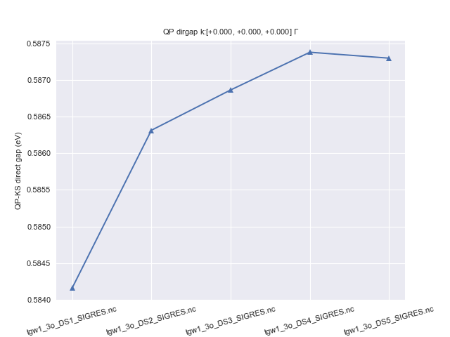

# First tutorial on GW

## The quasi-particle band structure of Silicon in the GW approximation.

This tutorial aims at showing how to calculate self-energy corrections to the
DFT Kohn-Sham (KS) eigenvalues in the GW approximation.

A brief description of the formalism and of the equations implemented in the
code can be found in the [[theory:mbt|GW_notes]].
The different formulas of the GW formalism have been written in a [[pdf:gwa|pdf document]]
by Valerio Olevano who also wrote the first version of this tutorial.
For a much more consistent discussion of the theoretical aspects of the GW
method we refer the reader to the review article
[[cite:Aulbur2001|Quasiparticle calculations in solids]] by W.G Aulbur et al
also available [here](https://www.abinit.org/sites/default/files/quasiparticle_calculations_in_solids.pdf.bz2).

It is suggested to acknowledge the efforts of developers of
the GW part of ABINIT, by citing the [[cite:Gonze2005|2005 ABINIT publication]].

The user should be familiarized with the four basic tutorials of ABINIT,
see the [[help:index|tutorial home page]]
After this first tutorial on GW, you should read the [second GW tutorial](gw2).

This tutorial should take about 2 hours.

[TUTORIAL_READMEV9]

## 1 General example of an almost converged GW calculation

*Before beginning, you might consider to work in a different subdirectory as
for the other tutorials. Why not Work_gw1?*

At the end of [tutorial 3](base3), we computed the KS band
structure of silicon. In this approximation, the band dispersion as well as
the band widths are reasonable but the band gaps are qualitatively wrong.
Now we will compute the band gaps much more accurately, using the so-called
GW approximation.

We start by an example, in which we show how to perform in a single input file
the calculation of the ground state density, the Kohn Sham band structure, the
screening, and the GW corrections. We use reasonable values for the parameters
of the calculation. The discussion on the convergence tests is postponed to
the next paragraphs. We will see that GW calculations are **much more** time-consuming
than the computation of the KS eigenvalues.

So, let us run immediately this calculation, and while it is running, we will
explain what has been done.

```sh
cd $ABI_TESTS/tutorial/Input
mkdir Work_gw1
cd Work_gw1
cp ../tgw1_x.files .  # modify this file as usual (see tutorial 1)
cp ../tgw1_1.in .
```

Then, issue:

    abinit < tgw1_x.files > log 2> err &

Please run this job in background because it takes about 1 minute.
In the meantime, you should read the following.

#### 1.a The four steps of a GW calculation.

In order to perform a standard one-shot GW calculation one has to:

  1. Run a converged Ground State calculation to obtain the self-consistent density.

  2. Perform a non self-consistent run to compute the KS eigenvalues and the eigenfunctions
     including several empty states. Note that, unlike standard band structure calculations,
     here the KS states must be computed on a regular grid of **k**-points.

  3. Use [[optdriver]] = 3 to compute the independent-particle susceptibility $\chi^0$ on a regular grid of
     **q**-points, for at least two frequencies (usually, $\omega=0$ and a large purely imaginary
     frequency - of the order of the plasmon frequency, a dozen of eV).
     The inverse dielectric matrix $\epsilon^{-1}$ is then obtained via matrix inversion and stored in an external file (SCR).
     The list of **q**-points is automatically defined by the k-mesh used to generate the KS states in the previous step.

  4. Use [[optdriver]] = 4 to compute the self-energy $\Sigma$ matrix elements for a given set of k-points in order
     to obtain the GW quasiparticle energies.
     Note that the **k**-point must belong to the k-mesh used to generate the WFK file in step 2.

The flowchart diagram of a standard one-shot run is depicted in the figure below.


The input file tgw1_1.in has precisely that structure: there are four datasets.

The first dataset performs the SCF calculation to get the density. The second
dataset reads the previous density file and performs a NSCF run including
several empty states. The third dataset reads the WFK file produced in the
previous step and drives the computation of susceptibility and dielectric
matrices, producing another specialized file, *tgw1_xo_DS2_SCR* (*_SCR* for
"Screening", actually the inverse dielectric matrix $\epsilon^{-1}$). Then, in the fourth
dataset, the code calculates the quasiparticle energies for the 4th and 5th bands at the $\Gamma$ point.

So, you can edit this *tgw1_1.in* file.



The dataset-independent part of this file (the last half of the file),
contains the usual set of input variables describing the cell, atom types,
number, position, planewave cut-off energy, SCF convergence parameters driving
the KS band structure calculation. Then, for the fourth datasets, you
will find specialized additional input variables.

#### 1.b Generating the Kohn-Sham band structure: the WFK file.

Dataset 1 is a rather standard SCF calculation. It is worth noticing that we
use [[tolvrs]] to stop the SCF cycle because we want a well-converged KS potential
to be used in the subsequent NSCF calculation. Dataset 2 computes 40 bands and
we set [[nbdbuf]] to 5 so that only the first 35 states must be converged within [[tolwfr]].
The 5 highest energy states are simply not considered when checking the convergence.

    ############
    # Dataset 1
    ############
    # SCF-GS run
    nband1  6
    tolvrs1 1.0e-10

    ############
    # Dataset 2
    ############
    # Definition of parameters for the calculation of the WFK file
    nband2      40       # Number of (occ and empty) bands to be computed
    nbdbuf2      5
    iscf2       -2
    getden2     -1
    tolwfr2  1.0d-18     # Will stop when this tolerance is achieved

!!! important

    The [[nbdbuf]] trick allows us to **save several minimization steps** because the
    last bands usually require more iterations to converge in the iterative diagonalization algorithms.
    Also note that it is a very good idea to increase significantly the value of [[nbdbuf]] when
    computing many empty states. As a rule of thumb use 10% of [[nband]] or even more
    in complicated systems. This can really make a **huge difference** at the level of the wall time.

#### 1.c Generating the screening: the SCR file.

In dataset 3, the calculation of the screening (KS susceptibility $\chi^0$ and then inverse dielectric
matrix $\epsilon^{-1}$) is performed. We need to set [[optdriver]]=3 to do that:

    optdriver3  3        # Screening calculation

The [[getwfk]] input variable is similar to other "get" input variables of ABINIT:

    getwfk3     -1       # Obtain WFK file from previous dataset

In this case, it tells the code to use the WFK file calculated in the previous dataset.

Then, three input variables describe the computation:

    nband3      17   # Bands used in the screening calculation
    ecuteps3    3.6  # Cut-off energy of the planewave set to represent the dielectric matrix

In this case, we use 17 bands to calculate the KS response function $\chi^{0}$.
The dimension of $\chi^{0}$, as well as all the other matrices ($\chi$, $\epsilon^{-1}$) is
determined by the cut-off energy [[ecuteps]] = 3.6 Hartree, which yields 169 planewaves in our case.

Finally, we define the frequencies at which the screening must be evaluated:
$\omega=0.0$ eV and the imaginary frequency $\omega= i 16.7$ eV. The latter is determined by
the input variable [[ppmfrq]]

    ppmfrq3    16.7 eV  # Imaginary frequency where to calculate the screening

The two frequencies are used to calculate the plasmon-pole model parameters.
For the non-zero frequency it is recommended to use a value close to the
plasmon frequency for the plasmon-pole model to work well. Plasmons
frequencies are usually close to 0.5 Hartree. The parameters for the screening
calculation are not far from the ones that give converged Energy Loss Function
($-\mathrm{Im} \epsilon^{-1}_{00}$) spectra, so that one can start up by using indications
from EELS calculations existing in literature.

#### 1.d Computing the GW energies.

In dataset 4 the calculation of the Self-Energy matrix elements is performed.
One needs to define the driver option as well as the _WFK and _SCR files.

    optdriver4  4       # Self-Energy calculation
    getwfk4    -2       # Obtain WFK file from dataset 2
    getscr4    -1       # Obtain SCR file from previous dataset

The [[getscr]] input variable is similar to other "get" input variables of ABINIT.

Then, comes the definition of parameters needed to compute the self-energy. As
for the computation of the susceptibility and dielectric matrices, one must
define the set of bands and two sets of planewaves:

    nband4       30      # Bands to be used in the Self-Energy calculation
    ecutsigx4   8.0      # Dimension of the G sum in Sigma_x
                         # (the dimension in Sigma_c is controlled by npweps)

In this case, [[nband]] controls the number of bands used to calculate the
correlation part of the Self-Energy while [[ecutsigx]] gives the number of
planewaves used to calculate $\Sigma_x$ (the exchange part of the self-energy). The
size of the planewave set used to compute $\Sigma_c$ (the correlation part of the
self-energy) is controlled by [[ecuteps]] and cannot be larger than the value
used to generate the SCR file.
For the initial convergence studies, it is advised to set [[ecutsigx]] to a value as high
as [[ecut]] since, any way, this parameter is not much influential on the total computational time.
Note that exact treatment of the exchange part requires, in principle, ecutsigx = 4 ecut.

Then, come the parameters defining the k-points and the band indices for which
the quasiparticle energies will be computed:

    nkptgw4      1           # number of k-point where to calculate the GW correction
    kptgw4  0.00  0.00  0.00 # k-points
    bdgw4       4  5         # calculate GW corrections for bands from 4 to 5

[[nkptgw]] defines the number of **k**-points for which the GW corrections will be
computed. The **k**-point reduced coordinates are specified in [[kptgw]].
They **must belong** to the k-mesh used to generate the WFK file. Hence
if you wish the GW correction in a particular **k**-point, you should choose a
grid containing it. Usually this is done by taking the **k**-point grid where the
convergence is achieved and shifting it such as at least one k-point is placed
on the wished position in the Brillouin zone. [[bdgw]] gives the
minimum/maximum band whose energies are calculated for each selected **k**-point.

There is an additional parameter, called [[zcut]], related to the self-energy
computation. It is meant to avoid some divergences that might occur in the
calculation due to integrable poles along the integration path.

#### 1.e Examination of the output file.

Let us hope that your calculation has been completed, and that we can examine
the output file. Open *tgw1_1.out* in your preferred editor and find the section
corresponding to DATASET 3.



After the description of the unit cell and of the pseudopotentials, you will
find the list of **k**-points used for the electrons and the grid of **q**-points (in
the Irreducible part of the Brillouin Zone) on which the susceptibility and
dielectric matrices will be computed.

```
 ==== K-mesh for the wavefunctions ====
 Number of points in the irreducible wedge :     6
 Reduced coordinates and weights :

     1)    -2.50000000E-01 -2.50000000E-01  0.00000000E+00       0.18750
     2)    -2.50000000E-01  2.50000000E-01  0.00000000E+00       0.37500
     3)     5.00000000E-01  5.00000000E-01  0.00000000E+00       0.09375
     4)    -2.50000000E-01  5.00000000E-01  2.50000000E-01       0.18750
     5)     5.00000000E-01  0.00000000E+00  0.00000000E+00       0.12500
     6)     0.00000000E+00  0.00000000E+00  0.00000000E+00       0.03125

 Together with 48 symmetry operations and time-reversal symmetry
 yields    32 points in the full Brillouin Zone.


 ==== Q-mesh for the screening function ====
 Number of points in the irreducible wedge :     6
 Reduced coordinates and weights :

     1)     0.00000000E+00  0.00000000E+00  0.00000000E+00       0.03125
     2)     5.00000000E-01  5.00000000E-01  0.00000000E+00       0.09375
     3)     5.00000000E-01  2.50000000E-01  2.50000000E-01       0.37500
     4)     0.00000000E+00  5.00000000E-01  0.00000000E+00       0.12500
     5)     5.00000000E-01 -2.50000000E-01  2.50000000E-01       0.18750
     6)     0.00000000E+00 -2.50000000E-01 -2.50000000E-01       0.18750

 Together with 48 symmetry operations and time-reversal symmetry
 yields    32 points in the full Brillouin Zone.
```

The q-mesh is the set of points defined as all
the possible differences among the **k**-points ( $\mathbf{q} =\mathbf{k}-\mathbf{k}'$ ) of the grid chosen to
generate the WFK file. From the last statement it is clear the importance of
choosing homogeneous **k**-point grids in order to minimize the number of **q**-points is clear.

After this section, the code prints the parameters of the FFT grid needed to
represent the wavefunctions and to compute their convolution (required for the
screening matrices). Then we have some information about the MPI distribution
of the bands and the total number of valence electrons computed by integrating
the density in the unit cell.

```
 setmesh: FFT mesh size selected  =  20x 20x 20
          total number of points  =     8000


- screening: taking advantage of time-reversal symmetry
- Maximum band index for partially occupied states nbvw = 4
- Remaining bands to be divided among processors   nbcw = 13
- Number of bands treated by each node ~13

 Number of electrons calculated from density =    7.9999; Expected =    8.0000
 average of density, n =  0.030004
 r_s =    1.9964
 omega_plasma =   16.7087 [eV]
```

On the basis of the density, one can obtain the classical Drude plasmon
frequency. The next lines calculate the average density of the system, and
evaluate the Wigner radius $r_s$, then compute the Drude plasmon frequency.

```
 Number of electrons calculated from density =    7.9999; Expected =    8.0000
 average of density, n =  0.030004
 r_s =    1.9964
 omega_plasma =   16.7087 [eV]
```

This is the value used by default for [[ppmfrq]]. It is in fact the second frequency
where the code calculates the dielectric matrix to adjust the plasmon-pole
model parameters.

It has been found that Drude plasma frequency is a
reasonable value where to adjust the model. The control over this parameter is
however left to the user in order to check that the result does not change
when changing [[ppmfrq]]. If it is the case, then the plasmon-pole model is
not appropriated and one should go beyond by taking into account a full
dynamical dependence in the screening (see later, the contour-deformation
method). However, the plasmon-pole model has been found to work well for a
very large range of solid-state systems when focusing only on the real part of the GW
corrections.

At the end of the screening calculation, the macroscopic dielectric constant is printed:

      dielectric constant =  24.4980
      dielectric constant without local fields =  27.1361


!!! note

    Note that the convergence in the dielectric constant **does not guarantee** the
    convergence in the GW corrections. In fact, the dielectric constant is
    representative of only one element i.e. the head of the full dielectric
    matrix. Even if the convergence on the dielectric constant with local fields
    takes somehow into account also other non-diagonal elements. In a GW
    calculation the whole $\epsilon^{-1}$ matrix is used to build the Self-Energy operator.

The dielectric constant reported here is the so-called RPA dielectric constant
due to the electrons. Although evaluated at zero frequency, it is understood
that the ionic response is not included (this term can be computed with DFPT
and ANADDB). The RPA dielectric constant restricted to electronic effects is
also not the same as the one computed in the DFPT part of ABINIT, that
includes exchange-correlation effects.

We now enter the fourth dataset. As for dataset 3, after some general
information (origin of WFK file, header, description of unit cell, **k**-points,
**q**-points), the description of the FFT grid and jellium parameters, there is
the echo of parameters for the plasmon-pole model, and the inverse dielectric
function (the screening). The self-energy operator has been constructed, and
one can evaluate the GW energies for each state.

The final results are:

```yaml
--- !SelfEnergy_ee
kpoint     : [   0.000,    0.000,    0.000, ]
spin       : 1
KS_gap     :    2.505
QP_gap     :    3.120
Delta_QP_KS:    0.614
data: !SigmaeeData |
     Band     E0 <VxcDFT>   SigX SigC(E0)      Z dSigC/dE  Sig(E)    E-E0       E
        4   5.967 -11.268 -13.253   1.814   0.770  -0.299 -11.400  -0.132   5.835
        5   8.472 -10.056  -5.573  -3.856   0.770  -0.298  -9.573   0.483   8.955
...
```

For the desired **k**-point ($\Gamma$ point), for state 4, then state 5, one finds different information:

  * E0 is the KS eigenenergy
  * VxcDFT gives the average KS exchange-correlation potential
  * SigX gives the exchange contribution to the self-energy
  * SigC(E0) gives the correlation contribution to the self-energy, evaluated at the KS eigenenergy
  * Z is the renormalisation factor
  * dSigC/dE is the energy derivative of SigC with respect to the energy
  * SigC(E) gives the correlation contribution to the self-energy, evaluated at the GW energy
  * E-E0 is the difference between GW energy and KS eigenenergy
  * E is the GW quasiparticle energy

In this case, the gap is also analyzed: E^0_gap is the direct KS gap at
that particular **k**-point (and spin, in the case of spin-polarized calculations), E^GW_gap
is the GW one, and DeltaE^GW_gap is the difference. This direct gap is always
computed between the band whose number is equal to the number of electrons in
the cell divided by two (integer part, in case of spin-polarized calculation),
and the next one.
This means that the value reported by the code may be wrong if the final QP energies
obtained in the perturbative approach are not ordered by increasing energy anymore.
So it's always a good idea to check that the "gap" reported by the code corresponds
to the real QP direct gap.

!!! warning

    For a metal, these two bands do not systematically
    lie below and above the KS Fermi energy - but the concept of a direct gap is not relevant in that case.
    Moreover one should compute the Fermy energy of the QP system.

It is seen that the average KS exchange-correlation potential for the
state 4 (a valence state) is rather close to the exchange self-energy
correction. For that state, the correlation correction is small, and the
difference between KS and GW energies is also small (0.128 eV). By
contrast, the exchange self-energy is much smaller than the average Kohn-Sham
potential for the state 5 (a conduction state), but the correlation correction
is much larger than for state 4. On the whole, the difference between Kohn-
Sham and GW energies is not very large, but nevertheless, it is quite
important when compared with the size of the gap.

If |AbiPy| is installed on your machine, you can use the |abiopen| script
with the `--print` option to extract the results from the SIGRES.nc file
and print them to terminal:

```
abiopen.py tgw1_1o_DS4_SIGRES.nc -p

================================= Structure =================================
Full Formula (Si2)
Reduced Formula: Si
abc   :   3.823046   3.823046   3.823046
angles:  60.000000  60.000000  60.000000
Sites (2)
  #  SP       a     b     c
---  ----  ----  ----  ----
  0  Si    0     0     0
  1  Si    0.25  0.25  0.25

Abinit Spacegroup: spgid: 0, num_spatial_symmetries: 48, has_timerev: True, symmorphic: True

============================== Kohn-Sham bands ==============================
Number of electrons: 8.0, Fermi level: 6.246 (eV)
nsppol: 1, nkpt: 6, mband: 30, nspinor: 1, nspden: 1
smearing scheme: none, tsmear_eV: 0.272, occopt: 1
Direct gap:
    Energy: 2.505 (eV)
    Initial state: spin=0, kpt=[+0.000, +0.000, +0.000], weight: 0.031, band=3, eig=5.967, occ=2.000
    Final state:   spin=0, kpt=[+0.000, +0.000, +0.000], weight: 0.031, band=4, eig=8.472, occ=0.000
Fundamental gap:
    Energy: 0.558 (eV)
    Initial state: spin=0, kpt=[+0.000, +0.000, +0.000], weight: 0.031, band=3, eig=5.967, occ=2.000
    Final state:   spin=0, kpt=[+0.500, +0.500, +0.000], weight: 0.094, band=4, eig=6.525, occ=0.000
Bandwidth: 12.101 (eV)
Valence maximum located at:
    spin=0, kpt=[+0.000, +0.000, +0.000], weight: 0.031, band=3, eig=5.967, occ=2.000
Conduction minimum located at:
    spin=0, kpt=[+0.500, +0.500, +0.000], weight: 0.094, band=4, eig=6.525, occ=0.000


=============================== QP direct gaps ===============================
QP_dirgap: 3.120 (eV) for K-point: [+0.000, +0.000, +0.000] $\Gamma$, spin: 0


============== QP results for each k-point and spin (All in eV) ==============
K-point: [+0.000, +0.000, +0.000] $\Gamma$, spin: 0
   band     e0    qpe  qpe_diago   vxcme  sigxme  sigcmee0  vUme   ze0
3     3  5.967  5.835      5.796 -11.268 -13.253     1.814   0.0  0.77
4     4  8.472  8.955      9.099 -10.056  -5.573    -3.856   0.0  0.77
```

For further details about the SIGRES.nc file and the AbiPy API see the |SigresFileNb|.

## 2 Preparing convergence studies: Kohn-Sham structure (WFK file) and screening (SCR file)

In the following sections, we will perform different convergence studies. In
order to keep the CPU time at a reasonable level, we will use fake WFK and SCR
data. Moreover we will only consider the correction at the $\Gamma$ point only. In
this way, we will be able to verify convergence aspects that could be very
cumbersome (at least in the framework of a tutorial) if more **k**-points were
used. Testing the convergence with a $\Gamma$ point only grid of **k**-point represents a
convenient approach although some caution should always be used.

In directory *Work_gw1*, copy the file
*../tgw1_2.in*, and modify the *tgw1_x.files* file as usual.
Edit the *tgw1_2.in* file, and take the time to examine it.

Then, issue:

    abinit < tgw1_x.files > tgw1_2.log 2> err &

After this step you will need the WFK and SCR files produced in this run for
the next runs. Move *tgw1o_DS2_WFK* to *tgw1o_DS1_WFK* and *tgw1o_DS3_SCR* to *tgw1o_DS1_SCR*.

The next sections are intended to show you how to find the converged
parameters for a GW calculation. In principle, the following parameters might
be used to decrease the CPU time and/or the memory requirements:
[[optdriver]] = 3 [[ecuteps]], [[nband]] and, for [[optdriver]] = 4, [[nband]].

Before 2008, the advice was indeed to check independently what was the best
value for each of these. However, with the evolution of memory/disk space, as
well as the advent of new techniques to diminish the number of bands that is
needed (see e.g. [[cite:Bruneval2008]] and
the input variable [[gwcomp]]), standard calculations nowadays only need the
tuning of [[nband]] [[ecuteps]], simultaneously for [[optdriver]]=3 and =4.
Indeed, [[ecutwfn]] and can have the default value of [[ecut]], while
[[ecutsigx]] can have the default value of 4 * [[ecut]] for norm-conserving
pseudopotentials, or [[pawecutdg]] for PAW calculations.

We begin by the convergence study on the only important parameter needed in the self-
energy calculation ([[optdriver]] = 4): [[nband]].
This is because for these, we will not need a double dataset loop to check
this convergence, and we will rely on the previously determined SCR file.

## 3 Convergence on the number of bands to calculate $\Sigma_c$

Let us check the convergence on the number of bands in the calculation of $\Sigma_c$. This convergence
study is rather important, usually, *BUT* it can be done at the same time as the
convergence study for the number of bands for the dielectric matrix.

The convergence on the number of bands to calculate the Self-Energy will be
done by defining five datasets, with increasing [[nband]]:

    ndtset  5
    nband:  50
    nband+  50

In directory *Work_gw1*, copy the file
*../tgw1_3.in*, and modify the *tgw1_x.files* file as usual.
Edit the *tgw1_3.in* file, and take the time to examine it.
Then, issue:

    abinit < tgw1_x.files > tgw1_3.log 2> err &



Edit the output file. The number of bands used for the self-energy is
mentioned in the fragments of output:

     SIGMA fundamental parameters:
     PLASMON POLE MODEL
     number of plane-waves for SigmaX                  283
     number of plane-waves for SigmaC and W            169
     number of plane-waves for wavefunctions           283
     number of bands                                    50

Gathering the GW energies for each number of bands, one gets:

     number of bands                                   50
        4   5.915 -11.652 -17.103   4.738   0.786  -0.273 -12.212  -0.560   5.355
        5   8.445  -9.700  -3.222  -6.448   0.798  -0.254  -9.676   0.024   8.470

     number of bands                                  100
        4   5.915 -11.652 -17.103   4.660   0.785  -0.274 -12.273  -0.620   5.295
        5   8.445  -9.700  -3.222  -6.522   0.797  -0.255  -9.734  -0.034   8.411

     number of bands                                  150
        4   5.915 -11.652 -17.103   4.649   0.785  -0.274 -12.281  -0.629   5.286
        5   8.445  -9.700  -3.222  -6.531   0.797  -0.255  -9.742  -0.042   8.403

     number of bands                                  200
        4   5.915 -11.652 -17.103   4.646   0.785  -0.274 -12.284  -0.632   5.284
        5   8.445  -9.700  -3.222  -6.534   0.797  -0.255  -9.745  -0.044   8.401

     number of bands                                  250
        4   5.915 -11.652 -17.103   4.645   0.785  -0.274 -12.284  -0.632   5.283
        5   8.445  -9.700  -3.222  -6.535   0.797  -0.255  -9.745  -0.045   8.400


So that [[nband]] = 100 can be considered converged within 0.01 eV.

With |AbiPy|, one can use the |abicomp| script provides to compare multiple SIGRES.nc files
Use the `--expose` option to visualize of the QP gaps extracted from the different netcdf files:

```text
$ abicomp.py sigres tgw1_3o_*_SIGRES.nc -e -sns

Output of robot.get_dataframe():
                       nsppol     qpgap  nspinor  nspden  nband  nkpt  \
tgw1_3o_DS1_SIGRES.nc       1  3.114257        1       1     50     1
tgw1_3o_DS2_SIGRES.nc       1  3.116411        1       1    100     1
tgw1_3o_DS3_SIGRES.nc       1  3.116962        1       1    150     1
tgw1_3o_DS4_SIGRES.nc       1  3.117476        1       1    200     1
tgw1_3o_DS5_SIGRES.nc       1  3.117396        1       1    250     1

                        ecutwfn   ecuteps  ecutsigx  scr_nband  sigma_nband  \
tgw1_3o_DS1_SIGRES.nc  7.563851  5.105599  7.563851         25           50
tgw1_3o_DS2_SIGRES.nc  7.563851  5.105599  7.563851         25          100
tgw1_3o_DS3_SIGRES.nc  7.563851  5.105599  7.563851         25          150
tgw1_3o_DS4_SIGRES.nc  7.563851  5.105599  7.563851         25          200
tgw1_3o_DS5_SIGRES.nc  7.563851  5.105599  7.563851         25          250

                       gwcalctyp  scissor_ene
tgw1_3o_DS1_SIGRES.nc          0          0.0
tgw1_3o_DS2_SIGRES.nc          0          0.0
tgw1_3o_DS3_SIGRES.nc          0          0.0
tgw1_3o_DS4_SIGRES.nc          0          0.0
tgw1_3o_DS5_SIGRES.nc          0          0.0
```



Invoking the script without options will open an |ipython| terminal to interact with the AbiPy robot.
Use the `-nb` option to automatically generate a |jupyter| notebook that will open in your browser.
For further details about the API provided by SigRes Robots see the |SigresFileNb|
and the |G0W0LessonNb| for GW calculations powered by AbiPy.


## 4 Convergence on the number of bands to calculate the screening ($\epsilon^{-1}$)

Now, we come back to the calculation of the screening. Adequate convergence
studies will couple the change of parameters for [[optdriver]] = 3 with a
computation of the GW energy changes. One cannot rely on the convergence of
the macroscopic dielectric constant to assess the convergence of the GW energies.

As a consequence, we will define a double loop over the datasets:

    ndtset      10
    udtset      5  2

The datasets 12,22,32,42 and 52, drive the computation of the GW energies:

    # Calculation of the Self-Energy matrix elements (GW corrections)
    optdriver?2   4
    getscr?2     -1
    ecutsigx      8.0
    nband?2       100

The datasets 11,21,31,41 and 51, drive the corresponding computation of the screening:

    # Calculation of the screening (epsilon^-1 matrix)
    optdriver?1  3

In this latter series, we will have to vary the two different parameters [[ecuteps]] and [[nband]].

Let us begin with [[nband]].
This convergence study is rather important. It can be done at the same time as
the convergence study for the number of bands for the self-energy. Note that
the number of bands used to calculate both the screening and the self-energy
can be lowered by a large amount by resorting to the extrapolar technique (see
the input variable [[gwcomp]]).

Second, we check the convergence on the number of bands in the calculation of
the screening. This will be done by defining five datasets, with increasing [[nband]]:

    nband11  25
    nband21  50
    nband31  100
    nband41  150
    nband51  200


In directory *Work_gw1*, copy the file *../tgw1_4.in*, and modify the
*tgw1_x.files* file as usual. Edit the *tgw1_4.in* file, and take the time to examine it.

Then, issue:

    abinit < tgw1_x.files > tgw1_4.log 2> err &



Edit the output file. The number of bands used for the wavefunctions in the
computation of the screening is mentioned in the fragments of output:

     EPSILON^-1 parameters (SCR file):
     dimension of the eps^-1 matrix on file            169
     dimension of the eps^-1 matrix used               169
     number of plane-waves for wavefunctions           283
     number of bands                                    25


Gathering the macroscopic dielectric constant and GW energies for each number
of bands, one gets:

     number of bands                                    25
     dielectric constant =  96.4962
     dielectric constant without local fields = 140.5247
     4   5.915 -11.652 -17.103   4.660   0.785  -0.274 -12.273  -0.620   5.295
     5   8.445  -9.700  -3.222  -6.522   0.797  -0.255  -9.734  -0.034   8.411

     number of bands                                    50
     dielectric constant =  97.6590
     dielectric constant without local fields = 140.5293
     4   5.915 -11.652 -17.103   4.471   0.785  -0.274 -12.421  -0.768   5.147
     5   8.445  -9.700  -3.222  -6.710   0.795  -0.257  -9.884  -0.184   8.261

     number of bands                                   100
     dielectric constant =  98.3494
     dielectric constant without local fields = 140.5307
     4   5.915 -11.652 -17.103   4.384   0.785  -0.273 -12.490  -0.838   5.078
     5   8.445  -9.700  -3.222  -6.800   0.794  -0.259  -9.956  -0.255   8.190

     number of bands                                   150
     dielectric constant =  98.5074
     dielectric constant without local fields = 140.5309
     4   5.915 -11.652 -17.103   4.363   0.785  -0.274 -12.506  -0.854   5.062
     5   8.445  -9.700  -3.222  -6.820   0.794  -0.259  -9.971  -0.271   8.174

     number of bands                                   200
     dielectric constant =  98.5227
     dielectric constant without local fields = 140.5310
     4   5.915 -11.652 -17.103   4.353   0.784  -0.275 -12.513  -0.860   5.055
     5   8.445  -9.700  -3.222  -6.827   0.794  -0.259  -9.977  -0.277   8.168


So that the computation using 100 bands can be considered converged within 0.01 eV.
Note that the value of [[nband]] that converges the dielectric matrix is usually of the same order of magnitude
than the one that converges $\Sigma_c$.

## 5 Convergence on the dimension of the screening $\epsilon^{-1}$ matrix

Then, we check the convergence on the number of plane waves in the
calculation of the screening. This will be done by defining six datasets, with
increasing [[ecuteps]]:

    ecuteps:?     3.0
    ecuteps+?     1.0

In directory *Work_gw1*, copy the file *../tgw1_5.in*, and modify the
*tgw1_x.files* file as usual. Edit the *tgw1_5.in* file, and take the time to examine it.

Then, issue:

    abinit < tgw1_x.files > tgw1_5.log 2> err &



Edit the output file. The number of bands used for the wavefunctions in the
computation of the screening is mentioned in the fragments of output:

     EPSILON^-1 parameters (SCR file):
     dimension of the eps^-1 matrix                     59

Gathering the macroscopic dielectric constant and GW energies for each number
of bands, one gets:

     dimension of the eps^-1 matrix                     59
     dielectric constant =  99.2682
     dielectric constant without local fields = 140.5307
     4   5.915 -11.652 -17.103   4.560   0.788  -0.269 -12.354  -0.701   5.214
     5   8.445  -9.700  -3.222  -6.792   0.795  -0.258  -9.949  -0.249   8.196

     dimension of the eps^-1 matrix                    113
     dielectric constant =  98.4253
     dielectric constant without local fields = 140.5307
     4   5.915 -11.652 -17.103   4.427   0.785  -0.273 -12.456  -0.804   5.112
     5   8.445  -9.700  -3.222  -6.799   0.794  -0.259  -9.955  -0.255   8.191

     dimension of the eps^-1 matrix                    137
     dielectric constant =  98.4218
     dielectric constant without local fields = 140.5307
     4   5.915 -11.652 -17.103   4.403   0.785  -0.273 -12.475  -0.823   5.093
     5   8.445  -9.700  -3.222  -6.798   0.794  -0.259  -9.954  -0.254   8.192

     dimension of the eps^-1 matrix                    169
     dielectric constant =  98.3494
     dielectric constant without local fields = 140.5307
     4   5.915 -11.652 -17.103   4.384   0.785  -0.273 -12.490  -0.838   5.078
     5   8.445  -9.700  -3.222  -6.800   0.794  -0.259  -9.956  -0.255   8.190

     dimension of the eps^-1 matrix                    259
     dielectric constant =  98.3147
     dielectric constant without local fields = 140.5307
     4   5.915 -11.652 -17.103   4.373   0.785  -0.273 -12.499  -0.846   5.069
     5   8.445  -9.700  -3.222  -6.800   0.794  -0.259  -9.955  -0.255   8.190

     dimension of the eps^-1 matrix                    283
     dielectric constant =  98.3130
     dielectric constant without local fields = 140.5307
     4   5.915 -11.652 -17.103   4.371   0.785  -0.274 -12.499  -0.847   5.068
     5   8.445  -9.700  -3.222  -6.800   0.794  -0.259  -9.955  -0.255   8.190


So that ecuteps = 6.0 ([[npweps]] = 169) can be considered converged within 0.01 eV.

At this stage, we know that for the screening computation, we need
[[ecuteps]] = 6.0 Ha and [[nband]] = 100.

Of course, until now, we have skipped the most difficult part of the
convergence tests: the convergence in the number of **k**-points. It is as
important to check the convergence on this parameter, than on the other ones.
However, this might be very time consuming, since the CPU time scales as the
square of the number of **k**-points (roughly), and the number of k-points can
increase very rapidly from one possible grid to the next denser one. This is
why we will leave this out of the present tutorial, and consider that we
already know a sufficient **k**-point grid, for the last calculation.

As discussed in [[cite:Setten2017]], the convergence study for k-points
the number of bands and the cutoff energies can be decoupled
in the sense that one can start from a reasonaby coarse k-mesh to find
the converged values of [[nband]], [[ecuteps]], [[ecutsigx]] and then
fix these values and look at the convergence with respect to the BZ mesh.

## 6 Calculation of the GW corrections for the band gap at $\Gamma$

Now we try to perform a GW calculation for a real problem: the calculation of
the GW corrections for the direct band gap of bulk Silicon at the $\Gamma$ point.

In directory *Work_gw1*, copy the file
*../tgw1_6.in*, and modify the *tgw1_x.files* file as usual. Then, edit the
*tgw1_6.in file*, and, without examining it, comment the line

     ngkpt    2 2 2    # Density of k points used for the automatic tests of the tutorial

and uncomment the line

    #ngkpt    4 4 4    # Density of k points needed for a converged calculation

Then, issue:

    abinit < tgw1_x.files > tgw1_6.log 2> err &

This job lasts about 3-4 minutes so it is worth to run it before the examination of the input file.
Now, you can examine it.



We need the usual part of the input file to perform a ground state
calculation. This is done in dataset 1 and at the end we print out the
density. We use a 4x4x4 FCC grid (so, 256 **k**-points in the full Brillouin
Zone), shifted, because it is the most economical. It gives 10 **k**-points in the
Irreducible part of the Brillouin Zone. However, this **k**-point grid does not
contains the $\Gamma$ point, and one cannot perform calculations of the
self-energy corrections for other **k**-points than those present in the grid of
**k**-points in the WFK file.

Then in dataset 2 we perform a non self-consistent calculation to calculate
the KS structure in a set of 19 **k**-points in the Irreducible Brillouin
Zone. This set of **k**-points is also derived from a 4x4x4 FCC grid, but a NON-
SHIFTED one. It has the same density of points as the 10 **k**-point set, but the
symmetries are not used in the most efficient way. However, this set contains
the $\Gamma$ point, which allows us to tackle the computation of the band gap at this point.

In dataset 3 we calculate the screening. The screening calculation is very
time-consuming. So, we have decided to decrease a bit the parameters found in
the previous convergence studies. Indeed, [[nband]] has been decreased from
100 to 25. This is a drastic change. The CPU time of this part is linear with
respect to this parameter (or more exactly, with the number of conduction
bands). Thus, the CPU time has been decreased by a factor of 4. Referring to
our previous convergence study, we see that the absolute accuracy on the GW
energies is now on the order of 0.2 eV only. This would be annoying for the absolute positioning of the band energy
as required for band-offset or ionization potential of finite systems.
However, as long as we are only interested in the gap energy that is fine enough.

Finally in dataset 4 we calculate the self-energy matrix element at $\Gamma$, using
the previously determined parameters.

You should obtain the following results:

```yaml
--- !SelfEnergy_ee
kpoint     : [   0.000,    0.000,    0.000, ]
spin       : 1
KS_gap     :    2.513
QP_gap     :    3.140
Delta_QP_KS:    0.627
data: !SigmaeeData |
     Band     E0 <VxcDFT>   SigX SigC(E0)      Z dSigC/dE  Sig(E)    E-E0       E
        4   5.951 -11.271 -13.260   1.449   0.766  -0.305 -11.685  -0.414   5.537
        5   8.464 -10.056  -5.572  -4.207   0.767  -0.304  -9.843   0.213   8.677
...
```


So that the DFT energy gap in $\Gamma$ is about 2.51 eV, while the GW correction is
about 0.63 eV, so that the GW band gap found is 3.14 eV.

One can compare now what have been obtained to what one can get from the literature.

     EXP         3.40 eV   Landolt-Boernstein

     DFT (LDA)
     LDA         2.57 eV   L. Hedin, Phys. Rev. 139, A796 (1965)
     LDA         2.57 eV   M.S. Hybertsen and S. Louie, PRL 55, 1418 (1985)
     LDA (FLAPW) 2.55 eV   N. Hamada, M. Hwang and A.J. Freeman, PRB 41, 3620 (1990)
     LDA (PAW)   2.53 eV   B. Arnaud and M. Alouani, PRB 62, 4464 (2000)
     LDA         2.53 eV   present work

     GW          3.27 eV   M.S. Hybertsen and S. Louie, PRL 55, 1418 (1985)
     GW          3.35 eV   M.S. Hybertsen and S. Louie, PRB 34, 5390 (1986)
     GW          3.30 eV   R.W. Godby, M. Schlueter, L.J. Sham, PRB 37, 10159 (1988)
     GW  (FLAPW) 3.30 eV   N. Hamada, M. Hwang and A.J. Freeman, PRB 41, 3620 (1990)
     GW  (FLAPW) 3.12 eV   W. Ku and A.G. Eguiluz, PRL 89, 126401 (2002)
     GW          3.17 eV   present work

The values are spread over an interval of 0.2 eV. They depend on the details
of the calculation. In the case of pseudopotential calculations, they depend
of course on the pseudopotential used. However, a GW result is hardly
meaningful within 0.1 eV, in the present state of the art. But this goes also
with the other source of inaccuracy, the choice of the pseudopotential, that
can arrive up to even 0.2 eV. This can also be taken into account when
choosing the level of accuracy for the convergence parameters in the GW calculation.

### How to compute GW band structures

Finally, it is possible to calculate a full GW band plot of a system via interpolation.
There are three possible techniques.

The first one is based on the use of Wannier functions to interpolate a few selected points
in the IBZ obtained using the direct GW approach [[cite:Hamann2009]].
You need to have the Wannier90 plug-in installed.
See the directory tests/wannier90, test case 03, for an example of a file where a GW calculation
is followed by the use of Wannier90.



The wannier interpolation is a very accurate method, can handle band crossings
but it may require additional work to obtain well localized wannier functions.
Another practical way follows from the
fact that the QP energies, similarly to the KS eigenvalues,
must fulfill the symmetry properties:

$$
\ee(\kpG) = \ee(\kk)
$$

and

$$
\ee(S\kk) = \ee(\kk)
$$

where $\GG$ is a reciprocal lattice vector and $S$ is a rotation of the point group of the crystal.
Therefore it's possible to employ the star-function interpolation by Shankland, Koelling and Wood
[[cite:Euwema1969]], [[cite:Koelling1986]]
in the improved version proposed by [[cite:Pickett1988]] to fit the ab-initio results.
This interpolation technique, by construction, passes through the initial points and satisfies
the basic symmetry property of the band energies.
It should be stressed, however, that this Fourier-based method can have problems in the presence of band crossings
that may cause unphysical oscillations between the ab-initio points.
To reduce this spurious effect, we suggest to interpolate the GW corrections instead of the GW energies.
The corrections, indeed, are usually smoother in k-space and the resulting fit is more stable.
A python example showing how to construct an energy-dependent scissors operator with AbiPy is available
[here](http://abinit.github.io/abipy/gallery/plot_qpbands_with_interpolation.html#sphx-glr-gallery-plot-qpbands-with-interpolation-py)

The third method uses that fact that the GW corrections are usually linear with the energy,
for each group of bands. This is evident when reporting on a plot the GW correction with
respect to the 0-order KS energy for each state.
One can then simply correct the KS band structure at any point, by using a GW correction for the
**k**-points where it has not been calculated explicitly, using a fit of the GW
correction at a sparse set of points.
A python example showing how to construct an energy-dependent scissors operator with AbiPy is available
[here](http://abinit.github.io/abipy/gallery/plot_qpbands_with_scissor.html#sphx-glr-gallery-plot-qpbands-with-scissor-py).

## Advanced features in the GW code

The user might switch to the [second GW tutorial](gw2) before
coming back to the present section.

#### Calculations without using the Plasmon-Pole model

In order to circumvent the plasmon-pole model, the GW frequency convolution
has to be calculated explicitly along the real axis. This is a tough job,
since G and W have poles along the real axis. Therefore it is more convenient
to use another path of integration along the imaginary axis plus the residues
enclosed in the path.

Consequently, it is better to evaluate the screening for imaginary frequencies
(to perform the integration) and also for real frequencies (to evaluate the
contributions of the residues that may enter into the path of integration).
The number of imaginary frequencies is set by the input variable [[nfreqim]].
The regular grid of real frequencies is determined by the input variables
[[nfreqre]], which sets the number of real frequencies, and [[freqremax]],
which indicates the maximum real frequency used.

The method is particularly suited to output the spectral function (contained
in file out.sig). The grid of real frequencies used to calculate the spectral
function is set by the number of frequencies (input variable [[nfreqsp]]) and
by the maximum frequency calculated (input variable [[freqspmax]]).

#### Self-consistent calculations

The details in the implementation and the justification for the approximations
retained can be found in [[cite:Bruneval2006]].
The only added input variables are [[getqps]] and [[irdqps]]. These variables
concerns the reading of the _QPS file, that contains the eigenvalues and the
unitary transform matrices of a previous quasiparticle calculation. QPS stands
for "QuasiParticle Structure".

The only modified input variables for self-consistent calculations are
[[gwcalctyp]] and [[bdgw]].
When the variable [[gwcalctyp]] is in between 0 and 9, The code calculates the
quasiparticle energies only and does not output any QPS file (as in a standard GW run).
When the variable [[gwcalctyp]] is in between 10 and 19, the code calculates
the quasiparticle energies only and outputs them in a QPS file.
When the variable [[gwcalctyp]] is in between 20 and 29, the code calculates
the quasiparticle energies and wavefunctions and outputs them in a QPS file.

For a full self-consistency calculation, the quasiparticle wavefunctions are
expanded in the basis set of the KS wavefunctions. The variable
[[bdgw]] now indicates the size of all matrices to be calculated and
diagonalized. The quasiparticle wavefunctions are consequently linear
combinations of the KS wavefunctions in between the min and max values of bdgw.

A correct self-consistent calculation should consist of the following runs:

  * 1) Self-consistent KS calculation: outputs a WFK file
  * 2) Screening calculation (with KS inputs): outputs a SCR file
  * 3) Sigma calculation (with KS inputs): outputs a QPS file
  * 4) Screening calculation (with the WFK, and QPS file as an input): outputs a new SCR file
  * 5) Sigma calculation (with the WFK, QPS and the new SCR files): outputs a new QPS file
  * 6) Screening calculation (with the WFK, the new QPS file): outputs a newer SCR file
  * 7) Sigma calculation (with the WFK, the newer QPS and SCR files): outputs a newer QPS
  * ............ and so on, until the desired accuracy is reached

Note that for Hartree-Fock calculations a dummy screening is required for
initialization reasons. Therefore, a correct HF calculations should look like

  * 1) Self-consistent KS calculation: outputs a WFK file
  * 2) Screening calculation using very low convergence parameters (with KS inputs): output a **dummy** SCR file
  * 3) Sigma calculation (with KS inputs): outputs a QPS file
  * 4) Sigma calculation (with the WFK and QPS files): outputs a new QPS file
  * 5) Sigma calculation (with the WFK and the new QPS file): outputs a newer QPS file
  * ............ and so on, until the desired accuracy is reached

In the case of a self-consistent calculation, the output is slightly more complex:
**For instance, iteration 2**

     k =    0.500   0.250   0.000
     Band     E_DFT  <VxcDFT>    E(N-1) <Hhartree>    SigX  SigC[E(N-1)]    Z     dSigC/dE  Sig[E(N)]  DeltaE  E(N)_pert E(N)_diago
        1    -3.422   -10.273    -3.761     6.847   -15.232     4.034     1.000     0.000   -11.198    -0.590    -4.351    -4.351
        2    -0.574   -10.245    -0.850     9.666   -13.806     2.998     1.000     0.000   -10.807    -0.291    -1.141    -1.141
        3     2.242    -9.606     2.513    11.841   -11.452     1.931     1.000     0.000    -9.521    -0.193     2.320     2.320
        4     3.595   -10.267     4.151    13.866   -11.775     1.842     1.000     0.000    -9.933    -0.217     3.934     3.934
        5     7.279    -8.804     9.916    16.078    -4.452    -1.592     1.000     0.000    -6.044     0.119    10.034    10.035
        6    10.247    -9.143    13.462    19.395    -4.063    -1.775     1.000     0.000    -5.838     0.095    13.557    13.557
        7    11.488    -9.704    15.159    21.197    -4.061    -1.863     1.000     0.000    -5.924     0.113    15.273    15.273
        8    11.780    -9.180    15.225    20.958    -3.705    -1.893     1.000     0.000    -5.598     0.135    15.360    15.360

     E^0_gap          3.684
     E^GW_gap         5.764
     DeltaE^GW_gap    2.080

The columns are

  * **Band**: index of the band
  * **E_DFT**: DFT eigenvalue
  * **VxcDFT**: diagonal expectation value of the xc potential in between DFT bra and ket
  * **E(N-1)**: quasiparticle energy of the previous iteration (equal to DFT for the first iteration)
  * **Hhartree**: diagonal expectation value of the Hartree Hamiltonian (equal to E_DFT - VxcDFT for the first iteration only)
  * **SigX**: diagonal expectation value of the exchange self-energy
  * **SigC[E(N-1)]**: diagonal expectation value of the correlation self-energy
    (evaluated for the energy of the preceeding iteration)
  * **Z**: quasiparticle renormalization factor Z (taken equal to 1 in methods HF, SEX, COHSEX and model GW)
  * **dSigC/dE**: Derivative of the correlation self-energy with respect to the energy
  * **Sig[E(N)]**: Total self-energy for the new quasiparticle energy
  * **DeltaE**: Energy difference with respect to the previous step
  * **E(N)_pert**: QP energy as obtained by the usual perturbative method
  * **E(N)_diago**: QP energy as obtained by the full diagonalization
