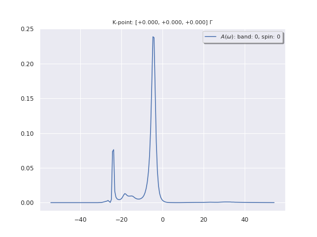

# Second tutorial on GW

## Treatment of metals.

This tutorial aims at showing how to obtain self-energy corrections to the DFT
Kohn-Sham eigenvalues within the GW approximation, in the metallic case,
without the use of a plasmon-pole model.
The band width and Fermi energy of Aluminum will be computed.

The user may read the papers

  * F. Bruneval, N. Vast, and L. Reining, Phys. Rev. B **74** , 045102 (2006) [[cite:Bruneval2006]],
for some information and results about the GW treatment of Aluminum. He will
also find there an analysis of the effect of self-consistency on
quasiparticles in solids (not present in this tutorial, however available in
Abinit). The description of the contour deformation technique that bypasses
the use of a plasmon-pole model to calculate the frequency convolution of G
and W can be found in

  * S. Lebegue, S. Arnaud, M. Alouani, P. Bloechl, Phys. Rev. B **67**, 155208 (2003) [[cite:Lebegue2003]],

with the relevant formulas.

A brief description of the equations implemented in the code can be found in the [[theory:mbt|GW notes]]
Also, it is suggested to acknowledge the efforts of developers of the GW part of ABINIT,
by citing the [[cite:Gonze2005|2005 ABINIT publication]].

The user should be familiarized with the four basic tutorials of ABINIT, see the
[tutorial index](/tutorial/) as well as the [first GW tutorial](/tutorial/gw1).

Visualisation tools are NOT covered in this tutorial.
Powerful visualisation procedures have been developed in the Abipy context,
relying on matplotlib. See the README file of [Abipy](https://github.com/abinit/abipy)
and the [Abipy tutorials](https://github.com/abinit/abitutorials).

This tutorial should take about one hour to be completed (also including the
reading of [[cite:Bruneval2006]] and [[cite:Lebegue2003]].

[TUTORIAL_README]

## The preliminary Kohn-Sham band structure calculation

*Before beginning, you might consider to work in a different subdirectory as
for the other tutorials. Why not Work_gw2?*

In [basic tutorial 4](/tutorial/base4), we have computed different properties of
Aluminum within DFT(LDA). Unlike for silicon, in this approximation, there is
no outstanding problem in the computed band structure. Nevertheless, as you
will see, the agreement of the band structure with experiment can be improved
significantly if one uses the GW approximation.

In the directory *Work_gw2*, copy the file *tgw2_1.abi* located in *\$ABI_TESTS/tutorial/Input*.

```sh
    mkdir Work_gw2
    cd Work_gw2
    cp $ABI_TESTS/tutorial/Input/tgw2_1.abi .
```

Then issue:

    abinit tgw2_1.abi > tgw2_1.log 2> err &



This run generates the WFK file for the subsequent GW computation and also
provides the band width of Aluminum. Note that the simple Fermi-Dirac smearing
functional is used ([[occopt]] = 3), with a large smearing ([[tsmear]] = 0.05 Ha).
The **k**-point grid is quite rough, an unshifted 4x4x4 Monkhorst-Pack grid
(64 **k**-points in the full Brillouin Zone, folding to 8 **k**-points in the Irreducible
wedge, [[ngkpt]] = 4 4 4). Converged results would need a 4x4x4 grid with 4
shifts (256 **k**-points in the full Brillouin zone). This grid contains the $\Gamma$
point, at which the valence band structure reaches its minimum.

The output file presents the Fermi energy

```
 Fermi (or HOMO) energy (eV) =   6.76526   Average Vxc (eV)=  -9.88844
```

as well as the lowest energy, at the $\Gamma$ point

```
 Eigenvalues (   eV  ) for nkpt=   8  k points:
 kpt#   1, nband=  6, wtk=  0.01563, kpt=  0.0000  0.0000  0.0000 (reduced coord)
  -4.22031   19.66151   19.66151   19.66151   21.09462   21.09462
```


So, the occupied band width is 10.98 eV within PBE.
This is to be compared to the experimental value of 10.6 eV (see references in [[cite:Bruneval2006]]).

## Calculation of the screening file

Let's run the calculation of the screening file immediately.
So, copy the file *tgw2_2.abi*. Also, copy the WFK file (*tgw2_1o_WFK*) to *tgw2_2i_WFK*. Then
run the calculation (it should take about 3 seconds).

```sh
    cp $ABI_TESTS/tutorial/Input/tgw2_2.abi .
    cp tgw2_1o_WFK tgw2_2i_WFK
    abinit tgw2_2.abi >& log &
```




We now have to consider starting a GW calculation. However, unlike in the case
of Silicon in the previous GW tutorial, where we were focussing on quantities
close to the Fermi energy (spanning a range of a few eV), here we need to
consider a much wider range of energy: the bottom of the valence band lies
around -11 eV below the Fermi level. Unfortunately, this energy is of the same
order of magnitude as the plasmon excitations. With a rough evaluation, the
classical plasma frequency for a homogeneous electron gas with a density equal
to the average valence density of Aluminum is 15.77 eV. Hence, using
plasmon-pole models may be not really appropriate.

In what follows, we will compute the GW band structure without a plasmon-pole
model, by performing the numerical frequency convolution. In
practice, it is convenient to extend all the functions of frequency to the
full complex plane. And then, making use of the residue theorem, the
integration path can be deformed: one transforms an integral along the real
axis into an integral along the imaginary axis plus residues enclosed in the
new contour of integration. The method is extensively described in [[cite:Lebegue2003]].

Examine the input file *tgw2_2.abi*.



The ten first lines contain the important information.
There, you find some input variables that you are already
familiarized with, like [[optdriver]], [[ecuteps]], but also new
input variables: [[gwcalctyp]], [[nfreqim]], [[nfreqre]], and [[freqremax]].
The purpose of this run is simply to generate the screening matrices. Unlike
for the plasmon-pole models, one needs to compute these at many different
frequencies. This is the purpose of the new input variables. The main variable
[[gwcalctyp]] is set to 2 in order to specify a _non_ plasmon-pole model
calculation. Note that the number of frequencies along the imaginary axis
governed by [[nfreqim]] can be chosen quite small, since all functions are
smooth in this direction. In contrast, the number of frequencies needed along
the real axis set with the variable [[nfreqre]] is usually larger.

## Finding the Fermi energy and the bottom of the valence band

Let's run the calculation of the band width immediately and
then we'll study of the input file. So, get the file *tgw2_3.abi*.

```sh
    cp $ABI_TESTS/tutorial/Input/tgw2_3.abi .
    cp tgw2_1o_WFK tgw2_3i_WFK
    cp tgw2_2o_SCR tgw2_3i_SCR
    abinit tgw2_3.abi >& log &
```

The computation of the GW quasiparticle energy at the $\Gamma$ point of Aluminum
does not differ from the one of quasiparticle in Silicon. However, the
determination of the Fermi energy raises a completely new problem: one should
sample the whole Brillouin Zone to get new energies (quasiparticle energies) and
then determine the Fermi energy. This is actually the first step towards a self-consistency!

Examine the input file *tgw2_3.abi*:



The first thirty lines contain the important information.
There, you find some input variables with values that you are
already familiarized with, like [[optdriver]], [[ecutsigx]], [[ecutwfn]].
Then, comes the input variable [[gwcalctyp]] = 12. The value _x2_ corresponds to
a contour integration. The value _1x_ corresponds to a self-consistent
calculation with update of the energies only. Then, one finds the list of k
points and bands for which a quasiparticle correction will be computed:
[[nkptgw]], [[kptgw]], and [[bdgw]]. The number and list of **k**-points is simply
the same as [[nkpt]] and [[kpt]]. One might have specified less **k**-points,
though (only those needing an update). The list of band ranges [[bdgw]] has
been generated on the basis of the DFT(LDA) eigenenergies. We considered only the
bands in the vicinity of the Fermi level: bands much below or much above are
likely to remain much below or much above the Fermi region. In the present run, we
are just interested in the states that may cross the Fermi level, when going
from DFT to GW. Of course, it would have been easier to select an homogeneous range
for the whole Brillouin zone, e.g. from 1 to 5, but this would have been more time-consuming.

In the output file, one finds the quasiparticle energy at $\Gamma$, for the lowest band:

```yaml
--- !SelfEnergy_ee
iteration_state: {dtset: 1, }
kpoint     : [   0.000,    0.000,    0.000, ]
spin       : 1
KS_gap     :    0.000
QP_gap     :    0.000
Delta_QP_KS:    0.000
data: !SigmaeeData |
     Band     E_DFT   <VxcDFT>   E(N-1)  <Hhartree>   SigX  SigC[E(N-1)]    Z     dSigC/dE  Sig[E(N)]  DeltaE  E(N)_pert E(N)_diago
        1    -4.220    -9.458    -4.220     5.238   -15.616     5.931     0.903    -0.107    -9.663    -0.206    -4.426    -4.448
        2    19.662    -9.585    19.662    29.246    -2.718    -7.097     0.802    -0.246    -9.770    -0.185    19.477    19.430
        3    19.662    -9.585    19.662    29.246    -2.718    -7.098     0.802    -0.247    -9.770    -0.185    19.476    19.430
        4    19.662    -9.585    19.662    29.246    -2.718    -7.098     0.802    -0.247    -9.770    -0.185    19.476    19.431
        5    21.095    -9.387    21.095    30.482    -2.461    -7.390     0.713    -0.402    -9.718    -0.331    20.764    20.631
        6    21.095    -9.387    21.095    30.482    -2.461    -7.390     0.713    -0.402    -9.718    -0.331    20.764    20.631
        7    21.095    -9.387    21.095    30.482    -2.461    -7.390     0.713    -0.403    -9.718    -0.331    20.764    20.631
...
```

(the last column is the relevant quantity). The updated Fermi energy is also mentioned:

```text
 New Fermi energy :        2.425933E-01 Ha ,    6.601299E+00 eV
```


The last information is not printed in case of [[gwcalctyp]] lower than 10.

Combining the quasiparticle energy at $\Gamma$ and the Fermi energy, gives the
band width, 11.05 eV.
Remember the experimental value is around 10.6 eV.

## Computing a GW spectral function, and the plasmon satellite of Aluminum

The access to the non-plasmon-pole-model self-energy (real and imaginary part)
has additional benefit, e.g. an accurate spectral function can be computed,
see [[cite:Lebegue2003]]. You may be interested to see the plasmon satellite of
Aluminum, which can be accounted for within the GW approximation.

Remember that the spectral function is proportional to (with some multiplicative matrix elements) the spectrum which
is measured in photoemission spectroscopy (PES). In PES, a photon impinges the
sample and extracts an electron from the material. The difference of energy
between the incoming photon and the obtained electron gives the binding energy
of the electron in the solid, or in other words the quasiparticle energy or
the band structure. In simple metals, an additional process can take place
easily: the impinging photon can *extract an electron together with a global
charge oscillation in the sample*. The extracted electron will have a kinetic
energy lower than in the direct process, because a part of the energy has gone
to the plasmon. The electron will appear to have a larger binding energy...
You will see that the spectral function of Aluminum consists of a main peak
which corresponds to the quasiparticle excitation and some additional peaks
which correspond to quasiparticle and plasmon excitations together.

Let's run this calculation immediately:

```sh
    cp $ABI_TESTS/tutorial/Input/tgw2_4.abi .
    cp tgw2_1o_WFK tgw2_4i_WFK
    cp tgw2_2o_SCR tgw2_4i_SCR
    abinit tgw2_4.abi >& log &
```



Compared to the previous file (*tgw2_3.abi*), the input file contains two
additional keywords: [[nfreqsp]], and [[freqspmax]]. Also, the computation of
the GW self-energy is done only at the $\Gamma$ point.

The spectral function is written in the file *tgw2_4o_SIG*. It is a simple text
file. It contains, as a function of the frequency (eV), the real part of the
self-energy, the imaginary part of the self-energy, and the spectral function.
You can visualize it using your preferred software.
For instance, start |gnuplot| and issue

```gnuplot
p 'tgw2_4o_SIG' u 1:4 w l
```

You should be able to distinguish the main quasiparticle peak located at the
GW energy (-3.7 eV) and some additional features in the vicinity of the GW
eigenvalue minus a plasmon energy (-3.7 eV - 15.8 eV = -19.5 eV).

!!! tip

    If |AbiPy| is installed on your machine, you can use the |abiopen| script
    with the `--expose` option to visualize the results:

        abiopen.py tgw2_4o_SIGRES.nc -e -sns

    

Another file, *tgw2_4o_GW*, is worth to mention: it contains information to be
used for the subsequent calculation of excitonic effects within the Bethe-Salpeter Equation with ABINIT or with other codes from
the [ETSF software page](http://www.etsf.eu/resources/software/codes).
