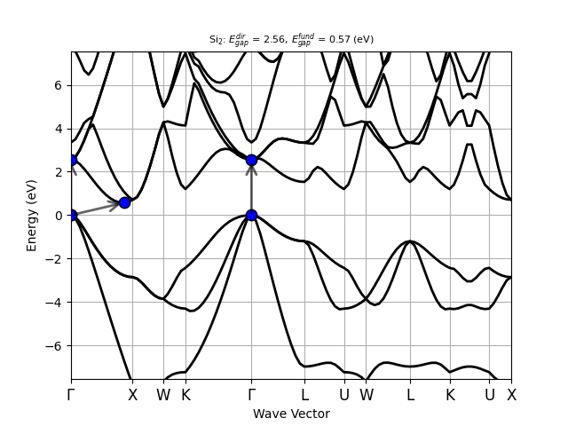
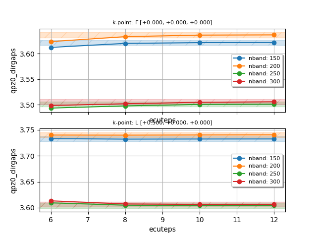
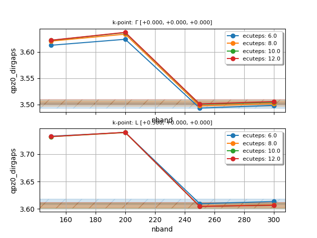
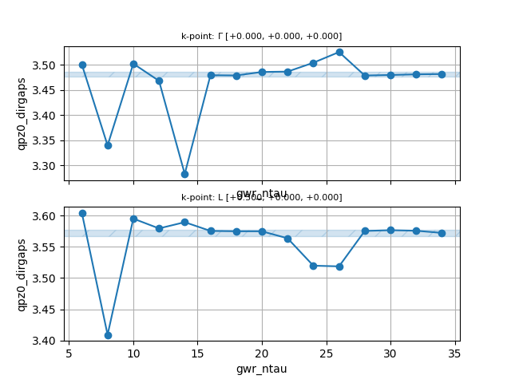

# First tutorial on GWR (GW in real-space and imaginary time)

## The quasi-particle band structure of Silicon in the one-shot GW approximation.

This tutorial aims at showing how to calculate self-energy corrections to the
DFT Kohn-Sham (KS) eigenvalues in the one-shot GW approximation using the GWR code

The user should be already familiar with the four basic tutorials of ABINIT,
see the [tutorial home page](/tutorial),
and is strongly encouraged to read the [introduction to the GWR code](/tutorial/gwr_intro)
before running these examples.

This tutorial should take about 1.5 hours.

[TUTORIAL_README]

### Ground-state and KS band structure

*Before beginning, you might consider creating a different subdirectory to work in.
Why not create Work_gwr?*

The file *tgwr_1.abi* is the input file for the first step:
a SCF run followed by a KS NSCF band structure calculation along a high-symmetry $\kk$-path.
Copy it to the working directory with:

```
mkdir Work_gwr
cd Work_gwr
cp ../tgwr_1.abi .
```

You may want to immediately start the job in background with:

```
mpirun -n 1 tgwr_1.abi > tgwr_1.log 2> err &
```

so that we have some time to discuss the input while ABINIT is running.



!!! tip

    All the input files of this tutorial can be executed in parallel by just
    increasing the value of `NUM` in `mpirun -n NUM`.
    Clearly the size of the problem is small so do not expect
    great parallel performance if you start to use dozens of MPI processes.

The first dataset produces the KS density file that is then used to compute the band structure in the second dataset.
Since all the input files of this tutorial use the same crystalline structure, pseudos
and cutoff energy [[ecut]] for the wavefunctions, we declare these variables in an external file
that will be **included** in all the other input files using the syntax:

```
# Include geometry and pseudos
include "gwr_include.abi"
```

If you open the include file:



you will notice that we are using norm-conserving (NC) pseudos taken from
the standard scalar-relativistic table of the [PseudoDojo](https://www.pseudo-dojo.org/),
and the recommended value for [[ecut]] reported in the PseudoDojo table (16 Ha, normal hint).

!!! important

    For GW calculations, we **strongly** recommend using NC pseudos from the **stringent table**
    as these pseudos have closed-shells treated as valence states.
    This is important for a correct description of the matrix elements of the exchange part of the self-energy
    that are rather sensitive to the overlap between the wavefunctions [[cite:Setten2018]].
    In the special case of silicon, there is no difference between the standard version
    and the stringent version of the pseudo, but if we consider e.g. Ga, you will notice
    that the stringent version includes all the 3spd states in valence besides the outermost 4sp electrons
    whereas the standard pseudo for Ga designed for GS calculations includes only the 3d states.

<!--
Since we are using scalar-relativistic (SR) pseudos, it is not possible to treat spin-orbit coupling (SOC).
To include SOC with NC, one should use fully-relativistic (FR) pseudos, set [[nspinor]] 2 al all the input files
and then set the appropriate value of [[nspden]] to 4 or 1 depending on whether the system is magnetic or not.
-->

At this point, the calculation should have completed, and we can have a look
at the KS band structure to find the position of the band edges.

!!! tip

    If |AbiPy| is installed on your machine, you can use the |abiopen| script
    with the `--expose` option to visualize the band structure from the GSR.nc file:

        abiopen.py tgwr_1o_DS2_GSR.nc --expose

    

    To print the results to terminal, use:

        abiopen.py tgwr_1o_DS2_GSR.nc -p

    ```
    ============================== Electronic Bands ==============================
    Number of electrons: 8.0, Fermi level: 4.356 (eV)
    nsppol: 1, nkpt: 101, mband: 12, nspinor: 1, nspden: 1
    smearing scheme: none (occopt 1), tsmear_eV: 0.272, tsmear Kelvin: 3157.7
    Direct gap:
        Energy: 2.556 (eV)
        Initial state: spin: 0, kpt: $\Gamma$ [+0.000, +0.000, +0.000], band: 3, eig: 4.356, occ: 2.000
        Final state:   spin: 0, kpt: $\Gamma$ [+0.000, +0.000, +0.000], band: 4, eig: 6.912, occ: 0.000
    Fundamental gap:
        Energy: 0.570 (eV)
        Initial state: spin: 0, kpt: $\Gamma$ [+0.000, +0.000, +0.000], band: 3, eig: 4.356, occ: 2.000
        Final state:   spin: 0, kpt: [+0.429, +0.000, +0.429], band: 4, eig: 4.926, occ: 0.000
    Bandwidth: 11.970 (eV)
    Valence maximum located at kpt index 0:
        spin: 0, kpt: $\Gamma$ [+0.000, +0.000, +0.000], band: 3, eig: 4.356, occ: 2.000
    Conduction minimum located at kpt index 12:
        spin: 0, kpt: [+0.429, +0.000, +0.429], band: 4, eig: 4.926, occ: 0.000
    ```

Silicon is an indirect band gap semiconductor:
the CBM is located at the $\Gamma$ point while the VMB is located at ~[+0.429, +0.000, +0.429].
At the PBE level, the direct gap is 2.556 eV while the fundamental band gap is ~0.570 eV.
Both values strongly underestimate the experimental results that are ~3.4 eV and ~1.12 eV, respectively.

!!! important

    Similarly to the conventional GW code, also the GWR code can compute QP corrections only
    for the $\kk$-points belonging to the $\kk$-mesh associated to the WFK file.
    Before running GW calculations is always a good idea to analyze carefully the KS band
    structure in order to understand the location of the band edges and then select
    the most appropriate $\kk$-mesh.


One final comment related to the MPI parallelism in the ground-state part.
For larger system, it is advisable to use [[paral_kgb]] = 1 for its better scalability
in conjunction with [[autoparal]] 1 to allow ABINIT to determine an optimal distribution,
in particular the band parallelism that is not available when the CG eigensolver is used.
<!--
Note also that we suggest disabling the FFT parallelization by using [[npfft]] 1.
to 1 to enable $\kk$-point, band, and FFT parallelization,
and [[autoparal]] to 1 to allow ABINIT to determine an optimal distribution, with [[npfft]] fixed at 1.
-->

### Generation of the WFK file with empty states

In the second input file, we use the density file computed previously (`tgwr_1o_DS1_DEN`)
to generate WFK files with three different $\Gamma$-centered $\kk$-meshes:

```
ndtset 3

ngkpt1   2 2 2
ngkpt2   4 4 4
ngkpt3   6 6 6
```

This allows us to perform convergence studies with respect to the BZ sampling.
Let us recall that shifted $\kk$-meshes **are not supported** by GWR.
In another words, [[nshiftk]] must be set to 1 with [[shiftk]] = 0 0 0 when producing the WFK file.
The density file, on the contrary, can be generated with shifted $\kk$-meshes, as usual.

Let's immediately start the job in background with:

```
mpirun -n 1 tgwr_2.abi > tgwr_2.log 2> err &
```



Here we are using [[gwr_task]] = "HDIAGO" to perform a **direct diagonalization**
of the KS Hamiltonian $H^\KS[n]$ constructed from the input DEN file.
This procedure differs from the one used in the other GW tutorials in which the WFK file
is generated by performing an **iterative diagonalization** in which only the application of the Hamiltonian is required.
The reason is that the direct diagonalization outperforms iterative methods
when many empty states are required, especially if one can take advantage of ScalaPack
to distribute the KS Hamiltonian matrix.

!!! important

    We strongly recommend using the ELPA library for diagonalization,
    as it is much more efficient and requires significantly less memory than the ScaLAPACK drivers.
    See the [GWR_intro](/tutorial/gwr_intro) for more details on how to link the ELPA library.

Here, we ask for 400 bands. Let's recall that in the [previous GW tutorial](/tutorial/gw1)
[[nband]] = 100 was considered converged within 30 meV,
but with GWR we can afford more bands since [[nband]] enters into play only during the initial construction
of the Green's function
Clearly, when studying new systems, the value of [[nband]] needed to converge is not known beforehand.
Therefore, it is important to plan ahead and choose a reasonably large number of bands
to avoid regenerating the WFK file multiple times just to increase [[nband]].

Note also that [[paral_kgb]] = 1 is only available in the ground-state (GS) part.
The GWR code, indeed, employs its own distribution scheme, which depends on the value of [[gwr_task]].
When "HDIAGO" is used, the distribution is handled automatically at runtime, and the user has no control over it.
Please refer to the note below for guidance on choosing an appropriate number of MPI processes
to ensure an efficient workload distribution.

!!! important

    The direct diagonalization is MPI-parallelized across three different levels:
    collinear spin $\sigma$ (not used here), $\kk$-points in the IBZ and
    Scalapack distribution of the $H^\sigma_\kk(\bg,\bg')$ matrix.
    ABINIT will try to find an "optimal" distribution of the workload at runtime, yet there are a couple
    of things worth keeping in mind when choosing the number of MPI processes for this step.
    Ideally the total number of cores should be a multiple of [[nkpt]] * [[nsppol]] to avoid load imbalance.

    In order to compute **all** the eigenvectors of the KS Hamiltonian, one can use gwr_task "HDIAGO_FULL".
    In this case the value of [[nband]] is automatically set to the total number of plawewaves
    for that particular $\kk$-point.
    No stopping criterion such as [[tolwfr]] or number of iterations [[nstep]] are required when Scalapack is used.

    Again, multi-datasets are **strongly discouraged** if you care about performance.

<!--
To use the iterative eigenvalue solver:

# optdriver  6                         # Activate GWR code
# gwr_task "HDIAGO"                    # Direct diagonalization
 nband     1000                        # Number of (occ + empty) bands
 iscf -2
 nbdbuf -10
 tolwfr 1e-20
 paral_kgb 1
 autoparal 1
 npfft 1
 nstep 150
!-->

### Our first GWR calculation

For our first GWR run, we use a minimalistic input file that
performs a GWR calculation using the DEN and the WFK file produced previously.
First of all, you may want to start immediately the computation with:

```
mpirun -n 1 tgwr_3.abi > tgwr_3.log 2> err &
```

and the following input file:



This input contains some variables whose meaning is the same as in the conventional GW code,
and other variables whose name starts with `gwr_` that are specific to the GWR code.

We use [[optdriver]] 6 to enter the GWR code while [[gwr_task]] activates a one-shot GW calculation.
To reduce the wall-time, we use a minimax mesh with [[gwr_ntau]] = 6 points, the minimum number of points that can be used.
Most likely, six points are not sufficient, but the convergence study for [[gwr_ntau]] is postponed to the next sections.
[[getden_filepath]] specifies the density file used to compute $v_{xc}[n](\rr)$,
while [[getwfk_filepath]] specifies the WFK file with empty states used to build the Green's function.

!!! important

    Keep in mind that the $\kk$-mesh specified in the input via [[ngkpt]], [[nshiftk]] and [[shiftk]] must
    agree with the one found in the WFK file else the code will abort.

    Also, the FFT mesh for the density [[ngfft]] specified in the input must agree with the one found in the `DEN`.
    This is usually true, provided that the same [[ecut]] value is used everywhere.
    A possible exception occurs when using [[paral_kgb]] 1 with MPI-FFT ([[npfft]] > 1) to generate the DEN.
    In this case, the last two dimensions of the FFT mesh must be multiples of [[npfft]].
    Since MPI-FFT is not available in GWR, ABINIT will stop with an error, complaining that the [[ngfft]] mesh
    computed from the input does not match the one read from the file.
    To solve the problem, simply set [[ngfft]] explicitly in the GWR input files using the value used in the GS part.

To accelerate the computation and reduce the memory requirements, we truncate the PW basis
set using [[ecutwfn]] = 10 < [[ecut]] = 16, and [[gwr_boxcutmin]] is set to 1.0.
These parameters should be subject to carefully convergence studies as systems with localized electrons
such as 3d or 4f electrons may require larger values (more PWs and denser FFT meshes).
Please take some time to read the variable description of [[ecutwfn]] and [[gwr_boxcutmin]] before proceeding.

Now, let us turn our attention to the variables that are also used in the conventional GW code.
The cutoff of the polarizability and $W$ is defined by [[ecuteps]] as in the conventional GW code.
The cutoff for the exchange part of the self-energy is given by [[ecutsigx]].
For the initial convergence studies, it is advised to set [[ecutsigx]] to a value as high
as [[ecut]] since, anyway, this parameter is not much influential on the total computational time,
as only occupied states are involved.
Note that the exact treatment of the exchange part requires, in principle, [[ecutsigx]] = 4 * [[ecut]].

!!! tip

    If [[ecutsigx]] is not specified in the input, GWR will set it to [[ecut]].

The $\kk$-points and the band range for the QP corrections are set
expliclty via [[nkptgw]], [[kptgw]] and [[bdgw]].
<!--
Alternatively, one can use [[gw_qprange]].
For the spectral function $A_\nk(\ww)$, we have the following variables [[nfreqsp]], [[freqspmax]]
TODO: Mention [[inclvkb]] == 2, [[symsigma]]
-->

We can now have a look at the main output file:



First of all, we have a Yaml document that summarizes the most important GWR parameters:

```yaml
--- !GWR_params
iteration_state: {dtset: 1, }
gwr_task: G0W0
nband: 100
ntau: 6
ngkpt: [2, 2, 2, ]
ngqpt: [2, 2, 2, ]
chi_algo: supercell
sigma_algo: 'BZ-convolutions'
nkibz: 3
nqibz: 3
inclvkb: 2
q0: [  1.00000000E-05,   2.00000000E-05,   3.00000000E-05, ]
gw_icutcoul: 6
green_mpw: 412
tchi_mpw: 190
g_ngfft: [12, 12, 12, 12, 12, 12, ]
gwr_boxcutmin:   1.00000000E+00
P gwr_np_kgts: [1, 1, 1, 1, ]
P np_kibz: [1, 1, 1, ]
P np_qibz: [1, 1, 1, ]
min_transition_energy_eV:   7.07322721E-01
max_transition_energy_eV:   1.04475612E+02
eratio:   1.47705721E+02
ft_max_err_t2w_cos:   2.89209381E-02
ft_max_err_w2t_cos:   2.86400623E-03
ft_max_err_t2w_sin:   7.19446763E-01
cosft_duality_error:   6.45172897E-04
Minimax imaginary tau/omega mesh in a.u.: !Tabular | # tau, weight(tau), omega, weight(omega)
    1 1.38455E-01   3.72941E-01   9.99589E-03   2.11026E-02
    2 9.09503E-01   1.31503E+00   3.74200E-02   3.73070E-02
    3 3.28166E+00   3.82961E+00   9.62519E-02   8.99217E-02
    4 9.80796E+00   1.01381E+01   2.52835E-01   2.55147E-01
    5 2.63488E+01   2.50323E+01   7.39607E-01   8.50598E-01
    6 6.70390E+01   6.29648E+01   2.66078E+00   3.94579E+00
...
```

Some of the entries in this dictionary have a direct correspondence with ABINIT variables and
won't be discussed here. The meaning of the other variables is reported below:

- `nkibz`: Number of $\kk$-points in the IBZ
- `qkibz`: Number of $\qq$-points in the IBZ
- `green_mpw`: maximum number of PWs for the Green's function.
- `tchi_mpw`: maximum number of PWs for the polarizability.
- `g_ngfft`: FFT mesh in the unit cell used for the different MBPT quantities.
- `min_transition_energy_eV`, `max_transition_energy_eV`: min/max transition energies
leading to the energy ratio `eratio` used to select the minimax mesh.

`green_mpw` is computed from [[ecut]], while `tchi_mpw` is defined by [[ecuteps]]
This two numbers are directly related to the memory footprint as they define
of the size of the matrices that must be stored in memory.

<!--
TODO: Describe other entries
-->

Finally, we have the most important section with the QP results in eV units:

```
================================================================================
 QP results (energies in eV)
 Notations:
     E0: Kohn-Sham energy
     <VxcDFT>: Matrix elements of Vxc[n_val] without non-linear core correction (if any)
     SigX: Matrix elements of Sigma_x
     SigC(E0): Matrix elements of Sigma_c at E0
     Z: Renormalization factor
     E-E0: Difference between the QP and the KS energy.
     E-Eprev: Difference between QP energy at iteration i and i-1
     E: Quasi-particle energy
     Occ(E): Occupancy of QP state


--- !GWR_SelfEnergy_ee
iteration_state: {dtset: 1, }
kpoint     : [   0.000,    0.000,    0.000, ]
spin       : 1
gwr_scf_iteration: 1
gwr_task   : G0W0
QP_VBM_band: 4
QP_CBM_band: 5
KS_gap     :    2.556
QP_gap     :    3.672
Delta_QP_KS:    1.117
data: !Tabular |
     Band       E0 <VxcDFT>     SigX SigC(E0)        Z     E-E0  E-Eprev        E   Occ(E)
        2   -0.354  -11.319  -13.616    1.625    0.838   -0.562   -0.562   -0.916    2.000
        3   -0.354  -11.319  -13.616    1.625    0.838   -0.562   -0.562   -0.916    2.000
        4   -0.354  -11.319  -13.616    1.625    0.838   -0.562   -0.562   -0.916    2.000
        5    2.202  -10.034   -4.915   -4.445    0.824    0.555    0.555    2.757    0.000
        6    2.202  -10.034   -4.915   -4.445    0.824    0.555    0.555    2.757    0.000
        7    2.202  -10.034   -4.915   -4.445    0.824    0.555    0.555    2.757    0.000
...


--- !GWR_SelfEnergy_ee
iteration_state: {dtset: 1, }
kpoint     : [   0.500,    0.000,    0.000, ]
spin       : 1
gwr_scf_iteration: 1
gwr_task   : G0W0
QP_VBM_band: 4
QP_CBM_band: 5
KS_gap     :    2.733
QP_gap     :    3.804
Delta_QP_KS:    1.071
data: !Tabular |
     Band       E0 <VxcDFT>     SigX SigC(E0)        Z     E-E0  E-Eprev        E   Occ(E)
        3   -1.556  -11.058  -13.442    1.690    0.818   -0.566   -0.566   -2.122    2.000
        4   -1.556  -11.058  -13.442    1.690    0.818   -0.566   -0.566   -2.122    2.000
        5    1.177  -10.088   -5.037   -4.443    0.834    0.505    0.505    1.682    0.000
...
```

The meaning of the different columns should be self-explanatory.

As usual, we can use `abiopen.py` with the `-p` (`--print`) option to print to screen
a summary of the most important results. Use, for instance:

```
abiopen.py tgwr_3o_GWR.nc -p
```

The last section gives the QP direct gaps:

```
=============================== GWR parameters ===============================
gwr_task: G0W0
Number of k-points in Sigma_{nk}: 2
Number of bands included in e-e self-energy sum: 100
ecut: 16.0
ecutwfn: 10.0
ecutsigx: 16.0
ecuteps: 6.0
gwr_boxcutmin: 1.0

============================ QP direct gaps in eV ============================
            kpoint     kname  ks_dirgaps  qpz0_dirgaps  spin
0  [0.0, 0.0, 0.0]  $\Gamma$    2.555626      3.672337     0
1  [0.5, 0.0, 0.0]         L    2.732704      3.803596     0
```

The calculation has produced three different text files:

`tgwr_3o_SIGC_IT`:
Diagonal elements of $\Sigma_c(i \tau)$ in atomic units

`tgwr_3o_SIGXC_IW`:
Diagonal elements of $\Sigma_\xc(i \omega)$ in eV units

`tgwr_3o_SIGXC_RW`:
Diagonal elements of $\Sigma_\xc(\omega)$ in eV units and spectral function $A_\nk(\omega)$

Finally, we have a netcdf file named `tgwr_3o_GWR.nc` storing the same data in binary format.
This file can be easily post-processed with AbiPy using:

```
abiopen.py tgwr_3o_GWR.nc -e
```

If you need more control, you can use the following
[AbiPy example](https://abinit.github.io/abipy/gallery/plot_gwr.html).
and customize according to your needs.
Please take some time to read the script and understand how this post-processing tool
works before proceeding to the next section.

### Extracting useful info from the GWR log file

This section discusses some shell commands that are useful to understand
the resources required by your GWR calculation.

To extract the memory allocated for the most memory demanding arrays, use:

```
grep "<<< MEM" log

- Local memory for u_gb wavefunctions: 1.9  [Mb] <<< MEM
- Local memory for G(g,g',kibz,itau): 185.6  [Mb] <<< MEM
- Local memory for Chi(g,g',qibz,itau): 17.8  [Mb] <<< MEM
- Local memory for Wc(g,g,qibz,itau): 17.8  [Mb] <<< MEM
```

To have a measure of how much RAM the process is actually using, use:

```
grep vmrss_mb log

vmrss_mb:   1.93379297E+03
```

To extract the wall-time and cpu-time for the most important sections, use:

```
grep "<<< TIME" log

gwr_read_ugb_from_wfk: , wall:  0.00 [s] , cpu:  0.00 [s] <<< TIME
gwr_build_chi0_head_and_wings: , wall:  0.31 [s] , cpu:  0.31 [s] <<< TIME
gwr_build_sigxme: , wall:  0.02 [s] , cpu:  0.02 [s] <<< TIME
gwr_build_green: , wall:  0.31 [s] , cpu:  0.31 [s] <<< TIME
gwr_build_tchi: , wall: 10.89 [s] , cpu: 10.87 [s] <<< TIME
gwr_build_wc: , wall:  0.11 [s] , cpu:  0.11 [s] <<< TIME
gwr_build_sigmac: , wall:  5.92 [s] , cpu:  5.90 [s] <<< TIME
```

To obtain the wall-time and cpu-time required by the different datasets, use:

```
grep "dataset:" log | grep "<<< TIME"
dataset: 1 , wall: 17.90 [s] , cpu: 17.83 [s] <<< TIME
```

Finally, use [[timopt]] 1 to have a detailed analysis of the time spent
in the different parts of the code at the end of the calculation.

### Convergence study HOWTO

As discussed in [[cite:Setten2017]], the convergence studies for
the $\kk$-mesh, [[nband]], and the cutoff energies can be decoupled.
This means that one can start with a relatively coarse $\kk$-mesh to determine
the converged values of [[ecutsigx]], [[ecutwfn]], [[nband]], [[ecuteps]], and [[gwr_boxcutmin]],
then fix these values, and refine the BZ sampling only at the end.
The recommended procedure for converging GWR gaps is therefore as follows:

1) Initial step:

- Select the $\kk$-points where QP gaps are wanted.
  Usually the VBM and the CBM so that one can use [[gwr_sigma_algo]] 2.
- Fix the [[ngkpt]] $\kk$-mesh in the WFK file to a resonable value and produce "enough" [[nband]] states
  with the direct diagonalization.
- Set an initial value for [[gwr_ntau]] in the GWR run.

<!--
  Be aware that [[gwr_ntau]] = 6 may be too small, potentially leading to unphysical results
  such as renormalization factors $Z$ below 0.6.
  If this occurs, increase [[gwr_ntau]] in order to fix the problem.
, and [[ecutsigx]].
-->

2) Convergence the QP gaps wrt [[ecutwfn]]

3) Convergence wrt [[nband]], [[ecuteps]], and [[ecutsigx]]

If the number of [[nband]] states in the WFK file is not large enough,
go back to point 1) and generate a new WFK with more bands else proceeed with the next step.

4) Convergence wrt [[gwr_ntau]]:

Once the results are converged with respect to [[ecutwfn]], [[nband]] and [[ecuteps]],
you may start to increase [[gwr_ntau]]while adjusting the number of MPI processes accordingly
(you are not using multidatasets, right?)

5) Convergence wrt [[ngkpt]]:

Finally, refine the BZ sampling to ensure full convergence.
Make sure that all these $\kk$-meshes contain the points you are trying to converge.
Clearly, one has perform a direct diagonalization from scratch for each $\kk$-mesh.

5) Convergence wrt [[gwr_boxcutmin]]:

- Increase it gradually to control memory usage and CPU time, which increase rapidly with this parameter.

Once a good setup have been found, one can use the same parameters to compute the QP corrections in the IBZ
using [[gwr_sigma_algo]] 2 and [[gw_qprange]] = `-NUM` to have a `GWR.nc` file that can be used to
perform an interpolation of the GW band structure as discussed in the last part of this tutorial.

Note that, due to cancellations of errors, QP gaps that are differences between QP energies
are usually much easier to convergence than QP values.
Fortunately, absolute values are important only in rather specialized studies such as work function
or band alignment in heterostructures.
In this tutorial, we only focus on gaps, and we aim to achieve an overall convergence of the QP gaps 0.01 eV (10 meV).
As a consequence we will try to reach a convergence of 2 meV.

In the next sections, we explain how to perform these convergence studies and how to use AbiPy to analyze the results.
Note that we will not provide ready-to-use input files.
Your task is therefore to modify `tgwr_3.abi`, run the calculations (possibly in parallel), and then analyze the results.

### Convergence wrt ecutwfn

The first parameter we check for convergence is the cutoff energy [[ecutwfn]] used to build the Green's function.
This value has a big impact on the computational cost and, most importantly, on the memory footprint
as the number of PWs scales as:

\begin{equation}
N_{\text{PW}} \propto \Omega \cdot E_{\text{cutwfn}}^{3/2}
\end{equation}

hence the memory required for $G_\kk(\bg,\bg')$ scales with the cube of [[ecutwfn]] and
quadratically with the unit cell volume $\Omega$.
To monitor the convergence of the QP direct gaps, we define a multidataset by adding
the following section to `tgwr_3.abi`:

```sh
ndtset 5
ecutwfn: 8
ecutwfn+ 2
```

Once the calculation is finished, we can use the `GwrRobot` to load the list of GWR.nc files
and plot the convergence of the direct QP gaps with the following python script:

```python
#!/usr/bin/env python

filepaths = [f"tgwr_3o_DS{i}_GWR.nc" for i in range(1, 6)]

from abipy.electrons.gwr import GwrRobot
robot = GwrRobot.from_files(filepaths)

# Convergence window in eV
abs_conv = 0.001
robot.plot_qpgaps_convergence(x="ecutwfn", abs_conv=abs_conv,
                              savefig="conv_ecuwfn.png")
```

Save the script in a file, let’s say `conv_ecutwfn.py`, in the same
directory where we have launched the calculation, make the file executable with:

```
chmod u+x conv_ecutwfn.py
```

and then run it with:

```
./conv_ecutwfn.py
```

You should obtain the following results:


On the basis of this convergence study, we can safely use [[ecutwfn]] = 10.

Since we will continue using `tgwr_3.abi` to perform other convergence studies,
it is a good idea to move the previously generated GWR.nc files and the python script
to a new directory to avoid overlaps between different calculations.
You can, for example, use the following list of shell commands:

```
mkdir conv_ecutwfn
mv conv_ecutwfn.py conv_ecutwfn
mv tgwr_3o_* log conv_ecutwfn
```

### Convergence wrt nband and ecuteps

To perform a double convergence study in [[nband]] and [[ecuteps]],
define a double loop with [[udtset]], and add this section to `tgwr_3.abi`:

```sh
ndtset 16    # NB: ndtset must be equal to udtset[0] * udtset[1]
udtset 4 4

#inner loop: increase nband. The number of iterations is given by udtset[0]
nband:? 150    nband+? 50

#outer loop: increase ecuteps. The number of iterations is given by udtset[1]
ecuteps?: 6     ecuteps?+  2
```

If we analyze the wall-time required by each dataset, we observe
that, at variance with the conventional GW code,
the values of [[nband]] and [[ecuteps]] have little impact of the computational cost.

```
grep "dataset:" log | grep "<< TIME"
```

<!--
As concerns [[nband]] this is expected, as this parameter enters into play
only during the computation of the Green's function.
For [[ecuteps]] this is due to the FFT algorithm.
Of course, we are not saying that the wall-time does not depend on these two parameters.
Increasing [[ecuteps]] definitely has a greater effect in terms of wall-time.
-->

Once the calculation is completed, plot the convergence of the direct QP gaps with the following script:

```python
#!/usr/bin/env python

udtset = [4, 4]  # Should be equal to the grid used in the ABINIT input file

filepaths = [f"tgwr_3o_DS{i}{j}_GWR.nc"
             for i in range(1, udtset[0]+1) for j in range(1, udtset[1]+1)]

from abipy.electrons.gwr import GwrRobot
robot = GwrRobot.from_files(filepaths)

# Convergence window in eV
abs_conv = 0.005

robot.plot_qpgaps_convergence(x="nband",
                              abs_conv=abs_conv, hue="ecuteps",
                              savefig="conv_nband_ecuteps.png",
                              )

robot.plot_qpgaps_convergence(x="ecuteps",
                              abs_conv=abs_conv, hue="nband",
                              savefig="conv_ecuteps_nband.png",
                              )
```

Again, save the script in a file, let’s say `conv_nband_ecuteps.py`, in the same
directory where we have launched the calculation, make the file executable and run it with:

```
./conv_nband_ecuteps.py
```

You should obtain the following plots:





On the basis of this convergence study, we decide to use [[nband]] = 250 and [[ecuteps]] = 10.

<!--
In the [first GW tutorial](/tutorial/gw1), we have already performed convergence studies,
and [[nband]] = 100 was found to give results converged within 30 mev, which is fair to compare with experimental accuracy.
Also ecuteps = 6.0 can be considered converged within 10 meV.
We will not repeat these convergence studies here, we just use these values for our calculation so that
we can focus on the analysis of the output file and the post-processing of the results.
Since we will continue using `tgwr_3.abi` to perform other convergence studies,
it is a good idea to move the previously generated GWR.nc files and the python script
to a new directory to avoid overlaps between different calculations.
You can, for example, use the following list of shell commands:
!-->

Before proceeding with the next sections, save the results in a different directory by executing:

```
mkdir conv_nband_ecuteps
mv conv_nband_ecuteps.py conv_nband_ecuteps
mv tgwr_3o_* log conv_nband_ecuteps
```

### Convergence wrt gwr_ntau

Now edit `tgwr_3.abi`, replace the values of [[nband]] and [[ecuteps]] found earlier,
and define a new one-dimensional multi-dataset to increase [[gwr_ntau]]:

```
ndtset      15
gwr_ntau:   6         # Number of imaginary-time points
gwr_ntau+   2
```

Once the calculation is finished, save the script reported below in a file,
let’s say `conv_ntau.py`, in the same directory where we have launched the calculation,
make it executable with `chmod` and execute it as usual.

```python
#!/usr/bin/env python
filepaths = [f"tgwr_3o_DS{i}_GWR.nc" for i in range(1, 16)]

from abipy.electrons.gwr import GwrRobot
robot = GwrRobot.from_files(filepaths)

abs_conv = 0.005
robot.plot_qpgaps_convergence(x="gwr_ntau",
                              abs_conv=abs_conv,
                              savefig="conv_ntau.png",
                              )
```

You should get the following figure:



Clearly six minimax points are not enough to convergence.
Also the convergence with [[gwr_ntau]] is not variational, and there are meshes that perform better than others.
This study shows that we should use 16-20 minimax points to reach an accuracy of 0.005 eV (`abs_conv`).
Unfortunately, this would render the calculations more expensive, especially for a tutorial,
therefore we opt to continue with **12 minimax points** for the next calculations.
Again, let's save the results in a different directory by executing:

```
mkdir conv_ntau
mv conv_ntau.py conv_ntau
mv tgwr_3o_* log conv_ntau
```

### Convergence wrt gwr_boxcutmin

Now edit `tgwr_3.abi`, replace the values of [[nband]] and [[ecuteps]] found earlier,
and define a one-dimensional multidataset to increase [[gwr_boxcutmin]]:

```
ndtset 5
gwr_boxcutmin: 1.1
gwr_boxcutmin+ 0.2
```

Once the calculation is finished, save the script reported below in a file,
let’s say `conv_boxcut.py` in the same directory where we launched the calculation,
make it executable and execute it as usual.


```python
#!/usr/bin/env python
filepaths = [f"tgwr_3o_DS{i}_GWR.nc" for i in range(1, 6)]

from abipy.electrons.gwr import GwrRobot
robot = GwrRobot.from_files(filepaths)

abs_conv = 0.005
robot.plot_qpgaps_convergence(x="gwr_boxcutmin",
                              abs_conv=abs_conv,
                              savefig="conv_boxcutmin.png",
                              )
```

You should obtain the following figure:


In the case of silicon, the results are rather insensitive to the density
of the FFT mesh but keep in mind that other systems may behave differently.
We therefore fix [[gwr_boxcutmin]] to 1.1.

Note that different values of [[gwr_boxcutmin]] can lead to the same value of `g_ngfft`
as not all the number of points along the three directions of the FFT box are supported by the FFT library.

```
grep g_ngfft log
g_ngfft: [12, 12, 12, 12, 12, 12, ]
g_ngfft: [15, 15, 15, 15, 15, 15, ]
g_ngfft: [16, 16, 16, 16, 16, 16, ]
g_ngfft: [18, 18, 18, 18, 18, 18, ]
g_ngfft: [20, 20, 20, 20, 20, 20, ]
```

Note how the wall-time quickly increases with [[gwr_boxcutmin]]:

```
grep "dataset:" log | grep "<< TIME"

 dataset: 1 , wall: 10.75 [s] , cpu: 10.74 [s] <<< TIME
 dataset: 2 , wall: 31.20 [s] , cpu: 31.13 [s] <<< TIME
 dataset: 3 , wall: 50.78 [s] , cpu: 50.68 [s] <<< TIME
 dataset: 4 , wall: 01:27 [minutes] , cpu: 01:27 [minutes] <<< TIME
 dataset: 5 , wall: 02:19 [minutes] , cpu: 02:19 [minutes] <<< TIME
```


Finally, let's save the results in a different directory by executing:

```
mkdir conv_boxcutmin
mv conv_boxcutmin.py conv_boxcutmin
mv tgwr_3o_* log conv_boxcutmin
```

### GWR calculations with different BZ meshes.

In this section of the tutorial, we perform GWR calculations with different BZ meshes.
You may want to start immediately the computation by issuing:

```
mpirun -n 1 tgwr_4.abi > tgwr_4.log 2> err &
```

with the following input file:



The output file is reported here for your convenience:



Once the calculation is finished, save the script reported below in a file,
let’s say `conv_kmesh.py` in the same directory where we launched the calculation,
make it executable and execute it as usual.


```python
#!/usr/bin/env python
from abipy.electrons.gwr import GwrRobot

filepaths = [f"tgwr_4o_DS{i}_GWR.nc" for i in range(1, 4)]

robot = GwrRobot.from_files(filepaths)

abs_conv = 0.005
robot.plot_qpgaps_convergence(x="nkpt",
                              abs_conv=abs_conv,
                              savefig="conv_kmesh.png",
                              )
kpoint = (0, 0, 0)
df_dirgaps = robot.get_dirgaps_dataframe(kpoint=kpoint)
print(df_dirgaps)
```

You should get the following figure:


To conclude, our best values for the direct QP gaps are 3.247 eV at the $\Gamma$-point
and 3.413 eV at the $L$-point.

```
mkdir conv_kmesh
mv conv_kmesh.py conv_kmesh
mv tgwr_4o_* log conv_kmesh
```

### How to compute an interpolated band structure with GWR

In this last part of the tutorial, we discuss how to interpolate the QP corrections
along an arbitrary $\kk$-path using the star-function method discussed in
[this section](/tutorial/eph_intro/#star-function-interpolation-of-the-ks-eigenvalues) of the EPH introduction.
This method is less accurate than e.g. the Wannier interpolation, and might be problematic in the presence
of band-crossings, but it has the big advantage of being much easier to use and with minimal user intervention.

First of all, we need to compute the QP corrections for **all** the $\kk$-points in the IBZ.
This is done in the following input:



<!-- gw_qprange is positive in tgwr_5.abi -->
Note the usage of [[gw_qprange]] = `-NUM` and [[gwr_sigma_algo]] 1 to activate
the supercell algorithm for $\Sigma_\nk$, the most efficient algorithm when all the $\kk$-points in $\Sigma_\nk$ are wanted.
To keep the wall-time at a reasonable level, we use a WFK file with 2x2x2 $\kk$-mesh,
but it is clear that a more accurate intepolation would require denser $\kk$-meshes.

Run the job with:

```
mpirun -n 1 tgwr_5.abi > tgwr_5.log 2> err &
```

The output file is reported here for your convenience:



Now use the following AbiPy script to read the GWR results and interpolate the QP corrections.
In this case, we pass the KS band structure stored in `tgwr_1o_DS2_GSR.nc`.
This is the recommended approach as AbiPy will interpolate the QP corrections rather that the QP energies.
The interpolated QP corrections will then be added to the KS energies
thus improving the stability of the interpolation method as QP corrections
are usually smoother than QP energies.

```python
#!/usr/bin/env python
from abipy.electrons.gwr import GwrFile

gwr = GwrFile("tgwr_5o_GWR.nc")
r = gwr.interpolate(ks_ebands_kpath="tgwr_1o_DS2_GSR.nc")

from abipy.electrons.ebands import ElectronBandsPlotter
plotter = ElectronBandsPlotter()
plotter.add_ebands("KS", r.ks_ebands_kpath)
plotter.add_ebands("$G_0W_0$", r.qp_ebands_kpath)

#r.qp_ebands_kpath.plot(with_gaps=True)

plotter.combiplot(savefig="gw_vs_ks_bands.png")
#plotter.gridplot()
```

Save the script in a file, let’s say `plot_qpbands.py`, in the same
directory where we have launched the calculation, make the file executable and run it.
You should get the following figures:


