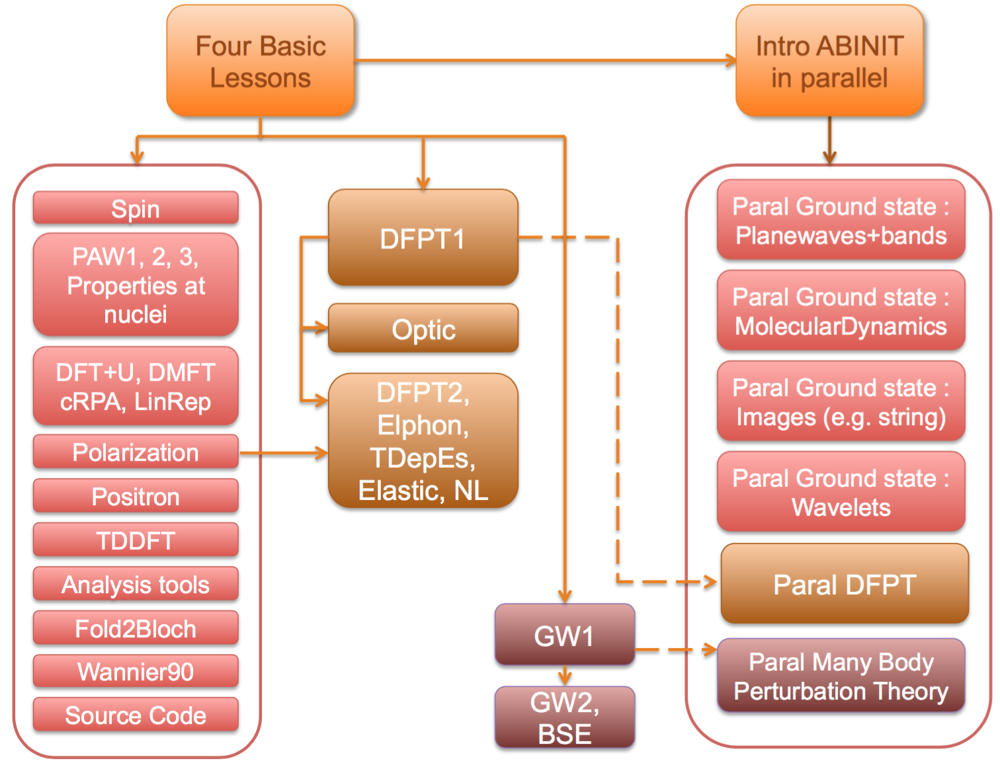

# Welcome  

## Overview of the ABINIT tutorial.  

The lessons of this tutorial are aimed at teaching the use of ABINIT, in the
UNIX/Linux OS and its variants (MacOSX, AIX ...). 
They might be used for other operating systems, but the commands have to be adapted.

At present, more than thirty lessons are available. Each of them is at most
two hours of student work. Lessons 1-4 cover the basics, other lectures are
more specialized. There are dependencies between lessons.
The following schema should help you to understand these dependencies. 

<map id="map1" name="map1"> 
<area shape="rect" coords="120  , 5 ,260 , 80 " href="base1/index.html" /> <!--2,3,4-->
<area shape="rect" coords="30  ,135 ,170 ,160 " href="spin/index.html" />
<area shape="rect" coords="30  ,165 , 99 ,189 " href="paw1/index.html" />
<area shape="rect" coords="100 ,165 ,129 ,189 " href="paw2/index.html" />
<area shape="rect" coords="130 ,165 ,170 ,189 " href="paw3/index.html" />
<area shape="rect" coords="30  ,190 ,170 ,240 " href="nuc/index.html" /> 
<area shape="rect" coords="30  ,245 , 99 ,272 " href="dftu/index.html" />
<area shape="rect" coords="100 ,245 ,170 ,272 " href="dmft/index.html" />
<area shape="rect" coords="30  ,273 ,100 ,300 " href="ucalc_crpa/index.html" />
<area shape="rect" coords="100 ,273 ,170 ,300 " href="udet/index.html" />
<area shape="rect" coords="30  ,305 ,170 ,330 " href="ffield/index.html" />
<area shape="rect" coords="30  ,335 ,170 ,360 " href="positron/index.html" />
<area shape="rect" coords="30  ,370 ,170 ,395 " href="tddft/index.html" />
<area shape="rect" coords="30  ,400 ,170 ,425 " href="analysis_tools/index.html" />
<area shape="rect" coords="30  ,430 ,170 ,455 " href="fold2bloch/index.html" />
<area shape="rect" coords="30  ,460 ,170 ,485 " href="wannier90/index.html" />
<area shape="rect" coords="30  ,490 ,170 ,515" href="source_code/index.html" />
<area shape="rect" coords="230  ,135 ,376 ,199 " href="rf1/index.html" />
<area shape="rect" coords="230  ,215 ,376 ,245 " href="optic/index.html" />
<area shape="rect" coords="230  ,265 ,376 ,289 " href="rf2/index.html" />
<area shape="rect" coords="230  ,290 ,376 ,309 " href="eph/index.html" /> 
<area shape="rect" coords="230  ,310 ,376 ,334 " href="tdepes/index.html" /> 
<area shape="rect" coords="230  ,335 ,327 ,365 " href="elastic/index.html" /> 
<area shape="rect" coords="328  ,335 ,376 ,365 " href="nlo/index.html" /> 
<area shape="rect" coords="360  ,420 ,456 ,465 " href="gw1/index.html" />
<area shape="rect" coords="360  ,480 ,456 ,502 " href="gw2/index.html" /> 
<area shape="rect" coords="360  ,503 ,456 ,525 " href="bse/index.html" /> 
<area shape="rect" coords="530  , 5 ,670 , 80 " href="basepar/index.html" />
<area shape="rect" coords="520  ,125 ,695 ,175 " href="gspw/index.html" />
<area shape="rect" coords="520  ,180 ,695 ,235 " href="moldyn/index.html" />
<area shape="rect" coords="520  ,240 ,695 ,300 " href="images/index.html" />
<area shape="rect" coords="520  ,305 ,695 ,365 " href="gswvl/index.html" />
<area shape="rect" coords="520  ,380 ,695 ,435 " href="paral_dfpt/index.html" />
<area shape="rect" coords="520  ,445 ,695 ,500 " href="paral_mbt/index.html" />
</map>

In blue, one has the basic lessons. The blocks in red represents additional lessons related 
to ground-state features. Response-function features are explained
in the lessons in the green blocks. Finally, the Many-Body Perturbation Theory
capabilities are demonstrated in the lessons belonging to the violet blocks.
The right-hand side blocks gather the lessons related to the parallelism inside ABINIT.

Before following the tutorials, you should have read the 
[[help:new_user|new user's guide]], as well as the pages
1045-1058 of [[cite:Payne1992|Rev. Mod. Phys. 64, 1045 (1992)]].
If you have more time, you should browse through the Chaps. 1 to 13, and appendices L and M of the book 
[[cite:Martin2008|this book]] by R. M. Martin.
The latter reference is a must if you have not yet used another electronic structure code or a Quantum Chemistry package.

After the tutorial, you might find it useful to learn about the test cases
contained in the subdirectories of ~abinit/tests/, e.g. the directories fast,
v1, v2, ... , that provide many example input files. 
You should have a look at the README files of these directories.

### Brief description of each lesson's content

**I. The lessons 1-4 present the basic concepts, and form a global entity: you
should not skip any of these.**

* [The lesson 1](base1) deals with the H2 molecule: 
  get the total energy, the electronic energies, the charge density, the bond length, the atomisation energy 

* [The lesson 2](base2) deals again with the H2 molecule: convergence studies, LDA versus GGA 

* [The lesson 3](base3) deals with crystalline silicon (an insulator): 
 the definition of a k-point grid, the smearing of the cut-off energy, the computation of a band structure, 
 and again, convergence studies ...

* [The lesson 4](base4) deals with crystalline aluminum (a metal), and its surface: occupation numbers, 
  smearing the Fermi-Dirac distribution, the surface energy, and again, convergence studies ...

**Other lessons present more specialized topics.**

**II. There is a group of lessons that can be started without any other
prerequisite than the lessons 1 to 4, and that you can do in any order (there are some exceptions, though):**

  * [The lesson on spin in ABINIT](spin) presents the properties related to spin: 
   spin-polarized calculations and spin-orbit coupling. 

  * [The lesson on the use of PAW (PAW1)](paw1) presents the Projector-Augmented Wave method, 
    implemented in ABINIT as an alternative to norm-conserving pseudopotentials, 
    with a sizeable accuracy and CPU time advantage.

  * [The lesson on the generation of PAW atomic data files (PAW2)](paw2) presents the generation 
    of atomic data for use with the PAW method. Prerequisite: PAW1.

  * [The lesson on the validation of a PAW atomic datafile (PAW3)](paw3) demonstrates how to test 
    a generated PAW dataset using ABINIT, against the ELK all-electron code, for diamond and magnesium. 
    Prerequisite: PAW1 and PAW2.

  * [The lesson on the properties of the nuclei](nuc) shows how to compute the electric field gradient. 
    Prerequisite: PAW1.

  * [The lesson on Wannier90](wannier90) deals with the Wannier90 library to obtain Maximally Localized Wannier Functions.

  * [The lesson on polarization and finite electric field](ffield) deals with the computation 
    of the polarization of an insulator (e.g. ferroelectric, or dielectric material) thanks 
    to the Berry phase approach, and also presents the computation of materials properties 
    in the presence of a finite electric field (also thanks to the Berry phase approach).

  * [The lesson on electron-positron annihilation](positron) shows how to perform 
    Two-Component Density-Functional Theory (TCDFT) calculations in the PAW framework 
    to obtain the positron lifetime in the perfect material, the lifetime of a positron 
    localized in a vacancy, the electron-positron momentum distribution wavefunctions and densities. 

  * [The lesson on Analysis Tools](analysis_tools) deals with the use of the CUT3D utility to analyse wavefunctions and densities.

  * [The lesson on the fold2bloch postprocessor](fold2bloch) deals with the use of the fold2Bloch utility 
    to unfold band structures from supercell calculations.

  * [The lesson on DFT+U](dftu) shows how to perform a DFT+U calculation using ABINIT, 
    and will lead to compute the projected DOS of NiO. Prerequisite: PAW1.

  * [The lesson on DFT+DMFT](dmft) shows how to perform a DFT+DMFT calculation on SrVO3 
    using projected Wannier functions. Prerequisite: DFT+U.

  * [The lesson on the calculation of effective interactions U and J by the cRPA method](ucalc_crpa) 
    shows how to determine the U value with the constrained Random Phase Approximation 
    using projected Wannier orbitals. Prerequisite: DFT+U.

  * [The lesson on the determination of U for DFT+U](udet) shows how to determine the U value 
    with the linear response method, to be used in the DFT+U approach. Prerequisite: DFT+U.

  * [The lesson on TDDFT](tddft) deals with the computation of the excitation spectrum of finite systems, 
    thanks to the Time-Dependent Density Functional Theory approach, in the Casida formalism.

  * [The lesson "Source code"](source_code) introduces the user to the development 
    of new functionalities in ABINIT: in this lesson, one learns how to add a new input variable ...

**III. There is an additional group of lessons on density-functional
perturbation theory (phonons, optics, dielectric constant, electron-phonon
interaction, elastic response, non-linear optics, Raman coefficients,
piezoelectricity ...), for which some common additional information are needed:**

  * [The lesson DFPT 1 (RF1 - response function 1)](rf1) presents the basics of DFPT within ABINIT. 
    The example given is the study of dynamical and dielectric properties of AlAs (an insulator): 
    phonons at Gamma, dielectric constant, Born effective charges, LO-TO splitting, phonons in the whole Brillouin zone. 
    The creation of the "Derivative Data Base" (DDB) is presented.

  * [The lesson DFPT 2 (RF2 - response function 2)](rf2) presents the analysis of the DDBs that have been 
    introduced in the preceeding lesson RF1. The computation of the interatomic forces and the computation 
    of thermodynamical properties is an outcome of this lesson.

**The additional information given by lesson DFPT1 opens the door to:**

  * [The lesson on Optic](optic), the utility that allows to obtain
    the frequency dependent linear optical dielectric function and the frequency
    dependent second order nonlinear optical susceptibility, in the simple "Sum-Over-State" approximation.

**The additional information given by lesson DFPT1 and DFPT2 opens the door to a group of lessons 
that can be followed independently of each other:**

  * [The lesson on the electron-phonon interaction](eph) presents the use of the utility MRGKK and ANADDB 
    to examine the electron-phonon interaction and the subsequent calculation of superconductivity temperature (for bulk systems).

  * [The lesson on temperature dependence of the electronic structure](tdepes) presents the computation 
    of the temperature dependence of the electronic structure, 
    the zero-point motion effect, the lifetime/broadening of eigenenergies.

  * [The lesson on the elastic properties](elastic) presents the computation with respect to 
    the strain perturbation and its responses: elastic constants, piezoelectricity.

  * [The lesson on static non-linear properties](nlo) presents the computation of responses beyond 
    the linear order, within Density-Functional Perturbation Theory (beyond the simple Sum-Over-State approximation): 
    Raman scattering efficiencies (non-resonant case), non-linear electronic susceptibility, electro-optic effect. 
    Comparison with the finite field technique (combining DFPT calculatons with finite difference calculations), is also provided.

**IV. There is another additional group of lessons on many-body perturbation
theory (GW approximation, Bethe-Salpeter equation), to be done sequentially):**

  * [The first lesson on GW (GW1)](gw1) deals with the computation of the quasi-particle band gap of Silicon (semiconductor), 
    in the GW approximation (much better than the Kohn-Sham LDA band structure), with a plasmon-pole model. 

  * [The second lesson on GW (GW2)](gw2) deals with the computation of the quasi-particle band structure 
    of Aluminum, in the GW approximation (so, much better than the Kohn-Sham LDA band structure) 
    without using the plasmon-pole model. 

  * [The lesson on the Bethe-Salpeter Equation (BSE)](bse) deals with the computation 
    of the macroscopic dielectric function of Silicon within the Bethe-Salpeter equation. 

**V. Concerning parallelism, there is another set of specialized lessons. 
For each of these lessons, you are supposed to be familiarized with the
corresponding tutorial for the sequential calculation.**

  * [An introduction on ABINIT in Parallel](basepar) should be read before going to the next lessons about parallelism. 
    One simple example of parallelism in ABINIT will be shown.

  * [Parallelism for ground-state calculations, with plane waves](paral_gspw) presents the combined 
    k-point (K), plane-wave (G), band (B), spin/spinor parallelism of ABINIT (so, the "KGB" parallelism), 
    for the computation of total energy, density, and ground state properties 

  * [Parallelism for molecular dynamics calculations](paral_moldyn)

  * [Parallelism based on "images"](paral_images), e.g. for the determination of transitions paths 
    (NEB or string method), or for PIMD, that can be activated alone, or on top of other parallelisms, 
    e.g. the "KGB" parallelism for force calculations.

  * [Parallelism for ground-state calculations, with wavelets](paral_gswvl) presents the parallelism of ABINIT, 
    when wavelets are used as a basis function instead of planewaves, for the computation 
    of total energy, density, and ground state properties

  * [Parallelism of DFPT calculations](paral_dfpt)  you need to be familiarized with the calculation 
   of response properties within ABINIT, see the tutorial [DFPT 1 (RF1)](rf1)

  * [Parallelism of Many-Body Perturbation calculations (GW)](paral_mbt) allows to speed up 
    the calculation of accurate electronic structures (quasi-particle band structure, including many-body effects).

!!! note

    Note that not all features of ABINIT are covered by these tutorials. 
    For a complete feature list, please see the [Topics page](../topics). 
    For examples on how to use these features, please see the ~abinit/tests/* 
    directories and their accompanying README files.
