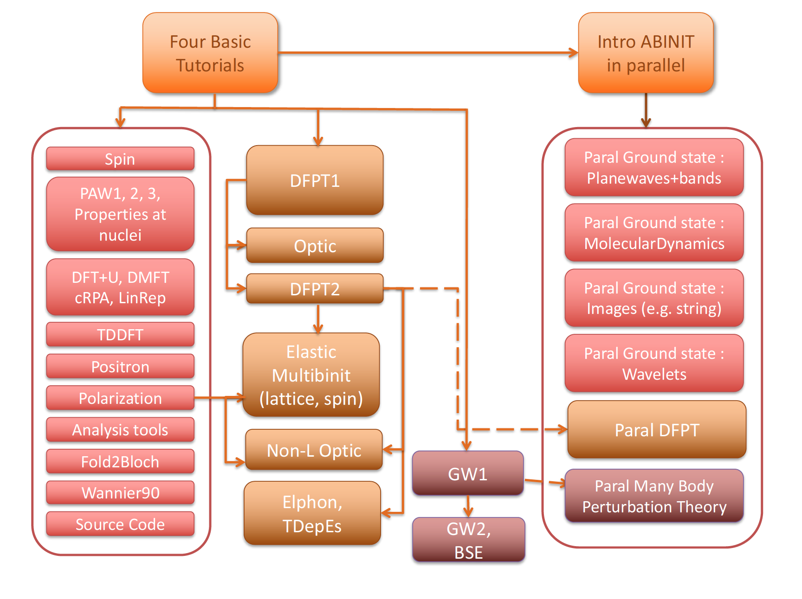

# Welcome

## Overview of the ABINIT tutorials.

These tutorials are aimed at teaching the use of ABINIT, in the
UNIX/Linux OS and its variants (MacOS, AIX ...).
They might be used for other operating systems, but the commands have to be adapted.

At present, nearly forty tutorials are available. Each of them is at most
two hours of student work. Tutorials 1-4 cover the basics, other lectures are
more specialized. There are dependencies between tutorials.
The following schema should help you to understand these dependencies.

<map id="map1" name="map1">
<area shape="rect" coords="145  ,15 ,250 , 90 " href="base1/index.html" /> <!--2,3,4-->
<area shape="rect" coords="70  ,135 ,180 ,160 " href="spin/index.html" />
<area shape="rect" coords="70  ,165 ,129 ,184 " href="paw1/index.html" />
<area shape="rect" coords="130 ,165 ,144 ,184 " href="paw2/index.html" />
<area shape="rect" coords="145 ,165 ,180 ,184 " href="paw3/index.html" />
<area shape="rect" coords="70  ,185 ,180 ,230 " href="nuc/index.html" />
<area shape="rect" coords="70  ,235 ,124 ,257 " href="dftu/index.html" />
<area shape="rect" coords="125 ,235 ,180 ,257 " href="dmft/index.html" />
<area shape="rect" coords="70  ,258 ,125 ,280 " href="ucalc_crpa/index.html" />
<area shape="rect" coords="125 ,258 ,180 ,280 " href="udet/index.html" />
<area shape="rect" coords="70  ,285 ,180 ,310 " href="tddft/index.html" />
<area shape="rect" coords="70  ,315 ,180 ,335 " href="positron/index.html" />
<area shape="rect" coords="70  ,345 ,180 ,369 " href="ffield/index.html" />
<area shape="rect" coords="70  ,370 ,180 ,390 " href="cut3d/index.html" />
<area shape="rect" coords="70  ,395 ,180 ,420 " href="fold2bloch/index.html" />
<area shape="rect" coords="70  ,425 ,180 ,445 " href="wannier90/index.html" />
<area shape="rect" coords="70  ,450 ,180 ,475" href="../developers/developers_howto/index.html" />
<area shape="rect" coords="210  ,135 ,330 ,199 " href="rf1/index.html" />
<area shape="rect" coords="210  ,210 ,330 ,240 " href="optic/index.html" />
<area shape="rect" coords="210  ,250 ,330 ,280 " href="rf2/index.html" />
<area shape="rect" coords="210  ,300 ,330 ,325 " href="elastic/index.html" />
<area shape="rect" coords="210  ,326 ,289 ,379 " href="lattice_model/index.html" />
<area shape="rect" coords="290  ,326 ,330 ,379 " href="spin_model/index.html" />
<area shape="rect" coords="210  ,390 ,330 ,420 " href="nlo/index.html" />
<area shape="rect" coords="210  ,435 ,330 ,464 " href="eph/index.html" />
<area shape="rect" coords="210  ,465 ,330 ,495 " href="tdepes/index.html" />
<area shape="rect" coords="355  ,400 ,440 ,440 " href="gw1/index.html" />
<area shape="rect" coords="355  ,460 ,440 ,479 " href="gw2/index.html" />
<area shape="rect" coords="355  ,480 ,440 ,500 " href="bse/index.html" />
<area shape="rect" coords="485  ,15 ,590 , 90 " href="basepar/index.html" />
<area shape="rect" coords="475  ,125 ,615 ,175 " href="paral_gspw/index.html" />
<area shape="rect" coords="475  ,180 ,615 ,235 " href="paral_moldyn/index.html" />
<area shape="rect" coords="475  ,240 ,615 ,295 " href="paral_images/index.html" />
<area shape="rect" coords="475  ,300 ,615 ,355 " href="paral_gswvl/index.html" />
<area shape="rect" coords="475  ,360 ,615 ,410 " href="paral_dfpt/index.html" />
<area shape="rect" coords="415  ,420 ,615 ,470 " href="paral_mbt/index.html" />
</map>

The "base" tutorials are presented at the top, in orange. The blocks in red represents additional tutorials related
to ground-state features. Response-function features are explained
in the tutorials in the light brown blocks. Finally, the Many-Body Perturbation Theory
capabilities are demonstrated in the tutorials belonging to the dark brown blocks.
The right-hand side blocks gather the tutorials related to the parallelism inside ABINIT.

Visualisation tools are NOT covered in the ABINIT tutorials.
Powerful visualisation procedures have been developed in the Abipy context,
relying on matplotlib. See the README of [Abipy](https://github.com/abinit/abipy)
and the [Abipy tutorials](https://github.com/abinit/abitutorials).

Before following the tutorials, you should have read the
[new user's guide](..),
as well as the pages
1045-1058 of [[cite:Payne1992|Rev. Mod. Phys. 64, 1045 (1992)]].
If you have more time, you should browse through the Chaps. 1 to 13, and appendices L and M of the book
[[cite:Martin2004|this book]] by R. M. Martin.
The latter reference is a must if you have not yet used another electronic structure code or a Quantum Chemistry package.

After the tutorial, you might find it useful to learn about the test cases
contained in the subdirectories of ~abinit/tests/, e.g. the directories fast,
v1, v2, ... , that provide many example input files.
You should have a look at the README files of these directories.

### Tutorials on basic concepts

**The tutorials 1-4 present the basic concepts, and form a global entity: you
should not skip any of these.**

* [The tutorial 1](base1) deals with the H2 molecule:
  get the total energy, the electronic energies, the charge density, the bond length, the atomisation energy

* [The tutorial 2](base2) deals again with the H2 molecule: convergence studies, LDA versus GGA

* [The tutorial 3](base3) deals with crystalline silicon (an insulator):
 the definition of a k-point grid, the smearing of the cut-off energy, the computation of a band structure,
 and again, convergence studies ...

* [The tutorial 4](base4) deals with crystalline aluminum (a metal), and its surface: occupation numbers,
  smearing the Fermi-Dirac distribution, the surface energy, and again, convergence studies ...

**Other tutorials present more specialized topics.**

### Miscellaneous advanced tutorials

**There is a group of tutorials that can be started without any other
prerequisite than the tutorials 1 to 4, and that you can do in any order (there are some exceptions, though):**

  * [The tutorial on spin in ABINIT](spin) presents the properties related to spin:
   spin-polarized calculations and spin-orbit coupling.

  * [The tutorial on the use of PAW (PAW1)](paw1) presents the Projector-Augmented Wave method,
    implemented in ABINIT as an alternative to norm-conserving pseudopotentials,
    with a sizeable accuracy and CPU time advantage.

  * [The tutorial on the generation of PAW atomic data files (PAW2)](paw2) presents the generation
    of atomic data for use with the PAW method. Prerequisite: PAW1.

  * [The tutorial on the validation of a PAW atomic datafile (PAW3)](paw3) demonstrates how to test
    a generated PAW dataset using ABINIT, against the ELK all-electron code, for diamond and magnesium.
    Prerequisite: PAW1 and PAW2.

  * [The tutorial on the properties of the nuclei](nuc) shows how to compute the electric field gradient.
    Prerequisite: PAW1.

  * [The tutorial on Wannier90](wannier90) deals with the Wannier90 library to obtain Maximally Localized Wannier Functions.

  * [The tutorial on polarization and finite electric field](ffield) deals with the computation
    of the polarization of an insulator (e.g. ferroelectric, or dielectric material) thanks
    to the Berry phase approach, and also presents the computation of materials properties
    in the presence of a finite electric field (also thanks to the Berry phase approach).

  * [The tutorial on electron-positron annihilation](positron) shows how to perform
    Two-Component Density-Functional Theory (TCDFT) calculations in the PAW framework
    to obtain the positron lifetime in the perfect material, the lifetime of a positron
    localized in a vacancy, the electron-positron momentum distribution wavefunctions and densities.

  * [The tutorial on cut3d](cut3d) deals with the use of the CUT3D utility to analyse wavefunctions and densities.

  * [The tutorial on the fold2bloch postprocessor](fold2bloch) deals with the use of the fold2Bloch utility
    to unfold band structures from supercell calculations.

  * [The tutorial on DFT+U](dftu) shows how to perform a DFT+U calculation using ABINIT,
    and will lead to compute the projected DOS of NiO. Prerequisite: PAW1.

  * [The tutorial on DFT+DMFT](dmft) shows how to perform a DFT+DMFT calculation on SrVO3
    using projected Wannier functions. Prerequisite: DFT+U.

  * [The tutorial on the calculation of effective interactions U and J by the cRPA method](ucalc_crpa)
    shows how to determine the U value with the constrained Random Phase Approximation
    using projected Wannier orbitals. Prerequisite: DFT+U.

  * [The tutorial on the determination of U for DFT+U](udet) shows how to determine the U value
    with the linear response method, to be used in the DFT+U approach. Prerequisite: DFT+U.

  * [The tutorial on TDDFT](tddft) deals with the computation of the excitation spectrum of finite systems,
    thanks to the Time-Dependent Density Functional Theory approach, in the Casida formalism.

  * [The "howto guide for developers"](../developers/developers_howto) introduces the new developer to the development
    of new functionalities in ABINIT ...

### DFPT-related tutorials
**There is an additional group of tutorials on density-functional
perturbation theory (phonons, optics, dielectric constant, electron-phonon
interaction, elastic response, non-linear optics, Raman coefficients,
piezoelectricity ...), for which some common additional information are needed:**

  * [The tutorial DFPT 1 (RF1 - response function 1)](rf1) presents the basics of DFPT within ABINIT.
    The example given is the study of dynamical and dielectric properties of AlAs (an insulator):
    phonons at Gamma, dielectric constant, Born effective charges, LO-TO splitting, phonons in the whole Brillouin zone.
    The creation of the "Derivative Data Base" (DDB) is presented.

**The additional information given by tutorial DFPT1 opens the door to:**

  * [The tutorial DFPT 2 (RF2 - response function 2)](rf2) presents the analysis of the DDBs that have been
    introduced in the preceeding tutorial RF1. The computation of the interatomic forces and the computation
    of thermodynamical properties is an outcome of this tutorial.

  * [The tutorial on Optic](optic), the utility that allows to obtain
    the frequency dependent linear optical dielectric function and the frequency
    dependent second order nonlinear optical susceptibility, in the simple "Sum-Over-State" approximation.

**The additional information given by tutorials DFPT1 and DFPT2 (Optic not needed) opens the door to a group of tutorials
that can be followed independently of each other:**

  * [The tutorial on the electron-phonon interaction](eph) presents the use of the utility MRGKK and ANADDB
    to examine the electron-phonon interaction and the subsequent calculation of superconductivity temperature (for bulk systems).

  * [The tutorial on temperature dependence of the electronic structure](tdepes) presents the computation
    of the temperature dependence of the electronic structure,
    the zero-point motion effect, the lifetime/broadening of eigenenergies.

  * [The tutorial on the elastic properties](elastic) presents the computation with respect to
    the strain perturbation and its responses: elastic constants, piezoelectricity.

  * [The tutorial on static non-linear properties](nlo) presents the computation of responses beyond
    the linear order, within Density-Functional Perturbation Theory (beyond the simple Sum-Over-State approximation):
    Raman scattering efficiencies (non-resonant case), non-linear electronic susceptibility, electro-optic effect.
    Comparison with the finite field technique (combining DFPT calculatons with finite difference calculations), is also provided.

**After following tutorials DFPT1, DFPT2, Elastic and NLO, the tutorials on MULTIBINIT might be followed:**

  * [The first tutorial on MULTIBINIT](lattice_model) presents the basic use of the MULTIBINIT application,
    how to build a harmonic model by using a second-principles approach for lattice dynamics
    simulations based on atomic potentials fitted on first-principles calculations.

### MBPT-related tutorials
**There is another additional group of tutorials on many-body perturbation
theory (GW approximation, Bethe-Salpeter equation), to be done sequentially):**

  * [The first tutorial on GW (GW1)](gw1) deals with the computation of the quasi-particle band gap of Silicon (semiconductor),
    in the GW approximation (much better than the Kohn-Sham LDA band structure), with a plasmon-pole model.

  * [The second tutorial on GW (GW2)](gw2) deals with the computation of the quasi-particle band structure
    of Aluminum, in the GW approximation (so, much better than the Kohn-Sham LDA band structure)
    without using the plasmon-pole model.

  * [The tutorial on the Bethe-Salpeter Equation (BSE)](bse) deals with the computation
    of the macroscopic dielectric function of Silicon within the Bethe-Salpeter equation.

### Tutorials on parallelism
**Concerning parallelism, there is another set of specialized tutorials.
For each of these tutorials, you are supposed to be familiarized with the
corresponding tutorial for the sequential calculation.**

  * [An introduction on ABINIT in Parallel](basepar) should be read before going to the next tutorials about parallelism.
    One simple example of parallelism in ABINIT will be shown.

  * [Parallelism for ground-state calculations, with plane waves](paral_gspw) presents the combined
    k-point (K), plane-wave (G), band (B), spin/spinor parallelism of ABINIT (so, the "KGB" parallelism),
    for the computation of total energy, density, and ground state properties

  * [Parallelism for molecular dynamics calculations](paral_moldyn)

  * [Parallelism based on "images"](paral_images), e.g. for the determination of transitions paths
    (NEB or string method), or for PIMD, that can be activated alone, or on top of other parallelisms,
    e.g. the "KGB" parallelism for force calculations.

  * [Parallelism for ground-state calculations, with wavelets](paral_gswvl) presents the parallelism of ABINIT,
    when wavelets are used as a basis function instead of planewaves, for the computation
    of total energy, density, and ground state properties

  * [Parallelism of DFPT calculations](paral_dfpt)  you need to be familiarized with the calculation
   of response properties within ABINIT, see the tutorial [DFPT 1 (RF1)](rf1)

  * [Parallelism of Many-Body Perturbation calculations (GW)](paral_mbt) allows to speed up
    the calculation of accurate electronic structures (quasi-particle band structure, including many-body effects).

!!! note

    Note that not all features of ABINIT are covered by these tutorials.
    For a complete feature list, please see the [[topic:index|Topics page]].
    For examples on how to use these features, please see the ~abinit/tests/*
    directories and their accompanying README files.

To learn how to compile the code from source, please consult this guide:

<embed src="https://wiki.abinit.org/lib/exe/fetch.php?media=build:installing_abinit.pdf" type="application/pdf" width="100%" height="480px">
