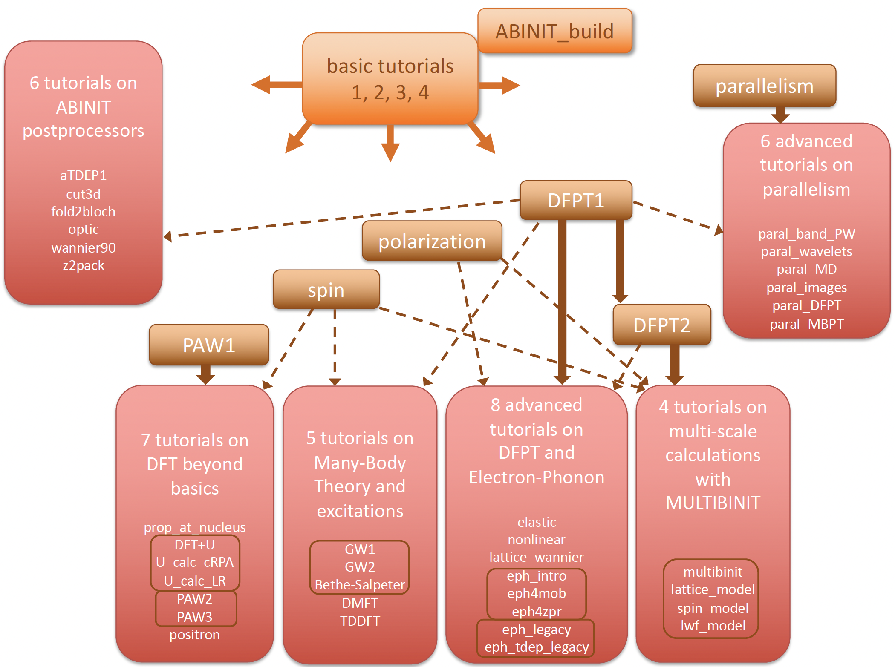

# Welcome

## Overview of the ABINIT tutorials.

These tutorials are aimed at teaching step-by-step the use of ABINIT, in the
UNIX/Linux OS and its variants (MacOS, AIX etc.).
They might be used for other operating systems, but the commands have to be adapted.

At present, more than forty tutorials are available.
Each of them is at most two hours of student work.
The set of tutorials is more structured and gradual than the user guides, but one need to invest more time to read them.

Dependencies between tutorials are present.
To start with, four tutorials cover the basics of using ABINIT, and one tutorial explains in detail the build of ABINIT
(as a complement to the easier user guide type documentation).
Six tutorials are intermediate level ones, that might be prerequisite for some more advanced tutorials.
The following schema should help to understand these dependencies.
To access the tutorials, see the menu on the left...

The four basic tutorials are presented at the top, in one orange block. There is also an orange block for the ABINIT_build tutorial.
Each block in brown represents one intermediate-level tutorial. The blocks in red
gather by themes -one block per theme- the more advanced tutorials.
The following themes are covered: ABINIT postprocessors, static DFT, Many-Body Theory and excitations,
Density-Functional Perturbation Theory -DFPT- and electron-phonon interaction, multiscale calculations with MULTIBINIT,
and parallelism. See the [[theory:acronyms|list of acronyms]].

The basic tutorials are prerequisite for all other tutorials, as represented by the heavy orange arrows.
Then, some relationships between intermediate-level and advanced-level tutorials are indicated, in brown.
A heavy brown arrow indicates that the starting intermediate tutorial is mandatory for all the tutorials of the indicated theme,
while a dashed brown arrow indicates that only some of the tutorials of the indicated theme will need it.

Inside a theme, there are also subsets of tutorials indicated with a light contour.
They are logically related to each other, and usually to be done
one after the other. Otherwise, advanced tutorials usually do not have mutual dependencies.
There are however three exceptions: the [GW1](gw1) tutorial is a prerequisite for the [paral_MBPT](paral_mbt) tutorial,
the [parallelism](basepar) tutorial is a prerequisite for the [LRUJ](lruj) tutorial,
while the [lattice_wannier](lattice_wannier) tutorial is a prerequisite for the [lwf_model](lwf_model) tutorial.

Visualisation tools are NOT covered in the ABINIT tutorials.
Powerful visualisation procedures have been developed in the Abipy context,
relying on matplotlib. See the README of [Abipy](https://github.com/abinit/abipy)
and the [Abipy tutorials](https://github.com/abinit/abitutorials).

Before following the tutorials, you should have read the [new user's guide](/guide/new_user),
as well as the pages
1045-1058 of [[cite:Payne1992|Rev. Mod. Phys. 64, 1045 (1992)]].
If you have more time, you should browse through the Chaps. 1 to 13, and appendices L and M of the book
[[cite:Martin2004|this book]] by R. M. Martin.
Alternatively, [[cite:Kohanoff2006|the book]] by J. Kohanoff can also be used (skip sections 5.3, 5.5, 5.6, 8.3-8.6, 9.4, 9.5, 10.2, 10.3, and the whole Chap.12).
One of the latter references is a must if you have not yet used another electronic structure code or a Quantum Chemistry package.

After the tutorial, you might find it useful to learn about the test cases
contained in the subdirectories of ~abinit/tests/, e.g. the directories fast,
v1, v2, ... , that provide many example input files.
You should have a look at the README files of these directories.

### Basic tutorials & ABINIT_build

**The basic tutorials 1-4 present the basic concepts, and form a global entity: you
should not skip any of these.**

* [The basic tutorial 1](base1) deals with the H2 molecule:
  get the total energy, the electronic energies, the charge density, the bond length, the atomisation energy

* [The basic tutorial 2](base2) deals again with the H2 molecule: convergence studies, LDA versus GGA

* [The basic tutorial 3](base3) deals with crystalline silicon (an insulator):
 the definition of a k-point grid, the smearing of the cut-off energy, the computation of a band structure,
 and again, convergence studies ...

* [The basic tutorial 4](base4) deals with crystalline aluminum (a metal), and its surface: occupation numbers,
  smearing the Fermi-Dirac distribution, the surface energy, and again, convergence studies ...

* [The ABINIT_build tutorial](abinit_build) explains how to compile ABINIT from source
  including the external libraries.
  More advanced topics such as using **modules** in supercomputing centers,
  compiling and linking with the **intel compilers** and the **MKL library** as well as **OpenMP threads**
  are also discussed.

### Intermediate level tutorials

**Tutorials in this group are prerequisite for several other tutorials. Whether it is worth to read them depend on what you are trying to compute with ABINIT.**

  * [The tutorial on the use of PAW (PAW1)](paw1) presents the Projector-Augmented Wave method,
    implemented in ABINIT as an alternative to norm-conserving pseudopotentials,
    with a sizeable accuracy and CPU time advantage.

  * [The tutorial on spin in ABINIT](spin) presents the properties related to spin:
   spin-polarized calculations and spin-orbit coupling.

  * [The tutorial on polarization and finite electric field](polarization) deals with the computation
    of the polarization of an insulator (e.g. ferroelectric, or dielectric material) thanks
    to the Berry phase approach, and also presents the computation of materials properties
    in the presence of a finite electric field (also thanks to the Berry phase approach).

  * [An introduction on parallelism in ABINIT](basepar) should be read before going to the next tutorials about parallelism.
    One simple example of parallelism in ABINIT will be shown.

  * [The tutorial DFPT1 (RF1 - response function 1)](rf1) presents the basics of DFPT within ABINIT.
    The example given is the study of dynamical and dielectric properties of AlAs (an insulator):
    phonons at Gamma, dielectric constant, Born effective charges, LO-TO splitting, phonons in the whole Brillouin zone.
    The creation of the "Derivative Data Base" (DDB) is presented.

**The additional information given by tutorial DFPT1 opens the door to:**

  * [The tutorial DFPT2 (RF2 - response function 2)](rf2) presents the analysis of the DDBs that have been
    introduced in the preceeding tutorial RF1. The computation of the interatomic forces and the computation
    of thermodynamical properties is an outcome of this tutorial.

**Other tutorials present more specialized topics.**

### ABINIT postprocessors

**Some ABINIT postprocessors have one dedicated tutorial. For some processors (ANADDB, MULTIBINIT), there are even more tutorials, presented under other themes. Alternatively,
there are also specific User Guides for several postprocessors..**

  * [The tutorial on aTDEP (aTDEP1)](atdep1) shows how to capture anharmonicities by means of an
    harmonic Temperature Dependent Effective Potential (TDEP).

  * [The tutorial on cut3d](cut3d) deals with the use of the CUT3D utility to analyse wavefunctions and densities.

  * [The tutorial on the fold2bloch postprocessor](fold2bloch) deals with the use of the fold2Bloch utility
    to unfold band structures from supercell calculations.

  * [The tutorial on Optic](optic), the utility that allows one to obtain
    the frequency-dependent linear optical dielectric function and the frequency
    dependent second order nonlinear optical susceptibility, in the simple "Sum-Over-State" approximation.
    Prerequisite: [DFPT1](rf1).

  * [The tutorial on Wannier90](wannier90) deals with the Wannier90 library to obtain Maximally Localized Wannier Functions.

  * [The tutorial on Z2Pack](z2pack) shows how to use the Z2Pack application with an interface to ABINIT, to compute the Z2 topological invariant
    and find topologically non-trivial insulators.

### DFT beyond basics

** Prerequisite: [PAW1](paw1).**

  * [The tutorial on the properties at nucleus](nuc) shows how to compute the electric field gradient and isomer shift (at the nucleus position).

  * [The tutorial on DFT+U](dftu) shows how to perform a DFT+U calculation using ABINIT,
    and will lead to compute the projected DOS of NiO.

  * [The tutorial U_calc_cRPA](ucalc_crpa)
    shows how to determine the U value for DFT+U with the constrained Random Phase Approximation (cRPA)
    using projected Wannier orbitals. Prerequisite: [DFT+U](dftu). Require at least 8 cores.

  * [The tutorial LRUJ](lruj) shows how to determine the U value for DFT+U
    with the linear response method. Prerequisite: [DFT+U](dftu).

  * [The tutorial PAW2](paw2) presents the generation of atomic data for use with the PAW method.

  * [The tutorial PAW3](paw3) demonstrates how to test
    a generated PAW dataset using ABINIT, against the ELK all-electron code, for diamond and magnesium.
    Prerequisite: PAW2.

  * [The tutorial on electron-positron annihilation](positron) shows how to perform
    Two-Component Density-Functional Theory (TCDFT) calculations in the PAW framework
    to obtain the positron lifetime in the perfect material, the lifetime of a positron
    localized in a vacancy, the electron-positron momentum distribution wavefunctions and densities.

### Many-Body Theory & excitations

**This group of three tutorials on Many-Body Perturbation
Theory (GW approximation, Bethe-Salpeter equation) is to be done sequentially:**

  * [The first tutorial on GW (GW1)](gw1) deals with the computation of the quasi-particle band gap of Silicon (semiconductor),
    in the GW approximation (much better than the Kohn-Sham LDA band structure), with a plasmon-pole model.

  * [The second tutorial on GW (GW2)](gw2) deals with the computation of the quasi-particle band structure
    of Aluminum, in the GW approximation (so, much better than the Kohn-Sham LDA band structure)
    without using the plasmon-pole model.

  * [The tutorial on the Bethe-Salpeter Equation (BSE)](bse) deals with the computation
    of the macroscopic dielectric function of Silicon within the Bethe-Salpeter equation.

**The two following tutorials do not rely on Many-Body Perturbation Theory**

  * [The tutorial on DFT+DMFT](dmft) shows how to perform a DFT+DMFT calculation on SrVO3
    using projected Wannier functions. Prerequisite: DFT+U.

  * [The tutorial on TDDFT](tddft) deals with the computation of the excitation spectrum of finite systems,
    thanks to the Time-Dependent Density Functional Theory approach, in the Casida formalism.

### Advanced tutorials on DFPT &  electron-phonon interaction.

**Prerequisite [DFPT1](rf1) for all tutorials in this section. Also [DFPT2](rf2) for all electron-phonon tutorials.**

**Density-functional perturbation theory gives access to many properties of materials
(phonons, dielectric constant, electron-phonon
interaction, elastic response, Raman coefficients, piezoelectricity ...)**

  * [The tutorial on the elastic properties](elastic) presents the computation with respect to
    the strain perturbation and its responses: elastic constants, piezoelectricity.

  * [The tutorial on static non-linear properties](nlo) presents the computation of responses beyond
    the linear order, within Density-Functional Perturbation Theory (beyond the simple Sum-Over-State approximation):
    Raman scattering efficiencies (non-resonant case), non-linear electronic susceptibility, electro-optic effect.
    Comparison with the finite field technique (combining DFPT calculations with finite difference calculations), is also provided.

  * [The tutorial on building Lattice wannier function](lattice_wannier) presents how to use anaddb to build the lattice Wannier functions (LWF).

**Electron-phonon interaction has been the subject of major efforts in the last years. Three tutorials are already available to present the new implementations.**

  * [The introductive tutorial on the electron-phonon interaction](eph_intro) presents the electron-phonon driver
    integrated with the ABINIT executable, discuss important technical details related to the implementation and the associated input variables.
    The drawbacks/advantages with respect to the implementation available in ANADDB are also discussed.

  * [The tutorial on mobility calculations](eph4mob) explains how to compute phonon-limited carrier mobilities
    in semiconductors within the relaxation time approximation (RTA)

  * [The tutorial on zero-point renormalization and temperature-dependence of electronic structure](eph4zpr)
    explains how to obtain the electron self-energy due to phonons, compute the zero-point renormalization (ZPR) of the band gap
    as well as temperature-dependent band gaps (or the whole electronic structure).

**Two legacy tutorials on electron-phonon interaction are still present.
The implementations are still available at time of writing,
but have been superseded by the new implementations, described in the above-mentioned tutorials.**

  * [The legacy tutorial on the electron-phonon interaction](eph_legacy) presents the use of the utility MRGKK and ANADDB
    to examine the electron-phonon interaction and the subsequent calculation of superconductivity temperature (for bulk systems).

  * [The legacy tutorial on temperature dependence of the electronic structure](eph_tdep_legacy) presents the computation
    of the temperature dependence of the electronic structure,
    the zero-point motion effect, the lifetime/broadening of eigenenergies.

### MULTIBINIT tutorials

**Prerequisite [DFPT1](rf1) and [DFPT2](rf2) for all tutorials in this section.**

  * [The introductory tutorial on MULTIBINIT](multibinit) presents the MULTIBINIT project

  * [The first tutorial on MULTIBINIT](lattice_model) presents the basic use of the MULTIBINIT application,
    how to build a harmonic model by using a second-principles approach for lattice dynamics
    simulations based on atomic potentials fitted on first-principles calculations. Prerequisite [polarization](polarization).

  * [The second tutorial on MULTIBINIT](spin_model) presents how to build a spin model
    and run spin dynamics in MULTIBINIT. Prerequisite [spin](spin).

  * [The third tutorial on MULTIBINIT](lwf_model) presents how to run a lattice Wannier function (LWF) dynamics
    in MULTIBINIT. Prerequisite [lattice_wannier](lattice_wannier).

### Advanced tutorials on parallelism

**Prerequisite [parallelism](basepar) for all tutorials in this section.**

**For each of these tutorials, familiarization with the
corresponding tutorial for the sequential calculation is mandatory, if it exists.**

  * [Parallelism for ground-state calculations, based on band and  plane waves distribution - paral_bandpw](paral_bandpw) presents the combined
    k-point (K), plane-wave (G), band (B), spin/spinor parallelism of ABINIT (so, the "KGB" parallelism),
    for the computation of total energy, density, and ground state properties

  * [Parallelism for ground-state calculations, with wavelets](paral_gswvl) presents the parallelism of ABINIT,
    when wavelets are used as a basis function instead of planewaves, for the computation
    of total energy, density, and ground state properties

  * [Parallelism for molecular dynamics calculations - paral_MD](paral_moldyn)

  * [Parallelism based on "images"](paral_images), e.g. for the determination of transitions paths
    (NEB or string method), or for PIMD, that can be activated alone, or on top of other parallelisms,
    e.g. the "KGB" parallelism for force calculations.

  * [Parallelism of DFPT calculations](paral_dfpt)  you need to be familiarized with the calculation
   of response properties within ABINIT, see the tutorial [DFPT 1 (RF1)](rf1)

  * [Parallelism of Many-Body Perturbation calculations (GW) - paral_MBPT](paral_mbt) allows to speed up
    the calculation of accurate electronic structures (quasi-particle band structure, including many-body effects).

!!! note

    Note that not all features of ABINIT are covered by these tutorials.
    For a complete feature list, please see the [[topic:index|Topics page]].
    For examples on how to use these features, please see the ~abinit/tests/*
    directories and their accompanying README files.

