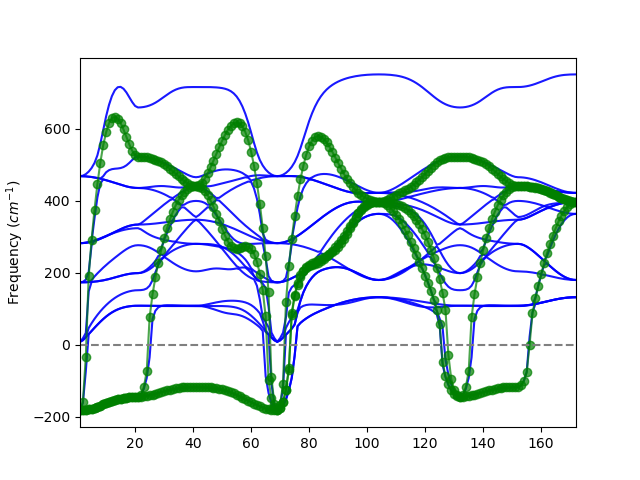

# Lattice Wannier functions (LWFs). 

!!! tip

    This feature is still under heavy development. Tests and feedbacks are welcome! 
    It is not recommended to be used in production at this stage.
    Please contact the developers (x.he@uliege.be) for feedbacks and help.

This tutorial introduces the methods for constructing lattice Wannier funtions (LWFs)[[cite:Rabe1995]]. 
You will learn how to use the SCDM-k (selected columns of the density matrix in k-space -
[[cite:Damle2015]] [[cite:Damle2017]] and [[cite:Damle2018]]) method for constructing the LWFs, 
and how to plot the phonon band structure from the LWFs and compare it with the full phonon band structures. 

The LWF is a close analogy to the electron Wannier functions, but for atomic displacements.  
Each LWF is formed by a group of atomic displacement within a certain range. 
Together all LWFs form a localized basis set for the atomic distortions, which could span the (sub)space for the atomic vibrations (phonons). 
One typical use case is to build effective Hamiltonian of atomic displacement. 
In many phenomena, only a few distortion modes are important. 
For example,  in a structural phase transition the soft modes are often related, 
whereas the phonons with much higher frequency are probably less relevant. 
Thus if the LWFs can well represent the relevant phonon modes, they could reduce the number of degrees of freedom in the study of such phenomena. 

In anaddb, LWFs can be constructed with the SCDM-k algorithm or the projected Wannier function (PWF) algorithm. 
Both methods were initially proposed for electron Wannier functions and were adapted for the LWFs. 
In this tutorial, we will first learn about the algorithms and the practical usage of the methods. 


## SCDM-k method

### Introduction to the SCDM-k algorithm

The SCDM-k method is based on two observations: 1. The columns of the density matrix (DM) are often localized, 
given that the DM is expressed in local basis set. 
2. The DM are often low ranked, i.e. they can be spanned by a basis set with size smaller than the original basis set.  
A $m\times n$ matrix $\mathbf{A}$ can be approximately decomposed as another matrix formed by its columns, a $m\times k$ matrix $\mathbf{A[:,c]}$ multiplied by a $k\times n$ matrix, and a permutation matrix $\Pi$ with size $n\times n$. 
The matrix  $\mathbf{A[:,c]}$  is selected so that it best represents the $\mathbf{A}$ matrix. 
Thus it can be used as a basis set for describing $\mathbf{A}$. In our case, it can be used as the Wannier function. 


The DM is defined as $\mathbf{\rho}=\sum_i \Psi_if(E_i)\Psi_i^\dagger$,where $H\Psi_i=E_i\Psi_i$,  
where $E_i$ and $\Psi_i$ are the eigen energy and eigen function of the Hamiltonian, 
and $f$ is the occupation function, which is often defined as the Fermi function for the electrons. 
Thus the DM contains information from where the $f$ is large, whereas neglecting the information where the $f$ is close to 0. 
Thus, if the LWF can effectively span the DM, it is good for describing the physics within the range where $f$ is significant. 
This makes $f$ effectively an disentanglement function, which encodes the energy range of interest. 
Instead of using the Fermi function, we can take other functions so that we can select other kinds of energy range, 
thereby giving the "generalized DM". 
In anaddb, three kinds of functions could be used corresponding to the "lwf_disentangle" paramter in anaddb, as shown in the figure below.

- The unity function, which is 1 everywhere. This means all the energies are treated equally. 
- The erfc function, which is very similar to the Fermi function with two parameters, $\mu$ and $\sigma$. 
It approaches 1 and 0 below and above $\mu$, respectively. 
And the smearing of the function is defined as $\sigma$. 
For example the center panel of the figure is $\mu=0$ and $\sigma=0.2.  
This type of function is often used to build LWFs where low-frequency phonons are of interests.  
- The Gauss function which is highest at the center ($\mu$) and close to 0 away from it. 
The width is defined by $\sigma$. The right panel shows the function with $\mu=0$ and $\sigma=0.2$. 
This type of function is often used if the phonon within some energy range are of interests. 


More generally, the function $f$ does not have to be solely a function of the $E_i$. For example, it can also take the $\Psi_i$ as input. 
We can define a few states as "anchor states", and project the states onto them, and multiply the $f$ by this projection, so that the eigenstates which are most similar to the anchor states are emphasized. 
This method can be very useful when the phonon modes of interests can hardly be distinguished from other modes by energy.  
In anaddb this can be enabled by setting [[lwf_anchor_proj@anaddb]] to 1. 

In the case of a periodic crystal, the columns of the density matrix for all wave vector are localized and  are continuous in reciprocal space. 
Therefore by transforming these columns to the real space, one could get localized functions.  
In practice, we start from finding the columns of the DM for an anchor $q$-points. 
Then we take the same columns for each wave vector $q$ in a Monkhorst-Pack grid. 
As these columns are smooth in reciprocal space, the transformations to real space are localized.  
The size of the Monkhorst-Pack grid can be specified by [[lwf_ngqpt@anaddb]]. 
Note that it does not have to be the same as [[ngqpt]], as we can use a different $q$-points grid by interpolating the inter-atomic force constant.  


### Steps to construct the LWF using the SCDM method

Now we take BaTiO$_3$ as an example to learn how to construct the LWFs with the SCDM method. 


 You can download the DDB file for the BaTiO$_3$  here:*

and the anaddb input file:


**Before starting, you might to consider working in a different subdirectory than for the other lessons. Why not create "Work_LWF"?**

We can walk through the following steps to build the LWF.

1. Turn on the options required for the construction of LWFs. The interatomic force constants should first be computed, which requires "ifcflag 1" and a few parameters related as in the "Inter-atomic force constant info" section in the input file below. To enable the construction of LWFs with the SCDM-k method, the "lwfflag 1" is used.

2. Identify the phonon modes of interests. 

    In the example of BaTiO$_3$, as we are interested in the ferroelectricity which is related to the three soft modes at $q=\Gamma$.  
    We can select $\Gamma$ as the anchor point with "lwf_anchor_qpt 0 0 0" and the number of wannier function to be 3 with the option "lwf_nwann 3" 

3. Identify the disentanglement function.  

   The lwf_disentangle parameter is set to 1 to use the "unity" function. We'll tune this to see the effect of using different disentanglement functions. 

   We can also enable the projection to the anchor points with "lwf_anchor_proj 1". 
   The anchor points are given by the indices of the band at the anchor $q$-point ("lwf_anchor_iband"), which counts from the lowest frequency.

   The example anaddb input looks like follows:

```
!File paths
 ddb_filepath = "BTO.DDB"
 output_file = "tlwf_1.abo"

!Flags
 ifcflag 1
 lwfflag 1

# Interatomic force constant info 
 ngqpt 4 4 4
 q1shft 0 0 0
 nqshft 1
 asr 2
 chneut 1
 dipdip 0
 dipquad 0
 quadquad 0

# Lattice Wannier function parameters
 lwf_nwann 3
 lwf_ngqpt 4 4 4
 lwf_anchor_qpt  0 0 0
 lwf_anchor_iband 1 2 3
 lwf_disentangle 1
 lwf_anchor_proj=1                                                                    

```

4. Plot the phonon band structure and tune the parameters to get the desired set of LWFs.  

   If a q-point path is given in the anaddb input, an lwf_PHFRQ file is generated together with the usual PHFRQ file containing the phonon frequency. 
The format of the two files are the same. The only difference is that, the number of bands equals the number of Wannier functions whereas it is 3 times the number of atoms in the full phonon band structure.  Below is an example of the input to specify the q-point path. We can add these lines to the input to get the full and LWF phonon band structures. 
   
```
    ndivsm 20
    nqpath 8
    qpath
       0.0    0.0    0.0
       0.0    0.5    0.0
       0.5    0.5    0.0
       0.0    0.0    0.0
       0.5    0.5    0.5
       0.0    0.5    0.0
       0.5    0.5    0.0
       0.5    0.5    0.5
   
```

   

   We can use the script provided in the scripts/post_processing directory in the ABINIT package, named compare_phbands.py to plot the two band structure in one figure.  The detailed guide for the usage of the script can be found by the command:

```
   python compare_phbands.py --help
```

   Here we can use the command to generate the figure, both into the file compare.png and to the screen.

```
    python compare_phbands.py tlwf_1  -o compare.png -s
```


We can see the two band structures. The blue lines form the full phonon band structure and the green dots form the LWF phonon band structure.

   

   It shows that the phonon band structure from LWFs follows the phonon branches connected with the three soft modes, and goes to high frequencies. 

The LWFs are not unique. They can be adapted to different purposes.  For example, we could use a disentanglement function which emphasize the low-frequency part. 
Here we try with a erfc function with $\mu=400 cm^{-1}$ and a smearing of  $\sigma=150cm^{-1}$.

```
lwf_disentangle 2
lwf_mu 400.0
lwf_sigma 150.00
```

This give the band structure, which is similar in the low-frequency but are significantly different in the high-frequency range. 


