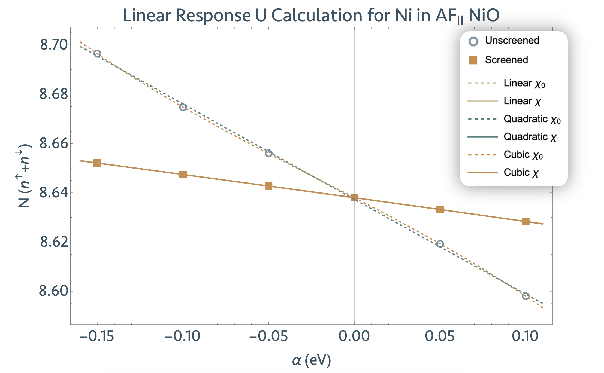
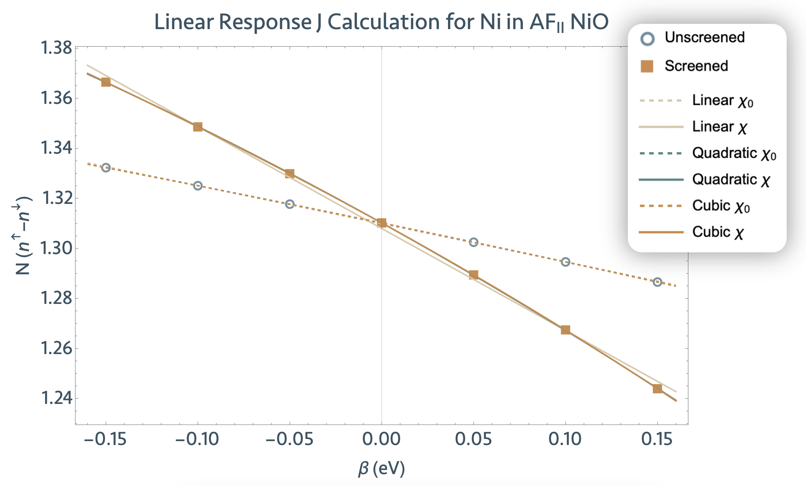

# Hubbard U and Hund's J Parameters with Cococcioni and de Gironcoli's approach

## 1 How to determine U and/or J for DFT+U(+J) via Linear Response

This tutorial aims to demonstrate the operations and functionalities of the Abinit post-processing
utility called Linear Response Hubbard U and Hund's J (lruj), designed to determine the 
first-principles Hubbard U and/or Hund's J parameters for particular atomic subspaces. Once obtained,
these parameters may then be applied via the DFT+U(+J)-like Hubbard functionals to 
address self-interaction and static correlation errors.

Note that there is another methodology to compute U and J; see the 
[cRPA U(J)](/tutorial/ucalc_crpa) tutorial.

In this tutorial, you will learn how to run perturbative calculations in Abinit and
generate input data to successfully execute the lruj post-processing utility.
We strongly encourage you to read the [PAW1](/tutorial/paw1), [PAW2](/tutorial/paw2)
and [DFT+U](/tutorial/dftu) tutorials to familiarize yourself with the manifestation of
PAW atomic datasets within Abinit. Also consider checking out this video introducing
the PAW formalism in an Abinit context. 

<iframe width="1384" height="629" src="https://www.youtube.com/watch?v=5WEdd78GDFw" frameborder="0" allow="accelerometer; autoplay; encrypted-media; gyroscope; picture-in-picture" allowfullscreen></iframe>

This tutorial should take less than 30 minutes. We begin with a brief description of the 
linear response method and an important explanation of recent renovations to the linear 
response functionalities of Abinit. [Click here](#tutref) if you'd like to skip to 
the NiO tutorial directly.

[TUTORIAL_README]

## 2 Summary of linear response method to determine U(J)

The Hubbard U and Hund's J are ground-state properties of any multi-atomic system 
treated with a given approximate XC functional. They embody the spurious curvature of 
the total energy with respect to subspace occupation and magnetization respectively. 
The Hubbard U, specifically, is compensating for an unphysical quadratic term left over 
by the Hartree energy; it is thus defined as the second derivative of the total energy 
with respect to charge occupation: $U=\frac{\delta^2 E}{\delta^2 n}$.

Cococcioni and de Gironcoli [[cite:Cococcioni2002]], following the seminal work from 
Pickett *et al.* in 1998 [[cite:Pickett1998]], further defined a protocol to strictly
avoid the semi-empirical evaluation of these parameters. This linear response procedure
is described mathematically in terms of constraint formalism and Lagrange 
coefficients by Dederichs *et al.* [[cite:Dederichs1984]] and Anisimov *et al.*
[[cite:Anisimov1991]]. A formal definition of and analogous procedure for the Hund's 
coupling J parameter was published by Linscott *et al.* in 2018 [[cite:Linscott2018]].

Practically, the linear response approach begins with the application of a small 
perturbation $\alpha$($\beta$) to the external potential of the subspace for which U(J) is 
under assessment. The change in electronic occupation induced by that perturbation 
is then monitored. This occupational response is, for small perturbations, expected 
to be a linear function of the perturbation's magnitude.


!!! important

    For more detailed information on the concepts of the linear response calculation of the 
    Hubbard U and Hund's J parameters, please see the following papers.
    
    [1] "Linear response approach to the calculation of the effective interaction
    parameters in the LDA + U method", M. Cococcioni and S. de Gironcoli, Physical
    Review B 71, 035105 (2005)  [[cite:Cococcioni2005]]

    [2] "The role of spin in the calculation of Hubbard U and Hund's J parameters 
    from first principles", E.B. Linscott, D.J. Cole, M.C. Payne and D.D. O'Regan, Physical
    Review B 98, 235157 (2018) [[cite:Linscott2018]]
    
    [3] "A LDA+U study of selected iron compounds ", M. Cococcioni, Ph.D. thesis,
    International School for Advanced Studies (SISSA), Trieste (2002)  [[cite:Cococcioni2002]]

    Some further reading:
    
    [4] "Ground States of Constrained Systems: Application to Cerium Impurities",
    P. H. Dederichs, S. Blugel, R. Zeller, and H. Akai, Phys. Rev. Lett. 53, 2512 (1984)
    [[cite:Dederichs1984]]
    
    [5] "Calculation of Coulomb-interaction parameters for La2CuO4 using a
    constrained-density-functional approach", M. S. Hybertsen, M. Schluter, and N.
    E. Christensen, Phys. Rev. B 39, 9028 (1989)   [[cite:Hybertsen1989]]
    
    [6] "Density-functional calculation of effective Coulomb interactions in
    metals", V. I. Anisimov and O. Gunnarsson, Phys. Rev. B42, 7570 (1991)  [[cite:Anisimov1991]]
    
    [7] "Reformulation of the LDA+U method for a local-orbital basis", W. E.
    Pickett, S. C. Erwin, and E. C. Ethridge, Phys. Rev. B58, 1201 (1998)  [[cite:Pickett1998]]
    
    The implementation of the determination of U in ABINIT is briefly discussed in
    [[cite:Gonze2016]].


## 3 Renovation of the linear response protocol since Abinit Version 9.6.2

The basic functions of linear response were implemented in Abinit, embedded in its 
PAW functionality, in 2009. The subsequent U(J) DETermination (ujdet) program was part of the 
Abinit suite as both an intrinsic DFT protocol and post-processing utility 
extension. Abinit Version 9.6.2 saw the introduction of an additional [[macro_uj]] 
variable for calculating the Hund's J with ujdet.

In 2022, users alerted Abinit to the existence of a bug in ujdet which led to the decommission of
its post-processing utility and the renovation of its internal Abinit functionality. As of Version 
9.6.2, the Abinit DFT suite is equipped with the lruj post-processing tool, which is built off of the
same core, but debugged, ujdet programming. Although older versions of Abinit preserve the ujdet 
internal and post-processing utilities, their use is strongly disadvised. The lruj functionality 
conserves most of ujdet's data processing functionalities. For retrogressive and archive 
purposes, the primary differences between the two are outlined in the table below.

|   | <code>ujdet</code>            | <code>lruj</code>                                |
| - | ----------------------------- | ------------------------------------------------ |
| 1 | Embedded in Abinit core routine + Post-processing extension | Post-processor                                   |
| 2 | Two-point linear regression                                 | 3+ point polynomial (variable degree) regression |
| 3 | $\chi$ and $\chi_0$ responses treated as matrices; interatomic response monitored; matrices augmented by total system charge | $\chi$ and $\chi_0$ responses treated as scalars               |
| 4 | Supercell extrapolation scheme                              | RMS Error analysis                               |
| 5 | Atomic Sphere Approximation projector extensions/normalizations   |                                                  |

As mentioned in item (2), the most influential difference between ujdet and lruj is the number 
of data points used to compute a linear regression of the response functions $\chi$ and $\chi_0$. 
The ujdet utility uses only two points: the unperturbed case—in which the perturbation applied 
is zero and the subspace occupations are those of the ground state—and one perturbed case, in 
which the potential perturbation is equal to the value of [[pawujv]]. Note that the ujdet procedure 
differs slightly from its implementations in Abinit versions prior to 9.6.2, in which it conducted 
two perturbations: one of strength [[pawujv]] and the other of strength -[[pawujv]]. Due to a bug in the 
program, the second perturbation administered provided erroneous unscreened response occupations. 
To fix this, we exchanged the data point from the second perturbation for one from the unperturbed 
case, whose occupations are calculated anyway from the ground state wavefunctions read into Abinit.

By contrast, the lruj utility requires, at minimum, three data points (one unperturbed case and at 
least two perturbations) to conduct a distinctive regression analysis on the response functions. 
With *n* data points, the lruj utility computes not only a linear regression, but all polynomial 
regressions up to degree $n-2$. Furthermore, the lruj utility conducts RMS error analysis on the 
fits and factors that into an approximative RMS error on the resulting Hubbard parameters.

Another crucial difference between the two utilities is item (3) in the above table: the ujdet 
utility treats the response functions as matrices, whereas the lruj utility treats them as scalars. 
Ideologically, this means that the ujdet Hubbard parameters are, to some degree, informed by 
the Hubbard interactions on and between the other atomic subspaces of the system as well as the 
total charge bath. The protocol is expanded upon in Cococcioni’s thesis [[cite:Cococcioni2002]].

By contrast, the lruj utility provides the scalar Hubbard parameters, informed only by the change 
in occupancy on the perturbed subspace. This parameter is functionally sufficient for SIE corrective 
application to that subspace. 

For all other purposes, it can be said that lruj offers a simplified data processing procedure to 
that of ujdet. More detailed information is due to follow in the coming months in the form of a
user guide, so stay tuned.


## 4 Determine the Hubbard U for Ni *3d* in NiO with lruj <a id="tutref"></a>

For this tutorial, we will calculate the scalar Hubbard U parameter for the Ni *3d* subspace in
a four-atom unit cell of AF2-ordered NiO using the lruj post-processing utility. The lruj procedure
can be carried out in three steps:

1. Run a ground state Abinit calculation for NiO to generate <code>WFK</code> files.
2. Run a series of perturbative Abinit calculations to generate _LRUJ.nc files.
3. Execute the lruj prost-processing utility.


### 4.1. Generate the ground-state <code>WFK</code> files

We need to establish a ground state material system whose subspace potential we can perturb.
Fortunately, this is principally no different from your standard Abinit ground state run, aside
from a few minor modifications to the input file. Make a new work directory called 
<code>work_lruj</code>, then copy and paste <code>tlruj_1.abi</code> and <code>tlruj_2.abi</code> 
therein:

    cd $ABI_TESTS/tutorial/Input
    mkdir work_lruj
    cd work_lruj
    cp ../tlruj_1.abi .
    cp ../tlruj_2.abi .

!!! important

    Henceforth, the name of files are mentioned as if you were in such a subdirectory.
    All the input files can be found in the $ABI_TESTS/tutorial/Input directory.
    You can compare your results with the reference output files located in
    $ABI_TESTS/tutorial/Refs directory (for the prese

Open up <code>tlruj_1.abi</code>; you’ll notice a few key differences between this and other
standard ground-state input files.



First, we specify as a separate species the atom whose subspace we wish to apply a potential 
perturbation. This will alert Abinit that we want to allow the perturbed Ni *3d* subspace to 
vary its properties independently to the other Ni atom in the cell.

!!! note

    By specifying the perturbed atom as a separate species, Abinit will only harvest the changes 
    in occupation of the perturbed atom. This information is sufficient for the lruj procedure, 
    but not for ujdet. To avail of the supercell extrapolation technique, you will need to set 
    the symmetry relations [[symrel]] explicitly. This will tell Abinit that (1) the perturbed 
    atom should vary independently to its kin and (2) it should still collect occupation information 
    for all atoms containing the subspace to be treated, not just that of the perturbed atom. 
    The ujdet utility then uses these interatomic response matrix elements to inform its 
    Hubbard parameters.

    You can generate these symmetries in a separate run, wherein you specify the atom upon
    which the perturbation is to be applied as a different species. From the output,
    you read the number of symmetries ([[nsym]]), the symmetry operations ([[symrel]]) and
    the non-symmorphic vectors ([[tnons]]).


Here, we have a four-atom unit cell of NiO. Unlike the ujdet utility, the lruj utility can accomodate
the perturbation of any Ni atom in the cell. For right now, we apply a perturbation to the first Ni 
atom by making the following modifications:

               Original                              Modified
    -------------------------------     -------------------------------
    ntypat = 2                          ntypat = 3
    typat = 1 1 2 2                     typat = 1 2 3 3
    znucl = 28 8                        znucl = 28 28 8
    pseudos = “Ni.xml,O.xml”            pseudos = “Ni.xml,Ni.xml,O.xml”

If you are using other input variables whose dimensions are set by [[ntypat]], you will need to 
change those as well.  

!!! note

    If using the ujdet functionality that performs the supercell extrapolation schema, the 
    perturbation should only be applied to the first atom listed in [[xred]]. Make sure that 
    the coordinates of the perturbed atom are listed first.

Since the Hubbard parameters are ground state properties of your choice XC functional, it is 
discouraged to make this a DFT+U(J) run in which U(J) are non-zero. Therefore, we add the following 
to the script

    usepawu 1
    lpawu 2 2 1
    upawu 0.0 0.0 0.0 eV
    jpawu 0.0 0.0 0.0 eV 

and ensure that [[prtwf]] is set to 1 so that the <code>WFK</code> file is printed. The [[lpawu]] 
2 setting specifies the $3d$ orbitals on Ni as those for which we will calculate and apply U. 

Other related variables include a high [[tolvrs]] = 10d-11 so that we can converge the electronic
structure to a high degree of accuracy. The [[ecut]] is chosen to be very low in order to 
accelerate calculations, so raise this for precision calculations. All other variables used to 
conduct a ground state calculation remain unmodified. Launch the Abinit run to print out the 
<code>WFK</code> file.

    abinit tlruj_1.abi > tlruj_1.log

The run should take about a minute to run, but times vary depending on your hardware. This 
concludes Step 1.


### 4.2. Linear response perturbations and generation of <code>LRUJ.nc</code> files

Once we have our reference wavefunctions, we can start the linear response procedure, which we 
summon and guide via the following additional input variables in <code>tlruj_2.abi</code>:

* [[pawujv]] => Strength of the perturbation (usually on the order of 10e-1 to 10e-2). Default
value is 0.1 eV. (Our tests show that 0.1 eV is the optimal value, but the
linear response is linear in a wide range (1-0.001 eV).)
* [[macro_uj]] => With [[nsppol]], which parameter is Abinit to determine? For [[nsppol]] = 2, 
set [[macro_uj]] to 1 for Hubbard U, or set [[macro_uj]] to 4 for the Hund's J.

It is typically enough to make [[macro_uj]] non-zero. To run a perturbative
calculation for the Hubbard U parameter, we set [[macro_uj]] to 1 and [[nsppol]] to 2.  Note 
also, that the [[irdwfk]] 1 and the [[tolvrs]] 1d-8 do not need to be set explicitly because 
they are the defaults with a non-zero [[macro_uj]]. Lastly, ensure that the variable 
[[pawujat]], which identifies the perturbed atom, is set to the same atom specified as a 
separate species in generating the <code>WFK</code> file.

!!! note

    When [[irdwfk]] is set to 1, Abinit is instructed to read in the WFK files for a prior 
    run given the files are named according to a specific convention. Alternatively, we can
    specify the WFK file and its path by name with the following:
    ```sh
    irdwfk 0
    getwfk_filepath "</pathtofile/filename_WFK>"
    ```

In changing only these variables, we set up only one perturbative calculation. This is sufficient
to avail of the ujdet utility functionalities, which require only two data points as discussed above.
However, in many, if not all, cases, one perturbation is inadequate to compute a good
regression of the linear response data, and no error analysis can be conducted thereof. 

For this reason, we will need to conduct several (at minimum four, although the more, the better)
perturbative calculations. We will take advantage of Abinit’s dataset function to get our system
to iteratively undergo *n* perturbations by setting [[ndtset]] to *n* and then specifying which
perturbation strengths <code>pawujv1</code>, <code>pawujv2</code>, ... , <code>pawujv</code>*n*
we would like to apply. In this tutorial specifically, we take *n* to be 5 and vary the perturbation
magnitude between -0.15 eV and 0.10 eV. Take a look at <code>tlruj_2.abi</code> to visualize this 
description.



To manage the print volume related to the ujdet functions, set [[pawprtvol]] and [[prtvol]].  All
other variables remain unmodified. Launch the Abinit run to print out the <code>*_LRUJ.nc</code>
files.

    abinit tlruj_2.abi > tlruj_2.log

This more expensive calculation should take under five minutes to run. Open up the output file.



You will find all information related to the calculation of the U parameter between the 
<code>calculate U, (J)</code> flags. The first information printed out is as follows:

    *********************************************************************
    ************************  Linear Response U  ************************
    
     Info printed for perturbed atom:    1
    
      Perturbations           Occupations
     --------------- -----------------------------
        alpha [eV]     Unscreened      Screened
     --------------- -----------------------------
       0.0000000000   8.6380190174   8.6380190174
      -0.1500000000   8.6964896369   8.6520721437
    
                        Scalar response functions:
                        Chi0 [eV^-1]:     -0.86623
                        Chi [eV^-1]:      -0.09369
    
     The scalar U from the two-point regression scheme is   9.51936 eV.
    *********************************************************************
    *********************************************************************

Here, ujdet lists out the perturbation strengths and their corresponding unscreened and
screened occupations. (When calculating the Hund's J, <code>Occupations</code> will be replaced by
<code>Magnetizations.</code>) From here, the scalar response functions $\chi$ and $\chi_0$ are 
printed out, followed by the scalar definition of U in units of eV. By scalar, we mean that the
response functions are treated as scalars, and thus the U printed here is informed only
by the occupational responses on the perturbed atom.

The lines starting with URES, by contrast, report the U as a function of its inverted
(and charge bath augmented) response matrices:

     URES      ii    nat       r_max    U(J)[eV]   U_ASA[eV]   U_inf[eV]
     URES       1      1     0.00000     2.37984     1.91514     1.85257
     URES       2      8    11.14400     8.34413     6.71480     6.49545
     URES       3     27    12.45940     9.16724     7.37718     7.13619
     URES       4     64    22.28800     9.37065     7.54088     7.29454
     URES       5    125    24.28780     9.44321     7.59926     7.35102
     URES       6    216    33.43200     9.47529     7.62508     7.37599
 
These values of U are computed using the extrapolation procedure proposed in 
[[cite:Cococcioni2005]]. In this work, it is shown that using a two atom supercell for 
the DFT calculation and an extrapolation procedure can yield an estimation 
of the value of U. More precise values can be and often are obtained by running linear
response DFT calculations on larger and larger supercells. This procedure succeeds in
isolating the perturbed subspace from its periodic images.

The column <code>nat</code> indicates how many atoms were involved in the extrapolated supercell, 
and <code>r_max</code> indicates the maximum distance of the perturbed atom from its periodic 
images. The column U(J) reports in eV the calculated values of the Hubbard parameters that should 
then be applied via the Hubbard functionals. <code>U_ASA</code> and <code>U_inf</code> are estimates
of U for more extended projectors; they are related to the charge population analysis conducted 
under the PAW method and controlled by variable [[dmatpuopt]].

This is the information printed out for one perturbation of strength [[pawujv]]; five further
perturbations are conducted, for each of which the same information is printed in the output file. 
You should have five <code>*_LRUJ.nc</code> files in your directory, which we will use as input for 
the lruj post-processing utility to determine a better estimate of the U parameter.


### 4.3. Execution of the lruj post-processinng utility

Once the <code>_LRUJ.nc</code> files are printed, execute the lruj utility (found in the same
directory as the abinit executable) with the following command.

    lruj *_LRUJ.nc > tlruj_lruj.out

It should take less than a second to run. If the lruj utility runs successfully, the resulting
output file, <code>tlruj_lruj.out</code>, should look like this:



This specific calculation looks at the Hubbard U parameter ([[macro_uj]] 1) using results from five
(5) perturbations, the strengths of which are listed in the first table alongside the corresponding
subspace occupations, both unscreened (for $\chi_0$, harvested during the first SCF cycle,
immediately after the perturbation is applied but before the Hamiltonian is updated) and screened
(for $\chi$, harvested from the SCF converged subspaces occupancies).

      Perturbations           Occupations
     --------------- -----------------------------
        alpha [eV]     Unscreened      Screened
     --------------- -----------------------------
      -0.1500000676   8.6964981921   8.6520721998
      -0.1000000451   8.6747201574   8.6474287212
      -0.0500000225   8.6560314462   8.6427490201
       0.0000000000   8.6380182458   8.6380182458
       0.0500000225   8.6192514478   8.6332174978
       0.1000000451   8.5980252003   8.6283148749


The last table gives the values for $\chi_0$, $\chi$, the Hubbard U, and their RMS errors in units of
eV, for all polynomial regressions up to degree 3 (cubic). 

                                                                         RMS Errors
                                                             ---------------------------------------
     Regression   Chi0 [eV^-1]   Chi [eV^-1]      U [eV]    | Chi0 [eV^-1]  Chi [eV^-1]     U [eV]
    --------------------------------------------------------|---------------------------------------
     Linear:        -0.8594082    -0.0949434     9.3689968  |    0.0023925    0.0000878    0.0029335
     Quadratic:     -0.8574665    -0.0955791     9.2963113  |    0.0023777    0.0000129    0.0027762
     Cubic:         -0.8007858    -0.0952726     9.2474280  |    0.0001546    0.0000015    0.0001937

One has the option of calculating higher order polynomials, up to degree $n–2$ for *n* points. This 
is done by appending the degree option <code>--d</code> followed by an integer to the command line. 
For example, for polynomial regressions up to degree 4 of the above calculation with 6 data points, 
try bashing

    lruj *_LRUJ.nc --d 4 > tlruj_lruj_d4.out

to get the following output:

                                                                           RMS Errors
                                                             ---------------------------------------
     Regression   Chi0 [eV^-1]   Chi [eV^-1]      U [eV]    | Chi0 [eV^-1]  Chi [eV^-1]     U [eV]
    --------------------------------------------------------|---------------------------------------
     Linear:        -0.8594082    -0.0949434     9.3689968  |    0.0023925    0.0000878    0.0029335
     Quadratic:     -0.8574665    -0.0955791     9.2963113  |    0.0023777    0.0000129    0.0027762
     Cubic:         -0.8007858    -0.0952726     9.2474280  |    0.0001546    0.0000015    0.0001937
     Degree 4 :     -0.8049062    -0.0952279     9.2587427  |    0.0000790    0.0000003    0.0000981

!!! note

    The lruj program will only calculate polynomials up to degree $n–2$ for *n* data points; so, by
    default, if one reads in only two <code>_LRUJ.nc</code> files, the maximum polynomial regression
    conducted will be linear; three <code>_LRUJ.nc</code> files means maximum degree is quadratic,
    and so on. Other command line options for the lruj utility include <code>--version</code> and
    <code>--help</code>.

The values in eV of the Hubbard U parameter according to each regression are found in column four.
To assess which one is best, you’ll want to use the RMS errors in column seven. Furthermore, you
can import the perturbation/occupation table into Excel (or any other choice of graphical
utility) to visualize the fits. The following graph visualizes our data in Mathematica.



Based on this information, one could argue the quadratic fit is sufficient. Thus, we get a
first-principles Hubbard U value of 9.296 ± 0.003 eV for the Ni *3d* subspace in a four-atom cell
of AF2 NiO. This is much larger than values for NiO reported in the literature values, which can be
attributed to the poor [[ecut]] and [[ngkpt]] sampling needed to speed up this tutorial. Furthermore,
this indicates that these parameters must be converged with respect to supercell size in order to 
isolate the perturbed subspace from its periodic images.

Repeating Steps 1-3 with [[macro_uj]] set to 4 will give us the Hund's J parameter for the same Ni *3d* 
subspaces. We do this now but more precisely, doubling the value of [[ecut]] and lowering the tolerance,
etc. When we plot the linear response data, it becomes more obvious why more scruitnous run parameters
are necessary and why polynomials of higher order are needed to perform an accurate regression:



Here, we see that the quadratic fit, at minimum, sufficiently fits the data, yielding a Hund’s J value 
of 0.4994 ± 0.0004 eV for the Ni 3d subspace in a four-atom cell NiO. Keep in mind, however, that these 
parameters MUST be converged with respect to supercell size in order to isolate the perturbed subspace 
from its periodic images.


