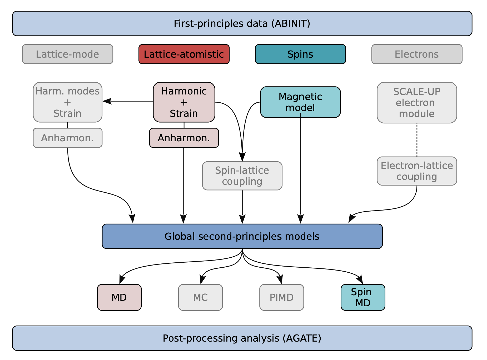

# First tutorial on MULTIBINIT
## Introduction to MULTIBINIT
Although extremely powerful, DFT calculations are still limited to relatively small systems and time-scales. The purpose of the MULTIBINIT project is to extend the capabilities of available first-principles codes in order to access the properties of mesoscale systems at operating conditions (i.e. at finite temperature and under external mechanical constraints or electric fields) in an automatic way and while retaining most of the first-principles predictive power and accuracy.

The current implementation of MULTIBINIT allow to take into account the lattice and spins degrees of freedom.

Depending on your interest, you can choose the following tutorials:

   *  [[lesson:lattice_model| Lattice model]]
   *  [[lesson:spin_model| Spin model]]
   

**Before beginning, it is very important to read the references [[cite:Wojdel2013]] [[cite: Evans2014]], [[cite: Eriksson2017]].**
