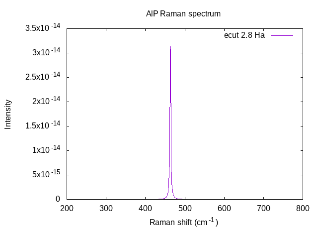

# Static non-linear properties

## Electronic non-linear susceptibility, non-resonant Raman tensor, electro-optic effect.

This tutorial shows how to obtain the following non-linear physical properties, for an insulator:

  * The non-linear optical susceptibilities
  * The Raman tensor of TO and LO modes
  * The electro-optic coefficients

We will study the compound AlP. During the preliminary steps needed to compute
non-linear properties, we will also obtain several linear response properties:

  * The Born effective charges
  * The dielectric constant
  * The proper piezoelectric tensor (clamped and relaxed ions)

Finally, we will also compute the derivative of the susceptibility tensor with
respect to atomic positions (Raman tensor), using finite differences.

The user should have already completed several advanced tutorials, including:
[Response-Function 1](/tutorial/rf1), [Response-Function 2](/tutorial/rf2),
[Polarization and Finite electric fields](/tutorial/polarization), and the
[Elastic properties](/tutorial/elastic).

This tutorial should take about 1 hour and 30 minutes.

[TUTORIAL_README]

## 1 Ground-state properties of AlP and general parameters

*Before beginning, you might consider working in a different subdirectory, as for the other tutorials.
For example, create Work_NLO in \$ABI_TESTS/tutorespfn/Input*.

In order to save some time, you might immediately start running a calculation.
Copy the file *tnlo_2.abi* from *\$ABI_TESTS/tutorespfn/Input* to *Work_NLO*.
Run `abinit` on this file; it will take several minutes on a desktop PC.

In this tutorial we will assume that the ground-state properties of AlP have
been previously obtained, and that the corresponding convergence studies have
been done. Let us emphasize that, from our experience, accurate and trustable
results for third order energy derivatives usually require a extremely high
level of convergence. So, even if it is not always very apparent here, careful
convergence studies must be explicitly performed in any practical study you
attempt after this tutorial. As usual, convergence tests must be done on
the property of interest (thus it is insufficient to determine parameters giving
proper convergence only on the total energy, and to use them blindly for non-linear
properties).

We will adopt the following set of generic parameters (quite similar to those
in the
[tutorial on Polarization and finite electric field](/tutorial/polarization)):
```
acell   3*7.1391127387E+00
rprim      0.0000000000E+00  7.0710678119E-01  7.0710678119E-01
           7.0710678119E-01  0.0000000000E+00  7.0710678119E-01
           7.0710678119E-01  7.0710678119E-01  0.0000000000E+00
ecut    2.8
ecutsm  0.5
dilatmx 1.05
nband   4 (=number of occupied bands)
ngkpt   6 6 6
nshiftk 4
shiftk  0.5 0.5 0.5
        0.5 0.0 0.0
        0.0 0.5 0.0
        0.0 0.0 0.5

pseudopotentials  Pseudodojo_nc_sr_04_pw_standard_psp8/P.psp8
                  Pseudodojo_nc_sr_04_pw_standard_psp8/Al.psp8
```

In principle, the [[acell]] to be used should be the one corresponding to the
optimized structure at the [[ecut]], and [[ngkpt]] combined with [[nshiftk]]
and [[shiftk]], chosen for the calculations. Unfortunately, for the purpose of
this tutorial, in order to limit the duration of the runs, we have to work at
an unusually low cutoff of 2.8 Ha for which the optimized lattice constant is
unrealistic and equal to 7.139 Bohr (instead of the converged value of 7.251).
In what follows, the lattice constant has been arbitrarily fixed to 7.139.
Bohr. For comparison, results with [[ecut]] = 5 and 30 are also reported and, in those
cases, were obtained at the optimized lattice constants of 7.273 and 7.251 Bohr. For those
who would like to try later, convergence tests and structural optimizations
can be done using the file *\$ABI_TESTS/tutorespfn/Input/tnlo_1.abi*.



Before going further, you might refresh your memory concerning the other variables:
[[ecutsm]], [[dilatmx]], and [[nbdbuf]].

## 2 Linear and non-linear responses from density functional perturbation theory (DFPT)

As a theoretical support to this section of the tutorial, you might consider
reading [[cite:Veithen2005]].

In the first part of this tutorial, we will describe how to compute various
linear and non-linear responses directly connected to second-order and third-
order derivatives of the energy, using DFPT. From the $(2n+1)$ theorem,
computation of energy derivatives up to third order only requires the
knowledge of the ground-state and first-order wavefunctions, see
[[cite:Gonze1989]] and [[cite:Gonze1995]].
Our study will therefore include the following steps : (i) computation of the
ground-state wavefunctions and density; (ii) determination of
wavefunctions derivatives and construction of the related databases for second and third-
order energy derivatives, (iii) combination of the different databases and
analysis to get the physical properties of interest.

These steps are closely related to what was done for the dielectric and dynamical
properties, except that an additional database for third-order energy
derivatives will now be computed during the run. Only selected third-order
derivatives are implemented at present in ABINIT, and concern responses to electric
field and atomic displacements:

  * non-linear optical susceptibilities
    (related to a third-order derivative of the energy
    with respect to electric fields at clamped nuclei positions)

  * Raman susceptibilities (mixed third-order derivative of the energy, twice with respect
    to electric fields at clamped nuclei positions, and once with respect to atomic displacement)

  * Electro-optic coefficients (related to a third-order derivative of the energy with respect to electric fields,
    two of them being optical fields, that is, for clamped ionic positions,  and one of them being a static field,
    for which the ionic positions are allowed to relax)

The various steps are combined into a single input file.

There are two implementations available in ABINIT for the computation of third-order derivatives which includes at least one electric field perturbation (so all tensors mentioned above).
First we will present the *PEAD* method, as described in [[cite:Veithen2005]],
 then we will present the *full DFPT* method, as described in [[cite:Gonze2020]] and [[cite:Romero2020]].
In the latter case, the input file is slightly modified so the reader interested in *full DFPT* should read the *PEAD* part first.
Only the *full DFPT* implementation is available for PAW pseudopotentials.

**Responses to electric fields, atomic displacements, and strains (with PEAD)**

Let us examine the file *tnlo_2.abi*. 



Its purpose is to build databases for
second and third energy derivatives with respect to electric fields, atomic
displacements, and strains. You can edit it. It is made of 5 datasets. The first four data
sets are nearly the same as for a typical linear response calculation: (1)
a self-consistent calculation of the ground state in the irreducible Brillouin Zone;
(2) non self-consistent calculation of the ground state
to get the wavefunctions over the full Brillouin Zone; (3) Computation of the derivatives of the
wavefunctions with respect to k points, using DFPT; (4)
second derivatives of the energy and related first-order wavefunctions
with respect to electric field, atomic displacements, and strains; and
finally (5) the third derivative calculations. Some
specific features must however be explicitly specified in order to prepare for the
non-linear response step (dataset 5). First, it is mandatory to specify:
```
nbdbuf  0
nband   4 (= number of valence bands)
```
so that only filled bands are treated.
Also, in dataset 4, it is required to impose [[prtden]], and [[prepanl]]
```
prtden4    1
prepanl4   1
```
The purpose for [[prtden]] is to obtain the first order densities (in
addition to the first order wavefunctions). The purposes
of [[prepanl]]  are (i) to constrain [[kptopt]] = 2 even in the
computation of phonons where ABINIT usually take advantages of symmetry
irrespective of kptopt and (ii) compute the electric field derivatives in the
3 directions of space, irrespective of the symmetry.

Note also that while the strain perturbation is not used in dataset 5, the information
it provides is necessary to obtain some of the relaxed ion properties that
will be examined later.

The input to dataset 5 trigger the various third-order derivatives to be
computed. This section includes the following:
```
   getwfk5    2
  get1den5    4
   get1wf5    4
   kptopt5    2
optdriver5    5
  d3e_pert1_elfd5    1
  d3e_pert1_phon5    1
 d3e_pert1_atpol5    1 2
  d3e_pert2_elfd5    1
  d3e_pert3_elfd5    1
```
The first three lines retrieve the ground state and first-order densities and wavefunctions.
[[optdriver]] 5 triggers the 3rd-order energy calculation. 

The `d3e` input
variables determine the 3 perturbations of the 3rd order derivatives, and their
directions. Notice that we compute three derivatives with respect to electric field:
[[d3e_pert1_elfd]], [[d3e_pert2_elfd]], and [[d3e_pert3_elfd]]. These will be combined
to give the necessary data for the nonlinear optical susceptibility. We also
include [[d3e_pert1_phon]], for both atoms in the unit cell (see [[d3e_pert1_atpol]], for which we stick to the default).  
When combined
later with the electric field perturbations 2 and 3, this will yield the necessary
information for the Raman tensor. Finally, for all three perturbation classes, we compute
the perturbations in all three spatial directions 
(see [[d3e_pert1_dir]], [[d3e_pert2_dir]] and [[d3e_pert3_dir]], for which we stick to the default).

If it was not done at the beginning of this tutorial, you can now make the
run. You can have a quick look to the output file to verify that everything is
OK. It contains the values of second and third energy derivatives. It has
however no immediate interest since the information is not presented in a very
convenient format. The relevant information is in fact also stored in the
database files (DDB) generated independently for second and third energy
derivatives at the end of run steps 4 and 5. Keep these databases, as they will be
used later for a global and convenient analysis of the results using ANADDB.

**Responses to electric fields, atomic displacements, and strains (with full DFPT)**

If not already done, the reader should read the part on the *PEAD* method.

Contrary to *PEAD*, with *full DFPT* the electric field is treated analytically,
the same way it is done for the computation of second-order derivatives of the energy (see [Response-Function 1](/tutorial/rf1)).
One needs first order wavefunctions derivatives with respect to k-points (dataset 3 of *tnlo_2.abi*).
to compute second order energy derivatives with an electric field perturbation (dataset 4 of *tnlo_2.abi*).
It turns out that third-order derivatives of the energy, in this context, needs *second* derivatives of wavefunctions with respect to electric fields and k-points.
To compute the latter one also needs *second* derivatives of wavefunctions with respect to k-points only, so in total we need two additional sets of wavefunctions derivatives.

Now you can compare the files *tnlo_2.abi* and *tnlo_6.abi*.



The first four datasets are identical, so we produce ground state quantities, first-order WF derivatives and second derivatives of the energy exactly the same way.
Before computing the non-linear terms, there are two additional datasets to compute the needed second-order WF derivatives, see dataset 5 and 6.
They are very similar to dataset 3 (computation of d/dk WF derivatives), except for the keywords activating second-order WF derivatives computation ([[rf2_dkdk]] and [[rf2_dkde]])
and the reading of the needed files:
```
rf2_dkdk5    1
  getddk5    3
 prepanl5    1
```
and
```
rf2_dkde6    1
  getddk6    3
 getdkdk6    5
 get1den6    4
getdelfd6    4
 prepanl6    1
```
The use of [[prepanl]] here makes use of crystal symmetries to compute only directions that will be needed for non-linear terms.
The latter are computed in dataset 7. Compared to *tnlo_2.abi*, it contains three additional lines:
```
getddk7     3
getdkde7    6
usepead7    0
```
The first two arguments specify which files to read to get d/dk and d/dkde WF derivatives.
[[usepead]] is the keyword controlling which implementation to use, which has to be 0 to use *full DFPT*.

If not already done, you can now run the code with *tnlo_6.abi*.
Even with a very small cutoff of 2.8 Ha, the non-linear susceptibility tensor differs only by few percents comparing *PEAD* and *full DFPT*,
and the first-order change in the electronic dielectric susceptibility tensor differs by less than one percent.
These differences come from convergence effects which can be reduced increasing the cutoff energy and most importantly the number of k-points.

!!! note
    With the same set of parameters, the *full DFPT* method takes obviously more CPU times than *PEAD*, 
    as we have to compute second-order WF derivatives.
    However, it is expected that the *full DFPT* method converges faster with the number of k-points,
    so one could actually save CPU time and memory using *full DFPT* to get a converged result.


As in the *PEAD* case, the code produced DDB files that can be used for the rest of this tutorial.

**Merge of the DDB.**

At this stage, using either the *PEAD* or *full DFPT* method, all the relevant energy derivatives have been obtained and are
stored in individual databases.
In the following we use the data produced with *PEAD*, but one can use *full DFPT* instead and compare.

The individual databases must be combined with the
[[help:mrgddb|MRGDDB]] merge
utility in order to get a complete database *tnlo_3.ddb.out*. Explicitly, you
should merge the files *tnlo_2o_DS4_DDB* and *tnlo_2o_DS5_DDB*.
An input file that can be piped into MRGDDB is provided as *tnlo_3.abi*. 


You
can use it to perform the merge via *\$ABI_HOME/src/98_main/mrgddb < tnlo_3.abi*.

**Analysis of the DDB.**

We are now ready for the analysis of the results using [[help:anaddb|ANADDB]]. You can copy
the files *\$ABI_TESTS/tutorespfn/Input/tnlo_4.abi* and
*\$ABI_TESTS/tutorespfn/Input/tnlo_4.files* to *Work-NLO*. 



You already used
ANADDB previously. It is located in the same directory as *abinit* and *mrgddb*.
You might copy it, or make an alias. The present input is in
very similar to the one you have used for the analysis of dynamical
and dielectric responses except that some new flags need to be activated.

For the strain perturbation you need to specify [[anaddb:elaflag]], [[anaddb:piezoflag]], and [[anaddb:instrflag]]:
```
  elaflag 3
piezoflag  3
instrflag  1
```
For the non-linear responses you need
```
 nlflag  1
ramansr 1
 alphon  1
 prtmbm  1
```
[[anaddb:nlflag]]=1 activates the non-linear response.

[[anaddb:ramansr]] = 1 will impose the sum rule on the first-order change of the
electronic dielectric susceptibility under atomic displacement, hereafter
referred to as $\frac{d \chi}{d \tau}$. It is a condition of invariance of $\chi$ under
translation of the whole crystal, similar to the acoustic sum rules for
phonons at Gamma or the charge neutrality sum rule on the effective charge $Z^*$.

[[anaddb:prtmbm]]=1 will allow to get the mode by mode phonon contributions of
the ions to the electro-optic coefficients.

[[anaddb:alphon]]=1 will allow to get the previous mode by mode contribution
when aligning the eigenvectors with the cartesian axis of coordinates (in the
input, the principal axis should always be aligned with z for a convenient
analysis of the results).

Finally, the second list of phonon, specified with [[anaddb:nph2l]] and
[[anaddb:qph2l]], must also be explicitly considered to obtain the Raman
efficiencies of longitudinal modes (in a way similar to the computation of
frequencies of longitudinal mode frequencies at Gamma):
```
# Wave vector list no. 2
#***********************
   nph2l  1
   qph2l  1.0 0.0 0.0 0.0
```
You can now run the code `anaddb` as
*\$ABI_HOME/src/98_main/anaddb < tnlo_4.files*.
The results are in the file tnlo_4.abo.
Various interesting physical properties are now directly accessible in this
output in meaningful units. You can go through the file and
identify the results mentioned below. Note that the order in which they are
given below is not the same than the order in which they appear in the
tnlo_4.abo. You will have to jump between different sections of tnlo_4.abo to find them.

For comparison, we report in parenthesis (...) the values obtained with ecut =
5, and for nonlinear responses in brackets [...] the results from [[cite:Veithen2005]].

  * Born effective charge of Al:
```
Z*_Al = 2.207969 (2.233928)
```
  * Optical phonon frequencies at Gamma :
```
w_TO (cm^-1) = 463.2713 (417.4934)
w_LO (cm^-1) = 534.6882 (493.4411)
```
  * Linear optical dielectric constant :
```
Electronic dielectric tensor = 6.12216718 (6.10643103)
```
  * Static dielectric constant :
```
Relaxed ion dielectric tensor = 8.15521897 (8.53019279)
```
Some other quantities, such as the piezoelectric coefficients, are related to the
strain response, and are more extensively discussed in the tutorial on the strain perturbation.

  * Proper piezoelectric coefficients :
```
clamped ion (C/m^2) = -0.58864089 (-0.58710170)
relaxed ion (C/m^2) =  0.26741085 ( 0.11459002)
```
Finally, different quantities are related to non-linear responses.

  * Nonlinear optical susceptibility :
They are directly provided in the output in pm/V. As you can see the value
computed here at ecut = 2.8 is far from the well converged result.
```
d_36 (pm/V)  = 8.934453 (10.174996) [21]
```
  * Electro-optic coefficients:
As we asked for mode by mode decomposition the output provides individual
contributions. We report below a summary of the results. They concern the
clamped r_63 coefficient.
```
Electronic EO constant (pm/V): -0.953493194  (-1.091488899)
Full Ionic EO constant (pm/V):  0.536131045  ( 0.662692165)
     Total EO constant (pm/V): -0.417362150  (-0.428796933)
```

  * Raman properties

The code directly report the Raman susceptibilities $\alpha$ for both transverse (TO)
and longitudinal (LO) optic modes at Gamma:
```
alpha(TO) = 0.004315217 (0.004379774)
alpha(LO) = 0.006863765 (0.007243040)
```

The basic quantity to derive the Raman susceptibilities are the $\partial\chi/\partial\tau$ that
are also reported separately:
```
d chi_23/d tau_1 (Bohr^-1, Al)  = -0.043617186 (-0.043054192)
```

In *cubic semiconductors* it is common to report the Raman polarizability of
optical phonon modes at Gamma by the following expression [[cite:Veithen2005]]:
$$
        a = \Omega_0 \partial\chi/\partial\tau = \sqrt{\mu \Omega_0}\alpha
$$
where $\Omega_0$ is the primitive unit cell volume (reported as `ucvol` in for
example *tnlo_2.abo*),
$\mu$ the reduced mass of
the system, so here $1/\mu = 1/m_{Al} + 1/m_{P}$, and $\alpha$ the Raman susceptibility
tensor. The Raman polarizability $a$ has units of length$^2$. Using alpha(TO) and
alpha(LO) from above, along with $\mu$ and $\Omega_0$, all in atomic units, and then
converting length (Bohr) to Angstroms, we find:
```
a(TO) (Unit: Ang^2)= 3.1424 (3.2794) [4.30]
a(LO) (Unit: Ang^2)= 4.9983 (5.4234) [7.46]
```
## 3 Finite difference calculation of the Raman tensor

For comparison with the DFPT calculation, we can compute $\frac{d \chi}{d \tau}$ for the Al
nucleus from finite differences. In practice, this is achieved by computing
the linear optical susceptibility for 3 different positions of the Al nucleus.
This is done with the file *\$ABI_TESTS/tutorespfn/Input/tnlo_5.abi*. 



This file
uses again the unrealistically low cutoff energy [[ecut]] of 2.8 Ha.
The calculation takes about 2 or 3 minutes on a standard desktop PC.
To run this calculation, copy
*\$ABI_TESTS/tutorespfn/Input/tnlo_5.abi* to your working directory and run
with `abinit`. If you have time,
modify the cutoff to [[ecut]] = 5 Ha, in order to obtain
more realistic results.  This run will take about twice as along as the
2.8 Ha version.

The input file *tnlo_5.abi* contains 12 datasets, arranged in a double loop.
```
ndtset 12
udtset 3 4
```
Input variable [[ndtset]] indicates 12 total sets, as usual, while
the [[udtset]] variable indicates an outer loop of 3 sets, and for each
of these, an inner loop of four sets.

The outer loop is over three sets of atomic positions, set by [[xcart]].
The first is the equilibrium, and the second two have aluminum shifted by
+0.01 and -0.01 Bohr along x:
```
# tau = 0.0 equilibrium
xcart1?    2.5240575146E+00  2.5240575146E+00  2.5240575146E+00
           0.0000000000E+00  0.0000000000E+00  0.0000000000E+00

# tau = 0.01: aluminum shifted along x by 0.01 Bohr
xcart2?    2.5240575146E+00  2.5240575146E+00  2.5240575146E+00
           0.0100000000E+00  0.0000000000E+00  0.0000000000E+00

# tau = -0.01: aluminum shifted along x by -0.01 Bohr
xcart3?    2.5240575146E+00  2.5240575146E+00  2.5240575146E+00
          -0.0100000000E+00  0.0000000000E+00  0.0000000000E+00
```
Then for each of three sets of positions, a standard four-set DFPT
calculation of the electric field response at clamped ion positions
is executed: (1) ground state wavefunctions in the irreducible Brillouin
zone; (2) ground state wavefunctions in the full Brillouin zone; (3)
response to change in k vectors; and (4) response to the electric field,
yielding the dielectric tensor.

After running the calculation, the following is available in the output
file *tnlo_5.abo*. Quoted here are the results at [[ecut]] of 2.8.

For tau = 0:
```
Dielectric tensor, in cartesian coordinates,
   j1       j2             matrix element
dir pert dir pert     real part    imaginary part

 1    4   1    4         6.1221671827        -0.0000000000
 1    4   2    4        -0.0000000000        -0.0000000000
 1    4   3    4        -0.0000000000        -0.0000000000

 2    4   1    4        -0.0000000000        -0.0000000000
 2    4   2    4         6.1221671827        -0.0000000000
 2    4   3    4        -0.0000000000        -0.0000000000

 3    4   1    4        -0.0000000000        -0.0000000000
 3    4   2    4        -0.0000000000        -0.0000000000
 3    4   3    4         6.1221671827        -0.0000000000
```
For tau = +0.01 :
```
Dielectric tensor, in cartesian coordinates,
   j1       j2             matrix element
dir pert dir pert     real part    imaginary part

 1    4   1    4         6.1223310904        -0.0000000000
 1    4   2    4        -0.0000000000        -0.0000000000
 1    4   3    4        -0.0000000000        -0.0000000000

 2    4   1    4        -0.0000000000        -0.0000000000
 2    4   2    4         6.1222249248        -0.0000000000
 2    4   3    4        -0.0055063835        -0.0000000000

 3    4   1    4        -0.0000000000        -0.0000000000
 3    4   2    4        -0.0055063835        -0.0000000000
 3    4   3    4         6.1222249248        -0.0000000000
```
For tau = -0.01 :
```
Dielectric tensor, in cartesian coordinates,
   j1       j2             matrix element
dir pert dir pert     real part    imaginary part

 1    4   1    4         6.1223310830        -0.0000000000
 1    4   2    4        -0.0000000000        -0.0000000000
 1    4   3    4        -0.0000000000        -0.0000000000

 2    4   1    4        -0.0000000000        -0.0000000000
 2    4   2    4         6.1222249159        -0.0000000000
 2    4   3    4         0.0055063810        -0.0000000000

 3    4   1    4        -0.0000000000        -0.0000000000
 3    4   2    4         0.0055063810        -0.0000000000
 3    4   3    4         6.1222249159        -0.0000000000
```
You can extract the value of dchi_23/dtau_1 for Al from the dielectric tensor
(hereafter called eps) above using the following finite-difference formula [unit of bohr^-1] :
```
dchi_23/dtau_1= (1/4 pi) (eps_23[tau=+0.01] - eps_23[tau=-0.01])/2*tau
              = (1/4 pi) (-0.0055063835 - 0.0055063810)/(0.02)
              = -0.0438184
```
This value is close to that obtained at [[ecut]]=2.8 from DFPT (-0.043617186).
When convergence is reached (beware, the k point convergence is extremely
slow, much slower than for other properties), both approaches yield the same result.
You might therefore ask which approach is the most convenient
and should be used in practice.

As a guide, we note that the finite-difference approach give results
very similar to the DFPT ones for a similar cutoff and k-point grid. It is
however more tedious because individual atomic displacement must be
successively considered (which becomes cumbersome for complex crystals)
and the results must then
be converted into appropriate units with risk of error of manipulations.

The DFPT approach is the most convenient and avoids considerable operator intervention.
Everything is reported together (not only $d\chi / d\tau$ but also the full Raman
polarizability tensors) and in appropriate units. It should therefore be
considered as the better choice.

## 4 Plotting the Raman Spectrum

The output of an ANADDB analysis, for example *tnlo_4.abo* as performed here, can be
used to plot a simulated Raman spectrum, including both peak positions and intensities,
which can be compared to experiment. Many details of the process are outlined in [[cite:Caracas2006]].

A post-processing script, written in Python, is available in the ABINIT package:
see *$ABI_HOME/scripts/post_processing/Raman_spec.py*. If you have not installed the whole ABINIT package, but only are using
compiled executables and the documentation on the web, you should make the extra effort of downloading the full package, as mentioned in the ABINIT install notes.

This program reads an input file
that sets the ANADDB file to read, the output file base name, and various processing
parameters. To continue, we suggest copying this script into your working directory, or making
a link to it.

Running *python Raman_spec.py --help* gives an outline of the input file format,
but don't be afraid to open and read the Raman_spec.py file itself for further details on the
file input.
As a start, here is a minimal input file to Raman_spec.py for the tnlo_4.abo run:
```
# filename from anaddb run that created raman tensors
filename tnlo_4.abo

# base name for Raman_spec.py output files
outname AlP.out

# temperature in Kelvin for spectrum (default is zero K)
temp 298.0

# number frequencies (default is 1000)
n_freq 400

# min and max frequencies 
# (default is 0.95 and 1.05 of bands found; default unit is cm^-1, user can instead specify Ha or Hz)
min_freq 200.0
max_freq 800.0

# Lorentzian broadening to apply
# (default is zero; default unit is cm^-1, user can instead specify Ha or Hz)
spread 1.0

# calculation type: 1 is powder
calctype 1
```
You can copy this into an editor and save as for example *AlP.input*. Then execute
```
python Raman_spec.py AlP.input
```
Once complete, examine the various output files produced, which will all be named starting with AlP.out. They are all human readable
ASCII files and well-documented. For example, to visualize the powder spectrum of the TO mode
predicted by your ANADDB run, plot the first two
columns of AlP.out_spec, which give the frequencies and intensities of the powder-averaged Raman spectrum.

The resulting powder-average spectra, plotted here with Gnuplot, is shown below. For the cubic structure calculated here,
the resulting spectra contains a single Raman TO mode corresponding to an XY polarization.



Finally, if one includes a calculation of the frequency-dependent dielectric tensor during the ANADDB calculation
(see [[anaddb:dieflag]]),
this program extracts that dielectric tensor and prints it to its own file.
