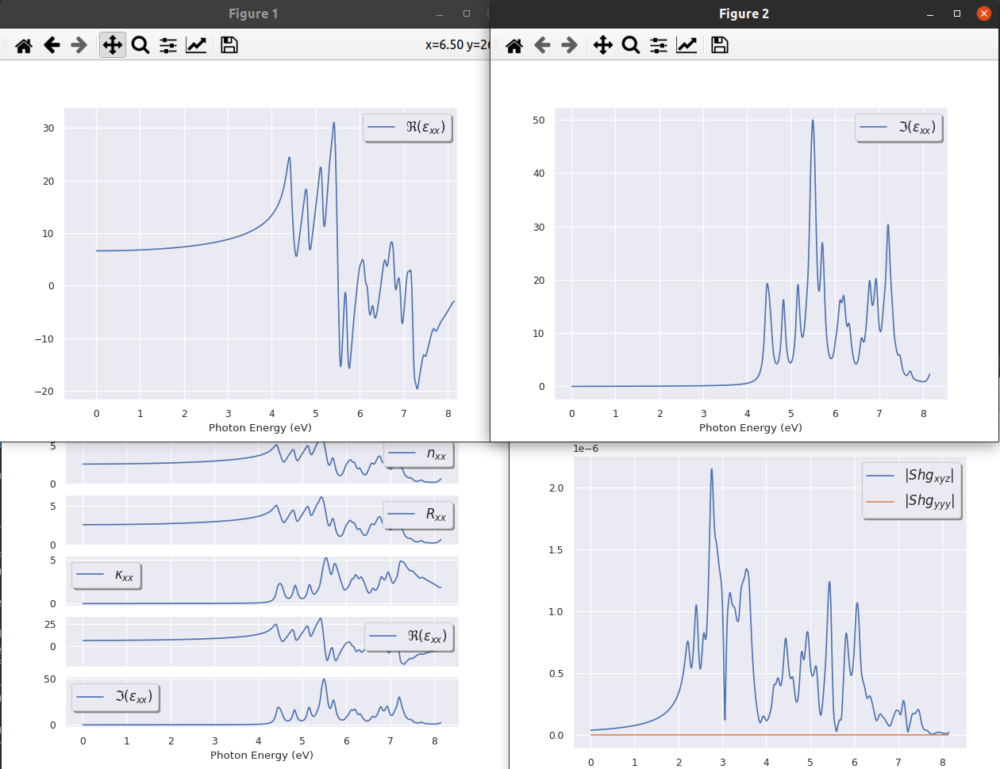

# Tutorial on optical properties  

## Frequency-dependent linear and second order nonlinear optical response.  

This tutorial aims at showing how to get the following physical properties, for semiconductors:

  * Frequency dependent linear dielectric tensor
  * Frequency dependent second order nonlinear susceptibility tensor

in the simple *Random-Phase Approximation* or *Sum-over-states* approach.
This tutorial will help you to understand and make use of *optic*.
Before starting, you should first have some theoretical background.
We strongly suggest that you first read the first two sections of the [[help:optic]].

This tutorial should take about 1 hour.

[TUTORIAL_README]

## Computing the momentum matrix elements

*Before beginning, you might consider working in a different subdirectory.
Why not create Work_optic?*

We also need to copy *toptic_1.files* and *toptic_1.in* from 
*$ABI_TESTS/tutorial/Input* to *Work_optic*.

```sh
cd $ABI_TESTS/tutorespfn/Input
mkdir Work_optic
cd Work_optic
cp ../toptic_1.files . 
cp ../toptic_1.in .
```

Now, you are ready to run Abinit and prepare the files needed for Optic.
Issue:

    abinit < toptic_1.files > log 2> err

We now examine the files.



The computation concerns a crystal of GaAs, in the zinc-blende structure (2 atoms per primitive cell).  
The *toptic_1.files* is a typical Abinit *files file* (nothing special).
By contrast, it is worthwhile to take some time to examine the input file *toptic_1.in*.
Examine it, it has six datasets.

The first dataset is a quite standard self-consistent determination of the ground state for a fixed geometry. Only the occupied bands are treated. The density is output and used in later datasets.

The second dataset is a non-self-consistent calculation, where the number of bands has been increased to include unoccupied states. The k points are restricted to the Irreducible Brillouin Zone.  

The third dataset uses the result of the second one to produce the
wavefunctions for all the bands, for the full Brillouin Zone
(this step could be skipped, but is included for later CPU time saving).  

The fourth, fifth, and sixth datasets correspond to the computation of the ddk matrix elements,
that is, matrix elements of the $\partial/\partial k$ operators. Note that the number of bands is the same as for datasets 2 and 3.
Note also that these are non-self-consistent calculations, moreover, restricted to [[nstep]] = 1 and [[nline]] = 0.
Indeed, only the matrix elements between explicitly computed states are required.
Using a larger nstep would lead to a full computation of the derivative of the wavefunction with respect to
the wavevector, while in Optic, only the matrix elements are needed.
Thus a value of [[nstep]] larger than one would not only lead to erroneous matrix elements, but would be a waste of time.

In order to have a sufficiently fast tutorial, the k point sampling was chosen to be extremely small.
Instead of a $4\times 4\times 4$
FCC lattice (256 k points), it should be something like $28\times 28\times 28$ FCC (about 100000 k points).
Also, the cut-off energy (2 Ha) is too small. As usual, convergence studies are the responsibility of the user.
Moreover, we emphasize that in general the results of a sum-over-states approach, as is used in Optic,
typically converges quite slowly with the k point mesh. Thus it is of extra importance to
test convergence carefully.

The run takes several minutes on a 2.8 GHz PC. The files *toptic_1o_DS3_WFK*,
*toptic_1o_DS4_1WF7*, *toptic_1o_DS5_1WF8* and *toptic_1o_DS6_1WF9* are the four
files requested for the Optic run.
The first file contains the wavefunctions for the filled and empty states in the entire
Brillouin zone, while the latter three contain the matrix elements of the
$\partial/\partial k$ operators, one file for each Cartesian direction.

Real preparation runs (with adequate k point sampling and cut-off energy) can
last several hours (or even days) on such a PC.

## Computing the linear and nonlinear optical response

The next step is to compute the linear and nonlinear optical response: once the
momentum matrix elements are available, you are ready to determine the optical
response (up to second order in the current implementation) for the material under study.

First, read the [[help:optic#input|section 3]] of the Optic help file.

Copy the files *toptic_2.files* and *toptic_2.in* from *$ABI_TESTS/tutorial/Input* to *Work_optic*:

```sh
cp ../toptic_2.files .
cp ../toptic_2.in .
```

The *toptic_2.in* is your input file. You should edit it and read it carefully. For
help on various input parameters in this file, please see the [[help:optic]].



When you have read the input file, you can run the code, as usual, using the
following command (assuming optic is in $PATH - copy the
executable in the current directory if needed):

    optic < toptic_2.files > log 2> err &

It will take a few seconds to run. You have produced numerous output files.
Now, you can examine some of these output files.

The headers contains information about the calculation.
See the [[help:optic#output|section 4]] of the Optic help file.
These files can be plotted in |xmgrace| or |gnuplot|.
If you do not have xmgrace installed on your computer, please get it from the Web, and install it,
or alternatively, use your preferred plotting package.

We will first have a look at the linear optic file.

    xmgrace toptic_2_0001_0001-linopt.out

This file contains the *xx* component of the dielectric tensor, and includes,
as a function of energy, the magnitude, real, and imaginary parts of the tensor element.
On the graph, you should see three curves. One of them is positive, and always
larger than the two others. It is the modulus of the dielectric function.
Another one is also always positive, it is the imaginary part of the
dielectric function. The last one is the real part.  
There are a large number of peaks. This is at variance with the experimental
spectra, which are much smoother. The origin of this discrepancy is to be found
in the very sparse k point sampling that we used in order to be able to perform
the tutorial quickly.
In the next section, we will improve this sampling, and start a convergence study.

Concerning the non-linear optics, the graphs for the *xyz* components are also
quite bad, with many isolated (but broadened) peaks. However, the *yyy* ones are
*perfect*. Indeed, they vanish due to symmetry reasons!
Visualize the imaginary part with:

    xmgrace toptic_2_0002_0002_0002-ChiTotIm.out

and the Real part with:

    xmgrace toptic_2_0002_0002_0002-ChiTotRe.out


!!! tip

    If |AbiPy| is installed on your machine, you can use the |abiopen| script
    with the `--expose` option to visualize the results stored in the OPTIC.nc file:

        abiopen.py toptic_2_OPTIC.nc --expose -sns=paper

    


This would be a good time to review [[help:optic#troubleshooting|section 5]] of the optic help file.

For comparison, we have included in the tutorial, three files that have been
obtained with a much better k point sampling (still with a low cut-off energy
and a number of bands that should be larger). You can visualize them as follows:

    xmgrace $ABI_HOME/doc/tutorial/optic_assets/toptic_ref_0001_0001-linopt.out

for the linear optics, obtained with a 28x28x28 grid (keeping everything else fixed), and

    xmgrace $ABI_HOME/doc/tutorial/optic_assets/toptic_ref_0001_0002_0003-ChiTotIm.out

as well as

    xmgrace $ABI_HOME/doc/tutorial/optic_assets/toptic_ref_0001_0002_0003-ChiTotRe.out

for the non-linear optics, obtained with a 18x18x18 grid (keeping everything else fixed).

Concerning the linear spectrum, we will now compare this (underconverged)
result *toptic_ref_0001_0001-linopt.out* with experimental data and converged
theoretical results.  

The book by Cohen M.L. and Chelikowsky [[cite:Cohen1988]] presents a
comparison of experimental data with the empirical pseudopotential method
spectrum. If you do not have access to this book, you can see an experimental
spectrum in [[cite:Philipp1963]],
and a theoretical spectrum in [[cite:Huang1993]], as well as other sources.

We discuss first the imaginary spectrum. Prominent experimental features of
this spectrum are two peaks located close to 3 eV and 5 eV, both with the same
approximate height. The spectrum is zero below about 1.5 eV (the direct band
gap), and decreases with some wiggles beyond 5.5 eV. Converged theoretical
spectra also show two peaks at about the same location, although their heights
are markedly different: about 10 for the first one (at 3 eV), and 25 for the
second one (at 5 eV). Other features are rather similar to the experimental
ones. In the linear optic spectrum of *toptic_ref_0001_0001-linopt.out*, we note
that there is a shoulder at around 3 eV, and a peak at 4.2 eV, with respective
approximate heights of 7 and 25. Some comments are in order:

  * The main difference between experimental and converged theoretical spectra is due
    to the presence of excitons (electron-hole bound states), not treated at all in
    this rather elementary theoretical approach: excitons transfer some oscillator strength
    from the second peak (at 5 eV) to the first one (at 3 eV). Going beyond the Sum-Over-State approach,
    but still keeping the independent-electron approximation, e.g., in the framework of the TDDFT (adiabatic LDA)
    will not correct this problem. One needs to use the Bethe-Salpeter approximation, or to rely on
    *fancy* exchange-correlation kernels, to produce an optical spectrum in qualitative agreement with the experimental data.
    Still, trends should be correct (e.g. change of the peak positions with pressure,
    comparison between different semiconductors, etc.).

  * In many early theoretical spectra (including the ones in [[cite:Cohen1988]]),
    the agreement between the theoretical and experimental band gap is artificially good.
    In straight DFT, one cannot avoid the band gap problem. However, it is possible to
    add an artificial "scissor shift", to make the theoretical band gap match the experimental one.

  * Our theoretical spectrum presents additional deficiencies with respect to the other ones,
    mostly due to a still too coarse sampling of the k space (there are too many wiggles in the spectrum),
    and to a rather inaccurate band structure (the cut-off energy was really very low, so that
    the first peak only appears as a shoulder to the second peak).

The real part of the spectrum is related by the Kramers-Kronig relation to the imaginary part.
We note that the deficiencies of the imaginary part of the
spectrum translate to the real part: the first peak is too low, and the
second peak too high, while the spectrum correctly changes sign around 5 eV,
and stays negative below 8 eV.

In our simulation, more empty states are needed
to obtain a better behaviour. Also, the limiting low-frequency value is only
4.3, while it should be on the order of 10. This can be corrected by
increasing the cut-off energy, the k point sampling and the number of unoccupied states.

Similar considerations apply to the non-linear spectra.

## Faster computation of the imaginary part of the linear optical response

In the case of the imaginary part of the linear optical response, there are
several points that make the calculation easier:

  * The time-reversal symmetry can be used to decrease the number of k points
    by a factor of two (this is also true for the computation of the real spectrum);

  * The number of unoccupied bands can be reduced to the strict minimum needed
    to span the target range of frequencies.

We will focus on the energy range from 0 eV to 8 eV, for which only 5 unoccupied bands are needed.

Copy the files *toptic_3.files* and *toptic_3.in* in *Work_optic*:

    cp ../toptic_3.files .
    cp ../toptic_3.in .



Issue:

    abinit < toptic_3.files > log 2> err &

Now, examine the file *toptic_3.in*. There are two important changes with respect to the file *toptic_1.in*:

  * the number of unoccupied bands has been reduced, so that the total number of bands is 9 instead of 20
  * when applicable, the value of [[kptopt]] 3 in our previous simulation has been changed to 2,
    in order to take advantage of the time-reversal symmetry

When the run is finished (it is only 8 secs on a 2.8 GHz PC), you can process
the WFK files and obtain the linear optic spectra.
Copy the files *toptic_4.files* and *toptic_4.in* in *Work_optic*:

    cp ../toptic_4.files .
    cp ../toptic_4.in .



Examine the *toptic_4.in* file: only the linear optic spectra will be built.

When you have read the input file, you can run the code, as usual using the following command

    optic < toptic_4.files > log 2> err &

Then, you can visualize the files *toptic_2_0001_0001-linopt.out* and
*toptic_4_0001_0001-linopt.out* using xmgrace and compare them. The spectra
looks completely identical. However, a careful look at these files, by editing
them, show that indeed, the imaginary part is very similar:

     # Energy(eV)         Im(eps(w))
     #calculated the component:  1  1  of dielectric function
     #broadening:    0.000000E+00    2.000000E-03
     #scissors shift:    0.000000E+00
     #energy window:    3.982501E+01eV    1.463542E+00Ha
        8.163415E-03    7.204722E-04
        1.632683E-02    1.441005E-03
        2.449025E-02    2.161659E-03
        3.265366E-02    2.882494E-03
     ....

But the real parts differ slightly (this is seen at lines 1007 and beyond):

     # Energy(eV)         Re(eps(w))
        8.163415E-03    1.186677E+01
        1.632683E-02    1.186693E+01
        2.449025E-02    1.186720E+01
        3.265366E-02    1.186758E+01
      ...

for *toptic_2_0001_0001-linopt.out* and

     # Energy(eV)         Re(eps(w))
        8.163415E-03    1.177773E+01
        1.632683E-02    1.177789E+01
        2.449025E-02    1.177816E+01
        3.265366E-02    1.177854E+01
      ...

for *toptic_4_0001_0001-linopt.out*. 
This small difference is due to the number
of bands ([[nband]] 20 for *toptic_2_0001_0001-linopt.out* and [[nband]] 9 for *toptic_4_0001_0001-linopt.out*).

Then, you can increase the number of k points, and watch the change in the
imaginary part of the spectrum. There will be more and more peaks, until they
merge, and start to form a smooth profile (still not completely smooth even with $28\times 28\times 28$).
For your information, we give some timings of the corresponding Abinit run for a 2.8 GHz PC:

    k-point grid     CPU time
    4 x 4 x 4            8 secs
    6 x 6 x 6            20 secs
    8 x 8 x 8            43 secs
    10 x 10 x 10         80 secs
    12 x 12 x 12         138 secs
    16 x 16 x 16         338 secs
    20 x 20 x 20         702 secs
    24 x 24 x 24         1335 secs
    28 x 28 x 28         2633 secs

For grids on the order of $16\times 16\times 16$, the treatment by optics also takes several
minutes, due to IO (30 minutes for the $28\times 28\times 28$ grid).  
You might note how the first peak slowly develop with increasing number of k
points but nevertheless stays much smaller than the converged one, and
even smaller than the experimental one.
