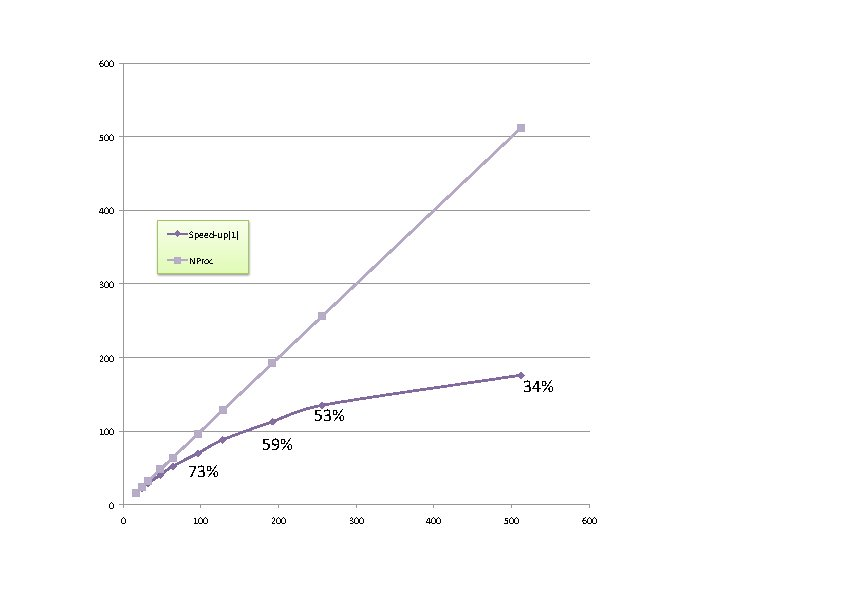

# Parallelism in the DFPT formalism

## Atomic displacements, homogeneous electric fields, strain.

This tutorial aims at showing how to use the parallelism for all the properties
that are computed on the basis of the density-functional perturbation theory
(DFPT) part of ABINIT, i.e.:

  * responses to atomic displacements (to compute phonon frequencies, band structures, ... )
  * responses to homogeneous electric fields (dielectric constant, Born effective charges, Infra-red characteristics )
  * responses to strain (elastic constants, piezoelectric constants ...)

Such computations are realized when one of the input variables [[rfphon]],
[[rfelfd]] or [[rfstrs]] are non-zero, which activates [[optdriver]]=1.
You are supposed to be well-familiarized with such calculations before starting
the present tutorial. See the input variables described in [[varset:dfpt]] and
the tutorial [Response-Function 1](rf1) and subsequent tutorials.

You will learn about the basic implementation of parallelism for DFPT
calculations, then will execute a very simple, quick calculation for one
dynamical matrix for FCC aluminum, whose scaling is limited to a few dozen
computing cores, then you will execute a calculation whose scaling is much
better, but that would take a few hours in sequential, using a provided input file.

For the last section of that part, you would be better off having access
to more than 100 computing cores, although you might also change the input
parameters to adjust to the machine you have at hand. For the other parts of
the tutorial, a 16-computing-core machine is recommended, in order to perform
the scalability measurements.

You are supposed to know already some basics of parallelism in ABINIT,
explained in the tutorial [A first introduction to ABINIT in parallel](basepar).

This tutorial should take less than two hours to be done if a powerful parallel
computer is available.

[TUTORIAL_READMEV9]

## 1 The structure of the parallelism for the DFPT part of ABINIT

**1.1.** Let us recall first the basic structure of typical DFPT calculations summarized in box 1.


The step 1 is done in a preliminary ground-state calculation (either by an
independent run, or by computing them using an earlier dataset before the DFPT calculation).
The parallelisation of this step is examined in a separate tutorial.

The step 2 and step 3 are the time-consuming DFPT steps, to which the present
tutorial is dedicated, and for which the implementation of the parallelism
will be explained. They generate different files, and in particular, one (or several) DDB file(s).
As explained in related tutorials (see e.g.
[Response-Function 1](rf1)), several perturbations are usually treated in
one dataset (hence the "Do for each perturbation"-loop in step 2 of this
Schema). For example, in one dataset, although one considers only one phonon
wavevector, all the primitive atomic displacements for this wavevector (as
determined by the symmetries) can be treated in turn.

The step 4 refers to MRGDDB and ANADDB post-processing of the DDB generated by
steps 2 and 3. These are not time-consuming sections. No parallelism is needed.

**1.2.** The equations to be considered for the computation of the first-order
wavefunctions and potentials (step 2 of box 1), which is the really time-consuming part
of any DFPT calculation, are presented in box 2.


The parallelism currently implemented for the DFPT part of ABINIT is based on
the parallel distribution of the most important arrays: the set of first-order
and ground-state wavefunctions.
While each such wavefunction is stored completely in the memory linked to one
computing core (there is no splitting of different parts of one wavefunction
between different computing cores - neither in real space nor in reciprocal
space), different such wavefunctions might be distributed over different
computing cores. This easily achieves a combined k point, spin and band index
parallelism, as explained in box 3.


**1.3.** The parallelism over k points, band index and spin for the set of
wavefunctions is implemented in all relevant steps, except for the reading
(initialisation) of the ground-state wavefunctions (from an external file).
Thus, the most CPU time-consuming parts of the DFPT computations are parallelized.
The following are not parallelized:

  * input of the set of ground-state wavefunctions
  * computing the first-order change of potential from the first-order density,
    and similar operations that do not depend on the bands or k points.

In the case of small systems, the maximum achievable speed-up will be limited
by the input of the set of ground-state wavefunctions. For medium to large
systems, the maximum achievable speed-up will be determined by the operations
that do not depend on the k point and band indices.
Finally, the distribution of the set of ground-state wavefunctions to the
computing cores that need them is partly parallelized, as no parallelism over
bands can be exploited.

*Before continuing you might work in a different subdirectory as for the other
tutorials. Why not work_paral_dfpt?*

All the input files can be found in the *\$ABI_TESTS/tutoparal/Input* directory.
You might have to adapt them to the path of the directory in which you have decided to perform your runs.
You can compare your results with reference output files located in *\$ABI_TESTS/tutoparal/Refs*.

In the following, when "(mpirun ...) abinit" appears, you have to use a
specific command line according to the operating system and architecture of
the computer you are using. This can be for instance: mpirun -np 16 abinit

## 2 Computation of one dynamical matrix (q =0.25 -0.125 0.125) for FCC aluminum

We start by treating the case of a small systems, namely FCC aluminum, for
which there is only one atom per unit cell. Of course, many k points are needed.

**2.1.** The first step is the pre-computation of the ground state
wavefunctions. This is driven by the files *tdfpt_01.files* (and *tdfpt_01.in*).
You should edit them and examine them.



One relies on a k-point grid of 8x8x8 x 4 shifts (=2048 k points), and 5 bands.
For this ground-state calculation, symmetries can be used to reduce
drastically the number of k points: there are 60 k points in the irreducible
Brillouin zone (this cannot be deduced from the examination of the input file, though).
This calculation is very fast, actually.
You can launch it:

    mpirun -n 4  abinit < tdfpt_01.files > tdfpt_01.log &

A reference output file is available in *\$ABI_TESTS/tutoparal/Refs*, under
the name *tdfpt_01.out*. It was obtained using 4 computing cores, and took a few seconds.

**2.2.** The second step is the DFPT calculation, for which the files are
*tdfpt_02.files* (and *tdfpt_02.in*).



There are three perturbations (three atomic displacements). For the two first
perturbations, no symmetry can be used, while for the third, two symmetries
can be used to reduce the number of k points to 1024. Hence, for the perfectly
scalable sections of the code, the maximum speed up is 5120 (=1024 k points *
5 bands), if you have access to 5120 computing cores. However, the sequential
parts of the code dominate at a much, much lower value. Indeed, the sequential
parts is actually a few percents of the code on one processor, depending on
the machine you run. The speed-up might saturate beyond 4 and 8 (depending on
the machine).

First copy the output of the ground-state calculation so that it can be used
as the input of the DFPT calculation:

    cp tdfpt_01.o_WFK tdfpt_02.i_WFK
    cp tdfpt_01.o_WFK tdfpt_02.i_WFQ

Then, you can launch the calculation:

    mpirun -n 4 abinit < tdfpt_02.files > tdfpt_02.log &

A reference output file is given in *\$ABI_TESTS/tutoparal/Refs*, under the name
*tdfpt_02.out*. Edit it, and examine some information.
The calculation has been made with four computing cores:

```
-   nproc =    4
```

The wall clock time is less than 50 seconds :

```
-
- Proc.   0 individual time (sec): cpu=         48.5  wall=         48.5

================================================================================

 Calculation completed.
.Delivered    0 WARNINGs and   3 COMMENTs to log file.
+Overall time at end (sec) : cpu=        194.1  wall=        194.1
```

The major result is the phonon frequencies:

      Phonon wavevector (reduced coordinates) :  0.25000 -0.12500  0.12500
     Phonon energies in Hartree :
       6.944980E-04  7.756637E-04  1.145943E-03
     Phonon energies in meV     :
    -  1.889825E+01  2.110688E+01  3.118270E+01
     Phonon frequencies in cm-1    :
    -  1.524247E+02  1.702385E+02  2.515054E+02
     Phonon frequencies in Thz     :
    -  4.569578E+00  5.103622E+00  7.539943E+00
     Phonon energies in Kelvin  :
    -  2.193049E+02  2.449349E+02  3.618597E+02

**2.3.** Because this test case is quite fast, you should play a bit with it.
In particular, run it several times, with an increasing number of computing
cores (let's say, up to 32 computing cores, at which stage you should have
obtained a saturation of the speed-up).
You should be able to obtain the following.

1. The result is independent (to an exquisite accuracy) of the number of computing cores that is used
2. The timing section reveals that the reading of the ground-state wavefunction file is the limiting step for the parallelisation

Concerning the latter, you will need to understand, in the output file, the
timing section. It is present a bit before the end of the output file:

    -
    - For major independent code sections, cpu and wall times (sec),
    -  as well as % of the time and number of calls for node 0-
    - routine                        cpu     %       wall     %      number of calls
    - fourwf(pot)                   19.834  10.2     19.794  10.2         187989
    - inwffil                        7.387   3.8      7.390   3.8             10
    - fourwf(G->r)                   6.721   3.5      6.869   3.5         116049
    - cgwf3-O(npw)                   2.226   1.1      2.228   1.1             -1
    - vtorho3-kpt loop               2.181   1.1      2.163   1.1             33
    - nonlop(forces)                 1.924   1.0      1.947   1.0          90880
    - projbd                         1.775   0.9      1.734   0.9         318634
    - nonlop(apply)                  1.690   0.9      1.719   0.9         116309
    - vtowfk3(contrib)               1.654   0.9      1.556   0.8             -1
    - 61   others                    2.819   1.5      2.803   1.4
    -
    - subtotal                      48.211  24.8     48.203  24.8

    - For major independent code sections, cpu and wall times (sec),
    - as well as % of the total time and number of calls

    - routine                         cpu     %       wall     %      number of calls
    -                                                                  (-1=no count)
    - fourwf(pot)                   79.067  40.7     79.326  40.9         752230
    - inwffil                       29.548  15.2     29.560  15.2             40
    - fourwf(G->r)                  25.828  13.3     25.898  13.3         447552
    - cgwf3-O(npw)                   9.096   4.7      9.081   4.7             -4
    - vtorho3-kpt loop               8.672   4.5      8.611   4.4            132
    - nonlop(forces)                 7.707   4.0      7.716   4.0         363520
    - projbd                         6.925   3.6      6.668   3.4        1275084
    - nonlop(apply)                  6.810   3.5      6.864   3.5         465510
    - vtowfk3(contrib)               6.280   3.2      6.199   3.2             -4
    - getghc-other                   3.176   1.6      3.195   1.6             -4
    - status                         2.615   1.3      2.534   1.3         919162
    - vtorho3:synchro                2.029   1.0      2.040   1.1            132
    - 58   others                    4.175   2.2      4.217   2.2

    - subtotal                     191.928  98.9    191.909  98.9

It is made of two groups of data. The first one corresponds to the analysis of
the timing for the computing core (node) number 0. The second one is the sum
over all computing cores of the data of the first group. Note that there is a
factor of four between these two groups, reflecting that the load balance is good.

Let's examine the second group of data in more detail. It corresponds to a
decomposition of the most time-consuming parts of the code. Note that the
subtotal is 98.9 percent, thus the statistics is quite good. Without going
into the detail of each routine, for the present purpose, the most significant
information is that among all the timed sections of the code, only "inwffil"
and "vtorho3:synchro" will not benefit from parallelism.
"inwffil" is a subroutine whose job is to read the ground-state wavefunctions
(you can find the source of the "inwffil" routine on [GitHub](https://github.com/abinit/abinit/tree/master/src/79_seqpar_mpi) or
[on the ABINIT Web site](https://www.abinit.org/sites/default/files/robodoc-html/masterindex.html)).

As mentioned in the section 1, the reading of the ground-state wavefunctions is not done in parallel in the case
of the DFPT computations (note that the reading is actually parallelized for
e.g. ground-state calculations). In the output file provided as a reference
(with four computing cores), the "inwffil" wall clock time is 7.387 seconds,
on a total of 48.211 secs. By increasing the number of computing cores, it
will be possible to decrease the total time, but not below the value of 7.387
seconds in any case. You should observe a similar behaviour with your own tests.

## 3 Computation of one perturbation for a slab of 29 atoms of barium titanate

**3.1.** This test, with 29 atoms, is slower, but scales better than the Al
FCC case. It consists in the computation of one perturbation at qpt 0.0 0.25
0.0 for a 29 atom slab of barium titanate, artificially terminated by a double
TiO2 layer on each face, with a reasonable k-point sampling of the Brillouin zone.

The symmetry of the system and perturbation will allow to decrease this
sampling to one quarter of the Brillouin zone. E.g. with the k-point sampling
ngkpt 4 4 1, there will be actually 4 k-points in the irreducible Brillouin
zone for the Ground state calculations. For the DFPT case, only one symmetry
will survive, so that, after the calculation of the frozen-wavefunction part
(for which no symmetry is used), the self-consistent part will be done with 8
k points in the corresponding irreducible Brillouin zone. With the sampling 8
8 1, there will be 32 k points in the irreducible Brillouin zone for the DFPT
case. There are 120 bands. Note that the value of [[ecut]] that is used in the
present tutorial is too low to obtain physical results (it should be around 40 Hartree).

As in the previous case, a preparatory ground-state calculation is needed.

The input files are provided, in the directory *\$ABI_TESTS/tutoparal/Input*.
The preparatory step is governed by *tdfpt_03.files* (and *tdfpt_03.in*). The real
(=DFPT) test case is governed by *tdfpt_04.files* (and *tdfpt_04.in*). The
reference output files are present in *\$ABI_TESTS/tutoparal/Refs*:
*tdfpt_0324.out* and *tdfpt_0432.out*. The naming convention is such that the
number of cores used to run them is added after the name of the test: the
*tdfpt_03.in* file was run with 24 cores, while the *tdfpt_04.in* was run with 32
cores. The preparatory step took about 5 minutes, and the DFPT step took about
5 minutes as well.



You can run now these test cases. For tdfpt_03, you might
need to change the [[npband]] value (presently 6), if you are not using 24
processors. At variance, for tdfpt_04, no adaptation of the input file is
needed to be able to run on an arbitrary number of processors.
To launch the ground-state computation, type:

    mpirun -n 24 abinit < tdfpt_03.files > tdfpt_03.log &

then copy the output of the ground-state calculation so that it can be used as
the input of the DFPT calculation:

    cp tdfpt_03.o_WFK tdfpt_04.i_WFK
    cp tdfpt_03.o_WFK tdfpt_04.i_WFQ

and launch the calculation:

    mpirun -n 24 abinit < tdfpt_04.files > tdfpt_04.log &

Now, examine the obtained output file for test 04, especially the timing.

In the reference file *\$ABI_TESTS/tutoparal/Refs/tdfpt_0432.out*,
with 32 computing cores, the timing section delivers:

    - For major independent code sections, cpu and wall times (sec),
    - as well as % of the total time and number of calls

    - routine                         cpu     %       wall     %      number of calls
    -                                                                  (-1=no count)
    - projbd                      3046.599  34.0   3065.259  34.0         171639
    - fourwf%(pot)                2545.342  28.4   2561.313  28.4         103098
    - nonlop(apply)               1059.279  11.8   1066.034  11.8          85818
    - fourwf%(G->r)                531.322   5.9    534.929   5.9          50112
    - vtorho3:synchro              444.450   5.0    448.598   5.0            576
    - nonlop(forces)               195.017   2.2    195.487   2.2         100800
    - newkpt(excl. rwwf   )        179.142   2.0    179.185   2.0            -32
    - vtowfk3(contrib)             137.486   1.5    137.878   1.5            -32
    - pspini                        97.276   1.1     99.901   1.1             32

    <...>

    - 45   others                    0.000   0.0      0.000   0.0

    - subtotal                    8760.405  97.8   8811.874  97.8

You will notice that the sum of the major independent code sections is again
very close to 100%. You might now explore the behaviour of the CPU time for
different numbers of compute cores (consider values below and above 32
processors). Some time-consuming routines will benefit from the parallelism, some other will not.

The kpoint + band parallelism will efficiently work for many important sections
of the code: projbd, fourwf%(pot), nonlop(apply), fourwf%(G->r).
In this test, the product nkpt (the effective number of k points for the current
perturbation) times nband is 8*120=960. Of course, the total speed-up will
saturate well below this value, as there are some non-parallelized sections of the code.

In the above-mentioned list, the kpoint+band parallelism cannot be exploited
(or is badly exploited) in several sections of the code : "vtorho3:synchro",
about 5 percents of the total time of the run on 32 processors, "newkpt(excl.rwwf)",
about 2 percents, vtowfk3(contrib), about 1.5 percent, "pspini", about
1 percent. This amounts to about 10% of the total, and, according to Amdahl's
law, the saturation will happen soon, with less than 100 processors.

**3.2.** A better parallelism can be seen if the number of k-points is brought
back to a converged value (8x8x1).
Try this if you have more than 100 processors at hand.

Set in your input file *tdfpt_03.in*:

       ngkpt 8 8 1    ! This should replace ngkpt 4 4 1
       npkpt 16       ! This should replace npkpt 4

Also, set in *tdfpt_04.in*:

       ngkpt 8 8 1    ! This should replace ngkpt 4 4 1

and launch again the preliminary step, then the DFPT step. Then, you can
practice the DFPT calculation by varying the number of computing cores. For
the latter, you could even consider varying the number of self-consistent
iterations to see the initialisation effects (small value of nstep), or target
a value giving converged results (nstep 50 instead of nstep 18). The energy
cut-off might also be increased (e.g. ecut 40 Hartree gives a much better
value). Indeed, with a large value of k points, and large value of nstep, you
should be able to obtain a speed-up of more than one hundred for the DFPT
calculation, when compared to a sequential run (see below). Keep track of the
time for each computing core number, to observe the scaling.

As a typical observation, the Wall clock timing decreases from

    - Proc.   0 individual time (sec): cpu=       2977.3  wall=       2977.3

with 16 processors to

    - Proc.   0 individual time (sec): cpu=        513.2  wall=        513.2

with 128 processors.

The next figure presents the speed-up of a typical calculation with increasing
number of computing cores (also, the efficiency of the calculation).



Beyond 300 computing cores, the sequential parts of the code start to dominate.
With more realistic computing parameters (ecut 40), they dominate only beyond 600 processors.

This last example is the end of the present tutorial. You have been explained
the basics of the current implementation of the parallelism for the DFPT part
of ABINIT, then you have explored two test cases: one for a small cell
materials, with lots of k points, and another one, medium-size, in which the k
point and band parallelism can be used efficiently even for more than one hundred computing cores.
