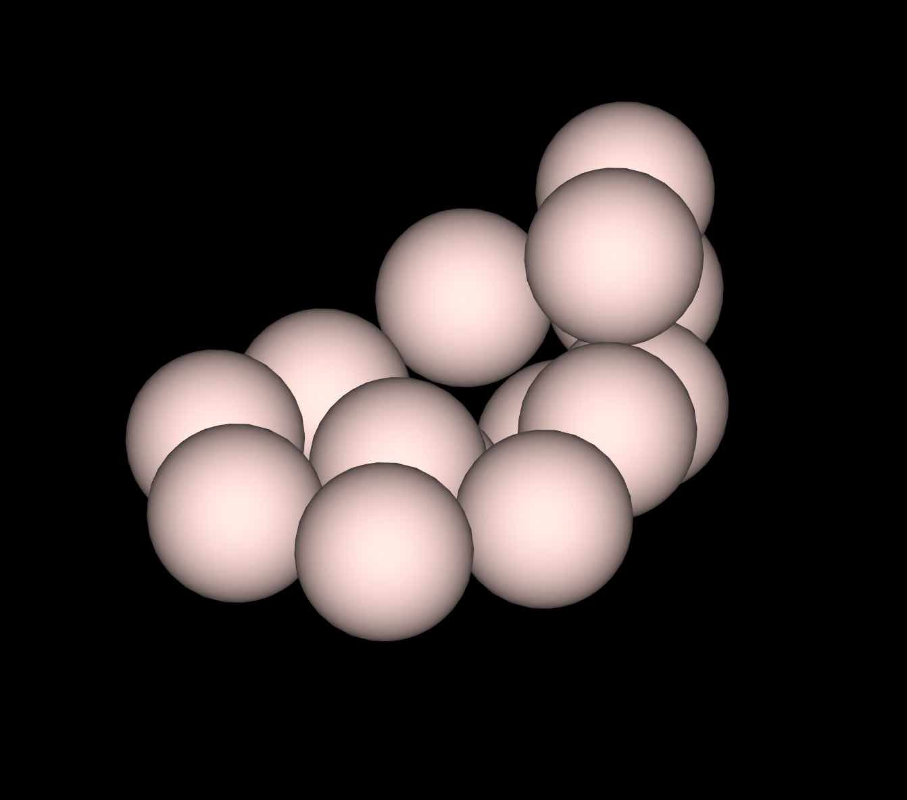

# Parallelism for the ground state using wavelets

## Boron cluster, alkane molecule...

This tutorial explains how to run the calculation of an isolated system using a
wavelet basis-set on a parallel computer using MPI. You will learn the
different characteristics of a parallel run using the wavelet basis-set and
test the speed-up on a small **boron cluster of 14 atoms** followed by a test on a
bigger **alkane molecule**.

This tutorial should take about 90 minutes and requires you have several CPU
cores (up to 64 if possible).

You are supposed to know already some basics of parallelism in ABINIT,
explained in the tutorial [A first introduction to ABINIT in parallel](/tutorial/basepar).  

The tutorial will be more profitable if you have already performed calculations
using the wavelet formalism (see the [[topic:Wavelets|topic page on wavelets]]
and the [[usewvl]] keyword).

!!! Important
       To use a wavelet basis set `ABINIT` should have been compiled with the `bigdft` library.
       To do this, download the [bigdft fallback](https://www.abinit.org/fallbacks) and use
       the `--with-bigdft`, `BIGDFT_LIBS`, `BIGDFT_FCFLAGS`, etc. flags during the
       `configure` step.
 
[TUTORIAL_README]

## 1 Wavelets variables and parallelism

The parallelism with the wavelet formalism can be used for two purposes: to
**reduce the memory** load per node, or to reduce the overall **computation time**.

The MPI parallelization in the wavelet mode relies on the **orbital distribution**
scheme, in which the orbitals of the system under investigation are
distributed over the assigned MPI processes. This scheme reaches its limit
when the number of MPI processes is equal to the number of orbitals in the
simulation. To distribute the orbitals uniformly, the number of processors
must be a factor (divisor) of the number of orbitals. If this is not the case,
the distribution is not optimal, but the code tries to balance the load over
the processors. For example, if we have 5 orbitals and 4 processors, the
orbitals will have the distribution: `2/1/1/1`.

There are no specific input variables to use the parallelism in the wavelet
mode as the only parallelisation level is on orbitals. So running ABINIT with
an `mpirun` command is enough (this command differs according to the local MPI
implementation) such as:

       mpirun -n Nproc abinit < infile.abi >& logfile

For further understanding of the wavelet mode, or for citation purposes, one
may read [[cite:Genovese2008]]

## 2 Speed-up calculation for a boron cluster

We propose here to determine the speed-up in the calculation of the total
energy of a cluster made of 14 boron atoms.

{width=30%}

Open the file `tgswvl_1.abi`. It
contains first the definition of the wavelet basis-set. One may want to test
the precision of the calculation by varying the [[wvl_hgrid]] and
[[wvl_crmult]] variables. This is not the purpose of this tutorial, so we will
use the given values (0.45 Bohr and 5).



Run ABINIT with 3 processors. The overall time is printed at the end of the
output file (and of the log):

    Proc.   0 individual time (sec): cpu=         36.0  wall=         36.0

Read the output file to find the number of orbitals in the calculation (given
by the keyword [[nband]]). With the distribution scheme of the wavelet mode,
the best distribution over processors will be obtained for, 1, 3, 7 and 21
processors. Create four different directories (with the number of processors
for instance) and run four times ABINIT with the same input file, varying the
number of processors in {1, 3, 7, 21}.

    abinit tgswvl_1.abi >& log

The speed-up is the ratio between the time with one processor and the
time of a run with N processors.

Assuming that the directories are called {01, 03, 07, 21}, one can grep the
over-all time of a run and plot it with the [gnuplot](http://www.gnuplot.info) graphical tool.  
Just issue:

    gnuplot

and, in `gnuplot` command line, type:

    plot "< grep 'individual time' */*.abo | tr '/' ' '" u 1:(ttt/$11) w lp t "Boron cluster", x t "Ideal speed-up"

where `ttt` represents the time on one processor (replace `ttt` by this time in the
command line above).  

{width=50%}

The efficiency (in percent) of the parallelization process is the ratio between the speed-up and the
number of processors. One can plot it (using [gnuplot](http://www.gnuplot.info)) with:

    plot "< grep 'individual time' */*.abo | tr '/' ' '" u 1:(ttt/$11/$1*100) w lp t "Boron cluster"

{width=50%}

The first conclusion is that the efficiency is not so good when one use one
orbital per processor. This is a general rule with the wavelet mode: due to
the implementation, a good balance between speed and efficiency is obtained
for two orbitals per processor. One can also see that the efficiency generally
decreases with the number of processors.

This system is rather small and the amount of time spent in the overhead (read
the input file, initialise arrays...) is impacting the performance. Let's see
how to focus on the calculation parts.

## 3 Time partition

The wavelet mode is generating a `wvl_timings.yml` file at each run (warning: it will
erase any existing copy). This is a text file in [YAML format](https://en.wikipedia.org/wiki/YAML)
that can be read directly. There are three sections, giving the time of the initialisation
process (section`INITS`), the time of the SCF loop itself (section `WFN OPT`),
and the time for the post-processing (section `POSTPRC`).

!!! Note
	 The `wvl_timings.yaml` file is only created if [[timopt]]
	 is set to **10** in the input file.

Let's have a closer look to the SCF section. We can extract the following data
(the actual figures will vary between runs and number of processors):

    == WFN OPT:
     #  Class                    % , Time (s),   Max, Min Load (relative)
     Flib LowLevel         : [  6.8,      1.7,  1.16,  0.84]
     Communications        : [ 33.3,      8.1,  1.16,  0.85]
     BLAS-LAPACK           : [  0.1, 3.63E-02,  1.09,  0.91]
     PS Computation        : [  5.4,      1.3,  1.03,  0.89]
     Potential             : [  7.3,      1.8,  1.17,  0.58]
     Convolutions          : [ 42.4,      10.,  1.10,  0.88]
     Linear Algebra        : [  0.1, 3.61E-02,  1.03,  0.98]
     Other                 : [  1.3,     0.33,  1.23,  0.77]
     Initialization        : [  0.1, 2.64E-02,  1.35,  0.81]
     Total                 : [ 96.9,      24.,  1.00,  1.00]

	 # Category                  % ,  Time (s),   Max, Min Load (relative)
	  Allreduce, Large Size: [ 22.7,       5.5,  1.23,  0.88]
		Class              : Communications, Allreduce operations
	  Rho_comput           : [ 16.9,       4.1,  1.19,  0.79]
		Class              : Convolutions, OpenCL ported
	  Precondition         : [ 13.0,       3.2,  1.01,  0.99]
		Class              : Convolutions, OpenCL ported
	  ApplyLocPotKin       : [ 12.6,       3.1,  1.08,  0.89]
		Class              : Convolutions, OpenCL ported
	  Exchange-Correlation : [  7.3,       1.8,  1.17,  0.58]
		Class              : Potential, construct local XC potential
	  PSolver Computation  : [  5.4,       1.3,  1.03,  0.89]
		Class              : PS Computation, 3D SG_FFT and related operations
	  Init to Zero         : [  4.1,       1.0,  1.17,  0.78]
		Class              : Flib LowLevel, Memset of storage space
	  Allreduce, Small Size: [  3.4,      0.84,  1.89,  0.26]
		Class              : Communications, Allreduce operations
	  Pot_commun           : [  3.2,      0.79,  1.08,  0.93]
		Class              : Communications, AllGathrv grid
	  PSolver Communication: [  2.4,      0.59,  1.21,  0.96]
		Class              : Communications, MPI_ALLTOALL and MPI_ALLGATHERV
	  Array allocations    : [  2.3,      0.55,  1.16,  0.89]
		Class              : Flib LowLevel, Heap storage allocation
	  Un-TransComm         : [  1.1,      0.27,  1.07,  0.92]
		Class              : Communications, ALLtoALLV
	  Diis                 : [  0.7,      0.16,  1.24,  0.75]
		Class              : Other, Other
	  ApplyProj            : [  0.5,      0.11,  1.10,  0.89]
		Class              : Other, RMA pattern
	  Rho_commun           : [  0.4,  9.42E-02,  6.63,  0.02]
		Class              : Communications, AllReduce grid
	  Vector copy          : [  0.4,  8.59E-02,  1.56,  0.69]
		Class              : Flib LowLevel, Memory copy of arrays
	  Un-TransSwitch       : [  0.2,  5.99E-02,  1.65,  0.59]
		Class              : Other, RMA pattern
	  Blas GEMM            : [  0.1,  3.62E-02,  1.09,  0.91]
		Class              : BLAS-LAPACK, Matrix-Matrix multiplications
	  Chol_comput          : [  0.1,  3.58E-02,  1.03,  0.98]
		Class              : Linear Algebra, ALLReduce orbs
	  CrtLocPot            : [  0.1,  2.64E-02,  1.35,  0.81]
		Class              : Initialization, Miscellaneous
	  Routine Profiling    : [  0.1,  1.32E-02,  1.07,  0.90]
		Class              : Flib LowLevel, Profiling performances

With the total time of this `WFN OPT` section, one can compute the speed-up and the
efficiency of the wavelet mode more accurately:

      N processors   Time (s)   Speed-up  Efficiency (%)
           3           40.        2.1        69.2
           7           24.        3.5        49.4
          21           20.        4.2        19.8

With the percentages of the `wvl_timings.yaml` file, one can see that, for this
example, the time is mostly spent in communications, the precondionner,
the computation of the density and the application of the local part of the Hamiltonian.  
Let's categorise the time information:

  * The communication time (all entries of class `Communications`).
  * The time spent doing convolutions (all entries of class `Convolutions`).
  * The linear algebra part (all entries of class `Linear Algebra` and `BLAS-LAPACK`).
  * The other entries are in miscellaneous categories.

The summations are given in the file, on top of the section. One obtains the percentage
per category during the SCF loop:

     CLASS            PERCENT    TIME(sec)
     Convolutions      42.4        10.0
     Communications    33.3         8.1
     Potential          7.3         1.8
     Flib Lowlevel      6.8         1.7
     PS Computation     5.4         1.3
     Linear Algebra     0.2         0.1
     Other              4.6         1.8

You can analyse all the `wvl_timings.yaml` that have been generated for the different
number of processors and see the evolution of the different categories.

## 4 Orbital parallelism and array parallelism

If the number of processors is not a divisor of the number of orbitals, there
will be some processors with fewer orbitals than others. This is not the best
distribution from an orbital point of view. But, the wavelet mode also
distributes the scalar arrays like density and potentials by z-planes in real
space. So some parts of the code may become more efficient when used with a
bigger number of processors, like the Poisson Solver part for instance.

Run the boron example with {2, 4, 14, 15} processors and plot the speed-up.  

One can also look at the standard output to the **load balancing of orbitals**
and the **load balancing of the Poisson Solver** (with 15 processors):

With 15 processors the repartition of the 21 orbitals is the following:

     Processes from 0  to  9 treat 2 orbitals
     Processes from 10 to 10 treat 1 orbitals
     Processes from 11 to 14 treat 0 orbitals

With 15 processors, we can read in `log` file:

    [...]
	 Poisson Kernel Initialization:
	   MPI tasks                           :  15
	 Poisson Kernel Creation:
	   Boundary Conditions                 : Free
	   Memory Requirements per MPI task:
		 Density (MB)                      :  1.33
		 Kernel (MB)                       :  1.40
		 Full Grid Arrays (MB)             :  18.18
		 Load Balancing of calculations:
		   Density:
			 MPI tasks 0- 14               : 100%
		   Kernel:
			 MPI tasks 0- 13               : 100%
			 MPI task 14                   :  50%
		   Complete LB per task            : 1/3 LB_density + 2/3 LB_kernel
    [...]

As expected, one can see that:

* The load balancing per orbital is bad (4 processors are doing nothing)

* The load balancing of the scalar arrays distribution is not so good since
  the last processor will have a reduced array.
  
It is thus useless to run this job at 15 processors;
14 will give the same run time (since the load balancing will be better).

## 5 Speed-up calculation on a 65-atom alkane

Let's do the same with a bigger molecule and a finer grid. Open the file
`tgswvl_2.abi`. It contains the definition of an alkane chain of 65 atoms,
providing 64 orbitals.

{width=60%}



Run this input file with {1, 2, 4, 8, 16, 24, 32, 48, 64} processors.
The run with one processor should take less than one hour. If
the time is short, one can reduce [[wvl_hgrid]] in the input file to 0.45.

_Time measurements for a run over several processors of a $C_{21}H_{44}$ alkane chain_

As we obtained previously, the efficiency is generally lowered when the number
of processors is not a divisor of the number of orbitals (namely here 24 and 48).

## 6 Conclusion

With the wavelet mode, it is possible to efficiently decrease the run time by
increasing the number of processors. The efficiency is limited by the increase
of amount of time spent in the communications. The efficiency increases with
the quality of the calculation: the more accurate the calculations are (finer
_hgrid_...), the more efficient the code parallelization will be.
