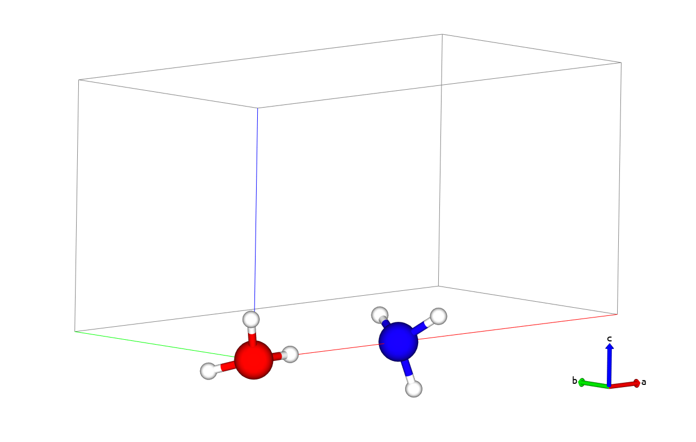
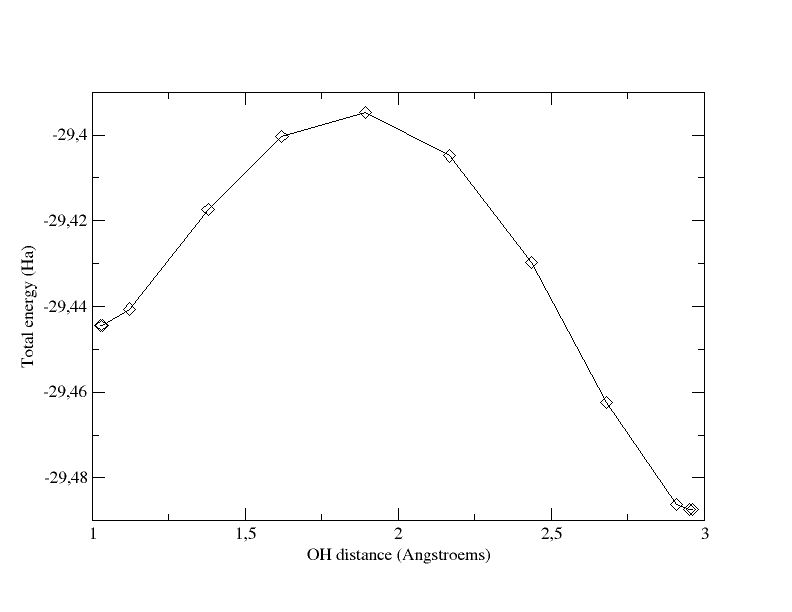
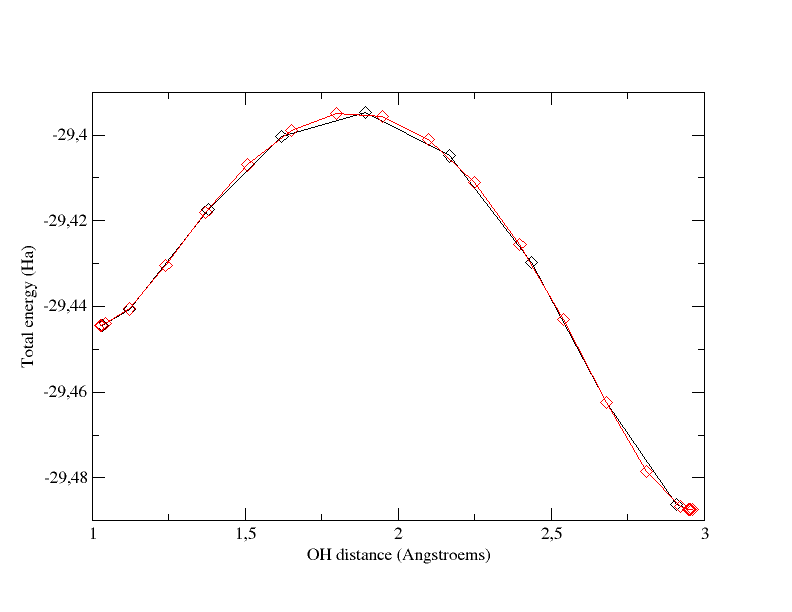
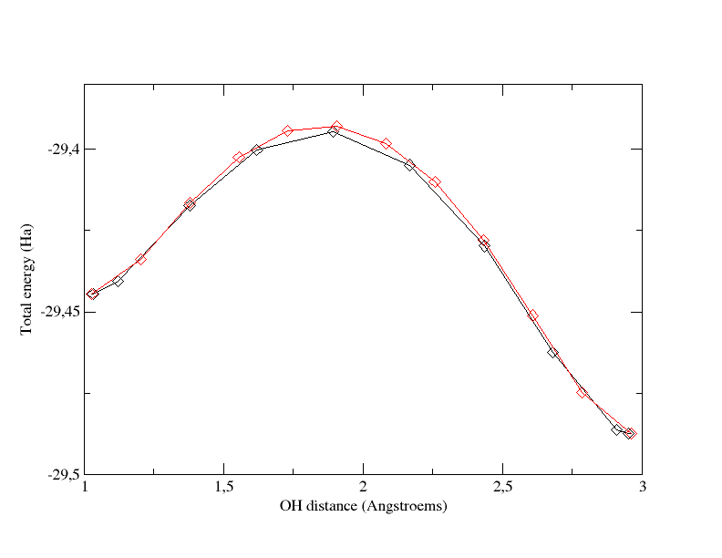

# Parallelism on images, the string method

## String method for the computation of minimum energy paths, in parallel.

This tutorial aims at showing how to use the parallelism on images, by performing a calculation of a minimum energy
path (MEP) using the string method. 

You will learn how to run the string method on a parallel architecture and
what are the main input variables that govern convergence and numerical
efficiency of the parallelism on *images*. Other algorithms use images, 
e.g. path-integral molecular dynamics, hyperdynamics, linear combination of images, ... with different values of [[imgmov]].
The parallelism on images can be used for all these algorithms.

You are supposed to know already some basics of parallelism in ABINIT, explained in the tutorial
[A first introduction to ABINIT in parallel](/tutorial/basepar), and  [parallelism over bands and plane waves](/tutorial/paral_bandpw).

This tutorial should take about 1.5 hour and requires to have at least a 10 CPU
core parallel computer.

[TUTORIAL_README]

## 1 Summary of the String Method

The string method [[cite:Weinan2002]] is an algorithm that allows the computation of a Minimum
Energy Path (MEP) between an initial (_i_) and a final (_f_) configuration. It is
inspired from the Nudge Elastic Band (NEB) method. A chain of
configurations joining (_i_) to (_f_) is progressively driven to the MEP using an
iterative procedure in which each iteration consists of two steps:

1. **Evolution step**: the images are moved following the atomic forces.
2. **Reparametrization step**: the images are equally redistributed along the string.

The algorithm presently implemented in ABINIT is the so-called *simplified string method* [[cite:Weinan2007]].
It has been designed for the sampling of smooth energy landscapes.

*Before continuing you might work in a different subdirectory as for the other
tutorials. Why not work_paral_images?*

!!! important

    In what follows, the names of files are mentioned as if you were in this subdirectory.
    All the input files can be found in the `\$ABI_TESTS/tutoparal/Input` directory.
    You can compare your results with reference output files located in `\$ABI_TESTS/tutoparal/Refs`.

    In the following, when "run ABINIT over _nn_ CPU cores" appears, you have to use
    a specific command line according to the operating system and architecture of
    the computer you are using. This can be for instance: `mpirun -n nn abinit input.abi`
    or the use of a specific submission file.

!!! tip
    
    In this tutorial, most of the images and plots are easily obtained using the post-processing tool
    [qAgate](https://github.com/piti-diablotin/qAgate) or [agate](https://github.com/piti-diablotin/agate), 
    its core engine.
    Any post-process tool will work though !!

## 2 Computation of the initial and final configurations

We propose to compute the energy barrier for transferring a proton from an
hydronium ion (H<sub>3</sub>O<sup>+</sup>) onto a NH<sub>3</sub> molecule:

\begin{equation} \nonumber
\rm H_3O^+ + NH_3 \rightarrow H_2O + NH_4^+
\end{equation}

Starting from an hydronium ion and an ammoniac molecule, we obtain as final
state a water molecule and an ammonium ion NH<sub>4</sub><sup>+</sup>. In such a process, the MEP
and the barrier are dependent on the distance between the hydronium ion and
the NH<sub>3</sub> molecule. Thus we choose to fix the O atom of H<sub>3</sub>O<sup>+</sup> and the N atom of
NH<sub>3</sub> at a given distance from each other (4.0 Å = 7.5589 bohr). The calculation is performed
using a LDA exchange-correlation functional.

You can visualize the initial and final states of the reaction below (H atoms
are in white, the O atom is in red and the N atom in blue).




!!! tip
    To obtain these images, open the `timages_01.abi` and `timages_02.abi` files with `agate` 
    or `qAgate`

Before using the string method, it is necessary to optimize the initial and
final points. The input files `timages_01.abi` and `timages_02.abi` contain
respectively two geometries close to the initial and final states of the
system. You have first to optimize properly these initial and final
configurations, using for instance the Broyden algorithm implemented in ABINIT.



Open the `timages_01.abi` file and look at it carefully. The unit cell is defined
at the begining. Note that the keywords [[natfix]] and [[iatfix]] are used to keep
fixed the positions of the O and N atoms. The cell is tetragonal and its size
is larger along x so that the periodic images of the system are separated by
4.0 Å (7.5589 bohr) of vacuum in the three directions. The keyword [[cellcharge]] is used to
remove an electron of the system and thus obtain a protonated molecule
(neutrality is recovered by adding a uniform compensating charge background).

Although this input file will run on a single core, the [[paral_kgb]] keyword is set to 1 
to activate the LOBPCG [[cite:Bottin2008]] algorithm.
Note the use of [[bandpp]] 10 to accelerate the convergence.

!!! important
    If your system were larger and required more CPU time, all the usual variables for parallelism
    [[np_spkpt]], [[npband]], [[npfft]], [[npspinor]] could be used wisely.

Then run the calculation in sequential, first for the initial
configuration (`timages_01.abi`), and then for the final one (`timages_02.abi`). You
should obtain the following positions:

1. for the initial configuration:

    ```
    xcart      0.0000000000E+00  0.0000000000E+00  0.0000000000E+00
              -7.1119330966E-01 -5.3954252784E-01  1.6461078895E+00
              -7.2706367116E-01  1.6395559231E+00 -5.3864186404E-01
               7.5589045315E+00  0.0000000000E+00  0.0000000000E+00
               8.2134747935E+00 -1.8873337293E-01 -1.8040045499E+00
               8.1621251369E+00 -1.4868515614E+00  1.0711027413E+00
               8.2046046694E+00  1.6513534511E+00  7.5956562273E-01
               1.9429112745E+00  4.2303909125E-02  2.9000318893E-02
    ```

2. for the final configuration:

    ```
    xcart      0.0000000000E+00  0.0000000000E+00  0.0000000000E+00
              -5.8991482730E-01 -3.6948430331E-01  1.7099330811E+00
              -6.3146217793E-01  1.6964706443E+00 -3.6340264832E-01
               7.5589045315E+00  0.0000000000E+00  0.0000000000E+00
               8.4775515860E+00 -2.9286989031E-01 -1.6949564152E+00
               7.9555913454E+00 -1.4851844626E+00  1.1974660442E+00
               8.2294855730E+00  1.6454040992E+00  8.0048724879E-01
               5.5879660323E+00  1.1438061815E-01 -2.5524007156E-01
    
    ```


## 3 Related keywords

Once you have properly optimized the initial and final states of the process,
you can turn to the computation of the MEP. 
Let us first have a look at the related keywords.

[[imgmov]]
:       Selects an algorithm using replicas of the unit cell.
        For the string method, choose 2.

[[nimage]]
:       gives the number of replicas of the unit cell including the initial and final ones. Note that when [[nimage]]>1, 
        the default value of several print input variables changes from one to zero. You might want to explicitly set [[prtgsr]] to 1
        to print the _GSR file, and get some visualization possibilities using Abipy.

[[dynimage]]([[nimage]])
:       arrays of flags specifying if the image evolves or not (0: does not evolve; 1: evolves).

[[ntimimage]]
:       gives the maximum number of iterations (for the relaxation of the string).

[[tolimg]]
:       convergence criterion (in Hartree) on the total energy (averaged over the [[nimage]] images).

[[fxcartfactor]]
:       "time step" (in Bohr<sup>2</sup>/Hartree) for the evolution step of
        the string method. For the time being (ABINITv6.10), only steepest-descent
        algorithm is implemented.

[[npimage]]
:       gives the number of processors among which the work load over
        the image level is shared. Only dynamical images are considered (images for
        which [[dynimage]] is 1). This input variable can be automatically set by
        ABINIT if the number of processors is large enough.

[[prtvolimg]]
:       governs the printing volume in the output file (0: full output; 1: intermediate; 2: minimum output).

## 4 Computation of the MEP without parallelism over images

You can now start with the string method.
First, for test purpose, we will not use the parallelism over images and will
thus only perform one step of string method.



Open the `timages_03.abi` file and look at it. The initial and final
configurations are specified at the end through the keywords [[xcart]] and
[[nimage|xcart_lastimg]]. By default, ABINIT generates the intermediate
images by a linear interpolation between these two configurations. In this
first calculation, we will sample the MEP with 12 points (2 are fixed and
correspond to the initial and final states, 10 are evolving). [[nimage]] is
thus set to 12. The [[npimage]] variable is not used yet (no parallelism over
images) and [[ntimimage]] is set to 1 (only one time step).

Since the parallelism over the images is not used, this calculation still 
runs over 1 CPU core.

## 5 Computation of the MEP using parallelism over images

Now you can perform the complete computation of the MEP using the parallelism over the images.



Open the `timages_04.abi` file. The keyword [[npimage]] has been added and set to 10, and
[[ntimimage]] has been increased to 50.
This calculation has thus to be run over 10 CPU cores.

The convergence of the string method algorithm is controlled by [[tolimg]],
which has been set to 0.0001 Ha. In order to obtain a more lisible output
file, you can decrease the printing volume and set [[prtvolimg]] to 2.
Then run ABINIT over 10 CPU cores.

When the calculation is completed, ABINIT provides you with 12 configurations
that sample the Minimum Energy Path between the initial (_i_) and final (_f_)
states. Plotting the total energy of these configurations with respect to a
reaction coordinate that join (_i_) to (_f_) gives you the energy barrier that
separates (_i_) from (_f_). In our case, a natural reaction coordinate can be the
distance between the hopping proton and the O atom of H<sub>2</sub>O (d<sub>OH</sub>), or
equivalently the distance between the proton and the N atom (d<sub>HN</sub>). The graph
below shows the total energy as a function of the OH distance along the MEP.
It indicates that the barrier for crossing from H<sub>2</sub>O to NH<sub>3</sub> is ~1.36 eV. The
6th image gives an approximate geometry of the transition state. Note that in
the initial state, the OH distance is significantly stretched, due to the
presence of the NH<sub>3</sub> molecule.

!!! tip
    Note that the total energy of each of the 12 replicas of the simulation cell
    can be found at the end of the output file in the section:
    
    ```
    -outvars: echo values of variables after computation  --------
    ```
    The total energies are printed out as: etotal_1img, etotal_2img, ...., etotal_12img.

!!! tip
    Also, you can can have a look at the atomic positions in each image: in
    cartesian coordinates (xcart_1img, xcart_2img, ...) or in reduced coordinates
    (xred_1img, xred_2img, ...) to compute the OH distance.


!!! tip
    You can issue the command `:plot xy x="distance 1 8 dunit=A" y="etotal eunit=eV"` in `agate` or `qAgate`


Total energy as a function of OH distance for the path computed with 12 images

and [[tolimg]]=0.0001 (which is very close to the x coordinate of the proton:
first coordinate of xcart  for the 8th atom in the output file).

The keyword [[npimage]] can be automatically set by ABINIT if [[autoparal]] is set to 1. 

Let us test this functionality. Edit again the `timages_04.abi` file and comment
the [[npimage]] line, then add [[autoparal]]=1. Then run the calculation again over 10 CPU cores.

Open the output file and look at the [[npimage]] value ...

## 6 Converging the MEP

Like all physical quantities, the MEP has to be converged with respect to some
numerical parameters. The two most important are the number of points along
the path ([[nimage]]) and the convergence criterion ([[tolimg]]).

1. [[nimage]]

    Increase the number of images to 22 (2 fixed + 20 evolving) and recompute the
    MEP. 
    Don't forget to update [[dynimage]] to `0 20*1 0` ! And you have 20 CPU cores 
    available then set [[npimage]] to 20 and run ABINIT over 20 CPU cores.
    The graph below superimposes the previous MEP (grey curve, calculated
    with 12 images) and the new one obtained by using 22 images (cyan curve). You
    can see that the global profile is almost not modified as well as the energy
    barrier.
    
    
    
    Total energy as a function of OH distance for the path computed with 12 images
    and [[tolimg]]=0.0001 (grey curve) and the one computed with 22 images and
    [[tolimg]]=0.0001 (red curve).

    !!! tip
        The image can be obtained with `agate` or `qagate` with the following commands
            ```
            :open timages_04_MPI10o_HIST.nc # 12 images calculation
            :plot xy x="distance 1 8 dunit=A" y="etotal eunit=eV" hold=true
            :open timages_04_MPI10_22o_HIST.nc # 22 images calculation
            :plot xy x="distance 1 8 dunit=A" y="etotal eunit=eV"
            ```
        Replace `plot` with `print` to get the `gnuplot` script.
    
    The following animation is made by putting together the 22
    images obtained at the end of this calculation, from (_i_) to (_f_) and then from
    (_f_) to (_i_). It allows to visualize the MEP.

    !!! tip
        Open the `timages_04o_HIST.nc` file with `agate` or `qAgate` to produce this animation.
    
  <video id="video_string" controls autoplay loop style="width: 100%;">
  <source src="../paral_images_assets/stringvideo.mp4" type="video/mp4">
  <source src="../paral_images_assets/stringvideo.webm" type="video/webm">
  You browser does not support the video tag. Download the file [here](paral_images_assets/stringvideo.mp4).
  </video>
    
2. [[tolimg]]

    Come back to [[nimage]]=12. First you can increase [[tolimg]] to 0.001 and
    recompute the MEP. This will be much faster than in the previous case.
    
    Then you should decrease [[tolimg]] to 0.00001 and recompute the MEP. To gain
    CPU time, you can start your calculation by using the 12 images obtained at
    the end of the calculation that used [[tolimg]] = 0.0001. In your input file,
    these starting images will be specified by the keywords [[xcart]],
    [[nimage|xcart_2img]], [[nimage|xcart_3img]] ... [[nimage|xcart_12img]].
    You can copy them directly from the output file obtained at the previous
    section. The graph below superimposes the path obtained with 12 images and
    [[tolimg]]=0.001 (grey curve) and the one with 12 images and [[tolimg]]=0.0001 (cyan curve).
    
    
    
    Total energy as a function of OH distance for the path computed with 12 images
    and [[tolimg]]=0.0001 (cyan curve) and the one computed with 12 images and [[tolimg]]=0.001 (grey curve).
