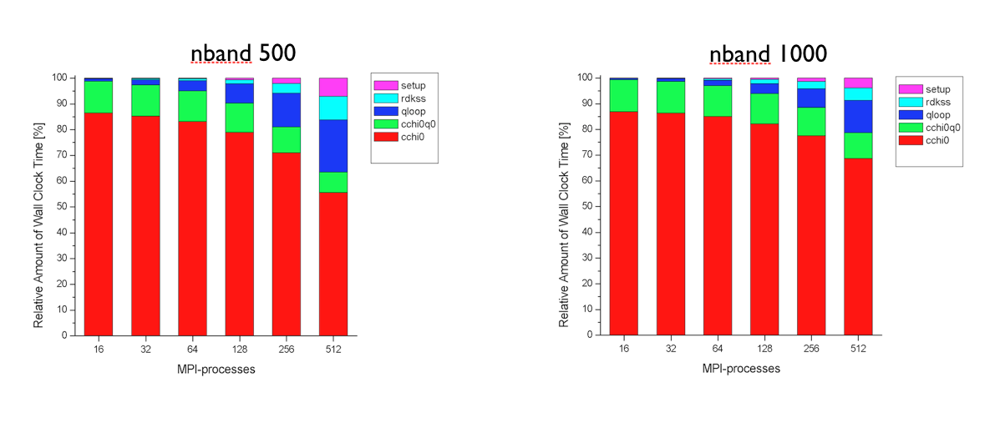
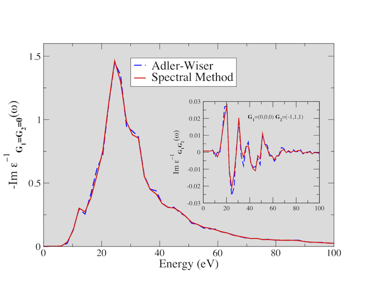
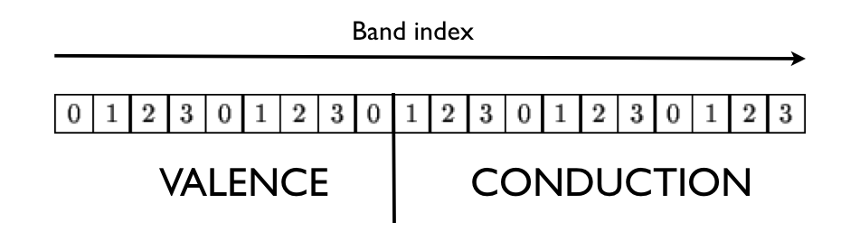
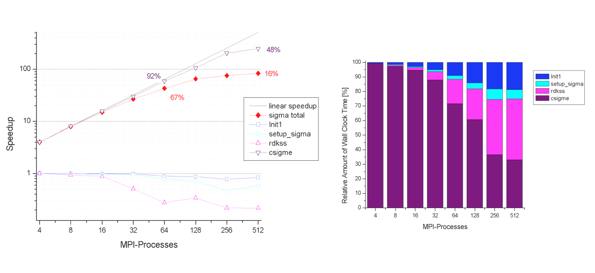
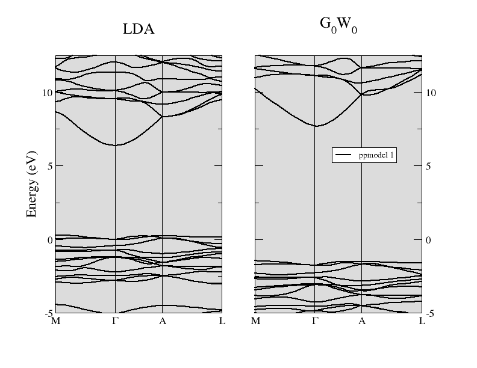

# Parallelism for many-body calculations

## G<sub>0</sub>W<sub>0</sub> corrections in &alpha;-quartz SiO<sub>2</sub>.

This tutorial aims at showing how to perform parallel calculations with the GW
part of ABINIT. We will discuss the approaches used to parallelize the
different steps of a typical G0W0 calculation, and how to setup the parameters
of the run in order to achieve good speedup. α-quartz SiO2 is used as test case.

It is supposed that you have some knowledge about UNIX/Linux, and you know how to submit MPI jobs.
You are supposed to know already some basics of parallelism in ABINIT,
explained in the tutorial [A first introduction to ABINIT in parallel](basepar.md).

In the following, when "run ABINIT over nn CPU cores" appears, you have to use
a specific command line according to the operating system and architecture of
the computer you are using. This can be for instance:

    mpirun -n nn abinit < abinit.files

or the use of a specific submission file.

This tutorial should take about 1.5 hour and requires to have at least a 200 CPU core parallel computer.

[TUTORIAL_README]

## 1 Generating the WFK file in parallel

*Before beginning, you should create a working directory in *\$ABI_TESTS/tutoparal/Input*
whose name might be Work_mbt.*

```sh
cd $ABI_TESTS/tutoparal/Input/
mkdir Work_mbt && cd Work_mbt
```

The input files necessary to run the examples related to this tutorial are
located in the directory *\$ABI_TESTS/tutoparal/Input* .
We will do most of the actions of this tutorial in this working directory.

In the [first GW tutorial](gw1), we have learned how to
generate the WFK file with the sequential version of the code.
Now we will perform a similar calculation taking advantage of the k-point parallelism
implemented in the ground-state part.

First of all, copy the files file tmbt_1.files in the working directory Work_mbt:

    cd Work_mbt
    cp ../tmbt_1.files .

Now open the input file *\$ABI_TESTS/tutoparal/Input/tmbt_1.in* in your
preferred editor, and look at its structure.



The first dataset performs a rather standard SCF calculation to obtain the
ground-state density. The second dataset reads the density file and calculates
the Kohn-Sham band structure including many empty states:

    # DATASET 2 : WFK generation
    iscf2      -2      # NSCF
    getden2    -1      # Read previous density
    tolwfr2    1d-12   # Stopping criterion for the NSCF cycle.
    nband2      160    # Number of (occ and empty) bands computed in the NSCF cycle.
    nbdbuf2     10     # A large buffer helps to reduce the number of NSCF steps.

We have already encountered these variables in the [first GW tutorial](gw1)
so their meaning should be familiar to you.
The only thing worth stressing is that this calculation solves the NSCF cycle
with the conjugate-gradient method ([[paral_kgb]] == 0)

The NSCF cycle is executed in parallel using the standard parallelism over
k-points and spin in which the ([[nkpt]] x [[nsppol]]) blocks of bands are
distributed among the nodes. This test uses an unshifted 4x4x3 grid (48 k
points in the full Brillouin Zone, folding to 9 k-points in the irreducible
wedge) hence the theoretical maximum speedup is 9.

Now run ABINIT over nn CPU cores using

    mpirun -n 9 abinit < tmbt_1.files > tmbt_1.log 2> err &

but keep in mind that, to avoid idle processors, the number of CPUs should
divide 9. At the end of the run, the code will produce the file *tmbt_1o_WFK*
needed for the subsequent GW calculations.

With three nodes, the wall clock time is around 1.5 minutes.

    >>> tail tmbt_1.out

    -
    - Proc.   0 individual time (sec): cpu=        209.0  wall=        209.0

    ================================================================================

     Calculation completed.
    .Delivered    0 WARNINGs and   5 COMMENTs to log file.
    +Overall time at end (sec) : cpu=        626.9  wall=        626.9


A reference output file is given in *\$ABI_TESTS/tutoparal/Refs*, under the name *tmbt_1.out*.

Note that 150 bands are not enough to obtain converged GW results, you might
increase the number of bands in proportion to your computing resources.

## 2 Computing the screening in parallel using the Adler-Wiser expression

In this part of the tutorial, we will compute the RPA polarizability with the
Adler-Wiser approach. The basic equations are discussed in this
[[theory:mbt#5-the-rpa-polarizability-in-fourier-space|section]] of the GW notes.

First copy the files file *tmbt_2.file* in the working directory, then create a
symbolic link pointing to the WFK file we have generated in the previous step:

    >>> ln -s tmbt_1o_DS2_WFK tmbt_2i_WFK

Now open the input file *\$ABI_TESTS/tutoparal/Input/tmbt_2.in* so that we can
discuss its structure.



The set of parameters controlling the screening computation is summarized below:

    optdriver   3   # Screening run
    irdwfk      1   # Read input WFK file
    symchi      1   # Use symmetries to speedup the BZ integration
    awtr        1   # Take advantage of time-reversal. Mandatory when gwpara=2 is used.
    gwpara      2   # Parallelization over bands
    ecutwfn     24  # Cutoff for the wavefunctions.
    ecuteps     8   # Cutoff for the polarizability.
    nband       50  # Number of bands in the RPA expression (24 occupied bands)
    inclvkb     2   # Correct treatment of the optical limit.

Most of the variables have been already discussed in the
[first GW tutorial](gw1). The only variables that
deserve some additional explanation are [[gwpara]] and [[awtr]].

[[gwpara]] selects the parallel algorithm used to compute the screening. Two
different approaches are implemented:

  * **gwpara** =1 -> Trivial parallelization over the k-points in the full Brillouin
  * **gwpara** =2 -> Parallelization over bands with memory distribution

Each method presents advantages and drawbacks that are discussed in the
documentation of the variable. In this tutorial, we will be focusing on
**gwpara** =2 since this is the algorithm with the best MPI-scalability and,
mostly important, it is the only one that allows for a significant reduction
of the memory requirement.

The option [[awtr]] = 1 specifies that the system presents time reversal
symmetry so that it is possible to halve the number of transitions that have
to be calculated explicitly (only resonant transitions are needed). Note that
[[awtr]] = 1 is MANDATORY when [[gwpara]] = 2 is used.

Before running the calculation in parallel, it is worth discussing some
important technical details of the implementation. For our purposes, it
suffices to say that, when [[gwpara]] = 2 is used in the screening part, the
code distributes the wavefunctions such that each processing unit owns the
FULL set of occupied bands while the empty states are distributed among the
nodes. The parallel computation of the inverse dielectric matrix is done in
three different steps that can be schematically described as follows:

1. Each node computes the partial contribution to the RPA polarizability:

    

2. The partial results are collected on each node.

3. The master node performs the matrix inversion to obtain the inverse dielectric matrix and writes the final result on file.

Both the first and second step of the algorithm are expected to scale well
with the number of processors. Step 3, on the contrary, is performed in
sequential thus it will have a detrimental effect on the overall scaling,
especially in the case of large screening matrices (large [[npweps]] or large
number of frequency points ω).

Note that the maximum number of CPUs that can be used is dictated by the
number of empty states used to compute the polarizability. Most importantly, a
balanced distribution of the computing time is obtained when the number of
processors divides the number of conduction states.

The main limitation of the present implementation is represented by the
storage of the polarizability. This matrix, indeed, is not distributed hence
each node must have enough memory to store in memory a table whose size is
given by ( **npweps** 2 x **nomega** x 16 bytes) where **nomega** is the total
number of frequencies computed.

Tests performed at the Barcelona Supercomputing Center (see figures below)
have revealed that the first and the second part of the MPI algorithm have a
very good scaling. The routines cchi0 and cchi0q0 where the RPA expression is
computed (step 1 and 2) scales almost linearly up to 512 processors. The
degradation of the total speedup observed for large number of processors is
mainly due to the portions of the computation that are not parallelized,
namely the reading of the WFK file and the matrix inversion (qloop).




At this point, the most important technical details of the implementation have
been covered, and we can finally run ABINIT over nn CPU cores using

    (mpirun ...) abinit < tmbt_2.files > tmbt_2.log 2> err &

Run the input file *tmb_2.in* using different number of processors and keep
track of the time for each processor number so that we can test the
scalability of the implementation. The performance analysis reported in the
figures above was obtained with PAW using ZnO as tests case, but you should
observe a similar behavior also in SiO 2.

Now let's have a look at the output results. Since this tutorial mainly
focuses on how to run efficient MPI computations, we won't perform any
converge study for SiO2. Most of the parameters used in the input files are
already close to converge, only the k-point sampling and the number of empty
states should be increased. You might modify the input files to perform the
standard converge tests following the procedure described in the [first GW tutorial](gw1).

In the main output file, there is a section reporting how the bands are
distributed among the nodes. For a sequential calculation, we have

     screening : taking advantage of time-reversal symmetry
     Maximum band index for partially occupied states nbvw =    24
     Remaining bands to be divided among processors   nbcw =    26
     Number of bands treated by each node ~   26

The value reported in the last line will decrease when the computation is done with more processors.

The memory allocated for the wavefunctions scales with the number of
processors. You can use the grep utility to extract this information from the
log file. For a calculation in sequential, we have:

    >>> grep "Memory needed" tmbt_2.log

      Memory needed for storing ug=         29.5 [Mb]
      Memory needed for storing ur=        180.2 [Mb]

_ug_ denotes the internal buffer used to store the Fourier components of the
orbitals whose size scales linearly with [[npwwfn]]. _ur_ is the array storing
the orbitals on the real space FFT mesh. Keep in mind that the size of _ur_
scales linearly with the total number of points in the FFT box, number that is
usually much larger than the number of planewaves ([[npwwfn]]). The number of
FFT divisions used in the GW code can be extracted from the main output file using

    >>> grep setmesh tmbt_2.out  -A 1
     setmesh: FFT mesh size selected  =  27x 27x 36
              total number of points  =    26244

As discussed in this
[[theory:mbt#6-notes-on-the-calculation-of-the-oscillator-matrix-elements|section]] of the GW notes,
the Fast Fourier Transform represents one of the most CPU
intensive part of the execution. For this reason the code provides the input
variable [[fftgw]] that can be used to decrease the number of FFT points for
better efficiency. The second digit of the input variable [[gwmem]], instead,
governs the storage of the real space orbitals and can used to avoid the
storage of the costly array _ur_ at the price of an increase in computational time.

#### **2.d Manual parallelization over q-points.**

The computational effort required by the screening computation scales linearly
with the number of q-points.
As explained in this
[[theory:mbt#5-the-rpa-polarizability-in-fourier-space|section]]
of the GW notes, the code exploits the symmetries of the screening function so
that only the irreducible Brillouin zone (IBZ) has to be calculated
explicitly. On the other hand, a large number of q-points might be needed to
achieve converged results. Typical examples are GW calculations in metals or
optical properties within the Bethe-Salpeter formalism.

If enough processing units are available, the linear factor due to the q-point
sampling can be trivially absorbed by splitting the calculation of the
q-points into several independent runs using the variables [[nqptdm]] and
[[qptdm]]. The results can then be gathered in a unique binary file by means
of the **mrgscr** utility (see also the automatic tests [[test:v3_87]], [[test:v3_88]] and [[test:v3_89]]).

## 3 Computing the screening in parallel using the Hilbert transform method

As discussed in the [[theory:mbt#RPA_Fourier_space|GW_notes]]
the algorithm based on the Adler-Wiser expression is not optimal when many
frequencies are wanted. In this paragraph, we therefore discuss how to use the
Hilbert transform method to calculate the RPA polarizability on a dense
frequency mesh. The equations implemented in the code are documented in
[[theory:mbt#hilbert_transform|in this section]].


As usual, we have to copy the files file *tmbt_3.file* in the working directory,
and then create a symbolic link pointing to the WFK file.

    >>> ln -s tmbt_1o_DS2_WFK tmbt_3i_WFK

The input file is *$\ABI_TESTS/tutoparal/Input/tmbt_3.in*.
Open it so that we can have a look at its structure.



A snapshot of the most important parameters governing the algorithm is reported below.

    gwcalctyp   2    # Contour-deformation technique.
    spmeth      1    # Enable the spectral method.
    nomegasf  100    # Number of points for the spectral function.
    gwpara      2    # Parallelization over bands
    awtr        1    # Take advantage of time-reversal. Mandatory when gwpara=2 is used.
    freqremax  40 eV # Frequency mesh for the polarizability
    nfreqre    20
    nfreqim     5

The input file is similar to the one we used for the Adler-Wiser calculation.
The input variable [[spmeth]] enables the spectral method. [[nomegasf]]
defines the number of ω′ points in the linear mesh used for the spectral
function i.e. the number of ω′ in the
[[theory:mbt#hilbert_transform|equation]] for the spectral function.

As discussed in the [[theory:mbt#hilbert_transform|GW notes] for the spectral function.
Hilbert transform method is much more memory demanding that the Adler-Wiser
approach, mainly because of the large value of [[nomegasf]] that is usually
needed to converge the results. Fortunately, the particular distribution of
the data employed in [[gwpara]] = 2 turns out to be well suited for the
calculation of the spectral function since each processor has to store and
treat only a subset of the entire range of transition energies. The algorithm
therefore presents good MPI-scalability since the number of ω′ frequencies
that have to be stored and considered in the Hilbert transform decreases with
the number of processors.

Now run ABINIT over nn CPU cores using

    (mpirun ...) abinit < tmbt_3.files > tmbt_3.log 2> err

and test the scaling by varying the number of processors. Keep in mind that,
also in this case, the distribution of the computing work is well balanced
when the number of CPUs divides the number of conduction states.

The memory needed to store the spectral function is reported in the log file:

    >>> grep "sf_chi0q0" tmbt_3.log
     memory required by sf_chi0q0:           1.0036 [Gb]

Note how the size of this array decreases when more processors are used.

The figure below shows the electron energy loss function (EELF) of SiO2
calculated using the Adler-Wiser and the Hilbert transform method. You might
try to reproduce these results (the EELF is reported in the file *tmbt_3o_EELF*,
a much denser k-sampling is required to achieve convergence).



## 4 Computing the one-shot GW corrections in parallel

In this last paragraph, we discuss how to calculate G0W0 corrections in
parallel with [[gwpara]] = 2. The basic equations used to compute the self-energy matrix elements are discussed in
[[theory:mbt#evaluation_gw_sigma|this part]] of the GW notes.

Before running the calculation, copy the files file *tmbt_4.file* in the working
directory. Then create two symbolic links for the SCR and the WFK file:

    ln -s tmbt_1o_DS2_WFK tmbt_4i_WFK
    ln -s tmbt_2o_SCR     tmbt_4i_SCR

Now open the input file *\$ABI_TESTS/tutoparal/Input/tmbt_4.in*.



The most important parameters of the calculation are reported below:

```
optdriver   4            # Sigma run.
irdwfk      1
irdscr      1
gwcalctyp   0 ppmodel 1  # G0W0 calculation with the plasmon-pole approximation.
#gwcalctyp  2            # Uncomment this line to use the contour-deformation technique but remember to change the SCR file!
gwpara      2            # Parallelization over bands.
symsigma    1            # To enable the symmetrization of the self-energy matrix elements.
ecutwfn    24            # Cutoff for the wavefunctions.
ecuteps     8            # Cutoff in the correlation part.
ecutsigx   20            # Cutoff in the exchange part.
nband       50           # Number of bands for the correlation part.
```

For our purposes, it suffices to say that this input file defines a standard
one-shot calculation with the plasmon-pole model approximation. We refer to
the documentation and to the [first GW tutorial](gw1)
for a more complete description of the meaning of these variables.

Also in this case, we use [[gwpara]] = 2 to perform the calculation in parallel.
Note, however, that the distribution of the orbitals employed in the self-
energy part significantly differs from the one used to compute the screening.
In what follows, we briefly describe the two-step procedure used to distribute
the wavefunctions:

1. Each node reads and stores in memory the states where the QP corrections are computed
   (the list of states specified by [[kptgw]] and [[bdgw]]).

2. The [[nband]] bands are distributed using the following partition scheme:

   

   where we have assumed a calculation done with four nodes (the index in the box
   denotes the MPI rank).

By virtue of the particular distribution adopted, the computation of the
correlation part is expected to scale well with the number CPUs. The maximum
number of processors that can be used is limited by [[nband]]. Note, however,
that only a subset of processors will receive the occupied states when the
bands are distributed in step 2. As a consequence, the theoretical maximum
speedup that can be obtained in the exchange part is limited by the
availability of the occupied states on the different MPI nodes involved in the run.

The best-case scenario is when the QP corrections are wanted for all the
occupied states. In this case, indeed, each node can compute part of the self-
energy and almost linear scaling should be reached. The worst-case scenario is
when the quasiparticle corrections are wanted only for a few states (e.g. band
gap calculations) and NCPU >> Nvalence. In this case, indeed, only Nvalence
processors will participate to the calculation of the exchange part.

To summarize: The MPI computation of the correlation part is efficient when
the number of processors divides **nband**. Optimal scaling in the exchange
part is obtained only when each node possesses the full set of occupied states.

The two figures below show the speedup of the sigma part as function of the
number of processors. The self-energy is calculated for 5 quasiparticle states
using nband=1024 (205 occupied states). Note that this setup is close to the
worst-case scenario. The computation of the self-energy matrix elements
(csigme) scales well up to 64 processors. For large number number of CPUs, the
scaling departs from the linear behavior due to the unbalanced distribution of
the occupied bands. The non-scalable parts of the implementation
(init1, rdkss) limit the total speedup due to Amdhal's law.



The implementation presents good memory scalability since the largest arrays
are distributed. Only the size of the screening does not scale with the number
of nodes. By default each CPU stores in memory the entire screening matrix for
all the q-points and frequencies in order to optimize the computation. In the
case of large matrices, however, it possible to opt for an out-of-core
solution in which only a single q-point is stored in memory and the data is
read from the external SCR file (slower but less memory demanding). This
option is controlled by the first digit of [[gwmem]].

Now that we know how distribute the load efficiently, we can finally run the
calculation using

    (mpirun ...) abinit < tmbt_4.files > tmbt_4.log 2> err &

Keep track of the time for each processor number so that we can test the
scalability of the self-energy part.

Please note that the results of these tests are not converged. A well
converged calculation would require a 6x6x6 k-mesh to sample the full BZ, and
a cutoff energy of 10 Ha for the screening matrix. The QP results converge
extremely slowly with respect to the number of empty states. To converge the
QP gaps within 0.1 eV accuracy, we had to include 1200 bands in the screening
and 800 states in the calculation of the self-energy.

The comparison between the LDA band structure and the G 0W0 energy bands of
α-quartz SiO2 is reported in the figure below. The direct gap at Γ is opened
up significantly from the LDA value of 6.4 eV to about 9.5 eV when the one-
shot G0W0 method is used. You are invited to reproduce this result (take into
account that this calculation has been performed at the theoretical LDA
parameters, while the experimental structure is used in all the input files of
this tutorial).



## 5 Basic rules for efficient parallel calculations

1. Remember that "Anything that can possibly go wrong, does" so, when writing your input file, try to "Keep It Short and Simple".

2. Do one thing and do it well:
  Avoid using different values of [[optdriver]] in the same input file. Each
  runlevel employs different approaches to distribute memory and CPU time, hence
  it is almost impossible to find the number of processors that will produce a
  balanced run in each dataset.

3. Prime number theorem:
  Convergence studies should be executed in parallel only when the parameters
  that are tested do not interfere with the MPI algorithm. For example, the
  convergence study in the number of bands in the screening should be done in
  separated input files when [[gwpara]]=2 is used.

4. Less is more:
  Split big calculations into smaller runs whenever possible. For example,
  screening calculations can be split over q-points. The calculation of the
  self-energy can be easily split over [[kptgw]] and [[bdgw]].

5. Look before you leap:
  Use the converge tests to estimate how the CPU-time and the memory
  requirements depend on the parameter that is tested. Having an estimate of the
  computing resources is very helpful when one has to launch the final
  calculation with converged parameters.
