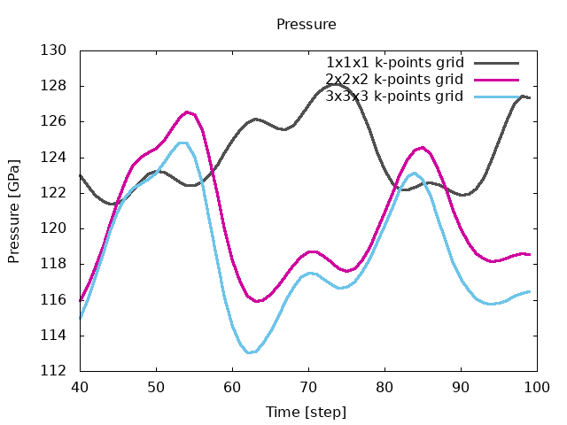
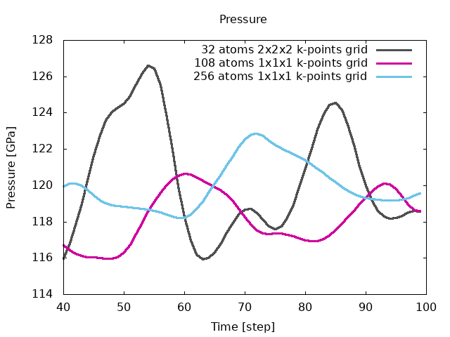
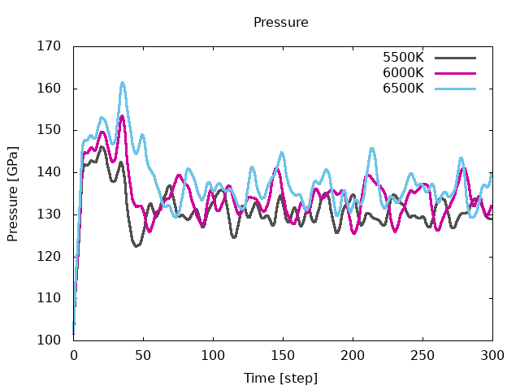

# Parallelism for molecular dynamics  

## How to perform Molecular Dynamics calculations using parallelism  

This tutorial aims at showing how to perform molecular dynamics with ABINIT
using a parallel computer.
You will learn how to launch molecular dynamics calculation and what are the
main input variables that govern convergence and numerical efficiency.  

You are supposed to know already some basics of parallelism in ABINIT,
explained in the tutorial 
[A first introduction to ABINIT in parallel](basepar), and 
[ground state with plane waves](paral_gspw).

This tutorial should take about 1.5 hour to be done and requires to have at
least a 200 CPU core parallel computer.

[TUTORIAL_README]

## 1 Summary of the molecular dynamics method
  
The basic idea underlying Ab Initio Molecular Dynamics (AIMD) is to compute
the forces acting on the nuclei from electronic structure calculations that
are performed as the molecular dynamics trajectory is generated. 

An AIMD calculation assumes only that the system is composed of nuclei and
electrons, that the Born -Oppenheimer approximation is valid, and that the
dynamics of the nuclei can be treated classically on the ground-state
electronic surface. It allows both equilibrium thermodynamic and dynamical
properties of a system at finite temperature to be computed. For example
melting temperatures, phase transitions, atomic vibrations, structure
factor... but also XANES or IR spectrum can be obtained with this technique.

AIMD deals with supercells of hundred to thousand of atoms (usually, the
larger, the better!). In addition Molecular Dynamics simulations can be
performed for days, weeks or even months! They are therefore very time
consuming and can not be done without the help of high speed and massively
parallel computing.

In the following, when "run ABINIT over _nn_ CPU cores" appears, you have to use
a specific command line according to the operating system and architecture of
the computer you are using. This can be for instance: mpirun -n _nn_ abinit <
abinit.files or the use of a specific submission file.

*Before continuing, you might consider to work in a different subdirectory as
for the other tutorials. Why not Work_paral_moldyn?*

In what follows, the name of files are mentioned as if you were in this subdirectory.  
All the input files can be found in the *\$ABI_TESTS/tutoparal/Input directory*.
You can compare your results with several reference output files located in
*\$ABI_TESTS/tutoparal/Refs* (for the present tutorial they are named tmoldyn_*.out).

## 2 Performing molecular dynamics with ABINIT
  
There are different algorithms to do molecular dynamics. See the input
variable [[ionmov]], with values 1, 6, 7, 8, 9, 12, 13 and 14. [[dtion]]
controls the ion time step in atomic units of time (one atomic time unit is
2.418884 x 10-17 seconds, which is the value of Planck's constant in hartree*sec).
The default value is 100. You should try several values for [[dtion]] in order
to establish the stable and efficient choice. For example this value should
decrease at high pressure.  
  
Except for the isothermal/isenthalpic ([[ionmov]] 13) ensemble the input
variable [[optcell]] must be set to 0.
You have also to define the maximal number of timesteps of the molecular dynamics.  
  
Usually you can set the input variable [[ntime]] to a large value, 5000, since
there is no "end" to a molecular dynamics simulation. You can always stop or
restart the calculation at your convenience by using the input variable [[restartxf]].

The input file *tmoldyn_01.in* is an example of a file that contains data for a
molecular dynamics simulation using the isokinetic ensemble for aluminum. 



Open the *tmoldyn_01.in* file and look at it carefully. The unit cell is defined at
the end. It is a 2x2x2 fcc supercell containing 32 atoms of Al. [[ionmov]] is
set to 12 for the isokinetic ensemble, and since [[ntime]] is set to 50,
ABINIT will carry on 50 time steps of molecular dynamics. The calculation will
be performed for a temperature of 3000 K, see the key variable [[mdtemp]]. It
gives the initial and final temperature of the simulation (in Kelvin). The
temperature will change linearly from the initial temperature **mdtemp(1)** at
itime=1 to the final temperature **mdtemp(2)** at the end of the [[ntime]]
timesteps. Here the temperature will stay constant during the whole simulation.  

!!! note

    Note that we use the same temperature for the ions and the electrons:
    [[occopt]] has been set to 3 for a Fermi-Dirac smearing and [[tsmear]] has
    been set to 3000 Kelvin. Nothing prevents you to use different electronic and
    ionic temperature, you just have to know why you are doing so!

Molecular dynamics simulations are always large calculations, dealing with
supercells of hundreds to thousands of atoms. Therefore they are always
performed in parallel. In *tmoldyn_01.in*, [[paral_kgb]] has been set to 1 to
activate the parallelisation over k-points, G-vectors and bands. The three
following keywords give the number of processors for each level of
parallelisation. Since we have only one k-point in the simulation (the $\Gamma$
point), [[nkpt]] has been set to 1. [[npfft]] is set to 3 and [[npband]] to
10, for a total number of 3x10=30 processors. You might use the *tmoldyn.files*
file. Edit it and adapt it with the appropriate file names.

Then run the calculation in parallel over 30 CPU cores. You can change the
distribution of processors over the level of parallelisation to try to find
the most efficient one. Set for example [[npfft]]  to 1 and [[npband]] to 40.
You can make other choices and compare the individual cpu time. Since
molecular dynamics can last for weeks, it is crucial to find the appropriate
distribution to reduce the computational time at the maximum. Look at the
output file. For each iteration you will see the coordinates, the forces, the
velocities and the kinetic and the total energy.

In addition, ABINIT should have generated a *HIST.nc* file, which contains the
whole history of the molecular dynamics simulation: atomic positions,
velocities, primitive translations, stress tensor, energies... at each time
step. This file will be used to restart the calculation if you want to perform
more time steps or to extract the necessary informations to make use of the
molecular dynamics simulation. In *tmoldyn_01.in* add the keyword [[restartxf]]
and set it to -1. Run the calculation again, in the same directory. Look at
the new output file. The number of each time step are indicated over the total
number of steps:

    Iteration: (  1/100) Internal Cycle: (1/1)

Since we already performed 50 steps of molecular dynamics, the total number of
time steps are now 100. So the first 50 iterations are from the previous
calculation. You can check that by comparing *tmoldyn_01.out* and
*tmoldyn_01.out0001*. There is only one *HIST.nc* file and it contains the history of
the two calculations.

Now we can calculate and plot several quantities. 
We need for that the _diag_moldyn.py_ python script. 
You can find it in the *\$ABI_HOME/doc/tutorial/paral_moldyn_assets*
directory (link [here](paral_moldyn_assets/diag_moldyn.py)).
Run the script as:

    python diag_moldyn.py

You can read (on standard output) the average value and the standard deviation
of the total energy, the temperature and the pressure. You have also generated
several files which contain pressures, energies, stresses, positions and
temperatures. You can plot this files to observe the behavior of the
quantities during the molecular dynamics. Note that 100 time steps is far from
being sufficient to equilibrate physical quantities as pressure. 2000 or 3000
are more common numbers to reach this goal but it would exceed the time
allocated for this tutorial.

## 3 The convergence on k-points and supercell size
  
In the previous section you have learned to perform molecular dynamics with
abinit. We used a fcc supercell of 32 atoms with only one k-point. In this
section we will make convergence studies with respect to these parameters.

**3.a** **Computing the convergence in K-points**

The files *tmoldyn_02.in* and *tmoldyn_03.in* are input files for 2x2x2 and 3x3x3
k-points grid respectively, or 4 and 14 k-points in the irreducible Brillouin zone. 



Since the parallelisation is the most efficient over the k-point level
you should always put [[nkpt]] to the largest possible value before increasing
[[npfft]] and [[npband]]. We have followed this rule in the input files.
Change the name of the previous file PRESS to PRESS01 to save it. Run now
ABINIT in parallel over 120 CPU cores with *tmoldyn_02.in* and over 140 CPU
cores with *tmoldyn_03.in*. At the end of each calculation use the
_diag_moldyn.py_ script and save the results in PRESS02 and PRESS03. You can now
plot the pressures in term of the k-points grids and compare the average values:

  

As said previously our simulations are too short to be completely convincing
but you can see that you need at least a 2x2x2 k-points grid for a 32 atoms
cell. If you have some time, increase ntime to 300 and run again ABINIT.

**3.b** **Computing the convergence in cell size**

We also have to check if our cell is sufficiently large to give reliable
physical quantities. In the previous section we used a 2x2x2 fcc supercell.
*tmoldyn_04.in* is an input file for a 3x3x3 fcc supercell and therefore
contains 108 atoms. [[nband]] and [[acell]] has been scaled accordingly to
take into account the new size of the cell. 

Run now ABINIT in parallel over 45 CPU cores and then _diag_moldyn.py_ 
(note that the output file is very big, and no reference has been provided for comparison). 
Save the pressure to PRESS04.
*tmoldyn_05.in* has the same cell but a 2x2x2 k-points grid (note that the
output file is very big, and no reference has been provided for comparison).
Run it over the adequate number of cores and save the pressure to PRESS05.
Plot now PRESS04 and PRESS05 and compare the average values. You will see that
for this size of cell, the $\Gamma$ point is sufficient.

We are now going to increase again the cell size. With a 4x4x4 fcc cell, the
file *tmoldyn_06.in* has 256 atoms. Of course, [[nband]] and [[acell]] has been
scaled. This calculation should last for 30 min over 60 CPU cores (note that
the output file is very big, and no reference has been provided for
comparison). Run it and save the pressure to PRESS06. Plot now PRESS02,
PRESS04 and PRESS06, remove the first steps and compare the pressure average values:

  

You can see that even if the pressure was converge in term of k-points, the 32
atoms supercell was not sufficient to give a reliable pressure. A 3x3x3
supercell with the $\Gamma$ point seems to be the adequate size. You see also
that with a bigger cell, the pressure fluctuations are considerably reduced.  
  
Note that here we made the convergence studies using the pressure as a
criteria. The results can depend on the physical quantity you are looking at,
pressure, temperature, energy, or dynamical matrices by observing the
displacement fluctuations.... Always check if your cell is large enough and
give the corresponding uncertainty.  
Also, to reduce the time necessary to do this tutorial we set the value of
ecut to 3 Ha. This is too small, for Al, it should be closer to 8 Ha.

## 4 Compute the melting temperature of Al at a given pressure
  
As an example of what can be done in molecular dynamics, we are going to
calculate the melting temperature of aluminum using the so-called Heat Until
it Melts (HUM) method. In this method the solid phase is heated gradually
until melting occurs. Let us start with a temperature of 5500 K.  
An example of file is given with *tmoldyn_07.in*. To work fast, we use a 32
atoms supercell and the gamma point (note that the output file is very big,
and no reference has been provided for comparison).  


  
Run ABINIT in parallel over 30 CPU cores and then _diag_moldyn.py_.  
Save the pressure to PRESS71. Plot the atomic positions, you see that at this
temperature, the cell is solid. Increase the temperature to 6000 K (do not
forget to also change the electronic temperature with tsmear) and run ABINIT.
Save the pressure and again, look at the positions. The cell is still solid.  
Set the temperature to 6500 K. Look at the positions: the ions are moving
across the cell and do not come back to their equilibrium positions. The cell
has melted and is now liquid. Plot the pressures for the three simulations:  

  

  

You can clearly observe a discontinuous change in pressure due to the volume
difference between the solid and liquid phases. This give a melting
temperature of 6250 K at 149 GPa. With more sophisticated techniques the
melting temperature at this pressure is around 5500 K. Indeed, in addition to
the crude parameters we used (ecut, natom...), the HUM method has some
intrinsic drawbacks. In HUM the crystal is heated homogeneously, the melting
initiates in the bulk and this results in an overheating effect.
