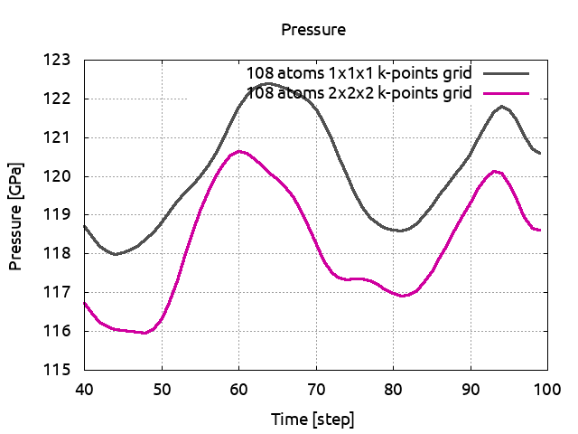
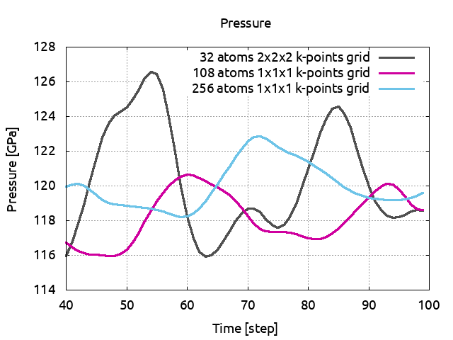
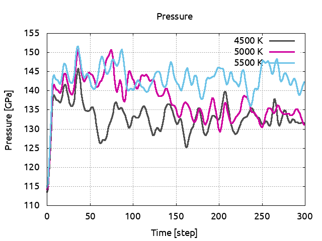

# Parallelism for molecular dynamics

## How to perform Molecular Dynamics calculations using parallelism

This tutorial aims at showing how to perform molecular dynamics with ABINIT
using a parallel computer.
You will learn how to launch molecular dynamics calculation and what are the
main input variables that govern convergence and numerical efficiency.

You are supposed to know already some basics of parallelism in ABINIT,
explained in the tutorial
[A first introduction to ABINIT in parallel](/tutorial/basepar), and
[parallelism over bands and plane waves](/tutorial/paral_bandpw).

This tutorial should take about 1.5 hour to be done and requires to have at
least a 200 CPU core parallel computer.

[TUTORIAL_README]

!!! tip
    
    In this tutorial, most of the images and plots are easily obtained using the post-processing tool
    [qAgate](https://github.com/piti-diablotin/qAgate) or [agate](https://github.com/piti-diablotin/agate), 
    its core engine.
    Any post-process tool will work though !!

## Summary of the molecular dynamics method

The basic idea underlying Ab Initio Molecular Dynamics (AIMD) is to compute
the forces acting on the nuclei from electronic structure calculations that
are performed as the molecular dynamics trajectory is generated.

An AIMD calculation assumes only that the system is composed of nuclei and
electrons, that the Born -Oppenheimer approximation is valid, and that the
dynamics of the nuclei can be treated classically on the ground-state
electronic surface. It allows both equilibrium thermodynamic and dynamical
properties of a system at finite temperature to be computed. For example
melting temperatures, phase transitions, atomic vibrations, structure
factor... but also XANES or IR spectrum can be obtained with this technique.

AIMD deals with supercells of hundred to thousand of atoms (usually, the
larger, the better!). In addition Molecular Dynamics simulations can be
performed for days, weeks or even months! They are therefore very time
consuming and can not be done without the help of high speed and massively
parallel computing.

In the following, when "run ABINIT over *nn* CPU cores" appears, you have to use
a specific command line according to the operating system and architecture of
the computer you are using. This can be for instance: `mpirun -n nn abinit input.abi`
or the use of a specific submission file.

For this tutorial, one needs a working directory.
Why not `Work_paral_moldyn`? e.g. with the commands:

```sh
mkdir -p $ABI_TESTS/tutoparal/Input/Work_paral_moldyn
cd $ABI_TESTS/tutoparal/Input/Work_paral_moldyn
```

## Performing molecular dynamics with ABINIT

There are different algorithms to do molecular dynamics. See the input
variable [[ionmov]], with values 1, 6, 7, 8, 9, 12, 13 and 14. [[dtion]]
controls the ion time step in atomic units of time (one atomic time unit is
2.418884 x 10<sup>-17</sup> seconds, which is the value of Planck's constant in Ha.s).
The default value is 100. You should try several values for [[dtion]] in order
to establish the stable and efficient choice. For example this value should
decrease at high pressure.

Except for the isothermal/isenthalpic ([[ionmov]] 13) ensemble the input
variable [[optcell]] must be 0 (default value).
You have also to define the maximal number of timesteps of the molecular dynamics.

Usually you can set the input variable [[ntime]] to a large value, 5000, since
there is no *end* to a molecular dynamics simulation. You can always stop or
restart the calculation at your convenience by using the input variable [[restartxf]]=-1.

The input file `tmoldyn_01.abi` is an example of a file that contains data for a
molecular dynamics simulation using the isokinetic ensemble [[ionmov]]=12 for fcc aluminum.



Open the `tmoldyn_01.abi` file and look at it carefully. The unit cell is defined at
the end. It is a 2x2x2 fcc supercell containing 32 atoms of Al. [[ionmov]] is
set to 12 for the isokinetic ensemble, and since [[ntime]] is set to 50,
ABINIT will carry on 50 time steps of molecular dynamics. The calculation will
be performed for a temperature of 3000 K, see the key variable [[mdtemp]]. It
gives the initial and final temperatures of the simulation (in Kelvin). The
temperature will change linearly from the initial temperature `mdtemp(1)` at
`itime=1` to the final temperature `mdtemp(2)` at the end of the [[ntime]]
timesteps. Here the temperature will stay constant during the whole simulation.

!!! note

    Note that we use the same temperature for the ions and the electrons:
    [[occopt]] has been set to 3 for a Fermi-Dirac smearing and [[tsmear]] has
    been set to 3000 Kelvin. Nothing prevents you to use different electronic and
    ionic temperature, you just have to know why you are doing so!
    With such a temperature, the number of electronic bands [[nband]] is set to 80.

!!! note
    For AIMD, [[nsym]] is set to 1 to remove the use of symmetries !

Molecular dynamics simulations are always large calculations, dealing with
supercells of hundreds to thousands of atoms. Therefore they are always
performed in parallel. In `tmoldyn_01.in`, [[paral_kgb]] has been set to 1 to
activate the parallelisation over **k**-points, G-vectors and bands. 
The three following keywords give the number of processors for each level of
parallelisation. Since we have only 1 **k**-point in the simulation ([[ngkpt]]
has been set to 1 1 1) [[np_spkpt]] is set to 1,  [[npband]] to 2 with [[bandpp]]=40 (1 unique block),
and [[npfft]] is kept to 1.

Then run the calculation in parallel over 2 CPU cores. You can change the
distribution of processors over the level of parallelisation to try to find
the most efficient one. 
Since molecular dynamics can last for weeks, it is crucial to find the appropriate
distribution to reduce the computational time at the maximum. 
You can use [[timopt]] to get information on time repartition during the simulation.

Now look at the output file. For each iteration you will see the coordinates, the forces, the
velocities and the kinetic and the total energy.

In addition, ABINIT should have generated a `_HIST.nc` file, which contains the
whole history of the molecular dynamics simulation: atomic positions,
velocities, primitive translations, stress tensor, energies... at each time
step. This file will be used to restart the calculation if you want to perform
more time steps or to extract the necessary informations to make use of the
molecular dynamics simulation. 
In `tmoldyn_01.abi` add the keyword [[restartxf]] and set it to -1. 
Run the calculation again, in the same directory. Look at
the new output file. The number of each time step are indicated over the total
number of steps:

    Iteration: (  1/100) Internal Cycle: (1/1)

Since we already performed 50 steps of molecular dynamics, the total number of
time steps are now 100. So the first 50 iterations are from the previous
calculation. You can check that by comparing `tmoldyn_01.abo` and
`tmoldyn_01.abo0001`. There is only one `_HIST.nc` file and it contains the history of
the two calculations.

Now we can calculate and plot several quantities.

We need for that the `diag_moldyn.py` python script.
You can find it in the `$ABI_HOME/doc/tutorial/paral_moldyn_assets`
directory (link [here](paral_moldyn_assets/diag_moldyn.py)).
Run the script as:

    python diag_moldyn.py

!!! warning
    The above script `diag_moldyn.py` uses `python2` and **does not work** with `python3`

You can read (on standard output) the average value and the standard deviation
of the total energy, the temperature and the pressure. You have also generated
several files which contain pressures, energies, stresses, positions and
temperatures. You can plot this files to observe the behavior of the
quantities during the molecular dynamics. Note that 100 time steps is far from
being sufficient to equilibrate physical quantities as pressure. 2000 or 3000
are more common numbers to reach this goal but it would exceed the time
allocated for this tutorial.

!!! tip
    You can use `agate` or `qAgate` to open and visualize the `_HIST.nc` file. In the console, the averages 
    and the standard deviations of several quantities like 
    temperature pressure stresses are automatically displayed.

    You can plot the evolution of pressure with respect to the time step by issuing `:plot P`.
    Replace `:plot` by `:print` or `:data` to save the image or write an ASCII file.

## The convergence on **k**-points and supercell size

In the previous section you have learned to perform molecular dynamics with
abinit. We used a fcc supercell of 32 atoms with only 1 **k**-point. In this
section we will make convergence studies with respect to these parameters.

### Computing the convergence in **k**-points

The files `tmoldyn_02.abi` and `tmoldyn_03.abi` are input files for 2x2x2 and 3x3x3
**k**-points grid respectively (4 and 14 **k**-points in the irreducible Brillouin zone).



Since the parallelisation is the most efficient over the **k**-point level
you should always put [[nkpt]] to the largest possible value before increasing
[[npfft]] and [[npband]]. We have followed this rule in the input files.

If you used the `diag_moldyn.py` script, change the name of the previous file 
PRESS to PRESS01 to save it. 
Run now ABINIT in parallel over 8 CPU cores with `tmoldyn_02.abi` and over 28 CPU
cores with `tmoldyn_03.abi`. 
At the end of each calculation use the `diag_moldyn.py` script and save the results in PRESS02 and PRESS03. 
You can now plot the pressures in term of the **k**-points grids and compare the average values:

!!! tip
    Alternatively, use `agate` or `qagate` to directly produce the following picture
    ```
    :open tmoldyn_01o_HIST.nc
    :plot P hold=true
    :open tmoldyn_02o_HIST.nc
    :plot P 
    :open tmoldyn_03o_HIST.nc
    :plot P  output Kpoints
    ```


As said previously our simulations are too short to be completely convincing
but you can see that you need at least a 2x2x2 **k**-points grid for a 32 atoms
cell. If you have some time, increase ntime to 300 and run again ABINIT.

### Computing the convergence in cell size

We also have to check if our cell is sufficiently large to give reliable
physical quantities. In the previous section we used a 2x2x2 fcc supercell.
`tmoldyn_04.abi` is an input file for a 3x3x3 fcc supercell and therefore
contains 108 atoms. [[nband]] and [[acell]] has been scaled accordingly to
take into account the new size of the cell.

Run now ABINIT in parallel over 8 CPU cores and then `diag_moldyn.py`
(note that the output file is very big, and no reference has been provided for comparison).
Save the pressure to PRESS04.
`tmoldyn_05.abi` has the same cell but a 2x2x2 **k**-points grid (note that the
output file is very big, and no reference has been provided for comparison).
Run it over the adequate number of cores and save the pressure to PRESS05.
Plot now PRESS04 and PRESS05 and compare the average values. 
You will see that for this size of cell, one **k**-point is sufficient.

!!! tip
    Alternatively, use `agate` or `qagate` to directly produce the following picture
    ```
    :open tmoldyn_04o_HIST.nc
    :plot P  hold=true
    :open tmoldyn_05o_HIST.nc
    :plot P
    ```



We are now going to increase again the cell size. With a 4x4x4 fcc cell, the
file `tmoldyn_06.in` has 256 atoms. Of course, [[nband]] and [[acell]] have been
scaled. This calculation should last for 50 min over 32 CPU cores (note that
the output file is very big, and no reference has been provided for
comparison). Run it and save the pressure to PRESS06. Plot now PRESS02,
PRESS04 and PRESS06, remove the first steps and compare the pressure average values:

!!! tip
    Alternatively, use `agate` or `qagate` to directly produce the following picture
    ```
    :open tmoldyn_02o_HIST.nc
    :plot P  hold=true
    :open tmoldyn_05o_HIST.nc
    :plot P
    :open tmoldyn_06o_HIST.nc
    :plot P  
    ```



You can see that even if the pressure was converged in term of **k**-points, the 32
atoms supercell was not sufficient to give a reliable pressure. A 3x3x3
supercell with only 1 **k**-point seems to be the adequate size. You see also
that with a bigger cell, the pressure fluctuations are considerably reduced.

Note that here we made the convergence studies using the pressure as a
criteria. The results can depend on the physical quantity you are looking at,
pressure, temperature, energy, or dynamical matrices by observing the
displacement fluctuations.... Always check if your cell is large enough and
give the corresponding uncertainty.
Also, to reduce the time necessary to do this tutorial we set the value of
[[ecut]] to 3 Ha. This is too small, for Al, it should be closer to 8 Ha.

Finally, here and for simplicity, we just changed the value of [[ngkpt]] to
change the grid of **k**-points. By default, ABINIT uses a [[shiftk]] so the 
one **k**-point generated with a 1x1x1 gid is *not* $\Gamma$!.
To get the $\Gamma$ point only, and decrease the execution time by half, set
[[shiftk]] to `0 0 0` and check the value [[kpt]] in the output file.

## Compute the melting temperature of Al at a given pressure

As an example of what can be done in molecular dynamics, we are going to
calculate the melting temperature of aluminum using the so-called Heat Until
it Melts (HUM) method. In this method the solid phase is heated gradually
until melting occurs. Let's start with a temperature of 4500 K.
To work fast, we use a 32 atoms supercell and 1 **k**-point 
(note that the output file is very big,
and no reference has been provided for comparison).

Run ABINIT in parallel over 2 CPU cores and then `diag_moldyn.py`.
Save the pressure to PRESS71. Plot the atomic positions, you see that at this
temperature, the cell is solid. 

!!! tip
    Alternatively, use `agate` or `qagate` to directly produce the following pictures.
    The positions can be obtains directly with `:plot positions yz` where yz can be replaced by
    xy or xz to change the plan. Note that the atoms on the border are not displayed at contrario
    to the animations.


  <video id="video_md1" controls autoplay loop style="width: 100%;">
  <source src="../paral_moldyn_assets/4500.mp4" type="video/mp4">
  You browser does not support the video tag. Download the file [here](paral_moldyn_assets/4500.mp4).
  </video>

Increase the temperature to 5000 K (do not
forget to also change the electronic temperature with tsmear) and run ABINIT.
Save the pressure and again, look at the positions. The cell is still solid.
Set the temperature to 5500 K. Look at the positions: the ions are moving
across the cell and do not come back to their equilibrium positions. The cell
has melted and is now liquid. Plot the pressures for the three simulations:


 <video id="video_md2" controls autoplay loop style="width: 100%;">
 <source src="../paral_moldyn_assets/5500.mp4" type="video/mp4">
 You browser does not support the video tag. Download the file [here](paral_moldyn_assets/5500.mp4).
 </video>

!!! tip
    To run the three temperatures in 1 run, use [[ndtset]] 3 and specify for each `dtset` the values for [[mdtemp]]
    and [[tsmear]].
    An example of file is given with `tmoldyn_07.abi`. 



!!! tip
    
    To produce the following plot, use `agate` or `qagate` with the following commands
    ```
    :open tmoldyn_07o_DS1_HIST.nc
    :plot P hold=true
    :open tmoldyn_07o_DS2_HIST.nc
    :plot P 
    :open tmoldyn_07o_DS3_HIST.nc
    :plot P 
    ```



You can clearly observe a discontinuous change in pressure due to the volume
difference between the solid and liquid phases. This give a melting
temperature of 5250 K at 132 GPa. 
One has to be very careful. Indeed, in addition to
the crude parameters we used ([[ecut]], [[natom]]...), the HUM method has some
intrinsic drawbacks. In HUM the crystal is heated homogeneously, the melting
initiates in the bulk and this results in an overheating effect.
