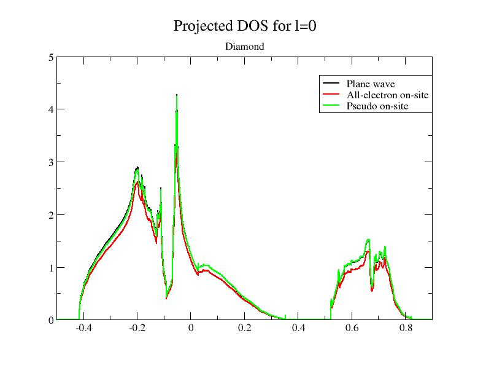
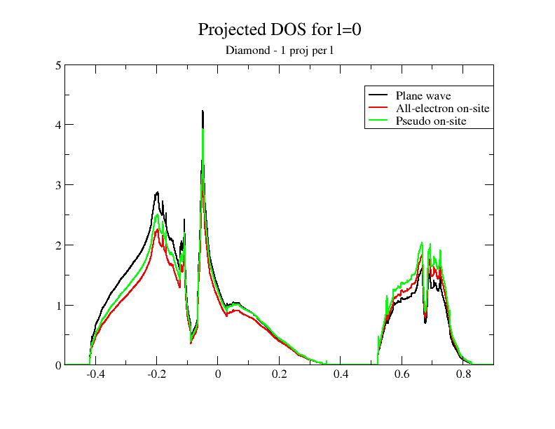
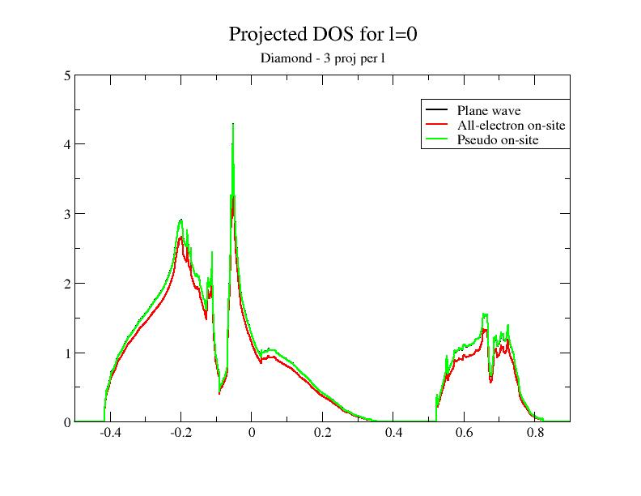
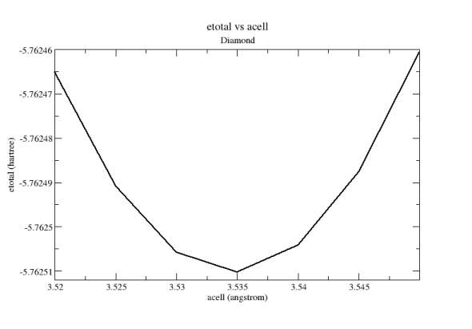

# First tutorial on the Projector Augmented-Wave (PAW) technique

## Projector Augmented-Wave technique, how to use it?

This tutorial aims at showing how to perform a calculation within the **Projector Augmented-Wave** (PAW) method.


You will learn how to launch a PAW calculation and what are the main input
variables that govern convergence and numerical efficiency.
You are supposed to know how to use ABINIT with _Norm-Conserving PseudoPotentials_ (NCPP).

This tutorial should take about 1.5 hour.

[TUTORIAL_README]

## 1. Summary of the PAW method

The **Projector Augmented-Wave** approach has been introduced by Peter Blochl in 1994:

> The Projector Augmented-Wave method is an extension of
  augmented wave methods and the pseudopotential approach, which combines their
  traditions into a unified electronic structure method".
  It is based on a linear and invertible transformation (the PAW transformation)
  that connects the "true" wavefunctions $\Psi$ with "auxiliary" (or "pseudo") soft
  wavefunctions $\tPsi$:

\begin{equation} \label{eq:PAW_true_wavefunction}
|\Psi\rangle = |\tPsi\rangle + \sum_i \sum_a \Bigl(|\phi_i^a\rangle - |\tphi_i^a\rangle \Bigr)
\,\langle \tprj_i^a|\tPsi\rangle = |\tPsi\rangle + \sum_a |\Psi^1_a\rangle - |\tPsi_a^1\rangle
\end{equation}

This relation is based on the definition of _augmentation regions_
(atomic spheres of radius $r_c$), around the atoms in which the partial
waves $|\phi_i\rangle$ form a basis of atomic wavefunctions; $|\tphi_i\rangle$ are *pseudized*
partial waves (obtained from $|\phi_i\rangle$), and $|\tprj_i\rangle$ are dual functions of
the $|\tphi_i\rangle$ called projectors.
It is therefore possible to write every quantity depending on $\Psi_n$ (density,
energy, Hamiltonian) as a function of $\tPsi_n$ and to find $\tPsi_n$ by solving self-consistent equations.

The PAW method has two main advantages:

1. From $\tPsi$, it is always possible to obtain the true *all electron* wavefunction $\Psi$,
2. The convergence is comparable to an _UltraSoft PseudoPotential_ (USPP) one.

From a practical point of view, a PAW calculation is
rather similar to a Norm-Conserving PseudoPotential one.
Most noticeably, one will have to use a special atomic data file (**PAW dataset**) that contains the
$\phi_i$, $\tphi_i$ and $\tprj_i$ and that plays the same role as a pseudopotential file.

!!! tip

    It is highly recommended to read the following papers to understand correctly
    the basic concepts of the PAW method: [[cite:Bloechl1994]] and [[cite:Kresse1999]].
    The implementation of the PAW method in ABINIT is detailed in [[cite:Torrent2008]],
    describing specific notations and formulations

## 2. Using PAW with ABINIT

*Before continuing, you might consider to work in a different subdirectory as
for the other tutorials. Why not Work_paw1?
In what follows, the name of files are mentioned as if you were in this subdirectory.
All the input files can be found in the `$ABI_TESTS/tutorial/Input` directory.*

!!! important

    You can compare your results with reference output files located in
    `$ABI_TESTS/tutorial/Refs` and `$ABI_TESTS/tutorial/Refs/tpaw1_addons`
    directories (for the present tutorial they are named `tpaw1_*.abo`).

The input file *tpaw1_1.in* is an example of a file to be used to compute
the total energy of diamond at the experimental volume (within the
_LDA exchange-correlation functional_). You might get
the corresponding output file (it is available in *$ABI_TESTS/tutorial/Refs/tpaw1_1.abo).
Copy the files *tpaw1_1.in* in your work directory,

```sh
cd $ABI_TESTS/tutorial/Input
mkdir Work_paw1
cd Work_paw1
cp ../tpaw1_1.in .
```

and execute:

    abinit  tpaw1_1.in > log 2> err &

The code should run very quickly.
In the meantime, you can read the input file and see that there is no PAW input variable.



Now, open the *tpaw1_1.in* file and change the last line; replace the *6c.pspnc* file with *C.LDA_PW-JTH.xml*.
Run the code again:

    abinit tpaw1_1.in > log 2> err &

Your run should stop almost immediately!
The input file, indeed, is missing the mandatory argument [[pawecutdg]]!!

Add the line:

    pawecutdg 50

to *tpaw1_1.in* and run it again. Now the code completes successfully.

!!! note

    The time needed for the PAW run is greater than the time needed for
    the Norm-Conserving PseudoPotential run; indeed, at constant value of plane
    wave cut-off energy [[ecut]] PAW requires more computational resources:

    * the *on-site* contributions have to be computed,
    * the nonlocal contribution of the PAW dataset uses 2 projectors per angular momentum,
      while the nonlocal contribution of the Present Norm-Conserving Pseudopotential uses only one.

    However, as the plane wave cut-off energy required by PAW is much smaller than
    the cut-off needed for the Norm-Conserving PseudoPotential (see next section),
    **a PAW calculation will actually require less CPU time**.

Let's open the output file (*tpaw1_1.abo*) and have a look inside.
Compared to an output file for a Norm-Conserving PseudoPotential run, an
output file for PAW contains the following specific topics:

- At the beginning of the file,
some specific default PAW input variables ([[ngfftdg]], [[pawecutdg]], and
[[useylm]]), mentioned in the section:

```
    -outvars: echo values of preprocessed input variables --------
```

- The use of two FFT grids, mentioned in:

```
Coarse grid specifications (used for wave-functions):

getcut: wavevector=  0.0000  0.0000  0.0000  ngfft=  18  18  18
        ecut(hartree)=     15.000   => boxcut(ratio)=   2.17276

Fine grid specifications (used for densities):

getcut: wavevector=  0.0000  0.0000  0.0000  ngfft=  32  32  32
        ecut(hartree)=     50.000   => boxcut(ratio)=   2.10918
```


- A specific description of the PAW dataset (you might follow the tutorial [PAW2](paw2),
devoted to the building of the PAW atomic data, for a complete understanding of the file):

```
Pseudopotential format is: paw10
 basis_size (lnmax)=  4 (lmn_size=  8), orbitals=   0   0   1   1
 Spheres core radius: rc_sph= 1.50736703
 1 radial meshes are used:
  - mesh 1: r(i)=AA*[exp(BB*(i-1))-1], size= 500 , AA= 0.33742E-02 BB= 0.20146E-01
 Shapefunction is SIN type: shapef(r)=[sin(pi*r/rshp)/(pi*r/rshp)]**2
 Radius for shape functions =  1.28249356
 mmax=  500
 Radial grid used for partial waves is grid 1
 Radial grid used for projectors is grid 1
 Radial grid used for (t)core density is grid 1
 Radial grid used for Vloc is grid 1
 Radial grid used for LDA-1/2 potential is grid 1
 Radial grid used for pseudo valence density is grid 1
```


- After the SCF cycle section:
The value of the integrated compensation charge evaluated by two different
numerical methodologies; 1- computed in the _augmentation regions_
on the "spherical" grid, 2- computed in the whole simulation cell on the
"FFT" grid...
A discussion on these two values will be done in a forthcoming section.

```
PAW TEST:
==== Compensation charge inside spheres ============
The following values must be close to each other ...
 Compensation charge over spherical meshes =      0.263855884339479
 Compensation charge over fine fft grid    =      0.263852893893634
```


- Information concerning the non-local term (pseudopotential strength $D_{ij}$)
and the spherical density matrix (augmentation wave occupancies $\rho_{ij}$):

```
==== Results concerning PAW augmentation regions ====

Total pseudopotential strength Dij (hartree):
Atom #  1
  ...
Atom #  2
  ...

Augmentation waves occupancies Rhoij:
Atom #  1
 ...
Atom #  2
 ...
```


- At the end of the file we find the decomposition of the total energy both
by direct calculation and double counting calculation:

```
--------------------------------------------------------------------------------
 Components of total free energy (in Hartree) :

    Kinetic energy  =  6.90446929441886E+00
    Hartree energy  =  9.63708091533161E-01
    XC energy       = -4.29580646918379E+00
    Ewald energy    = -1.27864121210521E+01
    PspCore energy  =  9.19865486989434E-01
    Loc. psp. energy= -4.67413594752577E+00
    Spherical terms =  1.44220243759604E+00
    >>>>>>>>> Etotal= -1.15261092272241E+01

 "Double-counting" decomposition of free energy:
    Band energy     =  3.07962181105384E-01
    Ewald energy    =-1.27864121210521E+01
    PspCore energy  =  9.19865486989434E-01
    Dble-C XC-energy= -7.39239833326780E-01
    Spherical terms =  7.71714533951319E-01
    >>>> Etotal (DC)= -1.15261097523327E+01

  >Total energy in eV           = -3.13641382594284E+02
  >Total DC energy in eV        = -3.13641396883215E+02
```

!!! Note
    The PAW total energy is not the equal to the one obtained in the Norm-Conserving PseudoPotential case:
    in the Norm-Conserving PseudoPotential case, the energy reference has been arbitrarily
    modified by the pseudopotential construction procedure.
    Comparing total energies computed with different PAW potentials is more meaningful: most of
    the parts of the energy are calculated exactly, and in general you should be
    able to compare numbers for (valence) *energies* between different PAW potentials or different codes.

## 3. Convergence with respect to the plane-wave basis cut-off

As in the usual Norm-Conserving PseudoPotential case, the critical convergence parameter is the cut-off
energy defining the size of the plane-wave basis.

###3.a. Convergence with respect to ecut in the Norm-Conserving PseudoPotential case##

The input file *tpaw1_2.in* contains data to be used to compute the convergence in ecut
for diamond (at experimental volume). There are 9 datasets, with increasing [[ecut]] values
from 8 Ha to 24 Ha.
You might use the *tpaw1_2.in* file (with a standard Norm-Conserving
PseudoPotential), and run:

    abinit tpaw1_2.in > log 2> err &

You should obtain the following _total energy_ values (see *tpaw1_2.abo*):

    etotal1  -1.1628880677E+01
    etotal2  -1.1828052470E+01
    etotal3  -1.1921833945E+01
    etotal4  -1.1976374633E+01
    etotal5  -1.2017601960E+01
    etotal6  -1.2046855404E+01
    etotal7  -1.2062173253E+01
    etotal8  -1.2069642342E+01
    etotal9  -1.2073328672E+01

You can check that the etotal convergence (at the 1 mHartree level) is not
achieved for ecut = 24 Hartree.

###3.b. Convergence with respect to ecut in the PAW case###

Use the same input files as in section **1.a**.
Again, modify the last line of *tpaw1_2.in*, replacing the *6c.pspnc* file by *C.LDA_PW-JTH.xml*.
Run the code again and open the output file. You should obtain the values:

    etotal1    -1.1404413200E+01
    etotal2    -1.1496546303E+01
    etotal3    -1.1518699851E+01
    etotal4    -1.1524923431E+01
    etotal5    -1.1526676260E+01
    etotal6    -1.1526950267E+01
    etotal7    -1.1526965855E+01
    etotal8    -1.1527043191E+01
    etotal9    -1.1527176114E+01

 

You can check that:

The _etotal_ convergence (at 1 mHartree) is achieved for _14 <= ecut <= 16 Hartree_
   (_etotal5_ is within 1 mHartree of the final value);

With the same input parameters, for diamond, **a PAW calculation needs a lower cutoff,
compared to a calculation with NCPPs**.

## 4. Convergence with respect to the double grid FFT cut-off

In a NCPP calculation, the _plane wave_ density grid should be (at least) twice bigger
than the wavefunctions grid, in each direction.
In a PAW calculation, the _plane wave_ density grid is tunable
thanks to the input variable [[pawecutdg]] (PAW: ECUT for Double Grid). This
is mainly needed to allow the mapping of densities and potentials, located
in the augmentation regions (spheres), onto the global FFT grid.
The number of points of the Fourier grid located in the spheres must be large
enough to preserve a minimal accuracy. It is determined from the cut-off energy
[[pawecutdg]]. An alternative is to use directly the input variable
[[ngfftdg]]. One of the most sensitive objects affected by this "grid
transfer" is the compensation charge density; its integral over the
augmentation regions (on spherical grids) must cancel with its integral over
the whole simulation cell (on the FFT grid).

Use now the input file *tpaw1_3.in* .
The only difference with the *tpaw1_2.in* file is that [[ecut]] is fixed to 12
Ha, while [[pawecutdg]] runs from 12 to 39 Ha.



Launch ABINIT with these files; you should obtain the values (file *tpaw1_3.abo*):

    etotal1    -1.1518150865E+01
    etotal2    -1.1518273022E+01
    etotal3    -1.1518608846E+01
    etotal4    -1.1518744552E+01
    etotal5    -1.1518729256E+01
    etotal6    -1.1518683931E+01
    etotal7    -1.1518660738E+01
    etotal8    -1.1518667056E+01
    etotal9    -1.1518682154E+01
    etotal10   -1.1518697442E+01


We see that the variation of the energy wit respect to the [[pawecutdg]] parameter is well
below the 1 mHa level.
In principle, it should be sufficient to choose
pawecutdg = 12 Ha in order to obtain an energy change lower than 1 mHa.
In practice, it is better to keep a security margin. Here, for pawecutdg = 24 Ha
(5th dataset), the energy change is lower than 0.001 mHa: this choice will be more than enough.

!!! note

    Note the steps in the convergence. They are due to sudden
    changes in the grid size (see the output values for  [[ngfftdg]]) which do not
    occur for each increase of [[pawecutdg]]. To avoid troubles due to these
    steps, it is better to choose a value of [[pawecutdg]] slightly higher.

The convergence of the compensation charge has a similar behaviour; it is
possible to check it in the output file, just after the SCF cycle by looking at:

```
PAW TEST:
==== Compensation charge inside spheres ============
 The following values must be close to each other ...
 Compensation charge over spherical meshes =      0.252496383260266
 Compensation charge over fine fft grid    =      0.252495562362116
```

The two values of the integrated compensation charge density must be close to each other.
Note that, for numerical reasons, they cannot be exactly the same (integration
over a radial grid does not use the same scheme as integration over a FFT grid).

_Additional test_:
We want now to check the convergence with respect to [[ecut]] with a fixed value [[pawecutdg]] = 24 Ha.
Let's modify *tpaw1_2.in* file, setting pawecutdg to 24 Ha, and let's launch ABINIT again.
You should obtain the values:

    etotal1    -1.1404413200E+01
    etotal2    -1.1496546303E+01
    etotal3    -1.1518699851E+01
    etotal4    -1.1524923431E+01
    etotal5    -1.1526676260E+01
    etotal6    -1.1526950267E+01
    etotal7    -1.1526965855E+01
    etotal8    -1.1527043191E+01
    etotal9    -1.1527176114E+01


You can check again that:

The _etotal_ convergence (at the 1 mHartree level) is achieved for 14 <= ecut <= 16 Hartree;


!!! Note

    Associated with the input variable [[pawecutdg]] is the input variable
    [[ngfftdg]]: it defines the size of the FFT grid associated with [[pawecutdg]].
    Note that [[pawecutdg]] is only useful to define the FFT grid for the density
    in a convenient way. You can therefore tune directly [[ngfftdg]] to define the
    size of the FFT grid for the density.

!!! Note

    Although [[pawecutdg]] should always be checked, in practice, a common use it
    to put it bigger than [[ecut]] and keep it constant during all calculations.
    Increasing [[pawecutdg]] slightly changes the CPU execution time, but above
    all it is memory-consuming.
    Note that, if [[ecut]] is already high, there is no need for a high [[pawecutdg]].

!!! Important

    When testing [[ecut]] convergency, [[pawecutdg]] has to remain
    constant to obtain consistent results.

## 5. Plotting PAW contributions to the Density of States (DOS)

We now use the input file *tpaw1_4.in* file.
ABINIT is used to compute the Density Of State (DOS)
(see the [[prtdos]] keyword in the input file).
Also note that more k-points are used in order to increase the accuracy of the DOS.
[[ecut]] is set to 12 Ha, while [[pawecutdg]] is 24 Ha.



Launch the code with these files; you should obtain the *tpaw1_4.abo* and the DOS file (*tpaw1_4o_DOS*):

    abinit tpaw1_4.in > log 2> err &

You can plot the DOS file if you want; for this purpose, use a graphical tool
and plot column 3 with respect to column 2. If you use the |xmgrace| tool, launch:

    xmgrace -block tpaw1_4o_DOS -bxy 1:2

At this stage, you have a usual Density of State plot; nothing specific to PAW.

Now, edit the *tpaw1_4.in* file, comment the "prtdos 1" line, and uncomment (or add):

    prtdos 3  pawprtdos 1 natsph 1 iatsph 1 ratsph 1.51

[[prtdos]] 3 now requires the output of the projected DOS;
[[natsph]] 1  [[iatsph]] 1  [[ratsph]] 1.51 selects the first carbon atom as
the center of projection, and sets the radius of the projection area to 1.51
atomic units (this is exactly the radius of the PAW augmentation regions:
generally the best choice).
The [[pawprtdos]] 1 is specific to PAW.
With this option, ABINIT should compute all the contributions to the projected DOS.

Let us remember that:

\begin{equation*}
|\Psi\rangle = |\tPsi\rangle + \sum_i \sum_a \Bigl(|\phi_i^a\rangle - |\tphi_i^a\rangle \Bigr)
\,\langle \tprj_i^a|\tPsi\rangle
\end{equation*}

Within PAW, the total projected DOS has 3 contributions:

1. The smooth plane-waves (PW) contribution (from $|\tPsi\rangle$),
2. The all-electron on-site (AE) contribution (from $\langle \tprj^a_i|\tPsi\rangle |\phi_i^a\rangle$),
3. The pseudo on-site (PS) contribution (from $\langle \tprj^a_i|\tPsi\rangle |\tphi_i^a\rangle$).

Launch ABINIT again (with the modified input file).
You get a new DOS file, named *tpaw1_4o_DOS_AT0001*.
You can edit it and look inside; it contains the 3 PAW contributions
(mentioned above) for each angular momentum. In the diamond case, only $l = 0$ and
$l = 1$ momenta are to be considered.

Now, plot the file, using the 7th, 12th and 17th columns with respect to the
2nd one; it plots the 3 PAW contributions for $l = 0$ (the total DOS is the sum of
the three contributions).
If you use the |xmgrace| tool, launch:

    xmgrace -block tpaw1_4o_DOS_AT0001 -bxy 1:7 -bxy 1:12 -bxy 1:17

You should get this:



As you can see, the smooth PW contribution and the PS on-site contribution are close. At basis completeness,
they should cancel; we could approximate the DOS by the AE on-site part taken alone.
That's exactly the purpose of the [[pawprtdos]] = 2 option; in that case, only the AE
on-site contribution is computed and given as a good approximation of the
total projected DOS. The main advantage of this option is that the computing time is
greatly reduced (the DOS is instantaneously computed).

However, as you will see in the next section, this approximation is only valid when:

1. The $\tphi_i$ basis is complete enough
2. The electronic density is mainly contained in the sphere defined by [[ratsph]].

## 6. Testing the completeness of the PAW partial wave basis

In the previous section we used a "standard" PAW dataset, with 2
_partial waves_ per angular momentum. It is generally the best compromise
between the completeness of the partial wave basis and the efficiency of the
PAW dataset (the more _partial waves_ you have, the longer the CPU time used by ABINIT is).

Let's have a look at the *$ABI_PSPDIR/C.LDA_PW-JTH.xml* file.
The tag "<valence_states" has 4 "<state" lines. This indicates the number of partial waves (4) and their $l$ angular momentum.
In the present file, there are `two l = 0 partial waves and two l = 1 partial waves`.

Now, let's open the *\$ABI_PSPDIR/C.LDA_PW-2proj-JTH.xml*
and *\$ABI_PSPDIR/C.LDA_PW-6proj-JTH.xml* files.
In the first file, only one _partial wave_ per $l$ is present; in the second one, 3 _partial
waves_ per $l$ are present.
The completeness of the partial wave basis increases when you use *C.LDA_PW-2proj-JTH.xml*,
*C.LDA_PW-JTH.xml* and *C.LDA_PW-6proj-JTH.xml*.

Now, let us plot the DOS for the two new PAW datasets.

1. Save the existing *tpaw1_4o_DOS_AT0001* file, naming it f.i. *tpaw1_4o_4proj_DOS_AT0001*.
2. Open the *tpaw1_4.in* file and modify it in order to use the *C.LDA_PW-2proj-JTH.xml* PAW dataset.
3. Launch ABINIT.
4. Save the new *tpaw1_4o_DOS_AT0001* file, naming it f.i. *tpaw1_4o_2proj_DOS_AT0001*.
5. Open the *tpaw1_4.in* file and modify it in order to use the *C.LDA_PW-6proj-JTH.xml* PAW dataset.
6. Launch ABINIT again.
7. Save the new *tpaw1_4o_DOS_AT0001* file, naming it f.i. *tpaw1_4o_6proj_DOS_AT0001*.

Then, plot the contributions to the projected DOS for the two new DOS files.
You should get:





Adding the DOS obtained in the previous section to the comparison, you
immediately see that the superposition of the plane wave part DOS (PW) and the PS
on-site DOS depends on the completeness of the partial wave basis!

Now, you can have a look at the 3 output files (one for each PAW dataset)
for instance in a comparison tool.
A way to estimate the completeness of the partial wave basis is to compare
derivatives of total energy; if you look at the stress tensor:

```
For the 2 `partial-wave` basis:   2.88568213E-04  2.88568213E-04 2.88568213E-04  0.  0.  0.
For the 4 `partial-wave` basis:   4.97807406E-04  4.97807406E-04 4.97807406E-04  0.  0.  0.
For the 6 `partial-wave` basis:   5.38983766E-04  5.38983766E-04 5.38983766E-04  0.  0.  0.
```

The 2 *partial-wave* basis is clearly not complete; the 4 partial-wave basis results are correct.
Such a test is useful to estimate the precision we can expect on the stress tensor
(at least due to the partial wave basis completeness).

You can compare other results in the 3 output files: total energy, eigenvalues, occupations...

Note: if you want to learn how to generate PAW datasets with different *partial wave* basis,
you might follow the [tutorial on generating PAW datasets(PAW2)](paw2).

## 7. Checking the validity of PAW results

The validity of our computation has to be checked
by comparison, on known structures, with known results.
In the case of diamond, lots of computations and experimental results exist.
Very important remark: the validity of PAW calculations (**completeness of plane wave basis and
partial wave basis**) should always be checked by comparison
with **all-electrons** computations or with other existing PAW results;
it should not be done by comparison with experimental results.
As the PAW method has the same accuracy than all-electron methods, results should be very close.

In the case of diamond, all-electron results can be found f.i. in [[cite:Holzwarth1997]].
All-electron equilibrium parameters for diamond (within _Local Density Approximation_) obtained
with the FP-LAPW WIEN2K code are:

    a0 = 3.54 angstrom
    B = 470 GPa

Experiments give:

    a0 = 3.56 angstrom
    B = 443 GPa

Let's test with ABINIT.
We use now the input file *tpaw1_5.in* file and we run
ABINIT to compute values of _etotal- for several cell parameters
around 3.54 angstrom, using the standard PAW dataset.



    abinit tpaw1_5.in > log 2> err &

From the *tpaw1_5.abo* file, you can extract the 7 values of _acell_ and 7 values
of _etotal_, then put them into a file and plot it with a graphical tool.
You should get:



From this curve, you can extract the cell values of $a_0$ and $B$
(with the method of your choice, for example by a Birch-Murnhagan spline fit).
You get:

    a0 = 3.53 angstrom B = 469.5 GPa

These results are in excellent agreement with FP-LAPW ones!

## 8. Additional comments about PAW in ABINIT

### 8.a. Overlap of PAW augmentation regions###

In principle, the PAW formalism is only valid for non-overlapping augmentation spherical
regions. But, in usual cases, a small overlap between spheres is acceptable.
By default, ABINIT checks that the distances between atoms are large enough to
avoid overlap; a "small" voluminal overlap of 5% is accepted by default. This
value can be tuned with the [[pawovlp]] input keyword.
The overlap check can even be by-passed with [[pawovlp]]=-1 (not recommended!).

!!! warning

    While a small overlap can be acceptable for the
    augmentation regions, an overlap of the compensation charge densities has to
    be avoided. The compensation charge density is defined by a radius (named
    $r_{shape}$ in the PAW dataset) and an analytical shape function. The overlap
    related to the compensation charge radius is checked by ABINIT and a WARNING
    is eventually printed.

Also note that you can control the compensation charge radius and shape
function while generating the PAW dataset (see [tutorial on generating PAW datasets(PAW2)](paw2)).


### 8.b. Mixing scheme for the Self-Consistent cycle; decomposition of the total energy###

The use of an efficient **mixing scheme** in the self-consistent loop is a crucial
point to minimize the number of steps to achieve convergence.
This mixing can be done on the potential or on the density. By default, in a
Norm-Conserving PseudoPotential calculation, the mixing is done on the potential;
but, for technical reasons, this choice is not optimal for PAW calculations.
Thus, by default, the mixing is done on the density when PAW is activated.
The mixing scheme can be controlled by the [[iscf]] variable (see the different options of this input variable).
To compare both schemes, you can edit the *tpaw1_1.in* file and try [[iscf]] = 7
or 17 and compare the behaviour of the SC cycle in both cases; as you can see, the
final _total energy_ is the same but the way to reach it is completely different.

Now, have a look at the end of the file and focus on the `Components of total
free energy`; the total energy is decomposed according to two different schemes (`direct` and `double counting`);
at very high convergence of the SCF cycle the potential/density
residual is very small and these two values should be the same. But it has been observed that
the converged value was reached more rapidly by the `direct` energy, when the
mixing is on the potential, and by the `double counting` energy when the mixing
is on the density. Thus, by default, in the output file is to print the direct
energy when the mixing is on the potential, and the double counting energy
when the mixing is on the density.

Also note that PAW _partial waves occupancies_ $\rho_{ij}$ also are
mixed during the SC cycle; by default, the mixing is done in the same way as the density.

### 8.c. PAW+U for correlated materials###

If the system under study contains strongly correlated electrons, the `DFT+U`
method can be useful. It is controlled by the  [[usepawu]], [[lpawu]],
[[upawu]] and [[jpawu]] input keywords.
Note that the formalism implemented in ABINIT is approximate, i.e. it is only valid if:

1. The $\tphi^a_i$ basis is complete enough;
2. The electronic density is mainly contained in the PAW sphere.

The approximation done here is the same as the one explained in the 5th
section of this tutorial: considering that smooth PW contributions and PS
on-site contributions are closely related, only the AE on-site contribution is
computed; it is indeed a very good approximation.

Converging a _Self-Consistent Cycle_, or ensuring the global minimum is reached,
with PAW+U is sometimes difficult. Using [[usedmatpu]] and [[dmatpawu]] can help.

### 8.d. Printing volume for PAW###

If you want to get more detailed output concerning the PAW computation, you
can use the [[pawprtvol]] input keyword.
It is particularly useful to print details about _pseudopotential strength_
$D_{ij}$ or _partial waves occupancies_ $\rho_{ij}$.

### 8.e. Additional PAW input variables###

Looking at the [[varset:paw|PAW variable set]], you can find the description
of additional input keywords related to PAW.
They are to be used when tuning the computation, in order to gain accuracy or save CPU time.

!!! Warning

    In a standard computation, these variables should not be modified!

**Variables that can be used to gain accuracy (in ascending order of importance)**

[[pawxcdev]]
:   Control of the accuracy of exchange-correlation on-site potentials
    (try [[pawxcdev]] = 2 to increase accuracy).

[[mqgriddg]]
: Control of the accuracy of spline fits to transfer densities/potentials from FFT grid to spherical grid.

[[pawnzlm]]
: Control how the symmetries are applied to compute the moments of spherical densities.

**Variables that can be used to save memory (in ascending order of importance)**

[[pawstgylm]]
: Control of the storage of spherical harmonics around atoms.

[[pawmixdg]]
: Control the grid used to mix the potential/density during SCF cycles.

[[pawlcutd]]
: Control of the number of angular momenta taken into account in on-site densities.

[[pawlmix]]
: Control of the number of $\rho_{ij}$ components to be mixed during SCF cycle.

**Variables that can be used to save CPU time (in ascending order of importance)**

[[pawnhatxc]]
: Control of the numerical treatment of gradients in case of GGA.

[[pawstgylm]]
: Control of the storage of spherical harmonics around atoms.

[[pawlcutd]]
: Control of the number of angular momenta taken into account in on-site densities.

[[pawlmix]]
: Control of the number of $\rho_{ij}$ components to be mixed during SCF cycle.

[[bxctmindg]]
: Can be used to decrease the size of fine FFT grid for a given value of [[pawecutdg]].

!!! Note
    The above list is not exhaustive.
    Several other keywords can be used to tune ABINIT PAW calculations.
