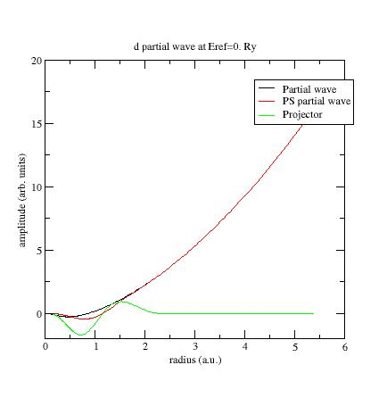
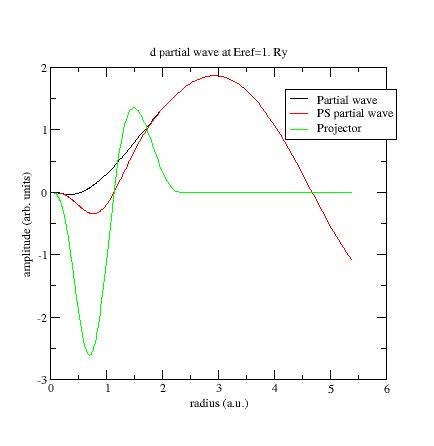
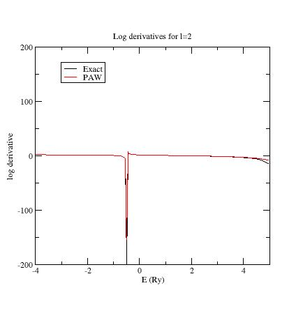
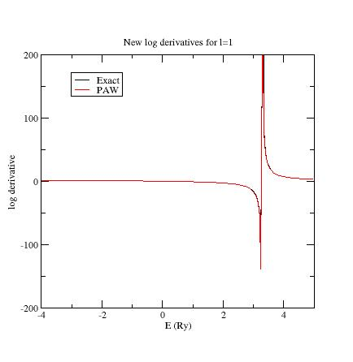
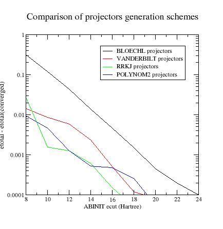
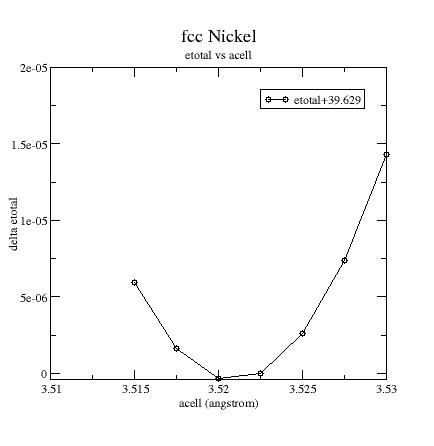
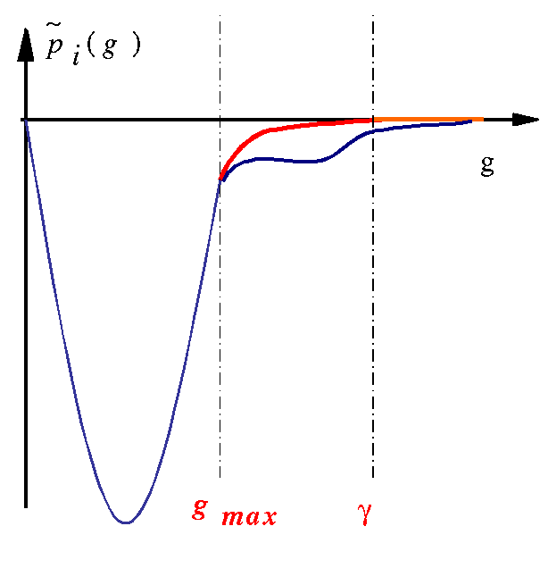
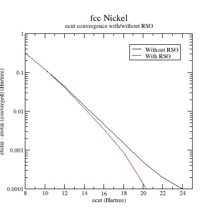

# Second tutorial on the Projector Augmented-Wave (PAW) technique

## Generation of PAW atomic datasets

This tutorial aims at showing how to compute atomic datasets for the Projector Augmented-Wave (PAW) method.

You will learn how to generate these atomic datasets and how to control their softness and transferability.
You already should know how to use ABINIT in the PAW case (see the tutorial [PAW1](paw1) ).

This tutorial should take about 2h00.

[TUTORIAL_READMEV9]

## 1. The PAW atomic dataset - introduction

The PAW method is based on the definition of spherical augmentation
regions of radius $r_c$ around the atoms of the system in which a basis of
atomic **partial-waves** $\phi_i$, of **pseudized partial-waves** $\tphi_i$, and of **projectors** $\tprj_i$
(dual to $\tphi_i$) have to be defined. This set of _partial-waves_ and _projectors_
functions (plus some additional atomic data) are stored in a so-called **PAW dataset**.
A PAW dataset has to be generated for each atomic species in order
to reproduce atomic behavior as accurate as possible while requiring minimal
CPU and memory resources in executing ABINIT for the crystal simulations.
These two constraints are obviously conflicting.

The PAW dataset generation is the purpose of this tutorial.
It is done according the following procedure (all parameters that define a PAW dataset are in bold):

  1. Choose and define the concerned chemical species (**name** and **atomic number**).

  2. Solve the atomic all-electrons problem in a given atomic configuration.
  The atomic problem is solved within the DFT formalism, using an **exchange-correlation functional**
  and either a **Schrodinger** (default) or **scalar-relativistic** approximation.
  This _spherical problem_ is solved on a **radial grid**.
  The atomic problem is solved for a given **electronic configuration** that can be an ionized/excited one.

  3. Choose a set of electrons that will be considered as frozen around the nucleus (**core electrons**).
  The others electrons are **valence** ones and will be used in the PAW basis.
  The **core density** is then deduced from the core electrons wave functions.
  A **smooth core density** equal to the core density outside a given $r_{core}$ matching radius is computed.

  4. Choose the size of the PAW basis (**number of partial-waves and projectors**).
  Then choose the partial-waves included in the basis. The later can be atomic eigen-functions
  related to valence electrons (**bound states**) and/or **additional atomic functions**, solution
  of the wave equation for a given $l$ quantum number at arbitrary **reference energies** (unbound states).

  5. Generate pseudo partial-waves (smooth partial-waves build with a **pseudization scheme** and
  equal to partial-waves outside a given $r_c$ matching radius) and associated projector functions.
  Pseudo partial-waves are solutions of the PAW Hamiltonian deduced from the atomic Hamiltonian
  by pseudizing the effective potential (a **local pseudopotential** is built and equal to effective
  potential outside a $r_{Vloc} matching radius). Projectors and partial-waves are then
  orthogonalized with a chosen **orthogonalization scheme**.

  6. Build a **compensation charge density** used later in order to retrieve the total charge of the atom.
  This compensation charge density is located inside the PAW spheres and based on an **analytical shape function**
  (which analytic form and localization radius $r_{shape}$ can be chosen).

The user can choose between two PAW dataset generators to produce atomic files directly readable by ABINIT.
The first one is the PAW generator [[http://users.wfu.edu/natalie/papers/pwpaw/man.html|ATOMPAW]] (originally by _N. Holzwarth_) and
the second one is the [[http://www.physics.rutgers.edu/~dhv/uspp| Ultra-Soft USPP]] generator (originally written by _D. Vanderbilt_). In this tutorial, we concentrate only on `ATOMPAW`.

It is highly recommended to refer to the following papers to understand
correctly the generation of PAW atomic datasets:

1. "Projector augmented-wave method" - [[cite:Bloechl1994]]

2. "A projector Augmented Wave (PAW) code for electronic structure" - [[cite:Holzwarth2001]]

3. "From ultrasoft pseudopotentials to the projector augmented-wave method" - [[cite:Kresse1999]]

4. "Electronic structure packages: two implementations of the Projector Augmented-Wave (PAW) formalism" - [[cite:Torrent2010]]

5. "Notes for revised form of atompaw code" (by N. Holzwarth) - [[http://www.wfu.edu/%7Enatalie/papers/pwpaw/notes/atompaw/atompawEqns.pdf|PDF]]

## 2. Use of the generation code

*Before continuing, you might consider to work in a different subdirectory as
for the other tutorials. Why not `Work_paw2`?*

```sh
cd $ABI_TESTS/tutorial/Input
mkdir Work_paw2
cd Work_paw2
```

You have now to install the `ATOMPAW` code. Try to type in your browser:

     https://users.wfu.edu/natalie/papers/pwpaw/atompaw-4.1.0.6.tar.gz

Then, download the file, unzip and untar it.Go into the directory "doc", open the file "atompaw-usersguide.pdf". Go p.3 and follow the instructions to compile atompaw.


!!! Note
    In the following, we name *atompaw* the `ATOMPAW` executable.

**How to use `ATOMPAW`?**

The following process will be applied to Ni in the next paragraph:

1. Edit an input file in a text editor (content of input explained [here](paw2_assets/atompaw-usersguide.pdf))
2. Run: *atompaw < inputfile*

Partial waves $\phi_i$, PS partial-waves $\tphi_i$ and projectors $\tprj_i$ are given in `wfn.i` files.
Logarithmic derivatives from atomic Hamiltonian and PAW Hamiltonian
resolutions are given in `logderiv.l` files.
A summary of the atomic _all-electron_ computation and PAW dataset properties
can be found in the `Atom_name` file (`Atom_name` is the first parameter of the input file).

Resulting PAW dataset is contained in:

`Atom_name.XCfunc.xml` file
:   Normalized XML file according to the
    [PAW- XML specifications](https://esl.cecam.org/Paw-xml).

`Atom_name.XCfunc-paw.abinit` file
:   Proprietary legacy format for ABINIT


## 3. First (and basic) PAW dataset for Nickel

Our test case will be nickel; electronic configuration: $[1s^2 2s^2 2p^6 3s^2 3p^6 3d^8 4s^2 4p^0]$.

In a first stage, copy a simple input file for `ATOMPAW` in your working directory
(find it in *\$\ABI_HOME/doc/tutorial/paw2/paw2_assets/Ni.atompaw.input1*).
Edit this file.



This file has been built in the following way:

1. All-electron calculation parameters:
    * 1st line: define the <span style="color:green">material</span>.
```
    Ni 28
```
    * 2nd line: choose the <span style="color:green">exchange-correlation functional</span> (LDA-PW or GGA-PBE)
      and select a scalar-relativistic <span style="color:green">wave equation</span>
      (nonrelativistic or scalarrelativistic)
      and a (2000 points) logarithmic <span style="color:green">grid</span>.
```
    GGA-PBE scalarrelativistic loggrid 2000
```
2. Electronic configuration:
   _How many electronic states do we need to include in the computation?
   Besides the fully and partially occupied states, it is recommended to add all
   states that could be reached by electrons in the solid. Here, for Nickel, the
   $4p$ state is concerned. So we decide to add it in the computation._
    * 3rd line: define the <span style="color:green">electronic configuration</span>.
      A line with the maximum $n$ quantum number for each electronic shell; here `4 4 3` means `4s, 4p, 3d`.
```
    4 4 3 0 0 0
```
   * Following lines : definition of <span style="color:green">occupation numbers</span>.
     For each partially occupied shell enter the occupation number.
     _An excited configuration may be useful if the PAW dataset is intended for use in a
     context where the material is charged (such as oxides). Although, in our
     experience, the results are not highly dependent on the chosen electronic configuration._
     We choose here the $[3d^8 4s^2 4p^0]$ configuration.
     Only $3d$ and $4p$ shells are partially occupied (`3 2 8` and `4 1 0` lines).
     A `0 0 0` ends the occupation section.
```
    3 2 8
    4 1 0
    0 0 0
```

3. Selection of <span style="color:green">core and valence electrons</span>.
   _In a first approach, select only electrons from outer shells as valence. But, if particular
    thermodynamical conditions are to be simulated, it is generally needed to
    include "semi-core states" in the set of valence electrons. Semi-core states
    are generally needed with transition metal and rare-earth materials._
    Note that all wave functions designated as valence electrons will be used in the partial-wave basis.
    Core shells are designated by a $c$ and valence shells by a $v$.
    All $s$ states first, then $p$ states and finally $d$ states.
    Here:
```
    c
    c
    c
    v
    c
    c
    v
    v
```
means:
```
    1s core
    2s core
    3s core
    4s valence
    2p core
    3p core
    4p valence
    3d valence
```
4. Partial-waves basis generation:
    * A line with $l_{max}$ the <span style="color:green">maximum $l$</span> for
      the partial-waves basis. Here $l_{max}=2$.
```
    2
```
    * A line with the <span style="color:green">$r_{PAW}$</span> radius.
      _Select it to be slightly less than half the inter-atomic distance
      in the solid (as a first choice). Here $r_{PAW}=2.3 a.u$.
      If only one radius is input, all others pseudization radii will be equal
      to $r_{PAW}$ ($r_c$, $r_{core}$, $r_{Vloc}$ and $r_{shape}$)._
```
    2.3
```
    * Next lines: add <span style="color:green">additional _partial-waves_</span> $\phi_i$ if needed.
      Choose to have 2 partial-waves per angular momentum in the basis (this choice is not
      necessarily optimal but this is the most common one; if $r_{PAW}$ is small enough,
      1 partial-wave per $l$ may suffice).
      As a first guess, put
      all <span style="color:green">reference energies</span>
      for additional partial-waves to 0 Rydberg.
      For each angular momentum, first add "y" to add an additional partial-wave.
      Then, next line, put the value in Rydberg units.
      Repeat this for each new partial-wave and finally put "n".
      _Note : For each angular momentum, valence states already are included in
      the partial-waves basis. Here $4s$, $4p$ and $3d$ states already are in the basis._
      In the present file:
```
    y
    0.5
    n
```
means that an additional $s$\- partial-wave at $E_{ref}=0.5 Ry$ as been added,
```
    y
    1.
    n
```
means that an additional $p$\- partial-wave at $E_{ref}=1. Ry$ has been added,
```
    y
    1.
    n
```
means that an additional $d$- partial-wave at $E_{ref}=1. Ry$ as been added.
Finally, partial-waves basis contains two $s$\-, two $p$\-  and two $d$\- partial-waves.
      * Next line: definition of the <span style="color:green">generation scheme for pseudo partial
        waves $\tphi_i$</span>, and of projectors $\tprj_i$.
        _We begin here with a simple scheme (i.e. "Bloechl" scheme, proposed by P. Blochl [[cite:Bloechl1994]]).
        This will probably be changed later to make the PAW dataset more efficient._
```
    bloechl
```
      * Next line: <span style="color:green">generation scheme for local pseudopotential
        $V_{loc}$</span>. In order to get PS partial-waves, the atomic potential has to be "pseudized"
        using an arbitrary pseudization scheme.
        *We choose here a "Troullier-Martins" using a wave equation at $l_{loc}=3$ and $E_{loc}=0. Ry$.
        As a first draft, it is always recommended to put $l_{loc}=1+lmax$.*
```
    3 0. troulliermartins
```
      * Next two lines: `ABINITOUT` makes `ATOMPAW` generate a PAW dataset for ABINIT;
        The next line contains options for this ABINIT file. "default" set all parameters to their default value.
```
    XMLOUT
    default

```
      * A `0` (zero) to end the file.
```
    0
```

At this stage, run `ATOMPAW`. For this purpose, simply enter:

    atompaw < Ni.atompaw.input1

Lot of files are produced. We will examine some of them.
A summary of the PAW dataset generation process has been written in a file
named `Ni` (name extracted from first line of input file).
Open it. It should look like:

     Completed calculations for Ni
     Exchange-correlation type: GGA, Perdew-Burke-Ernzerhof
      Radial integration grid is logarithmic
    r0 =   2.2810899E-04 h =   6.3870518E-03   n =      2000 rmax =   8.0000000E+01
     Scalar relativistic calculation
       AEatom converged in          28  iterations
         for nz =  28.00
         delta  =    4.0124038786859556E-017
      All Electron Orbital energies:
      n  l     occupancy       energy
     1  0      2.0000000E+00 -6.0358607E+02
     2  0      2.0000000E+00 -7.2163318E+01
     3  0      2.0000000E+00 -8.1627107E+00
     4  0      2.0000000E+00 -4.1475541E-01
     2  1      6.0000000E+00 -6.2083048E+01
     3  1      6.0000000E+00 -5.2469208E+00
     4  1      0.0000000E+00 -9.0035739E-02
     3  2      8.0000000E+00 -6.5223644E-01

      Total energy
         Total                    :    -3041.0743834043615
     Completed calculations for Ni
     Exchange-correlation type: GGA, Perdew-Burke-Ernzerhof
      Radial integration grid is logarithmic
    r0 =   2.2810899E-04 h =   6.3870518E-03   n =      2000 rmax =   8.0000000E+01
     Scalar relativistic calculation
       SCatom converged in           3  iterations
         for nz =  28.00
         delta  =    3.0160553423681305E-018
       Valence Electron Orbital energies:
      n  l     occupancy       energy
     4  0      2.0000000E+00 -4.1475541E-01
     4  1      0.0000000E+00 -9.0035739E-02
     3  2      8.0000000E+00 -6.5223644E-01

      Total energy
         Total                    :    -3041.0743834044238
         Valence                  :    -185.18230020220784
      paw parameters:
           lmax =            2
             rc =    2.3096984974114871
            irc =         1445
     Vloc: Norm-conserving Troullier-Martins with l= 3;e=   0.0000E+00
     Projector type: Bloechl + Gram-Schmidt ortho.
     Sinc^2 compensation charge shape zeroed at rc

    Number of basis functions     6
     No.   n    l      Energy         Cp coeff         Occ
        1    4    0 -4.1475541E-01 -9.5091487E+00  2.0000000E+00
        2  999    0  5.0000000E-01  3.2926948E+00  0.0000000E+00
        3    4    1 -9.0035739E-02 -8.9594191E+00  0.0000000E+00
        4  999    1  1.0000000E+00  1.0610645E+01  0.0000000E+00
        5    3    2 -6.5223644E-01  9.1576184E+00  8.0000000E+00
        6  999    2  0.0000000E+00  1.3369076E+01  0.0000000E+00
     Completed diagonalization of ovlp with info =        0

     Eigenvalues of overlap operator (in the basis of projectors):
        1        7.27257366E-03
        2        2.25491432E-02
        3        1.25237568E+00
        4        1.87485118E+00
        5        1.05720648E+01
        6        2.00807906E+01

      Summary of PAW energies
            Total valence energy       -185.18230536144634
              Smooth energy             11.667559551752486
              One center               -196.84986491319881
              Smooth kinetic            15.154868504786746
              Vloc energy              -2.8094614747336673
              Smooth exch-corr         -3.3767012054581866
              One-center xc            -123.07769380744551

This generated PAW dataset (contained in *Ni.atomicdata*, *Ni.GGA-PBE-paw.abinit*
or *Ni.GGA-PBE.xml* file) is a first draft.
Several parameters have to be adjusted, in order to get accurate results and efficient DFT calculations.

!!! Note
    Only *Ni.GGA-PBE-paw.abinit* or *Ni.GGA-PBE-paw.xml* files are directly usable by ABINIT.

## 4. Checking the sensitivity of results to some parameters

### 4.a. The radial grid

Try to select 700 points in the logarithmic grid and check if any noticeable
difference in the results appears.
You just have to replace `2000` by `700` in the second line of *Ni.atompaw.input1* file.
Then run:

    atompaw < Ni.atompaw.input1

again and look at the Ni file:

       Summary of PAW energies
             Total valence energy       -185.18230025525258
               Smooth energy             11.634042250372509
               One center               -196.81634250562510
               Smooth kinetic            15.117781978173387
               Vloc energy              -2.8024659321889955
               Smooth exch-corr         -3.3712015020489359
               One-center xc            -123.08319452733129

As you see, results obtained with this new grid are very close to previous ones, expecially the `valence energy`.
We can keep the 700 points grid.

We could try to decrease the size of the grid.
Small grids give PAW dataset with small size (in kB) and run faster in ABINIT,
but accuracy can be affected.

!!! Note
    The final $r_{PAW}$ value (`rc = ...` in `Ni` file) changes with the
    grid; just because $r_{PAW}$ is adjusted in order to belong exactly to the radial grid.
    By looking in ATOMPAW [user's guide](paw2_assets/atompaw-usersguide.pdf), you can choose to keep it constant.

### 4.b. The relativistic approximation of the wave equation

The _scalar-relativistic_ option should give better results than _non-relativistic_ one,
but it sometimes produces difficulties for the convergence of the atomic problem
(either at the all-electron resolution step or at the PAW Hamiltonian solution step).
If convergence cannot be reached, try a non-relativistic calculation (not recommended for high Z materials).

!!! Note
    For the following, note that you always should check the `Ni` file, especially
    the values of 'valence energy'. You can find the valence energy
    computed for the exact atomic problem and the valence energy computed with the
    PAW parameters. These two results should be in close agreement!

## 5. Adjusting partial-waves and projectors

Examine the AE partial-waves $\phi_i$, PS partial-waves $\tphi_i$ and projectors $\tprj_i$.
These are saved in files respectively named `wfni`, where `i` ranges over the number of partial-waves
used, so 6 in the present example.
Each file contains 4 columns: the radius $r$ in column 1,
the AE partial-wave $\phi_i(r)$ in column 2, the PS partial-wave $\tphi_i(r)$ in
column 3, and the projector $\tprj_i(r)$ in column 4.
Plot the 3 curves as a function of radius using a plotting tool of your choice.

Below the first $s$\- partial-wave /projector of the Ni example:


  * $\phi_i$ should meet $\tphi_i$ near or after the last maximum (or minimum).
    If not, it is preferable to change the value of the matching (pseudization) radius $r_c$.

  * The maxima of $\tphi_i$ and $\tprj_i$ functions should roughly have the same order of magnitude.
    If not, you can try to get this in three ways:
    1. **Change the matching radius** for this partial-wave; but this is not always
       possible (PAW spheres should not overlap in the solid).
    2. **Change the pseudopotential scheme** (see later).
    3. If there are two (or more) partial-waves for the angular momentum $l$ under
       consideration, decreasing the magnitude of the projector is possible by
       **displacing the references energies**. Moving the energies away from each other
       generally reduces the magnitude of the projectors, but too big a difference
       between energies can lead to wrong logarithmic derivatives (see following section).

Example: plot the `wfn6` file, related to the second $d$- partial-wave:



This partial-wave has been generated at $E_{ref}=0~Ry$ and orthogonalized with the
first $d$\- partial-wave which has an eigenenergy equal to $-0.65~Ry$ (see `Ni` file).
These two energies are too close and orthogonalization process produces "high" partial-waves.
Try to replace the reference energy for the additional $d$\- partial-wave.
For example, put $E_{ref}=1.~Ry$ instead of $E_{ref}=0.~Ry$ (line 24 of `Ni.atompaw.input1` file).

Run `ATOMPAW` again and plot `wfn6` file:



Now the PS partial-wave and projector have the same order of magnitude!

!!! Important
    Note again that you should always check the two `Valence energy` values in `Ni` file and make
    sure they are as close as possible.
    If not, choices for projectors and/or partial-waves are certainly not judicious.

## 6. Examine the logarithmic derivatives

Examine the logarithmic derivatives, i.e., derivatives of an $l$-state
$\frac{d(log(\Psi_l(E))}{dE}$ computed for the exact atomic problem and with the PAW dataset.
They are printed in the `logderiv.l` files. Each `logderiv.l` file corresponds to an
angular momentum $l$  and contains five columns of data: the
energy, the logarithmic derivative of the $l$-state of the exact atomic problem,
 the logarithmic derivative of the pseudized problem and two other colums that do not matter for this section. In the following, when you edit a loderiv file, only edit the three first columns.
In our Ni example, $l=0$, $1$ or $2$.

The logarithmic derivatives should have the following properties:

  * The 2 curves should be superimposed as much as possible.
    By construction, they are superimposed at the 2 energies corresponding to the 2 $l$ partial-waves.
    If the superimposition is not good enough, the reference energy for the second $l$ partial-wave should be changed.

  * Generally a discontinuity in the logarithmic derivative curve appears at $0~Ry<=E_0<=4~Ry$.
    A reasonable choice is to choose the 2 reference energies so that $E_0$ is in between.

  * Too close reference energies produce "hard" projector functions
    (see section 5). But moving reference energies away
    from each other can damage accuracy of logarithmic derivatives

Here are the three logarithmic derivative curves for the current dataset:




As you can see, except for $l=2$, exact and PAW logarithmic derivatives do not match!
According to the previous remarks, try other values for the references
energies of the $s$\- and $p$\- additional partial-waves.
First, edit again the `Ni.atompaw.input1` file and put $E_{ref}=3~Ry$ for the
additional $s$\- state (line 18); run `ATOMPAW` again. Plot the `logderiv.0` file.
You should get:


Then put $E_{ref}=4~Ry$ for the second $p$\- state (line 21); run `ATOMPAW` again.
Plot again the `logderiv.1` file. You should get:



Now, all PAW logarithmic derivatives match with the exact ones in a reasonable interval.

!!! Note
    It is possible to change the interval of energies used to plot logarithmic
    derivatives (default is $[-5;5]$) and also to compute them at more points
    (default is 200). Just add the following keywords at the end of the SECOND
    LINE of the input file if you want `ATOMPAW` to output logarithmic derivatives
    for energies in [-10;10] at 500 points:
    ````
        logderivrange -10 10 500
    ````

**Additional information concerning logarithmic derivatives: ghost states**

Another possible issue could be the presence of a discontinuity in the PAW
logarithmic derivative curve at an energy where the exact logarithmic derivative is continuous.
This generally shows the presence of a _ghost state_.

  * First, try to change to value of reference energies; this sometimes can make the ghost state disappear.
  * If not, it can be useful to change the pseudopotential scheme. Norm-conserving pseudopotentials are
    sometimes too attractive near $r=0$.
    - A 1st solution is to change the quantum number used to generate the norm-conserving pseudopotential.
      But this is generally not sufficient.
    - A 2nd solution is to select a `ultrasoft` pseudopotential, freeing the
      norm conservation constraint (simply replace `troulliermartins` by `ultrasoft` in the input file).
    - A 3rd solution is to select a simple `bessel` pseudopotential (replace
      `troulliermartins` by `bessel` in the input file). But, in that case, one has to
      noticeably decrease the matching radius $r_{Vloc}$ if one wants to keep reasonable
      physical results. Selecting a value of $r_{Vloc}$ between $0.6~r_{PAW}$ and $0.8~r_{PAW}$ is
      a good choice.
      To change the value of $r_{Vloc}$, one has to explicitely put all matching radii:
      $r_{PAW}$, $r_{shape}$, $r_{Vloc}$ and $r_{core}$; see [user's guide](paw2_assets/atompaw-usersguide.pdf).
   * Last solution : try to change the matching radius $r_c$ for one (or both) $l$ partial-wave(s). In some cases,
     changing $r_c$ can remove ghost states.

In most cases (changing pseudopotential or matching radius), one has to restart the procedure from step 5.

To see an example of ghost state, use the
*\$ABI_HOME/doc/tutorial/paw2_assets/Ni.ghost.atompaw.input* file and run it with `ATOMPAW`.
Look at the $l=1$ logarithmic derivatives (`logderiv.1` file). They look like:


Now, edit the *Ni.ghost.atompaw.input* file and replace `troulliermartins` by
`ultrasoft`. Run `ATOMPAW` again... and look at `logderiv.1` file.
The ghost state has moved!

Edit again the file and replace `troulliermartins` by `bessel` (line 28); then change the 17th
line `2.0 2.0 2.0 2.0` by `2.0 2.0 1.8 2.0` (decreasing the $r_{Vloc}$ radius from $2.0$ to $1.8$).
Run `ATOMPAW`: the ghost state disappears!

Start from the original state of *Ni.ghost.atompaw.input* file and put `1.6` for
the matching radius of $p$\- states (put `1.6` on lines 31 and 32).
Run `ATOMPAW`: the ghost state disappears!

## 7. Testing the "efficiency" of a PAW dataset

Let's use again our *Ni.atompaw.input1* file for Nickel (with all our modifications).
You get a file *Ni.GGA-PBE-paw.xml* containing the PAW dataset designated for ABINIT.

To test the efficiency of the generated PAW dataset, we finally will use ABINIT!
You are about to run a DFT computation and determine the size of the _plane
wave basis_ needed to reach a given accuracy. If the _cut-off energy_ defining the
_plane waves basis_ is too high (higher than 20 Hartree),
some changes have to be made in the input file.

Copy *\$ABI_TESTS/tutorial/Input/tpaw2_1.in* in your working directory.
Edit *tpaw2_1.in*, and activate the 8 datasets.
Run ABINIT with them.



ABINIT computes the _total energy_ of ferromagnetic FCC Nickel for several values of [[ecut]].
At the end of output file, you get this:

      ecut1     8.00000000E+00 Hartree
      ecut2     1.00000000E+01 Hartree
      ecut3     1.20000000E+01 Hartree
      ecut4     1.40000000E+01 Hartree
      ecut5     1.60000000E+01 Hartree
      ecut6     1.80000000E+01 Hartree
      ecut7     2.00000000E+01 Hartree
      ecut8     2.20000000E+01 Hartree
    etotal1    -3.9299840066E+01
    etotal2    -3.9503112955E+01
    etotal3    -3.9582704516E+01
    etotal4    -3.9613343901E+01
    etotal5    -3.9622927015E+01
    etotal6    -3.9626266739E+01
    etotal7    -3.9627470087E+01
    etotal8    -3.9627833090E+01

`etotal` convergence (at 1 mHartree) is achieve for 18<=$e_{cut}$<=20 Hartree
`etotal` convergence (at 0,1 mHartree) is achieve for $e_{cut}$>22 Hartree

This is not a good result for a PAW dataset; let's try to optimize it.

* 1st possibility: use `vanderbilt` projectors instead of `bloechl` ones.
  Vanderbilt's projectors generally are more localized in reciprocal space than
  Bloechl's ones .
  Keyword `bloechl` has to be replaced by `vanderbilt` in the `ATOMPAW` input file
  and $r_c$ values have to be added at the end of the file (one for each PS partial-wave).
  See this input file: *\$ABI_HOME/doc/tutorial/paw2_assets/Ni.atompaw.input.vanderbilt*.

* 2nd possibility: use `RRKJ` pseudization scheme for projectors.
  Use this input file for `ATOMPAW`: *\$ABI_HOME/doc/tutorial/paw2_assets/Ni.atompaw.input2*.
  As you can see `bloechl` has been changed by `custom rrkj`
  and 6 $r_c$ values have been added at the end of the file, each one
  corresponding to the matching radius of one PS partial-wave.
  Repeat the entire procedure (`ATOMPAW` \+ `ABINIT`)... and get a new ABINIT output file.
  _Note: You have check again at log derivatives._



      ecut1     8.00000000E+00 Hartree
      ecut2     1.00000000E+01 Hartree
      ecut3     1.20000000E+01 Hartree
      ecut4     1.40000000E+01 Hartree
      ecut5     1.60000000E+01 Hartree
      ecut6     1.80000000E+01 Hartree
      ecut7     2.00000000E+01 Hartree
      ecut8     2.20000000E+01 Hartree
    etotal1    -3.9599860476E+01
    etotal2    -3.9626919903E+01
    etotal3    -3.9627249378E+01
    etotal4    -3.9627836846E+01
    etotal5    -3.9628304332E+01
    etotal6    -3.9628429611E+01
    etotal7    -3.9628436662E+01
    etotal8    -3.9628455467E+01

`etotal` convergence (at 1 mHartree) is achieve for 12 <= $e_{cut}$ <= 14 Hartree
`etotal` convergence (at 0,1 mHartree) is achieve for 16 <= $e_{cut}$ <= 18 Hartree

This is a reasonable result for a PAW dataset!

* 3rd possibility: use _enhanced polynomial_ pseudization scheme for projectors.
  Edit *\$ABI_HOME/doc/tutorial/paw2_assets/Ni.atompaw.input2* and replace `custom rrkj`
  by `custom polynom2 7 10`. It may sometimes improve the ecut convergence.
  

### Optional_exercise

Let's go back to Vanderbilt projectors.
Repeat the procedure (`ATOMPAW`\ + `ABINIT`) with the
*\$ABI_HOME/doc/tutorial/paw2_assets/Ni.atompaw.input.vanderbilt* file.



Let's try  to change the pseudization scheme for the local pseudopotential.
Try to replace the `troulliermartins` keyword by `ultrasoft`.
Repeat the procedure (`ATOMPAW` \+ `ABINIT`).
ABINIT can now reach convergence!

Results are below:

      ecut1     8.00000000E+00 Hartree
      ecut2     1.00000000E+01 Hartree
      ecut3     1.20000000E+01 Hartree
      ecut4     1.40000000E+01 Hartree
      ecut5     1.60000000E+01 Hartree
      ecut6     1.80000000E+01 Hartree
      ecut7     2.00000000E+01 Hartree
      ecut8     2.20000000E+01 Hartree
    etotal1    -3.9608001348E+01
    etotal2    -3.9613479343E+01
    etotal3    -3.9616615528E+01
    etotal4    -3.9620665403E+01
    etotal5    -3.9622873734E+01
    etotal6    -3.9623393021E+01
    etotal7    -3.9623440787E+01
    etotal8    -3.9623490997E+01
   
 
`etotal` convergence (at 1 mHartree) is achieved for 14 <= $e_{cut}$ <= 16 Hartree
`etotal` convergence (at 0,1 mHartree) is achieved for 20 <= $e_{cut}$ <= 22 Hartree

!!! note

    You could have tried the `bessel` keyword instead of `ultrasoft` one.

**Summary of convergence results**



!!! Final_remarks

    * The localization of projectors in reciprocal space can (generally) be predicted by a look at `tprod.i` files.
      Such a file contains the curve of as a function of $q$ (reciprocal space variable).
      $q$ is given in $Bohr^{-1}$ units; it can be connected to ABINIT plane waves cut-off energy (in Hartree units) by:
      $e_{cut}=\frac{q_{cut}^2}{4}$. These quantities are only calculated for the bound states,
      since the Fourier transform of an extended function is not well-defined.

    * Generating projectors with Blochl's scheme often gives the guaranty to have stable calculations.
      `ATOMPAW` ends without any convergence problem and DFT calculations run without any divergence
      (but they need high plane wave cut-off). Vanderbilt projectors (and even more `custom` projectors)
      sometimes produce instabilities during the PAW dataset generation process and/or the DFT calculations
      but are more efficient.

    * In most cases, after having changed the projector generation scheme,
      one has to restart the procedure from step 5.

## 8 Testing against physical quantities

The last step is to examine carefully the physical quantities obtained with our PAW dataset.

Copy *\$ABI_TESTS/tutorial/Input/tpaw2_2.in* in your working directory.
Edit it, activate the 7 datasets,
 and use *\$ABI_HOME/doc/tutorial/paw2_assets/Ni.GGA-PBE-paw.rrkj.xml* psp file
(obtained from *Ni.atompaw.input2 file*).
Run ABINIT (this may take a while...).



ABINIT computes the converged ground state of ferromagnetic FCC Nickel for several volumes around equilibrium.
Plot the `etotal` vs `acell` curve:



From this graph and output file, you can extract some physical quantities:

    Equilibrium cell parameter:     a0 = 3.523 angstrom
    Bulk modulus:                    B = 199 GPa
    Magnetic moment at equilibrium: mu = 0.60

Compare these results with published results:

* all-electron GGA-FLAPW from [[cite:Kresse1999]]:

````
    a0 = 3.52 angstrom
     B = 200 GPa
    mu = 0.60
````

* GGA-PAW with VASP code from [[cite:Kresse1999]]:

````
    a0 = 3.52 angstrom
     B = 194 GPa
    mu = 0.61
````

* Experimental results from from [[cite:Dewaele2008]]:

````
    a0 = 3.52 angstrom
     B = 183 GPa
````

You should always compare results with all-electron ones (or other PAW computations),
not with experimental ones

**Additional remark**:
It can be useful to test the sensitivity of results to some `ATOMPAW` input parameters
(see [user's guide](paw2_assets/atompaw-usersguide.pdf) for details on keywords):

  * The analytical form and the cut-off radius $r_{shape}$ of the shape function used in
    compensation charge density definition,
    By default a `sinc` function is used but a `gaussian` shape can have an influence on results.
    `Bessel` shapes are efficient and generally need a smaller cut-off radius ($r_{shape}=0.8~r_{PAW}$).
  * The matching radius $r_{core}$ used to generate the pseudo core density from atomic core density,
  * The inclusion of additional ("semi-core") states in the set of valence electrons,
  * The pseudization scheme used to get pseudopotential $Vloc(r)$.

All these parameters have to be meticulously checked, especially if the PAW
dataset is used for non-standard solid structures or thermodynamical domains.

!!! Optional_exercise

    Let's add 3s and 3p semi-core states in PAW dataset!
    Repeat the procedure (`ATOMPAW` \+ `ABINIT`) with *\$ABI_HOME/doc/tutorial/paw2_assets/Ni.atompaw.input.semicore*
    file. The execution time is a bit longer as more electrons have to be treated by ABINIT.
    Look at $a_0$, $B$ or $\mu$ variation.
    Note: this new PAW dataset has a smaller $r_{PAW}$ radius (because semi-core states are localized).

    ````
        a0 = 3.518 angstrom
        B = 194 GPa
        mu = 0.60
    ````

## 9 The Real Space Optimization (RSO) - experienced users

In this section, an additional optimization of the atomic data is proposed
which can contribute, in some cases, to an acceleration of the convergence on ecut.
This optimization is not essential to produce efficient PAW datasets but can be useful.
We advise experienced users to try it.

The idea is quite simple: when expressing the different atomic radial
functions ($\phi_i, \tphi_i, \tprj_i$) on the plane wave basis, the number of plane waves
depends on the "locality" of these radial functions in reciprocal space.

In [[cite:KingSmith1991|this paper]] a method to enforce the locality (in reciprocal space)
of projectors $\tprj_i$ is presented; the projectors expressed in reciprocal space $\tprj_i(g)$
are modified according to the following scheme:
The reciprocal space is divided in 3 regions:

* If $g < g_{max}$, $\tprj_i$(g) is unchanged

* If $g > \gamma$, $\tprj_i$(g) is set to zero

* If $ g_{max} < g < \gamma$, $\tprj_i(g)$ is modified so that the contribution of $\tprj_i(r)$ is
  conserved with an error $W$ (as small as possible).



The above transformation of $\tprj_i(g)$ is only possible if $\tprj_i(r)$ is defined outside
the spherical augmentation region up to a radius $R_0$, with $R_0 > r_c$.
In practice we have to:

1. Impose an error $W$ ($W$ is the maximum error admitted on total energy)
2. Adjust $g_{max}$ according to $E_{cut}$ ($g_{max} <= E_{cut}$)
3. Choose $\gamma$ so that $2 g_{max} < \gamma < 3 g_{max}$

and let the `ATOMPAW` code apply the transformation to $\tprj_i$ and deduce $R_0$ radius.

You can test it now.
In your working directory, re-use the dataset *\$ABI_HOME/doc/tutorial/paw2_assets/Ni.atompaw.input3*
(Bloechl's projectors).
Replace the ABINIT options (penultimate line):
````
    ABINITOUT
    default
````
with:
````
    ABINITOUT
    rsoptim 8. 2 0.0001
````
8., 2 and 0.0001 are the values for $g_{max}$, $\frac{\gamma}{g_{max}}$ and $W$).

Run ATOMPAW.
You get a new psp file for ABINIT.
Run ABINIT with it using the *$ABI_TESTS/tutorial/Input/tpaw2_1.in* file.
Compare the results with those obtained in section 7.

You can try several values for $g_{max}$ (keeping $\frac{\gamma}{g_{max}}$ and $W$ constant) and
compare the efficiency of the atomic data; do not forget to test physical properties again.



**How to choose the RSO parameters?**

$\frac{\gamma}{g_{max}} = 2$ and $0.0001 < W < 0.001$ is a good choice.
$g_{max}$ has to be adjusted. The lower $g_{max}$ the faster the convergence is
but too low $g_{max}$ can produce unphysical results.
