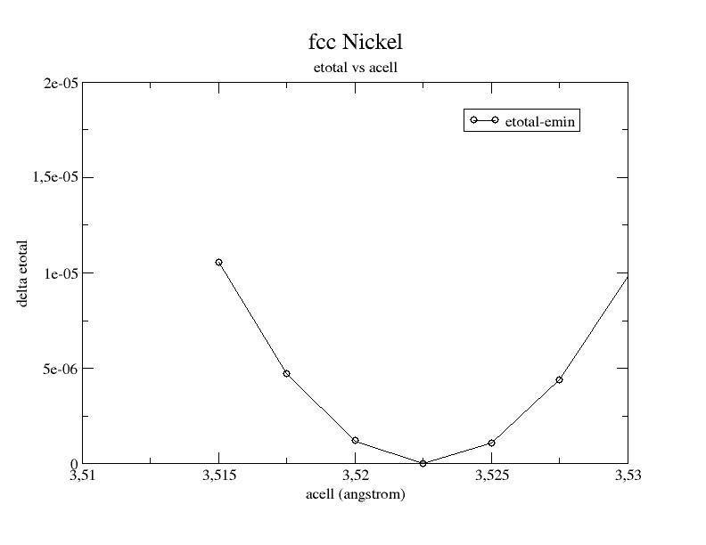

# Second lesson on the projector-augmented wave (PAW) technique  

## The generation of atomic data.  

This lesson aims at showing how to compute atomic data files for the projector-augmented-wave method.

You will learn how to generate the atomic data and what the main variables are
to govern their softness and transferability.
It is supposed you already know how to use ABINIT in the PAW case
  
This lesson should take about 1h30.

## 1 The PAW atomic dataset - introduction
  
The PAW method is based on the definition of atomic spheres (augmentation
regions) of radius $r_c$ around the atoms of the system in which a base of
atomic partial waves $\phi_i$, of "pseudized" partial waves $\tphi_i$, and of projectors $\tprj_i$
(dual to $\tphi_i$) have to be defined. This set of partial-waves and projectors
functions plus some additional atomic data are stored in a so-called *PAW dataset*. 
A PAW dataset has to be generated for each atomic species in order
to reproduce atomic behavior as accurate as possible while requiring minimal
CPU and memory resources in executing ABINIT for the crystal simulations.
These two constraints are conflicting.

The PAW dataset generation is the purpose of this tutorial.
It is done according the following procedure (all parameters that define a PAW dataset are in bold):

  1. Choose and define the concerned chemical species (name and atomic number).

  2. Solve the atomic all-electrons problem in a given atomic configuration.
  The atomic problem is solved within the DFT formalism, using an exchange-correlation functional
  and either a Schrodinger (default) or scalar-relativistic approximation.
  It is a spherical problem and it is solved on a radial grid.
  The atomic problem is solved for a given electronic configuration that can be an ionized/excited one.

  3. Choose a set of electrons that will be considered as frozen around the nucleus (core electrons).
  The others electrons are valence ones and will be used in the PAW basis.
  The core density is then deduced from the core electrons wave functions.
  A smooth core density equal to the core density outside a given rcore matching radius is computed.

  4. Choose the size of the PAW basis (number of partial-waves and projectors). 
  Then choose the partial-waves included in the basis. The later can be atomic eigen-functions 
  related to valence electrons (bound states) and/or additional atomic functions, solution 
  of the wave equation for a given l quantum number at arbitrary reference energies (unbound states).

  5. Generate pseudo partial-waves (smooth partial-waves build with a pseudization scheme and
  equal to partial-waves outside a given rc matching radius) and associated projector functions.
  Pseudo partial-waves are solutions of the PAW Hamiltonian deduced from the atomic Hamiltonian
  by pseudizing the effective potential (a local pseudopotential is built and equal to effective
  potential outside a rvloc matching radius). Projectors and partial-waves are then
  orthogonalized with a chosen orthogonalization scheme.

  6. Build a compensation charge density used later in order to retrieve the total charge of the atom.
  This compensation charge density is located inside the PAW spheres and based on an analytical shape function
  (which analytic form and localization radius rshape can be chosen).

The user can choose between two PAW dataset generators to produce atomic files directly readable by ABINIT.
The first one is the PAW generator ATOMPAW (originally by N. Holzwarth) and
the second one is the Ultra-Soft (US) generator (originally written by D.
Vanderbilt). In this tutorial, we concentrate only on ATOMPAW.

It is highly recommended to refer to the following papers to understand
correctly the generation of PAW atomic datasets:
  
1. "Projector augmented-wave method, P.E. Blochl, Phys. Rev. B 50, 17953 (1994)  

2. "A projector Augmented Wave (PAW) code for electronic structure
    calculations, Part I : atompaw for generating atom-centered functions", N.
    Holzwarth et al., Computer Physics Communications, 329 (2001) (might also be
    available at <http://www.wfu.edu/%7Enatalie/papers/pwpaw/atompaw.pdf>)

3. "From ultrasoft pseudopotentials to the projector augmented-wave method",
    G. Kresse, D. Joubert, Phys. Rev. B 59, 1758 (1999)

4. "Electronic structure packages: two implementations of the Projector
    Augmented-Wave (PAW) formalism", M. Torrent et al., Computer Physics
    Communications 181, 1862 (2010) (might also be available at
    <http://www.wfu.edu/%7Enatalie/papers/PAWform/PAWformman.sdarticle.pdf>)

5. "Notes for revised form of atompaw code", by N. Holzwarth, available at
    <http://www.wfu.edu/%7Enatalie/papers/pwpaw/notes/atompaw/atompawEqns.pdf>

## 2 Use of the generation code
  
*Before continuing, you might consider to work in a different subdirectory as
for the other lessons. Why not "Work_paw2"?*

Provided that ABINIT has been compiled with the:

    --with-dft-flavor="...+atompaw` 
    
option, the ATOMPAW code is directly available from command line.
First, just try to type: atompaw. If "atompaw vx.y.z" message appears, everything is fine.
Otherwise, you can try:

    ~abinit_compilation_directory/fallbacks/exports/bin/atompaw-abinit

!!! note
    In the following, we name atompaw the ATOMPAW executable.
  
How to use Atompaw?

1. Edit an input file in a text editor (content of input explained [here](paw2_assets/atompaw-usersguide.pdf))
2. Run: atompaw < inputfile

Partial waves $\phi_i$, PS partial waves $\tphi_i$ and projectors $\tprj_i$ are given in wfn.i files.
Logarithmic derivatives from atomic Hamiltonian and PAW Hamiltonian
resolutions are given in logderiv.l files.
A summary of the atomic all-electrons computation and PAW dataset properties
can be found in the Atom_name file (Atom_name is the first parameter of the input file).
Resulting PAW dataset is contained in:

Atom_name.XCfunc-paw.abinit file
:   specific format for ABINIT; present only if requested in inputfile.

Atom_name.atomicdata file
:   specific format for PWPAW code)

Atom_name.XCfunc.xml file
:   normalized XML file according to the
    [PAWXML specifications](https://wiki.fysik.dtu.dk/gpaw/setups/pawxml.html).

## 3 First (and basic) PAW dataset for Nickel
  
Our test case will be nickel *(1s2 2s2 2p6 3s2 3p6 3d8 4s2 4p0)*.

In a first stage, copy a simple input file for ATOMPAW in your working directory
(find it in ~abinit/doc/tutorial/paw2/paw2_assets/Ni.atompaw.input1).
Edit this file.



This file has been built in the following way:

1. All-electrons calculation:

    * First line: define the material in the first line

    * Second line: choose the exchange-correlation functional (LDA-PW or GGA-PBE)
      and select a scalar-relativistic wave equation (nonrelativistic or scalarrelativistic)
      and a (2000 points) logarithmic grid.

    * Next lines: define the electronic configuration:

      *How many electronic states do we need to include in the computation?
      Besides the fully and partially occupied states, it is recommended to add all
      states that could be reached by electrons in the solid. Here, for Nickel, the
      4p state is concerned. So we decide to add it in the computation.*

2. A line with the maximum n quantum number for each electronic shell; here "4 4 3" means *4s, 4p, 3d*.

3. Definition of occupation numbers:

   For each partially occupied shell enter the occupation number. An excited
   configuration may be useful if the PAW dataset is intended for use in a
   context where the material is charged (such as oxides). Although, in our
   experience, the results are not highly dependent on the chosen electronic configuration.  
   We choose here the *3d8 4s2 4p0* configuration. Only 3d and 4p shells are
   partially occupied ("3 2 8" " and "4 1 0" lines). A "0 0 0" ends the occupation section.

4. Selection of core and valence electrons selection: in a first approach,
select only electrons from outer shells as valence. But, if particular
thermodynamical conditions are to be simulated, it is generally needed to
include "semi-core states" in the set of valence electrons. Semi-core states
are generally needed with transition metal and rare-earth materials. Note that
all wave functions designated as valence electrons will be used in the partial-wave basis.
Core shells are designated by a "c" and valence shells by a "v". 
All s states first, then p states and finally d states.  

Here:

    c  
    c  
    c  
    v  
    c  
    c  
    v  
    v

means:

    1s core  
    2s core  
    3s core  
    4s valence  
    2p core  
    3p core  
    4p valence  
    3d valence

Partial-waves basis generation:

  * A line with lmax the maximum l for the partial waves basis. Here lmax=2.

  * A line with the rPAW radius. Select it to be slightly less than half the inter-atomic distance
  in the solid (as a first choice). Here rPAW=2.3 a.u. If only one radius is input,
  all others pseudization radii will be equal to rPAW (rc, rcore, rVloc and rshape).

  * Next lines: add additional partial-waves $\phi_i$ if needed: choose to have 2 partial-waves
  per angular momentum in the basis (this choice is not necessarily optimal but this is the most common one;
  if rPAW is small enough, 1 partial-wave per l may suffice). As a first guess, put all reference energies
  for additional partial-waves to 0 Rydberg.

Note that for each angular momentum, valence states already are included in
the partial waves basis. Here *4s, 4p and 3d* states already are in the basis
For each angular momentum, first add "y" to add an additional partial wave.
Then, next line, put the value in Rydberg units.
Repeat this for each new partial wave and finally put "n"
In the present file:

    y  
    0.5  
    n

means that an additional s\- partial wave at Eref=0.5 Ry as been added.

    y  
    0.  
    n

means that an additional p\- partial wave at Eref=0. Ry has been added.

    y  
    0.  
    n

means that an additional d- partial wave at Eref=0. Ry as been added.
Finally, partial waves basis contains two s-, two p-  and two d\- partial waves.

  * Next line: definition of the generation scheme for pseudo partial waves $\tphi_i$, and of projectors $\tprj_i$. 
  We begin here with a simple scheme (i.e. "Bloechl" scheme, proposed by P. Blochl in ref. [1]). 
  This will probably be changed later to make the PAW dataset more efficient.

  * Next line: generation scheme for local pseudopotential Vloc. In order to get PS partial waves, 
  the atomic potential has to be "pseudized" using an arbitrary pseudization scheme. 
  We choose here a "Troullier-Martins" using a wave equation at lloc=3 and Eloc=0. Ry. 
  As a first draft, it is always recommended to put lloc=1+lmax (lmax defined above).

  * Next two lines: a "2" (two) tells ATOMPAW to generate PAW dataset for ABINIT; 
  the next line contains options for this ABINIT file. "default" set all parameters to their default value. 

  * A 0 (zero) to end the file.
  
At this stage, run atompaw. For this purpose, simply enter:

    atompaw <Ni.atompaw.input1  

Lot of files are produced. We will examine some of them.
A summary of the PAW dataset generation process has been written in a file
named Ni (name extracted from first line of input file). Open it. It should look like:

    Atom = Ni Z = 28  
    Perdew \- Burke - Ernzerhof GGA Log grid -- n,r0,rmax = 2000 2.2810899E-04
    8.0000000E+01  
    Scalar relativistic calculation -- point nucleus  
    all-electron results  
     core states (zcore) = 18.0000000000000  
       1  1  0  2.0000000E+00 -6.0358607E+02  
       2  2  0  2.0000000E+00 -7.2163318E+01  
       3  3  0  2.0000000E+00 -8.1627107E+00  
       5  2  1  6.0000000E+00 -6.2083048E+01  
       6  3  1  6.0000000E+00 -5.2469208E+00  
    valence states (zvale) = 10.0000000000000  
       4  4  0  2.0000000E+00 -4.1475541E-01  
       7  4  1  0.0000000E+00 -9.0035738E-02  
       8  3  2  8.0000000E+00 -6.5223644E-01  
    evale = -185.182300204924  
    selfenergy contribution = 8.13253645212050  
    paw parameters:  
        lmax = 2  
        rc   = 2.30969849741149  
        irc  = 1445  
    Vloc: Norm-conserving Troullier-Martins form; l= 3;e= 0.0000E+00  
    Projector method: Bloechl  
    Sinc^2 compensation charge shape zeroed at rc  
      
    Number of basis functions 6  
     No.  n   l  Energy          Cp coeff      Occ  
      1   4   0  -4.1475541E-01 -9.5091493E+00 2.0000000E+00  
      2 999   0   5.0000000E-01  3.2926940E+00 0.0000000E+00  
      3   4   1  -9.0035738E-02 -8.9594194E+00 0.0000000E+00  
      4 999   1   0.0000000E+00  1.0836820E+01 0.0000000E+00  
      5   3   2  -6.5223644E-01  9.1576176E+00 8.0000000E+00  
      6 999   2   0.0000000E+00  1.3369075E+01 0.0000000E+00  
     evale from matrix elements -1.85182309373359203E+02

The generated PAW dataset (contained in Ni.atomicdata, Ni.GGA-PBE-paw.abinit
or Ni.GGA-PBE.xml file) is a first draft.
Several parameters have to be adjusted, in order to get accurate results and efficient DFT calculations.

!!! note

    Note that only Ni.GGA-PBE-paw.abinit file is directly usable by ABINIT.

## 4 Checking the sensitivity of results to some parameters

  * The radial grid:

Try to select 700 points in the logarithmic grid and check if any noticeable
difference in the results appears.
You just have to replace 2000 by 700 in the second line of Ni.atompaw.input1 file.
Then run:

    atompaw <Ni.atompaw.input1 
    
again and look at the  Ni file:

    evale = -185.182300567432  
    evale from matrix elements -1.85182301887091256E+02

As you see, results obtained with this new grid are very close to previous ones. 
We can keep the 700 points grid.

You could decrease the size of the grid; by setting 400 points you should obtain:

    evale = -185.182294626845

    evale from matrix elements -1.85182337214119599E+02

Small grids give PAW dataset with small size (in kB) and run faster in ABINIT,
but accuracy can be affected.

\- Note that the final rPAW value ("rc = ..." in Ni file) change with the
grid; just because rPAW is adjusted in order to belong exactly to the radial grid.
By looking in ATOMPAW [user's guide](paw2_assets/atompaw-usersguide.pdf), you can choose to keep it constant.

\- Also note that, if the results are difficult to get converged 
(some error produced by ATOMPAW), you should try a linear grid...

  * The relativistic approximation of the wave equation:

Scalar-relativistic option should give better results than non-relativistic one,
but it sometimes produces difficulties for the convergence of the atomic problem 
(either at the all-electrons resolution step or at the PAW Hamiltonian solution step).
If convergence cannot be reached, try a non-relativistic calculation (not recommended for high Z materials).

For the following, note that you always should check the Ni file, especially
the values of valence energy ("evale"). You can find the valence energy
computed for the exact atomic problem and the valence energy computed with the
PAW parameters ("evale from matrix elements"). These two results should be in close agreement!

## 5 Adjusting partial waves and projectors
  
Examine the partial-waves, PS partial-waves and projectors.
These are saved in files named wfni, where i ranges over the number of partial
waves used, so 6 in the present example. Each file contains 4 columns:
the radius in column 1, the partial wave $\phi_i$ in column 2, the PS partial wave $\tphi_i$ in
column 3, and the projector $\tprj_i$ in column 4. Plot the three curves as a
function of radius using a plotting tool of your choice.

Here is the first s\- partial wave /projector of the Ni example:

  * The $\phi_i$ should meet the $\tphi_i$ near or after the last maximum (or minimum). 
    If not, it is preferable to change the value of the matching (pseudization) radius.

  * The maxima of the $\tphi_i$ and $\tprj_i$ functions should have the same order of magnitude (but need not agree exactly). 
    If not, you can try to get this in three ways:

\- Change the matching radius for this partial-wave; but this is not always
possible (PAW spheres should not overlap in the solid)...
\- Change the pseudopotential scheme (see later).
\- If there are two (or more) partial waves for the angular momentum l under
consideration, decreasing the magnitude of the projector is possible by
displacing the references energies. Moving the energies away from each other
generally reduces the magnitude of the projectors, but too big a difference
between energies can lead to wrong logarithmic derivatives (see following section).

Example: plot the wfn6 file, concerning the second d- partial wave:

This partial wave has been generated at Eref=0 Ry and orthogonalized with the
first d\- partial wave which has an eigenenergy equal to -0.65Ry (see Ni file). 
These two energies are too close and orthogonalization process produces "high" partial waves.  
Try to replace the reference energy for the additional d\- partial wave.
For example, put Eref=1. instead of Eref=0. (line 24 of Ni.atompaw.input1 file).

Run ATOMPAW again and plot wfn6 file:

Now the PS partial wave and projector have the same order of magnitude!

!!! important

    Note again that you should always check the evale values in Ni file and make
    sure they are as close as possible.  
    If not, choices for projectors and/or partial waves certainly are not judicious.

## 6 Examine the logarithmic derivatives
  
Examine the logarithmic derivatives, i.e., derivatives of an l-state
d(log(ψl(E))/dE computed for the exact atomic problem and with the PAW dataset.
They are printed in the logderiv.l files. Each logderiv.l file corresponds to
angular momentum quantum number l, and contains three columns of data: the
energy, the logarithmic derivative of the l-state of the exact atomic problem
and of the pseudized problem. In our Ni example, l=0, 1 or 2.

The logarithmic derivatives should have the following properties:

  * The 2 curves should be superimposed as much as possible.
    By construction, they are superimposed at the two energies corresponding to the two l partial-waves.
    If the superimposition is not good enough, the reference energy for the second l partial-wave should be changed.

  * Generally a discontinuity in the logarithmic derivative curve appears at 0<=E0<=4 Rydberg.
  A reasonable choice is to choose the 2 reference energies so that E0 is in between.

  * Too close reference energies produce "hard" projector functions
    (as previously seen in section 5). But moving reference energies away
    from each other can damage accuracy of logarithmic derivatives

Here are the three logarithmic derivative curves for the current dataset:

  
  
As you can see, except for l=2, exact and PAW logarithmic derivatives do not match!
According to the previous remarks, try other values for the references
energies of the s\- and p\- additional partial waves.
First, edit again the Ni.atompaw.input1 file and put Eref=3Ry for the
additional s\- state (line 18); run ATOMPAW again. Plot the logderiv.0 file.
You should get:

  
Then put Eref=4Ry for the second p\- state (line 21); run ATOMPAW again.
Plot again the logderiv.1 file. You should get:

Now, all PAW logarithmic derivatives match with the exact ones in a reasonable interval.
  
Note: enlarging energy range of logarithmic derivatives plots
It is possible to change the interval of energies used to plot logarithmic
derivatives (default is [-5;5]) and also to compute them at more points
(default is 200). Just add the following keywords at the end of the SECOND
LINE of the input file:
logderivrange -10 10 500  
In the above example ATOMPAW plots logarithmic derivatives for energies in
[-10;10] at 500 points.  
Additional information concerning logarithmic derivatives:  
Another possible problem could be the presence of a discontinuity in the PAW
logarithmic derivative curve at an energy where the exact logarithmic derivative is continuous.  
This generally shows the presence of a *ghost state*.  

  * First, try to change to value of reference energies; this sometimes can make the ghost state disappear.
  * If not, it can be useful to:

* Change the pseudopotential scheme. Norm-conserving pseudopotentials are sometimes so deep
  (attractive near r=0) that they produce ghost states.

A first solution is to change the quantum number used to generate the norm-conserving pseudopotential.
But this is generally not sufficient.

A second solution is to select an "ultrasoft" pseudopotential, freeing the
norm conservation constraint (simply replace "troulliermartins" by "ultrasoft" in input file)  

A third solution is to select a simple "bessel" pseudopotential (replace
"troulliermartins" by "bessel" in input file). But, in that case, one has to
noticeably decrease the matching radius rVloc if one wants to keep reasonable
physical results. Selecting a value of rVloc between 0.6*rPAW and 0.8*rPAW is
a good choice; but the best way to adjust rVloc value is to have a look at the
two values of evale in Ni file which are sensitive to the choice of rVloc.
To change the value of  rVloc, one has to detail the line containing all radii
(rPAW, rshape, rVloc and rcore); see [user's guide](paw2_assets/atompaw-usersguide.pdf).

* Change the matching radius rc for one (or both) l partial-wave(s). In some cases, changing rc can remove ghost states. 

  * In most cases (changing pseudopotential or matching radius), one has to restart the procedure from step 5.

To see an example of ghost state, use the
~abinit/doc/tutorial/lesson_paw2/Ni.ghost.atompaw.input file and run it with ATOMPAW.
Look at the l=1 logarithmic derivatives (logderiv.1 file). They look like:

  

Now, edit the Ni.ghost.atompaw.input file and replace "troulliermartins" by
"ultrasoft". Run ATOMPAW again... and look at logderiv.1 file. The ghost state has moved!
Edit again the file and replace 'ultrasoft" by "bessel"; then change the 17th
line ("2.0 2.0 2.0 2.0") by "2.0 2.0 1.8 2.0". This has the effect of
decreasing the rVloc radius. Run ATOMPAW: the ghost state disappears!
Start from the original state of Ni.ghost.atompaw.input file and put 1.8 for
the matching radius of p\- states (put 1.8 on lines 31 and 32). 
Run ATOMPAW: the ghost state disappears!

## 7 Testing efficiency of PAW dataset
  
Let's use again our Ni.atompaw.input1 file for Nickel (with all our modifications).
You get a file Ni.GGA-PBE-paw.abinit containing the PAW dataset designated for ABINIT.
  
Now, one has to test the efficiency of the generated PAW dataset. We finally will use ABINIT!
You are about to run a DFT computation and determine the size of the plane
wave basis needed to get a given accuracy. If the cut-off energy defining the
plane waves basis is too high (higher than 20 Hartree, if rPAW has a
reasonable value), some changes have to be made in the input file.
  
Copy ~abinit/tests/tutorial/Input/tpaw2_x.files and
~abinit/tests/tutorial/Input/tpaw2_1.in in your working directory.
Edit ~abinit/tests/tutorial/Input/tpaw2_1.in, and activate the eight datasets 
(only one is kept by default for testing purposes). Run ABINIT with them.



ABINIT computes the total energy of ferromagnetic FCC Nickel for several values of [[ecut]]. 
At the end of output file, you get this:
  
      ecut1   8.00000000E+00 Hartree  
      ecut2   1.00000000E+01 Hartree  
      ecut3   1.20000000E+01 Hartree  
      ecut4   1.40000000E+01 Hartree  
      ecut5   1.60000000E+01 Hartree  
      ecut6   1.80000000E+01 Hartree  
      ecut7   2.00000000E+01 Hartree  
      ecut8   2.20000000E+01 Hartree  
    etotal1  -3.9300291581E+01  
    etotal2  -3.9503638785E+01  
    etotal3  -3.9583278145E+01  
    etotal4  -3.9613946329E+01  
    etotal5  -3.9623543087E+01  
    etotal6  -3.9626889070E+01  
    etotal7  -3.9628094989E+01  
    etotal8  -3.9628458879E+01  
  
etotal convergence (at 1 mHartree) is achieve for 18<=ecut<=20 Hartree
etotal convergence (at 0,1 mHartree) is achieve for ecut>22 Hartree
  
This is not a good result for a PAW dataset; let's try to optimize it.

  * First possibility: use Vanderbilt projectors instead of Bloechl ones.

Vanderbilt projectors generally are more localized in reciprocal space than
Bloechl ones (see ref. [4] for a detailed description of Vanderbilt projectors).  
Keyword "bloechl" has to be replaced by "vanderbilt" in the ATOMPAW input file
and rc values have to be added at the end of the file (one for each PS partial wave).
You can have a look at the ATOMPAW input file:
~abinit/doc/tutorial/lesson_paw2/Ni.atompaw.input.vanderbilt
But we will not test this case here as it produces problematic results for this example (see below).

  * 2nd possibility: use RRKJ pseudization scheme for projectors.

Use this input file for ATOMPAW: ~abinit/doc/tutorial/lesson_paw2/Ni.atompaw.input2



As you can see (by editing the file)  "bloechl" has been changed by "custom rrkj"
and 6 rc values have been added at the end of the file; each one
correspond to the matching radius of one PS partial wave.
Repeat the entire procedure (ATOMPAW + ABINIT)... and get a new ABINIT output file.
Note: you have to look again at log derivatives in order to verify that they still are correct...

      ecut1   8.00000000E+00 Hartree  
      ecut2   1.00000000E+01 Hartree  
      ecut3   1.20000000E+01 Hartree  
      ecut4   1.40000000E+01 Hartree  
      ecut5   1.60000000E+01 Hartree  
      ecut6   1.80000000E+01 Hartree  
      ecut7   2.00000000E+01 Hartree  
      ecut8   2.20000000E+01 Hartree  
    etotal1  -3.9600401638E+01  
    etotal2  -3.9627563690E+01  
    etotal3  -3.9627901781E+01  
    etotal4  -3.9628482371E+01  
    etotal5  -3.9628946655E+01  
    etotal6  -3.9629072497E+01  
    etotal7  -3.9629079826E+01  
    etotal8  -3.9629097793E+01

etotal convergence (at 1 mHartree) is achieve for 12<=ecut<=14 Hartree
etotal convergence (at 0,1 mHartree) is achieve for 16<=ecut<=18 Hartree
This is a reasonable result for a PAW dataset!

  * 3rd possibility: use enhanced polynomial pseudization scheme for projectors.

Edit  ~abinit/doc/tutorial/lesson_paw2/Ni.atompaw.input2 and replace "custom
rrkj" by "custom polynom2 7 10"

Repeat the entire procedure (ATOMPAW \+ ABINIT)... and look at the ecut convergence...
  
Optional exercise: let's go back to Vanderbilt projectors

Repeat the procedure (ATOMPAW + ABINIT) with
~abinit/doc/tutorial/lesson_paw2/Ni.atompaw.input.vanderbilt file.



As you can see ABINIT convergence cannot be achieved!
You can try whatever you want with radii and/or references energies in the
ATOMPAW input file: ABINIT always diverges!
The solution here is to change the pseudization scheme for the local pseudopotential.
Try to replace the "troulliermartins" keyword by "ultrasoft".
Repeat the procedure (ATOMPAW + ABINIT). ABINIT can now reach convergence!
Results are below:

      ecut1   8.00000000E+00 Hartree  
      ecut2   1.00000000E+01 Hartree  
      ecut3   1.20000000E+01 Hartree  
      ecut4   1.40000000E+01 Hartree  
      ecut5   1.60000000E+01 Hartree  
      ecut6   1.80000000E+01 Hartree  
      ecut7   2.00000000E+01 Hartree  
      ecut8   2.20000000E+01 Hartree  
    etotal1  -3.9609714395E+01  
    etotal2  -3.9615187859E+01  
    etotal3  -3.9618367959E+01  
    etotal4  -3.9622476129E+01  
    etotal5  -3.9624707476E+01  
    etotal6  -3.9625234480E+01  
    etotal7  -3.9625282524E+01  
    etotal8  -3.9625330757E+01

etotal convergence (at 1 mHartree) is achieve for 14<=ecut<=16 Hartree
etotal convergence (at 0,1 mHartree) is achieve for 20<=ecut<=22 Hartree
Note: You could have tried the "bessel" keyword instead of "ultrasoft"...

Summary of convergence results:

  
  
Final remarks:

  * The localization of projectors in reciprocal space can (generally) be predicted by a look at tprod.i files.
  Such a file contains the curve of as a function of q (reciprocal space variable).
  q is given in Bohr-1 units; it can be connected to ABINIT plane waves cut-off energy (in Hartree units) by:
  ecut=qcut2/4. These quantities are only calculated for the bound states, since the Fourier transform of an
  extended function is not well-defined.

  * Generating projectors with Blochl's scheme often gives the guaranty to have stable calculations. 
  atompaw ends without any convergence problem and DFT calculations run without any divergence 
  (but they need high plane wave cut-off). Vanderbilt projectors (and even more "custom" projectors) 
  sometimes produce instabilities during the PAW dataset generation process and/or the DFT calculations...

  * In most cases, after having changed the projector generation scheme, one has to restart the procedure from step 5. 

## 8 Testing against physical quantities
  
Finally, the last step is to examine carefully the physical quantities obtained with the PAW dataset.

Copy ~abinit/tests/tutorial/Input/tpaw2_2.in in your working directory.
Edit it, to activate the eight datasets (instead of one).
Use the  ~abinit/doc/tutorial/lesson_paw2/Ni.GGA-PBE-paw.abinit.rrkj psp file
(it has been obtained from Ni.atompaw.input2 file).
Modify tpaw2_x.files file according to these new files.
Run ABINIT (this may take a while...).



ABINIT computes the converged ground state of ferromagnetic FCC Nickel for several volumes around equilibrium.
Plot the etotal vs acell curve:

  

From this graph and output file, you can extract some physical quantities:

    Equilibrium cell parameter: a0 = 3.523 angstrom  
    Bulk modulus: B = 190 GPa  
    Magnetic moment at equilibrium: μ = 0.60
  
Compare these results with published results:

* GGA-FLAPW (all-electrons \- ref [3]):

    a0 = 3.52 angstrom  
    B = 200 GPa  
    μ = 0.60

* GGA-PAW (VASP - ref [3]):

    a0 = 3.52 angstrom  
    B = 194 GPa  
    μ = 0.61

* Experimental results from Dewaele, Torrent, Loubeyre, Mezouar. Phys. Rev. B 78, 104102 (2008):

    a0 = 3.52 angstrom  
    B = 183 GPa

You should always compare results with all-electrons ones (or other PAW computations),
not with experimental ones...
  
Additional remark:

It can be useful to test the sensitivity of results to some ATOMPAW input parameters 
(see [user's guide](paw2_assets/atompaw-usersguide.pdf) for details on keywords):

  * The analytical form and the cut-off radius rshape of the shape function used in compensation charge density definition. 
    By default a "sinc" function is used but "gaussian" shapes can have an influence on results. 
    "Bessel" shapes are efficient and generally need a smaller cut-off radius (rshape=~0.8*rPAW).
  * The matching radius rcore used to get pseudo core density from atomic core density.
  * The inclusion of additional ("semi-core") states in the set of valence electrons.
  * The pseudization scheme used to get pseudopotential Vloc(r).

All these parameters have to be meticulously checked, especially if the PAW
dataset is used for non-standard solid structures or thermodynamical domains.

Optional exercise: let's add 3s and 3p semi-core states in PAW dataset!

Repeat the procedure (ATOMPAW + ABINIT) with ~abinit/doc/tutorial/lesson_paw2/Ni.atompaw.input.semicore file...
The run is a bit longer as more electrons have to be treated by ABINIT.
Look at a0, B or μ variation.

Note: this new PAW dataset has a smaller rPAW radius (because semi-core states are localized).

    a0 = 3.519 angstrom  
    B = 194 GPa  
    μ = 0.60

## 9 The Real Space Optimization (RSO) - experienced users

In this section, an additional optimization of the atomic data is proposed
which can contribute, in some cases, to an acceleration of the convergence on ecut.
This optimization is not essential to produce efficient PAW datasets but
it can be useful. We advise experienced users to try it.

The idea is quite simple: when expressing the different atomic radial
functions ($\phi_i, \tphi_i, \tprj_i$) on the plane waves basis, the number of plane waves
depends on the "locality" of these radial functions in reciprocal space.  
In the following reference (we suggest to read it):  R.D. King-Smith, M.C.
Payne, J.S. Lin, Phys. Rev. B 44, 13063 (1991)

A method to enforce the locality (in reciprocal space) of projectors $\tprj_i$ is presented:
Projectors $\tprj_i(g)$ expressed in reciprocal space are modified according to the following scheme:
The reciprocal space is divided in 3 regions:

* If $g < g_{max}$, $\tprj_i$(g) is unchanged

* If $g > \gamma$, $\tprj_i$(g) is set to zero

* If $ g_{max} < g < \gamma$, $\tprj_i(g)$ is modified so that the contribution of $\tprj_i(r)$ is
  conserved with an error W (as small as possible).

The above transformation of $\tprj_i(g)$ is only possible if $\tprj_i(r)$ is defined outside
the augmentation sphere up to a radius R0 (with R0 > rc).
In practice we have to:

1. Impose an error W (W is the maximum error admitted on total energy)  
2. Adjust gmax according to Ecut ($g_{max} <= E_{cut}$)
3. Choose $\gamma$ so that $2 g_{max} < \gamma < 3 g_{max}$

and the ATOMPAW code apply the transformation to $\tprj_i$ and deduce R0 radius.  
  
You can test it now.
In your working directory, re-use the dataset with Bloechl projectors
(~abinit/doc/tutorial/lesson_paw2/Ni.atompaw.input3).
Replace the last line but one ("default") by "rsoptim 8. 2 0.0001"
(8., 2 and 0.0001 are the values for gmax, γ/gmax and W).
Run ATOMPAW.
You get a new psp file for ABINIT.
Run ABINIT with it using the ~abinit/tests/tutorial/Input/tpaw2_1.in file.
Compare the results with those obtained in section 7.

You can try several values for gmax (keeping γ/gmax and W constant) and
compare the efficiency of the atomic data; do not forget to test physical properties again.

How to choose the RSO parameters?

$\gamma / g_{max} = 2$ and $ 0.0001 < W < 0.001 $ is a good choice.
gmax has to be adjusted. The lower gmax the faster the convergence is
but too low gmax can produce unphysical results.
