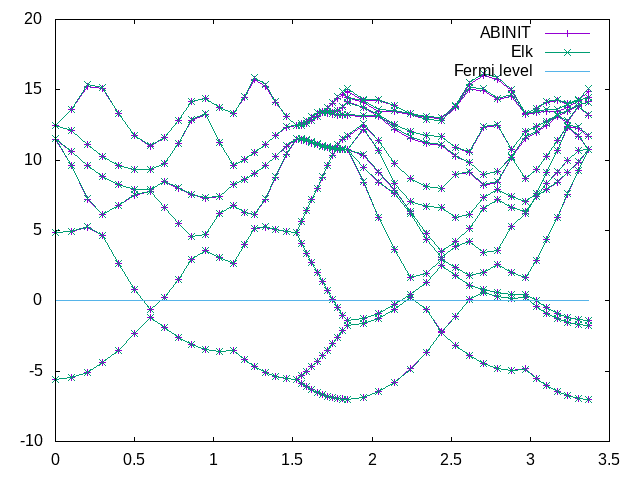

# Third tutorial on the Projector Augmented-Wave (PAW) technique

## Testing PAW datasets against an all-electron code

This tutorial will demonstrate how to test a generated PAW dataset against an
all-electron code. We will be comparing results with the open `Elk` FP-LAPW code
(a branch of the `EXCITING` code) available under GPLv3.

You will learn how to compare calculations of the _equilibrium lattice_
parameter, the _Bulk modulus_ and the _band structure_ between ABINIT PAW results
and those from the `Elk` code.
It is assumed you already know how to use ABINIT in the PAW case. The tutorial
assumes no previous experience with the `Elk` code, but it is strongly advised
that the users familiarise themselves a bit with this code before attempting
to do similar comparisons with their own datasets.

This tutorial should take about 3h-4h.

[TUTORIAL_READMEV9]

## 1. Introduction - the quantities to be compared

When comparing results between all-electron and pseudopotential codes, it is
usually **impossible to compare total energies**. This is because the total energy
of an all-electron code includes the contribution from the _kinetic energy_ of
the _core orbitals_, while in the pseudopotential approach, the only information
that is retained is the density distribution of the frozen core. This is
typically so even in a PAW implementation.

Differences in total energies should be comparable, but calculating these to a
given accuracy is usually a long and cumbersome process. However, some things
can be calculated with relative ease. These include structural properties -
such as the equilibrium lattice parameter(s) and the bulk modulus - as well as
orbital energies, i.e. the band structure for a simple bulk system.

!!! Note
    We are here aiming to compare the results under similar numerical
    conditions. That does not necessarily mean that the calculations can be
    compared with experimental results, nor that the results of the calculations
    individually represent the absolutely most converged values for a given
    system. However, to ensure that the numerical precision is equivalent, we must
    take care to:

    * Use the same (scalar-relativistic) exchange-correlation functional.
    * Match the `Elk` muffin-tin radii and the PAW cutoff radii.
    * Use a k-point grid of similar quality.
    * Use a similar cutoff for the plane wave expansion.
    * Freeze the core in the `Elk` code (whenever possible), to match the frozen PAW core in ABINIT.
    * Use a similar atomic on-site radial grid.

We will use **Carbon**, in the **diamond structure**, as an example of a simple solid
with a band gap, and we will use **Magnesium** as an example of a metallic solid.
Naturally, it is important to keep things as simple as possible when
benchmarking PAW datasets, and there is a problem when the element has no
naturally occurring pure solid phase. For elements which are molecular in
their pure state (like Oxygen, Nitrogen and so forth), or occur only in
compound solids, one solution is to compare results on a larger range of
solids where the other constituents have already been well tested. For
instance, for oxygen, one could compare results for ZnO, MgO and MnO, provided
that one has already satisfied oneself that the datasets for Zn, Mg, and Mn in
their pure forms are good.

One could also compare results for molecules, and we encourage you to do this
if you have the time. However, doing this consistently in ABINIT requires a
supercell approach and would make this tutorial very long, so we shall not do
it here. We will now discuss the prerequisites for this tutorial.

## 2. Prerequisites, code components and scripts

It is assumed that you are already familiar with the contents and procedures
in tutorials [PAW1](paw1) and [PAW2](paw2), and so
have some familiarity with input files for atompaw, and the issues in creating
PAW datasets. To exactly reproduce the results in this tutorial, you will
need:

  * The `ATOMPAW` code for generating PAW datasets.
You have now to install the `ATOMPAW` code. Try to type in your browser:

	https://users.wfu.edu/natalie/papers/pwpaw/atompaw-4.1.0.6.tar.gz


Then, download the file, unzip and untar it.Go into the directory "doc", open the file "atompaw-usersguide.pdf". Go p.3 and follow the instructions to compile atompaw.

  * the `Elk` code (this tutorial was designed with v1.2.15),
    available [here](https://sourceforge.net/projects/elk/files/).
    We will use the `Elk` code itself, as well as its `eos` (equation-of-state) utility,
    for calculating equilibrium lattice parameters.

  * Auxiliary `bash` and `python` _scripts_ for the comparison of band structures, available in the directory
    *\$ABI_HOME/doc/tutorial/paw3_assets/scripts/*. For the `python` scripts, `python3` is required.
    There are also various *gnuplot* scripts there.

You will of course also need a working copy of ABINIT. Please make sure that
the above components are downloaded and working on your system before
continuing this tutorial. The tutorial also makes extensive use of |gnuplot|, so
please also ensure that a recent and working version is installed on your system.

!!! Note
    By the time that you are doing this tutorial there will probably be
    newer versions of all these programs available. It is of course better to use
    the latest versions, and we simply state the versions of codes used when this
    tutorial was written so that specific numerical results can be reproduced if necessary.

## 3. Carbon (diamond)

### 3.1. Carbon - a simple datatset

Make a _working directory_ for the `ATOMPAW` generation (you could call it
`C_atompaw`) and copy the file: [C_simple.input](paw3_assets/inputs/C_simple.input) to it.
Then go there and run `ATOMPAW` by typing (assuming that you have set things up so that you
can run atompaw by just typing atompaw):

    atompaw < C_simple.input

The code should run, and if you do an `ls`, the contents of the directory will be something like:

     C                        density     logderiv.2  potSC1   tprod.2  wfn2    wfnSC1
     C.LDA-PW-paw.xml         dummy       NC          rvf      vloc     wfn3
     C.LDA-PW-paw.xml.corewf  fort.24     OCCWFN      rVx      wfn001   wfn4
     compare.abinit           logderiv.0  potAE0      tau      wfn002   wfn5
     C_simple.input           logderiv.1  potential   tprod.1  wfn1     wfnAE0


There is a lot of output, so it is useful to work with a graphical overview.
Copy the `gnuplot` _script_ [plot_C_all.p](paw3_assets/scripts/plot_C_all.p) to your folder.
Open a new terminal window by typing `xterm &`, and run `gnuplot` in the new
terminal window. At the `gnuplot` command prompt type:

    gnuplot> load 'plot_C_all.p'

You should get a plot that looks like this:


You can now keep the `gnuplot` terminal and plot window open as you work, and if
you change the `ATOMPAW` input file and re-run it, you can update the plot by
retyping the `load..` command. The `gnuplot` window plots the essential
information from the `ATOMPAW` outputs, the logarithmic derivatives, (the
derivatives of the dataset are green), the wavefunctions and projectors for
each momentum channel (the full wavefunction is in red, the PW part is green,
and the projector is blue) as well as the local potential. Finally, it shows the Fourier transform
of the projector products (the x-axis is in units of Ha).

The inputs directory also contains scripts for plotting these graphs
individually, and you are encouraged to test and modify them. We can look
inside the `C_simple.input` file:

     C 6                                         ! Atomic name and number
     LDA-PW scalarrelativistic loggrid 801 logderivrange -10 40 1000 ! XC approx., SE type, gridtype, # pts, logderiv
     2 2 0 0 0 0                                 ! maximum n for each l: 2s,2p,0d,0f..
     2 1 2                                       ! Partially filled shell: 2p^2
     0 0 0                                       ! Stop marker
     c                                           ! 1s - core
     v                                           ! 2s - valence
     v                                           ! 2p - valence
     1                                           ! l_max treated = 1
     1.3                                         ! core radius r_c
     n                                           ! no more unoccupied s-states
     n                                           ! no more unoccupied p-states
     vanderbilt                                  ! vanderbilt scheme for finding projectors
     2 0                                         ! localisation scheme
     1.3                                         ! Core radius for occ. 2s state
     1.3                                         ! Core radius for occ. 2p state
     XMLOUT                                      ! Run atompaw2abinit converter
     prtcorewf noxcnhat nospline noptim          ! Abinit conversion options
     0                                           ! Exit

Here we see that the current dataset is very simple, it has no basis states
beyond the $2s$ and $2p$ occupied valence states in carbon. It is thus not
expected to produce very good results, since there is almost no flexibility in
the PAW dataset. Note that the `scalarrelativistic` option is turned on. While
this is not strictly necessary for such a light atom, we must always ensure to
have this turned on if we intend to compare with results from the `Elk` code.

We will now run basic convergence tests in abinit for this dataset. The
dataset file for abinit has already been generated (it is the `C.LDA-PW-
paw.xml` file in the current directory). Make a new subdirectory for the
test in the current directory (you could call it `abinit_test` for instance), go
there and copy the file: [ab_C_test.in](paw3_assets/inputs/ab_C_test.in) into
it. This ABINIT input file contains several datasets which increment the `ecut`
input variable, and perform ground state and band structure calculations for
each value of `ecut`. This is thus the internal abinit convergence study. Any
dataset is expected to converge to a result sooner or later, but that does not
mean that the final result is accurate, unless the dataset is good. The goal
is of course to generate a dataset which both converges quickly and is very accurate.
The `ab_C_test.in` file contains:

    outdata_prefix="outputs/ab_C_test_o"
    tmpdata_prefix="outputs/ab_C_test"

So it expects the newly generated dataset to be in the directory above.
Also, to keep things tidy, it assumes the outputs will be put in a subdirectory
called `outputs/`. Make sure to create it before you start the abinit run by writing:

    mkdir outputs

!!! important

    You may have to change the path to reach the Psps_for_tests repository. For this, modify the varaible `pp_dirpath` in the input file. 

You can now run the abinit tests (maybe even in a separate new `xterm` window), by executing:

    abinit ab_C_test.in >& log_C_test &

There are 18 double-index datasets in total, with the first index running from
1 to 9 and the second from 1 to 2. You can check on the progress of the
calculation by issuing `ls outputs/`. When the `.._o_DS92..` files appear, the
calculation should be just about finished. While the calculation runs you
might want to take a look in the input file. Note the lines pertaining to the
increment in `ecut` (around line 29):

     ...
     # Cutoff variables
     ecut:? 5.0
     ecut+?  5.0
     `pawecutdg` 110.0
     ecutsm 0.5
     ...

ecut is increased in increments of 5 Ha from an initial value of 5, to a final
ecut of 45 Ha. Note that `pawecutdg` is kept fixed, at a value high enough to be
expected to be good for the final value of `ecut`. In principle, a convergence
study of `pawecutdg` should be performed as well, once a good value of `ecut` has been found.

We can now check the basic convergence attributes of the dataset. The
convergence of the total energy is easily checked by issuing some `grep` commands:

     grep 'etotal' ab_C_test.abo

This should give you an output similar to this (though not the text to the left):

                                         etotal   (ecut)
     etotal11 -1.0972441353E+01
     etotal21 -1.1443217299E+01      - 470.78 mHa (10 Ha)
     etotal31 -1.1507234681E+01      -  64.02 mHa (15 Ha)
     etotal41 -1.1517560274E+01      -  10.33 mHa (20 Ha)
     etotal51 -1.1518066800E+01      -   0.51 mHa (25 Ha)
     etotal61 -1.1518201844E+01      -   0.14 mHa (30 Ha)
     etotal71 -1.1518427967E+01      -   0.23 mHa (35 Ha)
     etotal81 -1.1518542165E+01      -   0.11 mHa (40 Ha)
     etotal91 -1.1518570692E+01      -   0.03 mHa (45 Ha)
     

Your values might differ slightly in the last decimals. The calculation of
diamond with the current PAW Carbon dataset converged to a precision of the
total energy below 1 mHa for a cutoff of about 25 Ha (this is not particularly
good for a PAW dataset). Also, the convergence is a bit jumpy after an `ecut` of
about 25 Ha, which is an indication of a) that the number of projectors per
angular momentum channel is low, and  b) that other parameters apart from ecut
dominate convergence beyond this point.

If we turn to the ~band structure~, we can use the script
[comp_bands_abinit2abinit.py](paw3_assets/scripts/comp_bands_abinit2abinit.py)
to check the convergence of the band structure. Copy the script to the
directory where the ABINIT input file is and issue:

     python comp_bands_abinit2abinit.py outputs/ab_C_test_o_DS12_EIG outputs/ab_C_test_o_DS92_EIG eV

This will print a long series of columns and at the end you will see:

     ...
     #        nvals:   280
     # average diff:     1.758809  eV
     # minimum diff:    -4.437905  eV
     # maximum diff:     1.089000  eV
     #
     # NOTE: Abinit values are read in fixed format with five decimal
     #       places. For low values, four or three decimal figures
     #       may be the highest precision you can get.

This provides you with some statistics of the difference in the band energies.
Specifically this is the average difference between a the band structure
calculated at an `ecut` of 5 Ha (in dataset 12) and another at an `ecut` of 45 Ha (in dataset 92).

The differences between these datasets are naturally very large, about 1.8 eV
on average, because the band-structure of the first dataset is far from
converged. The columns output before the statistics are arranged so that if
you pipe the output to a data file:

    python comp_bands_abinit2abinit.py outputs/ab_C_test_o_DS12_EIG outputs/ab_C_test_o_DS92_EIG eV > bands_5Ha_vs_45Ha.dat

you can plot the two band structures in `gnuplot` directly, by entering:

     gnuplot> plot 'bands_5Ha_vs_45Ha.dat' u 1:2 w lp title '5 Ha', 'bands_5Ha_vs_45Ha.dat' u 1:3 w lp title '45 Ha'

This should furnish you with a graph that looks something like this:


Not surprisingly, the band structures are very different. However, a search
through the datasets of increasing index (i.e. DS22, DS32, DS42, ...) yields
that for dataset 42, i.e with an `ecut` of 20 Ha, we are already converged to a
level of 0.01 eV. Issuing the command:

     python comp_bands_abinit2abinit.py outputs/ab_C_test_o_DS42_EIG outputs/ab_C_test_o_DS92_EIG eV > bands_20Ha_vs_45Ha.dat

and plotting this with:

     gnuplot> plot 'bands_20Ha_vs_45Ha.dat' u 1:2 w lp title '20 Ha', 'bands_20Ha_vs_45Ha.dat' u 1:3 w lp title '45 Ha'

Should give you a plot similar to this:


You can convince yourself by zooming in that the band structures are very
similar. The statistics at the end of the bands_20Ha_vs_45Ha.dat  file shows
that we are converged within abinit:

    ...
    #        nvals:   280
    # average diff:     0.003808  eV
    # minimum diff:    -0.008980  eV
    # maximum diff:     0.000272  eV
    ...


### 3.2. Carbon - calculating the equilibrium lattice parameter

That we have converged the dataset on its own does of course not mean that the
dataset is good, i.e. that it reproduces the same results as an all-electron
calculation. To independently verify that the dataset is good, we need to
calculate the equilibrium lattice parameter (and the _Bulk modulus_) and compare
this and the band structure with an `Elk` calculation.

First, we will need to calculate the total energy of diamond in ABINIT for a
number of lattice parameters around the minimum of the total energy. There is
example input file for doing this at:
[ab_C_equi.in](paw3_assets/inputs/ab_C_equi.in).
The new input file has ten datasets which increment the lattice parameter, alatt,
from 6.1 to 7.0 Bohr in steps of 0.1 Bohr. A look in the input file will tell
you that `ecut` is set to 25 Hartrees. Copy these to your abinit_test directory and run:

    abinit  ab_C_equi.in >& log_C_equi &

The run should be done fairly quickly, and when it's done we can check on the
volume and the total energy by using "grep"

     grep 'volume' log_C_equi

and

     grep 'etotal' log_C_equi

The outputs should be something like this:

     ...
     Unit cell volume ucvol=  5.6745250E+01 bohr^3
     Unit cell volume ucvol=  5.9582000E+01 bohr^3
     Unit cell volume ucvol=  6.2511750E+01 bohr^3
     Unit cell volume ucvol=  6.5536000E+01 bohr^3
     Unit cell volume ucvol=  6.8656250E+01 bohr^3
     Unit cell volume ucvol=  7.1874000E+01 bohr^3
     Unit cell volume ucvol=  7.5190750E+01 bohr^3
     Unit cell volume ucvol=  7.8608000E+01 bohr^3
     Unit cell volume ucvol=  8.2127250E+01 bohr^3
     Unit cell volume ucvol=  8.5750000E+01 bohr^3
     ...  
           etotal1    -1.1461991605E+01
           etotal2    -1.1480508012E+01
           etotal3    -1.1494820912E+01
           etotal4    -1.1505365819E+01
           etotal5    -1.1512537944E+01
           etotal6    -1.1516696065E+01   <-
           etotal7    -1.1518166172E+01   <- minimum around here
           etotal8    -1.1517244861E+01   <-
           etotal9    -1.1514202226E+01
           etotal10   -1.1509284702E+01
     ...


If we examine the `etotal` values, the total energy does indeed go to a
minimum, and we also see that given the magnitude of the variations of the
total energy, an `ecut` of 25 Ha should be more than sufficient. We will now
extract the equilibrium volume and bulk modulus by using the eos bundled with
elk. This requires us to put the above data in an  eos.in file. Create such a
file with your favorite editor and enter the following five lines and then the
data you just extracted:

     "C - Diamond"                : cname - name of material
     2                            : natoms - number of atoms
     1                            : etype - equation of state fit type
     50.0 95.0 100                : vplt1, vplt2, nvplt - start, end and #pts for fit
     10                            : nevpt - number of supplied points
     5.6745250E+01  -1.1461991605E+01
     5.9582000E+01  -1.1480508012E+01
     6.2511750E+01  -1.1494820912E+01
     6.5536000E+01  -1.1505365819E+01
     6.8656250E+01  -1.1512537944E+01
     7.1874000E+01  -1.1516696065E+01
     7.5190750E+01  -1.1518166172E+01
     7.8608000E+01  -1.1517244861E+01
     8.2127250E+01  -1.1514202226E+01
     8.5750000E+01  -1.1509284702E+01

When you run `eos` (the executable should be located in `src/eos/` in the
directory where `Elk` was compiled), it will produce several  `.OUT` files. The
file `PARAM.OUT` contains the information we need:

     C - Diamond

     Universal EOS
     Vinet P et al., J. Phys.: Condens. Matter 1, p1941 (1989)

     (Default units are atomic: Hartree, Bohr etc.)

     V0                =            75.50730327    
     E0                =           -11.51817590    
     B0                =           0.1564766690E-01
     B0'               =            3.685291965    

     B0 (GPa)          =            460.3701770  


This tells us the equilibrium volume and bulk modulus. The volume of our
diamond FCC lattice depends on the lattice parameter as: $\frac{a^3}{4}$. If we want to
convert the volume to a lattice parameter, we have to multiply by four and
then take the third root, so:

    alatt = (4*75.50730327)^(1/3) = 6.7094 Bohr (3.5505 Å)

at equilibrium for this dataset.

### 3.3. Carbon - the all-electron calculation

In order to estimate whether these values are good or not, we need independent
verification, and this will be provided by the all-electron `Elk` code. There is
an `Elk` input file matching our abinit diamond calculation at
[elk_C_diamond.in](paw3_assets/inputs/elk_C_diamond.in). You need
to copy this file to a directory set up for the `Elk` run (why not call it
`C_elk`), and it needs to be renamed to `elk.in`, which is the required input
name for an `Elk` calculation. We are now ready to run the `Elk` code for the first time.

If we take a look in the `elk.in` file, at the beginning we will see the lines:

     ! Carbon, diamond structure (FCC)

     ! The tasks keyword defines what will be done by the code:
     ! 0 - Perform ground-state calculation from scratch
     ! 1 - Restart GS calc. from STATE.OUT file
     ! 20 - Calculate band structure as defined by plot1d
     tasks
     0
     20

     ! Set core-valence cutoff energy
     ecvcut
      -6.0

     ! Construct atomic species file 'C.in'
     species
      6  : atomic number
      'C'
      'carbon'
      21894.16673    : atomic mass
      1.300000000    : muffin-tin radius
      4              : number of occ. states
      1   0   1   2  : 1s
      2   0   1   2  : 2s
      2   1   1   1  : 2p m=1
      2   1   2   1  : 2p m=2
    ...


Any text after an exclamation mark (or a colon on the lines defining data) is
a comment. The keyword `tasks` defines what the code should do. In this case
it is set to calculate the ground state for the given structure and to
calculate a band structure. The block `ecvcut` sets the core-valence cutoff
energy. The next input block, `species` defines the parameters for the
generation of an atomic species file (it will be given the name `C.in`). As a
first step, we need to generate this file, but we will need to modify it
before we perform the main calculation. Therefore, you should run the code
briefly (by just running the executable in your directory) and then kill it
after a few seconds (using `Ctrl+C` for instance ), as soon as it has generated the `C.in` file.

If you look in your directory after the code has been killed you will probably
see a lot of `.OUT` files with uppercase names. These are the `Elk` output files.
You should also see a `C.in` file. When you open it, you should see:

     'C'                                        : spsymb
     'carbon'                                   : spname
      -6.00000                                  : spzn
       39910624.45                              : spmass
       0.816497E-06    1.3000   38.0877   300    : rminsp, rmt, rmaxsp, nrmt
       4                                        : nstsp
       1   0   1   2.00000    T                 : nsp, lsp, ksp, occsp, spcore
       2   0   1   2.00000    F
       2   1   1   1.00000    F
       2   1   2   1.00000    F
       1                                        : apword
        0.1500   0  F                           : apwe0, apwdm, apwve
       0                                        : nlx
       3                                        : nlorb
       0   2                                    : lorbl, lorbord
        0.1500   0  F                           : lorbe0, lorbdm, lorbve
        0.1500   1  F
       1   2                                    : lorbl, lorbord
        0.1500   0  F                           : lorbe0, lorbdm, lorbve
        0.1500   1  F
       0   2                                    : lorbl, lorbord
        0.1500   0  F                           : lorbe0, lorbdm, lorbve
       -0.5012   0  T

The first four lines contain information pertaining to the symbol, name,
charge and mass of the atom. The fifth line holds data concerning the
numerical grid: the distance of the first grid point from the origin, the
muffin-tin radius, the maximum radius for the on-site atomic calculation, and
the number of grid points. The subsequent lines contain data about the
occupied states (the ones ending with "T" or "F"), and after that there is
information pertaining to the FP-LAPW on-site basis functions.

The first important thing to check here is whether all the orbitals that we
have included as valence states in the PAW dataset are treated as valence in
this species file. We do this by checking that there is an "F" after the
corresponding states in the occupation list:

     ...
        1   0   1   2.00000    T                 : spn, spl, spk, spocc, spcore
        2   0   1   2.00000    F
        2   1   1   1.00000    F
        2   1   2   1.00000    F
     ...

The first two numbers are the $n$, $l$ quantum numbers of the atomic state, so we
see that the $2s$ states, and the $2p$ states are set to valence as in the PAW dataset.

!!! Note
    This might not be the case in general, the version of `Elk` we use is
    modified to accept an adjustment of the _cutoff energy_ for determining whether
    a state should be treated as core or valence. This is what is set by the line:
    ````
    ...
    ecvcut
    -6.0 : core-valence cutoff energy
    ...
    ````

in the `elk.in` file. If you find too few or too many states are included as
valence for another atomic species, this value needs to be adjusted downwards or upwards.

The second thing we need to check is whether the number of grid points and the
_muffin-tin_ radius that we use in the `Elk` calculation is roughly equivalent to
the PAW one. If you have a look in the PAW dataset we generated before, i.e.
in the `C_LDA.pawps` file, there is the line:

     ...
     <radial_grid eq="r=a*(exp(d*i)-1)" a=" 2.1888410558886799E-03" d=" 1.3133046335332079E-02" istart="0" iend="  800" id="log1">
  <values>
     ...

These define the PAW grids used for wavefunctions, densities and potentials.
To approximately match the intensity of the grids, we should modify the fifth
line in the `C.in` file:

     ...
       0.816497E-06    1.3000   38.0877   300    : sprmin, rmt, sprmax, nrmt
     ...
     to:
     ...
       0.816497E-06    1.3000   38.0877   500    : sprmin, rmt, sprmax, nrmt
     ...

You now need to comment out the species generation input block in the `elk.in` file:

     ...
     ! Construct atomic species file 'C.in'
     !species
     ! 6  : atomic number
     ! 'C'
     ! 'carbon'
     ! 21894.16673    : atomic mass
     ! 1.300000000    : muffin-tin radius
     ! 4              : number of occ. states
     ! 1   0   1   2  : 1s
     ! 2   0   1   2  : 2s
     ! 2   1   1   1  : 2p m=1
     ! 2   1   2   1  : 2p m=2
     ...

!!! Note
    This is very important! If you do not comment these lines the species
    file `C.in` will be regenerated when you run `Elk` and your modifications will be lost.

Now it is time to start `Elk` again. The code will now run and produce a lot of
`.OUT` files. There is rarely anything output to screen, unless it's an error
message, so to track the progress of the `Elk` calculation you can use the `tail` command:

     tail -f INFO.OUT

You get out of `tail` by pressing `CRTL+C`. While the calculation is running,
you might want to familiarise yourself with the different input blocks in the
`elk.in` file. When the `Elk` run has finished, there will be a `BAND.OUT` file in
your run directory. We can now do an analogous band structure comparison to
before, by using the python script [comp_bands_abinit2elk.py](paw3_assets/scripts/comp_bands_abinit2elk.py)
(you should copy this to your current directory). If your previous abinit
calculation is in the subdirectory `path/abinit_test` above you write:

     python comp_bands_abinit2elk.py path/abinit_test/outputs/ab_C_test_o_DS42_EIG BAND.OUT eV

This will get you the ending lines:

     ...
     #        nvals:   280
     # average diff:    12.393189  eV
     # minimum diff:   -12.668010  eV
     # maximum diff:   -12.290953  eV
     ...

So it looks like there is a huge difference! However, there is something we
have forgotten. Pipe the data to a file by writing:

    python comp_bands_abinit2elk.py path/abinit_test/outputs/ab_C_test_o_DS42_EIG BAND.OUT eV > bands.dat

and plot it in `gnuplot` with:

    gnuplot> plot 'bands.dat' u 1:2 w lp title 'ABINIT', 'bands.dat' u 1:3 w lp title 'Elk'

You should get a graph like this:


As you can see, the band structures look alike but differ by an absolute
shift, which is normal, because in a periodic system there is no unique vacuum
energy, and band energies are always defined up to an arbitrary constant
shift. This shift depends on the numerical details, and will be different for
different codes using different numerical approaches. (Note in the `Elk` input
file that the keyword `xctype` controls the type - LDA or GGA - of the
exchange-correlation functional.)

However, if we decide upon a reference pont, like the valence band maximum
(VBM), or a point nearby, and align the two band plots at that point, there
will still be differences. By comparing with the plot we just made, we see
that the VBM is at the ninth k-point from the left, on band four. The script
we used previously can accomodate a shift, by issuing the command:

    python comp_bands_abinit2elk.py path/abinit_test/outputs/ab_C_test_o_DS42_EIG BAND.OUT align 9 4 eV

So that if the keyword `align` is present followed by the k-point index and
band number, we order the script to align at that point. Naturally, that will
make the positions of that particular point fit perfectly, but if we look at
the end of the output:

     ...
     # AVERAGES FOR OCCUPIED STATES:
     #        nvals:   106
     # average diff:     0.021871  eV
     # minimum diff:    -0.042755  eV
     # maximum diff:     0.064097  eV
     #
     # AVERAGES FOR UNOCCUPIED STATES:
     #        nvals:   174
     # average diff:     0.047221  eV
     # minimum diff:    -0.287747  eV
     # maximum diff:     0.089309  eV

     ...

we can tell that this is not true for the rest of the points. Since the script
assumes alignment at the VBM, it now separates its statistics for occupied and
unoccupied bands. The uppermost unoccupied bands can fit badly, depending on
what precision was asked of abinit (especially, if `nbdbuf` is used).

The fit is quite bad in general, an average of about 0.025 eV difference for
occupied states, and about 0.05 eV difference for unoccupied states. If you
plot the ouput as before, by piping the above to a `bands.dat` file and
executing the same `gnuplot` command, you should get the plot below.


On the scale of the band plot there is a small - but visible - difference
between the two. Note that the deviations are usually larger away from the
high-symmetry points, which is why it's important to choose some points away
from these as well when making these comparisons. However, it is difficult to
conclude visually from the band structure that this is a bad dataset without
using the statistics output by the _script_, and without some sense of what
precision can be expected.

As we are now creating our "gold standard" with an `Elk` calculation, we also
need to calculate the equilibrium lattice parameter and Bulk modulus of
diamond with the `Elk` code. Unfortunately, `Elk` does not use datasets, so the
various lattice parameters we used in our abinit structural search will have
to be put in one by one by hand and the code run for each. The lattice
parameters in the abinit run were from 6.1 to 7.0 in increments of 0.1, so
that makes ten runs in total. To perform the first, simply edit the `elk.in`
file and change the keyword (at line 57):

     ...
     scale
     6.7403 : lattice parameter in Bohr
     ...

to:

     ...
     scale
     6.1 : lattice parameter in Bohr
     ...

!!! Note
    You also have to change the keyword `frozencr` to ".false." because, at
    the time of writing, there is an error in the calculation of the total energy
    for frozen core-states. This means that the Elk input file must have the keyword (at line 65 ):
    ````
    ...
    frozencr
    .false.
    ...
    ````
    when you are determining parameters which depend on the total energy. (It can
    safely be set to ".true." for band structure calculations however.) The
    difference in the lattice parameters when using frozen versus unfrozen core
    states in an all-electron calculation is expected to be of the order of 0.005 Bohr.

Finally, you don't need to calculate the band structure for each run, so you
might wand to change the `tasks` keyword section (at line 7):

     ...
     tasks
      0
      20
     ...

to just

     ...
     tasks
      0
     ...

After you've done these modifications, run `Elk` again. After the run has
finished, look in the `TOTENERGY.OUT` and the `LATTICE.OUT` files to get the
converged total energy and the volume. Write these down or save them in a safe
place, edit the `elk.in` file again, and so forth until you've calculated all
ten energies corresponding to the ten lattice parameter values. In the end you
should get a list which you can put in an `eos.in` file:

     "C - Diamond (Elk)"          : cname - name of material
     2                            : natoms - number of atoms
     1                            : etype - equation of state fit type
     50.0 95.0 100                : vplt1, vplt2, nvplt - start, end and #pts for fit
     10                           : nevpt - number of supplied points
     56.74525000  -75.5758514889
     59.58200000  -75.5933438506
     62.51175000  -75.6067015802
     65.53600000  -75.6163263051
     68.65625000  -75.6226219775
     71.87400000  -75.6259766731
     75.19075000  -75.6266976640
     78.60800000  -75.6250734731
     82.12725000  -75.6213749855
     85.75000000  -75.6158453243

(Your values might be slightly different in the last few decimals depending on
your system.) By running the `eos` utility as before we get:

     V0                =            74.47144624
     B0 (GPa)          =            469.7040543

     alatt = (4*74.47144624)^(1/3) = 6.6785 Bohr (3.5341 Å)

So we see that the initial, primitive, abinit dataset is about 9 GPa off for
the _Bulk modulus_ and about 0.035 Bohr away from the correct value for the
lattice parameter. In principle, these should be about an order of magnitude
better, so let us see if we can make it so.

### 3.4. Carbon - improving the dataset

Now that you know the target values, is up to you to experiment and see if you
can improve this dataset. The techniques are well documented in tutorial
[PAW2](paw2). Here's a brief summary of main points to be concerned about:

  * Use the keyword series `custom rrkj ...`, or `custom polynom ...`, or `custom polynom2 ...`,
    if you want to have maximum control over the convergence properties of the projectors.
  * Check the logarithmic derivatives very carefully for the presence of ghost states.
  * A dataset intended for ground-state calculations needs, as a rule of thumb, at least two projectors
    per angular momentum channel. This is because only the occupied states need to be reproduced very accurately.
    If you need to perform calculations which involve the Fock operator or unoccupied states
    - like in GW calculations for instance - you will probably need at least three projectors.
    You might also want to add extra projectors in completely unoccupied $l$-channels.

We will now benchmark a more optimized atomic dataset for carbon.
Try and check the convergence properties, equilibrium lattice parameter, bulk modulus,
and bands for the input file below:

     C 6                                     ! Atomic name and number
     LDA-PW scalarrelativistic loggrid 801 logderivrange -10 40 1000 ! XC approx., SE type, gridtype, # pts, logderiv
     2 2 0 0 0 0                             ! maximum n for each l: 2s,2p,0d,0f..
     2 1 2                                   ! Partially filled shell: 2p^2
     0 0 0                                   ! Stop marker
     c                                       ! 1s - core
     v                                       ! 2s - valence
     v                                       ! 2p - valence
     1                                       ! l_max treated = 1
     1.3                                     ! core radius r_c
     y                                       ! Add unocc. s-state
     12.2                                    !  reference energy
     n                                       ! no more unoccupied s-states
     y                                       ! Add unocc. p-state
     6.9                                     !  reference energy
     n                                       ! no more unoccupied p-states
     custom polynom2 7 11 vanderbiltortho sinc   ! more complicated scheme for projectors
     3 0 ultrasoft                           ! localisation scheme
     1.3                                     ! Core radius for occ. 2s state
     1.3                                     ! Core radius for unoocc. 2s state
     1.3                                     ! Core radius for occ. 2p state
     1.3                                     ! Core radius for unocc. 2p state
     XMLOUT                                       ! Run atompaw2abinit converter
     prtcorewf noxcnhat nospline noptim      ! Abinit conversion options
     0                                       ! Stop marker

Generate an atomic data file from this (you can replace the items in the old
input file if you want, or make a new directory for this study). You might
want to try and modify the gnuplot scripts so that they work correctly for
this dataset. (The `wfn*` files are ordered just like the core radius list at
the end, so now their meaning and the numbering of some other files have
changed.) There is an example of the modifications in the plot script
[plot_C_all_II.p](paw3_assets/scripts/plot_C_all_II.p), which you
can download and run in gnuplot. You should get a plot like this:


Note the much better fit of the logarithmic derivatives, and the change in the
shape of the projector functions (in blue in the `wfn` plots), due to the more
complicated scheme used to optimise them.

Generate the dataset like before and run the abinit `ecut` testing datasets in
the `ab_C_test.in` abinit input file again. You should get an `etotal`
convergence like this (again, the values to the left are just there to help):

                                       etotal   (ecut)
      etotal11 -1.0785137440E+01
      etotal21 -1.1489028406E+01   - 703.89 mHa (10 Ha)
      etotal31 -1.1522398057E+01   -  33.37 mHa (15 Ha)
      etotal41 -1.1523369210E+01   -   0.97 mHa (20 Ha)
      etotal51 -1.1523467540E+01   -   0.10 mHa (25 Ha)
      etotal61 -1.1523515348E+01   -   0.05 mHa (30 Ha)
      etotal71 -1.1523525440E+01   -   0.01 mHa (35 Ha)
      etotal81 -1.1523552361E+01   -   0.03 mHa (40 Ha)
      etotal91 -1.1523572404E+01   -   0.02 mHa (45 Ha)
 

This dataset already seems to be converged to about 1 mHa at an `ecut` of 15 Ha,
so it is much more efficient. A comparison of bands (in units of eV) between
datasets 32 and 92 gives:

     ...
     #        nvals:   280
     # average diff:     0.004312  eV
     # minimum diff:    -0.013878  eV
     # maximum diff:     0.000544  eV
     ...

Which also shows a much faster convergence than before. Is the dataset
accurate enough? Well, if you run the abinit equilibrium parameter input file
in `ab_C_equi.in`, you should get data for an `eos.in` file:

     "C - Diamond (second PAW dataset)" : cname - name of material
     2                                  : natoms - number of atoms
     1                                  : etype - equation of state fit type
     50.0 95.0 100                      : vplt1, vplt2, nvplt - start, end and #pts for fit
     10                                 : nevpt - number of supplied points
     5.6745250E+01  -1.1471957529E+01
     5.9582000E+01  -1.1489599125E+01
     6.2511750E+01  -1.1503102315E+01
     6.5536000E+01  -1.1512899444E+01
     6.8656250E+01  -1.1519381720E+01
     7.1874000E+01  -1.1522903996E+01
     7.5190750E+01  -1.1523789014E+01
     7.8608000E+01  -1.1522330567E+01
     8.2127250E+01  -1.1518796247E+01
     8.5750000E+01  -1.1513430193E+01
     

And when fed to `eos`, this gives us the equilibrium data:

     V0                =            74.71100799
     B0 (GPa)          =            465.7949258

     alatt = (4*74.71100799)^(1/3) = 6.6857 Bohr (3.5379 Å)

For comparison, we list all previous values again:

     Equilibrium        Bulk modulus       lattice
     volume, V0         B0                parameter
     75.5073            460.37            3.5505 Å   (first primitive PAW dataset)
     74.7110	        465.79            3.5379 Å   (second better PAW dataset)
     74.4714            469.70            3.5341 Å   (Elk all-electron)

It is obvious that the second dataset is much better than the first one.
A comparison of the most converged values for the bands using the command:

    python comp_bands_abinit2elk.py ab_C_test_o_DS92_EIG BAND.OUT align 9 4 eV

(This assumes that you have all the files you need in the current directory.)
As before, the extra command parameters on the end mean "align the 9-th
k-point on the fourth band and convert values to eV". This will align the band
structures at the valence band maximum. The statistics printed out at the end
should be something like this:

     ...
     # AVERAGES FOR OCCUPIED STATES:
     #        nvals:   106
     # average diff:     0.013523  eV
     # minimum diff:    -0.001229  eV
     # maximum diff:     0.040695  eV
     #
     # AVERAGES FOR UNOCCUPIED STATES:
     #        nvals:   174
     # average diff:     0.016247  eV
     # minimum diff:    -0.013699  eV
     # maximum diff:     0.117064  eV 
     ...

Which shows a precision, on average, of slightly better than 0.01 eV for both
the four occupied and the four lowest unoccupied bands. As before, you can
pipe this output to a file and plot the bands for visual inspection.

This is a better dataset, but probably by no means the best possible. It is
likely that one can construct a dataset for carbon that has even better
convergence properties, and is even more accurate. You are encouraged to
experiment and try to make a better one.

## 4. Magnesium - dealing with the Fermi energy of a metallic system

There is added complication if the system is metallic, and that is the
treatment of the smearing used in order to eliminated the sharp peaks in the
_density of states_ (DOS) near the Fermi energy. The DOS is technically
integrated over in any ground-state calculation, and for a metal this
requires, in principle, an infinite k-point grid in order to resolve the Fermi surface.

In practice, a smearing function is used so that a usually quite large - but
finite - number of k-points will be sufficient. This smearing function has a
certain spread controlled by a smearing parameter, and the optimum value of
this parameter depends on the k-point grid used. As the k-point grid becomes
denser, the optimum spread becomes smaller, and all values converge toward
their ideal counterparts in the limit of no smearing and an infinitely dense grid.

The problem is that, in ABINIT, finding the optimum smearing parameter takes a
(potentially time consuming) convergence study. However, we are in luck. The
elk code has an option for automatically determining the smearing parameter.
Thus we should use the `Elk` code first, set a relatively dense k-mesh, and
calculate the equilibrium bulk modulus, lattice parameter and band structure.
Then we make sure to match the automatically determined smearing width, and
most importantly, make sure that we match the smearing function used between
the `Elk` and the abinit calculation.

### 4.1. Magnesium - The all-electron calculation

There is an `Elk` input file prepared at: [elk_Mg_band.in](paw3_assets/inputs/elk_Mg_band.in),
we suggest you copy it into a subdirectory dedicated to the Mg `Elk` calculation (why not `Mg_elk`?), rename
it to `elk.in` and take a look inside the input file.

There will be sections familiar from before, defining the lattice vectors,
structure, etc. (Mg has a 2-atom hexagonal unit cell.) Then there are a couple
of new lines for the metallic case:

     ...
     ! Metallic options
     stype
      0          : Smearing type 0 - Gaussian
     autoswidth
      .true.     : Automatic determination of swidth
     ...

When you run `Elk` with this file, it will start a ground-state run (this might
take some time due to the dense k-point mesh), all the while automatically
determining the smearing width. At the end of the calculation the final value
of `swidth` will have been determined, and can be easily extracted with a `grep`:

     grep ' smearing' INFO.OUT

this should furnish you with a list:

     Automatic determination of smearing width
     New smearing width :   0.1000000000E-02
     New smearing width :   0.4116175210E-02
     New smearing width :   0.4056329377E-02
     New smearing width :   0.4060342507E-02
     New smearing width :   0.4078123678E-02
     New smearing width :   0.4097424577E-02
     New smearing width :   0.4105841081E-02
     New smearing width :   0.4109614663E-02
     New smearing width :   0.4109651379E-02
     New smearing width :   0.4109804149E-02
     New smearing width :   0.4109807004E-02
     New smearing width :   0.4109805701E-02
     New smearing width :   0.4109804616E-02
     New smearing width :   0.4109804468E-02
     New smearing width :   0.4109804441E-02
     New smearing width :   0.4109804423E-02


where the last value is the one we seek, i.e. the smearing at convergence.
Since this `Elk` file will also calculate the band structure, you will have a
`BAND.OUT` file at the end of this calculation to compare your ABINIT band
structure to. There is one more thing we need to check, and that is the Fermi energy:

     grep 'Fermi  ' INFO.OUT

     Fermi                       :     0.116185305134    
     Fermi                       :     0.115496524671    
     Fermi                       :     0.122186414492    
     Fermi                       :     0.128341839155    
     Fermi                       :     0.132281493053    
     Fermi                       :     0.133819140456    
     Fermi                       :     0.134308473303    
     Fermi                       :     0.134328785350    
     Fermi                       :     0.134347853104    
     Fermi                       :     0.134347939064    
     Fermi                       :     0.134347635069    
     Fermi                       :     0.134347477436    
     Fermi                       :     0.134347453635    
     Fermi                       :     0.134347448126    
     Fermi                       :     0.134347446032    
     Fermi                       :     0.134347446149    


The last one is the Fermi energy at convergence. We will need this later when
we compare band structures to align the band plots at the Fermi energy.

Now it's time to calculate the equilibrium lattice parameters. There is a
prepared file at: [elk_Mg_equi.in](paw3_assets/inputs/elk_Mg_equi.in).
As before copy this to your directory rename it to `elk.in`. The layout of this file looks pretty much
like the one before, except the band structure keywords are missing, and now
switdth is fixed to the value we extracted before:

     ...
     ! Metallic options
     stype
      0          : Smearing type 0 - Gaussian
     swidth
      0.4109804423E-02     : Smearing width
     ...

To calculate the equilibrium lattice parameters, we are going to use the bulk
modulus, which is a quantity defined with respect to a scaling of the entire
cell (as opposed to _Young's modulus_, for instance, which is defined with
respect to linear scaling along the lattice vectors). There is a handy `scale`
keyword for `Elk`, which will accomplish this for us. If we look at the region
where the lattice is defined:

     ...
     ! Define lattice vectors
     ! Magnesium has an hexagonal native structure
     ! with a=b=3.20927 Å c=5.21033 Å  alpha=90 beta=90 gamma=60
     ! (experimental, at 25 degrees Celsius)

     ! Scale factor to be applied to all lattice vectors
     scale
      1.00

      with
           6.0646414   0.0000000   0.0000000
           3.0323207   5.2521335   0.0000000
           0.0000000   0.0000000   9.8460968
     ...

We will here also need to perform several calculations (like we did for the
diamond case) and we need to change the value of the `scale` keyword for each
one. A good set of values would be: 0.94, 0.96, 0.98, 1.0, 1.02 1.04 and 1.06,
i.e. a change of scale in steps of 2% with seven values in total spaced around
the experimental equilibrium lattice structure.

After each run, as before, you should collect the value of the unit cell
volume and the total energy. After seven runs you should have a set of numbers
which you can put in an `eos.in` file (depending on the system, your actual
values may differ slightly from these):

     "Mg - bulk metallic"
      2                      : natoms - number of atoms
      1                      : etype - equation of state fit type
      260.0 374.0 100        : vplt1, vplt2, nvplt - start, end and #pts for fit
      7                      : nevpt - number of supplied points
      260.4884939  -399.042203252
      277.4716924  -399.044435776
      295.1774734  -399.044943459
      313.6208908  -399.043962316
      332.8169982  -399.041812744
      352.7808497  -399.038751783
      373.5274988  -399.034932869

Upon using the eos utility you will get standard type of outputs in `PARAM.OUT`:

     Mg - bulk metallic

     Universal EOS
     Vinet P et al., J. Phys.: Condens. Matter 1, p1941 (1989)

     (Default units are atomic: Hartree, Bohr etc.)

      V0                =            291.6029247    
      E0                =           -399.0449584    
      B0                =           0.1364455738E-02
      B0'               =            4.304295809    

      B0 (GPa)          =            40.14366703    
 
Now we have to translate this in terms of the lattice parameters. The
equilibrium scale factor is given by:
$scale = (\frac{V_0}{V_1})^{\frac{1}{3}} = (\frac{291.6029247}{313.6208908})^{\frac{1}{3}} = 0.9760280459$

Where $V_1$ is the volume with scale set to 1.0. Multiplying all basis vectors
with this scale factor, we have that:

     Equilibrium        Bulk modulus       lattice
     volume, V0         B0                parameters
     291.6029           40.1437            a = b = 3.1323 Å  c = 5.0854 Å

Now we have all the information needed to proceed with the abinit calculation.

### 4.2. Magnesium - The abinit calculation

As usual, it's best to prepare a separate subdirectory for the atomic data and
the ABINIT test. We will assume that the subdirectories have been created as:

     mkdir Mg_atompaw
     mkdir Mg_atompaw/abinit_test
     mkdir Mg_atompaw/abinit_test/outputs

and that your current directory is `./Mg_atompaw`. For the Mg `ATOMPAW` input,
create a file `Mg.input` with the following content:

     Mg 12
     LDA-PW scalarrelativistic loggrid 801 40. logderivrange -10 40 1000
     3 3 0 0 0 0
     3 1 0
     0 0 0
     c
     v
     v
     v
     v
     1
     1.9
     n
     n
     custom polynom2 7 11 vanderbiltortho sincshape
     2 0 ultrasoft
     1.9
     1.9
     1.9
     1.9
     XMLOUT
     prtcorewf noxcnhat nospline noptim
     0


Note that there are not really many projectors in this dataset, only two
per angular momentum channel. It should be possible to make this much better
adding extra projectors, and maybe even unoccupied $d$-states. If you run
atompaw with this, you can have a look with the bundled `plot_MG_all.p` file
and others like it to get a feel for the quality of this dataset.

Generate the abinit dataset file, and make sure it's given as:
`./Mg_atompaw/Mg_LDA-PW-paw.xml`, then go to the subdirectory for the ABINIT test,
and copy these files to it: [ab_Mg_test.in](paw3_assets/inputs/ab_Mg_test.in),
and [ab_Mg_equi.in](paw3_assets/inputs/ab_Mg_equi.in). 
The file for testing the convergence has already been set up so that the smearing
strategy is equivalent to the `Elk` one, as evidenced by the lines:

     ...
     # Parameters for metals
     tsmear 0.4109804423E-02
     occopt 7
     ...

inside it. The `occopt 7` input variable corresponds exactly to the Gaussian
smearing which is the default for the `Elk` code. (In fact it is the 0th order
Methfessel-Paxton expression [[cite:Methfessel1989]], for other
possibilities compare the entries for the keyword `stype` in the `Elk` manual
and the entries for `occopt` in ABINIT).

Now run the test input file (if your computer has several cores, you might
want to take advantage of that and run abinit in parallel). The test suite can
take some time to complete, because of the dense _k-point mesh sampling_. Make
sure you pipe the screen to a log file: `log_Mg_test`

When the run is finished, we can check the convergence properties as before,
and we that an `ecut` of 15 Ha is definitely enough. The interesting thing will
now be to compare the band structures. First we need to check the Fermi energy
of the abinit calculation, if you do a `grep`:

     grep ' Fermi' log_Mg_test

you will see a long list of Fermi energies, one for each iteration, finally
converging towards one number:

     ...
     newocc : new Fermi energy is       0.137605 , with nelect=     20.000000
     newocc : new Fermi energy is       0.137605 , with nelect=     20.000000
     newocc : new Fermi energy is       0.137605 , with nelect=     20.000000


The last one of these is the final _Fermi energy_ of the ABINIT calculation. The
`abinit2elk` band comparison _script_ can now be given the _Fermi energies_ of the
two different calculations and align band structures there. Copy the
`BAND.OUT` file from the `Elk` calculation to the current directory, as well as
the band comparison script `comp_bands_abinit2elk.py`. This script can also be
used to align the bands at different Fermi energies. However, in the
`BAND.OUT` file from `Elk`, the bands are already shifted so that the Fermi
energy is at zero, so it is only the alignment of the abinit file that is required:

     python comp_bands_abinit2elk.py ./outputs/ab_Mg_test_o_DS32_EIG BAND.OUT Fermi 0.137605 0.0 eV

Issuing this command will provide the final lines:

     ...
     #        nvals:   940
     # average diff:     0.029652  eV
     # minimum diff:    -0.036252  eV
     # maximum diff:     0.215973  eV
     ...

Which means that we are on average accurate to about 0.03 eV. If you pipe the
output to a file `bands_abinit_elk.dat`, and go into gnuplot and use the script `plot_Mg_bands.p`:

     gnuplot> load 'plot_Mg_bands.p'
     
You should get a plot that looks something like this:



As we can see, the bands should fit quite well. Finally, for the structural, a
run of the `ab_Mg_equi.in` file gives us all the information we need for the
creation of an `eos.in` file:

     "Mg - bulk metallic (ABINIT)"
      2                      : natoms - number of atoms
      1                      : etype - equation of state fit type
      260.0 380.0 100        : vplt1, vplt2, nvplt - start, end and #pts for fit
      7                      : nevpt - number of supplied points
      2.6048849E+02  -1.2697509579E+02
      2.7747169E+02  -1.2697742149E+02
      2.9517747E+02  -1.2697801365E+02
      3.1362089E+02  -1.2697716194E+02
      3.3281700E+02  -1.2697512888E+02
      3.5278085E+02  -1.2697212368E+02
      3.7352750E+02  -1.2696833809E+02


When the eos utility is run, we get the equilibrium volume and Bulk modulus:

     ...
     V0                =            293.0281803
     ...
     B0 (GPa)          =            39.19118222

Converting this to lattice parameters as before, we can compare this with the `Elk` run:

     Equilibrium        Bulk modulus       lattice
     volume, V0         B0                parameters
     291.6029           40.1437        a = b = 3.1323 Å  c = 5.0854 Å  (Elk)
     293.0282           39.1912        a = b = 3.1374 Å  c = 5.0937 Å  (ABINIT)


Which is very close.

Again, this is a decent dataset for ground-state calculations, but it can
probably be made even better. You are encouraged to try and do this.

## 5. PAW datasets for GW calculations

There are a number of issues to consider when making datasets for GW
calculations, here is a list of a few:

  * Care needs to be taken so that the logarithmic derivatives match for much higher energies
    than for ground-state calculations. They should at least match well up to the energy of
    the unoccupied states used in the calculation. The easiest way of ensuring this is increasing
    the number of projectors per state.

  * The on-site basis needs to be of higher quality to minimise truncation error due to the finite number
    of on-site basis functions (projectors). Again, this requires more projectors per angular momentum channel.

  * As a rule of thumb, a PAW dataset for GW should have at least three projectors per state, if not more.

  * A particularly sensitive thing is the quality of the expansion of the pseudised plane-wave part in terms of the on-site basis.
     This can be checked by using the density of states (DOS), as described in the [first PAW tutorial](paw1).
