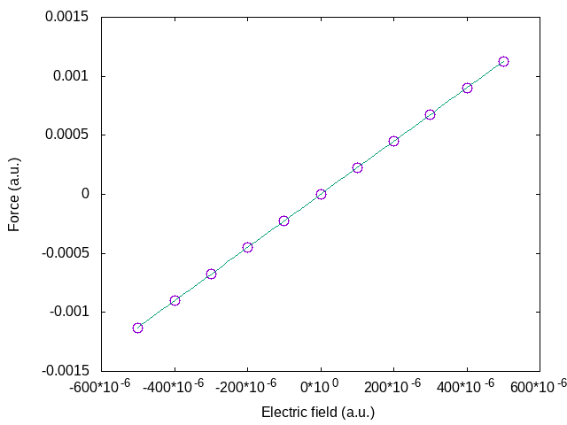
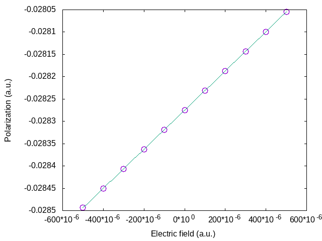
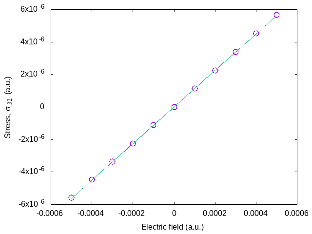

# Polarization and finite electric fields

## Polarization, and responses to finite electric fields for AlP.

This tutorial describes how to obtain the following physical properties, for an insulator:

  * The polarization.
  * The Born effective charge (by finite differences of polarization)
  * The Born effective charge (by finite differences of forces)
  * The dielectric constant
  * The proper piezoelectric tensor (clamped and relaxed ions)

The case of the linear responses (for the Born effective charge, dielectric constant,
piezoelectric tensor) is treated independently in other tutorials
([Response-Function 1](/tutorial/rf1), [Elastic properties](/tutorial/elastic)),
using Density-Functional Perturbation Theory.
You will learn here how to obtain these quantities using finite
difference techniques within ABINIT. To that end, we will describe how to
compute the polarization, in the Berry phase formulation, and how to perform
finite electric field calculations.

The basic theory for the Berry phase computation of the polarization was proposed
by R. D. King-Smith and D. Vanderbilt in [[cite:Kingsmith1993]].
The longer excellent paper by  D. Vanderbilt and R. D. King-Smith ([[cite:Vanderbilt1993]])
clarifies many aspects of this theory.
Good overviews of this subject may be found in the review article
[[cite:Resta1994]] and book [[cite:Vanderbilt2018]].

In order to gain the theoretical background needed to perform a calculation
with a finite electric field, you should consider reading the following papers:
[[cite:Souza2002]], [[cite:Nunes2001]] and
[[https://www.abinit.org/sites/default/files/PhD-M.Veithen.pdf|M. Veithen PhD thesis]].
Finally, the extension to the PAW formalism specifically in ABINIT is
discussed in [[cite:Gonze2009]] and [[cite:Zwanziger2012]].

This tutorial should take about 1 hour and 30 minutes.

[TUTORIAL_README]

## 1 Ground-state properties of AlP and general parameters

*Before beginning, you might consider working in a different subdirectory, as for the other tutorials.
For example, create Work_polarization in \$ABI_TESTS/tutorespfn/Input*

In this tutorial we will assume that the ground-state properties of AlP have
been previously obtained, and that the corresponding convergence studies have been done.
We will adopt the following set of generic parameters:
```
acell   3*7.2728565836E+00
ecut    5    
ecutsm  0.5
dilatmx 1.05
nband   4 (=number of occupied bands)
ngkpt   6 6 6
nshiftk 4
shiftk  0.5 0.5 0.5
        0.5 0.0 0.0
        0.0 0.5 0.0
        0.0 0.0 0.5

pseudopotentials  Pseudodojo_nc_sr_04_pw_standard_psp8/P.psp8
                  Pseudodojo_nc_sr_04_pw_standard_psp8/Al.psp8
```

In principle, the [[acell]] to be used should be the one corresponding to the
optimized structure at the [[ecut]], and [[ngkpt]] combined with [[nshiftk]]
and [[shiftk]], chosen for the calculations.

For the purpose of this tutorial, in order to limit the duration of the runs,
we are working at a low cutoff of 5 Ha, for which the optimized lattice constant is
equal to $7.27\times 2/\sqrt{2}=10.29~\mathrm{Bohr}$. Nonetheless this value is close to
that obtained with a highly converged geometry optimization, of 10.25~Bohr.
As always, if you adapt this tutorial to your own research, it is critical to perform
full convergence studies.
Before going
further, you might refresh your memory concerning the other variables:
[[ecutsm]], [[dilatmx]], [[ngkpt]], [[nshiftk]], and [[shiftk]].

Note as well that the pseudopotentials used here are freely available
from [[http://www.pseudo-dojo.org|Pseudo Dojo]]. The ones chosen here for P and Al
use the Perdew-Wang parameterization of the local density approximation (LDA); this is
done to facilitate comparison of the results of this tutorial with those of 
[Non-linear properties](/tutorial/nlo).

## 2 Berry phase calculation of polarization in zero field

In this section, you will learn how to perform a Berry phase calculation of
the polarization. As a practical problem we will try to compute the Born
effective charges from finite difference of the polarization (under finite
atomic displacements), for AlP.

You can now copy the file *tpolarization_1.abi* to *Work_polarization*,
```sh
cd $ABI_TESTS/tutorespfn/Input
mkdir Workpolarization_
cd Workpolarization_
cp ../tpolarization_1.abi .
```



Note that two pseudopotentials are mentioned in this input file: one for the
phosphorus atom, and one for the aluminum atom. The first listed, for
P in this case, will define the first type of atom. The second listed, for Al,
will define the second type of atom. This might be the first time that you
encounter this situation (more than one type of atom) in the tutorials, in
contrast with the four "basic" tutorials.  Because of the use of more than one
type of atom, the following input variables must be present:

  * [[ntypat]]
  * [[typat]]

You can start the calculation. It should take about 90 seconds on a typical
desktop machine.  In the meantime, examine the *tpolarization_1.abi* file. It
includes three computations (see the section labelled as *atomic positions*)
corresponding to, first, the reference optimized structure ($\tau=0$), and then
to the structure with the Al atom displaced from 0.01 bohr to the  right and to
the left (referred to as $\tau = +0.01$ and $\tau =-0.01$). These  are typical
for the amplitude of atomic displacement in this kind of finite difference
computation. Notice also that the displacements are given using [[xcart]], that
is, explicitly in Cartesian directions in atomic units, rather than the
primitive cell axes (which would use [[xred]]). This makes the correspondence
with the polarization output in Cartesian directions much simpler to
understand.

There are two implementations of the Berry phase within ABINIT. One
is triggered by positive values of [[berryopt]] and was implemented by Na Sai.
The other one is triggered by negative values of [[berryopt]] and was implemented
by Marek Veithen. Both are suitable to compute the polarization, however, here we will
focus on the implementation of Marek Veithen for two reasons. First, the
results are directly provided in Cartesian coordinates at the end of the run
(while the implementation of Na Sai reports them in reduced coordinates).
Second, the implementation of Marek Veithen is the one to be used for the
finite electric field calculation as described in the next section. Finally,
note also that Veithen's implementation works with [[kptopt]] = 1 or 2 while
Na Sai implementation is restricted to [[kptopt]] = 2, which is less convenient.

The input file is typical for a self-consistent ground state calculation. In addition to the
usual variables, for the Berry phase calculation we simply need
to include [[berryopt]] (see also [[rfdir]], the default being usually adequate):
```
berryopt      -1
```

Make the run, then open the output file and look for the occurrence "Berry".
The output reports values of the Berry phase for individual k-point strings.

```
 Computing the polarization (Berry phase) for reciprocal vector:
  0.16667  0.00000  0.00000 (in reduced coordinates)
 -0.01620  0.01620  0.01620 (in cartesian coordinates - atomic units)
 Number of strings:   144
 Number of k points in string:    6

 Summary of the results
 Electronic Berry phase     2.206976733E-03
            Ionic phase    -7.500000000E-01
            Total phase    -7.477930233E-01
    Remapping in [-1,1]    -7.477930233E-01

           Polarization    -1.632453164E-02 (a.u. of charge)/bohr^2
           Polarization    -9.340041842E-01 C/m^2
```
The "Remapping in [-1,1]" is there to avoid the quantum of polarization. As
discussed in [[cite:Djani2012]], the indeterminacy of the quantum phase,
directly related to the quantum of polarization, can lead to spurious effects
(see Fig.  2 of the above-mentioned paper). By remapping on the [-1,1]
interval, any indeterminacy is removed. However, removing such a quantum of
polarization between two calculations might give the false impression that one
is on the same polarization branch in the two calculations, while actually the
branch is made different by this remapping. Cross-checking the polarization
results by computing the Born effective charge, further multiplied by the
displacements between the two geometries is an excellent way to estimate the
amplitude of the polarization.

Other subtleties of Berry phases, explained in [[cite:Vanderbilt1993]], also
apply.  First, note that neither the electronic Berry phase nor the ionic phase
vanish in this highly symmetric case, contrary to intuition. Even though AlP
does not have inversion symmetry, it does have tetrahedral symmetry, which
would be enough to make an ordinary vector vanish. But a lattice-valued vector
does not have to vanish: the lattice just has to transform into itself under
the tetrahedral point group. The ionic phase corresponds actually to a
lattice-valued vector (-3/4 -3/4 -3/4). Concerning the electronic phase, it
does not exactly vanish, unless the sampling of k points becomes continuous. 

If you go further in the file you will find the final results in cartesian
coordinates. You can collect them for the different values of $\tau$.

$\tau = 0$
```
 Polarization in cartesian coordinates (a.u.):
     Total: -0.282749182E-01  -0.282749182E-01  -0.282749182E-01

 Polarization in cartesian coordinates (C/m^2):
     Total: -0.161774270E+01  -0.161774270E+01  -0.161774270E+01
```
$\tau = +0.01$
```
 Polarization in cartesian coordinates (a.u.):
     Total: -0.281920467E-01  -0.282749119E-01  -0.282749119E-01

 Polarization in cartesian coordinates (C/m^2):
     Total: -0.161300123E+01  -0.161774234E+01  -0.161774234E+01
```
$\tau = -0.01$
```
 Polarization in cartesian coordinates (a.u.):
     Total: -0.283577762E-01  -0.282749119E-01  -0.282749119E-01

 Polarization in cartesian coordinates (C/m^2):
     Total: -0.162248340E+01  -0.161774234E+01  -0.161774234E+01
```
From the previous data, we can extract the Born effective charge of Al. Values
to be used are those in a.u., in order to find the charge in electron units. It
corresponds to (the volume of the primitive unit cell must be specified in atomic units too):
$$ Z^* = \Omega_0  \frac{P(\tau = +0.01) - P(\tau = -0.01)}{2\tau} $$
$$=  272.02 \frac{ (-2.8192\times 10^{-2}) - (-2.8358\times 10^{-2})}{0.02} $$
$$ = 2.258$$

For comparison, the same calculation using Density-Functional Perturbation Theory
(DFPT) can be done by using the file *\$ABI_TESTS/tutorespfn/Input/tpolarization_2.abi*.



Actually, the file *tpolarization_2.abi*
not only leads to the computation of the Born effective charges, but also the
computation of the piezoelectric constants (see later).
You can review how to use DFPT in the
[tutorial Response-function 1](/tutorial/rf1) and 
[tutorial Response-function 2](/tutorial/rf2) tutorials. 

!!! note
    An interesting feature of *tpolarization_2.abi* is the use of `berryopt2 -2` in
    the second data set. This input variable causes the computation of the DDK
    wavefunctions using a finite difference formula, rather than the DFPT approach
    triggered by [[rfddk]]. Although not strictly required in the present DFPT calculation,
    the finite difference approach is necessary in the various
    Berry's phase computations of polarization, in order to maintain phase coherency
    between wavefunctions at neighboring k points. Therefore in the present tutorial we use
    the finite difference approach, in order to compare the results of the Berry's phase
    computation to those of DFPT more accurately.

!!! warning
    The use of kpoint overlaps in Berry's phase calculations is necessary, but causes the
    results to converge *much* more slowly with kpoint mesh density than other types of
    calculations. It is critical in production work using Berry's phase methods to check
    carefully the convergence with respect to kpoint mesh density.

Go ahead and run the input file,
and have a look at the output file, to identify the
place where the Born effective charge is written (search for the phrase
"Effective charges"). The value we get from DFPT is 2.254,
in surprisingly good agreement with the above-mentioned value of 2.258.  This
level of agreement is fortuitous for unconverged calculations. Both
methods (finite-difference and DFPT) will tend to the same value for better
converged calculations.

The DDB file generated by *\$ABI_TESTS/tutorespfn/Input/tpolarization_2.abi* can be used as input to
anaddb for further processing, using the input file *tpolarization_3.abi* and the *tpolarization_3.files* file.



!!! note
    While the `abinit` program itself takes its input file as an
    argument, the `anaddb` post-processing program depends in general on multiple
    input files, and therefore it is more convenient to pipe in a file whose
    contents are just the names of the files that `anaddb` should ultimately use.  In
    the present case, the piped-in file *tpolarization_3.files* is written such that the
    DDB file is named *tpolarization_2o_DS3_DDB* (this is defined in the third line of
    *tpolarization_3.files*). In the event of a mismatch, you can either edit
    *tpolarization_3.files* to match the DDB you have, or change the name of the DDB
    file.

The DFPT calculation yields the following
piezoelectric constants, as found in
*tpolarization_3.abo*:
```
 Proper piezoelectric constants (clamped ion) (unit:c/m^2)

      0.00000000     -0.00000000      0.00000000
      0.00000000      0.00000000      0.00000000
     -0.00000000     -0.00000000     -0.00000000
     -0.64263948      0.00000000      0.00000000
      0.00000000     -0.64263948      0.00000000
      0.00000000      0.00000000     -0.64263948
 ....
 Proper piezoelectric constants (relaxed ion) (unit:c/m^2)

      0.00000000      0.00000000     -0.00000000
      0.00000000     -0.00000000     -0.00000000
      0.00000000     -0.00000000     -0.00000000
      0.13114427      0.00000000     -0.00000000
      0.00000000      0.13114427     -0.00000000
     -0.00000000     -0.00000000      0.13114427
```


The piezoelectric constants here are the change in polarization as a function
of strain [[cite:Wu2005]].  The rows are the strain directions using Voigt
notation (directions 1-6) while the columns are the polarization directions. In the
$\bar{4}3m$ crystal class of AlP, the only non-zero piezoelectric elements
are those associated with shear strain (Voigt notation strains $e_4$, $e_5$,
and $e_6$) [[cite:Nye1985]].

The relaxed ion values, where the ionic relaxation largely suppresses the electronic
piezoelectricity, will be more difficult to converge than the clamped ion result.

Because the Berry phase approach computes polarization, it can also be used to compute the
piezoelectric constants from finite difference of polarization with respect to strains.
This can be done considering clamped ions or relaxed ions configurations.
For this purpose, have a look at the files
*t_polarization4.abi* (clamped ions) and *t_polarization5.abi* (relaxed ions).



In these input files the finite strain is applied by multiplying the $e_4$ (Voigt notation)
strain tensor by the (dimensionless) unit cell vectors:
$$ 
   \left[\begin{matrix}
   1 & 0 & 0 \\\
   0 & 1 & e_4/2 \\\
   0 & e_4/2 & 1 \\\
   \end{matrix}\right]
   \left[\begin{matrix}
   0 & 1/\sqrt{2} & 1/\sqrt{2} \\\
   1/\sqrt{2} & 0 & 1/\sqrt{2} \\\
   1/\sqrt{2} & 1/\sqrt{2} & 0 \\\
   \end{matrix}\right]
=
   \left[\begin{matrix}
   0 & 1/\sqrt{2} & 1/\sqrt{2} \\\
   (1+e_4/2)/\sqrt{2} & e_4/2\sqrt{2} & 1/\sqrt{2} \\\
   (1+e_4/2)/\sqrt{2} & 1/\sqrt{2} & e_4/2\sqrt{2} \\\
   \end{matrix}\right]
$$
Don't forget that in the input file, vectors are read in as rows of numbers, not columns!

Notice how in the relaxed ion case, the input file includes [[ionmov]] = 2 and [[optcell]] = 0, in
order to relax the ion positions at fixed cell geometry. These calculations
should give the following final results (obtained by taking finite difference
expressions of the strains for different electric fields): 
$-0.6427~C/m^2$ for the clamped ion case, and $0.1310~C/m^2$ for the relaxed ion case.

For example, the clamped ion piezoelectric constant was obtained from *tpolarization_4.abo*:
```
== DATASET  2 ==========================================================
....
 Polarization in cartesian coordinates (C/m^2):
     Total: -0.162420887E+01  -0.162587046E+01  -0.162587046E+01
....    
== DATASET  3 ==========================================================
     ...
 Polarization in cartesian coordinates (C/m^2):
     Total: -0.161135421E+01  -0.160969264E+01  -0.160969264E+01
```
The difference between -0.162420887E+01 (obtained at strain +0.01) and
-0.161135421E+01 (obtained at train -0.01) gives the finite difference -0.0128546,
which, divided by 0.02 (the total change in strain) gives -0.6427, as noted above.

## 3 Finite electric field calculations

In this section, you will learn how to perform a calculation with a finite electric field.

You can now copy the file *\$ABI_TESTS/tutorespfn/Input/tpolarization_6.abi* to *Work_polarization*.



You can start the run immediately.
It performs a finite field calculation at clamped atomic positions. You can look at this input file to
identify the features specific to the finite field calculation.

As general parameters, one has to specify [[nband]], [[nbdbuf]] and [[kptopt]]:

            nband          4
            nbdbuf         0
            kptopt         1

As a first step (dataset 11), the code must perform a Berry phase calculation
in zero electric field. For that purpose, 
it is necessary to set the values of [[berryopt]]:

            berryopt11     -1

!!! warning

    You cannot use berryopt to +1 to initiate a finite field calculation.
    You must begin with berryopt -1.

After that, there are different steps corresponding to various values of the
electric field, as set by [[efield]]. For those steps, it is important to take
care of the following parameters, as shown here for example for dataset 21:

            berryopt21     4
            efield21       0.0001  0.0001  0.0001
            getwfk21       11

The electric field is applied here along the [111] direction. It must be
incremented step by step (it is not possible to go to high field directly). At
each step, the wavefunctions of the previous step must be used. When the field
gets large, it is important to check that it does not significantly exceed
the critical field for Zener breakthrough (the drop of potential over the
Born-von Karmann supercell must be smaller than the gap). In practice, the
number of k-point must be enlarged to reach convergence. However, at the same
time, the critical field becomes smaller. In practice, reasonable fields can
still be reached for k-point grids providing a reasonable degree of
convergence. A compromise must however be found.

As these calculations are quite long, the input file has been limited to a small
number of
small fields. Three cases have been selected: $E = 0$, $E = +0.0001$ and $E = -0.0001$.
If you have time later, you can perform
more exhaustive calculations over a larger set of fields.

Various quantities can be extracted from the finite
field calculation at clamped ions using finite difference techniques: the Born
effective charge $Z^*$ can be extracted from the difference in forces at 
different electric fields, the optical dielectric
constant can be deduced from the polarizations at different fields, 
and the clamped ion
piezoelectric tensor can be deduced from the stress tensor at different fields. 
As an illustration
we will focus here on the computation of $Z^*$.

Examine the output file. For each field, the file contains various
quantities that can be collected. For the present purpose, we can look at the
evolution of the forces with the field and extract the following results from
the output file:

$E=0$
```
cartesian forces (hartree/bohr) at end:
   1     -0.00000000000000    -0.00000000000000    -0.00000000000000
   2     -0.00000000000000    -0.00000000000000    -0.00000000000000
```
$E = +0.0001$
```
 cartesian forces (hartree/bohr) at end:
    1     -0.00022532204220    -0.00022532204220    -0.00022532204220
    2      0.00022532204220     0.00022532204220     0.00022532204220
```
$E = -0.0001$
```
 cartesian forces (hartree/bohr) at end:
    1      0.00022548273033     0.00022548273033     0.00022548273033
    2     -0.00022548273033    -0.00022548273033    -0.00022548273033
```
In a finite electric field, the force on atom $A$ in direction $i$ can be written as:
$$
F_{A,i} = Z^*_{A,ii}E + \Omega_0 \frac{d\chi}{d\tau} E^2
$$

The value for positive and negative fields above are nearly the same, showing
that the quadratic term is almost negligible. This clearly appears in the
figure below where the field dependence of the force for a larger range of
electric fields is plotted.



We can therefore extract with good accuracy the Born effective charge as:

$$
Z^*_{\mathrm Al}    = \frac{F_{\mathrm Al}(E=+0.0001) - F_{\mathrm Al}(E=-0.0001)}{2\times 0.0001}
= \frac{(2.2532\times 10^{-4}) - (-2.2548\times 10^{-4})}{0.0002}
= 2.254.
$$

This value is similar to the value reported from DFPT. If you do calculations
for more electric fields, fitting them with the general expression of the
force above (including the $E^2$ term), you can find the $d\chi/d\tau$ term.
From the given input file *tpolarization_6.abi*, using all the fields,
you should find $d\chi/d\tau$ for Al of  = -0.0295. 

Going back to the output file, you can also look at the evolution of the
polarization with the field.

$E = 0$
```
 Polarization in cartesian coordinates (a.u.):
     Total: -0.282749182E-01  -0.282749182E-01  -0.282749182E-01
```
$E = +0.0001$
```
 Polarization in cartesian coordinates (a.u.):
     Total: -0.282310128E-01  -0.282310128E-01  -0.282310128E-01
```
$E = -0.0001$
```
 Polarization in cartesian coordinates (a.u.):
     Total: -0.283187730E-01  -0.283187730E-01  -0.283187730E-01
```

In a finite electric field, the polarization in terms of the linear and
quadratic susceptibilities is, in SI units,

$$
P_i = \epsilon_0\chi^{(1)}_{ij} E_j + \epsilon_0\chi^{(2)}_{ijk}  E_jE_k
$$

or, in atomic units:

$$
P_i = \frac{1}{4\pi}\chi^{(1)}_{ij} E_j + \frac{1}{4\pi}\chi^{(2)}_{ijk}  E_jE_k,
$$

as $4\pi\epsilon_0 = 1$ in atomic units.

The change of polarization for positive and negative fields above are nearly
the same, showing again that the quadratic term is almost negligible. This
clearly appears in the figure below where the field dependence of the
polarization for a larger range of electric fields is plotted.



We can therefore extract the linear optical dielectric susceptibility:

$$
\chi_{11}^{(1)} = 4\pi\frac{P_1(E=+0.0001) - P_1(E=-0.0001)}{2\times 0.0001}
= 4\pi\frac{(-2.82310\times 10^{-2}) - (-2.83188\times 10^{-2})}{0.0002}
= 5.5166.
$$

The relative permittivity, also known as the dielectric constant, is

$$
\epsilon_{11}/\epsilon_0 = 1+ \chi^{(1)}_{11} = 6.5166.
$$

This value is a bit over the value of 6.463 obtained by DFPT from *tpolarization_3.abi*. 
Typically, finite field calculations converge with
the density of the k point grid more slowly than DFPT calculations.

If you do calculations for more electric fields, fitting them with the general
expression of the polarization above (including the $E^2$ term) you can find the non-
linear optical susceptibility $\chi^{(2)}/4\pi$ (in atomic units). 
For *tpolarization_6.abi* you should find $\chi^{(2)}/4\pi = 2.5427$, so 
in SI units $\chi^{(2)} = 62.14~\mathrm{pm/V}$ and $d_{36} = 15.54~\mathrm{pm/V}$. 
The relationship between the $\chi^{(2)}_{ijk}$ tensor and the $d_{ij}$ tensor (the
quantity reported by `abinit` in a nonlinear optics DFPT computation) involves
a variety of symmetries and is explained in detail in the book [[cite:Boyd2020]].

Looking at the evolution of the stress with electric field (see graphic below), you should also be
able to extract the piezoelectric constants. You can try to do it as an
exercise. As the calculation here was at clamped ions, you will get the
clamped ion proper piezoelectric constants. You should
obtain -0.6365 C/m$^2$. The relationships between the various response functions under
conditions of strain, stress, field, and so forth are discussed in depth in
[[cite:Wu2005]].



You can modify the previous input file to perform a finite field 
calculation combined with ion relaxation, similarly to how
*tpolarization_5.abi* was modified from *tpolarization_4.abi*, giving access to the
the relaxed ion proper piezoelectric constant.
From the output of this run, analyzing the results in the same way as before,
you should obtain 0.1311 C/m$^2$ for the relaxed ion piezoelectric constant.
