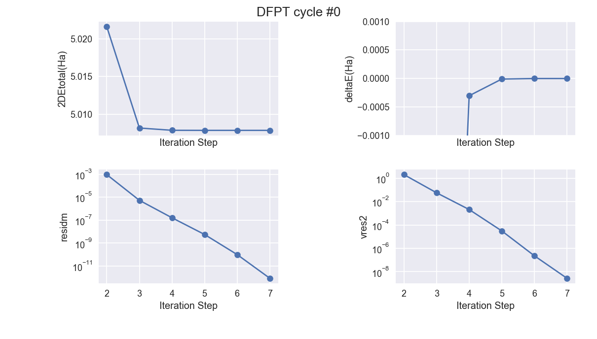

# First tutorial on DFPT

## Dynamical and dielectric properties of AlAs

In this tutorial you will learn how to get the following physical properties (of an insulator) from density-functional perturbation theory (DFPT):

  * the phonon frequencies and eigenvectors at $\Gamma$
  * the dielectric constant
  * the Born effective charges
  * the LO-TO splitting
  * the phonon frequencies and eigenvectors at other q-points in the Brillouin Zone

In order to learn the use of the associated codes *mrgddb* and *anaddb*,
to produce phonon band structures and the associated
thermodynamical properties, please consult the [second tutorial on DFPT](rf2).

This tutorial should take about 2 hours.

[TUTORIAL_README]

## 1 The ground-state geometry of AlAs

*Before beginning, you might consider to work in a different subdirectory as for the other tutorials.
Why not create Work_rf1 in \$ABI_TESTS/tutorespfn/Input?*

```sh
cd $ABI_TESTS/tutorespfn/Input
mkdir Work_rf1
cd Work_rf1
cp ../trf1_x.files .   # You will need to edit this file.
cp ../trf1_1.in .
```

!!! important

    The reference directory that contains the example files for the
    tutorial is no more `$ABI_TESTS/tutorial`(as for the basic tutorials and the
    specialized, non-DFPT ones), but `$ABI_TESTS/tutorespfn`.
    This will be the case for all the DFPT based part of the tutorial.

The file *trf1_x.files* lists the file names and root names.



You can copy it in the *Work_rf1* directory and, as usual, change its name to *trf1_1.files*
and replace the occurrences of `trf1_x` by `trf1_1`.

Note that two pseudopotentials are mentioned in this *files* file: one
for the Aluminum atom, and one for the Arsenic atom.
The first listed in *trf1_x.files* (for Al) will define the first type of atom of the input file
(see input variables [[typat]] and [[ntypat]]) and the second (for As) will define the second type of atom.
It might be the first time that you encounter this situation (more than one type of atoms) in the
tutorials, at variance with the first four basic tutorials.

You can also copy the file *\$ABI_TESTS/tutorespfn/Input/trf1_1.in* in *Work_rf1*.
This is your input file. You should read it carefully.



It drives a single self-consistent calculation of the total energy of AlAs to generate the corresponding
self-consistent charge density and wavefunctions, that will be used for the DFPT calculations.

Note that the value of [[tolvrs]] is rather stringent.
This is because the wavefunctions determined by the present run will be used later as starting
point of the DFPT calculation.
However, the number of steps, [[nstep]], in this example file has been set to 15, and
you will see that this is not enough to reach the target [[tolvrs]].
In production runs, you should choose a large enough value of [[nstep]] to reach your [[tolvrs]] target.
In the present tutorial, due to portability concerns related to automatic testing, we could
not allow a larger [[nstep]].
This minor problem with some tutorial examples was mentioned briefly in
a side note to the answer to question 1 of tutorial 1 - just before
[this section](base1#computation-of-the-interatomic-distance-method-1).

!!! danger

    Do not follow blindly all examples of the tutorials: always check the convergence of your calculations while in production!

You will work at fixed [[ecut]] (3Ha) and k-point grid, defined by [[kptrlatt]] (the 8x8x8 Monkhorst-Pack grid).
In *real life* you should do a convergence test with respect to both parameters.
We postpone the discussion of the accuracy of these choices and
the choice of pseudopotential to the end of the
[fifth section of this tutorial](#5-dfpt-calculation-of-the-effect-of-an-homogeneous-electric-field).
They give acceptable but not very accurate results such that the running time is reasonable for a tutorial.

You should make the run (a few seconds):

    abinit < trf1_1.files > log 2> err

The resulting main output file, *trf1_1.out*, should be similar to the one below:



This output file is not very long, so you can quickly read it entirely.
Note that one obtains the following value for the energy, in the final echo section:

     etotal   -9.7626837450E+00

However, we will rely later, for the purpose of doing finite differences, on a more accurate (more digits) value of this
total energy, that can be found about a dozen of lines before this final echo:

    >>>>>>>>> Etotal= -9.76268374500280E+00

The output file also mentions that the forces on both atoms vanish.

The run that you just made will be considered as defining a ground-state
configuration, on top of which responses to perturbations will be computed.
The main output of this ground-state run is the wavefunction file *trf1_1o_WFK*,
that you can already rename as *trf1_1i_WFK* to use it as input wave function for the next runs.

!!! warning

    So, in the corresponding *files* file for all the following runs, at third line,
    pay attention **to keep** "trf1_1i". By contrast, for the second run, you
    should change the first line from "trf1_1" to "trf1_2", and do similarly for the second,
    fourth and fifth lines of this file.

## 2 Frozen-phonon calculation of a second derivative of the total energy

We will now compute the second derivative of the total energy with
respect to an atomic displacement by different means.
For that purpose, you must first read [[help:respfn#intro|sections 0 and the first paragraph of section 1]]
of the *respfn help* file (the auxiliary help file, that deals specifically with the DFPT features).
We will explain later, in more detail, the signification of the different
input parameters introduced in section 1 of the *respfn help* file.

For the time being, in order to be able to perform a direct comparison with the result of
a DFPT calculation, we choose as a perturbation the displacement of the Al
atom along the first axis of the reduced coordinates.

You can copy the file *\$ABI_TESTS/tutorespfn/Input/trf1_2.in* in *Work_rf1*.
This is your input file. You should open it and briefly look at the two
changes with respect to *trf1_1.in*:
the change of [[xred]], and the reading of the wavefunction file, using the [[irdwfk]] input variable.

Then, you can make the run, following the same command as before, with a different files file, referring to *trf1_2.in*.
The symmetry is lowered with respect to the ground-state geometry, so that the number of k-points
increases a lot, and of course, the CPU time.



From this run, it is possible to get the values of the total energy, and the
value of the gradient of the total energy (dE) with respect to change of reduced coordinate (dt):

     rms dE/dt=  3.5517E-03; max dE/dt=  5.0079E-03; dE/dt below (all hartree)
        1       0.005007937776      0.002526310510      0.002526310510
        2      -0.005007879256     -0.002526283046     -0.002526283046
     ...
        >>>>>>>>> Etotal= -9.76268124105767E+00

The change of reduced coordinate ([[xred]]) of the Al atom along the first axis was
rather small (1/1000 = 0.001), and we can make an estimate of the second derivative of
the total energy with respect to the reduced coordinate thanks to finite-difference formulas.

We start first from the total-energy difference.
The total energy is symmetric with respect to that perturbation, so that it has no linear term.
The difference between the ground-state value (-9.76268374500280E+00 Hartree) of
the previous run, and the perturbed value (-9.76268124105767E+00 Hartree) of
the present one, is thus one half of the square of the coordinate change
(0.001) times the second derivative of total energy (2DTE).
From these number, the 2DTE is 5.0078902589 Hartree.

Alternatively, we can start from the reduced gradients. The value of the
reduced gradient with respect to a displacement of the Al atom along the first
reduced axis is 0.005007937776 Ha. At first order, this quantity is the
product of the 2DTE by the reduced coordinate difference. The estimate of the
2DTE is thus 5.007937776 Ha. The agreement with the other estimate is rather good (4.10^-5 Hartree).

However, it is possible to do much better, thanks to the use of a higher-order finite-difference formula.
For this purpose, one can perform another calculation, in which the change of
reduced coordinate along the first axis is 0.002, instead of 0.001.
The doubling of the perturbation allows for a rather
simple higher-order estimation, as we will see later.
The results of this calculation are as follows:

     rms dE/dt=  7.1249E-03; max dE/dt=  1.0016E-02; dE/dt below (all hartree)
        1       0.010016307568      0.005097516146      0.005097516146
        2      -0.010016187598     -0.005097463261     -0.005097463261
     ...

From these data, taking into account that the perturbation was twice stronger,
the same procedure as above leads to the values 5.00800219 Hartree (from
finite difference of energy) and 5.008153784 Hartree (from finite difference
of forces, the value 0.010016307568 has to be multiplied by 1000/2).

The combination of these data with the previous estimate can be done thanks to an
higher-order finite-difference formula, in which the difference of estimations
(the largest perturbation minus the smallest one) is divided by three, and
then subtracted from the smallest estimation.

As far as the total-energy estimation is concerned, the difference is 0.00011194 Ha, which divided by
three and subtracted from 5.00789025 Hartree, gives 5.00785294 Hartree.
The same higher-order procedure for force estimates gives 5.0078657 Hartree. So,
the agreement between total-energy estimate and force estimate of the 2DTE can
be observed up to the 6th digit, inclusive.

Before comparing this result with the 2DTE directly computed from the DFPT
capabilities of ABINIT, a last comment is in order. One can observe that the
action-reaction law is fulfilled only approximately by the system. Indeed, the
force created on the second atom, should be exactly equal in magnitude to the
force on the first atom. The values of dE/dt, mentioned above show a small,
but non-negligible difference between the two atoms. As an example, for the
doubled perturbation, there is a difference in the absolute values of the
first component of the reduced force, 0.010016307568 and -0.010016187598.

Actually, the forces should cancel each other exactly if the translation
symmetry is perfect. This is not the case, but the breaking of this symmetry
can be shown to arise **only** from the presence of the exchange-correlation
grid of points. This grid does not move when atoms are displaced, and so there
is a very small variation of the total energy when the system is moved as a
whole. It is easy to restore the action-reaction law, by subtracting from
every force component the mean of the forces on all atoms. This is actually
done when the gradient with respect to reduced coordinates are transformed
into forces, and specified in cartesian coordinates, as can be seen in the
output file for the small displacement:

     cartesian forces (hartree/bohr) at end:
        1     -0.00001684560079    -0.00094403841497    -0.00094403841497
        2      0.00001684560079     0.00094403841497     0.00094403841497

This effect will be seen also at the level of 2DTE. The so-called *acoustic sum rule*,
which imposes that the frequency of three modes (called acoustic modes)
tends to zero with vanishing wavevector, will also be slightly broken. In this
case, it will also be rather easy to reimpose the acoustic sum rule. In any
case, taking a finer XC grid will allow one to reduce this effect.

## 3 DFPT calculation of a second derivative of the total energy

We now compute the second derivative of the total energy with respect to the
same atomic displacement through the DFPT capabilities of ABINIT.

You can copy the file *\$ABI_TESTS/tutorespfn/Input/trf1_3.in* in *Work_rf1*.
This is your input file. You should examine it. The changes with respect to
*trf1_1.in* are all gathered in the first part of this file, before

```
#######################################################################
#Common input variables
```

Accordingly, you should get familiarized with the new input variables:
[[rfphon]], [[rfatpol]], [[rfdir]]. Then, pay attention to the special use of
the [[kptopt]] input variable. It will be explained in more detail later.



When you have understood the purpose of the input variable values specified
before the "Common input variables" section, you can make the code run, as usual.

Then, we need to analyze the different output files. For that purpose, you should read
the content of the [[help:respfn#output|section 6]] of the respfn help file.
Read it quickly, as we will come back to the most important points hereafter.

ABINIT has created several different files:

  * *trf1_3.log* (the log file)
  * *trf1_3.out* (the output file), possibly also trf1_3o_OUT.nc, an abridged netCDF version
  * *trf1_3o_1WF1* (the 1st-order wavefunction file)
  * *trf1_3o_DEN1* (the 1st-order density file)
  * *trf1_3o_POT1* (the 1st-order potential file)
  * *trf1_3o_DDB* (the derivative database), possibly also *trf1_3o_DDB.nc*, its netCDF version

Let us have a look at the output file. You can follow the description provided
in the [[help:respfn#output|section 6.2]] of the respfn help file.



You should be able to find the place where the iterations
for the minimisation (with respect to the unique perturbation) take place:

          iter   2DEtotal(Ha)       deltaE(Ha) residm    vres2
    -ETOT  1   6.5156050845578     -1.464E+01 1.146E-02 1.947E+02
     ETOT  2   5.0216332567384     -1.494E+00 9.267E-04 2.027E+00
     ETOT  3   5.0081675390166     -1.347E-02 5.325E-06 5.660E-02
     ETOT  4   5.0078655420156     -3.020E-04 1.601E-07 2.087E-03
     ETOT  5   5.0078558671678     -9.675E-06 5.588E-09 3.089E-05
     ETOT  6   5.0078557436628     -1.235E-07 9.879E-11 2.297E-07
     ETOT  7   5.0078557427888     -8.741E-10 8.545E-13 2.728E-09

From these data, you can see that the 2DTE determined by the DFPT technique is
in excellent agreement with the higher-order finite-difference values for the
2DTE, determined in the previous section: 5.007855 Hartree from the energy
differences, and 5.007852 Hartree from the force differences.

Now, you can read the remaining of the [[help:respfn#output|section 6.2]] of the respfn help file.
Then, you should also open the *trf1_3o_DDB* file, and read the
corresponding [[help:respfn#ddb|section 6.5]] of the respfn help file.

Finally, the excellent agreement between the finite-difference formula and the
DFPT approach calls for some accuracy considerations. These can be found in
[[help:respfn#numerical-quality|section 7]] of the respfn help file.

!!! tip

    With |AbiPy|, one can easily visualize the convergence of the DFPT cycle with the |abiopen| script
    and the syntax:

        abiopen.py trf1_3.out --expose -sns=talk

    

## 4 DFPT calculation of the dynamical matrix at $\Gamma$

We are now in the position to compute the full dynamical matrix at the $\Gamma$ point (q=0).
You can copy the file *\$ABI_TESTS/tutorespfn/Input/trf1_4.in* in *Work_rf1*.
This is your input file.

As for test rf1_3, the changes with respect to *trf1_1.in* are
all gathered in the first part of this file. Moreover, the changes with
respect to *trf1_3.in* concern only the input variables [[rfatpol]], and [[rfdir]].
Namely, all the atoms will be displaced, in all the directions.



There are six perturbations to consider.
So, one might think that the CPU time will raise accordingly.
This is not true, as ABINIT is able to determine which perturbations are the symmetric of another perturbation,
see [[help:respfn#symmetries|section 3]] of the respfn help file.

Now, you can make the run. You open the file *trf1_4.out*, and notice that the
response to two perturbations were computed explicitly, while the response to
the other four could be deduced from the two first by using the symmetries.

     The list of irreducible perturbations for this q vector is:
        1)    idir= 1    ipert=   1
        2)    idir= 1    ipert=   2

Nothing mysterious: one of the two irreducible perturbations is for the Al
atom, placed in a rather symmetric local site, and the other perturbation is for the As atom.

The phonon frequencies, obtained by diagonalizing the dynamical matrix (where
the atomic masses have been taken into account, see [[amu]]), are given as follows:

      Phonon wavevector (reduced coordinates) :  0.00000  0.00000  0.00000
     Phonon energies in Hartree :
       2.558878E-06  2.558879E-06  2.558880E-06  1.568559E-03  1.568559E-03
       1.568559E-03
     Phonon frequencies in cm-1    :
    -  5.616089E-01  5.616089E-01  5.616092E-01  3.442590E+02  3.442590E+02
    -  3.442590E+02

!!! tip

    You might wonder about the dash sign present in the first column of the two
    lines giving the frequencies in cm$^{-1}$. The first column of the main ABINIT
    output files is always dedicated to signs needed to automatically treat the
    comparison with respect to reference files. Except if you become an ABINIT
    developer, you should ignore these signs. In the present case, they should not
    be interpreted as a minus sign for the floating numbers that follow them...

There are a good and a bad news about this result. The good news is that
there are indeed three acoustic modes, with frequency rather close to zero
(less than 1 cm$^{-1}$, which is rather good!). The bad news comes when the three
other frequencies are compared with experimental results, or other theoretical
results. Indeed, in the present run, one obtains three degenerate modes, while
there should be a (2+1) splitting. This can be seen in the paper Ab initio
calculation of phonon dispersions in semiconductors [[cite:Giannozzi1991]], especially Fig. 2.

Actually, we have forgotten to take into account the coupling between atomic
displacements and the homogeneous electric field, that exists in the case of
polar insulators, for so-called "Longitudinal Optic (LO) modes". A splitting
appears between these modes and the "Transverse Optic (TO) modes". This
splitting (Lyddane-Sachs-Teller LO-TO splitting) is presented in simple terms
in standard textbooks, and should not be forgotten in doing Ab initio
calculations of phonon frequencies.

Thus we have now to treat correctly the homogeneous electric field type perturbation.

<a id="5"></a>
## 5 DFPT calculation of the effect of an homogeneous electric field

The treatment of the homogeneous electric field perturbation is formally much
more complex than the treatment of atomic displacements.
This is primarily because the change of potential associated with an homogeneous electric field
is not periodic, and thus does not satisfy the Born-von Karman periodic boundary conditions.

For the purpose of the present tutorial, one should read the section II.C of
the above-mentioned paper [[cite:Giannozzi1991]].
The reader will find in  [[cite:Gonze1997]] and [[cite:Gonze1997a]]
more detailed information about this perturbation, closely related to the ABINIT implementation.
There is also an extensive discussion of the Born
effective charges by [[cite:Ghosez1998]].

In order to compute the response of solids to an homogeneous electric field in ABINIT,
the remaining sections of the respfn help file
should be read. These sections also present the information needed to compute
phonons with non-zero q wavevector, which will be the subject of the next
section of the present tutorial. The sections to be read are:

  * the part of [[help:respfn#1|section 1]] that had not yet been read
  * [[help:respfn#2|section 2]]
  * [[help:respfn#4|section 4]]
  * and, for completeness, [[help:respfn#5|section 5]]

You are now in the position to compute the full dynamical matrix at $\Gamma$ (q=0),
including the coupling with an homogeneous electric field.
You can copy *\$ABI_TESTS/tutorespfn/Input/trf1_5.in* in *Work_rf1*.
This is your input file.



As for the other DFPT tests, the changes with respect to the *trf1_1.in* are all gathered
in the first part of this file.
Unlike the other tests, however, the multi-dataset mode was used, computing from scratch
the ground-state properties, then computing the effect of the ddk perturbation, then the effect of all
other perturbations (electric field as well as atomic displacements).

The analysis of the output file is even more cumbersome than the previous ones.
Let us skip the first dataset. In the dataset 2 section, one perturbation is correctly selected:

     ==>  initialize data related to q vector <==

     The list of irreducible perturbations for this q vector is:
        1)    idir= 1    ipert=   3

    ================================================================================

    --------------------------------------------------------------------------------
     Perturbation wavevector (in red.coord.)   0.000000  0.000000  0.000000
     Perturbation : derivative vs k along direction   1


The analysis of the output for this particular perturbation is not
particularly interesting, except for the f-sum rule ratio

     dfpt_looppert : ek2=    1.6833336546E+01
              f-sum rule ratio=    1.0028582975E+00

that should be close to 1, and becomes closer to it when [[ecut]] is
increased, and the sampling of k points is improved. (In the present status of
ABINIT, the f-rule ratio is not computed correctly when [[ecutsm]]/=0)

In the third dataset section, three irreducible perturbations are considered:

     ==>  initialize data related to q vector <==

     The list of irreducible perturbations for this q vector is:
        1)    idir= 1    ipert=   1
        2)    idir= 1    ipert=   2
        3)    idir= 1    ipert=   4

Much later, the dielectric tensor is given:

      Dielectric tensor, in cartesian coordinates,
         j1       j2             matrix element
      dir pert dir pert     real part    imaginary part

       1    4   1    4    9.7606052146    -0.0000000000
       1    4   2    4    0.0000000000    -0.0000000000
       1    4   3    4    0.0000000000    -0.0000000000

       2    4   1    4    0.0000000000    -0.0000000000
       2    4   2    4    9.7606052146    -0.0000000000
       2    4   3    4    0.0000000000    -0.0000000000

       3    4   1    4    0.0000000000    -0.0000000000
       3    4   2    4    0.0000000000    -0.0000000000
       3    4   3    4    9.7606052146    -0.0000000000


It is diagonal and isotropic, and corresponds to a dielectric constant of 9.7606052146.

Then, the Born effective charges are given, either computed from the
derivative of the wavefunctions with respect to the electric field, or
computed from the derivative of the wavefunctions with respect to an atomic
displacement, as explained in section II of [[cite:Gonze1997a]]:

      Effective charges, in cartesian coordinates,
      (from electric field response)
      ...


and

      Effective charges, in cartesian coordinates,
      (from phonon response)
      ...

Namely, the Born effective charge of the Al atom is 2.104, and the one of the
As atom is -2.127. The charge neutrality sum rule is not fulfilled exactly.
When [[ecut]] is increased, and the sampling of k points is improved, the sum
of the two charges goes closer to zero.

Finally, the phonon frequencies are computed:

      Phonon wavevector (reduced coordinates) :  0.00000  0.00000  0.00000
     Phonon energies in Hartree :
       2.558878E-06  2.558879E-06  2.558880E-06  1.568559E-03  1.568559E-03
       1.568559E-03
     Phonon frequencies in cm-1    :
    -  5.616089E-01  5.616089E-01  5.616092E-01  3.442590E+02  3.442590E+02
    -  3.442590E+02

      Phonon at Gamma, with non-analyticity in the
      direction (cartesian coordinates)  1.00000  0.00000  0.00000
     Phonon energies in Hartree :
       2.558878E-06  2.558879E-06  4.068910E-06  1.568559E-03  1.568559E-03
       1.729575E-03
     Phonon frequencies in cm-1    :
    -  5.616089E-01  5.616089E-01  8.930225E-01  3.442590E+02  3.442590E+02
    -  3.795979E+02

      Phonon at Gamma, with non-analyticity in the
      direction (cartesian coordinates)  0.00000  1.00000  0.00000
     Phonon energies in Hartree :
       2.558878E-06  2.558880E-06  4.068909E-06  1.568559E-03  1.568559E-03
       1.729575E-03
     Phonon frequencies in cm-1    :
    -  5.616089E-01  5.616092E-01  8.930223E-01  3.442590E+02  3.442590E+02
    -  3.795979E+02

      Phonon at Gamma, with non-analyticity in the
      direction (cartesian coordinates)  0.00000  0.00000  1.00000
     Phonon energies in Hartree :
       2.558879E-06  2.558880E-06  4.068909E-06  1.568559E-03  1.568559E-03
       1.729575E-03
     Phonon frequencies in cm-1    :
    -  5.616089E-01  5.616092E-01  8.930223E-01  3.442590E+02  3.442590E+02
    -  3.795979E+02


There are four sections. In the first one, any effect of the homogeneous electric field is simply discarded,
while the three next sections the electric field is considered along the three cartesian coordinates.

In the present material, the directionality of the electric field has no
influence. We note that there are still three acoustic mode, below 1 cm$^{-1}$,
while the optic modes have the correct degeneracies: two TO modes at 344.3
cm$^{-1}$, and one LO mode at 379.6 cm$^{-1}$.

These values can be compared to experimental (361 cm$^{-1}$, 402 cm$^{-1}$) as well
as theoretical (363 cm$^{-1}$, 400 cm$^{-1}$) values (again [[cite:Giannozzi1991]]).
Most of the discrepancy comes from the too low value of
[[ecut]]. Using ABINIT with [[ecut]]=6 Hartree gives (358.8 cm$^{-1}$, 389.8 cm$^{-1}$).
The remaining of the discrepancy may come partly from the
pseudopotentials, that are particularly soft.

The comparison of Born effective charges is also interesting. After imposition
of the neutrality sum rule, the Al Born effective charge is 2.116. The value
from Gianozzi et al is 2.17, the experimental value is 2.18.
Increasing [[ecut]] to 6 Hartree in ABINIT gives 2.168.

For the dielectric tensor, it is more delicate. The value from Gianozzi et al
is 9.2, while the experimental value is 8.2 . The agreement is not very good,
a fact that can be attributed to the DFT lack of polarization-dependence [[cite:Gonze1995a]].
Still, the agreement of our calculation with the theoretical result is not very good. With
[[ecut]] = 3 Hartree, we have 9.76. Changing it to 6 Hartree gives 10.40 . A
better k point sampling (8x8x8), with [[ecut]] = 6 Hartree, reduces the value to 9.89.
Changing pseudopotentials finally improves the agreement: with the
much harder *13al.pspgth* and *33as.psphgh* pseudopotentials with adequate
[[ecut]] = 16 Hartree and 8x8x8 Monkhorst-Pack sampling, we reach a value of 9.37.
This illustrates that the dielectric tensor is a much more sensitive quantity than the others.

## 6 DFPT calculation of phonon frequencies at non-zero q

The computation of phonon frequencies at non-zero q is actually simpler than the one at $\Gamma$.
One must distinguish two cases. Either the q wavevector connects k points that belong
to the same grid, or the wavevector q is general.
In any case, the computation within the reciprocal space DFPT formalism is more
efficient than the real space frozen-phonon technique since the use of supercells is
completely avoided with DFPT. For an explanation of this fact, see for example section IV of [[cite:Gonze1997]].

You can copy the file *\$ABI_TESTS/tutorespfn/Input/trf1_6.in* in *Work_rf1*.
This is your input file.



As for the other RF tests, the changes with respect to *trf1_1.in* are
all gathered in the first part of this file.
The multi-dataset mode is used, computing from scratch the ground-state wave functions, then computing different
dynamical matrices with DFPT.
The run is about 1...2 minutes on a 2.8 GHz machine.
In the mean time, you might read more of the ABINIT documentation
(why not the [[help:mrgddb|mrgddb_help]] and the [[help:anaddb|anaddb_help]]).

The results of this simulation can be compared to those provided in [[cite:Giannozzi1991]].
The agreement is rather good, despite the low cut-off energy, and different pseudopotentials.

At X, they get 95 cm$^{-1}$, 216 cm$^{-1}$, 337 cm$^{-1}$ and 393 cm$^{-1}$, while we get
92.5 cm$^{-1}$, 204.6 cm$^{-1}$, 313.9 cm$^{-1}$ and 375.9 cm$^{-1}$.
With [[ecut]]=6 Hartree, we get 89.7 cm$^{-1}$, 212.3 cm$^{-1}$, 328.5 cm$^{-1}$ and 385.8 cm$^{-1}$.

At L, they get 71 cm$^{-1}$, 212 cm$^{-1}$, 352 cm$^{-1}$ and 372 cm$^{-1}$, while we get
69.0 cm$^{-1}$, 202.5 cm$^{-1}$, 332.6 cm$^{-1}$ and 352.3 cm$^{-1}$. With [[ecut]]=6 Hartree, we
get 68.1 cm$^{-1}$, 208.5 cm$^{-1}$, 346.7 cm$^{-1}$ and 362.6 cm$^{-1}$.

At q=(0.1 0 0), we get 31.6 cm$^{-1}$, 63.6 cm$^{-1}$, 342.0 cm$^{-1}$ and 379.7 cm$^{-1}$. The
acoustic modes tends (nearly-)linearly to zero, while the optic modes are
close to their values at $\Gamma$ : 344.3 cm$^{-1}$ and 379.6 cm$^{-1}$.

* * *

!!! note
    This ABINIT tutorial is now finished.
    You are advised to go through the [second tutorial on DFPT](rf2) to
    make some post-processing analysis (phonon dispersions, thermodynamical properties, *etc*)

