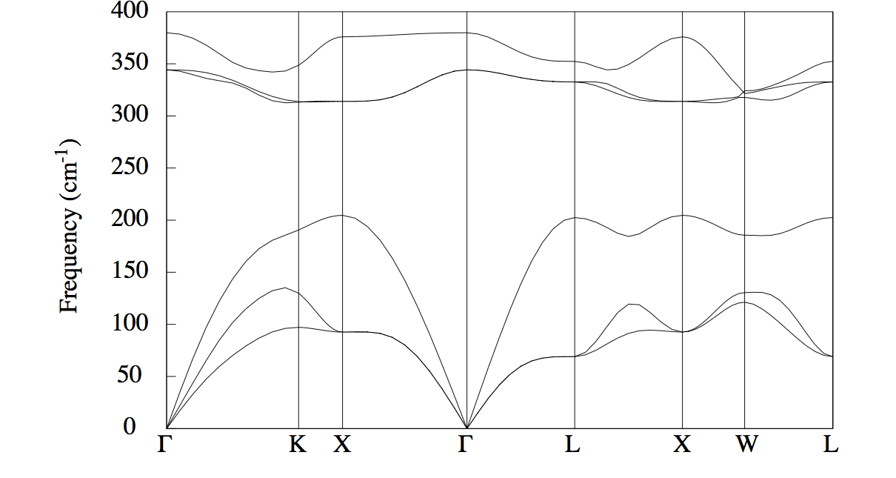

# Second tutorial on DFPT:

## Phonon band structures, thermodynamical properties.

In this tutorial you will learn how to post-process the raw data of the Abinit DFPT calculations to
get the following physical properties of periodic solids:

* Interatomic forces constants
* Phonon band structures
* Thermodynamical properties

Visualisation tools are NOT covered in this tutorial.
Powerful visualisation procedures have been developed in the Abipy context,
relying on matplotlib. See the README of [Abipy](https://github.com/abinit/abipy)
and the [Abipy tutorials](https://github.com/abinit/abitutorials).

This tutorial should take about 1 hour.

[TUTORIAL_README]

## 0 Generation of necessary input wavefunctions

*Before beginning, you might consider working in a different subdirectory as
for the other tutorials, in order to help keep track of all the files.
Why not create Work_rf2 in \$ABI_TESTS/tutorespfn/Input?*

As the DFPT equations at higher order always start from input wavefunctions
obtained at lower order, we begin by generating the ground state wavefunctions
and DDK wavefunctions for our system, AlAs. The ground state wavefunctions are needed
for the phonon and electric field perturbations, and the electric field perturbation
needs the DDK wavefunctions as well, as explained in the [first tutorial on DFPT](/tutorial/rf1).

Copy file *trf2_1.abi* from  \$ABI_TESTS/tutorespfn/Input* to *Work_rf2*:

```sh
cd $ABI_TESTS/tutorespfn/Input;
mkdir Work_rf2;
cd Work_rf2;
cp ../trf2_1.abi
```
Execute this file with

    abinit trf2_1.abi >& log &

Let us have a look at the input file *trf2_1.abi*.



This input file consists of two datasets--the first generates the
ground state wavefunctions, with tight convergence: these are output
in the file *trf2_1o_DS1_WFK*.  The second dataset uses these
wavefunctions to generate the DDK wavefunctions, which are output in
the files *trf2_1o_DS2_1WF7*, *trf2_1o_DS2_1WF8*, and
*trf2_1o_DS2_1WF9*. Depending on the details of your build, these
files might be appended with *.nc*, if they are produced in `netcdf`
format.

A note on the naming convention--the DDK files here are named 1WF7,
1WF8, and 1WF9. The "1" signifies a first-order wavefunction. Then,
ABINIT numbers each perturbation, such that the phonons are numbered
1..3N, for an N atom system. Here N = 2, for AlAs. The DDK
perturbations are numbered 3N+1, 3N+2, and 3N+3, for the three
cartesian directions, giving in this case 7, 8, and 9.

## 1 Generation of a derivative database

With the necessary input wavefunctions generated, we are ready to compute the derivative
database.

Copy the file *trf2_2.abi* from  \$ABI_TESTS/tutorespfn/Input* into your working directory:

```sh
cp ../trf2_2.abi .
```
Before you run it, you will have to name the input wavefunctions that you prepared in step 0
appropriately, so ABINIT can find them. 

Examine the input file you are about to run:



Notice the lines `ndtset 8`, `getddk 98`, and `getwfk 99`. Since we
will be looping over multiple datasets (8, in fact), in order to
compute multiple perturbations in a single file, we use multi dataset
mode. But this requires any files to be read in, to be given dataset
numbers in the same format. We avoid low numbers, because those are
the new datasets we are about to run; it's thus convenient to relabel
the ground state and DDK wavefunctions with the dataset labels 99 and
98. Thus you can rename with

```sh
mv trf2_1o_DS1_WFK trf2_2o_DS99_WFK;
mv trf2_1o_DS2_1WF7 trf2_2o_DS98_1WF7;
mv trf2_1o_DS2_1WF8 trf2_2o_DS98_1WF8;
mv trf2_1o_DS2_1WF9 trf2_2o_DS98_1WF9
```
Append each new file with ".nc" if the original files were ".nc" files.

Now you can execute the file with

    abinit trf2_2.abi >& log &

It takes about 1-2 minutes to be completed on a PC 2.8 GHz.

In order to do interatomic force constant (IFC) calculations, and to
compute associated phonon band structure and thermodynamical
properties, you should first have some theoretical background.  Let us
assume that you have read the literature relative to the [first
tutorial on DFPT](/tutorial/rf1).  You might find additional material,
related to the present section, in [[cite:Gonze1997a]] -especially
section IX-, [[cite:Lee1995]] and [[cite:Baroni2001]].  If you haven't
read parts of these references, we strongly advise you to take the time
to read them now.

In short, the idea is that, in order to compute properties for which
the phonon frequencies are needed in the full Brillouin zone, one can
use an elaborate Fourier interpolation, so that only few dynamical
matrices need to be computed directly. Others will be computed by
interpolation.  A schematic representation of the different steps
required to compute the dynamical matrix in the IBZ and post-process
the results with anaddb is given below.


The calculation is done for AlAs, the same crystalline material as for
the first tutorial on DFPT.  Many input parameters are also quite
similar, both at the level of the description of the unit cell and for
the choice of cut-off energy and k point grid. The input file
`trf2_2.abi` consists of a loop over a small set of phonons, and all other
phonons will be determined later by interpolation. Moreover, the electric
field perturbation is also a long wavelength, hence Gamma phonon perturbation,
and can be computed at the same time. Thus our first dataset in
`trf2_2.abi` is the Gamma phonon and the electric field both, and the other
datasets are the additional nonzero q point phonons we wish to consider explicitly.

The values of the phonon q wavevectors are not determined arbitrarily.
They must correspond to the q wavevectors needed by the ANADDB utility (see later),
that is, they should form a reduced set of symmetry-inequivalent wavevectors,
corresponding to a regularly spaced grid. In principle, they need not include
the Gamma point, but it is **recommended** to have it in the set, in order for the
Fourier interpolation not to introduce errors at that important point.

!!! tip

    In order to minimize the number of preliminary non-self-consistent calculations,
    it is advised to take a q point mesh that is adjusted to the k point mesh used
    for the electronic structure: all q wavevectors should connect two k point
    wavevectors from this grid.

Such a set of q wavevectors can be generated conveniently, and
automatically, in the input file, using [[qptopt]], [[ngqpt]],
[[nshiftq]], and [[shiftq]], quite analogously to what can be done
with the k point grid. Look again at the file `trf2_2.abi` and note that
[[ngqpt]] 4 4 4 is used, mirroring [[ngkpt]], but with [[nshiftq]] 1 and
[[shiftq]] 0 0 0 to produce an unshifted set, which will include the Gamma point.

!!! tip
    Never forget to use [[nqpt]] 1, whenever [[qpt]] is being input, either
    directly or implicitly. If [[nqpt]] is absent in the input file, it defaults to zero
    which leads to [[qpt]] being ignored.


This approach is conveniently combined with [[ndtset]] and [[iqpt]] to
step automatically through the generated q points, as is done in our
file with [[ndtset]] 8 and [[iqpt]]: 1 [[iqpt]]+ 1. This raises the
question, though, of how one would know in advance that there will be
8 q points in the current set. For this one can use
[abitk](/guide/abitk), a convenient tool built along with ABINIT and
used to examine output files in `netcdf` format. Run it on our
original ground state file as:

    abitk ibz trf2_1o_DS1_GSR.nc --ngkpt 4 4 4 --shiftk 0 0 0

and you should obtain a list of the k points (equivalently q points) generated with a
`4 4 4` unshifted mesh, for the current input structure. There are 8 of them, and the
set includes the Gamma point, as desired.

At this point, it might be worth examining in some detail one of the Derivative
Databases that has been created by the trf2_2 run.
We suppose that the file *trf2_2o_DS1_DDB* has already been created.
It corresponds to the first dataset, namely the response to q = 0 and electric field.
Open this file, and read the [[help:respfn#ddb|6.5 section]] of the respfn help file.
Examine the *trf2_2o_DS1_DDB* file carefully.

Seven other similar files will be generated by the trf2_2 run, containing the
same header, but a different 2DTE block. It will be the job of the MRGDDB
utility, next section, to gather all these files and merge them into a single DDB file.

## 2 Manipulation of the derivative databases (the MRGDDB utility)

The use of the MRGDDB utility is described in its [[help:mrgddb|help file]], which
you should read carefully now.

Use MRGDDB to create the merged DDB from the eight DDB's corresponding to
the datasets of the trf2_2 job, which contain the dynamical matrices for the
8 q points, as well as the response to the electric field (dielectric tensor
and Born effective charges). Name the new DDB *trf2_3.ddb.abo*.

File *\$ABI_TESTS/tutorespfn/Input/trf2_3.abi* is an example of input file for MRGDDB.



You can copy it in the *Work_rf2* directory, noting that if your DDB
files were produced in `netcdf` format, you will need to include
properly the `.nc` suffixes in the file names listed in trf2_3.abi.
Then run the merge as follows:

    mrgddb < trf2_3.abi

Note the chevron in the call: MRGDDB reads from standard input by
default, so you can make it read instead from a file using the `<`
operator.

## 3 Analysis of the derivative databases

An introduction to the use of the ANADDB utility is described in its
[[help:anaddb|help file]].  Please, read it carefully.

This ANADDB utility is able to perform many different tasks, each
governed by a selected set of input variables, with also some input
variables common to many of the different tasks. The list of tasks to
be done in one run is governed by different flags.  Here is the list
of the commonly used flags:

  * [[anaddb:dieflag]]
  * [[anaddb:elaflag]]
  * [[anaddb:elphflag]]
  * [[anaddb:ifcflag]]
  * [[anaddb:instrflag]]
  * [[anaddb:nlflag]]
  * [[anaddb:piezoflag]]
  * [[anaddb:polflag]]
  * [[anaddb:thmflag]]

Please, take some time to read the description of each of these flags.
Note that some of these flags might be required to allow to run another task.
In this tutorial, we will focus on the flags [[anaddb:ifcflag]] and [[anaddb:thmflag]].

## 4 The computation of interatomic force constants

You can copy the file *trf2_4.abi* from *\$ABI_TESTS/tutorespfn/Input* to the *Work_rf2* directory.
Examine the file *trf2_4.abi*. Note that [[anaddb:ifcflag]] is activated. It also specifies
the input ddb file, and output file naming ([[anaddb:ddb_filepath]], [[anaddb:output_file]], and
[[anaddb:outdata_prefix]]).



Related input variables can be split in three groups.
The first group of variables define the grid of q wavevectors:

  * [[anaddb:brav]]
  * [[anaddb:ngqpt]]
  * [[anaddb:nqshft]]
  * [[anaddb:q1shft]]

Unfortunately, the names of input variables and their meaning are not
exactly the same as the names used to generate the k and q points in
ABINIT.  This is a shame, a remnant of history.  Please read carefully
the documentation that describes these input variables.

The second group of variables allows to impose the acoustic sum rule on the
dynamical matrices and the charge neutrality on Born effective charges before proceeding with the analysis:

  * [[anaddb:asr]]
  * [[anaddb:chneut]]

Please, read carefully the explanation for these input variables.

Finally, a third group of variables is related specifically to the analysis of the IFC:

  * [[anaddb:dipdip]]
  * [[anaddb:ifcana]]
  * [[anaddb:ifcout]]
  * [[anaddb:natifc]]
  * [[anaddb:atifc]]

Here also, spend some time to read the associated documentation.

Now, you should issue:

    anaddb trf2_4.abi > trf2_4.abi.log

It will last only a few seconds. 

The file *trf2_4.abo* contains the list of interatomic force constants, as well as some analysis.



Open this file and find the following paragraph:

     Analysis of interatomic force constants

     Are given : column(1-3), the total force constant
           then  column(4-6), the Ewald part
           then  column(7-9), the short-range part
     Column 1, 4 and 7 are related to the displacement
           of the generic atom along x,
     column 2, 5 and 8 are related to the displacement
           of the generic atom along y,
     column 3, 6 and 9 are related to the displacement
           of the generic atom along z.

The interatomic force constants are output for the nuclei specified by the
input variable [[anaddb:atifc]]. Here, only atom 1 is considered. The IFCs
with respect to the other nuclei is given, by order of increasing distance.
For each pair of nuclei involving atom 1, there is first the output of the
IFCs in cartesian coordinates, as well as their decomposition into an Ewald
and a short-range part, then, the analysis with respect to a local system of
coordinate. The latter is chosen such that it diagonalizes the IFC tensor, in
case of the self-force constant, and in the other cases, the first vector is
the vector joining the two nuclei, in order to decompose the IFC into a
longitudinal and a transverse component.

## 5 Computation of phonon band structures with efficient interpolation

You can copy the file trf2_5.abi from $ABI_TESTS/tutorespfn/Input to the Work_rf2 directory.
Then open *trf2_5.abi*.



Note that [[anaddb:ifcflag]] is again activated.
Indeed, in order to compute a phonon band structure using the Fourier
interpolation, the IFCs are required. This is why the two first groups of
variables, needed to generate the IFCs are still defined. The third group of
variables is now restricted to [[anaddb:dipdip]] only.

Then, come the input variables needed to define the list of q wavevectors in the band structure:

* [[anaddb:eivec]]: flag to turn on the analysis of phonon eigenvectors
* [[anaddb:nqpath]]: number of q-points defining the band structure path
* [[anaddb:qpath]]: list of q-points defining the band structure path
* [[anaddb:ndivsm]]: number of divisions in the shortest band structure path segment
* [[anaddb:nph2l]]: number of q-directions for LO-TO correction
* [[anaddb:qph2l]]: list of q-directions for LO-TO correction

Now, you should issue:

    anaddb trf2_5.abi > trf2_5.log

It will last only a few seconds. The variables [[anaddb:nqpath]],
[[anaddb:qpath]], and [[anaddb:ndivsm]] have analogous counterparts in
electronic band structure calculations, see the [3rd basic
tutorial](/tutorial/base3).

The file *trf2_5.abo* contains the list of eigenvalues, for all the needed
q-wavevectors. You can open it, and have a look at the different sections of
the file. Note that the interatomic force constants are computed (they are
needed for the Fourier interpolation), but not printed.



Please, open also the other output file, named *trf2_5_B2EPS.freq*.
It contains the frequencies, in a format suitable for graphical output, using the program
*band2eps* (the latter should be more documented, and will not be described in the present tutorial).

You can copy the files *trf2_6.abi* and *trf2_6.files* to the *Work_rf2* directory. Note that band2eps use the old format using the files file. Then, issue

    band2eps < trf2_6.files > trf2_6.log



The file *trf2_6.abo.eps* has been produced. It is an .eps file (eps stand for
Encapsulated PostScript). You can use the program ghostview to visualize it.
The command to issue will depend on the way you have configured your machine,
but the following might perhaps do the work:

    gv trf2_6.abo.eps

You should see a nice phonon band structure for AlAs. Well, not so nice, after
all, because there are two strange dips for the highest phonon band, at the Gamma point.
This is due to the lack of LO-TO splitting for the ANADDB treatment of the first list of vector.
The correct phonon band structure is:



You can correct the LO-TO splitting by the following little hack.

Open the file *trf2_5_B2EPS.freq*, and note that the value of the frequency, in
the sixth column, has a discontinuity exactly for the Gamma point (the three
first columns give the k point coordinates), that is, at lines 1 and 31:

     0.0000000000E+00  0.0000000000E+00  0.0000000000E+00  0.1568561346E-02  0.1568561346E-02  0.1568561346E-02

Replace these values (sixth column, line 1 and 31) by the correct value,
including the LO-TO splitting, that you can find in the file *trf2_5.abo*, at
the end, second list of vector. That is, the lines 1 and 31 should now read:

     0.000000E+00  0.000000E+00  0.000000E+00  1.568561E-03  1.568561E-03  1.730570E-03

Now, run *band2eps* again. Your phonon band structure should be perfect!

It can be compared with the AlAs phonon band structure published in [[cite:Giannozzi1991]].

Of course, one should make a convergence study, on the k and q point grids
(separately!), as well as on the energy cut-off, and also test LDA and GGA...
But this is left to the user! You can have a look at the paper [[cite:Petretto2018]]
for a careful analysis of phonon dispersion convergence with Abinit.

### Plotting phonon bands with AbiPy

If |AbiPy| is installed on your machine, you can use the |abiopen| script
with the `--expose` option to visualize the phonon band structure stored in the *PHBST.nc* file
produced by *anaddb*.
For instance:

```sh
abiopen.py trf2_5_PHBST.nc --expose --seaborn=talk
```

produces the following plot without LO-TO splitting:


:   (left) Phonon bands without LO-TO splitting
    (right) Plot with band connection estimated from the overlap of the eigenvectors at adjacent q-points

Alternatively, we can start from the DDB file and use the |abiview| script.
In this case, AbiPy will generate the anaddb input file
with all the variables required to handle the plotting of the LO-TO splitting,
invoke anaddb for us and finally plot the results.
All of this with just two commands! First, copy the ddb file to a file with extension DDB,
then, execute abiview.py:

```sh
cp trf2_3.ddb.abo trf2_3_DDB;
abiview.py ddb trf2_3_DDB -sns=talk
```


We can also compare our results with the phonon band structure available on the |materials_project|.

First of all, let's find the materials project identifier associated to this particular phase of AlAs.
Of course, one could use the materials project web interface but we can also do it
from the shell by just passing our Abinit input file to the |abistruct| script:

    abistruct.py mp_match trf2_1.abi

    # Found 1 structures in Materials Project database (use `verbose` to get further info)

    ######################### abivars input for mp-2172 #########################
    # Full Formula (Al1 As1)
    # Reduced Formula: AlAs
    # abc   :   4.054377   4.054377   4.054377
    # angles:  60.000000  60.000000  60.000000
    #
    # Spglib space group info (magnetic symmetries are not taken into account).
    # Spacegroup: F-43m (216), Hall: F -4 2 3, Abinit spg_number: None
    # Crystal_system: cubic, Lattice_type: cubic, Point_group: -43m
    #
    #   Idx  Symbol    Reduced_Coords              Wyck      EqIdx
    # -----  --------  --------------------------  ------  -------
    #     0  Al        +0.00000 +0.00000 +0.00000  a             0
    #     1  As        +0.25000 +0.25000 +0.25000  d             1

     natom 2
     ntypat 2
     typat 1 2
     znucl 13 33
     xred
        0.0000000000    0.0000000000    0.0000000000
        0.2500000000    0.2500000000    0.2500000000
     acell    1.0    1.0    1.0
     rprim
        6.6351943530    0.0000000000    3.8308312587
        2.2117314510    6.2557212277    3.8308312587
        0.0000000000    0.0000000000    7.6616624984

AbiPy found one entry in the MP database that matches the structure given in our input file
and has generated the corresponding input file.
Now we know that this phase of AlAs corresponds to `mp-2172` and we can
look at the phonon band structure computed by [[cite:Petretto2018a]] at
<https://materialsproject.org/materials/mp-2172/>

!!! tip

    For further information on the AbiPy API, please consult the |DdbFileNb| .
    To learn how to automate DFPT calculations with Python, see
    [this jupyter notebook](https://nbviewer.jupyter.org/github/abinit/abitutorials/blob/master/abitutorials/dfpt/lesson_dfpt.ipynb).


## 6 Thermodynamical properties

We will give only a very short example of the use of ANADDB to compute
thermodynamical properties. This is because this part of ANADDB is likely the
farthest from a clean, stable, usage. By exploring the input variables, the
user should be able to produce figures and data like the ones for SiO2 quartz
and stishovite, published in [[cite:Lee1995]].

You can copy the file *trf2_7.abi* from *\$ABI_TESTS/tutorespfn/Input* to *Work_rf2*.
The same DDB as for trf2_4 and trf2_5 is used, namely *trf2_3.ddb.abo*.



The following additional input variables are present:

  * [[anaddb:thmflag]]
  * [[anaddb:ng2qpt]]
  * [[anaddb:ngrids]]
  * [[anaddb:q2shft]]
  * [[anaddb:nchan]]
  * [[anaddb:nwchan]]
  * [[anaddb:thmtol]]
  * [[anaddb:ntemper]]
  * [[anaddb:temperinc]]
  * [[anaddb:tempermin]]

Examine the input file, the input variables, then run anaddb as usual.
Then, open the output file. You should be able to find the crucial section:

    # At  T     F(J/mol-c)     E(J/mol-c)     S(J/(mol-c.K)) C(J/(mol-c.K)) Omega_mean(cm-1)
    # (A mol-c is the abbreviation of a mole-cell, that is, the
    #  number of Avogadro times the atoms in a unit cell)
     2.000E+01  8.1406018E+03  8.1484316E+03  3.9149240E-01  1.4057917E+00  7.2615609E+01
     4.000E+01  8.1084535E+03  8.2384509E+03  3.2499352E+00  7.8730812E+00  9.4376064E+01
     6.000E+01  8.0007856E+03  8.4587550E+03  7.6328229E+00  1.3972961E+01  1.1313071E+02
     8.000E+01  7.8007781E+03  8.7924243E+03  1.2395577E+01  1.9312368E+01  1.3603493E+02
     1.000E+02  7.5044659E+03  9.2281056E+03  1.7236397E+01  2.4166544E+01  1.5713727E+02
     1.200E+02  7.1116611E+03  9.7549590E+03  2.2027483E+01  2.8405448E+01  1.7346361E+02
     1.400E+02  6.6242892E+03  1.0359674E+04  2.6681323E+01  3.1951237E+01  1.8536427E+02
     1.600E+02  6.0456925E+03  1.1028647E+04  3.1143464E+01  3.4844495E+01  1.9397760E+02
     1.800E+02  5.3800094E+03  1.1749746E+04  3.5387425E+01  3.7181668E+01  2.0029176E+02
     2.000E+02  4.6317003E+03  1.2512909E+04  3.9406045E+01  3.9067753E+01  2.0500949E+02

There, one finds, the phonon free energy, the phonon internal energy,
the phonon entropy and the phonon heat capacity.  The atomic
temperature factors can also be computed.  An example is presented in
[[test:v5_22]]

!!! important

    Do not forget that we are working in the harmonic approximation; beyond some
    temperature, anharmonic effects will have a sizable contributions.
