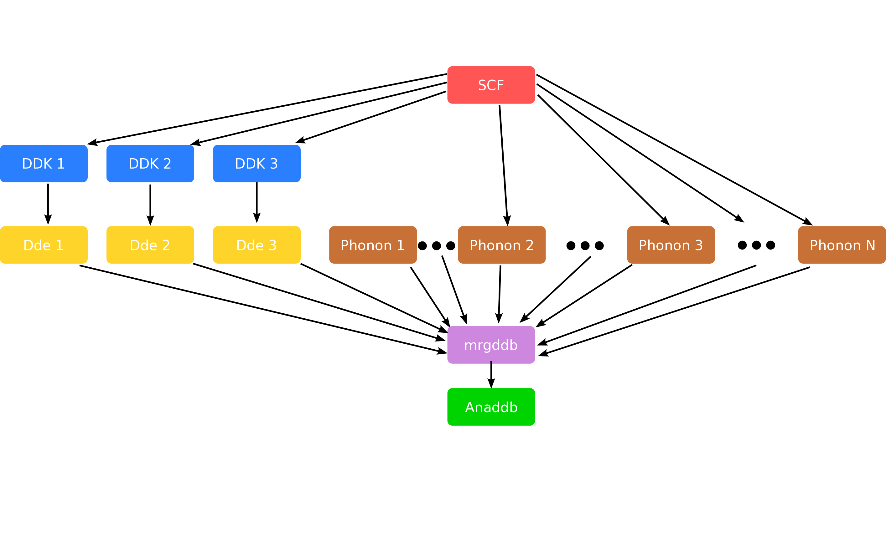
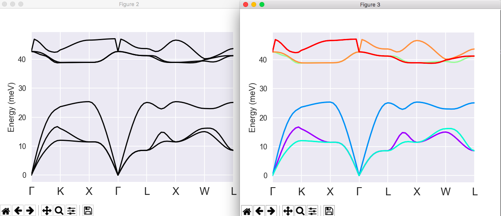
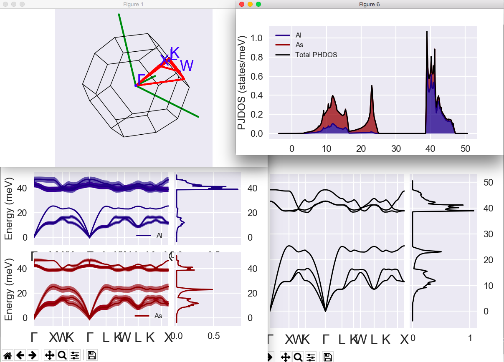

# Second tutorial on DFPT:

## Phonon band structures, thermodynamical properties.  

In this tutorial you will learn how to post-process the raw data of the Abinit DFPT calculations to
get the following physical properties of periodic solids:

* Interatomic forces constants 
* Phonon band structures 
* Thermodynamical properties 

Visualisation tools are NOT covered in this tutorial.
Powerful visualisation procedures have been developed in the Abipy context,
relying on matplotlib. See the README of [Abipy](https://github.com/abinit/abipy)
and the [Abipy tutorials](https://github.com/abinit/abitutorials).

This tutorial should take about 1 hour.

[TUTORIAL_README]

## 1 Generation of a derivative database
  
*Before beginning, you might consider to work in a different subdirectory as
for the other tutorials. Why not create Work_rf2 in \$ABI_TESTS/tutorespfn/Input?*

Then copy the files *trf2_1.files* and *trf2_1.in* from  \$ABI_TESTS/tutorespfn/Input* to *Work_rf2*:

```sh
cd $ABI_TESTS/tutorespfn/Input
mkdir Work_rf2
cd Work_rf2
cp ../trf2_1_x.files .
cp ../trf2_1.in .
```

This tutorial starts by the generation of a database, that might be quite time-consuming.
We suggest you to start immediately this computation with

    abinit < trf2_1.files >& log &

It takes about 3-5 minutes to be completed on a PC 2.8 GHz.

In order to do interatomic force constant (IFC) calculations, and to compute
associated phonon band structure and thermodynamical properties, you should
first have some theoretical background.
Let us assume that you have read the litterature relative to the [first tutorial on DFPT](rf1). 
You might find additional material, related to the present section, in
[[cite:Gonze1997a]] -especially section IX-, [[cite:Lee1995]] and [[cite:Baroni2001]].
If you haven't read parts of these references, we strongly advise you take the time to read them now.

In short, the idea is that, in order to compute properties for which the
phonon frequencies are needed in the full Brillouin zone, one can use an
elaborate Fourier interpolation, so that only few dynamical matrices need to
be computed directly. Others will be computed by interpolation.
A schematic representation of the different steps required to compute the 
dynamical matrix in the IBZ and post-process the results with anaddb is given below.



Let us have a look at the input file *trf2_1.in*. 



The calculation is done for AlAs, the same crystalline material as for the first tutorial on DFPT.
Many input parameters are also quite similar, both at the level of the description
of the unit cell and for the choice of cut-off energy and k point grid.

Still, this input file is rather complex: in one single run, one produces the
Derivative Databases (DDBs) needed for the rest of this tutorial. 
So, it starts with a ground-state calculation (dataset 1), followed by the
computation of the response to the d/dk perturbation (dataset 2), and the
response to electric fields, and phonons at Gamma (dataset 3). Datasets 4 to
10 generate the dynamical matrices at 7 q wavevectors, other than Gamma. At
present (v8.6), one can only compute one q point per dataset, that is why so many datasets are needed.

Also, the values of these q wavevectors are not determined automatically. 
They must correspond to the q wavevectors needed by the ANADDB utility (see later),
that is, they should form a reduced set of symmetry-inequivalent wavevectors,
corresponding to a regularly spaced grid. In principle, they might not include
the Gamma point, but it is **recommended** to have it in the set, in order for the
Fourier interpolation not to introduce errors at that important point. 

!!! tip

    In order to minimize the number of preliminary non-self-consistent calculations,
    it is advised to take a q point mesh that is adjusted to the k point mesh used
    for the electronic structure: all q wavevectors should connect two k point
    wavevectors from this grid.

Such a set of q wavevectors can be generated straightforwardly by running a GS
calculation with [[kptopt]] = 1, [[nshiftk]] = 1, [[shiftk]] = 0 0 0 (to include
gamma) and taking the output kpt set file as this qpt set. One might set
[[nstep]] = 1 and [[nline]] = 1, so only one iteration runs, or even
[[nstep]] = 0 and [[prtvol]] = -1, so no real DFT calculation is done.

The input file *\$ABI_TESTS/tutorespfn/Input/trf2_2.in* is precisely an input
file that can be used to generate such a set of k points. 
Copy it in the present *Work_rf2* directly, as well as the accompanying *trf2_2.files*. 
Examine these files, then run this calculation (it is very rapid - it won't hurt the trf2_1 job).
The following k point set is obtained:
    
           kpt    0.00000000E+00  0.00000000E+00  0.00000000E+00
                  2.50000000E-01  0.00000000E+00  0.00000000E+00
                  5.00000000E-01  0.00000000E+00  0.00000000E+00
                  2.50000000E-01  2.50000000E-01  0.00000000E+00
                  5.00000000E-01  2.50000000E-01  0.00000000E+00
                 -2.50000000E-01  2.50000000E-01  0.00000000E+00
                  5.00000000E-01  5.00000000E-01  0.00000000E+00
                 -2.50000000E-01  5.00000000E-01  2.50000000E-01

It is, as promised, the same as the q point set in the *trf2_1.in file*.

Now, it might be worth to examine in some detail one of the Derivative
Database that has been created by the trf2_1 run.
We suppose that the file *trf2_1o_DS3_DDB* has already been created. 
It corresponds to the third dataset, namely the response to q = 0 and electric field.  
Open this file, and read the [[help:respfn#ddb|6.5 section]] of the respfn help file. 
Examine the *trf2_1o_DS3_DDB* file carefully.

Seven other similar files will be generated by the trf2_1 run, containing the
same header, but a different 2DTE block. It will be the duty of the MRGDDB
utility, next section, to gather all these information and merge them into a single DDB file.

Now, there might be two possibilities: either the trf2_1 run is finished, and
you can continue the tutorial with the section 2 about the MRGDDB utility, or the run is not finished.
In the latter case, instead of waiting for trf2_1 to be finished, we suggest
you to pursue with section 3. You will use as DDB file the one that can be
found in *\$ABI_TESTS/tutorespfn/Refs*, with the name [[tests/tutorespfn/Refs/trf2_3.ddb.out|trf2_3.ddb.out]],
instead of the one that would result from the section 2.
Copy this file to the present directory, then go to
section section 3 of this tutorial. You might come back to section 2 afterwards.

## 2 Manipulation of the derivative databases (the MRGDDB utility)
  
The use of the MRGDDB utility is described in its [[help:mrgddb|help file]].
Please, read it carefully now.

Use MRGDDB to create the merge DDB from the eight DDB's corresponding to
datasets 3 to 10 of the trf2_1 job, containing the dynamical matrices for the
8 q points, as well as the response to the electric field (dielectric tensor
and Born effective charges). Name the new DDB *trf2_3.ddb.out*.

!!! note

    Including also the DDB from dataset 1 won't hurt
    (it contains the forces and stresses), but is not needed for the computation
    of phonon band structure, interatomic force constants, and thermodynamical properties.

File *\$ABI_TESTS/tutorespfn/Input/trf2_3.in* is an example of input file for MRGDDB. 



You can copy it in the *Work_rf2* directory, and run the merge as follows:
    
    mrgddb < trf2_3.in
    
## 3 Analysis of the derivative databases

An introduction to the use of the ANADDB utility is described in its [[help:anaddb|help file]].
Please, read it carefully.

This ANADDB utility is able to perform many different tasks, each governed by
a selected set of input variables, with also some input variables common to
many of the different tasks. The list of tasks to be done in one run is
governed by different flags.
Here is the list of flags:

  * [[anaddb:dieflag]] 
  * [[anaddb:elaflag]] 
  * [[anaddb:elphflag]] 
  * [[anaddb:ifcflag]] 
  * [[anaddb:instrflag]] 
  * [[anaddb:nlflag]] 
  * [[anaddb:piezoflag]] 
  * [[anaddb:polflag]] 
  * [[anaddb:thmflag]] 

Please, take some time to read the description of each of these flags. 
Note that some of these flags might be required to allow to run another task.
In this tutorial, we will focus on the flags [[anaddb:ifcflag]] and [[anaddb:thmflag]].

## 4 The computation of interatomic force constants
  
You can copy the files *trf2_4.in* and *trf2_4.files* from *\$ABI_TESTS/tutorespfn/Input* to the *Work_rf2* directory.
Open the file *trf2_4.in*. Note that [[anaddb:ifcflag]] is activated. 



Related input variables can be split in three groups.
The first group of variables define the grid of q wavevectors:

  * [[anaddb:brav]]
  * [[anaddb:ngqpt]]
  * [[anaddb:nqshft]]
  * [[anaddb:q1shft]]

Unfortunately, the names of input variables and their meaning is not exactly
the same as the names used to generate the k points in ABINIT. 
This is a shame, a remnant of history.
Please read carefully the documentation that describes these input variables.

The second group of variables allows to impose the acoustic sum rule on the
dynamical matrices and the charge neutrality on Born effective charges before proceeding with the analysis:

  * [[anaddb:asr]]
  * [[anaddb:chneut]]

Please, read carefully the explanation for these input variables.

Finally, a third group of variables is related specifically to the analysis of the IFC:

  * [[anaddb:dipdip]]
  * [[anaddb:ifcana]]
  * [[anaddb:ifcout]]
  * [[anaddb:natifc]]
  * [[anaddb:atifc]]

Here also, spend some time to read the associated documentation.

Now, you should issue:
    
    anaddb < trf2_4.files > trf2_4.log

It will last only a few seconds.

The file *trf2_4.out* contains the list of interatomic force constants, as well as some analysis.



Open this file and find the following paragraph:
    
     Analysis of interatomic force constants
    
     Are given : column(1-3), the total force constant
           then  column(4-6), the Ewald part
           then  column(7-9), the short-range part
     Column 1, 4 and 7 are related to the displacement
           of the generic atom along x,
     column 2, 5 and 8 are related to the displacement
           of the generic atom along y,
     column 3, 6 and 9 are related to the displacement
           of the generic atom along z.

The interatomic force constants are output for the nuclei specified by the
input variable [[anaddb:atifc]]. Here, only atom 1 is considered. The IFCs
with respect to the other nuclei is given, by order of increasing distance.
For each pair of nuclei involving atom 1, there is first the output of the
IFCs in cartesian coordinates, as well as their decomposition into an Ewald
and a short-range part, then, the analysis with respect to a local system of
coordinate. The latter is chosen such that it diagonalizes the IFC tensor, in
case of the self-force constant, and in the other cases, the first vector is
the vector joining the two nuclei, in order to decompose the IFC into a
longitudinal and a transverse component.

## 5 Computation of phonon band structures with efficient interpolation
  
You can copy the files *trf2_5.in* and *trf2_5.files* from *\$ABI_TESTS/tutorespfn/Input* to the *Work_rf2* directory.
Then open *trf2_5.in*.



Note that [[anaddb:ifcflag]] is again activated.
Indeed, in order to compute a phonon band structure using the Fourier
interpolation, the IFCs are required. This is why the two first groups of
variables, needed to generate the IFCs are still defined. The third group of
variables is now restricted to [[anaddb:dipdip]] only.

Then, come the input variables needed to define the list of q wavevectors in the band structure:

* [[anaddb:eivec]]: flag to turn on the analysis of phonon eigenvectors
* [[anaddb:nph1l]]: number of q-points for phonon interpolation
* [[anaddb:qph1l]]: list of q-points for phonon interpolation
* [[anaddb:nph2l]]: number of q-directions for LO-TO correction
* [[anaddb:qph2l]]: list of q-directions for LO-TO correction

Now, you should issue:
    
    anaddb < trf2_5.files > trf2_5.log

It will last only a few seconds.

The file *trf2_5.out* contains the list of eigenvalues, for all the needed
q-wavevectors. You can iopen it, and have a look at the different sections of
the file. Note that the interatomic force constants are computed (they are
needed for the Fourier interpolation), but not printed.



Please, open also the other output file, named *trf2_5_B2EPS.out.freq*.
It contains the frequencies, in a format suitable for graphical output, using the program
*band2eps* (the latter should be more documented, and will not be described in the present tutorial).

You can copy the files *trf2_6.in* and *trf2_6.files* to the *Work_rf2* directory, then issue
    
    band2eps < trf2_6.files > trf2_6.log



The file *trf2_6.out.eps* has been produced. It is an .eps file (eps stand for
Encapsulated PostScript). You can use the program ghostview to vizualize it.
The command to issue will depend on the way you have configured your machine,
but the following might perhaps do the work:
    
    gv trf2_6.out.eps

You should see a nice phonon band structure for AlAs. Well, not so nice, after
all, because there are two strange dips for the highest phonon band, at the Gamma point.  
This is due to the lack of LO-TO splitting for the ANADDB treatment of the first list of vector. 
The correct phonon band structure is:


You can correct the LO-TO splitting by the following little hack.

Open the file *trf2_5_B2EPS.freq*, and note that the value of the frequency, in
the sixth column, has a discontinuity exactly for the Gamma point (the three
first columns give the k point coordinates), that is, at lines 1 and 31:
    
     0.000000D+00  0.000000D+00  0.000000D+00  0.156855D-02  0.156855D-02  0.156855D-02

Replace these values (sixth column, line 1 and 31) by the correct value,
including the LO-TO splitting, that you can find in the file *trf2_5.out*, at
the end, second list of vector. That is, the lines 1 and 31 should now read:
    
     0.000000D+00  0.000000D+00  0.000000D+00  0.156855D-02  0.156855D-02  1.730353E-03
    
Now, run *band2eps* again. Your phonon band structure should be perfect!

It can be compared with the AlAs phonon band structure published in [[cite:Giannozzi1991]].

Of course, one should make a convergence study, on the k and q point grids
(separately!), as well as on the energy cut-off, and also test LDA and GGA...
But this is left to the user! You can have a look at the paper [[cite:Petretto2018]]
for a careful analysis of phonon dispersion convergence with Abinit.

### Plotting phonon bands with AbiPy

If |AbiPy| is installed on your machine, you can use the |abiopen| script
with the `--expose` option to visualize the phonon band structure stored in the *PHBST.nc* file
produced by *anaddb*.
For instance:

```sh
abiopen.py trf2_5.out_PHBST.nc --expose --seaborn=talk
```

produces the following plot without LO-TO splitting:


:   (left) Phonon bands without LO-TO splitting
    (right) Plot with band connection estimated from the overlap of the eigenvectors at adjacent q-points

Alternatively, we can start from the DDB file and use the |abiview| script. 
In this case, AbiPy will generate the anaddb input file
with all the variables required to handle the plotting of the LO-TO splitting, 
invoke anaddb for us and finally plot the results.
All of this with just two lines:

```sh
# Copy the tutorial output file to have the correct file extension (DDB)
# otherwise abiview does not know how to handle our file.
cp trf2_3.ddb.out trf2_3_DDB  

abiview.py ddb trf2_3_DDB -sns=talk
```



We can also compare our results with the phonon band structure available on the |materials_project|.

First of all, let's find the materials project identifier associated to this particular phase of AlAs.
Of course, one could use the materials project web interface but we can also do it 
from the shell by just passing our Abinit input file to the |abistruct| script:

```shell
abistruct.py mp_match trf2_1.in

# Found 1 structures in Materials Project database (use `verbose` to get further info)

######################### abivars input for mp-2172 #########################
# Full Formula (Al1 As1)
# Reduced Formula: AlAs
# abc   :   4.054377   4.054377   4.054377
# angles:  60.000000  60.000000  60.000000
#
# Spglib space group info (magnetic symmetries are not taken into account).
# Spacegroup: F-43m (216), Hall: F -4 2 3, Abinit spg_number: None
# Crystal_system: cubic, Lattice_type: cubic, Point_group: -43m
#
#   Idx  Symbol    Reduced_Coords              Wyck      EqIdx
# -----  --------  --------------------------  ------  -------
#     0  Al        +0.00000 +0.00000 +0.00000  a             0
#     1  As        +0.25000 +0.25000 +0.25000  d             1

 natom 2
 ntypat 2
 typat 1 2
 znucl 13 33
 xred
    0.0000000000    0.0000000000    0.0000000000
    0.2500000000    0.2500000000    0.2500000000
 acell    1.0    1.0    1.0
 rprim
    6.6351943530    0.0000000000    3.8308312587
    2.2117314510    6.2557212277    3.8308312587
    0.0000000000    0.0000000000    7.6616624984
```

AbiPy found one entry in the MP database that matches the structure given in our input file
and has generated the corresponding input file.
Now we know that this phase of AlAs corresponds to `mp-2172` and we can 
look at the phonon band structure computed by [[cite:Petretto2018a]] at
<https://materialsproject.org/materials/mp-2172/>

!!! tip

    For further information on the AbiPy API, please consult the |DdbFileNb| .
    To learn how to automate DFPT calculations with Python, see 
    [this jupyter notebook](https://nbviewer.jupyter.org/github/abinit/abitutorials/blob/master/abitutorials/dfpt/lesson_dfpt.ipynb).


## 6 Thermodynamical properties
  
We will give only a very short example of the use of ANADDB to compute
thermodynamical properties. This is because this part of ANADDB is likely the
farthest from a clean, stable, usage. By exploring the input variables, the
user should be able to produce figures and data like the ones for SiO2 quartz
and stishovite, published in [[cite:Lee1995]]. 

You can copy the files *trf2_7.in* and *trf2_7.files* from *\$ABI_TESTS/tutorespfn/Input* to *Work_rf2*
and have a look at them.
The same DDB as for trf2_4 and trf2_5 is used, namely *trf2_3.ddb.out*.



The following additional input variables are present:

  * [[anaddb:thmflag]]
  * [[anaddb:ng2qpt]]
  * [[anaddb:ngrids]]
  * [[anaddb:q2shft]]
  * [[anaddb:nchan]]
  * [[anaddb:nwchan]]
  * [[anaddb:thmtol]]
  * [[anaddb:ntemper]]
  * [[anaddb:temperinc]]
  * [[anaddb:tempermin]]

Examine the input file, the input variables, then run anaddb as usual.
Then, open the output file. You should be able to find the crucial section:
    
    # At  T     F(J/mol-c)     E(J/mol-c)     S(J/(mol-c.K)) C(J/(mol-c.K))
    # (A mol-c is the abbreviation of a mole-cell, that is, the
    #  number of Avogadro times the atoms in a unit cell)
     2.000E+01  8.1384755E+03  8.1463588E+03  3.9416455E-01  1.4169104E+00
     4.000E+01  8.1061318E+03  8.2368069E+03  3.2668770E+00  7.8985031E+00
     6.000E+01  7.9980215E+03  8.4575659E+03  7.6590742E+00  1.3992228E+01
     8.000E+01  7.7974375E+03  8.7915524E+03  1.2426436E+01  1.9325166E+01
     1.000E+02  7.5004822E+03  9.2274431E+03  1.7269609E+01  2.4175006E+01
     1.200E+02  7.1069991E+03  9.7544364E+03  2.2061978E+01  2.8411189E+01
     1.400E+02  6.6189291E+03  1.0359248E+04  2.6716565E+01  3.1955267E+01
     1.600E+02  6.0396227E+03  1.1028289E+04  3.1179167E+01  3.4847423E+01
     1.800E+02  5.3732223E+03  1.1749439E+04  3.5423427E+01  3.7183864E+01
     2.000E+02  4.6241910E+03  1.2512641E+04  3.9442251E+01  3.9069448E+01
    
There, one finds, the phonon free energy, the phonon internal energy, the
phonon entropy and the phonon heat capacity.
The atomic temperature factors can also be computed.
An example is presented in [[test:v5_22]]

!!! important

    Do not forget that we are working in the harmonic approximation; beyond some
    temperature, anharmonic effects will have a sizeable contributions.
