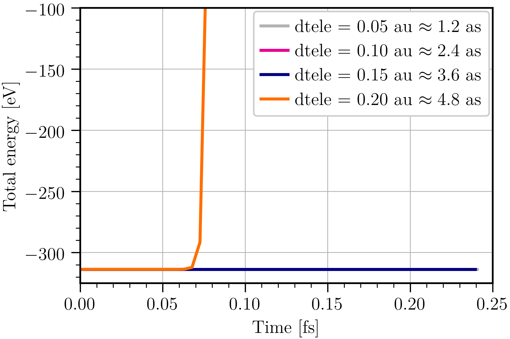
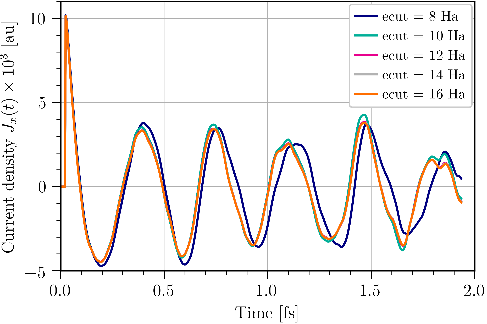
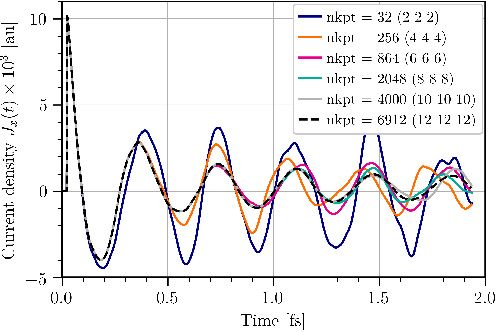
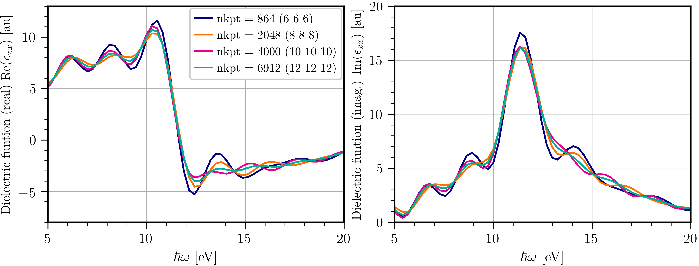
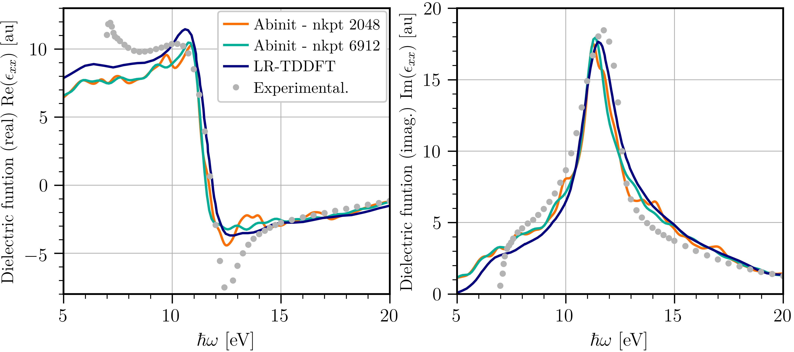

# Tutorial on real-time time-dependent DFT

This tutorial aims at showing how to perform Real-Time TDDFT (RT-TDDFT) calculation using Abinit
to compute the dielectric function of Diamond here.

!!! warning

    RT-TDDFT is under active development and should thus be used with caution!

If you have not yet done any of the basic tutorials it might be useful to do
at least the first three: [basic1](/tutorial/base1), [basic2](/tutorial/base2) and
[basic3](/tutorial/base3).
It could also be useful that you know a little bit about PAW calculations using Abinit.
If you are interested you can follow the first tutorial on PAW:
[PAW1](/tutorial/paw1).

This tutorial should take about two hours to complete, depending on the amount of
computing power you have access to and how much of the convergence study you decide to do.

[TUTORIAL_README]

## 1. Basics of RT-TDDFT

Time-dependent DFT (TDDFT) has been developed in the 1980s as a generalization of
DFT to the time-dependent case and is based on similar theorems than the standard
Hohenberg and Kohn theorems. They were developed, in the general case, by
Runge and Gross [[cite:Runge1984]] establishing a one-to-one correspondence
between the time-dependent potential and the time-dependent density $n(\vec{r},t)$.
In the spirit of Kohn and Sham, Runge and Gross introduced a non-interacting
system evolving in an effective time-dependent potential such that its density
is the same as the one of the interacting system of interest.
Further work by Van Leeuwen [[cite:VanLeeuwen1999]] proved the existence of this
effective potential under some rather mild approximations.

Within this framework, one ends up with the so-called time-dependent Kohn-Sham (TDKS)
equations that have the same form as the time-dependent Shrödinger equation
\begin{equation}
    i\partial_t \psi_{nk}(\vec{r},t) = \hat{H} \psi_{nk}(\vec{r},t),
\end{equation}
but with the Hamiltonian being now a functional of the density and the initial
state $\Psi^0$, $\hat{H} \equiv \hat{H}[n,\Psi^0]$.
Note that formally the Hamiltonian is a functional of the density at all previous times
_ie._ it depends on the whole history. This is quite complicated to account for as
it requires a functional that is non-local both in time and space.
In the following, we will thus always work in the so-called _adiabatic approximation_
which discards this dependence on the past history and consider that the Hamiltonian
is a functional of the density at time $t$ only.

In the real-time formulation of TDDFT (RT-TDDFT), the TDKS equations are numerically
integrated in _real-time_ by discretizing the time with a time step $\Delta t$.
The propagator to go from time $t$ to $t+\Delta t$ can be approximated as
\begin{equation}
    \hat{U}(t,t+\Delta t) = \exp\left(-i\hat{H}\Delta t\right).
\end{equation}
In the present implementation only two simple propagators are available:
the so-called exponential rule (ER) and exponential midpoint rule (EMR)
propagators. In both of them, the exponential in the propagator is approximated
by a Taylor expansion, usually up to fourth order as it was found to be the best
choice to ensure good stability while minimizing computation time [[cite:Castro2004]].
These two propagators differ only by the choice of the Hamiltonian used in the exponential.
The simplest ER propagator uses the Hamiltonian at time $t$, while the EMR propagator
uses the Hamiltonian at time $t+\Delta t/2$. This last choice ensures the correct
time reversal symmetry and is thus supposed to be better than the simple ER propagator.
It also introduces a self-consistency since one needs the density at time
$t+\Delta t/2$ to evolve the orbitals at time $t$. This is solved by a
predictor-corrector scheme. See [[cite:Castro2004]] for more information
on propagators for the TDKS equations including the ER and EMR propagators.
More general information on TDDFT including its real-time formulation can be
found for instance in [[cite:Ullrich2011]].

TDDFT is usually used to study the response of a system to a time-dependent perturbation.
In Abinit it is possible to apply an impulse external electric field that allows
the computation of associated response functions: the electronic conductivity and the
dielectric function. This tutorial describes how to perform such calculation with Abinit.

!!! note

    The application of an external electric field in RT-TDDFT is only available in PAW.
    We will thus work in this formalism throughout this tutorial.

## 2. Ground state of diamond
_Before beginning, you might consider working in a different subdirectory, as for the other tutorials.
Why not Work_rttddft? In what follows, the name of files are mentioned as if you were in such a
 subdirectory in $ABI_TESTS/tutorial.
All the input files can be found in the `$ABI_TESTS/tutorial/Input` directory._

!!! important

    You can compare your results with reference output files located in
    `$ABI_TESTS/tutorial/Refs` directories (for the present tutorial they
     are named `trttddft_*.abo`).

The first thing that a real-time TDDFT (RT-TDDFT) calculation needs is a set of initial orbitals.
In the following we will start our calculations from the ground state KS orbitals.
Thus let us start by computing the ground state orbitals of diamond.
This system was actually treated in details in the first PAW tutorial.
If you have not done this tutorial [PAW1](/tutorial/paw1) it might be a good idea to do it first.

The input file *trttddft_1.abi* can be used to compute the ground state of diamond in PAW
with a description that is similar to what was used in the first PAW tutorial.
Notably, we use the same functional (LDA-PW) and the same atomic dataset.
Copy the *trttddft_1.abi* file in your work directory,

```sh
cd $ABI_TESTS/tutorial/Input
mkdir Work_rttddft
cd Work_rttddft
cp ../trttddft_1.abi .
```

and execute Abinit:

    abinit trttddft_1.abi >& log

The code should run quickly.

You can have a look at the input file. It is similar to the input files from the first PAW tutorial.



The values of the plane wave cut-off energy [[ecut]], the double grid (PAW) cut-off energy [[pawecutdg]]
and the $k$-points grid defined by [[ngkpt]] are set to ensure a relatively good convergence of
the total energy and pressure. The cell parameter [[acell]] is chosen to work at the equilibrium
volume. Finally, we ask Abinit to write the wavefunctions in a file by setting [[prtwf]] to 1,
as we will need to read this file to start the following real-time calculations.

!!! tip

    If you look carefully at the input, you may notice that the variable [[ecutsm]] was not set.
    That is because RT-TDDFT is not compatible with that option and it is thus better to generate
    the initial orbitals without it as well.
    You may also notice that we set the variable [[istwfk]] to 1 for all $k$-points, that is
    because we cannot take advantage of time-reversal symmetry for the storage of wavefunctions
    in RT-TDDFT.

## 3. Real-time TDDFT and stability
Now that we have a set of initial orbitals we can run some time-dependent calculations.
You can copy the input file *trttddft_2.abi*

```sh
cp ../trttddft_2.abi .
```

and run Abinit:

    abinit trttddft_2.abi >& log

The code should run quickly.

If you have a look at the input file you will see that it is almost exactly the same as the previous
one except that a few keywords were added: [[optdriver]] was set to 9 which tells the driver of Abinit
to run real-time TDDFT and the keyword [[getwfk_filepath]] was used to read the initial wavefunctions
from the previous ground state calculation.



If you have a look at the output (*trttddft_2.abo*) or the log file you will see that Abinit has read
the previous ground state orbitals and started a RT-TDDFT run as expected. However, it only performed one step
which is not very useful.
That is because we did not set the number of time steps to perform. We can do so using the variable [[ntime]].
Change the value of [[ntime]] by editing the input file and try running maybe about 50 time steps for now
to get a feeling of the time it takes.
You may notice that additional files have been created. The file called *TD_RESTART* contains some information
needed to restart a RT-TDDFT run if one wants to continue a calculation. In that case, the variable
[[td_restart]] should be set to 1. The file *trttddft_2o_TDENER* contains the total energy and its decomposition into
the different contributions as a function of time. You can have a look at this file and try to plot the total
energy as well as some energy contributions. You should find that the total energy as well as all
contributions remain constant. This is to be expected as we started from the ground state orbitals
 which are *stationary states*.
If we do not perturb the system then running a time-dependent calculation does not make much sense.
Various type of perturbations could be applied such as an external electric field which will
be discussed in the following. But let us stay in that special stationary case for now to study the
stability of the integration.

In order to do so, copy the input file *trttddft_3.abi* and run Abinit.



This run takes a little longer, you can parallelize it by launching Abinit with mpirun if you have access
to several cores and that your executable has been correctly compiled with MPI, see [[topic:parallelism]].
A basic parallelisation over $k$-points by simply running Abinit with mpirun is enough.
There are 28 $k$-points and the best is of course to use a number that divides it, so you could use
2, 4, 7, 14 or even 28 processors.

The time-dependent Kohn-Sham (TDKS) equations are highly non-linear and their integration can be a little
tricky which is why there exists many different propagators (see [[cite:Castro2004]]).
The stability of the integration depends essentially on the propagator and the time step [[dtele]].
As of now, only simple propagators, namely the exponential rule (ER) and the exponential midpoint
rule (EMR) propagators, are implemented in Abinit.
The keyword [[td_propagator]] can be used to setup the integrator: if set to 0 then the simple ER propagator
is used which is the default, if set to 1 then the EMR propagator is used. Here, we will only used the
ER propagator for simplicity since it is enough in this case.
If you look at the input file you can see that there are several datasets now in which the time step
for the electrons [[dtele]] changes. The number of time steps also changes to ensure that we integrate
the TDKS equations over a fix amount of time (~ 0.5 fs here).

If you look at the output or log file, you will see that the last dataset stopped with the following error:

```sh
The integrated density has changed by more than 10%!
The integration is unstable, you should probably decrease the timestep dtele.
```

That is because the integration was not stable. The code stopped because the electronic density integrated
over the whole volume, which should be equal to the total number of electrons, has changed by more than 10 %.
Indeed this quantity should be constant and is used by Abinit to check the stability. Its value is written
in the output files and one can thus easily check its time evolution for instance by typing

```sh
grep 'Integrated density' trttddft_3.abo
```

One can also check the stability of the integration by checking that the total energy is well conserved during
the integration. In order to do so, you can simply plot the third column of the file *trttddft_3o_TDENER* and you
should get something similar to the following figure.



The integration becomes clearly unstable for time steps greater than $0.15$ au. Unfortunately, the integration can become
unstable for longer integration times even if it appears stable here. We will thus keep a timestep of $0.1$ au to be safe.

!!! note

    The order of the Taylor approximation used to approximate the exponential in the propagator will also have
    an important impact on the stability of the integration. If you are interested, you can change the value of
    the variable [[td_exp_order]] to investigate its effect on the stability.
    You should find that the default value of 4 is the best choice.

## 4. Time-dependent electric field and current density
We can now use RT-TDDFT to study the response of diamond to an external impulse electric field.
Such calculations allow the computation of the associated response functions ie. the electronic conductivity
from which one can also obtain the dielectric function as we will see in the last part of this tutorial.

The external electric field is added through an additional vector potential $\vec{A}(t)$ in the Hamiltonian
\begin{equation}
    \hat{H} = \frac{1}{2} \left[-i\vec{\nabla} + \vec{A}(t) \right]^2 + v_{KS}(\vec{r},t).
\end{equation}
This perturbation will generate a time-dependent macroscopic current density
\begin{equation}
    \vec{J}(t) = \frac{i}{\Omega} \sum_{nk} \left[ w_k f_{nk} \langle \psi_{nk}(t) | \vec{\nabla} | \psi_{nk}(t) \rangle \right]
                 - \frac{N\vec{A}(t)}{\Omega},
\end{equation}
with $w_k$ the weight of the $k$-point, $f_{nk}$ the occupations, $N$ the total number of electrons and
$\Omega$ the volume of the simulation cell. In practice, the expressions for the Hamiltonian and the current
density include additional term coming from PAW that we do not include here for clarity. Moreover, there
are some subtleties related to gauge invariance and the non locality of the PAW transformation that we decide
not to discuss here for simplicity.

The application of an external electric field is set by switching the value of the variable [[td_ef_type]] to 1.
This will trigger the application of an impulse external electric field $\vec{E}(t) = \vec{E}_0\delta(t-t_0)$.
The associated vector potential is given by
\begin{equation}
    \vec{A}(t) = -{\int}_0^t \vec{E}(t')dt' = -\vec{E}_0 \Theta(t-t_0),
\end{equation}
with $\Theta(t-t_0)$ the Heaviside function.
The intensity is given by the parameter [[td_ef_ezero]] in atomic units, the direction is given by the
variable [[td_ef_pol]] and the value of the time at which this Dirac pulse is applied is controlled by the
parameter [[td_ef_tzero]].
By default the field is applied along $\vec{e}_x$, its intensity is $0.1$ au and it is applied at time $t=0$.
We will keep most of these default values here and simply change $t_0$ so we can clearly see the time at which
the field is switched on.

!!! note

    Only impulse electric fields are implemented for now. Note that this is the best choice if one is interested
    in response functions as such a perturbation is exciting all frequencies equally.

In order to launch the next calculation with the electric field, you should first copy the input *trttddft_4.abi*
and run Abinit again. From now on the calculations will take more time and, if you can, it may be better to run
in parallel. That is because we have to work now in the full Brillouin zone. Indeed the application of the
time-dependent electric field will break some symmetries and we thus cannot make use of them to reduce the
number of $k$-points.
The variable [[kptopt]] is thus set to 3 and, as a consequence, the total number of $k$-points is now much larger.
If you have a look at the input file you can see that the value of [[ngkpt]] used to define the $k$-points grid
was reduced to 2 2 2 instead of the previous 6 6 6 to decrease the computation time. Unfortunately,
this is not enough to converge as we will see in the following. You can have a look at the input file.



A few additional keywords [[td_ef_type]] and [[td_ef_tzero]] were added. Moreover, we now use two datasets.
The first one performs a ground state calculation to generate the initial wavefunctions while the second one runs
the RT-TDDFT calculation.
This way will be easier if we want to do a convergence study with respect to different parameters such as [[ecut]]
or [[ngkpt]] as we will need to generate the ground state wavefunctions with the same parameters every time.
Two new files were created: _trttddft_4o_TDEFIELD_ which contains the time evolution of the electric field as well
as the associated vector potential and _trttddft_4o_TDCURRENT_ which contains the time evolution of the macroscopic
current density.
If you look at this file you can see that a macroscopic current density is induced by the application of the
electric field for $t \geq t_0$. Before $t_0$, there is no global current in the system as expected. That would not
be the case if we did not set [[kptopt]] to 3. Moreover, as we applied an electric field in the $x$ direction,
the induced current density only appeared in that direction. That would also not have been the case if we did not
use [[kptopt]] 3.

### Convergence study (Optional)
We should now make sure that all the parameters are correctly chosen to ensure a proper convergence of the current
density as this is the central property here. This will require to launch several calculations with varying parameters
which can take some time especially if you do not have access to several processors to run in parallel.
In that case, it is probably better to not run the whole convergence study.

Let us start by studying the convergence of the current density with respect to the cutoff energy.
To do so you can modify the *trttddft_4.abi* input file and run for different values of [[ecut]] maybe
something like 8, 10, 12, 14 and 16 Ha. You should also increase [[ntime]] to a larger value to check
the convergence of the current density on a sufficient propagation time. You can try using [[ntime]]
around 800.
We can perform this study keeping [[ngkpt]] to 2 2 2 to save computation time.
If you do so and plot the current density you should get the same results as what is displayed on the
following figure.



Clearly the current density is not too sensitive to the value of [[ecut]] and seems to be converged from
[[ecut]] $\gt 10$ Ha. To ensure that we remain relatively converged in terms of total energy and pressure
we will keep [[ecut]] to 14 Ha in the following.
The current density is even less sensitive to the value of [[pawecutdg]] and we will just keep
it at twice the value of [[ecut]] that is 28 Ha in the following.

Now we switch to the convergence with respect to the number of $k$-points. Again, this is now going to
take more time to run and you should consider running in parallel.
We now run similar calculations keeping [[ecut]] constant and varying the value of [[ngkpt]].
You can maybe try 2 2 2, 4 4 4, 6 6 6 and 8 8 8 to start. You can use a lower value of [[ecut]] if you
wish to decrease the computation time. You should find that the current density is significantly
impacted by the value of [[ngkpt]] and that the previous value of 6 6 6 is not enough
to converge it. The following figure shows the current density obtained with
different number $k$-points keeping [[ecut]] fixed to 10 Ha and [[pawecutdg]] to 20 Ha.



The current density clearly requires a large number of $k$-points and it seems that we need to use
more than 4000 $k$-points to converge over the integration time considered here.
It appears that converging the current density at short times is relatively easy but longer trajectories
require more $k$-points. That means high frequencies will be easier to converge but accessing
low frequencies will be more demanding. In the following we will keep [[ngkpt]] to 8 8 8 with
four shifts so 2048 $k$-points even though we see that we should use higher values to ensure
a fine convergence of the current density.

## 5. Conductivity and dielectric function
The optical conductivity tensor $\sigma_{\alpha\beta}$ can be obtained from the Fourier transform
of the induced current density and the external electric field using the following relation
\begin{equation}
    \sigma_{\alpha\beta}(\omega) = \frac{J_\alpha(\omega)}{E_\beta(\omega)}.
\end{equation}
This equation is the well-known Ohm's law which translate the fact that, within linear response theory,
the conductivity is the response function that links the induced current density and the applied
external electric field.
The dielectric tensor can then be obtained directly from the conductivity tensor using the
following relation
\begin{equation}
    \epsilon_{\alpha\beta}(\omega) = \delta_{\alpha\beta} + 4\pi i\frac{\sigma_{\alpha\beta}(\omega)}{\omega}.
\end{equation}

A python script to perform the Fourier transform of the current density and compute the conductivity and
the dielectric tensor called _analyze_rtttddft.py_ is available in _$ABI_HOME/scripts/post_processing_.
Let us first look at what we obtain already with the results from the previous convergence study on
the current density by using the _analyze_rtttddft.py_ script to analyze the results of one of
your previous calculation. To do so you can run the following command

```sh
python3 $ABI_HOME/scripts/post_processing/analyze_rtttddft.py -c trttddft_4o_DS2_TDCURRENT -e dirac -ez 0.1 -d x -wc 0.01 -ts 1 -p 8
```
A description of the different options of this script can be obtained by typing

```sh
python3 $ABI_HOME/scripts/post_processing/analyze_rtttddft.py -h
```

Here we use already quite a few that should give some rather good results:

  * *-c* gives the path to the file containing the current density (*TDCURRENT* file)
  * *-e dirac* tells the script that the electric field is a Dirac pulse
  * *-ez* gives the intensity of the applied impulse electric field (in atomic units)
  * *-d* indicates by which direction of the electric field we wish to divide. It corresponds to the value of $\beta$ in equation (6) and (7)
  * *-wc* is the cutoff angular frequency $\omega_c$ (in Ha) of a decaying exponential window $\exp(-\omega_ct)$ that is applied to the signal.
Such window leads to a convolution of the Fourier transform of the signal with a Lorentzian of width $\Gamma=2\omega_c$ in frequency space and is mostly used to smooth/broaden the results.
  * *-ts* applies a time shift discarding all times before *ts* which is mostly used to effectively set the time at which the electric field is applied to zero.
  * *-p* is to use zero-padding on the signal. This will artificially increase the number of points used in the Fourier transform by a factor of *p* which in turn increases the number of frequencies and thus helps getting a better resolution in frequency space.

If you use the script to compute the dielectric function from the current densities obtained with different number of $k$-points during
the convergence study of the previous section you should get results similar to the ones presented on the next figure.



Fortunately, the global shape of the dielectric function does not seem to be as sensitive to the number of $k$-points than the
current density and it looks like a value of [[ngkpt]] to 8 8 8 is already able to give relatively well converged results.
In the following, we will thus use [[ecut]] 14 and [[ngkpt]] 8 8 8 which should give acceptable results in a reasonable computation time.
Clearly, if we are interested in fine details of the dielectric function than one should use a larger number of $k$-points and
probably also a slightly higher value of [[ecut]].

Before launching the final calculation to compute the conductivity and the dielectric function we should decide how long the trajectory should be.
This is mostly defined by the frequency range we want to study and the resolution we need in frequency space.
For diamond, we know that the dielectric function exhibits interesting features for energies $\hbar\omega$ between 4 and 20 eV (see next figure).
The maximum frequency that can be sampled is $f_{max} = 1/dt$ which is directly related to the time step $dt$.
In our case we used a time step $dt = 0.1$ au $\approx 2.4\,10^{-3}$ fs, which corresponds to an energy of about $1700$ eV that is much higher than
what we are interested in. The minimum frequency that can be sampled is given by $f_{min} = f_{max}/N$.
So the total number of steps $N$ will directly define the minimum frequency that can theoretically be accessed.
As we are interested in energies down to a few eV, a 100 steps should already be enough. However this minimum frequency also defines the resolution
in frequency space $\Delta f = f_{min}$. This frequency step $\Delta f$ needs to be small enough to accurately resolve the variations of the
conductivity and the dielectric function. In practice here, it needs to be much smaller and we need to at least perform a few thousands steps
(about 2000 steps should give good results).

!!! tip

    You can easily restart a RT-TDDFT calculation using the [[td_restart]] input variable.
    Thus you can start with a relatively short trajectory first and increase its length as required.
    Note that it is also possible to artificially increase the frequency resolution by using zero-padding
    (*-p* option of the script *analyze_rtttddft.py*).

Now, we can launch our final calculation using [[ntime]] 2000, [[ngkpt]] 8 8 8 and [[ecut]] 14 to ensure acceptable convergence.
Unfortunately, this is now quite a long calculation that can take more than an hour even if running on several cores.
The dielectric function obtained after running such calculation is presented on the following figure (orange line).
It is compared to the results from [[cite:Botti2004]] obtained using linear-response TDDFT (LR-TDDFT) in the LDA approximation (blue line)
 and to experimental results (grey dots) from [[cite:Edwards1985]].



Clearly, the implementation in Abinit is able to retrieve the correct dielectric function and compares well with LR-TDDFT
using similar approximations. Moreover, the results we obtained are also quite close to the experimental ones.
One can notice however that our spectrum is "more noisy" than the one obtained using LR-TDDFT.
This effect can be mitigated by increasing the number of $k$-points as can be seen from the dielectric function obtained
using a larger number of $k$-points (green line).
In the case of diamond, TDDFT in the adiabatic approximation describes relatively well the dielectric function but that is
not the case for all systems, see for instance [[cite:Botti2004]] for different cases.
