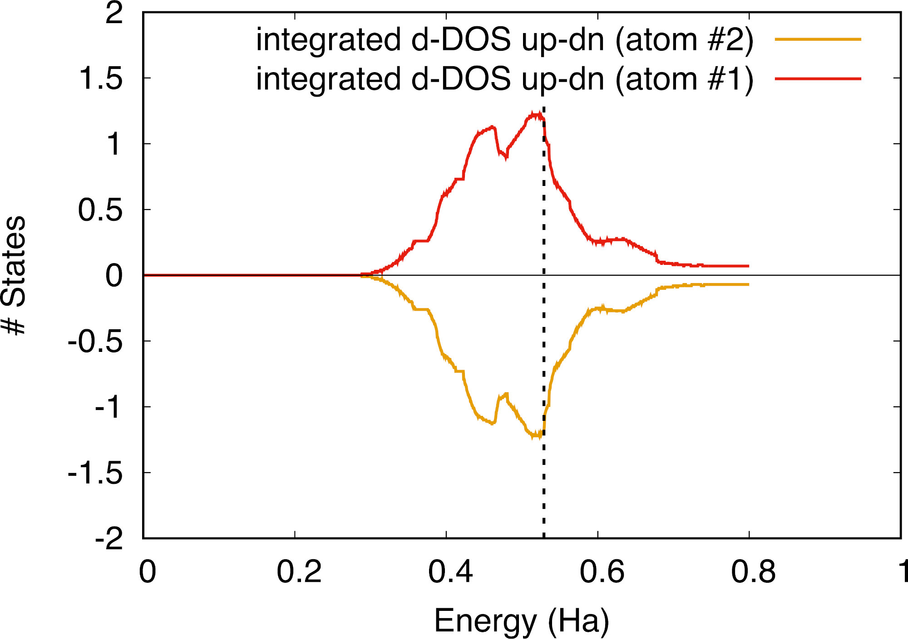

# Tutorial about the spin

## Properties related to spin (spin polarized calculations, ferro- ferri- magnetic materials, and spin-orbit coupling).

This tutorial aims at showing how to get the following physical properties:

* the total magnetization of a ferromagnetic material
* the magnetization of an antiferromagnetic material
* analyse the total density of states per spin direction
* analyse the density of states per atom and per spin direction
* look at the effect of spin-orbit coupling for a non magnetic system
* non-collinear magnetism (not yet)
* spin-orbit coupling and magnetocristalline anisotropy (not yet)

You will learn to use features of ABINIT which deal with spin.

This tutorial should take about 1.5 hour.

[TUTORIAL_READMEV9]

## 1 A ferromagnetic material: *bcc* Fe

*Before beginning, you might consider to work in a different subdirectory, as
for the other tutorials. Why not Work_spin?*

The file *tspin_x.files* in *\$ABI_TESTS/tutorial/Input* lists the file names and root names.
while *tspin_1.in* is our input file.
You can copy these two files in the *Work_spin* directory with:

```sh
cd $ABI_TESTS/tutorial/Input
mkdir Work_spin
cd Work_spin
cp ../tspin_1.in .
```



You can now run the calculation with:

```sh
abinit tspin_1.in > log > err &
```

In the mean time the calculation is done, have a look at the input file, and read it carefully.
Because we are going to perform magnetic calculations, there are two new types of variables related to magnetism:

* [[nsppol]]
* [[spinat]]

You will work with a low [[ecut]] (=18Ha) and a small k-point grid (defined by [[ngkpt]]) of 4x4x4
Monkhorst-Pack grid. It is implicit that in *real life*, you should do a
convergence test with respect to both [[ecut]] and [[ngkpt]] parameters and this is even more
important with magnetism that involves low energy differences (e.g. one needs a
minimal cut-off to exhibit magnetic effects).

This basic first example will compare two cases, one that do not take into account magnetism and one that take into account it (done through two datasets in the input, the dataset 1 does not include magnetism and dataset 2 includes it).
We now look at the output file. 
In the magnetic case (dataset 2), the electronic density is split into two parts,
the "Spin-up" and the "Spin-down" parts to which correspond different Kohn-Sham
potentials and different sets of eigenvalues whose occupations are given by the
Fermi-Dirac function (without the ubiquitous factor 2).

For the first k-point, for instance, we get:

```
(no magnetism)
   2.00000    2.00000    2.00000    2.00000    2.00000    1.99999    1.99999    1.28101   1.28101    0.35284

(magnetic case)
(SPIN UP)
   1.00000    1.00000    1.00000    1.00000    1.00000    1.00000    1.00000    0.97826   0.97826    0.68642
(SPIN DOWN)
   1.00000    1.00000    1.00000    1.00000    1.00000    0.99995    0.99995    0.05851   0.05851    0.01699
```

We note that the occupations of the magnetic case are different for up and down spin channels, which
means that the eigenvalues are shifted (which is in turn due to a shift of the exchange-correlation potential, 
and therefore of the effective potential).
You can indeed have a look at the output file to compare spin-up and down eigenvalues:

```
(up channel:)
  -3.09143   -1.74675   -1.74675   -1.74418    0.25777    0.36032    0.36032    0.46350   0.46350    0.49374
(dn channel:)
  -3.04218   -1.69171   -1.69171   -1.68906    0.27331    0.40348    0.40348    0.52935   0.52935    0.54215
```

Now you can move down in the output and look at the following section:
````
 Integrated electronic and magnetization densities in atomic spheres:
 ---------------------------------------------------------------------
 Radius=ratsph(iatom), smearing ratsm=  0.0000. Diff(up-dn)=approximate z local magnetic moment.
 Atom    Radius    up_density   dn_density  Total(up+dn)  Diff(up-dn)
    1   2.00000     7.658786     6.158329     13.817115     1.500458
 ---------------------------------------------------------------------
  Sum:              7.658786     6.158329     13.817115     1.500458
 Total magnetization (from the atomic spheres):             1.500458
 Total magnetization (exact up - dn):                       1.571040
======================================================================
````

In the last line, it is reported the total magnetization of the whole unit cell 
(in unit of $\mu_B$ - Bohr's magneton), which correponds to the difference between the
integrated up and down densities, here we have 1.571040 $\mu_B$.
It is also reported the same difference but as integrated into spheres around each atom 
(here we have only one atom), which gives here 1.500458 $\mu_B$ on iron atom.
The integrated magnetization in atomic spheres is an approximation, one should always check
that the sum of the integrated atomic magnetization from the atomic sphere is very close to the 
exact up-dn unit cell magnetization.
In the case of dataset 1 without magnetism, only the integrated electronic density is reported since there is
no distinction between up and down spin channels.

You can look to the total energy of dataset 1 and 2:

```
           etotal1    -1.2342819713E+02
           etotal2    -1.2343141307E+02
```

The energy of the magnetic calculation is lower than the non-magnetic one,
which is expected for a magnetic crystal (the system gains energy through the extra degrees of freedom given by the magnetism).
Finally, you can also remark that the stress tensor is affected by the presence of magnetism.
This would also be true for the forces, but we don't remark it here because we are in high symmetry symmetry structure (all the forces are zeroed by symmetry), however this would be apparent for a less symmetric material.

#### --- EB: I STOPPED HERE --- ###


It is interesting to consider in more detail the distribution of eigenvalues
for each direction of magnetization, which is best done by looking at the
respective densities of state.
To this end we have set [[prtdos]] = 1 in the input file, in order to obtain
the density of states corresponding to spin-up and spin-down electrons (as soon as [[nsppol]] = 2).
The values of the DOS are in the files *tspin_1o_DS1_DOS* and *tspin_1o_DS2_DOS*
for the magnetic and non-magnetic cases respectively. We can extract the values
for use in a plotting software.
Traditionally, in order to enhance visibility, one plots
the DOS of minority spin electrons using negative values.
If we compare the DOS of the magnetized system


and the non-magnetized system


we observe that the up and down DOS have been "shifted" with respect each other.
The integrated density of states yields the number of electrons for each spin
direction, and we see the magnetization which arises from the fact that there
are more up than down electrons at the Fermi level.

That the magnetization points upwards is fortuitous, and we can get it
pointing downwards by changing the sign of the initial [[spinat]].
Indeed, in the absence of spin-orbit coupling, there is no relation between
the direction of magnetization and the crystal axes.
If we start with a [[spinat]] of 0, the magnetization remains 0. [[spinat]]
serves two purposes: it is a way to initially break the spin symmetry (up/down), and also
to start with a reasonable magnetic moment, close enough to the final one (in spin DFT,
as opposed to the original flavor, there can be several local minima for the total energy).

The self-consistent loop is affecting both the density (like in the non-magnetic case) as
well as the spin-magnetization. For this reason, it might be more difficult to reach
than in the non-magnetic case. 
Not only starting with a reasonable magnetic moment might help in this respect, but also,
modified (tighter) calculation parameters might be needed. For example, in the case of
Cobalt, in order to obtain the correct (non-zero) magnetic moment, a rather
dense sampling of wavevectors in the Brillouin zone must be used (e.g.e 16x16x16), with a 
rather small value of [[tsmear]]. The solution of the Kohn-Sham equation
will benefit of using a smaller value of [[tolrde]] (e.g. 0.001 instead of the default 0.005),
and a larger value of [[nline]] (e.g. 6 instead of the default 4).


## 2 An antiferromagnetic example: *fcc* Fe

Well sort of....

Actually, fcc Fe, displays many complicated structures, in particular spin spirals.
A spiral is characterized by a direction along an axis, an angle of
the magnetization with respect to this axis and a step after which the magnetization comes full circle.
A very simple particular case is when the angle is 90°, the axis is <100> and
the step is the unit cell side: spin directions alternate between
planes perpendicular to the <100> axis yielding a "spiral stairway":


For instance, if the atom at [x,y,0] possesses an "up" magnetization, the atom
at [x+1/2,y,1/2] would possess a down magnetization etc...
To describe such a structure, a unit cell with two atoms is sufficient, [0,0,0] and
[1/2,0,1/2].
The atoms will be given opposite magnetization with the help of the variable [[spinat]].

Copy the file *$ABI_TESTS/tutorial/Input/tspin_2.in* in *Work_spin*.



This is your input file. Modify the *tspin_x.files* file accordingly.

You can run the calculation, then you should edit the *tspin_2.in* file, and briefly
look at the two changes with respect to the file *tspin_1.in*: the
unit cell basis vectors [[rprim]], and the new [[spinat]].

Note also we use now [[nsppol]] = 1 and [[nspden]] = 2: this combination of values
is only valid when performing a strictly antiferromagnetic calculation: nspden = 2 means
that we have 2 independent components for the charge density while nsppol = 1
means that we have 1 independent component for the wave-functions.
In that case, ABINIT uses the so-called Shubnikov symmetries, to perform
calculations twice faster than with [[nsppol]] = 2 and [[nspden]] = 2. The
symmetry of the crystal is not the full fcc symmetry anymore, since the
symmetry must now preserve the magnetization of each atom.  ABINIT is
nevertheless able to detect such symmetry belonging to the Shubnikov groups
and correctly finds that the cell is primitive, which would not be the case
if we had the same vector [[spinat]] on each atom.

If we now run the calculation again, this total computation time is
approximately 30 seconds on a recent CPU.
If we look at the eigenvalues and occupations, they are again filled with a
factor 2, which comes from the symmetry considerations alluded to above, and
not from the "usual" spin degeneracy: the potential for spin-up is equal to
the potential for spin-down, shifted by the antiferromagnetic translation
vector. Eigenenergies are identical for spin-up and spin-down, but
wavefunctions are shifted one with respect to the other.

```
kpt#   1, nband= 16, wtk=  0.05556, kpt=  0.0833  0.0833  0.1250 (reduced coord)
-0.60539  -0.47491  -0.42613  -0.39022  -0.35974  -0.34377  -0.28895  -0.28828
-0.25314  -0.24042  -0.22943  -0.14218   0.20264   0.26203   0.26641   0.62158
    occupation numbers for kpt#   1
 2.00000   2.00000   2.00000   1.99997   1.99945   1.99728   1.50632 1.48106
 0.15660   0.04652   0.01574   0.00000   0.00000   0.00000   0.00000 0.00000
```

How do we know we have magnetic order?
The density of states used for bcc Fe will not be useful since the net
magnetization is zero and we have as many up and down electrons.
The magnetization is reflected in the existence of distinct up and down
electronic densities, whose sum is the total density and whose difference yields
the net magnetization density at each point in real space.

In particular, the integral of the magnetization around each atom will give an
indication of the magnetic moment carried by this particular atom. A first
estimation is printed out by ABINIT. You can read:

```
 Integrated electronic and magnetization densities in atomic spheres:
 ---------------------------------------------------------------------
 Radius=ratsph(iatom), smearing ratsm=  0.0000. Diff(up-dn)=approximate z local magnetic moment.
 Atom    Radius    up_density   dn_density  Total(up+dn)  Diff(up-dn)
    1   2.00000     3.327892     2.990936      6.318828     0.336956
    2   2.00000     2.986707     3.323643      6.310350    -0.336936
 ---------------------------------------------------------------------
  Sum:              6.314599     6.314579     12.629179     0.000020
 Total magnetization (from the atomic spheres):             0.000020
 Total magnetization (exact up - dn):                      -0.000000
================================================================================
```

and obtain a rough estimation of the magnetic moment of each atom
(strongly dependent on the radius used to project the charge density):

    magnetization of atom 1= 0.33696
    magnetization of atom 2=-0.33693

But here we want more precise results...
To perform the integration, we will use the utility *cut3d* which yields an
interpolation of the magnetization at any point in space. *cut3d* is one of the
executables of the ABINIT package and is installed together with abinit.
For the moment cut3d is interactive, and we will use it through a very primitive script
(written in Python) to perform a rough estimate of the magnetization on each atom.
You can have a look at the [magnetization.py program](spin_assets/magnetization.py), and note
(or believe) that it does perform an integration of the magnetization in a cube of
side acell/2 around each atom; if applicable, you might consider adjusting the
value of the "CUT3D" string in the Python script.

Copy it in your *Work_spin* directory. If you run the program, by typing

```
python magnetization.py
```

you will see the result:

    For atom 0 magnetic moment 0.3568281445920086
    For atom 1 magnetic moment -0.3567450343127074

which shows that the magnetizations of the two atoms are really opposite.
With the next input file *tspin_3.in*, we will consider this same problem, but
in a different way. We note, for future reference, that the total energy is:
Etotal=-4.92489592898935E+01

## 3 Another look at *fcc* Fe

Instead of treating fcc Fe directly as an antiferromagnetic material, we will
not make any hypotheses on its magnetic structure, and run the calculation
like the one for bcc Fe, anticipating only that the two spin directions are going to be different.
We will not even assume that the initial spins are of the same magnitude.

You can copy the file *$ABI_TESTS/tutorial/Input/tspin_3.in* to *Work_spin*.



This is your input file. You can modify the file *tspin_x.files* and immediately
start running the calculation. Then, you should edit it to understand its contents.

Note the values of [[spinat]]. In this job, we wish again to characterize the magnetic structure.
We are not going to use zeta as in the preceding calculation, but we will here
use another feature of abinit: atom and angular momentum projected densities of state.
These are densities of states weighted by the projection of the wave functions
on angular momentum channels (that is spherical harmonics) centered on each atom of the system.
Note that these DOS are computed with the tetrahedron method, which is rather
time consuming and produces more accurate but less smooth DOS than the smearing method. The time
is strongly dependent on the number of k-points, and we use here only a reduced set.
(This will take about 1.5 minutes on a modern computer)

To specify this calculation we need new variables, in addition to [[prtdos]] set now to 3:

* [[natsph]]
* [[iatsph]]
* [[ratsph]]

This will specify the atoms around which the calculation will be performed, and the radius of the sphere.
We specifically select a new dataset for each atom, a non self-consistent
calculation being run to generate the projected density of states.
First, we note that the value of the energy is: Etotal=-4.92489557316370E+01,
which shows that we have attained essentially the same state as above.

The density of states will be in the files *tspin_3o_DS2_DOS_AT0001* for the
first atom, and *tspin_3o_DS3_DOS_AT0002* for the second atom.
We can extract the density of d states, which carries most of the magnetic
moment and whose integral up to the Fermi level will yield an estimate of the
magnetization on each atom.
We note the Fermi level (echoed in the file *tspin_3o_DS1_DOS*):

    Fermi energy :      -0.28270392

If we have a look at the integrated site-projected density of states, we can
compute the total moment on each atom. To this end, one can open the file
*tspin_3o_DS3_DOS_AT0002*, which contains information pertaining to atom 2. This
file is self-documented, and describes the line content, for spin up and spin down:

```
# energy(Ha)  l=0   l=1   l=2   l=3   l=4    (integral=>)  l=0   l=1   l=2 l=3   l=4
```

If we look for the lines containing  an energy of "-0.28250", we find

up  -0.28250  0.8026  2.6082  23.3966  0.7727  0.1687  0.30  0.34  <font color="red">3.42</font>  0.04  0.01
dn  -0.28250  0.3381  1.8716  24.0456  0.3104  0.1116  0.30  0.33  <font color="red">2.74</font>  0.04  0.01

There are apparently changes in the densities of states for all the channels,
but besides the d-channels, these are indeed fluctuations. This is confirmed
by looking at the integrated density of states which is different only for the
d-channel. The difference between up and down is 0.68, in rough agreement
(regarding our very crude methods of integration) with the previous
calculation. Using a calculation with the same number of k-points for the
projected DOS, we can plot the up-down integrated dos difference for the d-channel.



Note that there is some scatter in this graph, due to the finite number of digits (2 decimal
places) of the integrated dos given in the file *tspin_3o_DS3_DOS_AT0002*.

If we now look at the up and down DOS for each atom, we can see that the
corner atom and the face atom possess opposite magnetizations, which roughly
cancel each other. The density of states computed with the tetrahedron method
is not as smooth as by the smearing method, and a running average allows for a better view.

As mentioned earlier, the solution of the Kohn-Sham equation
might benefit of using a smaller value of [[tolrde]] (e.g. 0.001 instead of the default 0.005),
and a larger value of [[nline]] (e.g. 6 instead of the default 4).


## 4 Ferrimagnetic (not yet)

Some materials can display a particular form of ferromagnetism, which also can
be viewed as non compensated antiferromagnetism, called ferrimagnetism.
Some atoms possess up spin and other possess down spin, but the total spin magnetization is non zero.
This happens generally for system with different type of atoms, and sometimes
in rather complicated structures such as magnetite.

## 5 The spin-orbit coupling

For heavy atoms a relativistic description of the electronic structure becomes
necessary, and this can be accomplished through the relativistic DFT approach.

### 5.1 Norm-conserving pseudo-potentials

For atoms, the Dirac equation is solved and the 2(2l+1) l-channel
degeneracy is lifted according to the eigenvalues of the $L+S$ operator
(l+1/2 and l-1/2 of degeneracy 2l+2 and 2l).
After pseudization, the associated wave functions can be recovered by adding to usual pseudo-potential projectors a
spin-orbit term of the generic form $v(r).|l,s\rangle L.S \langle l,s|$.
Not all potentials include this additional term, but the HGH type pseudopotentials do systematically.

In a plane wave calculation, the wavefunctions will be two-component
spinors, that is they will have a spin-up and a spin-down component, and these
components will be coupled. This means the size of the Hamiltonian matrix is quadrupled.

We will consider here a heavier atom than Iron: *Tantalum*.
You will have to change the "files" file accordingly, as we want to use the
potential: *73ta.hghsc*. It is a HGH pseudopotential, with semicore states.
Replace the last line of the tspin_x.files by

    ../../../Psps_for_tests/73ta.hghsc

You can copy the file *$ABI_TESTS/tutorial/Input/tspin_5.in* in *Work_spin*.



Change accordingly the file names in *tspin_x.files*, then run the calculation.
It takes about 20 secs on a recent computer.

The input file contains one new variable:

  * [[nspinor]]

Have a look at it. You should also look at [[so_psp]]; it is not set explicitly here,
because the SO information is directly read from the pseudopotential file.
One could force a non-SO calculation by setting [[so_psp]] to 0.

In this run, we check that we recover the splitting of the atomic levels by
performing a calculation in a big box. Two calculations are launched with and
without spin-orbit.

We can easily follow the symmetry of the different levels of the non spin orbit calculation:

```
  kpt#   1, nband= 26, wtk=  1.00000, kpt=  0.0000  0.0000  0.0000 (reduced coord)
-2.44760
-1.46437  -1.46437  -1.46437
-0.17045
-0.10852  -0.10852  -0.10852  -0.10740  -0.10740
```

That is, the symmetry: s, p, s, d
After application of the spin-orbit coupling, we now have to consider twice as many levels:

```
 kpt#   1, nband= 26, wtk=  1.00000, kpt=  0.0000  0.0000  0.0000 (reduced coord)
-2.43258  -2.43258
-1.67294  -1.67294  -1.35468  -1.35468  -1.35468  -1.35468
-0.16788  -0.16788
-0.11629  -0.11629  -0.11629  -0.11629  -0.09221  -0.09221 -0.09120  -0.09120  -0.09120  -0.09120
```

The levels are not perfectly degenerate, due to the finite size of the simulation box,
and in particular the cubic shape, which gives a small crystal field splitting of the d orbitals
between $e_g$ and $t_{2g}$ states.
We can nevetheless compute the splitting of the levels, and we obtain, for e.g. the p-channel: 1.67294-1.35468=0.31826 Ha

If we now consider the
[NIST table](https://www.nist.gov/pml/atomic-reference-data-electronic-structure-calculations-tantalum)
of atomic data, we obtain:

    5p splitting, table: 1.681344-1.359740=0.321604 Ha
    5d splitting, table:   .153395-.131684=0.021711 Ha

We obtain a reasonable agreement.
A more converged (and more expensive calculation) would yield:

    5p splitting, abinit: 1.64582-1.32141=0.32441 Ha
    5d splitting, abinit:   .09084-.11180=0.02096 Ha

### 5.2 Projector Augmented-Wave

Within the Projector Augmented-Wave method, the usual (pseudo-)Hamiltonian can be expressed as:

$$
H  =  K + V_{eff} + \Sigma_{ij} D_{ij}  |p_i \rangle \langle p_j|
$$

If the two following conditions are satisfied:

(1) the local PAW basis is complete enough;
(2) the electronic density is mainly contained in the PAW augmentation regions,

it can be shown that a very good approximation of the PAW Hamiltonian --
including spin-orbit coupling -- is:

$$
H  \simeq  K + V_{eff} + \Sigma (D_{ij}+D^{SO}_{ij})  |p_i \rangle \langle p_j|
$$

where $D^{SO}_{ij}$ is the projection of the ($L.S$) operator into the PAW augmentation regions.
As an immediate consequence , we thus have the possibility to use the standard $p_i$ PAW projectors;
in other words, it is possible to use the standard PAW datasets (pseudopotentials) to perform
calculations including spin-orbit coupling.
But, of course, it is still necessary to express the wave-functions as two
components spinors (spin-up and a spin-down components).
Let's have a look at the following keyword:

  * [[pawspnorb]]

This activates the spin-orbit coupling within PAW (forcing [[nspinor]]=2).

Now the practice:
We consider Bismuth.
You will have to change the "files" file accordingly, to use the new
potential *83bi.paw*. This is a PAW dataset with 5d, 6s and 6p electrons in the valence.
Replace the last line of the tspin_x.files by:

    ../../../Psps_for_tests/83bi.paw

You can copy the file *$ABI_TESTS/tutorial/Input/tspin_6.in* in *Work_spin*
(one Bismuth atom in a large cell). Change the file names in
*tspin_x.files* accordingly, then run the calculation. It takes about 10 seconds on a recent computer.



Two datasets are executed: the first without spin-orbit coupling, the second one using  [[pawspnorb]]=1.

The resulting eigenvalues are:

```
 Eigenvalues (hartree) for nkpt=   1  k points:
 kpt#   1, nband= 24, wtk=  1.00000, kpt=  0.0000  0.0000  0.0000 (reduced
coord)
 5d   -0.93353  -0.93353  -0.93353  -0.93353  -0.82304  -0.82304  -0.82304
-0.82304 -0.82291  -0.82291
 6s   -0.42972  -0.42972
 6p   -0.11089  -0.11089  -0.03810  -0.03810  -0.03810  -0.03810
```

Again, the levels are not perfectly degenerate, due to the finite size and non spherical
shape of the simulation box.
We can compute the splitting of the levels, and we obtain:

    5d-channel: 0.93353-0.82304=0.11048 Ha
    6p-channel: 0.11089-0.03810=0.07289 Ha

If we now consider the
[NIST table](https://www.nist.gov/pml/atomic-reference-data-electronic-structure-calculations-bismuth)
of atomic data, we obtain:

    5d-channel: 1.063136-0.952668=0.11047 Ha
    6p-channel: 0.228107-0.156444=0.07166 Ha

A perfect agreement even with a small simulation cell and very small values of plane-wave cut-offs.
This comes from the generation of the PAW dataset, where the SOC is calculated very accurately
and for an atomic reference. The exchange correlation functional has little impact on large SOC
splittings, which are mainly a kinetic energy effect.

## 6 Rotation of the magnetization and spin-orbit coupling

The most spectacular manifestation of the spin-orbit coupling is the energy
associated with a rotation of the magnetisation with respect with the crystal axis.
It is at the origin of the magneto crystalline anisotropy of paramount technological importance.

As mentioned earlier, the solution of the Kohn-Sham equation
might benefit of using a smaller value of [[tolrde]] (e.g. 0.001 instead of the default 0.005),
and a larger value of [[nline]] (e.g. 6 instead of the default 4).

* * *
GZ would like to thank B. Siberchicot for useful comments.
