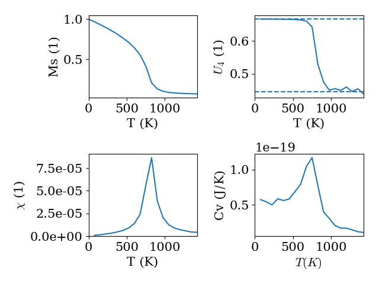
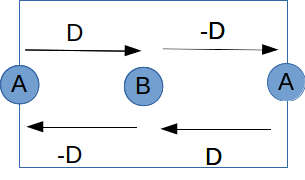

# Spin model in MULTIBINIT

## Build a spin model and run spin dynamics in MULTIBINIT

This lesson aims at showing how to build a spin model and run a spin dynamics calculation.

**Before beginning, it is important to know the theory of spin dynamics, which can be found in the literature (e.g.[[cite: Evans2014]], [[cite: Eriksson2017]] ).**

With this lesson, you will learn to:

  * Run a spin dynamics calculation with MULTIBINIT
  * Determine the critical temperature for a magnetic phase transition
  * Calculate spin canting angles for systems with Dzyaloshinskii-Moriya interaction

The TB2J python package, which can be used to generate a spin model, can be found on the ABINIT gitlab website at https://gitlab.abinit.org/xuhe/TB2J. This package will be included in the ABINIT package in the future.

*Before beginning, you might consider to work in a subdirectory for this tutorial. Why not Work_spindyn?*

[TUTORIAL_README]

## 1 Heisenberg Model formalism

The spin model, as implemented in MULTIBINIT, is defined as a classical Heisenberg model. In the current version of MULTIBINIT, we consider the following interactions: exchange interaction, single ion anisotropy (SIA), Dzyaloshinski-Moriya (DM) interaction, external magnetic fields. The total energy then reads as

$$E = E^{exc}+E^{SIA} + E^{DM}+E^{ext}.$$

The exchange energy $E^{exc}$ can be written as

$$E^{exc} =- \sum_{i\neq j} J_{ij} \vec{S_i}\cdot{\vec{S_j}}$$

A few conventions used in MULTIBINIT should be noted:

- all the $\vec{S}$ are normalized to 1.
- Both $J_{ij}$ and $J_{ji}$ are in the Hamiltonian.
- There is a minus sign, which means that the interaction is ferromagnetic for $J_{ij} >0$.

As the sites $i$ and $j$ defined in the model are in a finite cell (often the primitive cell), there are interactions between sites in the same cell and between sites in two different cells. The position vector of a site $j'$ in a different cell than site $i$ is denoted as $\vec{r}_{j'}=\vec{r}_j+\vec{R}$ with $\vec{R}$ being a combination of lattice vectors. For a site $j$ in the same cell as site $i$ the lattice vector $\vec{R}$ is $(0,0,0)$. Due to translation symmetry we can choose the lattice vector for site $i$ to be $\vec{R}=\vec{0}$. Hence, we denote the Heisenberg coefficients as $J_{ij}(\vec{R})$ and drop the prime for the sites in different cells.

The SIA term can be written as

$$E^{SIA}=-k_u \sum_i (\vec{S_i}\cdot \vec{e})^2,$$

where $k_u$ and $\vec{e}$ are the amplitude and direction of the single ion anisotropy.

The DM term can be written as

$$ E^{DM} = \sum_{i\neq j} \vec{D}_{ij}\cdot \vec{S_i}\times{\vec{S_j}},$$

where $\vec{D_{ij}}$ is the amplitude of the DM interaction.

The external magnetic field term can be written as

$$E^{ext}=- \sum_i   m_{i}   \vec{S_i}\cdot \vec{H},$$

where $m_i$ denotes the magnetic moment of site $i$, and $\vec{H}$ is the magnetic field.


## 2. Build spin model file

One way to calculate the Heisenberg model parameters is to use the spin force theorem (see [[cite:Liechtenstein1983]], [[cite:Katsnelson2000]]), for which one perturbs the system by rotating  localized spins. In ABINIT, the Hamiltonian uses plane waves as a basis set, thus the localized spin is not directly accessible. We can construct localized Wannier functions and rewrite the Hamiltonian in the Wannier basis. Then, the exchange parameters can be calculated from this Hamiltonian ( [[cite:Korotin2015]] ).

For building the Wannier function Hamiltonian from ABINIT, see the tutorial [wannier90](wannier90). Other DFT codes interfaced with [Wannier90](http://www.wannier.org) can also be used. Then, the  [TB2J](https://gitlab.abinit.org/xuhe/TB2J) package can be used to calculate the Heisenberg model parameters and generate the input model for MULTIBINIT. The data will be stored in a xml file which is used as input for the MULTIBINIT calculation. For the tutorial, this file is provided. Please read the [TB2J tutorial](https://gitlab.abinit.org/xuhe/TB2J/blob/master/README.md) to see how to create your own xml file.

## 3. Run spin dynamics

### Basic: how to use MULTIBINIT to run spin dynamics

Once we have the spin model xml file, we can run a spin dynamics calculation with MULTIBINIT. Example input files can be found at ~abinit/tests/tutomultibinit/Input/tmulti5_1.* .  There are three files:

* "tmulti5_1.files" is the "files" file, which gives the names of the input and output files for  MULTIBINIT.
* "tmulti5_1.in" is the main input file containing the parameters for the spin dynamics simulation.
* "tmulti5_1.xml" is the file containing the Heisenberg model parameters.

You can copy these three files into a directory (e.g. Work_spindyn).

In tmulti5_1.files, three file names are given:

```
tmulti5_1.in
tmulti5_1.out
tmulti5_1.xml
```

which gives the input, output and xml file names. The file tmulti5_1.xml contains the $J_{ij}$ values for a simple toy system which has a cubic lattice and one atom per unit cell. Its critical temperature is around 600K.

In tmulti5_1.in, the variables for running a spin dynamics calculation are given:

```
prt_model = 0
ncell =   16 16 16              ! number of unit cells in supercell

spin_dynamics = 1               ! switch on spin dynamics
spin_init_state = 2             ! ferromagnetic initial state

spin_temperature = 600          ! temperature of spin (Kelvin)
spin_ntime_pre = 10000          ! time steps for thermolization
spin_ntime = 20000              ! time steps for measurement
spin_nctime = 100               ! Number of time steps between two writes
                                ! into netcdf
spin_dt = 1e-16 s               ! Time step (seconds)
spin_qpoint_qpoint = 0.0 0.0 0.0       ! Wave vector for summation of spin in each
                                ! sublattice.

spin_write_traj = 0             ! do not write spin trajectory to netcdf file
```

To run spin dynamics with MULTIBINIT

```
cd Work_spindyn
multibinit < tmulti5_1.files > tmulti5_1.txt
```

After the calculation is done, you will find an output file named tmulti5_1.out and a netcdf file tmulti5_1.out_spinhist.nc.

In the .out file, you can find the lines below, which give a overview of the evolution of the system with time:

```
Beginning spin dynamic steps :
==================================================================
    Iteration          time(s)         Avg_Mst/Ms      ETOT(Ha/uc)
------------------------------------------------------------------
Thermalization run:
-           100      9.90000E-15      6.50748E-01     -2.20454E-03
-           200      1.99000E-14      5.57558E-01     -1.89219E-03
-           300      2.99000E-14      5.28279E-01     -1.85341E-03
  .....
Measurement run:
-           100      9.90000E-15      4.58081E-01     -1.79152E-03
-           200      1.99000E-14      4.30639E-01     -1.74361E-03
-           300      2.99000E-14      4.07684E-01     -1.66528E-03
  .....
```

Here, the Avg_mst ($||<m_i e^{2\pi \vec{q}\cdot\vec{R_i}}>||$) means the average staggered magnetic moment, Ms is the saturated magnetic moment.
If all the spins for the wave-vector ($\vec{q}$) [[multibinit:spin_projection_qpoint]] are aligned ,
the value for Avg_Mst/Ms is 1.0. it deviates from 1.0 due to thermal fluctuations.
The last column states the total energy of the system per unit cell.

There are two stages, the warming up and measurement, in the whole spin dynamics process.
During the thermalization the spins evolve towards the equilibrium state for the temperature defined in the input file.
During the measurement stage, the steps are sampled for the calculation of the observables.

At the end of the run, there is a summary of the calculation

```
Summary of spin dynamics
   At the end of the run, the average spin at each sublattice is
      Sublattice       <M_i>(x)  <M_i>(y)  <M_i>(z)  ||<M_i>||
-        0001          -0.31575   0.08664   0.24544   0.40921

```

For structures with more than one magnetic site in the unit cell (sublattices), a separate line will be printed for each sublattice. This allows us to see how the spins in the different sublattices are aligned to each other.

The following observables are printed, which are:

```
# Temperature              Cv             chi        BinderU4             Mst
    600.00000     8.26236E+03     6.40552E-02     0.66303E+00     4.19057E-01
```

* Cv: volume specific heat:

  $C_v=(<E^2>-<E>^2)/(k_B^2 T^2)$ .

  $<E>$ means average of energy per unit cell during the observation time. At zero temperature $C_v=0$.  $C_v$ is in atomic unit.

* chi ($\chi$): the isothermal susceptibility:

  $\chi=\frac{\partial <m>}{\partial H}= (<m^2>-<m>^2)/(k_B T)$ .

  $<m>$ is the average of the total staggered magnetic moment.  At zero temperature, $\chi$ is not well defined.

* BinderU4: The Binder cumulant, which is

  $U_4=1-\frac{<m^4>}{3<m^2>^2}$.

  In a 3D Heisenberg system, $U_4$ goes to 2/3 when $T<T_C$ and goes to 4/9 when $T >T_C$ .

* Mst: The staggered magnetic moment, which is defined as:

  $M=\sum_i m_i \exp(i \vec{q}\cdot{\vec{R_i}})$.

  Here Mst is normalized to the saturated magnetic moment so the maximum of M is 1.

In the netcdf file, the trajectories of the spins can be found. They can be further analyzed using post-processing tools.

We are now coming back to the values chosen for the input variables in the tmulti5_1.in file. It is essential to choose these values such that the results of the calculation are meaningful. Therefore, we recommend a convergence study concerning the following parameters:

* time step ([[multibinit: spin_dt]]):

Typical time steps are about $10^{-15}$ to $10^{-17}$ s.
An optimal time step can be determined by trying several values and comparing the results (equilibrium magnetic order, moments, etc) to a calculation with a small time step (e.g. $10^{-17}$ s).
At this stage, a small box and a temperature close to zero can be used.

* supercell size ([[multibinit:ncell]])

  Due to the periodic boundary condition, the spins between periods could be correlated with each other, which can lead to an artificial increase in, e.g., the phase transition temperature. Also, certain quantities cannot be sampled using a small box. Hence, it is required to test if the quantity of interest is converged with the supercell size.

  For anti-ferromagnetic structures, or more generally, structures with non-zero wave vector, the box size should allow the spins to fit to the q-vector, i.e. ($\vec{q}\cdot \vec{n}$) should be integers. For some structures, it is not easy or sometimes impossible to find such $\vec{n}$. In these cases, a large box is usually required.

* Thermalization time([[multibinit: spin_ntime_pre]])

    The thermalization time should at least allow the spins to relax to the equilibrium state. To see how much time is needed for the system to get to the equilibrium state, we can plot the magnetic moment as a function of time. It should be noted that the relaxation to the equilibrium state usually takes much longer near the phase transition temperature. Therefore, it is important to test the relaxation time.

* Measurement time ([[multibinit: spin_ntime]])

   In order to calculate some observables, longer times (e.g. 10 times the relaxation time) are required so enough samples can be generated.

### A real world example: $LaFeO_3$

A most common usage of spin dynamics is to calculate the magnetic quantities (e.g. magnetic moments, susceptibility, specific heat ) as a function of temperature and determine the critical  temperature where a phase transition from one magnetic phase to another occurs.

By setting [[multibinit:spin_var_temperature]] to 1 and specifying the starting temperature, final temperature, and the number of steps, a series of calculations is carried out. (See e.g. ~abinit/tests/tutomultibinit/Input/tmulti5_2.* )

(*Note that some of the parameters in the input file are set to "bad" values. Let's try to tune them to make a meaningful calculation.* )

```
dynamics =  0                   ! Disable molecular dynamics
ncell =   6 6 6                 ! Size of supercell (Is this too small?)
spin_dynamics=1                 ! Run spin dynamics
spin_ntime_pre = 1000           ! Thermolization steps (Is this enough?)
spin_ntime = 20000              ! Measurement steps. (Is this enough?)
spin_nctime = 100               ! Number of time steps between two writes
                                ! into netcdf
spin_dt = 1e-16 s               ! Time step (Is this too large?)
spin_init_state = 2             ! Ferromagnetic initial state (problematic?)
spin_projection_qpoint = 0.0 0.0 0.0       ! Wave vector of spin order

spin_var_temperature = 1        ! Variable temperature calculation
spin_temperature_start = 0      ! Starting temperature
spin_temperature_end = 500      ! Final temperature (Smaller than Neel temp.?)
spin_temperature_nstep = 6      ! Number of temperature steps (Is this enough?)
```

Note that you are now running several calculations for different temperatures, so this might take a minute or two. After the run, the trajectories for each temperature will be written into the \*\_T0001_spin_hist.nc to \*\_T0006_spin_hist.nc files if spin_temperature_step=6.

There are several ways to find the critical temperature. The most natural way is to use the M-T curve. However, there are some difficulties because the change of the magnetic moment is not abrupt at the critical temperature, and its value is sensitive to the box size. The specific heat and the magnetic susceptibility diverge at $T_c$ and are therefore more reliable to determine the critical temperature. The specific heat has the additional advantage that we do not need to know the magnetic order to calculate it. Another option is to calculate the Binder cumulant, defined as $U_4= 1.0- \frac{<m^4>}{3 <m^2> }$, which is less sensitive to the box size and also changes abruptly at $T_c$.

These quantities can be found at the end of the various T calculation in the output file:

```
 Summary of various T run:
# Temperature              Cv             chi        BinderU4             Mst
      0.00000     0.00000E+00     1.46625E-13     0.66667E+00     1.00000E+00
    100.00000     8.52440E+02     1.01185E+00     0.66666E+00     9.57752E-01
    200.00000     7.65946E+02     1.49460E+00     0.66664E+00     9.12555E-01
    300.00000     9.90440E+02     2.63298E+00     0.66660E+00     8.65566E-01
....
```

They can also be found in the \*.varT file so it's easy to plot the observables as functions of temperature. The average magnetization of each sublattice is also in this file.

If the input parameters are well tuned you will obtain the curves for the different quantities like the following. From the result we can see the Neel temperature is about 800 K (The experimental $T_N$ of LaFeO3 is about 740 K).





### Example with DMI: 1D canted AFM-chain

We now study a system with Dzyaloshinskii-Moriya interaction (DMI). The system is a simple 1D chain with a unit cell consisting of two sites A and B, as shown below. The exchange between A and B is $J= 5$ meV, and the DMI $\vec{D}= (0, 0, 2)$ meV. The arrow from A to B means $D_{AB}$, where $D_{AB}=-D_{BA}$.

The input files can be found in ~abinit/tests/tutomultibinit/Input/tmulti5_3.*




In this system, the exchange favors a collinear spin alignment, while the DMI favors the spins to be perpendicular to their neighbors. Usually, the DMI is much smaller than the exchange interaction, thus the system has a canted AFM spin alignment. We can run spin dynamics at zero temperature to get the ground state and calculate the canting angle.

```
prt_model = 0
dynamics =  0                   ! disable molecular dynamics

ncell =   4 1 1                 ! size of supercell.
spin_dynamics= 2                ! enable spin dynamics. Depondt-Mertens algorithm.
spin_ntime_pre =100000          ! warming up steps.
spin_ntime =100000              ! number of steps.
spin_nctime=1000                ! number of  time steps between two nc file write
spin_dt=1e-16 s                 ! time step.
spin_init_state = 1             ! start from random
spin_temperature = 1e-9         ! spin temperature. It is usually better to avoid 0.

spin_sia_add = 1                ! add a single ion anistropy (SIA) term.
spin_sia_k1amp = 1e-4 eV        ! amplitude of SIA, 0.1 meV. +: easy axis, -: hard axis
spin_sia_k1dir = 1.0 0.0 0.0    ! direction of SIA, easy axis along x.
```

Here, we add a relatively small (0.1 meV) single ion anisotropy term so that the easy axis is along x. Note that the DMI $\vec{D}$ is along the z-axis, therefore it lowers the energy if the spins have x and y components, while in the xy plane, the energy is isotropic. Hence, a SIA along x can be useful to break this symmetry. We can try to rotate the SIA direction in the xy plane to see if the result changes, and also try a SIA z-direction to see what happens.

At the end of spin dynamics, we can find the following output, which is the last snapshot of the spins.

It shows that the the spins have anti-parallel alignment along the easy axis (x), with a canting towards the y-axis. The canting angle is about arctan(0.187/0.982).

```
    At the end of the run, the average spin at each sublattice is
      Sublattice       <M_i>(x)  <M_i>(y)  <M_i>(z)  ||<M_i>||
-        0001          -0.98217  -0.18802  -0.00000   1.00000
-        0002           0.98207  -0.18851  -0.00000   1.00000
```


## 5. Postprocessing

<!-- TODO: agate -->

### Tips:

* Anti-ferromagnetic/ spin spiral structure.

  In the example above, the magnetic structure is anti-ferromagnetic,  where the unit cell is a multiple of the spin period. Sometimes the unit cell used does not contain the full period of spin, e.g. in a simple cubic AFM lattice with only one atom in the primitive cell.  We can use the magnetic wave vector to calculate the staggered magnetic moment. This is also useful for spin spiral structures, etc.

  ```
  spin_projection_qpoint = 0.5 0.5 0.5
  ```


#####


