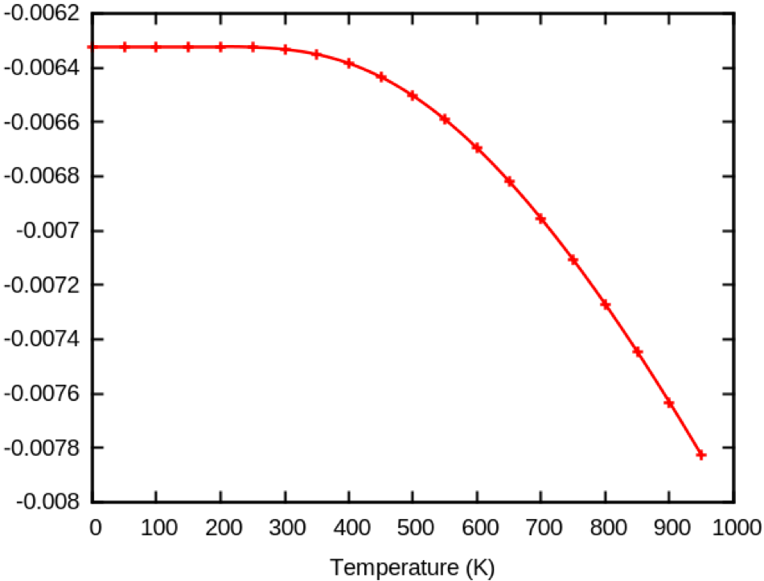
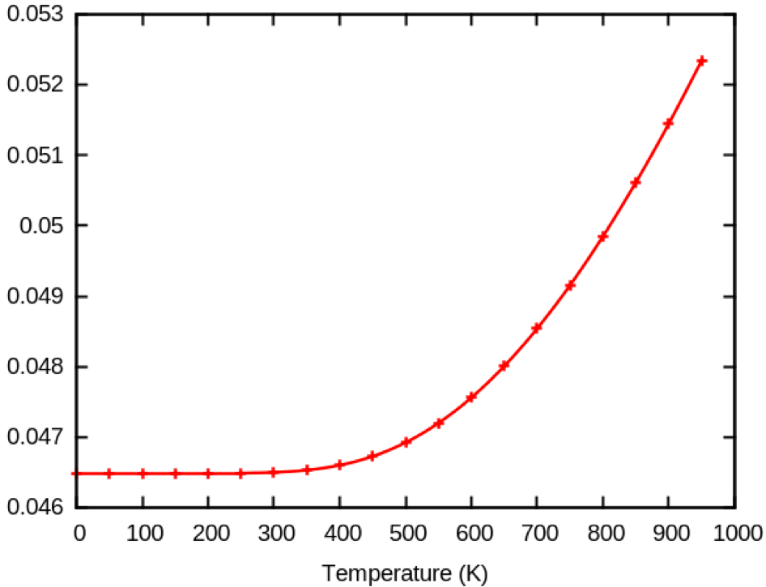
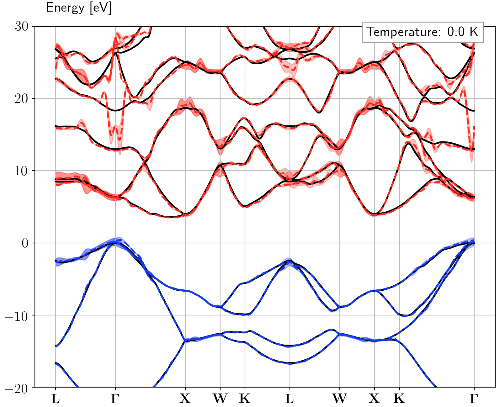

# Tutorial TDepES

## Temperature-DEPendence of the Electronic Structure.

This tutorial aims at showing how to get the following physical properties, for periodic solids:

  * The zero-point-motion renormalization (ZPR) of eigenenergies

  * The temperature-dependence of eigenenergies

  * The lifetime/broadening of eigenenergies

It should take about 1 hour.

For the theory related to the temperature-dependent calculations, please read
the following papers: [[cite:Ponce2015]], [[cite:Ponce2014]] and [[cite:Ponce2014a]].

There are two ways to compute the temperature dependence with Abinit:

  * **Using Anaddb**: historically the first implementation. This option does not require Netcdf.

  * **Using post-processing python scripts**: this is the recommended approach as it provides more options
    and is more efficient (less disk space, less memory demanding). This option
    **requires Netcdf** (both in Abinit and python). In this tutorial, we only focus on the netCDF-based approach.

!!! important

    In order to run the python script you need:

      * python 2.7.6 or higher, python3 is not supported
      * numpy 1.7.1 or higher
      * netCDF4 and netCDF4 for python
      * scipy 0.12.0 or higher

    This can be done with:

        sudo apt-get install netcdf-bin
        sudo apt-get install python-dev
        pip install numpy
        pip install scipy
        pip install netcdf4


    Abinit must be configured with: `configure --with-config-file=myconf.ac`
    where the configuration file must contain at least:

        with_trio_flavor="netcdf+other-options"

        # To link against an external libs, use
        #with_netcdf_incs="-I${HOME}/local/include"

        # if (netcdf4 + hdf5):
        #with_netcdf_libs="-L/usr/local/lib -lnetcdff -lnetcdf -L${HOME}/local/lib -lhdf5_hl -lhdf5"
        # else if netcdf3:
        #with_netcdf_libs="-L${HOME}/local/lib/ -lnetcdff -lnetcdf"

    For example, with MPI you might use the following basic myconf.ac file

        with_trio_flavor="netcdf"

        with_mpi_prefix='/home/XXXXX/local/openmpi1.10/'
        enable_mpi="yes"
        enable_mpi_io="yes"
        enable_openmp="no"

        prefix='/home/XXXX/abinit/build/'

    A list of configuration files for clusters is available in the
    [abiconfig repository](https://github.com/abinit/abiconfig)

    If you have a prebuilt abinit executable, use:

        ./abinit -b

    to get the list of libraries/options activated in the build.
    You should see netcdf in the `TRIO flavor` section:

         === Connectors / Fallbacks ===
          Connectors on : yes
          Fallbacks on  : yes
          DFT flavor    : libxc-fallback
          FFT flavor    : none
          LINALG flavor : netlib-fallback
          MATH flavor   : none
          TIMER flavor  : abinit
          TRIO flavor   : netcdf

Visualisation tools are NOT covered in this tutorial.
Powerful visualisation procedures have been developed in the Abipy context,
relying on matplotlib. See the README of [Abipy](https://github.com/abinit/abipy)
and the [Abipy tutorials](https://github.com/abinit/abitutorials).

## 1 Calculation of the ZPR of eigenenergies at q=Γ.

The reference input files for this tutorial are located in
~abinit/tests/tutorespfn/Input and the corresponding reference output files
are in ~abinit/tests/tutorespfn/Refs.
The prefix for files is **tdepes**. As usual, we use the shorthand `~abinit` to indicate
the root directory where the abinit package has been deployed, but most often
consider the paths relative to this directory.

First, examine the [[tests/tutorespfn/Input/tdepes_1.in]] input file.


Note that there are three datasets ([[ndtset]]=3). The first dataset corresponds to a standard
self-consistent calculation, with an unshifted eight k-point grid,
producing e.g. the ground-state eigenvalue file tdepes_1o_DS1_EIG.nc ,
as well as the density file tdepes_1o_DS1_DEN. The latter is read ([[getden]]2=1)
to initiate the second dataset calculation,
which is a non-self-consistent run, specifically at the Gamma point only (there is no real recomputation
with respect to the dataset 1, it only extract a subset of the eight k-point grid).
This second dataset produces the wavefunction file tdepes_1o_DS2_WFQ, that is read by the third dataset ([[getwfq]]3=2),
as well as the tdepes_1o_DS1_WFK file from the first dataset ([[getwfk]]3=1).

The third dataset corresponds to a DFPT phonon calculation ([[rfphon]]3=1)
with displacement of all atoms ([[rfatpol]]3= 1 2) in all directions ([[rfdir]]3= 1 1 1).
This induces the creation of the Derivative DataBase file tdepes_1o_DS3_DDB.
The electron-phonon matrix elements are produced because of [[ieig2rf]]3=5 ,
this option generating the needed netCDF files tdepes_1o_DS3_EIGR2D.nc and tdepes_1o_DS3_GKK.nc .

We will use [[tests/tutorespfn/Input/tdepes_1.files]], with minor modifications -see below-, to execute abinit.



In order to run abinit, we suggest that you create a working directory, why not call it `Work`,
as subdirectory of ~abinit/tests/tutorespfn/Input, then
copy/modify the relevant files. Explicitly:

    cd ~abinit/tests/tutorespfn/Input
    mkdir Work
    cd Work
    cp ../tdepes*in ../tdepes*files .

Then, edit the [[tests/tutorespfn/Input/tdepes_1.files]] to modify location of the pseudopotential file
(from the Work subdirectory, the location is ../../../Psps_for_tests/PseudosTM_pwteter/6c.pspnc, although you might as well copy the
file 6c.pspnc in the Work directory, in which case the location is simply 6c.pspnc).
Finally, issue

    abinit < tdepes_1.files > tdepes_1.stdout

(where `abinit` might have to be replaced by the proper location of the abinit executable, or by ./abinit if you have
copied abinit in the Work directory).

<!--
### If Abinit is compiled with Netcdf...
-->

If you have compiled the code with Netcdf, the calculation will produce
several _EIG.nc,
_DDB, EIGR2D.nc and EIGI2D.nc files, that contain respectively the eigenvalues (GS or
perturbed), the second-order derivative of the total energy with respect to
two atomic displacements, the electron-phonon matrix elements used to compute
the renormalization of the eigenenergies and the electron-phonon matrix
elements used to compute the lifetime of the electronic states.

You can now copy three post-processing python files from
~abinit/scripts/post_processing/temperature-dependence .
Make sure you are in the directory containing the output files produced by the code and issue:

    cp ~abinit/scripts/post_processing/temperature-dependence/temperature_final.py .
    cp ~abinit/scripts/post_processing/temperature-dependence/rf_final.py .
    cp ~abinit/scripts/post_processing/plot_bs.py .

in which ~abinit has been replaced by the proper path.


<!--
as well as the python file
containing the required classes from ~abinit/scripts/post_processing/mrgeignc.py
into the directory where you did the calculations.
-->

You can then simply run the python script with the following command:

    ./temperature_final.py

and enter the information asked by the script, typically the following
(data contained in ~abinit/tests/tutorespfn/Input/tdepes_1_temperature.in):

```
1                          # Number of cpus
2                          # Static ZPR computed in the Allen-Heine-Cardona theory
temperature_1              # Prefix for output files
0.1                        # Value of the smearing parameter for AHC (in eV)
0.1                        # Gaussian broadening for the Eliashberg function and PDOS (in eV)
0 0.5                      # Energy range for the PDOS and Eliashberg calculations (in eV)
0 1000 50                  # min, max temperature and temperature step
1                          # Number of Q-points we have (here we only computed $\Gamma$)
tdepes_1o_DS3_DDB          # Name of the response-funtion (RF) DDB file
tdepes_1o_DS2_EIG.nc       # Eigenvalues at $\mathbf{k+q}$
tdepes_1o_DS3_EIGR2D.nc    # Second-order electron-phonon matrix element
tdepes_1o_DS3_GKK.nc       # Name of the 0 GKK file
tdepes_1o_DS1_EIG.nc       # Name of the unperturbed EIG.nc file with Eigenvalues at $k$
```

Alternatively, copy this example file in the Work directory if not yet done, and then run

    ./temperature_final.py < tdepes_1_temperature.in



!!! warning

    Remember to use py2.7 and install the libraries required by the script before running.

    For pip, use:

        pip install netcdf4

    or:

        conda install netcdf4

    if you are using [conda](https://docs.conda.io/en/latest/miniconda.html)


You should see on the screen an output similar to:

```shell
Start on 15/3/2018 at 13h29

    ____  ____       _                                      _
   |  _ \|  _ \     | |_ ___ _ __ ___  _ __   ___ _ __ __ _| |_ _   _ _ __ ___
   | |_) | |_) |____| __/ _ \ '_ ` _ \| '_ \ / _ \ '__/ _` | __| | | | '__/ _ \
   |  __/|  __/_____| ||  __/ | | | | | |_) |  __/ | | (_| | |_| |_| | | |  __/
   |_|   |_|         \__\___|_| |_| |_| .__/ \___|_|  \__,_|\__|\__,_|_|  \___|
                                      |_|                              Version 1.3

This script compute the static/dynamic zero-point motion
  and the temperature dependence of eigenenergies due to electron-phonon interaction.
  The electronic lifetime can also be computed.

  WARNING: The first Q-point MUST be the Gamma point.

Enter the number of cpu on which you want to multi-thread
Define the type of calculation you want to perform. Type:
                         1 if you want to run a non-adiabatic AHC calculation
                         2 if you want to run a static AHC calculation
                         3 if you want to run a static AHC calculation without control on active space (not recommended !)
   Note that for 1 & 2 you need _EIGR2D.nc and _GKK.nc files obtained through ABINIT option "ieig2rf 5"
Enter name of the output file
Enter value of the smearing parameter for AHC (in eV)
Enter value of the Gaussian broadening for the Eliashberg function and PDOS (in eV)
Enter the energy range for the PDOS and Eliashberg calculations (in eV): [e.g. 0 0.5]
Introduce the min temperature, the max temperature and the temperature steps. e.g. 0 200 50 for (0,50,100,150)
Enter the number of Q-points you have
Enter the name of the 0 DDB file
Enter the name of the 0 eigq file
Enter the name of the 0 EIGR2D file
Enter the name of the 0 GKK file
Enter the name of the unperturbed EIG.nc file at Gamma
Q-point:  0  with wtq = 1.0  and reduced coord. [ 0.  0.  0.]
Now compute active space ...
Now compute generalized g2F Eliashberg electron-phonon spectral function ...
End on 15/3/2018 at 13 h 29
Runtime: 0 seconds (or 0.0 minutes)
```

The python code has generated the following files:

**temperature_1.txt**
: This text file contains the zero-point motion renormalization (ZPR) at each k-point for each band.
  It also contain the evolution of each band with temperature at k=$\Gamma$.
  At the end of the file, the Fan/DDW contribution is also reported.

**temperature_1_EP.nc**
: This netcdf file contains a number for each k-point,
  for each band and each temperature. The real part of this number is the ZPR correction
  and the imaginary part is the lifetime.

<!--
**temperature_BRD.txt**
: This text file contains the lifetime of the electronic states
  at each k-point for each band. It also contains the evolution of each band with temperature at k=$\Gamma$.
-->

We can for example visualize the temperature dependence at k=$\Gamma$  of the HOMO bands
(`Band: 3` section in the **temperature_1.txt** file, that you can examine)
with the contribution of only q=$\Gamma$.

<!--


Here you can see that the HOMO correction goes down with temperature. This is
due to the use of underconvergence parameters. If you increase [[ecut]] from
5 to 10, you get the following plot.
-->



The HOMO eigenenergies correction goes up with temperature... You can
also plot the LUMO corrections and see that they go down. The
ZPR correction as well as their temperature dependence usually closes the gap
of semiconductors.

As usual, checking whether the input parameters give converged values is of course important.
The run used [[ecut]]=10. With the severely underestimated [[ecut]]=5, the HOMO correction goes down with temperature.


<!--   OBSOLETE

### If Abinit is **not** compiled with Netcdf ...

In this case, we should first use [[help:mrgddb|mrgddb]] to merge the _DDB and _EIGR2D/_EIGI2D
but since we only have one q-point we do not have to perform this step.
The static temperature dependence and the G2F can be computed thanks to anaddb
with the files file [[tests/tutorespfn/Input/tdepes_2.files]] and the input
file [[tests/tutorespfn/Input/tdepes_2.in]].



The information contained in the files file can be understood by looking at the echo
if its reading in the standard output:

```
  Give name for formatted input file:
-   tdepes_2.in
  Give name for formatted output file:
-   tdepes_2.out
  Give name for input derivative database:
-   tdepes_1o_DS3_DDB
  Give name for output molecular dynamics:
-   dummyo.md
  Give name for input elphon matrix elements (GKK file):
-   tdepes_1o_DS3_EIGR2D
  Give root name for elphon output files:
-   tdepes_1_ana
  Give name for file containing ddk filenames for elphon/transport:
-   dummy.ddk
```



As concern the anaddb input file, note that the electron-phonon analysis is triggered by
[[anaddb:thmflag]] 3, as well as [[anaddb:telphint]] 1 .

Launch anaddb by the command

    anaddb < tdepes_2.files > tdepes_2.stdout

(where `anaddb` might have to be replaced by the proper location of the anaddb executable).

The run will generate 3 files:

**tdepes_2.out_ep_G2F**
:  This g2F spectral function represents the contribution of the phononic modes of energy E
   to the change of electronic eigenenergies according to the equation


**tdepes_2.out_ep_PDS**
:  This file contains the phonon density of states

**tdepes_2.out_ep_TBS**
:  This file contains the eigenenergy corrections as well
   as the temperature dependence one.
   You can check that the results are the same as with the python script approach here above.


END OF OBSOLETE

-->


## 2 Converging the calculation with respect to the grid of phonon wavevectors

Convergence studies with respect to most of the parameters will rely on obvious modifications
of the input file detailed in the previous section. However, using more than one
q-point phonon wavevector needs a non-trivial generalisation of this procedure.
This is because each q-point needs to be treated in a different dataset in the current version of ABINIT.

<!--
From now on we will only describe the approach with Abinit **compiled with Netcdf support**.
The approach with Anaddb is similar to what we described in the previous sections.
Note, however, that Anaddb only supports integration with homogenous q-point grids.
-->
The netCDF version can perform the q-wavevector integration either with random q-points or
homogenous Monkhorst-Pack meshes.
Both grids have been used in the Ref. [[cite:Ponce2014]], see e.g. Fig. 3 of this paper.

For the random integration method you
should create a script that generates random q-points, perform the Abinit
calculations at these points, gather the results and analyze them.
The temperature_final.py script will detect that you used random
integration thanks to the weight of the q-point stored in the _EIGR2D.nc file
and perform the integration accordingly.
The random integration converges slowly but in a consistent manner.

However, since this method is a little bit less user-friendly than the one based on homogeneous grids,
we will focus on this homogenous integration. Even simpler, it is not trivial.
In this case, the user must specify in the ABINIT input file the homogeneous q-point grid,
using input variables like
[[ngqpt]], [[qptopt]], [[shiftq]], [[nshiftq]], ..., i.e. variables whose names
are similar to those used to specify the k-point grid (for electrons).

There are several difficulties here.
First, since we focus on the k=$\Gamma$ point, we expect to be able to use symmetries to decrease the computational
load, as $\Gamma$ is invariant under all symmetry operations of the crystal. The symmetry operations of the crystal will be used
to decrease the number of q-wavevectors, but they cannot be used as well to decrease the k-point grid during the corresponding
self-consistent phonon computation.
How this different behaviour of k-grids and q-grids can be handled by ABINIT ?
By convention, in such case, with [[nsym]]=1 the k-point grid will be generated in the Full Brillouin zone,
without use of symmetries, while the q-point grid with [[qptopt]]=1 with be generated in the irreducible Brillouin Zone,
despite [[nsym]]=1. In order to generate q-point grids that are not folded in the irreducible Brillouin Zone, one need to use another value of [[qptopt]].
In particular [[qptopt]]=3 has to be used to generate q points in the full Brillouin zone.

Second, the number of ABINIT datasets is expected to be given in the input file, by the user,
but not determined on-the-flight by ABINIT. Still, this number of datasets is determined by the number of q points.
Thus, the user will have to compute it before being able to launch the real q-point calculations, since it determines [[ndtset]].

How to determine the number of irreducible q points ?

Well, the easiest procedure is to compute it for an equivalent k-point grid, by a quick run.

An example will clarify this.
Suppose that one is looking for the number of q-points corresponding to

    ngqpt 4 4 4
    qptopt 1
    nshiftq 1
    shiftq 0.0 0.0 0.0

One make a quick ABINIT run with [[tests/tutorespfn/Input/tdepes_2.in]].
Note that several input variables have been changed with respect to [[tests/tutorespfn/Input/tdepes_1.in]]:

    ndtset 1
    nstep 0
    prtebands 0
    ngkpt 4 4 4
    nshiftk 1
    shiftk 0.0 0.0 0.0
    nsym 0

In this example, the new values of [[ndtset]] and [[nstep]], and the definition of [[prtebands]]
allow a fast run ([[nline]]==0 might be specified as well,
or even, the run might be interrupted after a few seconds, since the number of k points is very quickly available).
Then, the k-point grid is
specified thanks to [[ngkpt]], [[nshiftk]], [[shiftk]], replacing the corresponding input variables for the q-point
grid. The use of symmetries has been reenabled thanks to [[nsym]]=0.

After possibly modifying [[tests/tutorespfn/Input/tdepes_2.files]] to account for the location of the pseudopotential file, as above, issue:

    abinit < tdepes_2.files > tdepes_2.stdout

Now, the number of points can be seen in the output file :

```
             nkpt           8
```

the list of these eight k-points being given in
```
              kpt      0.00000000E+00  0.00000000E+00  0.00000000E+00
                       2.50000000E-01  0.00000000E+00  0.00000000E+00
                       5.00000000E-01  0.00000000E+00  0.00000000E+00
                       2.50000000E-01  2.50000000E-01  0.00000000E+00
                       5.00000000E-01  2.50000000E-01  0.00000000E+00
                      -2.50000000E-01  2.50000000E-01  0.00000000E+00
                       5.00000000E-01  5.00000000E-01  0.00000000E+00
                      -2.50000000E-01  5.00000000E-01  2.50000000E-01
```

We are now ready to launch the determination of the
_EIG.nc, _DDB, EIGR2D.nc and EIGI2D.nc files, with 8 q-points.
As for the $\Gamma$ calculation of the previous section, we will rely on three
datasets for each q-point. This permits a well-structured set of calculations,
although there is some redundancy. Indeed, the first of these datasets will correspond
to an unperturbed ground-state calculation identical for all q. It is done very quickly because
the converged wavefunctions are already available. The second dataset will correspond to
a non-self-consistent ground-state calculation at k+q (it is also quick thanks to previously available wavefunctions),
and the third dataset will correspond to the DFPT calculations at k+q (this is the CPU intensive part) .

So, compared to the first run in this tutorial, we have to replace

    ndtset 3     by      ndtset 24 udtset 8 3

in the input file [[tests/tutorespfn/Input/tdepes_3.in]], and adjusted accordingly all input variables that were dataset-dependent.



Please, refer to the
[[help:abinit#35-defining-a-double-loop-dataset|explanation of the usage of a double-loop of datasets]]
if you are confused about the meaning of [[udtset]], and the usage of the corresponding metacharacters.
We have indeed also introduced

    iqpt:? 1
    iqpt+? 1

that translates into

    iqpt11 1
    iqpt12 1
    iqpt13 1
    iqpt21 2
    iqpt22 2
    iqpt23 2
    iqpt31 3
     ...

allowing to perform calculations for three datasets at each q-point.

After possibly modifying [[tests/tutorespfn/Input/tdepes_3.files]] to account for the location of the pseudopotential file, as above, issue:

    abinit < tdepes_3.files > tdepes_3.stdout

This is a significantly longer ABINIT run (still less than one minute), also producing many files.

When the run is finished, copy the file [[tests/tutorespfn/Input/tdepes_3_temperature.in]] in the
working directory (if not yet done) and launch the python script with:

    ./temperature_final.py < tdepes_3_temperature.in



Examination of the same HOMO band at k=$\Gamma$ for a 4x4x4 q-point grid gives a very different result
than previously. Indeed, for the ZPR, one finds (in eV)

    Band: 3
    0.0 0.154686616316

instead of

    Band: 3
    0.0 0.0464876236664

that, is, the ZPR is now about three times larger, and similary for the temperature dependence.


<!--

-->

As a matter of fact, diamond requires an extremely dense q-point grid (40x40x40) to be converged.
On the bright side, each q-point calculation is independent and thus the parallel scaling is ideal.
Running separate jobs for different q-points is quite easy thanks to the dtset approach.

## 3 Calculation of the eigenenergy corrections along high-symmetry lines

The calculation of the electronic eigenvalue correction due to electron-phonon
coupling along high-symmetry lines requires the use of 6 datasets per q-point.
Moreover, the choice of an arbitrary k-wavevector breaks all symmetries of the crystal.
Different datasets are required to compute the following quantites:

$\Psi^{(0)}_{kHom}$
:       The ground-state wavefunctions on the Homogeneous k-point sampling.

$\Psi^{(0)}_{kBS}$
:       The ground-state wavefunctions computed along the bandstructure k-point sampling.

$\Psi^{(0)}_{kHom+q}$
:       The ground-state wavefunctions on the shifted Homogeneous k+q-point sampling.

$n^{(1)}$
:       The perturbed density integrated over the homogeneous k+q grid.

$\Psi^{(0)}_{kBS+q}$
:       The ground-state wavefunctions obtained from reading the perturbed density of the previous dataset.

Reading the previous quantity we obtain the el-ph matrix elements along the BS with all physical
quantities integrated over a homogeneous grid.

We will use the [[tests/tutorespfn/Input/tdepes_4.in]] input file



Note the use of the usual input variables to define a path in the Brillouin Zone to build an electronic band structure:
[[kptbounds]], [[kptopt]], and [[ndivsm]]. Note also that we have defined [[qptopt]]=3. The number of q-points
is thus very easy to determine, as being the product of [[ngqpt]] values times [[nshiftq]]. Here a very rough 2*2*2 grid has been chosen,
even less dense than the one for section 2.

After possibly modifying [[tests/tutorespfn/Input/tdepes_4.files]] to account for the location of the pseudopotential file, as above, issue:

    abinit < tdepes_4.files > tdepes_4.stdout

This is a significantly longer ABINIT run (2-3 minutes), also producing many files.


then use [[tests/tutorespfn/Input/tdepes_4_temperature.in]] for the python script.



with the usual syntax:

    ./temperature_final.py < tdepes_4_temperature.in

<!-- THIS SECTION DOES NOT SEEM CORRECT : there is no other k point computed in section 2 ...
Of course, the high symmetry points computed in section 2 have the same value here.
It is a good idea to check it by running the script with the file [[tests/tutorespfn/Input/tdepes_3bis.files]].



-->

You can now copy the plotting script (Plot-EP-BS) python file from
~abinit/scripts/post_processing/plot_bs.py into the directory where you did all the calculations.
Now run the script:

    ./plot_bs.py

with the following input data:

```
temperature_4_EP.nc
L \Gamma X W K L W X K \Gamma
-20 30
0
```

or more directly

    ./plot_bs.py < tdepes_4_plot_bs.in

This should give the following bandstructure



where the solid black lines are the traditional electronic bandstructure, the
dashed lines are the electronic eigenenergies with electron-phonon
renormalization at a defined temperature (here 0K). Finally the area around
the dashed line is the lifetime of the electronic eigenstates.

Notice all the spikes in the electron-phonon case. This
is because we did a completely under-converged calculation
with respect to the q-point sampling.

It is possible to converge the calculations using [[ecut]]=30 Ha, a [[ngkpt]]
grid of 6x6x6 and an increasing [[ngqpt]] grid to get converged results:

    | Convergence study ZPR and inverse lifetime(1/τ) [eV] at 0K                |
    | q-grid   | Nb qpt |       Γ25'      |        Γ15       |      Min Γ-X     |
    |          | in IBZ |  ZPR   |  1/τ   |   ZPR   |  1/τ   |   ZPR   |  1/τ   |
    | 4x4x4    |  8     | 0.1175 | 0.0701 | -0.3178 | 0.1916 | -0.1570 | 0.0250 |
    | 10x10x10 |  47    | 0.1390 | 0.0580 | -0.3288 | 0.1847 | -0.1605 | 0.0308 |
    | 20x20x20 |  256   | 0.1446 | 0.0574 | -0.2691 | 0.1823 | -0.1592 | 0.0298 |
    | 26x26x26 |  511   | 0.1448 | 0.0573 | -0.2736 | 0.1823 | -0.1592 | 0.0297 |
    | 34x34x34 |  1059  | 0.1446 | 0.0573 | -0.2699 | 0.1821 | -0.1591 | 0.0297 |
    | 43x43x43 |  2024  | 0.1447 | 0.0572 | -0.2650 | 0.1821 | -0.1592 | 0.0297 |

As you can see the limiting factor for the convergence study is the
convergence of the LUMO band at $\Gamma$. This band is not the lowest in energy (the
lowest is on the line between $\Gamma$ and X) and therefore this band is rather
unstable. This can also be seen by the fact that it has a large electronic
broadening, meaning that this state will decay quickly into another state.

Using the relatively dense q-grid of 43x43x43 we can obtain the following
converged bandstructure, at a high temperature (1900K):


Here we show the renormalization at a very high temperature of 1900K in order
to highlight more the broadening and renormalization that occurs. If you want
accurate values of the ZPR at 0K you can look at the table above.


!!! Important

    If you use an extremely fine q-point grid, the acoustic phonon frequencies for
    q-points close to $\Gamma$ will be wrongly determined by Abinit. Indeed in order to
    have correct phonon frequencies close to $\Gamma$, one has to impose the acousting sum rule
    with anaddb and [[asr@anaddb]].
    However, this feature is not available in the python script. Instead, the script reject the
    contribution of the acoustic phonon close to $\Gamma$ if their phonon frequency is
    lower than 1E-6 Ha. Otherwise one gets unphysically large contribution.

    One can tune this parameter by editing the variable "tol6 = 1E-6" in the beginning of the script.

    For example, for the last 43x43x43 calculation, it was set to 1E-4.

!!! important

    It is possible to speed up the convergence with respect to increasing q-point density by noticing
    that the renormalization behaves analytically with increasing q-point grid and smaller broadening.

    It is therefore possible to extrapolate the results. Different analytical behavior extists depending
    if the material is polar and if the state we are considering is a band extrema or not.
    More information can be found in Ref. [[cite:Ponce2015]]


